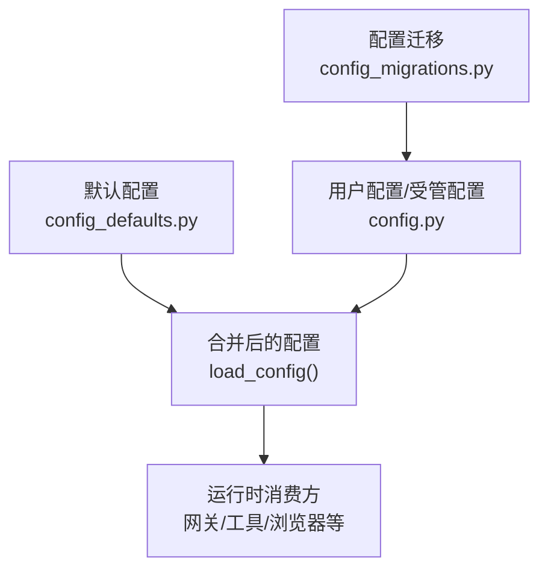
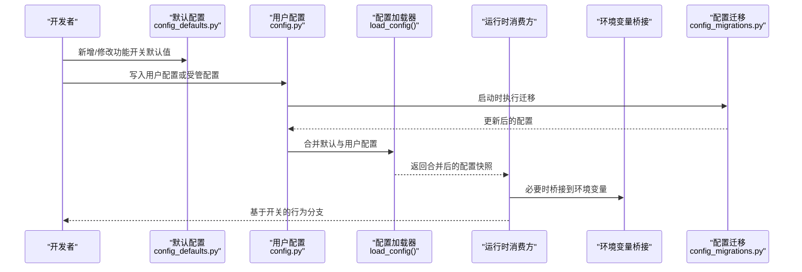
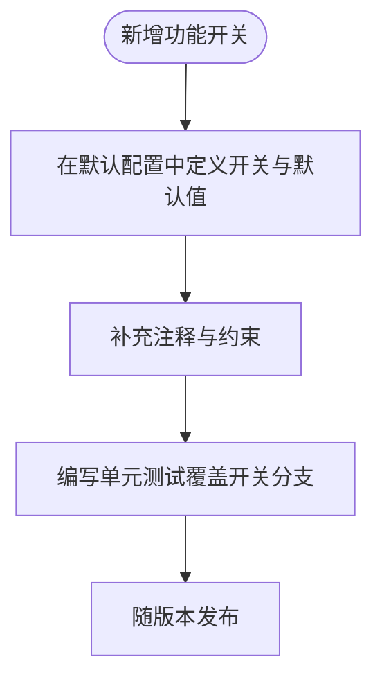
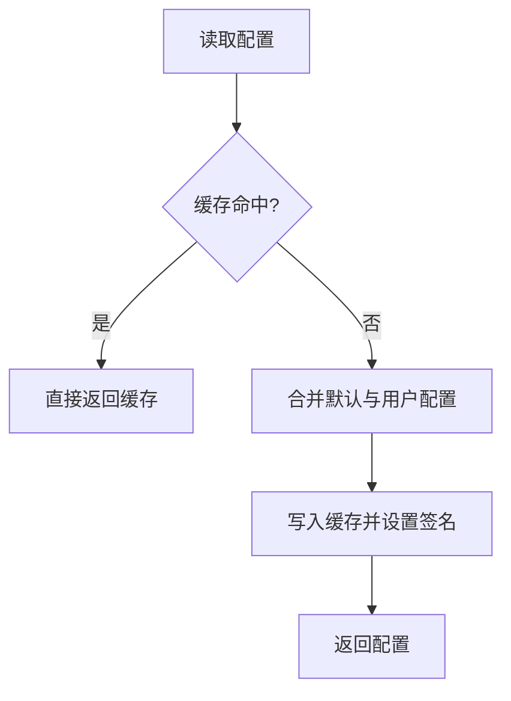
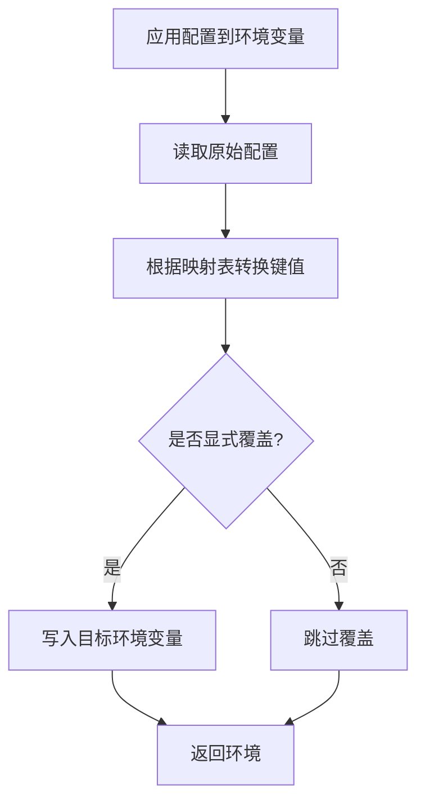
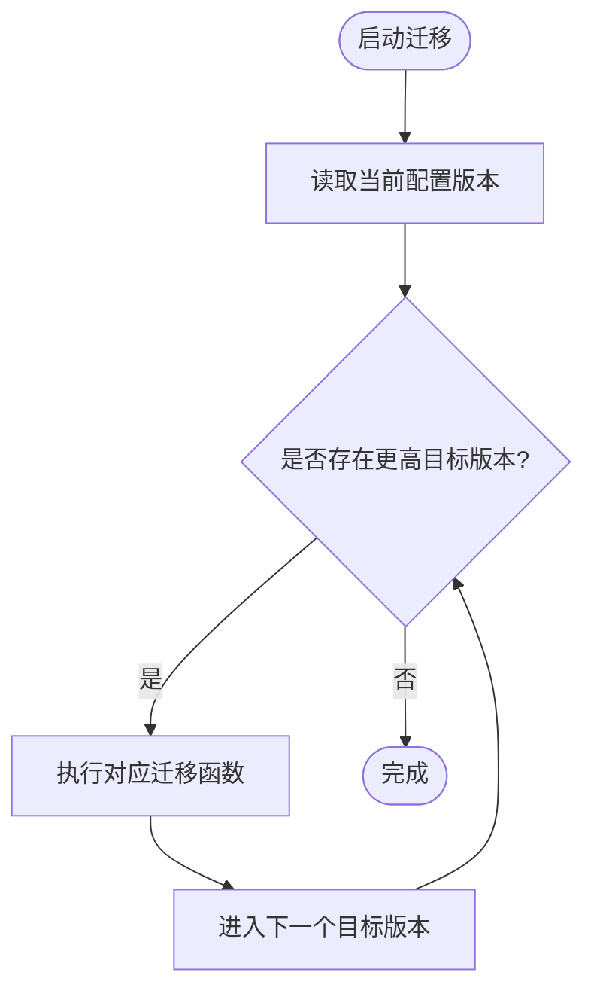
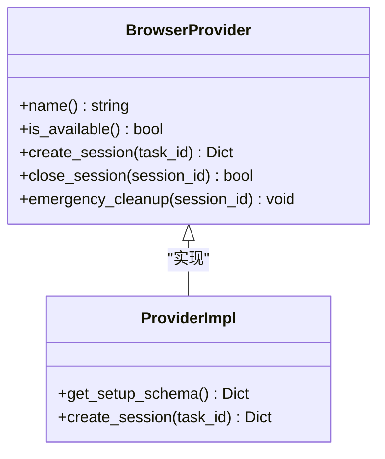
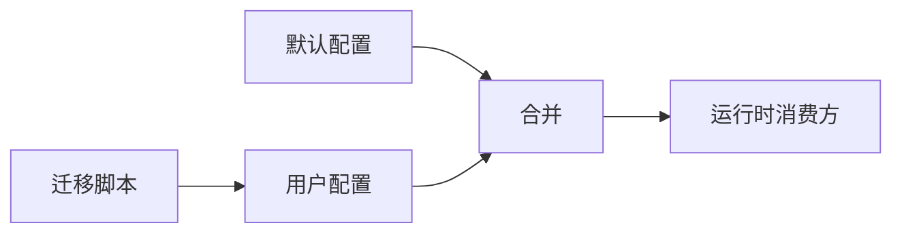

# 功能开关

<cite>
**本文引用的文件**
- [hermes_cli/config.py](file://hermes_cli/config.py)
- [hermes_cli/config_defaults.py](file://hermes_cli/config_defaults.py)
- [hermes_cli/config_migrations.py](file://hermes_cli/config_migrations.py)
- [agent/browser_provider.py](file://agent/browser_provider.py)
- [plugins/browser/browserbase/provider.py](file://plugins/browser/browserbase/provider.py)
- [gateway/relay/__init__.py](file://gateway/relay/__init__.py)
</cite>

## 目录
1. [简介](#简介)
2. [项目结构](#项目结构)
3. [核心组件](#核心组件)
4. [架构总览](#架构总览)
5. [详细组件分析](#详细组件分析)
6. [依赖关系分析](#依赖关系分析)
7. [性能考量](#性能考量)
8. [故障排查指南](#故障排查指南)
9. [结论](#结论)
10. [附录](#附录)

## 简介
本文件面向 Web 仪表板与后端集成，系统化说明 Hermes Agent 的功能开关（Feature Flags）体系：包括运行时配置管理、灰度发布机制、启用/禁用特定功能、功能依赖关系与版本兼容性管理、环境变量映射、动态更新方式，以及最佳实践、安全注意事项和监控指标。文档同时给出新功能开发时的功能开关集成指南与测试策略，帮助团队以可控、可观测的方式逐步上线新能力。

## 项目结构
功能开关在 Hermes 中并非单一模块，而是由“默认配置 + 用户配置 + 迁移脚本 + 运行时读取”共同构成：
- 默认配置集中定义在配置默认值文件中，包含各功能的开关与阈值。
- 用户配置通过 CLI/Gateway 加载并合并，支持按平台/会话维度覆盖。
- 迁移脚本负责历史配置的演进与兼容处理。
- 运行时通过统一的配置读取接口获取开关状态，并在关键路径上消费这些开关。
- 部分功能通过“Labs 开关”或外部标记（如环境变量）控制是否可用，再结合具体配置项生效。

**图表来源**
- [hermes_cli/config_defaults.py:2550-2749](file://hermes_cli/config_defaults.py#L2550-L2749)
- [hermes_cli/config.py:3140-3339](file://hermes_cli/config.py#L3140-L3339)
- [hermes_cli/config_migrations.py:580-686](file://hermes_cli/config_migrations.py#L580-L686)

**章节来源**
- [hermes_cli/config_defaults.py:2550-2749](file://hermes_cli/config_defaults.py#L2550-L2749)
- [hermes_cli/config.py:3140-3339](file://hermes_cli/config.py#L3140-L3339)
- [hermes_cli/config_migrations.py:580-686](file://hermes_cli/config_migrations.py#L580-L686)

## 核心组件
- 配置默认值与开关定义：集中声明功能开关的默认行为与参数范围，便于统一治理。
- 配置加载与缓存：提供高性能读取路径，避免重复深拷贝带来的开销，保障高频调用场景下的稳定性。
- 环境变量桥接：将 terminal.* 等配置键映射到进程环境变量，供子进程/工具链使用。
- 配置迁移：对历史配置进行平滑升级，确保新旧版本兼容。
- 运行时开关消费：网关、工具、浏览器提供者等按需读取开关，实现细粒度功能控制。

**章节来源**
- [hermes_cli/config_defaults.py:2550-2749](file://hermes_cli/config_defaults.py#L2550-L2749)
- [hermes_cli/config.py:3140-3339](file://hermes_cli/config.py#L3140-L3339)
- [hermes_cli/config_migrations.py:580-686](file://hermes_cli/config_migrations.py#L580-L686)

## 架构总览
下图展示了功能开关从“默认配置 → 用户配置 → 合并缓存 → 运行时消费”的全链路流程，以及环境变量桥接与迁移的作用点。

**图表来源**
- [hermes_cli/config_defaults.py:2550-2749](file://hermes_cli/config_defaults.py#L2550-L2749)
- [hermes_cli/config.py:3140-3339](file://hermes_cli/config.py#L3140-L3339)
- [hermes_cli/config_migrations.py:580-686](file://hermes_cli/config_migrations.py#L580-L686)

## 详细组件分析

### 配置默认值与开关定义
- 默认配置集中定义了多项功能开关，例如消息时间戳注入、媒体上传大小限制、流式传输开关、会话自动清理等。
- 某些特性采用“Labs 开关”模式：整体可用性由外部标记（如环境变量）决定，而内部阈值由配置项控制。
- 建议为每个新增功能在默认配置中明确默认值、取值范围与注释，便于后续迁移与审计。

**章节来源**
- [hermes_cli/config_defaults.py:2550-2749](file://hermes_cli/config_defaults.py#L2550-L2749)

### 配置加载与缓存
- 配置加载器提供高性能读取路径，避免每次调用都进行深拷贝，减少分配与 GC 压力。
- 合并逻辑考虑用户配置与受管配置，并通过签名（mtime/size）失效缓存，保证配置变更及时生效。
- 对于高频读取路径（如 agent 循环），推荐使用无深拷贝的快速读取接口。

**章节来源**
- [hermes_cli/config.py:3140-3339](file://hermes_cli/config.py#L3140-L3339)

### 环境变量桥接
- 提供 terminal.* 配置键与环境变量的映射表，支持将配置项写入子进程环境，使工具链无需导入完整 CLI 即可读取配置。
- 桥接逻辑尊重显式配置优先原则，仅在缺失时回填默认值，避免覆盖已有环境变量。
- 该机制可用于灰度发布中的“按进程/容器维度”开启或关闭某项能力。

**章节来源**
- [hermes_cli/config.py:3183-3304](file://hermes_cli/config.py#L3183-L3304)

### 配置迁移与版本兼容
- 迁移脚本维护一个有序的版本阶梯，按目标版本顺序执行迁移函数，确保历史配置平滑升级到新版本。
- 迁移过程中会记录变更结果，便于审计与回滚决策。
- 建议在引入破坏性变更时，通过迁移脚本将旧键折叠到新键，并保留用户显式设置的优先级。

**章节来源**
- [hermes_cli/config_migrations.py:580-686](file://hermes_cli/config_migrations.py#L580-L686)

### 运行时开关消费示例：浏览器提供者
- 浏览器提供者接口约定会话元数据中包含“已启用的功能标志”，用于下游追踪与计费关联。
- 具体提供者可在创建会话时计算并填充 features 字段，体现灰度与能力组合。
- 该设计允许在不同提供商之间统一暴露功能开关语义，便于前端仪表板展示与管控。

**图表来源**
- [agent/browser_provider.py:25-178](file://agent/browser_provider.py#L25-L178)
- [plugins/browser/browserbase/provider.py:108-206](file://plugins/browser/browserbase/provider.py#L108-L206)

**章节来源**
- [agent/browser_provider.py:25-178](file://agent/browser_provider.py#L25-L178)
- [plugins/browser/browserbase/provider.py:108-206](file://plugins/browser/browserbase/provider.py#L108-L206)

### 灰度发布机制
- 灰度发布可通过“Labs 开关 + 环境变量 + 配置项”的组合实现：
  - Labs 开关决定功能是否可用（通常由外部标记控制）。
  - 环境变量用于进程/容器级灰度（如 HERMES_SCALE_TO_ZERO）。
  - 配置项用于更细粒度的阈值与行为控制。
- 建议灰度策略：先小流量验证，再逐步扩大；配合监控指标与快速回滚能力。

**章节来源**
- [hermes_cli/config_defaults.py:2550-2749](file://hermes_cli/config_defaults.py#L2550-L2749)
- [gateway/relay/__init__.py:13-13](file://gateway/relay/__init__.py#L13-L13)

## 依赖关系分析
功能开关的依赖关系主要体现在“配置层 → 运行时层”的单向消费：
- 默认配置与用户配置共同决定最终开关状态。
- 迁移脚本仅影响配置存储形态，不改变运行时语义。
- 运行时消费方（网关、工具、浏览器等）只读取最终配置，不关心来源。

**图表来源**
- [hermes_cli/config_defaults.py:2550-2749](file://hermes_cli/config_defaults.py#L2550-L2749)
- [hermes_cli/config.py:3140-3339](file://hermes_cli/config.py#L3140-L3339)
- [hermes_cli/config_migrations.py:580-686](file://hermes_cli/config_migrations.py#L580-L686)

**章节来源**
- [hermes_cli/config_defaults.py:2550-2749](file://hermes_cli/config_defaults.py#L2550-L2749)
- [hermes_cli/config.py:3140-3339](file://hermes_cli/config.py#L3140-L3339)
- [hermes_cli/config_migrations.py:580-686](file://hermes_cli/config_migrations.py#L580-L686)

## 性能考量
- 配置读取路径已优化：避免不必要的深拷贝，降低高频调用下的分配与 GC 压力。
- 缓存失效基于文件签名（mtime/size），兼顾正确性与性能。
- 环境变量桥接仅在需要时写入，避免污染无关进程环境。
- 建议在灰度期间监控配置读取次数与耗时，确保新增开关不会引入性能回归。

[本节为通用指导，不直接分析具体文件]

## 故障排查指南
- 配置未生效：检查用户配置是否被迁移脚本覆盖；确认合并逻辑是否正确；验证环境变量是否被显式覆盖。
- 灰度异常：核对 Labs 开关与相关环境变量；确认功能依赖是否满足；查看运行时日志中开关消费点。
- 性能问题：关注配置读取热点路径；评估是否需要引入本地缓存或延迟初始化。
- 兼容性问题：审查迁移脚本是否遗漏旧键；确保新键具备合理默认值。

[本节为通用指导，不直接分析具体文件]

## 结论
Hermes 的功能开关体系以“默认配置 + 用户配置 + 迁移脚本 + 运行时消费”为核心，结合环境变量桥接与 Labs 开关，实现了灵活、可控、可观测的功能治理能力。通过合理的灰度策略、完善的监控指标与严格的测试覆盖，可以在不影响稳定性的前提下持续交付新功能。

[本节为总结性内容，不直接分析具体文件]

## 附录

### 新功能开发时的功能开关集成指南
- 在默认配置中新增开关，明确默认值与约束。
- 在运行时消费点增加条件分支，基于开关调整行为。
- 如需进程/容器级灰度，添加环境变量桥接。
- 编写单元测试覆盖开关分支与边界情况。
- 如涉及破坏性变更，编写迁移脚本并确保向后兼容。

**章节来源**
- [hermes_cli/config_defaults.py:2550-2749](file://hermes_cli/config_defaults.py#L2550-L2749)
- [hermes_cli/config.py:3140-3339](file://hermes_cli/config.py#L3140-L3339)
- [hermes_cli/config_migrations.py:580-686](file://hermes_cli/config_migrations.py#L580-L686)

### 测试策略
- 单元层面：针对开关分支编写用例，覆盖开启/关闭、默认值、越界值等场景。
- 集成层面：模拟配置合并与迁移过程，验证最终开关状态符合预期。
- 灰度层面：通过环境变量与 Labs 开关组合，验证不同灰度阶段的正确性。
- 性能层面：压测配置读取路径，确保新增开关未引入性能退化。

[本节为通用指导，不直接分析具体文件]