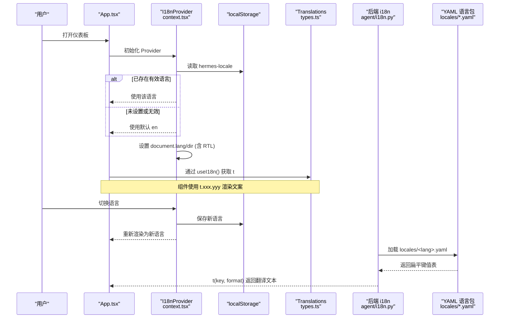
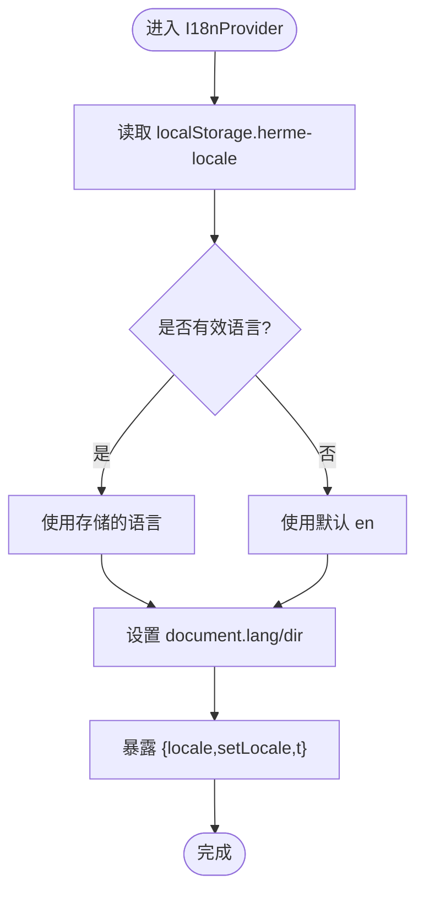
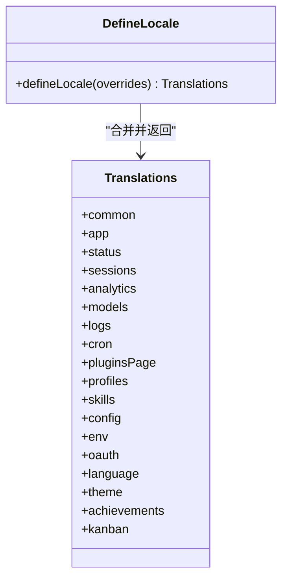
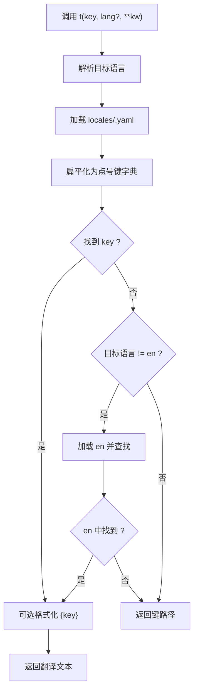
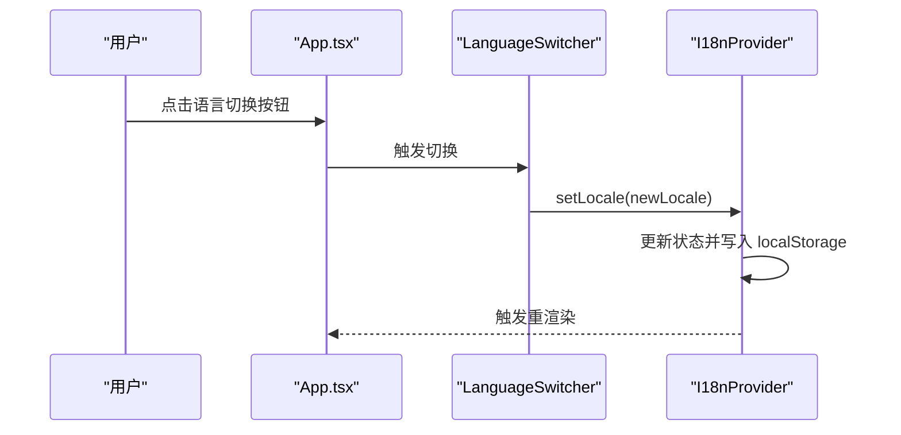
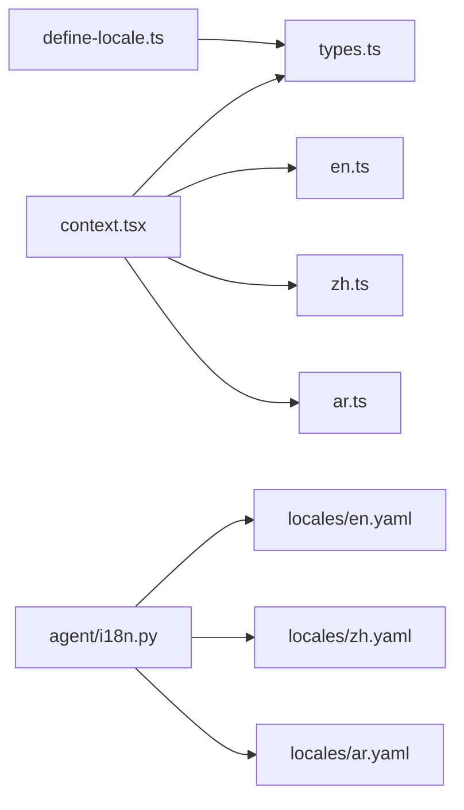

# 国际化配置

<cite>
**本文引用的文件**
- [agent/i18n.py](file://agent/i18n.py)
- [web/src/i18n/context.tsx](file://web/src/i18n/context.tsx)
- [web/src/i18n/types.ts](file://web/src/i18n/types.ts)
- [web/src/i18n/define-locale.ts](file://web/src/i18n/define-locale.ts)
- [web/src/i18n/index.ts](file://web/src/i18n/index.ts)
- [locales/en.yaml](file://locales/en.yaml)
- [locales/ar.yaml](file://locales/ar.yaml)
- [locales/zh.yaml](file://locales/zh.yaml)
- [web/src/App.tsx](file://web/src/App.tsx)
</cite>

## 目录
1. [简介](#简介)
2. [项目结构](#项目结构)
3. [核心组件](#核心组件)
4. [架构总览](#架构总览)
5. [详细组件分析](#详细组件分析)
6. [依赖关系分析](#依赖关系分析)
7. [性能考虑](#性能考虑)
8. [故障排查指南](#故障排查指南)
9. [结论](#结论)
10. [附录](#附录)

## 简介
本文件面向 Web 仪表板的国际化（i18n）配置，覆盖多语言支持架构、语言包结构与翻译文件组织方式；说明如何添加新语言、更新现有翻译与管理语言切换；解释 i18n 配置选项、默认语言设置与区域特定格式化规则；提供翻译最佳实践、字符串提取与质量检查流程建议；并包含 RTL 语言支持与复数形式处理的技术实现要点。

## 项目结构
Web 仪表板采用“前端 React 上下文 + 后端 Python 轻量 i18n”的双层方案：
- 前端（React）：通过 Context 提供当前语言、翻译对象与切换能力，持久化到 localStorage，自动设置文档方向（RTL/LTR）。
- 后端（Python）：为 CLI/Gateway 等静态用户可见消息提供轻量 i18n，基于 YAML 目录加载与缓存。

```mermaid
graph TB
subgraph "前端 Web"
A["I18nProvider<br/>context.tsx"] --> B["useI18n()<br/>context.tsx"]
B --> C["翻译对象 Translations<br/>types.ts"]
A --> D["语言元数据 LOCALE_META<br/>context.tsx"]
A --> E["RTL 支持<br/>context.tsx"]
end
subgraph "后端 Python"
F["t()/get_language()<br/>agent/i18n.py"] --> G["YAML 语言包<br/>locales/*.yaml"]
F --> H["语言别名/归一化<br/>agent/i18n.py"]
end
A -.->|UI 使用 t()| C
F -.->|CLI/Gateway 使用| G
```

**图表来源**
- [web/src/i18n/context.tsx:21-74](file://web/src/i18n/context.tsx#L21-L74)
- [web/src/i18n/context.tsx:103-137](file://web/src/i18n/context.tsx#L103-L137)
- [web/src/i18n/types.ts:1-18](file://web/src/i18n/types.ts#L1-L18)
- [agent/i18n.py:43-85](file://agent/i18n.py#L43-L85)
- [agent/i18n.py:145-177](file://agent/i18n.py#L145-L177)

**章节来源**
- [web/src/i18n/context.tsx:21-74](file://web/src/i18n/context.tsx#L21-L74)
- [web/src/i18n/context.tsx:103-137](file://web/src/i18n/context.tsx#L103-L137)
- [web/src/i18n/types.ts:1-18](file://web/src/i18n/types.ts#L1-L18)
- [agent/i18n.py:43-85](file://agent/i18n.py#L43-L85)
- [agent/i18n.py:145-177](file://agent/i18n.py#L145-L177)

## 核心组件
- 前端 I18nProvider：维护 locale、setLocale、t（翻译对象），写入 localStorage，设置 document.lang/dir，管理 RTL。
- 类型定义 Translations：强类型约束所有页面文案键，新增语言只需声明 Locale 并实现对应翻译对象。
- define-locale：允许以“部分覆盖”的方式定义新语言，缺失键回退到英文，降低维护成本。
- 后端 i18n：提供 t(key, lang?, **kwargs) 与 get_language()，从 YAML 加载并按优先级解析语言。

**章节来源**
- [web/src/i18n/context.tsx:103-137](file://web/src/i18n/context.tsx#L103-L137)
- [web/src/i18n/types.ts:20-800](file://web/src/i18n/types.ts#L20-L800)
- [web/src/i18n/define-locale.ts:25-46](file://web/src/i18n/define-locale.ts#L25-L46)
- [agent/i18n.py:221-273](file://agent/i18n.py#L221-L273)

## 架构总览
下图展示 Web 仪表板中语言选择、渲染与持久化的完整流程，以及后端 i18n 的加载与回退机制。



**图表来源**
- [web/src/i18n/context.tsx:81-119](file://web/src/i18n/context.tsx#L81-L119)
- [web/src/i18n/context.tsx:121-137](file://web/src/i18n/context.tsx#L121-L137)
- [agent/i18n.py:145-177](file://agent/i18n.py#L145-L177)
- [agent/i18n.py:221-273](file://agent/i18n.py#L221-L273)

## 详细组件分析

### 前端 I18nProvider（语言上下文与 RTL）
- 职责：
  - 维护当前 locale，并提供 setLocale。
  - 将 locale 持久化到 localStorage（键名固定）。
  - 根据 locale 设置 document.documentElement.lang 与 dir（RTL 支持）。
  - 暴露 t（当前语言的翻译对象）供组件消费。
- RTL 支持：
  - 维护 RTL_LOCALES 集合，当前仅包含 ar（阿拉伯语）。
  - 切换语言时自动设置 dir="rtl"，使 Tailwind 逻辑边距/对齐生效。
- 默认语言：
  - 若本地存储为空或无效，则回退到 en。



**图表来源**
- [web/src/i18n/context.tsx:81-119](file://web/src/i18n/context.tsx#L81-L119)
- [web/src/i18n/context.tsx:121-137](file://web/src/i18n/context.tsx#L121-L137)

**章节来源**
- [web/src/i18n/context.tsx:21-74](file://web/src/i18n/context.tsx#L21-L74)
- [web/src/i18n/context.tsx:81-137](file://web/src/i18n/context.tsx#L81-L137)

### 翻译类型与部分覆盖（define-locale）
- Translations 类型在 types.ts 中统一定义了所有页面的文案键，确保类型安全。
- define-locale 提供“部分覆盖”能力：新语言只需实现差异部分，缺失键自动回退到英文，同时仍受类型检查约束。



**图表来源**
- [web/src/i18n/types.ts:20-800](file://web/src/i18n/types.ts#L20-L800)
- [web/src/i18n/define-locale.ts:25-46](file://web/src/i18n/define-locale.ts#L25-L46)

**章节来源**
- [web/src/i18n/types.ts:1-18](file://web/src/i18n/types.ts#L1-L18)
- [web/src/i18n/types.ts:20-800](file://web/src/i18n/types.ts#L20-L800)
- [web/src/i18n/define-locale.ts:25-46](file://web/src/i18n/define-locale.ts#L25-L46)

### 后端 i18n（YAML 语言包与回退）
- 语言解析优先级：
  1) 显式传入 lang
  2) 环境变量 HERMES_LANGUAGE
  3) 配置文件 display.language
  4) 默认 en
- 语言包位置：
  - 优先使用 HERMES_BUNDLED_LOCALES 指向的目录
  - 否则使用仓库根下的 locales 目录
- 加载与缓存：
  - 按语言加载 YAML，内部扁平化为点号键
  - 进程内缓存，避免重复 IO
- 回退策略：
  - 目标语言缺失键时回退到 en
  - en 也缺失时返回键本身，保证健壮性
- 格式化：
  - 支持 str.format 占位符（如 {count}）



**图表来源**
- [agent/i18n.py:221-273](file://agent/i18n.py#L221-L273)
- [agent/i18n.py:145-177](file://agent/i18n.py#L145-L177)
- [agent/i18n.py:91-118](file://agent/i18n.py#L91-L118)

**章节来源**
- [agent/i18n.py:43-85](file://agent/i18n.py#L43-L85)
- [agent/i18n.py:91-118](file://agent/i18n.py#L91-L118)
- [agent/i18n.py:145-177](file://agent/i18n.py#L145-L177)
- [agent/i18n.py:221-273](file://agent/i18n.py#L221-L273)

### 语言切换入口（侧边栏）
- App.tsx 在侧边栏底部集成 LanguageSwitcher，并通过 useI18n().t.language.switchTo 显示提示文案。
- 切换后由 I18nProvider 持久化并刷新 UI。



**图表来源**
- [web/src/App.tsx:718-732](file://web/src/App.tsx#L718-L732)
- [web/src/i18n/context.tsx:103-119](file://web/src/i18n/context.tsx#L103-L119)

**章节来源**
- [web/src/App.tsx:718-732](file://web/src/App.tsx#L718-L732)
- [web/src/i18n/context.tsx:103-119](file://web/src/i18n/context.tsx#L103-L119)

## 依赖关系分析
- 前端依赖：
  - context.tsx 聚合各语言模块（en, zh, zh-hant, ja, de, es, fr, tr, uk, af, ko, it, ga, pt, ru, hu, ar）。
  - types.ts 提供强类型约束。
  - define-locale.ts 提供部分覆盖工具。
- 后端依赖：
  - agent/i18n.py 依赖 PyYAML 与 hermes_cli.config（用于读取 display.language）。
  - 语言包位于 locales/*.yaml。



**图表来源**
- [web/src/i18n/context.tsx:21-39](file://web/src/i18n/context.tsx#L21-L39)
- [web/src/i18n/types.ts:1-18](file://web/src/i18n/types.ts#L1-L18)
- [web/src/i18n/define-locale.ts:1-2](file://web/src/i18n/define-locale.ts#L1-L2)
- [agent/i18n.py:145-177](file://agent/i18n.py#L145-L177)

**章节来源**
- [web/src/i18n/context.tsx:21-39](file://web/src/i18n/context.tsx#L21-L39)
- [web/src/i18n/types.ts:1-18](file://web/src/i18n/types.ts#L1-L18)
- [web/src/i18n/define-locale.ts:1-2](file://web/src/i18n/define-locale.ts#L1-L2)
- [agent/i18n.py:145-177](file://agent/i18n.py#L145-L177)

## 性能考虑
- 前端：
  - 语言切换通过 React 状态更新，开销小。
  - 翻译对象直接引用，避免运行时拼接。
- 后端：
  - YAML 加载结果按语言缓存，减少 IO。
  - 配置语言读取使用 lru_cache 缓存一次，避免热路径重复读取。
  - 缺失键快速回退，避免异常分支。

[本节为通用指导，不直接分析具体文件]

## 故障排查指南
- 前端语言不生效：
  - 检查 localStorage 中的 hermes-locale 是否为受支持的值。
  - 确认 I18nProvider 已包裹应用根节点。
  - 查看浏览器控制台是否有错误。
- 后端翻译缺失：
  - 检查 locales/<lang>.yaml 是否存在且可被加载。
  - 确认 key 路径正确，必要时启用调试日志定位缺失键。
- 格式化失败：
  - 后端 t() 使用 str.format，若占位符不匹配会记录警告并返回原文本。
- 配置变更未生效：
  - 后端需调用 reset_language_cache() 清除缓存以读取新的 display.language。

**章节来源**
- [web/src/i18n/context.tsx:81-119](file://web/src/i18n/context.tsx#L81-L119)
- [agent/i18n.py:190-218](file://agent/i18n.py#L190-L218)
- [agent/i18n.py:264-273](file://agent/i18n.py#L264-L273)

## 结论
本项目通过前后端协同实现了稳健的国际化能力：前端基于 React Context 提供类型安全的翻译与 RTL 支持，后端基于 YAML 提供轻量、可缓存、可回退的翻译服务。遵循本文档的规范与流程，可高效扩展新语言、维护翻译质量并确保用户体验一致。

[本节为总结，不直接分析具体文件]

## 附录

### 如何添加新语言（前端）
- 步骤：
  1) 在 web/src/i18n 下新增语言文件（例如 xx.ts），使用 define-locale 进行部分覆盖。
  2) 在 context.tsx 中导入并注册该语言到 TRANSLATIONS 与 LOCALE_META。
  3) 在 types.ts 的 Locale 联合类型中添加新代码。
  4) 如需后端支持，创建 locales/xx.yaml 并在后端 i18n 中注册（如需别名）。
- 注意事项：
  - 使用 define-locale 可减少重复工作，缺失键回退到英文。
  - 保持键命名一致，便于后续维护。

**章节来源**
- [web/src/i18n/define-locale.ts:25-46](file://web/src/i18n/define-locale.ts#L25-L46)
- [web/src/i18n/context.tsx:21-74](file://web/src/i18n/context.tsx#L21-L74)
- [web/src/i18n/types.ts:1-18](file://web/src/i18n/types.ts#L1-L18)

### 如何添加新语言（后端）
- 步骤：
  1) 在 locales 目录下新增 xx.yaml，使用嵌套结构提升可读性，系统会自动扁平化。
  2) 如需别名（如 zh-CN -> zh），在 SUPPORTED_LANGUAGES 或 _LANGUAGE_ALIASES 中补充。
  3) 验证 t("key", lang="xx") 能正确返回翻译。
- 回退策略：
  - 目标语言缺失键时回退到 en，en 也缺失时返回键路径。

**章节来源**
- [agent/i18n.py:43-85](file://agent/i18n.py#L43-L85)
- [agent/i18n.py:145-177](file://agent/i18n.py#L145-L177)
- [agent/i18n.py:221-273](file://agent/i18n.py#L221-L273)

### 更新现有翻译
- 前端：
  - 修改对应语言的 xx.ts 文件，保持键路径与 types.ts 一致。
  - 可使用 define-locale 仅覆盖变更部分。
- 后端：
  - 修改 locales/xx.yaml 对应键值。
  - 重启或调用 reset_language_cache() 以刷新缓存。

**章节来源**
- [web/src/i18n/define-locale.ts:25-46](file://web/src/i18n/define-locale.ts#L25-L46)
- [agent/i18n.py:190-218](file://agent/i18n.py#L190-L218)

### 管理语言切换功能
- 前端：
  - 通过 I18nProvider.setLocale 切换语言，自动持久化到 localStorage。
  - 侧边栏集成 LanguageSwitcher，文案来自 t.language.switchTo。
- 后端：
  - 通过环境变量 HERMES_LANGUAGE 或配置 display.language 控制语言。
  - 支持显式 lang 参数覆盖。

**章节来源**
- [web/src/i18n/context.tsx:103-119](file://web/src/i18n/context.tsx#L103-L119)
- [web/src/App.tsx:718-732](file://web/src/App.tsx#L718-L732)
- [agent/i18n.py:221-273](file://agent/i18n.py#L221-L273)

### i18n 配置选项与默认语言
- 前端默认语言：
  - 若本地存储无效或未设置，默认使用 en。
- 后端默认语言：
  - 默认 en，可通过环境变量或配置覆盖。
- 区域特定格式化：
  - 后端支持 str.format 占位符（如 {count}）。
  - 前端建议使用模板字符串或库（如 Intl.NumberFormat）进行数值/日期格式化。

**章节来源**
- [web/src/i18n/context.tsx:81-89](file://web/src/i18n/context.tsx#L81-L89)
- [agent/i18n.py:221-273](file://agent/i18n.py#L221-L273)

### 区域特定格式化规则
- 前端：
  - 数字、货币、日期建议使用 Intl API，结合当前 locale 进行格式化。
- 后端：
  - 使用 str.format 占位符；复杂格式建议在调用方处理。

[本节为通用指导，不直接分析具体文件]

### 翻译最佳实践
- 键命名：
  - 使用语义化点号键（如 app.brand、sessions.title）。
  - 保持前后端键空间分离，避免冲突。
- 内容：
  - 避免硬编码字符串，统一通过 t() 获取。
  - 短句优先，便于翻译与维护。
- 质量：
  - 使用类型检查（前端）与单元测试（后端）保障一致性。
  - 定期审计缺失键与未翻译项。

[本节为通用指导，不直接分析具体文件]

### 字符串提取工具（建议）
- 前端：
  - 使用 AST 扫描 .tsx/.ts 中的 t.xxx.yyy 调用，生成待翻译清单。
  - 与 TypeScript 类型对比，识别缺失键。
- 后端：
  - 扫描 Python 源码中的 t("...") 调用，提取键列表。
  - 与 locales/*.yaml 对比，生成差异报告。

[本节为通用指导，不直接分析具体文件]

### 翻译质量检查流程（建议）
- 自动化：
  - CI 中运行类型检查（前端）与单元测试（后端）。
  - 执行字符串提取与差异比对脚本。
- 人工：
  - 关键文案（错误提示、用户引导）需人工复核。
  - 对 RTL 语言进行视觉回归测试。

[本节为通用指导，不直接分析具体文件]

### RTL 语言支持
- 前端：
  - 维护 RTL_LOCALES 集合，切换语言时设置 document.dir="rtl"。
  - 使用 Tailwind 逻辑边距/对齐类（ms-/me-, ps-/pe-）确保布局正确。
- 后端：
  - 不影响后端逻辑，但需在 UI 层正确处理方向。

**章节来源**
- [web/src/i18n/context.tsx:41-43](file://web/src/i18n/context.tsx#L41-L43)
- [web/src/i18n/context.tsx:115-119](file://web/src/i18n/context.tsx#L115-L119)

### 复数形式处理
- 前端：
  - 当前 Translations 类型中包含 common.other 等键，可用于简单复数场景。
  - 更复杂的复数建议使用 Intl.PluralRules 或第三方库。
- 后端：
  - 当前 t() 不支持内置复数规则，可在调用方根据 count 选择不同键或使用条件拼接。

**章节来源**
- [web/src/i18n/types.ts:20-70](file://web/src/i18n/types.ts#L20-L70)
- [agent/i18n.py:232-273](file://agent/i18n.py#L232-L273)