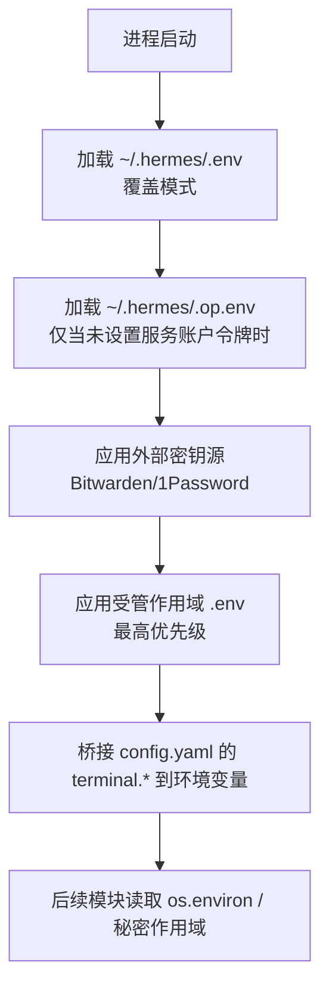
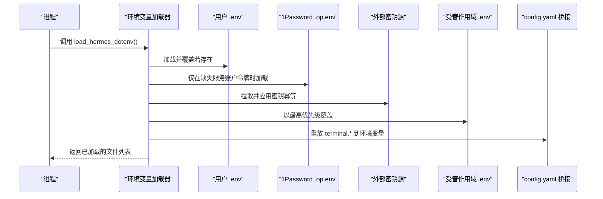
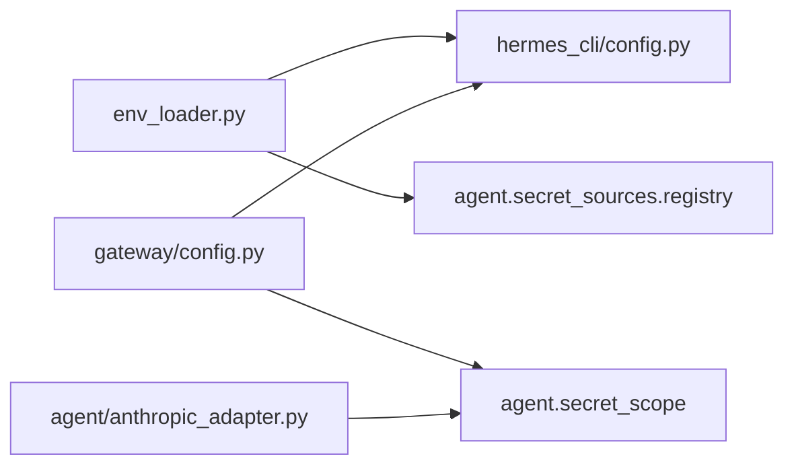

# 环境变量配置

<cite>
**本文引用的文件**
- [hermes_cli/env_loader.py](file://hermes_cli/env_loader.py)
- [hermes_cli/config.py](file://hermes_cli/config.py)
- [gateway/config.py](file://gateway/config.py)
- [acp_adapter/server.py](file://acp_adapter/server.py)
- [agent/anthropic_adapter.py](file://agent/anthropic_adapter.py)
- [docker-compose.yml](file://docker-compose.yml)
- [Dockerfile](file://Dockerfile)
</cite>

## 目录
1. [简介](#简介)
2. [项目结构](#项目结构)
3. [核心组件](#核心组件)
4. [架构总览](#架构总览)
5. [详细组件分析](#详细组件分析)
6. [依赖关系分析](#依赖关系分析)
7. [性能考量](#性能考量)
8. [故障排查指南](#故障排查指南)
9. [结论](#结论)
10. [附录](#附录)

## 简介
本文件面向 Web 仪表板与后端服务的环境变量配置，系统化说明：
- 环境变量分类、加载顺序与作用域管理
- 开发、测试、生产环境的差异与安全设置
- 环境变量验证规则、默认值处理与错误处理机制
- 各环境配置模板、最佳实践与安全加固建议
- 容器化部署中的环境变量注入方式与 Kubernetes ConfigMap 集成方法

## 项目结构
本项目将“配置”与“密钥”分离：
- 配置文件：~/.hermes/config.yaml（功能开关、平台、终端等）
- 密钥与环境：~/.hermes/.env（API Key、Token 等），以及可选的 .op.env（1Password 服务账户令牌）
- 受管作用域：机器级 managed-scope 的 .env，最后覆盖用户与环境变量
- 外部密钥源：Bitwarden、1Password 等通过 secrets 配置注入

图表来源
- [hermes_cli/env_loader.py:462-529](file://hermes_cli/env_loader.py#L462-L529)
- [hermes_cli/env_loader.py:559-589](file://hermes_cli/env_loader.py#L559-L589)
- [hermes_cli/env_loader.py:591-687](file://hermes_cli/env_loader.py#L591-L687)

章节来源
- [hermes_cli/env_loader.py:462-529](file://hermes_cli/env_loader.py#L462-L529)
- [hermes_cli/env_loader.py:559-589](file://hermes_cli/env_loader.py#L559-L589)
- [hermes_cli/env_loader.py:591-687](file://hermes_cli/env_loader.py#L591-L687)

## 核心组件
- 环境变量加载器：统一入口负责加载、清洗、合并、安全校验与来源追踪
- 配置中心：提供配置路径、安装方式检测、写入保护与受管模式提示
- 网关配置：提供布尔/数值/枚举规范化、运行时 truthy 解析、平台相关键映射
- 适配器层：按角色读取密钥（优先使用秘密作用域），保证跨会话隔离

章节来源
- [hermes_cli/env_loader.py:16-52](file://hermes_cli/env_loader.py#L16-L52)
- [hermes_cli/config.py:158-216](file://hermes_cli/config.py#L158-L216)
- [gateway/config.py:234-254](file://gateway/config.py#L234-L254)
- [agent/anthropic_adapter.py:30-33](file://agent/anthropic_adapter.py#L30-L33)

## 架构总览
环境变量从多个来源汇聚，遵循严格的优先级与清理策略，确保可审计、可回退、可热重载。

图表来源
- [hermes_cli/env_loader.py:462-529](file://hermes_cli/env_loader.py#L462-L529)
- [hermes_cli/env_loader.py:559-589](file://hermes_cli/env_loader.py#L559-L589)
- [hermes_cli/env_loader.py:591-687](file://hermes_cli/env_loader.py#L591-L687)

## 详细组件分析

### 环境变量加载顺序与作用域
- 加载顺序
  1) 用户 ~/.hermes/.env（覆盖模式）
  2) 可选 ~/.hermes/.op.env（仅当未设置 OP_SERVICE_ACCOUNT_TOKEN 时）
  3) 外部密钥源（Bitwarden/1Password 等，幂等，失败不阻塞）
  4) 受管作用域 .env（最高优先级，覆盖用户与环境）
  5) 重放 config.yaml 的 terminal.* 到环境变量（最终权威）
- 作用域
  - 进程级 os.environ 会被逐步覆盖
  - 外部密钥源会记录来源以便 UI 展示
  - 受管作用域为机器级，独立于 HERMES_HOME 与 profile

章节来源
- [hermes_cli/env_loader.py:462-529](file://hermes_cli/env_loader.py#L462-L529)
- [hermes_cli/env_loader.py:559-589](file://hermes_cli/env_loader.py#L559-L589)
- [hermes_cli/env_loader.py:591-687](file://hermes_cli/env_loader.py#L591-L687)

### 安全与清洗策略
- 凭据清洗：对名称以 _API_KEY/_TOKEN/_SECRET/_KEY 结尾的变量进行 ASCII 清洗，移除非 ASCII 字符并输出警告
- 文件预清洗：在 python-dotenv 读取前去除 NUL 字节、修复 UTF-16/UTF-8 BOM、拒绝 UTF-32 以避免损坏
- 写保护：禁止通过仪表板写入危险变量名（如 LD_PRELOAD、PATH、HERMES_HOME 等）
- 行为路由键清理：若父进程注入的行为路由键不在当前 profile 的 .env 中，将被清理，避免跨 profile 泄漏

章节来源
- [hermes_cli/env_loader.py:16-21](file://hermes_cli/env_loader.py#L16-L21)
- [hermes_cli/env_loader.py:298-352](file://hermes_cli/env_loader.py#L298-L352)
- [hermes_cli/env_loader.py:355-460](file://hermes_cli/env_loader.py#L355-L460)
- [hermes_cli/config.py:158-216](file://hermes_cli/config.py#L158-L216)
- [hermes_cli/env_loader.py:114-146](file://hermes_cli/env_loader.py#L114-L146)

### 默认值与类型转换
- 布尔值：支持 true/1/yes/on 与 false/0/no/off 等 token；YAML 的 on/off 会被归一化为 auto/off
- 整数/浮点数：非法输入被忽略并记录警告，保持启动可用
- 字符串：空串或空白视为未设置，走默认分支
- 平台相关：token 字段与对应环境变量映射用于空令牌告警

章节来源
- [gateway/config.py:26-37](file://gateway/config.py#L26-L37)
- [gateway/config.py:77-91](file://gateway/config.py#L77-L91)
- [gateway/config.py:94-147](file://gateway/config.py#L94-L147)
- [gateway/config.py:577-590](file://gateway/config.py#L577-L590)

### 错误处理与可恢复性
- 外部密钥源失败：记录错误与建议，但不阻塞启动
- YAML 解析失败：备份损坏的 config.yaml，降级到默认配置并提示修复
- 文件编码异常：自动回退 latin-1 或跳过 UTF-32，避免崩溃
- 并发安全：配置读写加锁，避免多线程竞争导致数据损坏

章节来源
- [hermes_cli/env_loader.py:591-687](file://hermes_cli/env_loader.py#L591-L687)
- [hermes_cli/config.py:45-156](file://hermes_cli/config.py#L45-L156)
- [hermes_cli/env_loader.py:342-352](file://hermes_cli/env_loader.py#L342-L352)
- [hermes_cli/config.py:235-260](file://hermes_cli/config.py#L235-L260)

### 适配器层的密钥读取
- 优先使用当前秘密作用域读取密钥，确保多 profile 隔离
- 若作用域内无值，再回退到 os.environ
- 典型用法：Anthropic 适配器通过封装函数读取密钥

章节来源
- [gateway/config.py:234-254](file://gateway/config.py#L234-L254)
- [agent/anthropic_adapter.py:30-33](file://agent/anthropic_adapter.py#L30-L33)

### 会话级环境变量注入
- 会话 ID 等上下文变量会在会话生命周期内注入/恢复，避免并发干扰
- 适用于 ACP 适配器等需要会话隔离的场景

章节来源
- [acp_adapter/server.py:1905-1926](file://acp_adapter/server.py#L1905-L1926)

## 依赖关系分析
- env_loader 依赖 hermes_cli.config（路径、写入保护）、agent.secret_sources.registry（外部密钥源）
- gateway.config 依赖 hermes_cli.config（路径）、agent.secret_scope（作用域读取）
- 适配器依赖 secret_scope 与 os.environ 作为后备

图表来源
- [hermes_cli/env_loader.py:591-687](file://hermes_cli/env_loader.py#L591-L687)
- [gateway/config.py:234-254](file://gateway/config.py#L234-L254)
- [agent/anthropic_adapter.py:30-33](file://agent/anthropic_adapter.py#L30-L33)

章节来源
- [hermes_cli/env_loader.py:591-687](file://hermes_cli/env_loader.py#L591-L687)
- [gateway/config.py:234-254](file://gateway/config.py#L234-L254)
- [agent/anthropic_adapter.py:30-33](file://agent/anthropic_adapter.py#L30-L33)

## 性能考量
- 配置缓存：基于 mtime/size 的缓存减少重复解析
- 幂等加载：外部密钥源 per-home 幂等，避免重复网络请求
- 最小化 I/O：预清洗与回退策略降低异常路径开销
- 线程安全：配置读写串行化，避免并发竞争

章节来源
- [hermes_cli/config.py:235-260](file://hermes_cli/config.py#L235-L260)
- [hermes_cli/env_loader.py:44-52](file://hermes_cli/env_loader.py#L44-L52)
- [hermes_cli/env_loader.py:614-687](file://hermes_cli/env_loader.py#L614-L687)

## 故障排查指南
- 启动时报错“无法解析 config.yaml”：检查备份文件并修正 YAML 语法
- 密钥无效或认证失败：确认是否包含非 ASCII 字符，重新复制原始密钥
- 外部密钥源失败：查看 stderr 中的错误与建议，检查凭据与服务账户令牌
- 端口冲突或多实例：确认平台绑定端口配置与 multiplex 设置
- 权限问题：检查 HERMES_UID/HERMES_GID 与目录权限

章节来源
- [hermes_cli/config.py:45-156](file://hermes_cli/config.py#L45-L156)
- [hermes_cli/env_loader.py:298-352](file://hermes_cli/env_loader.py#L298-L352)
- [hermes_cli/env_loader.py:591-687](file://hermes_cli/env_loader.py#L591-L687)
- [gateway/config.py:376-417](file://gateway/config.py#L376-L417)

## 结论
本项目通过分层加载、严格清洗、作用域隔离与幂等注入，实现了高可靠、可审计、易运维的环境变量体系。结合容器与编排系统，可在不同环境中快速切换配置与安全策略。

## 附录

### 环境变量分类与示例
- 基础运行类
  - HERMES_HOME：配置与状态根目录
  - HERMES_MANAGED：受管模式标识（NixOS/Homebrew 等）
  - TERMINAL_ENV：终端后端选择（由 config.yaml 最终覆盖）
- 平台与通道类
  - TELEGRAM_BOT_TOKEN、DISCORD_BOT_TOKEN、SLACK_BOT_TOKEN 等
  - HOME_CHANNEL_*：默认目标频道
- 模型与提供商类
  - OPENAI_API_KEY、ANTHROPIC_API_KEY、ANTHROPIC_TOKEN 等
- 可观测性与插件类
  - LANGFUSE_PUBLIC_KEY、LANGFUSE_SECRET_KEY、HERMES_LANGFUSE_ENV 等
- 行为路由与 ACP 类
  - HERMES_ACP_AUTH_METHOD、HERMES_COPILOT_ACP_COMMAND、COPILOT_ACP_BASE_URL 等

章节来源
- [hermes_cli/config.py:263-327](file://hermes_cli/config.py#L263-L327)
- [gateway/config.py:577-590](file://gateway/config.py#L577-L590)

### 各环境配置模板与最佳实践
- 开发环境
  - 使用项目级 .env 作为开发回退，避免污染用户环境
  - 开启调试日志与工具进度显示（通过 config.yaml）
  - 允许本地端口绑定平台（如 webhook/api_server）
- 测试环境
  - 使用最小必要密钥，禁用不必要的平台
  - 固定版本标签与镜像，便于复现
  - 启用会话重置策略，避免长会话影响测试结果
- 生产环境
  - 仅保留必需平台与密钥，关闭冗余通知与指示器
  - 使用外部密钥源（Bitwarden/1Password）注入敏感信息
  - 启用受管作用域 .env 强制覆盖关键参数
  - 限制写入面，禁止通过仪表板修改危险变量

[本节为通用指导，无需具体代码引用]

### 安全加固建议
- 始终使用外部密钥源注入敏感信息，避免明文存储在 .env
- 定期轮换密钥，并在变更后刷新密钥源缓存
- 启用凭据 ASCII 清洗与 NUL 字节防护
- 使用受管作用域锁定关键参数，防止越权覆盖
- 限制进程间传播的环境变量，避免跨 profile 泄漏

章节来源
- [hermes_cli/env_loader.py:298-352](file://hermes_cli/env_loader.py#L298-L352)
- [hermes_cli/env_loader.py:591-687](file://hermes_cli/env_loader.py#L591-L687)
- [hermes_cli/config.py:158-216](file://hermes_cli/config.py#L158-L216)

### 容器化部署与 Kubernetes 集成
- Docker Compose
  - 通过 environment 字段注入环境变量
  - 挂载持久化卷保存 $HERMES_HOME
  - 使用只读配置与动态密钥分离
- Dockerfile
  - 构建阶段不嵌入密钥，运行期通过环境变量注入
  - 使用非 root 用户运行，配合 UID/GID 映射
- Kubernetes
  - 使用 Secret 注入敏感变量（如 *_API_KEY、*_TOKEN）
  - 使用 ConfigMap 注入非敏感配置（如平台开关、终端后端）
  - 通过 initContainer 或 sidecar 拉取外部密钥并写入 Secret
  - 使用 PodSecurityPolicy/SecurityContext 限制权限与能力

章节来源
- [docker-compose.yml:38-72](file://docker-compose.yml#L38-L72)
- [Dockerfile:1-200](file://Dockerfile#L1-L200)