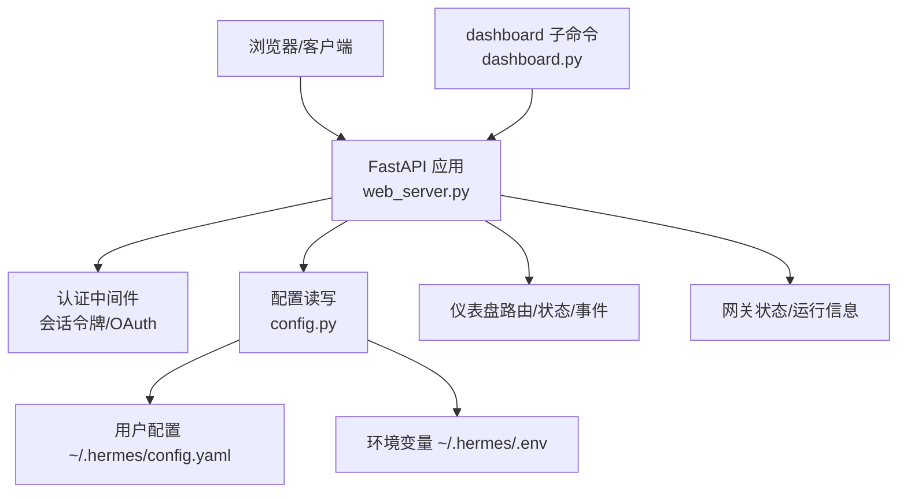
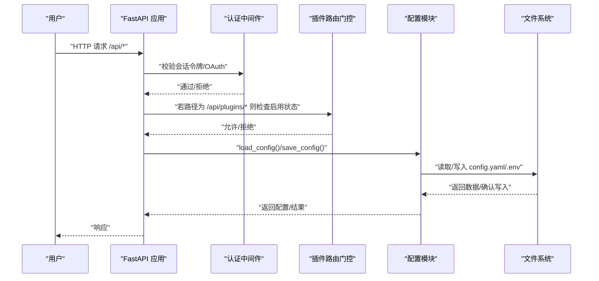
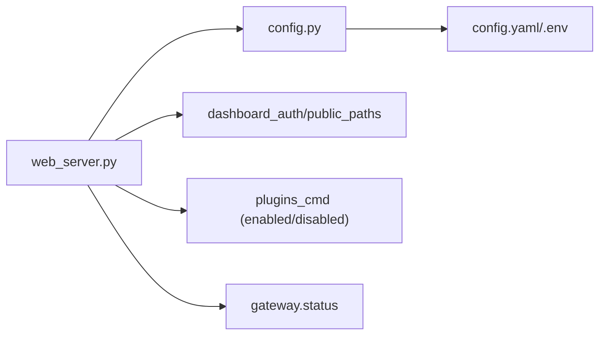

# 配置管理

<cite>
**本文引用的文件**
- [hermes_cli/config.py](file://hermes_cli/config.py)
- [hermes_cli/config_defaults.py](file://hermes_cli/config_defaults.py)
- [cli-config.yaml.example](file://cli-config.yaml.example)
- [hermes_cli/web_server.py](file://hermes_cli/web_server.py)
- [hermes_cli/subcommands/dashboard.py](file://hermes_cli/subcommands/dashboard.py)
</cite>

## 目录
1. [简介](#简介)
2. [项目结构](#项目结构)
3. [核心组件](#核心组件)
4. [架构总览](#架构总览)
5. [详细组件分析](#详细组件分析)
6. [依赖关系分析](#依赖关系分析)
7. [性能考虑](#性能考虑)
8. [故障排查指南](#故障排查指南)
9. [结论](#结论)
10. [附录](#附录)

## 简介
本文件面向系统管理员与运维人员，系统化说明 Hermes Agent Web 仪表板的配置管理：包括配置文件结构、默认值与环境变量映射、主题与语言切换、功能标志位与插件配置、配置校验规则、热重载机制与动态更新，以及开发/测试/生产环境的最佳实践与安全加固建议。文档同时给出关键流程的可视化图示，便于快速定位问题与优化部署。

## 项目结构
Web 仪表板由 FastAPI 后端提供，负责静态前端资源与 REST/WebSocket API；配置加载与持久化由配置模块统一处理；命令行子命令用于启动仪表板或无头后端服务。

**图表来源**
- [hermes_cli/web_server.py:313-671](file://hermes_cli/web_server.py#L313-L671)
- [hermes_cli/config.py:694-700](file://hermes_cli/config.py#L694-L700)
- [hermes_cli/subcommands/dashboard.py:17-85](file://hermes_cli/subcommands/dashboard.py#L17-L85)

**章节来源**
- [hermes_cli/web_server.py:1-135](file://hermes_cli/web_server.py#L1-L135)
- [hermes_cli/subcommands/dashboard.py:1-85](file://hermes_cli/subcommands/dashboard.py#L1-L85)
- [hermes_cli/config.py:694-700](file://hermes_cli/config.py#L694-L700)

## 核心组件
- 配置加载与合并：从用户配置、受管配置（如 NixOS）与环境变量中解析并合并为最终配置对象，具备缓存与并发安全。
- 环境变量写入保护：对危险的环境变量名进行写时拒绝，防止通过仪表板意外修改执行环境。
- 默认配置：集中定义各子系统默认值（数据库、终端、压缩、MCP、工具输出等）。
- Web 服务器：提供认证、CORS、健康检查、插件路由门控、自测任务等能力。
- 命令行入口：dashboard/serve 子命令统一启动后端，支持端口、主机、跳过构建、隔离模式等参数。

**章节来源**
- [hermes_cli/config.py:39-260](file://hermes_cli/config.py#L39-L260)
- [hermes_cli/config_defaults.py:7-120](file://hermes_cli/config_defaults.py#L7-L120)
- [hermes_cli/web_server.py:369-671](file://hermes_cli/web_server.py#L369-L671)
- [hermes_cli/subcommands/dashboard.py:17-85](file://hermes_cli/subcommands/dashboard.py#L17-L85)

## 架构总览
下图展示 Web 仪表板请求到配置读取/写入的关键路径，以及认证与插件门控的位置。

**图表来源**
- [hermes_cli/web_server.py:398-671](file://hermes_cli/web_server.py#L398-L671)
- [hermes_cli/config.py:235-260](file://hermes_cli/config.py#L235-L260)

## 详细组件分析

### 配置结构与默认值
- 配置文件位置：~/.hermes/config.yaml（主配置）、~/.hermes/.env（密钥与环境变量）。
- 默认值来源：config_defaults.py 中的 DEFAULT_CONFIG，涵盖模型、终端、压缩、MCP、工具输出、提示词缓存等。
- 示例配置：cli-config.yaml.example 提供了可复制的配置模板与注释说明。

要点
- 数据库：journal_mode 默认 wal，可选 delete；WAL 相关参数可配置。
- 终端：backend、cwd、超时、HOME 策略、容器镜像与资源限制、网络与卷挂载等。
- 压缩：阈值、目标比例、保护消息数、重试次数、主动修剪、空闲压缩等。
- MCP：自动重载开关、发现超时等。
- 工具输出：最大字节/行数/行长度限制。

**章节来源**
- [hermes_cli/config.py:694-700](file://hermes_cli/config.py#L694-L700)
- [hermes_cli/config_defaults.py:7-120](file://hermes_cli/config_defaults.py#L7-L120)
- [cli-config.yaml.example:15-20](file://cli-config.yaml.example#L15-L20)
- [cli-config.yaml.example:220-337](file://cli-config.yaml.example#L220-L337)
- [cli-config.yaml.example:425-553](file://cli-config.yaml.example#L425-L553)

### 环境变量与映射
- 危险变量名白名单：在写操作时拒绝修改可能影响进程执行或运行时位置的变量（如 LD_*、DYLD_*、PYTHON*、NODE_*、PATH、SHELL、BROWSER、EDITOR、GIT_*、HERMES_HOME/PROFILE/CONFIG/ENV 等）。
- 额外已知变量集合：包含大量平台与集成所需的环境变量键名，供写入器识别与记录。
- 运行时位置控制：通过 HERMES_UID/HERMES_GID 调整目录所有权，确保容器内权限一致。

**章节来源**
- [hermes_cli/config.py:158-233](file://hermes_cli/config.py#L158-L233)
- [hermes_cli/config.py:261-327](file://hermes_cli/config.py#L261-L327)
- [hermes_cli/config.py:706-763](file://hermes_cli/config.py#L706-L763)

### 主题与语言切换
- 主题（皮肤）：仪表板在启动时会预热 skin_engine，并在就绪后解析当前皮肤；具体皮肤选择逻辑由皮肤引擎与配置共同决定。
- 语言：多语言资源位于 locales 目录（例如 zh.yaml、en.yaml），通常由前端根据用户设置或系统语言加载；后端不直接暴露语言切换接口，但可通过配置与前端交互实现。

注意
- 主题与语言属于前端呈现层配置，后端主要提供皮肤解析与必要的配置上下文。

**章节来源**
- [hermes_cli/web_server.py:171-205](file://hermes_cli/web_server.py#L171-L205)
- [locales/zh.yaml](file://locales/zh.yaml)
- [locales/en.yaml](file://locales/en.yaml)

### 功能标志位与插件配置
- 插件路由门控：即使插件已安装，若运行时被禁用，其 API 路由将被拒绝，避免未授权访问。
- 插件启用/禁用：通过仪表板或 CLI 管理，后端在每次请求时对 /api/plugins/* 路径进行检查。
- 功能开关：如 MCP 自动重载、压缩开关、流式传输开关等，均在配置中提供布尔或枚举选项。

**章节来源**
- [hermes_cli/web_server.py:568-632](file://hermes_cli/web_server.py#L568-L632)
- [hermes_cli/config_defaults.py:531-543](file://hermes_cli/config_defaults.py#L531-L543)
- [cli-config.yaml.example:787-792](file://cli-config.yaml.example#L787-L792)

### 配置验证规则
- YAML 解析失败：当配置文件无法解析时，会保留损坏副本并回退到默认配置，同时在日志与标准错误输出警告。
- 并发安全：配置读写使用线程锁保护，避免多线程并发导致的竞争条件。
- 缓存失效：基于文件 mtime/size 与引用环境变量快照进行缓存失效，保证变更及时生效。

**章节来源**
- [hermes_cli/config.py:45-156](file://hermes_cli/config.py#L45-L156)
- [hermes_cli/config.py:235-260](file://hermes_cli/config.py#L235-L260)

### 热重载机制与动态配置更新
- MCP 自动重载：当配置文件中 MCP 部分发生变化时，支持自动重载连接，避免重启服务。
- 配置缓存与失效：保存配置后产生新 inode，下次加载自动重建缓存；环境变量变化也会触发失效。
- 插件运行时门控：禁用插件后立即生效，无需重启。

**章节来源**
- [hermes_cli/config_defaults.py:531-543](file://hermes_cli/config_defaults.py#L531-L543)
- [hermes_cli/config.py:235-248](file://hermes_cli/config.py#L235-L248)
- [hermes_cli/web_server.py:568-632](file://hermes_cli/web_server.py#L568-L632)

### 不同部署环境的配置示例与最佳实践
- 开发环境
  - 本地运行 dashboard，绑定 127.0.0.1，开启浏览器自动打开。
  - 使用默认 WAL 数据库模式；终端 backend 设为 local。
  - 关闭严格的安全限制（仅本地访问）。
- 测试环境
  - 使用 headless serve 模式，跳过前端构建，便于 CI 集成。
  - 限制并发会话与工具输出大小，避免资源耗尽。
  - 启用压缩与主动修剪，减少长会话成本。
- 生产环境
  - 非环回绑定必须启用 OAuth 或密码门控；Host 头校验开启。
  - 使用只读或最小权限的用户运行；必要时通过 HERMES_UID/HERMES_GID 调整目录所有权。
  - 合理设置压缩阈值、MCP 发现超时、工具输出上限与会话清理策略。
  - 使用容器镜像更新策略（docker pull + 重启），避免在容器内执行 hermes update。

**章节来源**
- [hermes_cli/subcommands/dashboard.py:17-85](file://hermes_cli/subcommands/dashboard.py#L17-L85)
- [hermes_cli/web_server.py:369-565](file://hermes_cli/web_server.py#L369-L565)
- [hermes_cli/config.py:706-795](file://hermes_cli/config.py#L706-L795)
- [cli-config.yaml.example:425-553](file://cli-config.yaml.example#L425-L553)

### 管理员优化与安全加固指导
- 安全加固
  - 禁止通过仪表板写入危险环境变量；如需修改，请手动编辑 .env。
  - 非环回绑定强制认证（OAuth/密码），并启用 Host 头校验。
  - 限制 CORS 仅允许 localhost；避免开放 0.0.0.0 且无鉴权。
  - 定期审计插件启用状态与敏感路由访问。
- 性能优化
  - 调整压缩阈值与目标比例，平衡上下文长度与成本。
  - 合理设置 MCP 发现超时与自动重载，避免冷启动阻塞。
  - 控制工具输出大小与并行度，降低内存与带宽压力。
  - 使用代理/缓存（如 OpenRouter 响应缓存）减少重复请求成本。

**章节来源**
- [hermes_cli/config.py:158-233](file://hermes_cli/config.py#L158-L233)
- [hermes_cli/web_server.py:369-565](file://hermes_cli/web_server.py#L369-L565)
- [cli-config.yaml.example:425-553](file://cli-config.yaml.example#L425-L553)

## 依赖关系分析
Web 仪表板依赖配置模块、网关状态模块与插件系统；认证中间件与插件路由门控保障安全与可用性。

**图表来源**
- [hermes_cli/web_server.py:60-101](file://hermes_cli/web_server.py#L60-L101)
- [hermes_cli/web_server.py:393-421](file://hermes_cli/web_server.py#L393-L421)
- [hermes_cli/web_server.py:568-632](file://hermes_cli/web_server.py#L568-L632)
- [hermes_cli/config.py:694-700](file://hermes_cli/config.py#L694-L700)

**章节来源**
- [hermes_cli/web_server.py:60-101](file://hermes_cli/web_server.py#L60-L101)
- [hermes_cli/web_server.py:393-421](file://hermes_cli/web_server.py#L393-L421)
- [hermes_cli/web_server.py:568-632](file://hermes_cli/web_server.py#L568-L632)

## 性能考虑
- 配置加载缓存：基于文件元数据与环境变量快照，避免重复解析与合并。
- 并发安全：使用 RLock 保护配置读写，防止多线程竞争。
- 插件门控：请求级检查，避免无效路由开销。
- 压缩与修剪：按阈值与目标比例裁剪历史，减少上下文体积与成本。
- MCP 发现超时：避免慢/死服务端阻塞首次构建。

**章节来源**
- [hermes_cli/config.py:235-260](file://hermes_cli/config.py#L235-L260)
- [hermes_cli/config_defaults.py:506-543](file://hermes_cli/config_defaults.py#L506-L543)
- [cli-config.yaml.example:425-553](file://cli-config.yaml.example#L425-L553)

## 故障排查指南
- 配置文件解析失败
  - 现象：仪表板回退到默认配置，控制台与日志出现警告。
  - 处理：查看备份的损坏配置文件，修复 YAML 语法后重启。
- 环境变量写入被拒绝
  - 现象：尝试通过仪表板写入危险变量名时报错。
  - 处理：直接编辑 ~/.hermes/.env 或使用受支持的配置项。
- 插件路由不可用
  - 现象：/api/plugins/* 返回 404。
  - 处理：检查插件是否启用；必要时重启服务以重新挂载路由。
- 非环回绑定访问受限
  - 现象：Host 头不匹配导致 400。
  - 处理：使用绑定的主机名访问；或通过反向代理正确转发 Host。

**章节来源**
- [hermes_cli/config.py:45-156](file://hermes_cli/config.py#L45-L156)
- [hermes_cli/config.py:158-233](file://hermes_cli/config.py#L158-L233)
- [hermes_cli/web_server.py:538-565](file://hermes_cli/web_server.py#L538-L565)
- [hermes_cli/web_server.py:568-632](file://hermes_cli/web_server.py#L568-L632)

## 结论
Hermes Agent Web 仪表板的配置管理以安全、可观测与高性能为核心：通过严格的变量名白名单、请求级插件门控与认证中间件，确保配置与运行环境的安全；通过配置缓存、并发锁与热重载机制，提升可用性与性能；通过丰富的默认值与示例配置，简化部署与调优。管理员可根据环境与需求灵活调整，遵循最佳实践与安全加固建议，获得稳定高效的运行体验。

## 附录
- 常用配置项速查
  - 数据库：journal_mode、wal_autocheckpoint、journal_size_limit
  - 终端：backend、cwd、timeout、home_mode、容器镜像与资源限制
  - 压缩：enabled、threshold、target_ratio、protect_last_n、proactive_prune_tokens
  - MCP：auto_reload_on_config_change、mcp_discovery_timeout
  - 工具输出：max_bytes、max_lines、max_line_length
- 环境变量参考
  - 危险变量名：LD_*、DYLD_*、PYTHON*、NODE_*、PATH、SHELL、BROWSER、EDITOR、GIT_*、HERMES_HOME/PROFILE/CONFIG/ENV
  - 额外已知变量：平台与集成所需键名集合（详见配置模块）

**章节来源**
- [cli-config.yaml.example:15-20](file://cli-config.yaml.example#L15-L20)
- [cli-config.yaml.example:220-337](file://cli-config.yaml.example#L220-L337)
- [cli-config.yaml.example:425-553](file://cli-config.yaml.example#L425-L553)
- [hermes_cli/config.py:158-233](file://hermes_cli/config.py#L158-L233)
- [hermes_cli/config.py:261-327](file://hermes_cli/config.py#L261-L327)