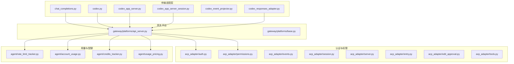
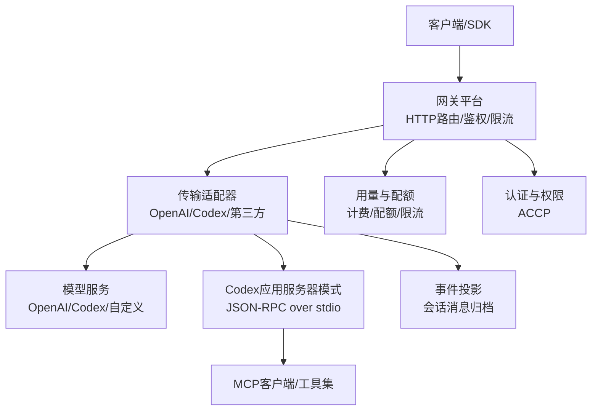
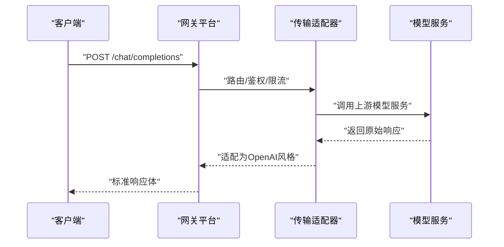
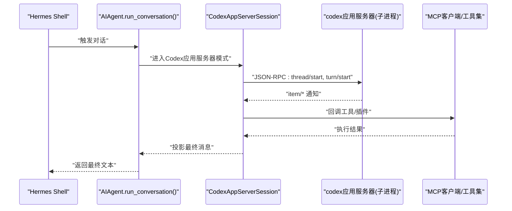
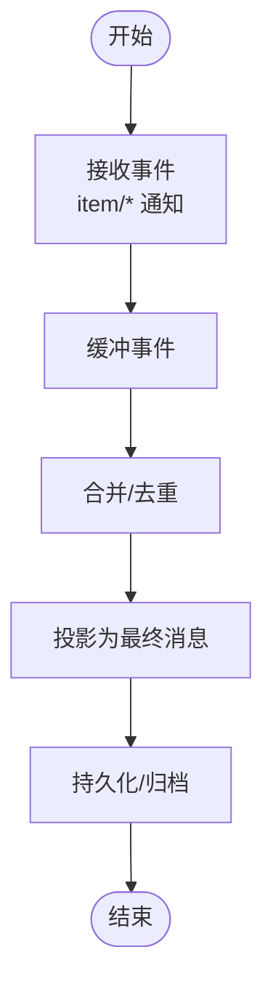
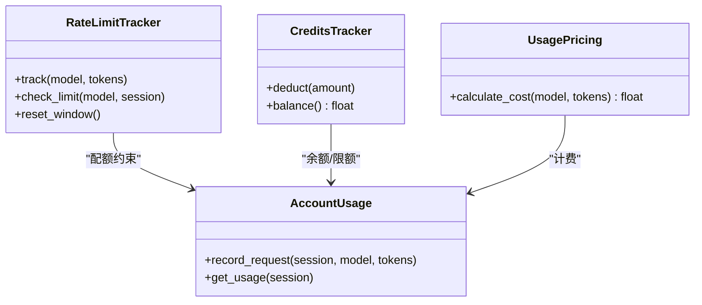
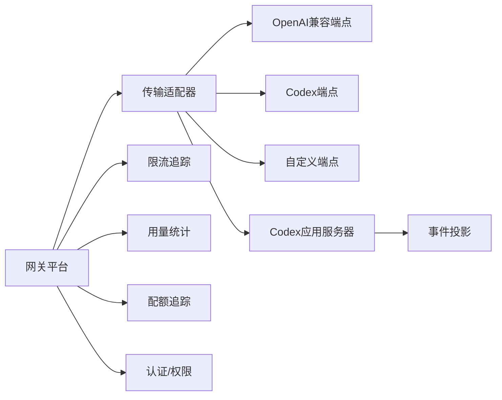

# API兼容性

<cite>
**本文引用的文件**
- [codex_app_server.py](file://agent/transports/codex_app_server.py)
- [codex_app_server_session.py](file://agent/transports/codex_app_server_session.py)
- [codex_event_projector.py](file://agent/transports/codex_event_projector.py)
- [chat_completions.py](file://agent/transports/chat_completions.py)
- [codex.py](file://agent/transports/codex.py)
- [codex_responses_adapter.py](file://agent/codex_responses_adapter.py)
- [api_server.py](file://gateway/platforms/api_server.py)
- [base.py](file://gateway/platforms/base.py)
- [rate_limit_tracker.py](file://agent/rate_limit_tracker.py)
- [account_usage.py](file://agent/account_usage.py)
- [credits_tracker.py](file://agent/credits_tracker.py)
- [usage_pricing.py](file://agent/usage_pricing.py)
- [auth.py](file://acp_adapter/auth.py)
- [permissions.py](file://acp_adapter/permissions.py)
- [events.py](file://acp_adapter/events.py)
- [session.py](file://acp_adapter/session.py)
- [server.py](file://acp_adapter/server.py)
- [entry.py](file://acp_adapter/entry.py)
- [edit_approval.py](file://acp_adapter/edit_approval.py)
- [tools.py](file://acp_adapter/tools.py)
- [test_model_validation.py](file://tests/hermes_cli/test_model_validation.py)
- [test_gmi_provider.py](file://tests/hermes_cli/test_gmi_provider.py)
- [test_schema_sanitizer.py](file://tests/tools/test_schema_sanitizer.py)
- [test_model_metadata.py](file://tests/plugins/memory/test_hindsight_provider.py)
- [test_web_server.py](file://tests/hermes_cli/test_web_server.py)
- [codex-app-server-runtime.md](file://website/docs/user-guide/features/codex-app-server-runtime.md)
- [codex-app-server-runtime-zh.md](file://website/i18n/zh-Hans/docusaurus-plugin-content-docs/current/user-guide/features/codex-app-server-runtime.md)
- [rest-graphql-debug.md](file://website/docs/user-guide/skills/optional/communication/rest-graphql-debug.md)
- [rest-graphql-debug-zh.md](file://website/i18n/zh-Hans/docusaurus-plugin-content-docs/current/user-guide/skills/optional/communication/communication-one-three-one-rule.md)
</cite>

## 目录
1. [引言](#引言)
2. [项目结构](#项目结构)
3. [核心组件](#核心组件)
4. [架构总览](#架构总览)
5. [详细组件分析](#详细组件分析)
6. [依赖关系分析](#依赖关系分析)
7. [性能考量](#性能考量)
8. [故障排查指南](#故障排查指南)
9. [结论](#结论)
10. [附录](#附录)

## 引言
本文件面向开发者与平台集成者，系统化阐述本仓库中的API兼容性实现与工程实践，重点覆盖：
- OpenAI API兼容性与端点映射、参数转换
- Codex API集成与应用服务器模式
- 事件投影机制与会话生命周期
- API版本管理、向后兼容与迁移策略
- 请求/响应格式标准化、错误码映射与异常处理
- API密钥管理、速率限制与配额控制
- 自定义API端点开发、中间件集成与监控指标
- API测试、调试与性能优化实践

## 项目结构
围绕API兼容性与传输层的关键目录与文件如下：
- 传输适配层：OpenAI/Codex等模型服务的适配器与会话管理
- 网关平台：统一API入口与HTTP路由
- 认证与权限：ACCP（Agent Control Protocol）适配器
- 配额与用量：用量追踪、计费与配额控制
- 文档与测试：官方文档与大量端到端/集成测试

**图表来源**
- [chat_completions.py](file://agent/transports/chat_completions.py)
- [codex.py](file://agent/transports/codex.py)
- [codex_app_server.py](file://agent/transports/codex_app_server.py)
- [codex_app_server_session.py](file://agent/transports/codex_app_server_session.py)
- [codex_event_projector.py](file://agent/transports/codex_event_projector.py)
- [codex_responses_adapter.py](file://agent/codex_responses_adapter.py)
- [api_server.py](file://gateway/platforms/api_server.py)
- [base.py](file://gateway/platforms/base.py)
- [rate_limit_tracker.py](file://agent/rate_limit_tracker.py)
- [account_usage.py](file://agent/account_usage.py)
- [credits_tracker.py](file://agent/credits_tracker.py)
- [usage_pricing.py](file://agent/usage_pricing.py)
- [auth.py](file://acp_adapter/auth.py)
- [permissions.py](file://acp_adapter/permissions.py)
- [events.py](file://acp_adapter/events.py)
- [session.py](file://acp_adapter/session.py)
- [server.py](file://acp_adapter/server.py)
- [entry.py](file://acp_adapter/entry.py)
- [edit_approval.py](file://acp_adapter/edit_approval.py)
- [tools.py](file://acp_adapter/tools.py)

**章节来源**
- [api_server.py](file://gateway/platforms/api_server.py)
- [base.py](file://gateway/platforms/base.py)

## 核心组件
- 传输适配层：负责将上游模型服务（如OpenAI、Codex、第三方推理引擎）的响应转换为统一的OpenAI风格输出；同时支持Codex应用服务器模式与事件投影。
- 网关平台：提供HTTP API入口，统一路由、鉴权、限流与用量统计。
- 认证与权限：基于ACCP的鉴权、会话、事件与工具管控。
- 配额与用量：跟踪请求次数、Token消耗、计费与配额。

**章节来源**
- [codex_app_server.py](file://agent/transports/codex_app_server.py)
- [codex_app_server_session.py](file://agent/transports/codex_app_server_session.py)
- [codex_event_projector.py](file://agent/transports/codex_event_projector.py)
- [chat_completions.py](file://agent/transports/chat_completions.py)
- [codex.py](file://agent/transports/codex.py)
- [codex_responses_adapter.py](file://agent/codex_responses_adapter.py)
- [api_server.py](file://gateway/platforms/api_server.py)
- [auth.py](file://acp_adapter/auth.py)
- [permissions.py](file://acp_adapter/permissions.py)
- [rate_limit_tracker.py](file://agent/rate_limit_tracker.py)
- [account_usage.py](file://agent/account_usage.py)
- [credits_tracker.py](file://agent/credits_tracker.py)
- [usage_pricing.py](file://agent/usage_pricing.py)

## 架构总览
下图展示从客户端到模型服务的完整链路，包括OpenAI兼容端点、Codex应用服务器模式以及事件投影：

**图表来源**
- [api_server.py](file://gateway/platforms/api_server.py)
- [chat_completions.py](file://agent/transports/chat_completions.py)
- [codex.py](file://agent/transports/codex.py)
- [codex_app_server.py](file://agent/transports/codex_app_server.py)
- [codex_event_projector.py](file://agent/transports/codex_event_projector.py)
- [rate_limit_tracker.py](file://agent/rate_limit_tracker.py)
- [account_usage.py](file://agent/account_usage.py)
- [credits_tracker.py](file://agent/credits_tracker.py)
- [usage_pricing.py](file://agent/usage_pricing.py)
- [auth.py](file://acp_adapter/auth.py)
- [permissions.py](file://acp_adapter/permissions.py)

## 详细组件分析

### OpenAI API兼容性与端点映射
- 兼容目标：将不同上游模型服务的响应统一为OpenAI风格的chat.completions输出，保证字段一致性与行为兼容。
- 关键实现位置：
  - 通用聊天补全适配：[chat_completions.py](file://agent/transports/chat_completions.py)
  - Codex响应适配器：[codex_responses_adapter.py](file://agent/codex_responses_adapter.py)
  - 模型元数据与上下文长度推断：[test_model_validation.py](file://tests/hermes_cli/test_model_validation.py)，[test_gmi_provider.py](file://tests/hermes_cli/test_gmi_provider.py)
- 参数转换要点：
  - 字段映射：如模型名、消息数组、温度、top_p、频率惩罚等参数的映射与默认值处理。
  - 枚举值清洗：对包含斜杠的枚举值进行剥离以规避特定服务的语法限制（参见测试：[test_schema_sanitizer.py](file://tests/tools/test_schema_sanitizer.py)）。
- 版本与兼容：
  - 通过模型识别与前缀解析，支持“供应商/模型名”格式，便于跨平台迁移与版本管理（参见：[test_model_validation.py](file://tests/hermes_cli/test_model_validation.py)）。
  - 对已知服务端点（如GMI）保留元数据缓存与探测逻辑，避免重复探测（参见：[test_gmi_provider.py](file://tests/hermes_cli/test_gmi_provider.py)）。

**图表来源**
- [chat_completions.py](file://agent/transports/chat_completions.py)
- [codex_responses_adapter.py](file://agent/codex_responses_adapter.py)
- [api_server.py](file://gateway/platforms/api_server.py)

**章节来源**
- [chat_completions.py](file://agent/transports/chat_completions.py)
- [codex_responses_adapter.py](file://agent/codex_responses_adapter.py)
- [test_model_validation.py](file://tests/hermes_cli/test_model_validation.py)
- [test_gmi_provider.py](file://tests/hermes_cli/test_gmi_provider.py)
- [test_schema_sanitizer.py](file://tests/tools/test_schema_sanitizer.py)

### Codex API集成与应用服务器模式
- 应用服务器模式：当会话处于Codex应用服务器模式时，系统通过JSON-RPC over stdio与子进程交互，驱动MCP工具与本地能力。
- 关键组件：
  - 应用服务器入口与生命周期管理：[codex_app_server.py](file://agent/transports/codex_app_server.py)
  - 会话管理：[codex_app_server_session.py](file://agent/transports/codex_app_server_session.py)
  - 事件投影：[codex_event_projector.py](file://agent/transports/codex_event_projector.py)
  - 官方文档架构图：[codex-app-server-runtime.md](file://website/docs/user-guide/features/codex-app-server-runtime.md)，[codex-app-server-runtime-zh.md](file://website/i18n/zh-Hans/docusaurus-plugin-content-docs/current/user-guide/features/codex-app-server-runtime.md)
- 数据流与控制流：
  - 会话启动/关闭、turn切换、item通知、shell命令执行、图像查看与沙箱操作均由该模式驱动。
  - MCP客户端连接用户自建与内置插件，回调丰富工具集。

**图表来源**
- [codex_app_server_session.py](file://agent/transports/codex_app_server_session.py)
- [codex_app_server.py](file://agent/transports/codex_app_server.py)
- [codex_event_projector.py](file://agent/transports/codex_event_projector.py)
- [codex-app-server-runtime.md](file://website/docs/user-guide/features/codex-app-server-runtime.md)
- [codex-app-server-runtime-zh.md](file://website/i18n/zh-Hans/docusaurus-plugin-content-docs/current/user-guide/features/codex-app-server-runtime.md)

**章节来源**
- [codex_app_server.py](file://agent/transports/codex_app_server.py)
- [codex_app_server_session.py](file://agent/transports/codex_app_server_session.py)
- [codex_event_projector.py](file://agent/transports/codex_event_projector.py)
- [codex-app-server-runtime.md](file://website/docs/user-guide/features/codex-app-server-runtime.md)
- [codex-app-server-runtime-zh.md](file://website/i18n/zh-Hans/docusaurus-plugin-content-docs/current/user-guide/features/codex-app-server-runtime.md)

### 事件投影机制
- 作用：将会话过程中的关键事件（如item通知、工具调用、消息更新）投影为最终消息集合，供后续处理与持久化。
- 实现位置：[codex_event_projector.py](file://agent/transports/codex_event_projector.py)
- 适用场景：Codex应用服务器模式下的消息归档与一致性维护。

**图表来源**
- [codex_event_projector.py](file://agent/transports/codex_event_projector.py)

**章节来源**
- [codex_event_projector.py](file://agent/transports/codex_event_projector.py)

### API版本管理、向后兼容与迁移策略
- 版本探测与缓存：对第三方API的版本探测仅按URL缓存一次，避免重复探测开销（参见：[test_model_metadata.py](file://tests/plugins/memory/test_hindsight_provider.py)）。
- 模型前缀与别名：支持“供应商/模型名”格式，便于跨平台迁移；对无斜杠模型名的识别与拒绝策略，确保API一致性（参见：[test_model_validation.py](file://tests/hermes_cli/test_model_validation.py)）。
- 兼容性测试：通过多轮集成测试覆盖模型识别、元数据获取、上下文长度推断等关键路径。

**章节来源**
- [test_model_metadata.py](file://tests/plugins/memory/test_hindsight_provider.py)
- [test_model_validation.py](file://tests/hermes_cli/test_model_validation.py)

### 请求/响应格式标准化、错误码映射与异常处理
- 标准化：统一响应结构，字段映射与默认值处理，确保下游SDK稳定消费。
- 错误码映射：对429（限流）、502/503/504（瞬态错误）采用退避重试策略；网络不可达标记为不可达而非阻断（参见：[test_web_server.py](file://tests/hermes_cli/test_web_server.py)）。
- 异常处理：对外部API调用增加重试与降级策略，避免单点故障影响整体稳定性（参考文档：[rest-graphql-debug.md](file://website/docs/user-guide/skills/optional/communication/rest-graphql-debug.md)，[rest-graphql-debug-zh.md](file://website/i18n/zh-Hans/docusaurus-plugin-content-docs/current/user-guide/skills/optional/communication/communication-one-three-one-rule.md)）。

**章节来源**
- [test_web_server.py](file://tests/hermes_cli/test_web_server.py)
- [rest-graphql-debug.md](file://website/docs/user-guide/skills/optional/communication/rest-graphql-debug.md)
- [rest-graphql-debug-zh.md](file://website/i18n/zh-Hans/docusaurus-plugin-content-docs/current/user-guide/skills/optional/communication/communication-one-three-one-rule.md)

### API密钥管理、速率限制与配额控制
- 密钥校验：对已知提供商的密钥进行可达性探测，429视为有效但需注意配额；空值拒绝（参见：[test_web_server.py](file://tests/hermes_cli/test_web_server.py)）。
- 速率限制：全局与按模型维度的限流追踪，结合会话与账户维度进行配额控制（参见：[rate_limit_tracker.py](file://agent/rate_limit_tracker.py)）。
- 配额与计费：用量统计、计费规则与配额上限，配合会话与账户维度进行控制（参见：[account_usage.py](file://agent/account_usage.py)，[credits_tracker.py](file://agent/credits_tracker.py)，[usage_pricing.py](file://agent/usage_pricing.py)）。

**图表来源**
- [rate_limit_tracker.py](file://agent/rate_limit_tracker.py)
- [account_usage.py](file://agent/account_usage.py)
- [credits_tracker.py](file://agent/credits_tracker.py)
- [usage_pricing.py](file://agent/usage_pricing.py)

**章节来源**
- [rate_limit_tracker.py](file://agent/rate_limit_tracker.py)
- [account_usage.py](file://agent/account_usage.py)
- [credits_tracker.py](file://agent/credits_tracker.py)
- [usage_pricing.py](file://agent/usage_pricing.py)
- [test_web_server.py](file://tests/hermes_cli/test_web_server.py)

### 自定义API端点开发、中间件集成与监控指标
- 自定义端点：通过网关平台扩展新的HTTP端点，复用现有鉴权与限流中间件（参见：[api_server.py](file://gateway/platforms/api_server.py)，[base.py](file://gateway/platforms/base.py)）。
- 中间件：鉴权、权限、会话、事件与工具管控均可作为中间件注入（参见：[auth.py](file://acp_adapter/auth.py)，[permissions.py](file://acp_adapter/permissions.py)，[events.py](file://acp_adapter/events.py)，[tools.py](file://acp_adapter/tools.py)）。
- 监控指标：建议在网关层埋点请求量、错误率、延迟与配额使用率，结合ACCP事件进行审计与可视化。

**章节来源**
- [api_server.py](file://gateway/platforms/api_server.py)
- [base.py](file://gateway/platforms/base.py)
- [auth.py](file://acp_adapter/auth.py)
- [permissions.py](file://acp_adapter/permissions.py)
- [events.py](file://acp_adapter/events.py)
- [tools.py](file://acp_adapter/tools.py)

## 依赖关系分析
- 传输适配器依赖网关平台进行路由与鉴权；Codex模式下进一步依赖事件投影与MCP工具集。
- 用量与配额模块横切多个适配器，提供统一的计费与限流能力。
- 认证与权限模块贯穿API生命周期，保障安全与合规。

**图表来源**
- [api_server.py](file://gateway/platforms/api_server.py)
- [chat_completions.py](file://agent/transports/chat_completions.py)
- [codex.py](file://agent/transports/codex.py)
- [codex_app_server.py](file://agent/transports/codex_app_server.py)
- [codex_event_projector.py](file://agent/transports/codex_event_projector.py)
- [rate_limit_tracker.py](file://agent/rate_limit_tracker.py)
- [account_usage.py](file://agent/account_usage.py)
- [credits_tracker.py](file://agent/credits_tracker.py)
- [auth.py](file://acp_adapter/auth.py)
- [permissions.py](file://acp_adapter/permissions.py)

**章节来源**
- [api_server.py](file://gateway/platforms/api_server.py)
- [chat_completions.py](file://agent/transports/chat_completions.py)
- [codex.py](file://agent/transports/codex.py)
- [codex_app_server.py](file://agent/transports/codex_app_server.py)
- [codex_event_projector.py](file://agent/transports/codex_event_projector.py)
- [rate_limit_tracker.py](file://agent/rate_limit_tracker.py)
- [account_usage.py](file://agent/account_usage.py)
- [credits_tracker.py](file://agent/credits_tracker.py)
- [auth.py](file://acp_adapter/auth.py)
- [permissions.py](file://acp_adapter/permissions.py)

## 性能考量
- 传输适配器与事件投影应尽量减少不必要的序列化与I/O；Codex应用服务器模式下，JSON-RPC的批量与去重有助于降低开销。
- 限流与配额策略应结合模型维度与会话维度动态调整，避免热点模型导致全局拥塞。
- 对上游服务的重试与退避策略需引入抖动，防止惊群效应；对5xx错误采用指数退避+告警机制。

[本节为通用指导，无需具体文件分析]

## 故障排查指南
- 密钥问题：确认密钥是否被识别为已知提供商，429视为有效但需关注配额；网络异常标记为不可达（参见：[test_web_server.py](file://tests/hermes_cli/test_web_server.py)）。
- 模型识别：检查模型名是否符合“供应商/模型名”格式；无斜杠模型需确保在目标API中存在（参见：[test_model_validation.py](file://tests/hermes_cli/test_model_validation.py)）。
- 枚举冲突：若上游服务拒绝包含斜杠的枚举值，需先进行清洗（参见：[test_schema_sanitizer.py](file://tests/tools/test_schema_sanitizer.py)）。
- 版本探测：确认URL级别的版本探测缓存是否生效，避免重复探测（参见：[test_model_metadata.py](file://tests/plugins/memory/test_hindsight_provider.py)）。

**章节来源**
- [test_web_server.py](file://tests/hermes_cli/test_web_server.py)
- [test_model_validation.py](file://tests/hermes_cli/test_model_validation.py)
- [test_schema_sanitizer.py](file://tests/tools/test_schema_sanitizer.py)
- [test_model_metadata.py](file://tests/plugins/memory/test_hindsight_provider.py)

## 结论
本仓库在API兼容性方面提供了从传输适配、网关路由、认证授权到用量配额的全栈实现，并通过Codex应用服务器模式与事件投影机制，实现了与MCP生态的深度集成。借助完善的测试与文档，开发者可以快速、安全地扩展与迁移API端点，同时保持稳定的性能与可观测性。

[本节为总结，无需具体文件分析]

## 附录
- 开发者实用清单
  - 在新增端点时，优先复用网关中间件与限流策略
  - 对上游服务采用统一的重试与退避策略
  - 对枚举值进行清洗，避免斜杠引发的兼容性问题
  - 通过测试覆盖模型识别、版本探测与配额控制等关键路径

[本节为补充说明，无需具体文件分析]