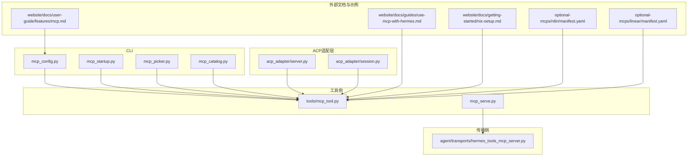
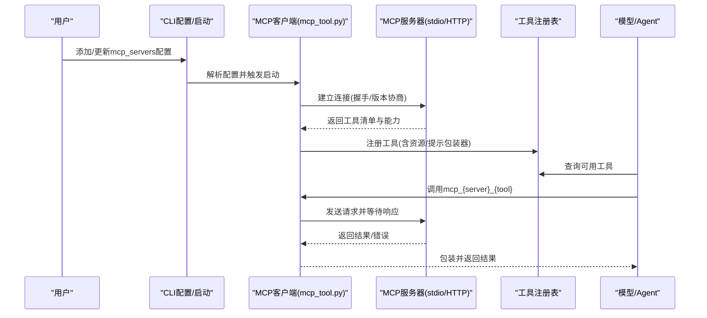
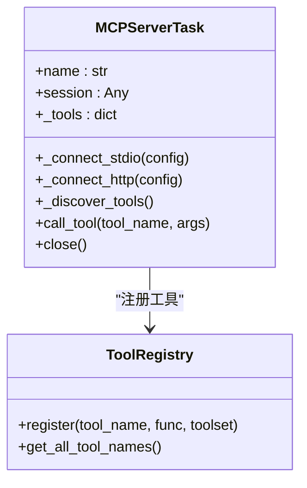
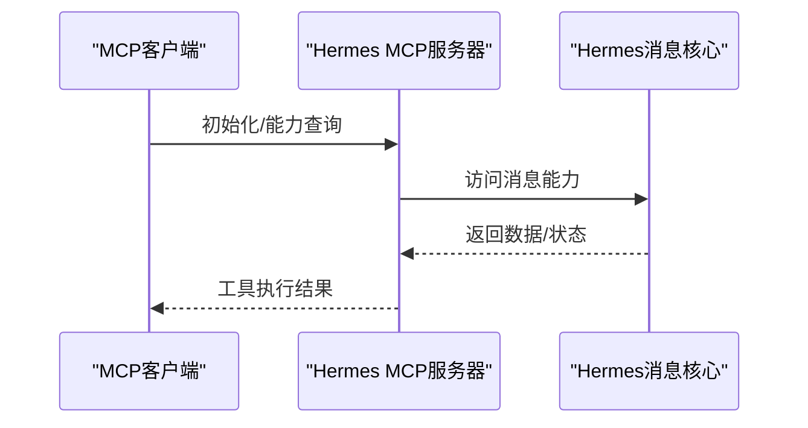
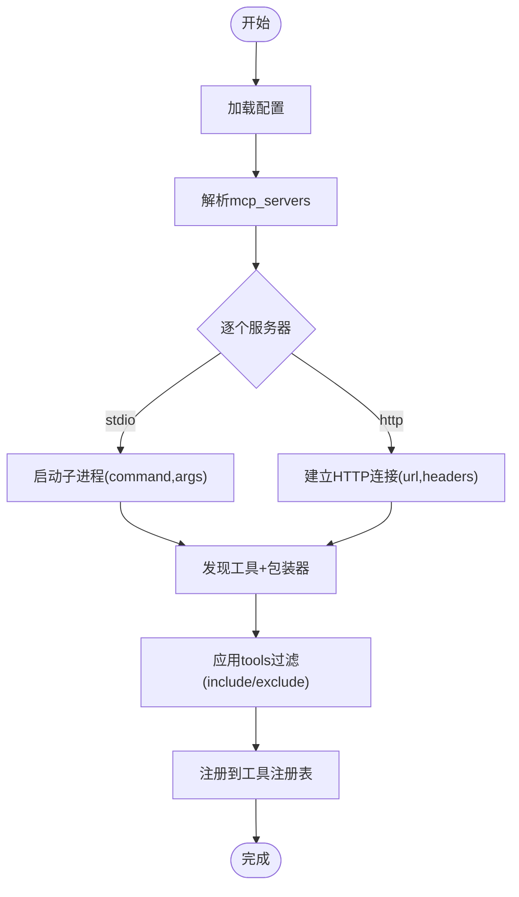
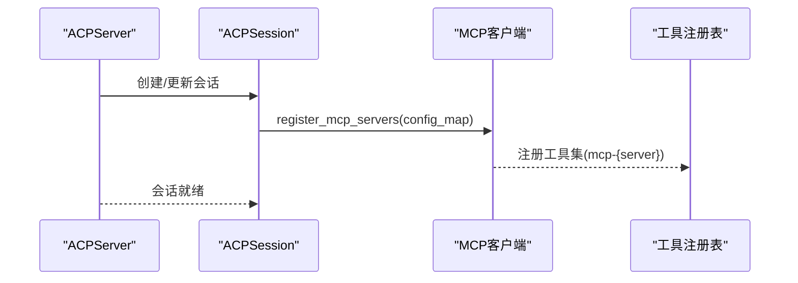
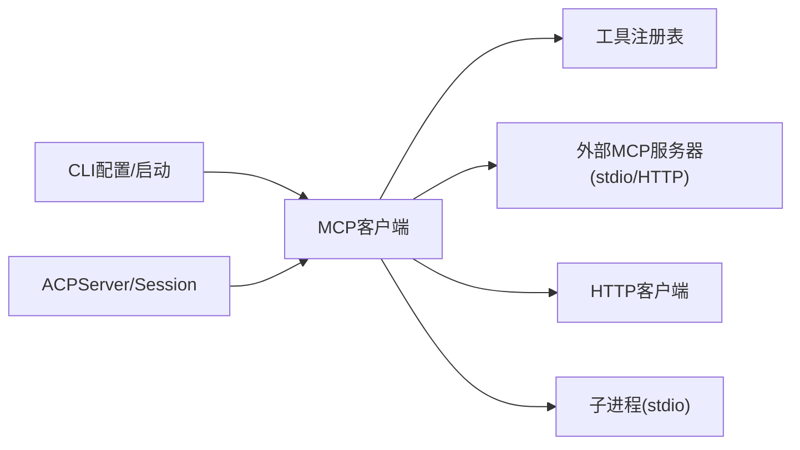

# MCP协议支持

<cite>
**本文引用的文件**
- [mcp_tool.py](file://tools/mcp_tool.py)
- [hermes_tools_mcp_server.py](file://agent/transports/hermes_tools_mcp_server.py)
- [mcp_serve.py](file://mcp_serve.py)
- [mcp_config.py](file://hermes_cli/mcp_config.py)
- [mcp_startup.py](file://hermes_cli/mcp_startup.py)
- [mcp_picker.py](file://hermes_cli/mcp_picker.py)
- [mcp_catalog.py](file://hermes_cli/mcp_catalog.py)
- [server.py](file://acp_adapter/server.py)
- [session.py](file://acp_adapter/session.py)
- [anthropic.py](file://agent/transports/anthropic.py)
- [anthropic_adapter.py](file://agent/anthropic_adapter.py)
- [test_mcp_tool.py](file://tests/tools/test_mcp_tool.py)
- [test_mcp_e2e.py](file://tests/acp/test_mcp_e2e.py)
- [test_hermes_tools_mcp_server.py](file://tests/agent/transports/test_hermes_tools_mcp_server.py)
- [mcp.md](file://website/docs/user-guide/features/mcp.md)
- [use-mcp-with-hermes.md](file://website/docs/guides/use-mcp-with-hermes.md)
- [nix-setup.md](file://website/docs/getting-started/nix-setup.md)
- [manifest.yaml（n8n）](file://optional-mcps/n8n/manifest.yaml)
- [manifest.yaml（Linear）](file://optional-mcps/linear/manifest.yaml)
</cite>

## 目录
1. [简介](#简介)
2. [项目结构](#项目结构)
3. [核心组件](#核心组件)
4. [架构总览](#架构总览)
5. [详细组件分析](#详细组件分析)
6. [依赖关系分析](#依赖关系分析)
7. [性能考量](#性能考量)
8. [故障排查指南](#故障排查指南)
9. [结论](#结论)
10. [附录](#附录)

## 简介
本文件系统化阐述 Hermes Agent 对 Model Context Protocol（MCP）的支持，覆盖协议规范要点、消息格式与通信机制；详解 Hermes Tools MCP 服务器实现、工具发现与动态加载；说明 MCP 客户端的连接管理、认证与工具调用流程；提供协议版本兼容性、错误处理与重连策略；给出服务器配置、工具注册与生命周期管理实践；并包含第三方 MCP 服务器集成、代理模式与安全建议，以及面向开发者的工具开发、测试与部署指南。

## 项目结构
围绕 MCP 的实现主要分布在以下模块：
- 工具侧：MCP 客户端与工具注册、HTTP/stdio 连接、协议版本协商、工具过滤与工具集组织
- 传输侧：作为 MCP 服务器对外提供 Hermes 能力（消息列表、历史读取、发送消息等）
- CLI 侧：MCP 配置、启动、选择器与目录
- ACP 适配层：在会话中按需注册 MCP 服务器
- 文档与示例：用户指南、快速上手、Nix 部署与第三方服务器清单

**图表来源**
- [mcp_config.py](file://hermes_cli/mcp_config.py)
- [mcp_startup.py](file://hermes_cli/mcp_startup.py)
- [mcp_picker.py](file://hermes_cli/mcp_picker.py)
- [mcp_catalog.py](file://hermes_cli/mcp_catalog.py)
- [mcp_tool.py](file://tools/mcp_tool.py)
- [mcp_serve.py](file://mcp_serve.py)
- [hermes_tools_mcp_server.py](file://agent/transports/hermes_tools_mcp_server.py)
- [server.py](file://acp_adapter/server.py)
- [session.py](file://acp_adapter/session.py)
- [mcp.md](file://website/docs/user-guide/features/mcp.md)
- [use-mcp-with-hermes.md](file://website/docs/guides/use-mcp-with-hermes.md)
- [nix-setup.md](file://website/docs/getting-started/nix-setup.md)
- [manifest.yaml（n8n）](file://optional-mcps/n8n/manifest.yaml)
- [manifest.yaml（Linear）](file://optional-mcps/linear/manifest.yaml)

**章节来源**
- [mcp.md](file://website/docs/user-guide/features/mcp.md)
- [use-mcp-with-hermes.md](file://website/docs/guides/use-mcp-with-hermes.md)
- [nix-setup.md](file://website/docs/getting-started/nix-setup.md)

## 核心组件
- MCP 客户端与工具注册
  - 支持 stdio 与 HTTP 两种传输方式
  - 自动工具发现、工具过滤（include/exclude）、资源与提示包装器开关
  - 工具集组织：每个 MCP 服务器对应一个工具集，工具命名空间为 mcp_{server}_{tool}
  - 协议版本协商：默认使用最新版本，允许自定义头覆盖
- MCP 服务器（Hermes Tools）
  - 将 Hermes 的消息能力以 MCP 工具形式暴露给外部 MCP 客户端
  - 提供对话列表、消息历史读取、发送消息等工具
- CLI 与配置
  - 提供 MCP 服务器添加、预设、目录、启动与热重载
  - 支持 Nix 部署下的 OAuth 与远程 HTTP 服务器配置
- ACP 适配层
  - 在会话上下文中按需注册 MCP 服务器，支持多服务器组合
  - 与模型传输层（如 Anthropic）协作，避免重复前缀

**章节来源**
- [mcp_tool.py](file://tools/mcp_tool.py)
- [hermes_tools_mcp_server.py](file://agent/transports/hermes_tools_mcp_server.py)
- [mcp_config.py](file://hermes_cli/mcp_config.py)
- [mcp_startup.py](file://hermes_cli/mcp_startup.py)
- [mcp_picker.py](file://hermes_cli/mcp_picker.py)
- [mcp_catalog.py](file://hermes_cli/mcp_catalog.py)
- [server.py](file://acp_adapter/server.py)
- [session.py](file://acp_adapter/session.py)
- [anthropic.py](file://agent/transports/anthropic.py)
- [anthropic_adapter.py](file://agent/anthropic_adapter.py)

## 架构总览
下图展示从配置到工具可用的全链路：CLI 配置写入与启动 -> MCP 客户端连接 -> 工具发现与注册 -> 模型调用 -> 结果返回。

**图表来源**
- [mcp_tool.py](file://tools/mcp_tool.py)
- [mcp_config.py](file://hermes_cli/mcp_config.py)
- [mcp_startup.py](file://hermes_cli/mcp_startup.py)

## 详细组件分析

### MCP 客户端与工具注册（mcp_tool.py）
- 连接与传输
  - stdio：通过子进程启动外部 MCP 服务器，基于标准输入输出流进行消息编解码
  - HTTP：基于异步 HTTP 客户端，支持自定义超时、连接超时与请求头
  - 协议版本：自动设置或允许显式指定 mcp-protocol-version 请求头
- 工具发现与注册
  - 启动后拉取工具清单，结合 per-server 工具过滤策略（include/exclude）
  - 自动注册资源与提示包装器工具（当服务器支持时）
  - 工具集命名：mcp_{server}_{tool}，工具集名：mcp-{server}
- 生命周期管理
  - 支持跳过已连接服务器、禁用服务器、空配置返回
  - 工具注册失败不影响其他服务器
- 错误处理
  - 统一错误信息清洗，保留异常类型与关键信息
  - 对空消息等特殊错误进行专门处理

**图表来源**
- [mcp_tool.py](file://tools/mcp_tool.py)

**章节来源**
- [mcp_tool.py](file://tools/mcp_tool.py)
- [test_mcp_tool.py](file://tests/tools/test_mcp_tool.py)

### MCP 服务器（Hermes Tools，hermes_tools_mcp_server.py）
- 角色定位
  - 将 Hermes 的消息能力以 MCP 工具形式暴露给外部 MCP 客户端
  - 典型工具：列出对话、读取消息历史、发送消息等
- 交互模式
  - 作为 stdio 服务器运行，由 MCP 客户端进程管理生命周期
  - 与 MCP 客户端协议保持一致的消息格式与版本
- 集成入口
  - CLI 子命令 hermes mcp serve 启动该服务器
  - 可在 MCP 客户端配置中直接引用

**图表来源**
- [hermes_tools_mcp_server.py](file://agent/transports/hermes_tools_mcp_server.py)
- [mcp_serve.py](file://mcp_serve.py)

**章节来源**
- [hermes_tools_mcp_server.py](file://agent/transports/hermes_tools_mcp_server.py)
- [mcp_serve.py](file://mcp_serve.py)

### CLI 与配置（mcp_config.py、mcp_startup.py、mcp_picker.py、mcp_catalog.py）
- 配置项
  - stdio：command、args、env、timeout、connect_timeout、enabled、supports_parallel_tool_calls、tools
  - HTTP：url、headers、timeout、connect_timeout、enabled、supports_parallel_tool_calls、tools
  - tools：include/exclude 控制可见工具集合；prompts/resources 控制包装器开关
- 启动与热重载
  - 启动时解析配置并建立连接
  - 支持按服务器粒度热重载与刷新缓存
- 预设与目录
  - 提供常见服务器的预设（如 codex），减少手工配置
  - 目录功能用于查看可用 MCP 服务器与工具
- 安全与环境变量
  - 仅传递显式配置的 env 与安全基线，降低敏感信息泄露风险
  - 支持 per-server 工具白名单/黑名单

**图表来源**
- [mcp_config.py](file://hermes_cli/mcp_config.py)
- [mcp_startup.py](file://hermes_cli/mcp_startup.py)
- [mcp_picker.py](file://hermes_cli/mcp_picker.py)
- [mcp_catalog.py](file://hermes_cli/mcp_catalog.py)

**章节来源**
- [mcp_config.py](file://hermes_cli/mcp_config.py)
- [mcp_startup.py](file://hermes_cli/mcp_startup.py)
- [mcp_picker.py](file://hermes_cli/mcp_picker.py)
- [mcp_catalog.py](file://hermes_cli/mcp_catalog.py)
- [mcp.md](file://website/docs/user-guide/features/mcp.md)

### ACP 适配层（server.py、session.py）
- 会话级注册
  - 在会话初始化/变更时，根据配置动态注册 MCP 服务器
  - 支持多服务器组合，避免重复注册
- 与模型传输层协作
  - 避免对 MCP 工具名重复前缀，确保工具名唯一且可被模型识别
- 事件驱动
  - 在不同阶段（会话创建、更新、销毁）触发注册与清理

**图表来源**
- [server.py](file://acp_adapter/server.py)
- [session.py](file://acp_adapter/session.py)
- [anthropic.py](file://agent/transports/anthropic.py)
- [anthropic_adapter.py](file://agent/anthropic_adapter.py)

**章节来源**
- [server.py](file://acp_adapter/server.py)
- [session.py](file://acp_adapter/session.py)
- [anthropic.py](file://agent/transports/anthropic.py)
- [anthropic_adapter.py](file://agent/anthropic_adapter.py)

### 第三方 MCP 服务器集成与代理模式
- 预置清单
  - 提供第三方 MCP 服务器清单（如 n8n、Linear），便于快速集成
- 代理模式
  - 通过 HTTP 传输将外部 MCP 服务作为本地工具集接入
  - 支持远程 HTTP 服务器与 OAuth 2.1（PKCE）授权流程
- 安全考虑
  - 显式配置 headers/env，最小化暴露面
  - 使用 per-server tools 过滤，限制危险动作

**章节来源**
- [manifest.yaml（n8n）](file://optional-mcps/n8n/manifest.yaml)
- [manifest.yaml（Linear）](file://optional-mcps/linear/manifest.yaml)
- [nix-setup.md](file://website/docs/getting-started/nix-setup.md)

## 依赖关系分析
- 组件耦合
  - mcp_tool.py 与工具注册表强耦合，负责工具发现与注册
  - CLI 与 mcp_tool.py 松耦合，通过配置驱动
  - ACP 适配层与 MCP 客户端弱耦合，通过接口注册
- 外部依赖
  - HTTP 传输依赖异步 HTTP 客户端与流式传输上下文
  - stdio 传输依赖子进程管理与标准流
- 版本与兼容性
  - 通过请求头 mcp-protocol-version 实现版本协商
  - 默认采用最新版本，允许自定义覆盖

**图表来源**
- [mcp_tool.py](file://tools/mcp_tool.py)
- [mcp_config.py](file://hermes_cli/mcp_config.py)
- [server.py](file://acp_adapter/server.py)
- [session.py](file://acp_adapter/session.py)

**章节来源**
- [mcp_tool.py](file://tools/mcp_tool.py)
- [test_mcp_tool.py](file://tests/tools/test_mcp_tool.py)

## 性能考量
- 并行工具调用
  - 支持 per-server 并行标志，允许并发执行工具调用
- 超时控制
  - 分离 connect_timeout 与工具调用 timeout，避免阻塞
- 工具过滤
  - 通过 include/exclude 缩小工具集，减少不必要的发现与注册开销
- 传输选择
  - HTTP 适合远程场景，stdio 适合本地低延迟场景

[本节为通用指导，不直接分析具体文件]

## 故障排查指南
- 常见问题
  - 空错误消息：统一清洗并保留异常类型名称
  - 协议版本不匹配：检查请求头 mcp-protocol-version 是否正确
  - 工具不可见：确认 tools.include/exclude 与 prompts/resources 设置
  - OAuth 授权：首次授权需要浏览器交互，headless 环境需在日志中获取授权 URL
- 测试参考
  - 单元测试覆盖了工具发现、注册、过滤、HTTP 新旧版本头处理、OAuth 场景等

**章节来源**
- [test_mcp_tool.py](file://tests/tools/test_mcp_tool.py)
- [test_mcp_e2e.py](file://tests/acp/test_mcp_e2e.py)
- [test_hermes_tools_mcp_server.py](file://tests/agent/transports/test_hermes_tools_mcp_server.py)
- [nix-setup.md](file://website/docs/getting-started/nix-setup.md)

## 结论
Hermes 对 MCP 的支持提供了灵活、安全且可扩展的外部工具接入能力。通过 CLI 配置、工具过滤与工具集组织，用户可以在最小暴露面的前提下获得强大的外部生态能力；通过 HTTP/stdio 与协议版本协商，兼顾远程与本地场景；借助 ACP 适配层与模型传输层的协作，实现无缝的工具调用体验。建议在生产环境中严格使用 per-server 过滤与最小权限原则，并结合 OAuth 与安全基线环境变量保障安全。

[本节为总结性内容，不直接分析具体文件]

## 附录

### 协议版本与兼容性
- 默认使用最新协议版本，可通过请求头覆盖
- HTTP 传输支持新旧版本头键名（大小写不敏感）

**章节来源**
- [test_mcp_tool.py](file://tests/tools/test_mcp_tool.py)

### 开发者指南（工具开发、测试与部署）
- 工具开发
  - 遵循 MCP 工具规范，提供清晰的输入/输出模式
  - 在服务器端实现工具清单与可选的资源/提示包装器
- 测试
  - 使用单元测试验证工具发现、注册、过滤与错误处理
  - 使用 E2E 测试验证端到端工作流
- 部署
  - 通过 CLI 添加服务器配置，支持预设与目录
  - Nix 部署下可启用 OAuth 与远程 HTTP 服务器

**章节来源**
- [mcp.md](file://website/docs/user-guide/features/mcp.md)
- [use-mcp-with-hermes.md](file://website/docs/guides/use-mcp-with-hermes.md)
- [nix-setup.md](file://website/docs/getting-started/nix-setup.md)
- [test_mcp_tool.py](file://tests/tools/test_mcp_tool.py)
- [test_mcp_e2e.py](file://tests/acp/test_mcp_e2e.py)