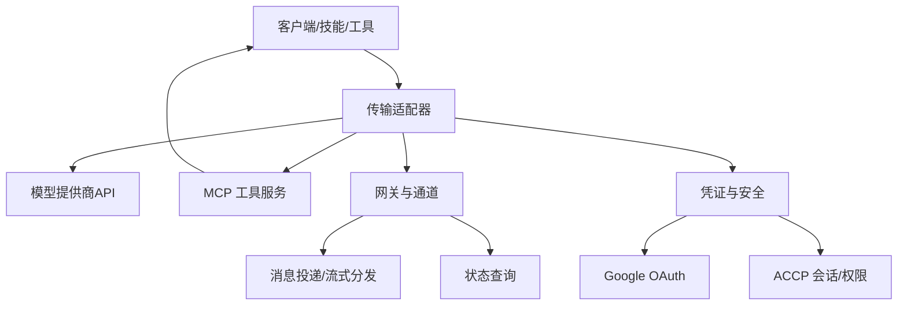
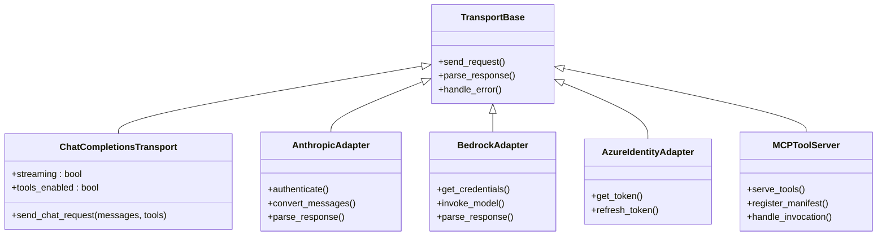
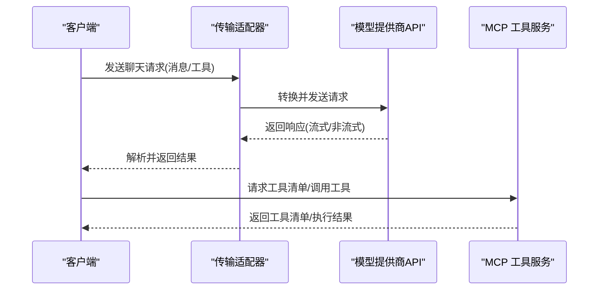
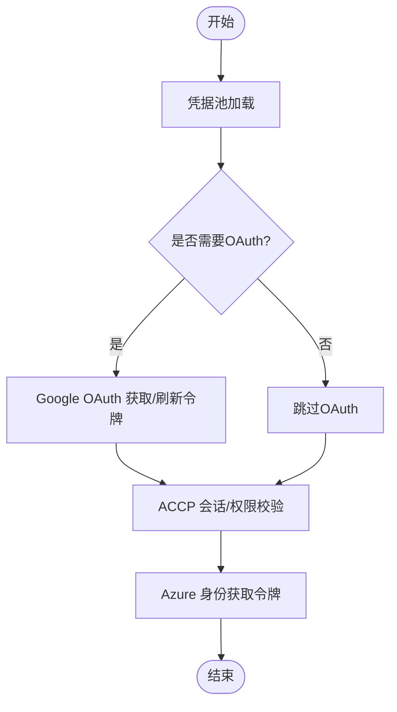
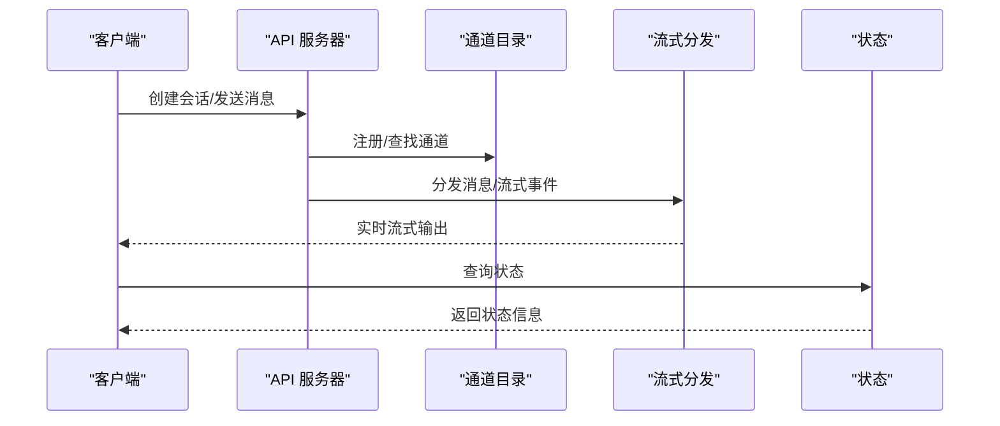
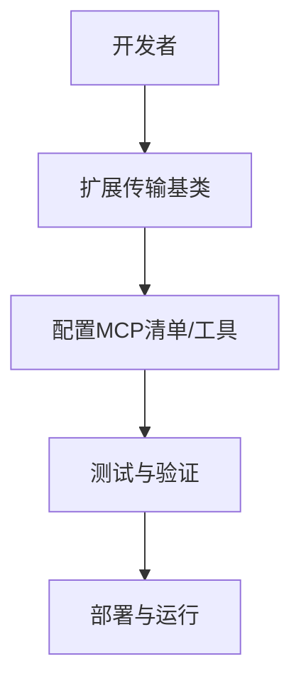

# 传输层系统

<cite>
**本文引用的文件**
- [agent/transports/base.py](file://agent/transports/base.py)
- [agent/transports/chat_completions.py](file://agent/transports/chat_completions.py)
- [agent/transports/anthropic.py](file://agent/transports/anthropic.py)
- [agent/transports/bedrock.py](file://agent/transports/bedrock.py)
- [agent/transports/codex.py](file://agent/transports/codex.py)
- [agent/transports/hermes_tools_mcp_server.py](file://agent/transports/hermes_tools_mcp_server.py)
- [agent/transports/types.py](file://agent/transports/types.py)
- [agent/anthropic_adapter.py](file://agent/anthropic_adapter.py)
- [agent/bedrock_adapter.py](file://agent/bedrock_adapter.py)
- [agent/azure_identity_adapter.py](file://agent/azure_identity_adapter.py)
- [agent/gemini_native_adapter.py](file://agent/gemini_native_adapter.py)
- [agent/gemini_cloudcode_adapter.py](file://agent/gemini_cloudcode_adapter.py)
- [agent/google_oauth.py](file://agent/google_oauth.py)
- [agent/credential_sources.py](file://agent/credential_sources.py)
- [agent/credential_pool.py](file://agent/credential_pool.py)
- [agent/retry_utils.py](file://agent/retry_utils.py)
- [agent/rate_limit_tracker.py](file://agent/rate_limit_tracker.py)
- [agent/usage_pricing.py](file://agent/usage_pricing.py)
- [agent/account_usage.py](file://agent/account_usage.py)
- [hermes_cli/mcp_config.py](file://hermes_cli/mcp_config.py)
- [hermes_cli/mcp_startup.py](file://hermes_cli/mcp_startup.py)
- [hermes_cli/mcp_picker.py](file://hermes_cli/mcp_picker.py)
- [hermes_cli/mcp_catalog.py](file://hermes_cli/mcp_catalog.py)
- [acp_adapter/server.py](file://acp_adapter/server.py)
- [acp_adapter/session.py](file://acp_adapter/session.py)
- [acp_adapter/tools.py](file://acp_adapter/tools.py)
- [acp_adapter/auth.py](file://acp_adapter/auth.py)
- [acp_adapter/entry.py](file://acp_adapter/entry.py)
- [acp_adapter/events.py](file://acp_adapter/events.py)
- [acp_adapter/edit_approval.py](file://acp_adapter/edit_approval.py)
- [acp_adapter/permissions.py](file://acp_adapter/permissions.py)
- [gateway/platforms/api_server.py](file://gateway/platforms/api_server.py)
- [gateway/platforms/base.py](file://gateway/platforms/base.py)
- [gateway/platforms/_http_client_limits.py](file://gateway/platforms/_http_client_limits.py)
- [gateway/channel_directory.py](file://gateway/channel_directory.py)
- [gateway/session.py](file://gateway/session.py)
- [gateway/session_context.py](file://gateway/session_context.py)
- [gateway/delivery.py](file://gateway/delivery.py)
- [gateway/stream_dispatch.py](file://gateway/stream_dispatch.py)
- [gateway/stream_consumer.py](file://gateway/stream_consumer.py)
- [gateway/status.py](file://gateway/status.py)
- [gateway/pairing.py](file://gateway/pairing.py)
- [gateway/platform_registry.py](file://gateway/platform_registry.py)
- [gateway/config.py](file://gateway/config.py)
- [tools/openrouter_client.py](file://tools/openrouter_client.py)
- [tools/mcp_oauth.py](file://tools/mcp_oauth.py)
- [tools/mcp_oauth_manager.py](file://tools/mcp_oauth_manager.py)
- [tools/xai_http.py](file://tools/xai_http.py)
- [plugins/model-providers/openai-codex/plugin.yaml](file://plugins/model-providers/openai-codex/plugin.yaml)
- [plugins/model-providers/anthropic/plugin.yaml](file://plugins/model-providers/anthropic/plugin.yaml)
- [plugins/model-providers/bedrock/plugin.yaml](file://plugins/model-providers/bedrock/plugin.yaml)
- [plugins/model-providers/gemini/plugin.yaml](file://plugins/model-providers/gemini/plugin.yaml)
- [plugins/model-providers/deepseek/plugin.yaml](file://plugins/model-providers/deepseek/plugin.yaml)
- [plugins/model-providers/nous/plugin.yaml](file://plugins/model-providers/nous/plugin.yaml)
- [plugins/model-providers/azure-foundry/plugin.yaml](file://plugins/model-providers/azure-foundry/plugin.yaml)
- [plugins/model-providers/copilot/plugin.yaml](file://plugins/model-providers/copilot/plugin.yaml)
- [plugins/model-providers/custom/plugin.yaml](file://plugins/model-providers/custom/plugin.yaml)
- [plugins/model-providers/openrouter/plugin.yaml](file://plugins/model-providers/openrouter/plugin.yaml)
- [plugins/model-providers/qwen-oauth/plugin.yaml](file://plugins/model-providers/qwen-oauth/plugin.yaml)
- [plugins/model-providers/xai/plugin.yaml](file://plugins/model-providers/xai/plugin.yaml)
- [plugins/model-providers/alibaba/plugin.yaml](file://plugins/model-providers/alibaba/plugin.yaml)
- [plugins/model-providers/arcee/plugin.yaml](file://plugins/model-providers/arcee/plugin.yaml)
- [plugins/model-providers/azure-foundry/plugin.yaml](file://plugins/model-providers/azure-foundry/plugin.yaml)
- [plugins/model-providers/bedrock/plugin.yaml](file://plugins/model-providers/bedrock/plugin.yaml)
- [plugins/model-providers/copilot/plugin.yaml](file://plugins/model-providers/copilot/plugin.yaml)
- [plugins/model-providers/custom/plugin.yaml](file://plugins/model-providers/custom/plugin.yaml)
- [plugins/model-providers/deepseek/plugin.yaml](file://plugins/model-providers/deepseek/plugin.yaml)
- [plugins/model-providers/gemini/plugin.yaml](file://plugins/model-providers/gemini/plugin.yaml)
- [plugins/model-providers/nous/plugin.yaml](file://plugins/model-providers/nous/plugin.yaml)
- [plugins/model-providers/openai-codex/plugin.yaml](file://plugins/model-providers/openai-codex/plugin.yaml)
- [plugins/model-providers/openrouter/plugin.yaml](file://plugins/model-providers/openrouter/plugin.yaml)
- [plugins/model-providers/qwen-oauth/plugin.yaml](file://plugins/model-providers/qwen-oauth/plugin.yaml)
- [plugins/model-providers/xai/plugin.yaml](file://plugins/model-providers/xai/plugin.yaml)
</cite>

## 目录
1. [简介](#简介)
2. [项目结构](#项目结构)
3. [核心组件](#核心组件)
4. [架构总览](#架构总览)
5. [详细组件分析](#详细组件分析)
6. [依赖关系分析](#依赖关系分析)
7. [性能考虑](#性能考虑)
8. [故障排查指南](#故障排查指南)
9. [结论](#结论)
10. [附录](#附录)

## 简介
本文件面向开发者与运维人员，系统化梳理 Hermes Agent 的传输层体系，覆盖传输适配器架构、模型提供商集成与API兼容性设计、支持的传输协议（OpenAI兼容传输、Anthropic适配器、Bedrock适配器等）、传输配置选项、性能优化与认证机制，并提供模型提供商选择指南、成本控制与故障转移策略，以及MCP协议支持、自定义传输开发与多云部署实践。

## 项目结构
传输层系统主要由以下层次构成：
- 传输适配器层：统一抽象与实现各类模型提供商的调用接口
- 协议适配层：兼容 OpenAI 兼容传输、Anthropic、Bedrock 等
- MCP 工具服务层：通过 MCP 协议暴露工具能力
- 网关与通道层：负责会话、流式分发、状态管理与平台集成
- 凭证与安全层：凭据池、OAuth、ACCP（Agent Control Protocol）等
- 配置与插件层：模型提供商插件与 MCP 配置

```mermaid
graph TB
subgraph "传输适配器层"
TBase["transports/base.py"]
TChat["transports/chat_completions.py"]
TAnth["transports/anthropic.py"]
TBed["transports/bedrock.py"]
TCdx["transports/codex.py"]
TMCP["transports/hermes_tools_mcp_server.py"]
end
subgraph "协议适配层"
AAnth["anthropic_adapter.py"]
ABed["bedrock_adapter.py"]
AAZ["azure_identity_adapter.py"]
AGemN["gemini_native_adapter.py"]
AGemC["gemini_cloudcode_adapter.py"]
end
subgraph "网关与通道层"
GAPI["gateway/platforms/api_server.py"]
GBase["gateway/platforms/base.py"]
GChan["gateway/channel_directory.py"]
GDel["gateway/delivery.py"]
GStream["gateway/stream_dispatch.py"]
GStatus["gateway/status.py"]
end
subgraph "凭证与安全层"
CPool["credential_pool.py"]
COAuth["google_oauth.py"]
CAcpSrv["acp_adapter/server.py"]
CAcpSess["acp_adapter/session.py"]
CAcpTools["acp_adapter/tools.py"]
end
subgraph "配置与插件层"
MCPCfg["hermes_cli/mcp_config.py"]
MCPSt["hermes_cli/mcp_startup.py"]
MCPick["hermes_cli/mcp_picker.py"]
MCPCat["hermes_cli/mcp_catalog.py"]
ProvPlg["plugins/model-providers/*/plugin.yaml"]
end
TBase --> TChat
TBase --> TAnth
TBase --> TBed
TBase --> TCdx
TBase --> TMCP
TChat --> AAnth
TChat --> ABed
TChat --> AAZ
TChat --> AGemN
TChat --> AGemC
TMCP --> MCPCfg
TMCP --> MCPSt
TMCP --> MCPick
TMCP --> MCPCat
TChat --> GAPI
TAnth --> GAPI
TBed --> GAPI
TCdx --> GAPI
GAPI --> GChan
GAPI --> GDel
GAPI --> GStream
GAPI --> GStatus
CPool --> COAuth
CPool --> CAcpSrv
CAcpSrv --> CAcpSess
CAcpSrv --> CAcpTools
```

图表来源
- [agent/transports/base.py](file://agent/transports/base.py)
- [agent/transports/chat_completions.py](file://agent/transports/chat_completions.py)
- [agent/transports/anthropic.py](file://agent/transports/anthropic.py)
- [agent/transports/bedrock.py](file://agent/transports/bedrock.py)
- [agent/transports/codex.py](file://agent/transports/codex.py)
- [agent/transports/hermes_tools_mcp_server.py](file://agent/transports/hermes_tools_mcp_server.py)
- [agent/anthropic_adapter.py](file://agent/anthropic_adapter.py)
- [agent/bedrock_adapter.py](file://agent/bedrock_adapter.py)
- [agent/azure_identity_adapter.py](file://agent/azure_identity_adapter.py)
- [agent/gemini_native_adapter.py](file://agent/gemini_native_adapter.py)
- [agent/gemini_cloudcode_adapter.py](file://agent/gemini_cloudcode_adapter.py)
- [gateway/platforms/api_server.py](file://gateway/platforms/api_server.py)
- [gateway/platforms/base.py](file://gateway/platforms/base.py)
- [gateway/channel_directory.py](file://gateway/channel_directory.py)
- [gateway/delivery.py](file://gateway/delivery.py)
- [gateway/stream_dispatch.py](file://gateway/stream_dispatch.py)
- [gateway/status.py](file://gateway/status.py)
- [agent/credential_pool.py](file://agent/credential_pool.py)
- [agent/google_oauth.py](file://agent/google_oauth.py)
- [acp_adapter/server.py](file://acp_adapter/server.py)
- [acp_adapter/session.py](file://acp_adapter/session.py)
- [acp_adapter/tools.py](file://acp_adapter/tools.py)
- [hermes_cli/mcp_config.py](file://hermes_cli/mcp_config.py)
- [hermes_cli/mcp_startup.py](file://hermes_cli/mcp_startup.py)
- [hermes_cli/mcp_picker.py](file://hermes_cli/mcp_picker.py)
- [hermes_cli/mcp_catalog.py](file://hermes_cli/mcp_catalog.py)

章节来源
- [agent/transports/base.py](file://agent/transports/base.py)
- [agent/transports/chat_completions.py](file://agent/transports/chat_completions.py)
- [agent/transports/anthropic.py](file://agent/transports/anthropic.py)
- [agent/transports/bedrock.py](file://agent/transports/bedrock.py)
- [agent/transports/codex.py](file://agent/transports/codex.py)
- [agent/transports/hermes_tools_mcp_server.py](file://agent/transports/hermes_tools_mcp_server.py)
- [gateway/platforms/api_server.py](file://gateway/platforms/api_server.py)
- [gateway/platforms/base.py](file://gateway/platforms/base.py)

## 核心组件
- 传输基类与类型系统：定义统一的传输接口、消息格式与错误处理约定，确保不同提供商的兼容性与可替换性。
- OpenAI 兼容传输：封装 Chat Completions 接口，支持流式与非流式响应，适配多种提供商后端。
- Anthropic 适配器：提供 Claude 系列模型的专用适配逻辑，包括认证、请求转换与响应解析。
- Bedrock 适配器：对接 AWS Bedrock，处理身份、区域与模型映射。
- Azure 身份适配器：基于 Azure Identity 进行令牌获取与刷新。
- MCP 工具服务器：通过 MCP 协议对外暴露工具集，支持 CLI 与运行时配置。
- 网关与通道：统一会话生命周期、消息投递、流式分发与状态查询。
- 凭证与安全：凭据池、Google OAuth、ACCP 会话与权限控制。
- 成本与用量：用量统计、定价追踪与账户用量监控。

章节来源
- [agent/transports/base.py](file://agent/transports/base.py)
- [agent/transports/types.py](file://agent/transports/types.py)
- [agent/transports/chat_completions.py](file://agent/transports/chat_completions.py)
- [agent/anthropic_adapter.py](file://agent/anthropic_adapter.py)
- [agent/bedrock_adapter.py](file://agent/bedrock_adapter.py)
- [agent/azure_identity_adapter.py](file://agent/azure_identity_adapter.py)
- [agent/transports/hermes_tools_mcp_server.py](file://agent/transports/hermes_tools_mcp_server.py)
- [gateway/platforms/api_server.py](file://gateway/platforms/api_server.py)
- [agent/credential_pool.py](file://agent/credential_pool.py)
- [agent/google_oauth.py](file://agent/google_oauth.py)
- [acp_adapter/server.py](file://acp_adapter/server.py)
- [agent/usage_pricing.py](file://agent/usage_pricing.py)
- [agent/account_usage.py](file://agent/account_usage.py)

## 架构总览
传输层采用“适配器 + 网关 + MCP”的分层架构：
- 适配器层负责将统一的调用接口映射到具体提供商的API
- 网关层负责会话、路由、流式与状态管理
- MCP 层负责工具能力的协议化暴露与发现
- 安全与凭证层贯穿各层，提供认证与授权保障

图表来源
- [agent/transports/chat_completions.py](file://agent/transports/chat_completions.py)
- [agent/transports/hermes_tools_mcp_server.py](file://agent/transports/hermes_tools_mcp_server.py)
- [gateway/platforms/api_server.py](file://gateway/platforms/api_server.py)
- [agent/credential_pool.py](file://agent/credential_pool.py)
- [agent/google_oauth.py](file://agent/google_oauth.py)
- [acp_adapter/server.py](file://acp_adapter/server.py)

## 详细组件分析

### 传输适配器架构
- 基类与类型系统：定义传输接口契约、消息结构、错误码与重试策略，确保不同提供商的统一行为。
- OpenAI 兼容传输：实现 Chat Completions 规范，支持流式输出、工具调用、函数调用与角色消息。
- Anthropic 适配器：处理 Claude 模型的认证与请求转换，支持思维链、工具调用与流式响应。
- Bedrock 适配器：处理 AWS Bedrock 的身份、区域与模型映射，支持流式与非流式响应。
- Azure 身份适配器：基于 Azure Identity 获取令牌，用于需要 Azure 托管身份或证书的场景。
- MCP 工具服务器：通过 MCP 协议暴露工具集，支持 CLI 与运行时配置，便于外部系统集成。

图表来源
- [agent/transports/base.py](file://agent/transports/base.py)
- [agent/transports/chat_completions.py](file://agent/transports/chat_completions.py)
- [agent/transports/anthropic.py](file://agent/transports/anthropic.py)
- [agent/transports/bedrock.py](file://agent/transports/bedrock.py)
- [agent/azure_identity_adapter.py](file://agent/azure_identity_adapter.py)
- [agent/transports/hermes_tools_mcp_server.py](file://agent/transports/hermes_tools_mcp_server.py)

章节来源
- [agent/transports/base.py](file://agent/transports/base.py)
- [agent/transports/types.py](file://agent/transports/types.py)
- [agent/transports/chat_completions.py](file://agent/transports/chat_completions.py)
- [agent/transports/anthropic.py](file://agent/transports/anthropic.py)
- [agent/transports/bedrock.py](file://agent/transports/bedrock.py)
- [agent/azure_identity_adapter.py](file://agent/azure_identity_adapter.py)
- [agent/transports/hermes_tools_mcp_server.py](file://agent/transports/hermes_tools_mcp_server.py)

### API 兼容性与协议支持
- OpenAI 兼容传输：遵循 Chat Completions 规范，支持流式与非流式响应，兼容工具调用与函数调用。
- Anthropic 适配器：支持 Claude 模型的思维链、工具调用与流式输出，适配 Anthropic 的消息与工具格式。
- Bedrock 适配器：支持 AWS Bedrock 的模型调用，处理身份与区域配置，适配流式与非流式响应。
- MCP 协议：通过 MCP 工具服务器暴露工具集，支持清单注册与远程调用，便于跨系统集成。

图表来源
- [agent/transports/chat_completions.py](file://agent/transports/chat_completions.py)
- [agent/transports/hermes_tools_mcp_server.py](file://agent/transports/hermes_tools_mcp_server.py)

章节来源
- [agent/transports/chat_completions.py](file://agent/transports/chat_completions.py)
- [agent/transports/hermes_tools_mcp_server.py](file://agent/transports/hermes_tools_mcp_server.py)

### 认证与安全机制
- 凭证池：集中管理多个提供商的密钥与令牌，支持轮换与路由。
- Google OAuth：提供 OAuth 流程与令牌刷新，适用于需要 OAuth 的提供商。
- ACCP 会话与权限：通过 ACP 服务器管理会话、权限与编辑审批，保障工具与内容的安全访问。
- Azure 身份：通过 Azure Identity 获取托管令牌，减少密钥管理复杂度。

图表来源
- [agent/credential_pool.py](file://agent/credential_pool.py)
- [agent/google_oauth.py](file://agent/google_oauth.py)
- [acp_adapter/server.py](file://acp_adapter/server.py)
- [acp_adapter/session.py](file://acp_adapter/session.py)
- [acp_adapter/permissions.py](file://acp_adapter/permissions.py)
- [agent/azure_identity_adapter.py](file://agent/azure_identity_adapter.py)

章节来源
- [agent/credential_pool.py](file://agent/credential_pool.py)
- [agent/google_oauth.py](file://agent/google_oauth.py)
- [acp_adapter/server.py](file://acp_adapter/server.py)
- [acp_adapter/session.py](file://acp_adapter/session.py)
- [acp_adapter/permissions.py](file://acp_adapter/permissions.py)
- [agent/azure_identity_adapter.py](file://agent/azure_identity_adapter.py)

### 网关与通道
- 会话与上下文：维护会话生命周期、上下文窗口与状态。
- 消息投递与流式分发：统一消息投递与流式事件分发，支持嵌套配置与多路复用。
- 平台集成：提供 HTTP 客户端限制、平台注册与回调处理。
- 状态查询：提供运行时状态查询与诊断信息。

图表来源
- [gateway/platforms/api_server.py](file://gateway/platforms/api_server.py)
- [gateway/channel_directory.py](file://gateway/channel_directory.py)
- [gateway/stream_dispatch.py](file://gateway/stream_dispatch.py)
- [gateway/status.py](file://gateway/status.py)

章节来源
- [gateway/platforms/api_server.py](file://gateway/platforms/api_server.py)
- [gateway/platforms/base.py](file://gateway/platforms/base.py)
- [gateway/channel_directory.py](file://gateway/channel_directory.py)
- [gateway/stream_dispatch.py](file://gateway/stream_dispatch.py)
- [gateway/status.py](file://gateway/status.py)

### MCP 协议支持与自定义传输开发
- MCP 配置与启动：CLI 提供 MCP 配置、启动与选择工具集的能力。
- MCP 清单与工具：通过清单注册工具，支持远程调用与发现。
- 自定义传输开发：基于传输基类扩展新的适配器，遵循统一接口与类型系统，确保与现有网关与安全机制兼容。

图表来源
- [agent/transports/base.py](file://agent/transports/base.py)
- [hermes_cli/mcp_config.py](file://hermes_cli/mcp_config.py)
- [hermes_cli/mcp_startup.py](file://hermes_cli/mcp_startup.py)
- [hermes_cli/mcp_picker.py](file://hermes_cli/mcp_picker.py)
- [hermes_cli/mcp_catalog.py](file://hermes_cli/mcp_catalog.py)
- [agent/transports/hermes_tools_mcp_server.py](file://agent/transports/hermes_tools_mcp_server.py)

章节来源
- [hermes_cli/mcp_config.py](file://hermes_cli/mcp_config.py)
- [hermes_cli/mcp_startup.py](file://hermes_cli/mcp_startup.py)
- [hermes_cli/mcp_picker.py](file://hermes_cli/mcp_picker.py)
- [hermes_cli/mcp_catalog.py](file://hermes_cli/mcp_catalog.py)
- [agent/transports/hermes_tools_mcp_server.py](file://agent/transports/hermes_tools_mcp_server.py)

### 模型提供商选择指南
- OpenAI/Codex：适合通用对话与代码生成，支持流式与工具调用。
- Anthropic：Claude 系列在推理与思维链方面表现优异。
- Bedrock：AWS 生态内统一入口，支持多提供商模型。
- Gemini：原生与 Cloud Code 两种适配，满足不同部署形态。
- Azure Foundry、Copilot、Custom、OpenRouter、Qwen OAuth、XAI、DeepSeek、Nous、Alibaba、Arcee 等：根据场景选择合适的提供商与认证方式。

章节来源
- [plugins/model-providers/openai-codex/plugin.yaml](file://plugins/model-providers/openai-codex/plugin.yaml)
- [plugins/model-providers/anthropic/plugin.yaml](file://plugins/model-providers/anthropic/plugin.yaml)
- [plugins/model-providers/bedrock/plugin.yaml](file://plugins/model-providers/bedrock/plugin.yaml)
- [plugins/model-providers/gemini/plugin.yaml](file://plugins/model-providers/gemini/plugin.yaml)
- [plugins/model-providers/deepseek/plugin.yaml](file://plugins/model-providers/deepseek/plugin.yaml)
- [plugins/model-providers/nous/plugin.yaml](file://plugins/model-providers/nous/plugin.yaml)
- [plugins/model-providers/azure-foundry/plugin.yaml](file://plugins/model-providers/azure-foundry/plugin.yaml)
- [plugins/model-providers/copilot/plugin.yaml](file://plugins/model-providers/copilot/plugin.yaml)
- [plugins/model-providers/custom/plugin.yaml](file://plugins/model-providers/custom/plugin.yaml)
- [plugins/model-providers/openrouter/plugin.yaml](file://plugins/model-providers/openrouter/plugin.yaml)
- [plugins/model-providers/qwen-oauth/plugin.yaml](file://plugins/model-providers/qwen-oauth/plugin.yaml)
- [plugins/model-providers/xai/plugin.yaml](file://plugins/model-providers/xai/plugin.yaml)
- [plugins/model-providers/alibaba/plugin.yaml](file://plugins/model-providers/alibaba/plugin.yaml)
- [plugins/model-providers/arcee/plugin.yaml](file://plugins/model-providers/arcee/plugin.yaml)

### 成本控制与故障转移策略
- 成本控制：通过用量统计与定价追踪，结合账户用量监控，实现成本可视化与预算告警。
- 故障转移：在传输层引入重试与降级策略，结合凭据池的多源路由，实现故障自动切换与弹性恢复。

章节来源
- [agent/usage_pricing.py](file://agent/usage_pricing.py)
- [agent/account_usage.py](file://agent/account_usage.py)
- [agent/retry_utils.py](file://agent/retry_utils.py)
- [agent/credential_pool.py](file://agent/credential_pool.py)

## 依赖关系分析
传输层组件之间的依赖关系如下：

```mermaid
graph TB
Chat["chat_completions.py"] --> Base["base.py"]
Anth["anthropic.py"] --> Base
Bed["bedrock.py"] --> Base
Codex["codex.py"] --> Base
MCP["hermes_tools_mcp_server.py"] --> Base
Chat --> AAnth["anthropic_adapter.py"]
Chat --> ABed["bedrock_adapter.py"]
Chat --> AAZ["azure_identity_adapter.py"]
Chat --> AGemN["gemini_native_adapter.py"]
Chat --> AGemC["gemini_cloudcode_adapter.py"]
MCP --> MCPCfg["mcp_config.py"]
MCP --> MCPSt["mcp_startup.py"]
MCP --> MCPick["mcp_picker.py"]
MCP --> MCPCat["mcp_catalog.py"]
Chat --> GAPI["gateway/platforms/api_server.py"]
Anth --> GAPI
Bed --> GAPI
Codex --> GAPI
GAPI --> GChan["gateway/channel_directory.py"]
GAPI --> GDel["gateway/delivery.py"]
GAPI --> GStream["gateway/stream_dispatch.py"]
GAPI --> GStatus["gateway/status.py"]
CPool["credential_pool.py"] --> COAuth["google_oauth.py"]
CPool --> CAcpSrv["acp_adapter/server.py"]
CAcpSrv --> CAcpSess["acp_adapter/session.py"]
CAcpSrv --> CAcpTools["acp_adapter/tools.py"]
```

图表来源
- [agent/transports/chat_completions.py](file://agent/transports/chat_completions.py)
- [agent/transports/anthropic.py](file://agent/transports/anthropic.py)
- [agent/transports/bedrock.py](file://agent/transports/bedrock.py)
- [agent/transports/codex.py](file://agent/transports/codex.py)
- [agent/transports/hermes_tools_mcp_server.py](file://agent/transports/hermes_tools_mcp_server.py)
- [agent/anthropic_adapter.py](file://agent/anthropic_adapter.py)
- [agent/bedrock_adapter.py](file://agent/bedrock_adapter.py)
- [agent/azure_identity_adapter.py](file://agent/azure_identity_adapter.py)
- [agent/gemini_native_adapter.py](file://agent/gemini_native_adapter.py)
- [agent/gemini_cloudcode_adapter.py](file://agent/gemini_cloudcode_adapter.py)
- [hermes_cli/mcp_config.py](file://hermes_cli/mcp_config.py)
- [hermes_cli/mcp_startup.py](file://hermes_cli/mcp_startup.py)
- [hermes_cli/mcp_picker.py](file://hermes_cli/mcp_picker.py)
- [hermes_cli/mcp_catalog.py](file://hermes_cli/mcp_catalog.py)
- [gateway/platforms/api_server.py](file://gateway/platforms/api_server.py)
- [gateway/channel_directory.py](file://gateway/channel_directory.py)
- [gateway/delivery.py](file://gateway/delivery.py)
- [gateway/stream_dispatch.py](file://gateway/stream_dispatch.py)
- [gateway/status.py](file://gateway/status.py)
- [agent/credential_pool.py](file://agent/credential_pool.py)
- [agent/google_oauth.py](file://agent/google_oauth.py)
- [acp_adapter/server.py](file://acp_adapter/server.py)
- [acp_adapter/session.py](file://acp_adapter/session.py)
- [acp_adapter/tools.py](file://acp_adapter/tools.py)

章节来源
- [agent/transports/chat_completions.py](file://agent/transports/chat_completions.py)
- [agent/transports/anthropic.py](file://agent/transports/anthropic.py)
- [agent/transports/bedrock.py](file://agent/transports/bedrock.py)
- [agent/transports/codex.py](file://agent/transports/codex.py)
- [agent/transports/hermes_tools_mcp_server.py](file://agent/transports/hermes_tools_mcp_server.py)
- [gateway/platforms/api_server.py](file://gateway/platforms/api_server.py)

## 性能考虑
- 流式传输：优先使用流式响应以降低首字节延迟，提升用户体验。
- 重试与退避：在传输层引入指数退避与抖动，避免雪崩效应。
- 凭据池与连接复用：通过凭据池与连接复用减少握手开销。
- 限流与配额：结合速率限制跟踪与账户用量监控，避免超配额导致的失败。
- 多云部署：在多个提供商之间进行负载均衡与故障转移，提高可用性与成本效率。

## 故障排查指南
- 传输错误：检查传输基类中的错误处理与重试策略，确认请求参数与响应解析是否符合规范。
- 认证问题：验证凭据池配置、OAuth 刷新流程与 ACCP 会话状态。
- 网关异常：检查会话状态、通道注册与流式分发日志，定位消息丢失或阻塞点。
- MCP 工具调用：核对清单注册与调用路径，确认工具可见性与权限。

章节来源
- [agent/retry_utils.py](file://agent/retry_utils.py)
- [agent/rate_limit_tracker.py](file://agent/rate_limit_tracker.py)
- [gateway/session.py](file://gateway/session.py)
- [gateway/stream_consumer.py](file://gateway/stream_consumer.py)
- [acp_adapter/auth.py](file://acp_adapter/auth.py)
- [acp_adapter/entry.py](file://acp_adapter/entry.py)

## 结论
Hermes Agent 的传输层系统通过统一的适配器架构与协议兼容设计，实现了对多家模型提供商的无缝集成；结合 MCP 协议与网关通道，提供了强大的工具暴露与消息分发能力；通过凭证池、OAuth 与 ACCP，构建了完善的安全与权限体系。在多云与混合部署场景下，该系统具备良好的弹性与成本控制能力，适合开发者与运维人员进行定制化扩展与生产化部署。

## 附录
- 多云部署建议：在多个提供商之间进行流量分配与故障转移，结合速率限制与成本控制策略，实现高可用与低成本。
- 自定义传输开发：遵循传输基类接口与类型系统，完成认证、请求转换与响应解析，确保与网关与安全机制兼容。
- MCP 开发最佳实践：通过清单注册工具，明确工具边界与权限，支持远程调用与发现，便于跨系统集成。