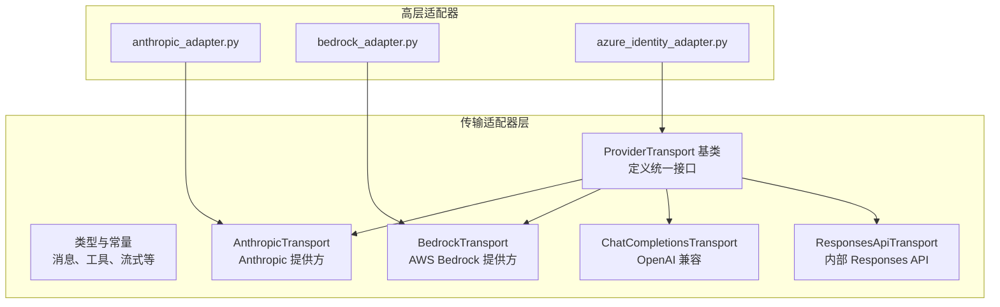
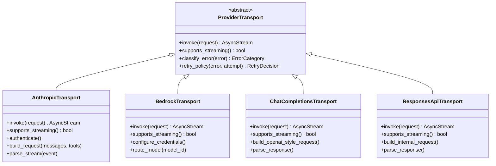
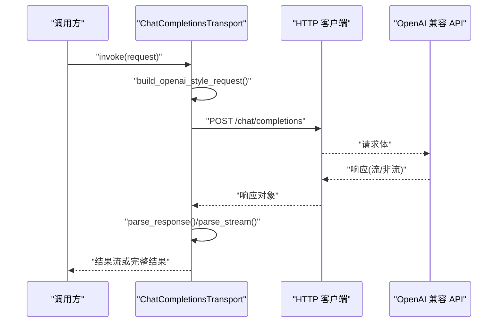
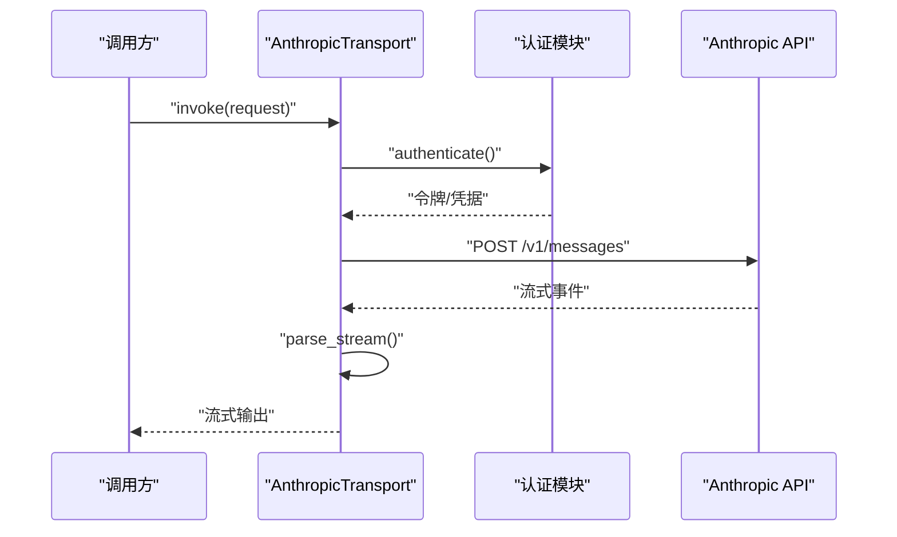
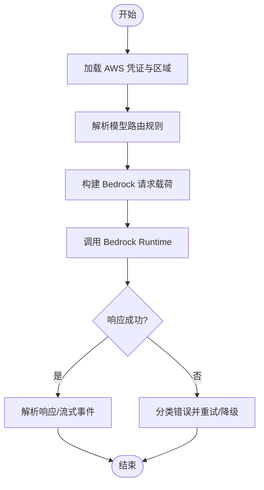
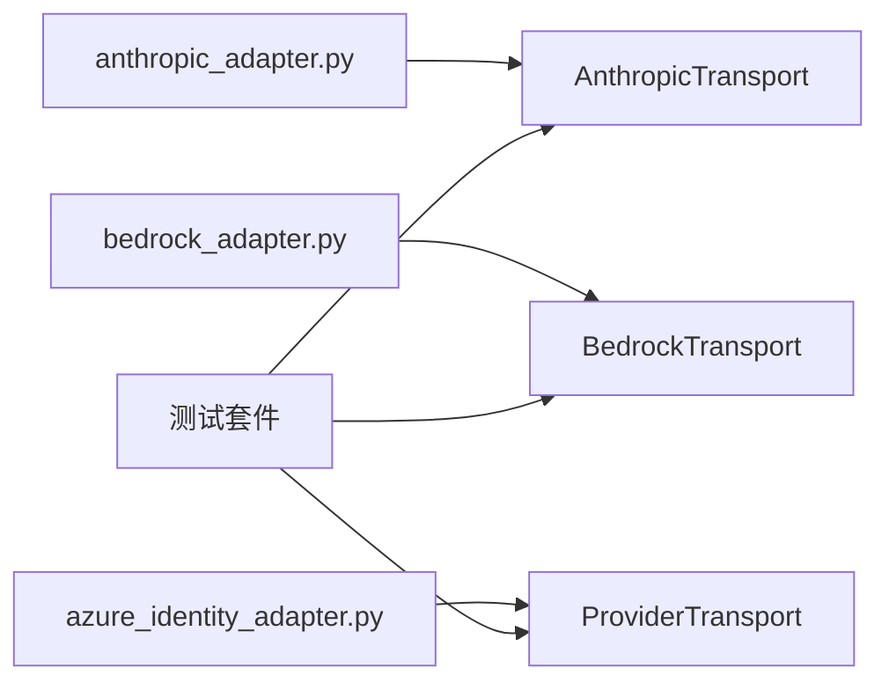

# 传输适配器

<cite>
**本文引用的文件**
- [agent/transports/base.py](file://agent/transports/base.py)
- [agent/transports/anthropic.py](file://agent/transports/anthropic.py)
- [agent/transports/bedrock.py](file://agent/transports/bedrock.py)
- [agent/transports/chat_completions.py](file://agent/transports/chat_completions.py)
- [agent/transports/codex.py](file://agent/transports/codex.py)
- [agent/transports/types.py](file://agent/transports/types.py)
- [agent/anthropic_adapter.py](file://agent/anthropic_adapter.py)
- [agent/bedrock_adapter.py](file://agent/bedrock_adapter.py)
- [agent/azure_identity_adapter.py](file://agent/azure_identity_adapter.py)
- [agent/transports/__init__.py](file://agent/transports/__init__.py)
- [tests/agent/transports/test_transport.py](file://tests/agent/transports/test_transport.py)
- [tests/agent/transports/test_bedrock_transport.py](file://tests/agent/transports/test_bedrock_transport.py)
- [tests/agent/transports/test_codex_transport.py](file://tests/agent/transports/test_codex_transport.py)
- [tests/agent/test_azure_identity_adapter.py](file://tests/agent/test_azure_identity_adapter.py)
</cite>

## 目录
1. [简介](#简介)
2. [项目结构](#项目结构)
3. [核心组件](#核心组件)
4. [架构总览](#架构总览)
5. [详细组件分析](#详细组件分析)
6. [依赖关系分析](#依赖关系分析)
7. [性能考量](#性能考量)
8. [故障排查指南](#故障排查指南)
9. [结论](#结论)
10. [附录：自定义适配器开发指南](#附录自定义适配器开发指南)

## 简介
本文件系统性梳理传输适配器的设计与实现，覆盖以下主题：
- 设计架构与接口规范：统一抽象基类、通用类型与注册机制
- OpenAI 兼容传输适配器：HTTP 客户端、请求构建与响应处理
- Anthropic 适配器：API 集成、认证流程与流式响应处理
- Bedrock 适配器：AWS 集成、凭证管理与模型路由
- Azure Identity 适配器：身份验证机制与权限管理
- 配置选项、错误处理策略与性能优化建议
- 自定义传输适配器的开发指南与最佳实践

## 项目结构
传输适配器位于 agent/transports 子模块，采用“按提供方分文件”的组织方式，并通过统一的 ProviderTransport 抽象进行扩展。同时，顶层适配器（如 anthropic_adapter、bedrock_adapter、azure_identity_adapter）作为更高层的集成入口。

图表来源
- [agent/transports/base.py:1-120](file://agent/transports/base.py#L1-L120)
- [agent/transports/anthropic.py:1-120](file://agent/transports/anthropic.py#L1-L120)
- [agent/transports/bedrock.py:1-120](file://agent/transports/bedrock.py#L1-L120)
- [agent/transports/chat_completions.py:1-120](file://agent/transports/chat_completions.py#L1-L120)
- [agent/transports/codex.py:1-120](file://agent/transports/codex.py#L1-L120)
- [agent/anthropic_adapter.py:1-200](file://agent/anthropic_adapter.py#L1-L200)
- [agent/bedrock_adapter.py:1-200](file://agent/bedrock_adapter.py#L1-L200)
- [agent/azure_identity_adapter.py:1-200](file://agent/azure_identity_adapter.py#L1-L200)

章节来源
- [agent/transports/__init__.py:1-100](file://agent/transports/__init__.py#L1-L100)
- [agent/transports/base.py:1-120](file://agent/transports/base.py#L1-L120)
- [agent/transports/types.py:1-200](file://agent/transports/types.py#L1-L200)

## 核心组件
- ProviderTransport 抽象基类：定义统一的异步调用接口、流式处理约定、错误分类与重试策略钩子
- 传输实现：AnthropicTransport、BedrockTransport、ChatCompletionsTransport、ResponsesApiTransport
- 类型系统：消息格式、工具调用、流式事件、模型元数据等
- 高层适配器：anthropic_adapter、bedrock_adapter、azure_identity_adapter 封装认证与路由

章节来源
- [agent/transports/base.py:1-120](file://agent/transports/base.py#L1-L120)
- [agent/transports/types.py:1-200](file://agent/transports/types.py#L1-L200)
- [agent/transports/anthropic.py:1-120](file://agent/transports/anthropic.py#L1-L120)
- [agent/transports/bedrock.py:1-120](file://agent/transports/bedrock.py#L1-L120)
- [agent/transports/chat_completions.py:1-120](file://agent/transports/chat_completions.py#L1-L120)
- [agent/transports/codex.py:1-120](file://agent/transports/codex.py#L1-L120)

## 架构总览
传输适配器遵循“抽象统一 + 多实现并存”的设计。上层业务通过统一接口发起请求，底层根据提供方差异封装 HTTP 客户端、认证与流式协议。

图表来源
- [agent/transports/base.py:1-120](file://agent/transports/base.py#L1-L120)
- [agent/transports/anthropic.py:1-120](file://agent/transports/anthropic.py#L1-L120)
- [agent/transports/bedrock.py:1-120](file://agent/transports/bedrock.py#L1-L120)
- [agent/transports/chat_completions.py:1-120](file://agent/transports/chat_completions.py#L1-L120)
- [agent/transports/codex.py:1-120](file://agent/transports/codex.py#L1-L120)

## 详细组件分析

### ProviderTransport 抽象基类
- 职责：定义统一的异步调用契约、流式输出约定、错误分类与重试策略
- 关键方法：invoke、supports_streaming、classify_error、retry_policy
- 设计要点：面向接口编程，便于替换与扩展；支持可插拔的错误处理与重试逻辑

章节来源
- [agent/transports/base.py:1-120](file://agent/transports/base.py#L1-L120)

### OpenAI 兼容传输适配器（ChatCompletionsTransport）
- HTTP 客户端：基于异步 HTTP 库，支持连接池、超时与重试
- 请求构建：标准化消息格式，注入工具调用、温度、最大生成长度等参数
- 响应处理：解析 JSON 响应，支持非流式与流式两种模式；流式场景下逐段解析事件
- 错误处理：区分网络错误、协议错误、速率限制与服务端异常，应用退避重试

图表来源
- [agent/transports/chat_completions.py:1-120](file://agent/transports/chat_completions.py#L1-L120)

章节来源
- [agent/transports/chat_completions.py:1-120](file://agent/transports/chat_completions.py#L1-L120)

### Anthropic 适配器（AnthropicTransport）
- API 集成：对接 Claude 接口，支持消息与工具调用
- 认证流程：支持 API Key 与 OAuth（PKCE）等多种认证方式
- 流式响应：解析流式事件，拼接文本与工具调用片段
- 错误处理：识别鉴权失败、上下文过长、速率限制等错误类别，执行相应策略

图表来源
- [agent/transports/anthropic.py:1-120](file://agent/transports/anthropic.py#L1-L120)
- [agent/anthropic_adapter.py:1-200](file://agent/anthropic_adapter.py#L1-L200)

章节来源
- [agent/transports/anthropic.py:1-120](file://agent/transports/anthropic.py#L1-L120)
- [agent/anthropic_adapter.py:1-200](file://agent/anthropic_adapter.py#L1-L200)

### Bedrock 适配器（BedrockTransport）
- AWS 集成：通过 Bedrock Runtime 与 Bedrock Agent 服务交互
- 凭证管理：支持 IAM 角色、临时凭证与区域配置
- 模型路由：根据模型标识选择对应 Bedrock 模型族与推理配置
- 错误处理：区分 IAM 权限不足、模型不可用、请求格式错误等

图表来源
- [agent/transports/bedrock.py:1-120](file://agent/transports/bedrock.py#L1-L120)
- [agent/bedrock_adapter.py:1-200](file://agent/bedrock_adapter.py#L1-L200)

章节来源
- [agent/transports/bedrock.py:1-120](file://agent/transports/bedrock.py#L1-L120)
- [agent/bedrock_adapter.py:1-200](file://agent/bedrock_adapter.py#L1-L200)

### Azure Identity 适配器（Azure Identity）
- 身份验证机制：支持默认凭据链（Managed Identity、CLI 登录、Visual Studio）、证书与用户名/密码
- 权限管理：通过角色与作用域控制对下游服务的访问
- 集成点：为传输适配器提供统一的令牌获取与刷新能力

章节来源
- [agent/azure_identity_adapter.py:1-200](file://agent/azure_identity_adapter.py#L1-L200)

### 内部 Responses API 适配器（ResponsesApiTransport）
- 用途：内部服务响应解析与转发
- 特点：简化请求构建，专注响应解析与错误映射

章节来源
- [agent/transports/codex.py:1-120](file://agent/transports/codex.py#L1-L120)

## 依赖关系分析
- 组件内聚：各传输实现均继承 ProviderTransport，保持行为一致性
- 组件耦合：高层适配器（anthropic_adapter、bedrock_adapter、azure_identity_adapter）向下依赖具体传输实现
- 外部依赖：HTTP 客户端库、AWS SDK、OAuth 客户端等

图表来源
- [agent/anthropic_adapter.py:1-200](file://agent/anthropic_adapter.py#L1-L200)
- [agent/bedrock_adapter.py:1-200](file://agent/bedrock_adapter.py#L1-L200)
- [agent/azure_identity_adapter.py:1-200](file://agent/azure_identity_adapter.py#L1-L200)
- [agent/transports/base.py:1-120](file://agent/transports/base.py#L1-L120)
- [tests/agent/transports/test_transport.py:1-120](file://tests/agent/transports/test_transport.py#L1-L120)

章节来源
- [tests/agent/transports/test_transport.py:1-120](file://tests/agent/transports/test_transport.py#L1-L120)
- [tests/agent/transports/test_bedrock_transport.py:1-120](file://tests/agent/transports/test_bedrock_transport.py#L1-L120)
- [tests/agent/transports/test_codex_transport.py:1-120](file://tests/agent/transports/test_codex_transport.py#L1-L120)
- [tests/agent/test_azure_identity_adapter.py:1-120](file://tests/agent/test_azure_identity_adapter.py#L1-L120)

## 性能考量
- 连接复用：启用 HTTP 连接池，减少握手开销
- 超时与背压：合理设置请求超时、读取超时与流式消费节奏
- 重试策略：指数退避、抖动与幂等性保障，避免雪崩
- 缓存与预热：模型元数据与路由表缓存，降低冷启动成本
- 流式优先：在满足延迟目标的前提下优先使用流式响应以提升感知速度

## 故障排查指南
- 常见错误分类：网络超时、鉴权失败、速率限制、协议错误、服务端异常
- 定位手段：查看错误类别与重试决策，结合日志与指标定位瓶颈
- 处理策略：对瞬时错误自动重试，对永久性错误快速失败并回退

章节来源
- [agent/transports/base.py:1-120](file://agent/transports/base.py#L1-L120)
- [tests/agent/transports/test_transport.py:1-120](file://tests/agent/transports/test_transport.py#L1-L120)
- [tests/agent/transports/test_bedrock_transport.py:1-120](file://tests/agent/transports/test_bedrock_transport.py#L1-L120)
- [tests/agent/transports/test_codex_transport.py:1-120](file://tests/agent/transports/test_codex_transport.py#L1-L120)

## 结论
传输适配器通过统一抽象与多实现策略，实现了对多家大模型提供方的解耦集成。OpenAI 兼容适配器提供了标准的 HTTP 客户端与流式处理；Anthropic 适配器覆盖了认证与流式事件解析；Bedrock 适配器整合了 AWS 凭证与模型路由；Azure Identity 适配器则提供了企业级身份与权限管理。配合完善的错误分类与重试策略，整体具备良好的稳定性与可维护性。

## 附录：自定义适配器开发指南
- 继承 ProviderTransport：实现 invoke、supports_streaming、classify_error、retry_policy
- 请求构建：规范化消息与工具调用，注入必要头部与参数
- 流式处理：解析事件流，确保边界与完整性
- 错误分类：建立错误到类别的映射，指导重试与降级
- 配置项：提供可配置的超时、重试次数、代理与头部注入
- 测试：编写单元与集成测试，覆盖正常路径与异常路径

章节来源
- [agent/transports/base.py:1-120](file://agent/transports/base.py#L1-L120)
- [agent/transports/types.py:1-200](file://agent/transports/types.py#L1-L200)
- [tests/agent/transports/test_transport.py:1-120](file://tests/agent/transports/test_transport.py#L1-L120)