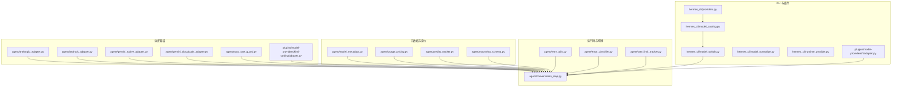
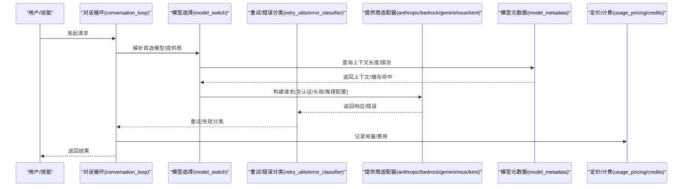
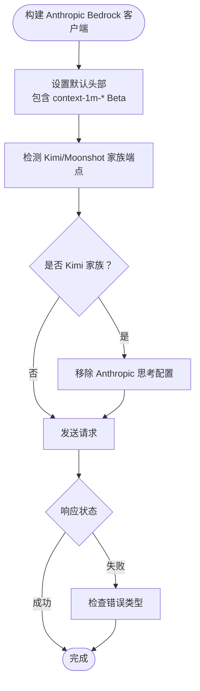
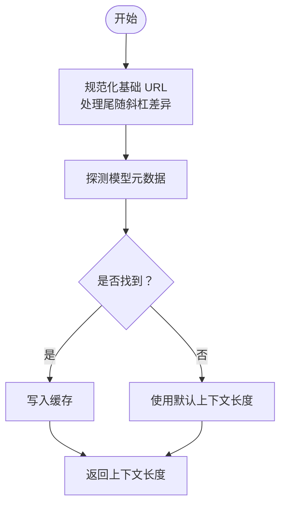
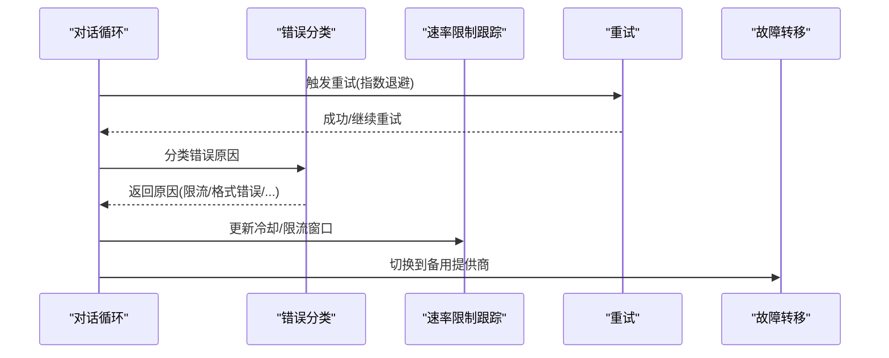
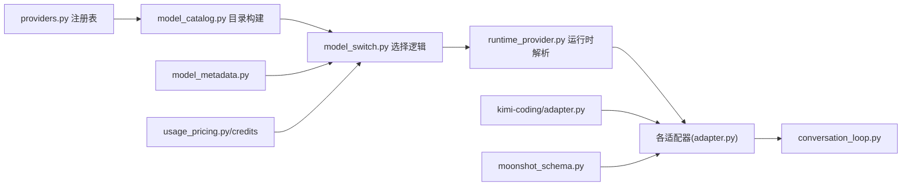

# 模型提供商

<cite>
**本文引用的文件**
- [agent/anthropic_adapter.py](file://agent/anthropic_adapter.py)
- [agent/bedrock_adapter.py](file://agent/bedrock_adapter.py)
- [agent/gemini_native_adapter.py](file://agent/gemini_native_adapter.py)
- [agent/gemini_cloudcode_adapter.py](file://agent/gemini_cloudcode_adapter.py)
- [agent/nous_rate_guard.py](file://agent/nous_rate_guard.py)
- [agent/moonshot_schema.py](file://agent/moonshot_schema.py)
- [agent/model_metadata.py](file://agent/model_metadata.py)
- [agent/rate_limit_tracker.py](file://agent/rate_limit_tracker.py)
- [agent/usage_pricing.py](file://agent/usage_pricing.py)
- [agent/credits_tracker.py](file://agent/credits_tracker.py)
- [agent/retry_utils.py](file://agent/retry_utils.py)
- [agent/error_classifier.py](file://agent/error_classifier.py)
- [agent/conversation_loop.py](file://agent/conversation_loop.py)
- [hermes_cli/providers.py](file://hermes_cli/providers.py)
- [hermes_cli/model_catalog.py](file://hermes_cli/model_catalog.py)
- [hermes_cli/model_switch.py](file://hermes_cli/model_switch.py)
- [hermes_cli/model_normalize.py](file://hermes_cli/model_normalize.py)
- [hermes_cli/runtime_provider.py](file://hermes_cli/runtime_provider.py)
- [hermes_cli/auth.py](file://hermes_cli/auth.py)
- [hermes_cli/nous_account.py](file://hermes_cli/nous_account.py)
- [hermes_cli/nous_subscription.py](file://hermes_cli/nous_subscription.py)
- [hermes_cli/xai_retirement.py](file://hermes_cli/xai_retirement.py)
- [plugins/model-providers/README.md](file://plugins/model-providers/README.md)
- [plugins/model-providers/openai/adapter.py](file://plugins/model-providers/openai/adapter.py)
- [plugins/model-providers/anthropic/adapter.py](file://plugins/model-providers/anthropic/adapter.py)
- [plugins/model-providers/bedrock/adapter.py](file://plugins/model-providers/bedrock/adapter.py)
- [plugins/model-providers/gemini/adapter.py](file://plugins/model-providers/gemini/adapter.py)
- [plugins/model-providers/nous/adapter.py](file://plugins/model-providers/nous/adapter.py)
- [plugins/model-providers/custom/adapter.py](file://plugins/model-providers/custom/adapter.py)
- [plugins/model-providers/kimi-coding/adapter.py](file://plugins/model-providers/kimi-coding/adapter.py)
- [tests/agent/test_bedrock_1m_context.py](file://tests/agent/test_bedrock_1m_context.py)
- [tests/agent/test_kimi_coding_anthropic_thinking.py](file://tests/agent/test_kimi_coding_anthropic_thinking.py)
- [tests/agent/test_moonshot_schema.py](file://tests/agent/test_moonshot_schema.py)
- [tests/agent/test_model_metadata.py](file://tests/agent/test_model_metadata.py)
- [tests/agent/test_models_dev.py](file://tests/agent/test_models_dev.py)
- [tests/agent/test_error_classifier.py](file://tests/agent/test_error_classifier.py)
- [tests/run_agent/test_run_agent.py](file://tests/run_agent/test_run_agent.py)
- [tests/hermes_cli/test_api_key_providers.py](file://tests/hermes_cli/test_api_key_providers.py)
- [tests/hermes_cli/test_inventory_pricing.py](file://tests/hermes_cli/test_inventory_pricing.py)
- [tests/hermes_cli/test_models.py](file://tests/hermes_cli/test_models.py)
- [website/i18n/zh-Hans/docusaurus-plugin-content-docs/current/user-guide/features/provider-routing.md](file://website/i18n/zh-Hans/docusaurus-plugin-content-docs/current/user-guide/features/provider-routing.md)
</cite>

## 更新摘要
**所做更改**
- 新增 Kimi/Moonshot 推理控制与基础 URL 处理优化章节
- 更新 Kimi 编码适配器与 Moonshot 模型支持
- 增强基础 URL 处理的兼容性和自动检测机制
- 完善推理配置与思考模式的处理逻辑

## 目录
1. [简介](#简介)
2. [项目结构](#项目结构)
3. [核心组件](#核心组件)
4. [架构总览](#架构总览)
5. [详细组件分析](#详细组件分析)
6. [依赖关系分析](#依赖关系分析)
7. [性能考量](#性能考量)
8. [故障排查指南](#故障排查指南)
9. [结论](#结论)
10. [附录](#附录)

## 简介
本文件系统性梳理该仓库中的"模型提供商"能力，覆盖 OpenAI、Anthropic、Bedrock、Gemini、Nous、Kimi/Moonshot 等主流与特色提供商的适配方式与运行机制；解释认证流程、API 限额与定价模型；阐述模型元数据管理、上下文长度优化与性能监控；给出提供商切换策略、负载均衡与故障转移机制；提供配置示例、最佳实践与成本控制建议，并给出自定义模型提供商的集成与扩展指南，帮助用户做出合适的提供商选择与迁移策略。

## 项目结构
围绕"模型提供商"的实现，主要分布在以下模块：
- 适配器层：针对各提供商的客户端封装与认证处理
- 元数据与定价：模型上下文长度探测、缓存与定价信息应用
- 运行时与切换：模型选择、重试、错误分类与故障转移
- CLI 与插件：提供商注册、目录与切换工具
- 文档与测试：路由策略、功能验证与回归保障

**图表来源**
- [agent/anthropic_adapter.py](file://agent/anthropic_adapter.py)
- [agent/bedrock_adapter.py](file://agent/bedrock_adapter.py)
- [agent/gemini_native_adapter.py](file://agent/gemini_native_adapter.py)
- [agent/gemini_cloudcode_adapter.py](file://agent/gemini_cloudcode_adapter.py)
- [agent/nous_rate_guard.py](file://agent/nous_rate_guard.py)
- [plugins/model-providers/kimi-coding/adapter.py](file://plugins/model-providers/kimi-coding/adapter.py)
- [agent/model_metadata.py](file://agent/model_metadata.py)
- [agent/usage_pricing.py](file://agent/usage_pricing.py)
- [agent/credits_tracker.py](file://agent/credits_tracker.py)
- [agent/moonshot_schema.py](file://agent/moonshot_schema.py)
- [agent/conversation_loop.py](file://agent/conversation_loop.py)
- [agent/retry_utils.py](file://agent/retry_utils.py)
- [agent/error_classifier.py](file://agent/error_classifier.py)
- [agent/rate_limit_tracker.py](file://agent/rate_limit_tracker.py)
- [hermes_cli/providers.py](file://hermes_cli/providers.py)
- [hermes_cli/model_catalog.py](file://hermes_cli/model_catalog.py)
- [hermes_cli/model_switch.py](file://hermes_cli/model_switch.py)
- [hermes_cli/model_normalize.py](file://hermes_cli/model_normalize.py)
- [hermes_cli/runtime_provider.py](file://hermes_cli/runtime_provider.py)
- [plugins/model-providers/README.md](file://plugins/model-providers/README.md)

## 核心组件
- 适配器（Adapter）
  - Anthropic、Bedrock、Gemini 原生与 Cloud Code 适配器负责统一请求格式、头部与认证参数。
  - Nous 适配器提供门户认证与代理路径白名单。
  - **新增** Kimi/Moonshot 适配器支持推理控制与基础 URL 自动检测。
- 元数据与定价
  - 模型上下文长度探测、缓存与回退策略；按提供商应用定价与免费/付费模型可用性。
  - **新增** Moonshot 模型模式支持与推理配置处理。
- 运行时与切换
  - 对话循环中的模型选择、重试与指数退避、错误分类与故障转移、速率限制跟踪。
- CLI 与插件
  - 提供商注册表、模型目录构建、模型切换与标准化、运行时提供商解析；插件化适配器扩展。

**章节来源**
- [agent/anthropic_adapter.py](file://agent/anthropic_adapter.py)
- [agent/bedrock_adapter.py](file://agent/bedrock_adapter.py)
- [agent/gemini_native_adapter.py](file://agent/gemini_native_adapter.py)
- [agent/gemini_cloudcode_adapter.py](file://agent/gemini_cloudcode_adapter.py)
- [agent/nous_rate_guard.py](file://agent/nous_rate_guard.py)
- [plugins/model-providers/kimi-coding/adapter.py](file://plugins/model-providers/kimi-coding/adapter.py)
- [agent/moonshot_schema.py](file://agent/moonshot_schema.py)
- [agent/model_metadata.py](file://agent/model_metadata.py)
- [agent/usage_pricing.py](file://agent/usage_pricing.py)
- [agent/credits_tracker.py](file://agent/credits_tracker.py)
- [agent/conversation_loop.py](file://agent/conversation_loop.py)
- [agent/retry_utils.py](file://agent/retry_utils.py)
- [agent/error_classifier.py](file://agent/error_classifier.py)
- [agent/rate_limit_tracker.py](file://agent/rate_limit_tracker.py)
- [hermes_cli/providers.py](file://hermes_cli/providers.py)
- [hermes_cli/model_catalog.py](file://hermes_cli/model_catalog.py)
- [hermes_cli/model_switch.py](file://hermes_cli/model_switch.py)
- [hermes_cli/model_normalize.py](file://hermes_cli/model_normalize.py)
- [hermes_cli/runtime_provider.py](file://hermes_cli/runtime_provider.py)
- [plugins/model-providers/README.md](file://plugins/model-providers/README.md)

## 架构总览
下图展示从对话循环到具体提供商适配器的调用链路，以及元数据与定价如何影响选择与行为。

**图表来源**
- [agent/conversation_loop.py](file://agent/conversation_loop.py)
- [agent/retry_utils.py](file://agent/retry_utils.py)
- [agent/error_classifier.py](file://agent/error_classifier.py)
- [agent/model_metadata.py](file://agent/model_metadata.py)
- [agent/usage_pricing.py](file://agent/usage_pricing.py)
- [agent/credits_tracker.py](file://agent/credits_tracker.py)
- [agent/anthropic_adapter.py](file://agent/anthropic_adapter.py)
- [agent/bedrock_adapter.py](file://agent/bedrock_adapter.py)
- [agent/gemini_native_adapter.py](file://agent/gemini_native_adapter.py)
- [agent/gemini_cloudcode_adapter.py](file://agent/gemini_cloudcode_adapter.py)
- [agent/nous_rate_guard.py](file://agent/nous_rate_guard.py)
- [plugins/model-providers/kimi-coding/adapter.py](file://plugins/model-providers/kimi-coding/adapter.py)

## 详细组件分析

### OpenAI 适配器
- 职责：封装 OpenAI Chat Completions 请求，处理认证与请求体映射。
- 关键点：与 CLI 的模型目录与切换配合，支持标准化模型名与运行时解析。
- 集成位置：插件目录下的 OpenAI 适配器文件。

**章节来源**
- [plugins/model-providers/openai/adapter.py](file://plugins/model-providers/openai/adapter.py)
- [hermes_cli/model_catalog.py](file://hermes_cli/model_catalog.py)
- [hermes_cli/model_switch.py](file://hermes_cli/model_switch.py)
- [hermes_cli/model_normalize.py](file://hermes_cli/model_normalize.py)

### Anthropic 适配器
- 职责：封装 Anthropic API 请求，支持 Bedrock 通道与 1M 上下文 Beta 头部。
- 关键点：构建客户端时自动携带上下文增强 Beta 头，确保 Opus 在 Bedrock 上达到 1M 上下文上限。
- **新增** Kimi/Moonshot 家族推理控制：自动检测 Kimi 家族端点并移除 Anthropic 思考配置。
- 测试验证：针对默认头部包含特定 Beta 的断言，防止上下文被静默限制。

**图表来源**
- [agent/anthropic_adapter.py](file://agent/anthropic_adapter.py)
- [tests/agent/test_kimi_coding_anthropic_thinking.py](file://tests/agent/test_kimi_coding_anthropic_thinking.py)
- [agent/bedrock_adapter.py](file://agent/bedrock_adapter.py)
- [tests/agent/test_bedrock_1m_context.py](file://tests/agent/test_bedrock_1m_context.py)

**章节来源**
- [agent/anthropic_adapter.py](file://agent/anthropic_adapter.py)
- [agent/bedrock_adapter.py](file://agent/bedrock_adapter.py)
- [tests/agent/test_kimi_coding_anthropic_thinking.py](file://tests/agent/test_kimi_coding_anthropic_thinking.py)
- [tests/agent/test_bedrock_1m_context.py](file://tests/agent/test_bedrock_1m_context.py)

### Bedrock 适配器
- 职责：封装 AWS Bedrock 客户端，支持 Anthropic 等提供商接入。
- 关键点：默认头部需包含上下文增强 Beta，避免 200K 上下文限制。
- 测试验证：断言客户端构造时默认头部包含指定 Beta，且保留其他常见 Beta。

**章节来源**
- [agent/bedrock_adapter.py](file://agent/bedrock_adapter.py)
- [tests/agent/test_bedrock_1m_context.py](file://tests/agent/test_bedrock_1m_context.py)

### Gemini 适配器
- 职责：封装 Google Gemini API 请求，支持原生与 Cloud Code 两种接入方式。
- 关键点：根据提供商差异设置基础 URL 与认证参数；Cloud Code 适配器支持特定路径与参数。

**章节来源**
- [agent/gemini_native_adapter.py](file://agent/gemini_native_adapter.py)
- [agent/gemini_cloudcode_adapter.py](file://agent/gemini_cloudcode_adapter.py)

### Nous 适配器
- 职责：封装 Nous Portal 认证与代理路径，支持 agent key 与刷新令牌。
- 关键点：认证状态由本地 auth.json 维护；适配器暴露允许的路径集合。
- 测试验证：不同认证态（无文件、缺少 provider、仅有 refresh_token）的行为断言。

**章节来源**
- [agent/nous_rate_guard.py](file://agent/nous_rate_guard.py)
- [hermes_cli/nous_account.py](file://hermes_cli/nous_account.py)
- [hermes_cli/nous_subscription.py](file://hermes_cli/nous_subscription.py)
- [tests/hermes_cli/test_proxy.py](file://tests/hermes_cli/test_proxy.py)

### Kimi/Moonshot 适配器
- 职责：封装 Kimi/Moonshot API 请求，支持推理控制与基础 URL 自动检测。
- 关键点：自动识别 Kimi 家族端点（包括自定义/代理端点），移除 Anthropic 思考配置；支持 Moonshot 中国版端点。
- **新增** 基础 URL 处理优化：支持 Kimi 密钥前缀自动检测，优先使用 Kimi 编码端点。
- 测试验证：Kimi 家族端点推理控制、Moonshot 中国端点参数处理、基础 URL 自动检测。

**章节来源**
- [plugins/model-providers/kimi-coding/adapter.py](file://plugins/model-providers/kimi-coding/adapter.py)
- [tests/agent/test_kimi_coding_anthropic_thinking.py](file://tests/agent/test_kimi_coding_anthropic_thinking.py)
- [tests/run_agent/test_run_agent.py](file://tests/run_agent/test_run_agent.py)
- [tests/hermes_cli/test_api_key_providers.py](file://tests/hermes_cli/test_api_key_providers.py)

### Moonshot 模型模式支持
- 职责：提供 Moonshot 模型的专用模式支持与推理配置处理。
- 关键点：支持 Moonshot 官方端点（api.moonshot.ai）与国内端点（api.moonshot.cn）；自动设置最大令牌数与推理配置。
- 测试验证：Moonshot 中国端点参数处理、推理配置注入、最大令牌数设置。

**章节来源**
- [agent/moonshot_schema.py](file://agent/moonshot_schema.py)
- [tests/agent/test_moonshot_schema.py](file://tests/agent/test_moonshot_schema.py)
- [tests/run_agent/test_run_agent.py](file://tests/run_agent/test_run_agent.py)

### 模型元数据与上下文长度优化
- 职责：动态探测模型上下文长度，持久化缓存，提供回退策略。
- 关键点：支持从提供商 API、端点元数据与本地缓存获取；对特定提供商（如 xAI）保留已知正确值。
- **新增** 基础 URL 处理优化：容忍尾随斜杠差异，确保不同配置格式的一致性。
- 测试验证：多型号上下文长度断言、缓存保存/加载、异常 YAML 处理、回退优先级。

**图表来源**
- [agent/model_metadata.py](file://agent/model_metadata.py)
- [tests/agent/test_model_metadata.py](file://tests/agent/test_model_metadata.py)
- [tests/hermes_cli/test_model_switch_context_display.py](file://tests/hermes_cli/test_model_switch_context_display.py)

**章节来源**
- [agent/model_metadata.py](file://agent/model_metadata.py)
- [tests/agent/test_model_metadata.py](file://tests/agent/test_model_metadata.py)
- [tests/hermes_cli/test_model_switch_context_display.py](file://tests/hermes_cli/test_model_switch_context_display.py)

### 定价模型与成本控制
- 职责：按提供商拉取实时定价，应用到模型目录，支持免费/付费模型可用性过滤。
- 关键点：对特定提供商（如 Novita、Nous）的定价缓存与失败降级处理；免费层级对付费模型进行可用性门控。
- 测试验证：免费/付费模型可用性、失败降级、空定价跳过。

**章节来源**
- [agent/usage_pricing.py](file://agent/usage_pricing.py)
- [agent/credits_tracker.py](file://agent/credits_tracker.py)
- [tests/hermes_cli/test_inventory_pricing.py](file://tests/hermes_cli/test_inventory_pricing.py)
- [tests/hermes_cli/test_api_key_providers.py](file://tests/hermes_cli/test_api_key_providers.py)

### 运行时与故障转移
- 职责：在对话循环中执行模型选择、重试、错误分类与故障转移；记录速率限制与冷却时间。
- 关键点：错误分类识别格式错误、限流等；主备切换时避免重复延长冷却；重试采用指数退避。
- 测试验证：故障转移冷却时间不叠加、错误分类健壮性（列表/整数/None 消息）。

**图表来源**
- [agent/conversation_loop.py](file://agent/conversation_loop.py)
- [agent/retry_utils.py](file://agent/retry_utils.py)
- [agent/error_classifier.py](file://agent/error_classifier.py)
- [agent/rate_limit_tracker.py](file://agent/rate_limit_tracker.py)
- [tests/run_agent/test_primary_runtime_restore.py](file://tests/run_agent/test_primary_runtime_restore.py)
- [tests/agent/test_error_classifier.py](file://tests/agent/test_error_classifier.py)

**章节来源**
- [agent/conversation_loop.py](file://agent/conversation_loop.py)
- [agent/retry_utils.py](file://agent/retry_utils.py)
- [agent/error_classifier.py](file://agent/error_classifier.py)
- [agent/rate_limit_tracker.py](file://agent/rate_limit_tracker.py)
- [tests/run_agent/test_primary_runtime_restore.py](file://tests/run_agent/test_primary_runtime_restore.py)
- [tests/agent/test_error_classifier.py](file://tests/agent/test_error_classifier.py)

### 自定义模型提供商集成与扩展
- 插件化适配器：在 plugins/model-providers 下新增子目录与 adapter.py，遵循统一接口即可被系统发现与使用。
- 扩展指南：参考现有适配器的认证、请求头、路径白名单与错误处理模式；在 CLI 层面通过注册表与目录构建工具纳入模型目录。

**章节来源**
- [plugins/model-providers/README.md](file://plugins/model-providers/README.md)
- [plugins/model-providers/custom/adapter.py](file://plugins/model-providers/custom/adapter.py)
- [hermes_cli/providers.py](file://hermes_cli/providers.py)
- [hermes_cli/model_catalog.py](file://hermes_cli/model_catalog.py)

## 依赖关系分析
- 适配器依赖于运行时环境变量与认证存储（如 HERMES_HOME 下的 auth.json），并通过统一的对话循环接入。
- 元数据与定价模块为模型选择提供输入，影响上下文长度与可用性。
- CLI 层负责模型目录构建、标准化与运行时解析，连接前端与后端。

**图表来源**
- [hermes_cli/providers.py](file://hermes_cli/providers.py)
- [hermes_cli/model_catalog.py](file://hermes_cli/model_catalog.py)
- [hermes_cli/model_switch.py](file://hermes_cli/model_switch.py)
- [hermes_cli/runtime_provider.py](file://hermes_cli/runtime_provider.py)
- [plugins/model-providers/*/adapter.py](file://plugins/model-providers/anthropic/adapter.py)
- [agent/conversation_loop.py](file://agent/conversation_loop.py)
- [agent/model_metadata.py](file://agent/model_metadata.py)
- [agent/usage_pricing.py](file://agent/usage_pricing.py)
- [agent/credits_tracker.py](file://agent/credits_tracker.py)
- [plugins/model-providers/kimi-coding/adapter.py](file://plugins/model-providers/kimi-coding/adapter.py)
- [agent/moonshot_schema.py](file://agent/moonshot_schema.py)

**章节来源**
- [hermes_cli/providers.py](file://hermes_cli/providers.py)
- [hermes_cli/model_catalog.py](file://hermes_cli/model_catalog.py)
- [hermes_cli/model_switch.py](file://hermes_cli/model_switch.py)
- [hermes_cli/runtime_provider.py](file://hermes_cli/runtime_provider.py)
- [plugins/model-providers/README.md](file://plugins/model-providers/README.md)

## 性能考量
- 上下文长度优化：通过元数据探测与缓存减少重复查询；对特定提供商的已知正确值进行保护，避免错误缓存导致的性能回退。
- **新增** 基础 URL 处理优化：规范化处理尾随斜杠差异，减少配置不一致导致的额外查询。
- 重试与退避：指数退避降低对上游的压力峰值；错误分类精准区分可重试与不可重试错误。
- 速率限制与冷却：基于错误分类更新冷却时间，避免在限流窗口内反复尝试。
- 定价与成本：按提供商应用定价，结合"排序/优先级/忽略/仅限"策略在成本、延迟与吞吐之间权衡。

**章节来源**
- [agent/model_metadata.py](file://agent/model_metadata.py)
- [agent/retry_utils.py](file://agent/retry_utils.py)
- [agent/error_classifier.py](file://agent/error_classifier.py)
- [agent/rate_limit_tracker.py](file://agent/rate_limit_tracker.py)
- [agent/usage_pricing.py](file://agent/usage_pricing.py)
- [website/i18n/zh-Hans/docusaurus-plugin-content-docs/current/user-guide/features/provider-routing.md](file://website/i18n/zh-Hans/docusaurus-plugin-content-docs/current/user-guide/features/provider-routing.md)

## 故障排查指南
- 认证问题
  - 检查 auth.json 中的 provider 字段是否存在与格式是否正确；Nous 适配器需要 agent_key 或 access/refresh token。
- 上下文长度异常
  - 清理缓存或强制刷新元数据；确认特定提供商的已知正确值未被错误覆盖。
  - **新增** 检查基础 URL 配置，确保尾随斜杠一致性。
- 限流与冷却
  - 查看错误分类结果与冷却时间更新；必要时调整重试策略或切换到备用提供商。
- 定价与可用性
  - 若付费模型不可用，确认账户层级与免费门控逻辑；检查定价拉取失败的降级处理。
- **新增** Kimi/Moonshot 相关问题
  - 检查 Kimi 家族端点识别是否正确；确认推理配置是否被正确移除。
  - 验证基础 URL 自动检测是否按预期工作，特别是 Kimi 密钥前缀场景。

**章节来源**
- [tests/hermes_cli/test_proxy.py](file://tests/hermes_cli/test_proxy.py)
- [tests/agent/test_model_metadata.py](file://tests/agent/test_model_metadata.py)
- [tests/agent/test_error_classifier.py](file://tests/agent/test_error_classifier.py)
- [tests/run_agent/test_primary_runtime_restore.py](file://tests/run_agent/test_primary_runtime_restore.py)
- [tests/hermes_cli/test_inventory_pricing.py](file://tests/hermes_cli/test_inventory_pricing.py)
- [tests/agent/test_kimi_coding_anthropic_thinking.py](file://tests/agent/test_kimi_coding_anthropic_thinking.py)
- [tests/run_agent/test_run_agent.py](file://tests/run_agent/test_run_agent.py)
- [tests/hermes_cli/test_api_key_providers.py](file://tests/hermes_cli/test_api_key_providers.py)

## 结论
该系统通过插件化的适配器、完善的元数据与定价体系、稳健的运行时与故障转移机制，实现了对多家模型提供商的一致接入与高效调度。**最新更新增强了 Kimi/Moonshot 推理控制与基础 URL 处理优化**，进一步提升了对中文生态模型的支持能力。结合路由策略与成本控制手段，可在不同场景下平衡性能、成本与稳定性。对于新提供商，遵循现有适配器模式与 CLI 工具即可快速集成。

## 附录

### 认证机制概览
- OpenAI：通过插件适配器封装认证与请求体映射。
- Anthropic：支持直接 API 与 Bedrock 通道，Bedrock 需要上下文增强 Beta。
- Gemini：原生与 Cloud Code 两种接入，分别设置基础 URL 与认证参数。
- Nous：门户认证，支持 agent key 与刷新令牌，路径白名单由适配器维护。
- **新增** Kimi/Moonshot：支持推理控制与基础 URL 自动检测，Kimi 家族端点自动移除 Anthropic 思考配置。

**章节来源**
- [plugins/model-providers/openai/adapter.py](file://plugins/model-providers/openai/adapter.py)
- [agent/anthropic_adapter.py](file://agent/anthropic_adapter.py)
- [agent/bedrock_adapter.py](file://agent/bedrock_adapter.py)
- [agent/gemini_native_adapter.py](file://agent/gemini_native_adapter.py)
- [agent/gemini_cloudcode_adapter.py](file://agent/gemini_cloudcode_adapter.py)
- [agent/nous_rate_guard.py](file://agent/nous_rate_guard.py)
- [plugins/model-providers/kimi-coding/adapter.py](file://plugins/model-providers/kimi-coding/adapter.py)

### API 限制与定价模型
- 限流与冷却：基于错误分类更新速率限制窗口，避免在限流期内反复重试。
- 定价应用：按提供商拉取实时定价，免费层级对付费模型进行可用性门控。
- 测试覆盖：对 Novita、Nous 等提供商的定价缓存与失败降级进行验证。

**章节来源**
- [agent/rate_limit_tracker.py](file://agent/rate_limit_tracker.py)
- [agent/usage_pricing.py](file://agent/usage_pricing.py)
- [agent/credits_tracker.py](file://agent/credits_tracker.py)
- [tests/hermes_cli/test_inventory_pricing.py](file://tests/hermes_cli/test_inventory_pricing.py)
- [tests/hermes_cli/test_api_key_providers.py](file://tests/hermes_cli/test_api_key_providers.py)

### 模型元数据管理与上下文长度优化
- 探测与缓存：优先使用提供商 API 与端点元数据，回退至默认值并持久化缓存。
- 特定提供商保护：对已知正确值（如 xAI）进行保护，避免错误缓存影响。
- **新增** 基础 URL 处理优化：容忍尾随斜杠差异，确保配置兼容性。
- 测试覆盖：多型号上下文长度断言、缓存读写、异常处理与回退优先级。

**章节来源**
- [agent/model_metadata.py](file://agent/model_metadata.py)
- [tests/agent/test_model_metadata.py](file://tests/agent/test_model_metadata.py)
- [tests/hermes_cli/test_model_switch_context_display.py](file://tests/hermes_cli/test_model_switch_context_display.py)

### 性能监控与可观测性
- 使用用量与费用：通过 usage_pricing 与 credits_tracker 记录输入/输出 token 与费用。
- 错误分类与重试：基于错误类型决定是否重试与退避策略。
- 路由策略：通过 provider_routing 配置排序（价格/延迟/吞吐）、优先级、忽略与仅限策略。

**章节来源**
- [agent/usage_pricing.py](file://agent/usage_pricing.py)
- [agent/credits_tracker.py](file://agent/credits_tracker.py)
- [agent/retry_utils.py](file://agent/retry_utils.py)
- [website/i18n/zh-Hans/docusaurus-plugin-content-docs/current/user-guide/features/provider-routing.md](file://website/i18n/zh-Hans/docusaurus-plugin-content-docs/current/user-guide/features/provider-routing.md)

### 提供商切换策略、负载均衡与故障转移
- 切换策略：基于 provider_routing 的排序与优先级，结合成本、延迟与吞吐进行选择。
- 负载均衡：通过排序与参数要求（如 temperature/top_p/tools）在多个提供商间分配。
- 故障转移：错误分类触发故障转移，避免在限流窗口内重复尝试；主备切换时保持冷却时间稳定。

**章节来源**
- [website/i18n/zh-Hans/docusaurus-plugin-content-docs/current/user-guide/features/provider-routing.md](file://website/i18n/zh-Hans/docusaurus-plugin-content-docs/current/user-guide/features/provider-routing.md)
- [tests/run_agent/test_primary_runtime_restore.py](file://tests/run_agent/test_primary_runtime_restore.py)
- [tests/agent/test_error_classifier.py](file://tests/agent/test_error_classifier.py)

### 配置示例与最佳实践
- provider_routing 示例：按价格/延迟/吞吐排序、锁定特定提供商、忽略特定提供商、拒绝数据收集等。
- 最佳实践：在开发/高频使用场景优先成本；交互式场景优先延迟；长文本生成优先吞吐；为付费模型配置免费门控。
- **新增** Kimi/Moonshot 配置建议：使用 Kimi 密钥前缀自动检测功能，确保推理配置正确处理。

**章节来源**
- [website/i18n/zh-Hans/docusaurus-plugin-content-docs/current/user-guide/features/provider-routing.md](file://website/i18n/zh-Hans/docusaurus-plugin-content-docs/current/user-guide/features/provider-routing.md)

### 成本控制建议
- 启用 provider_routing 的 price 排序，结合提供商实时定价应用到目录。
- 对付费模型启用免费门控，避免在免费层级产生不可用的请求。
- 使用缓存与探测减少重复查询，降低网络开销。

**章节来源**
- [agent/usage_pricing.py](file://agent/usage_pricing.py)
- [agent/credits_tracker.py](file://agent/credits_tracker.py)
- [tests/hermes_cli/test_inventory_pricing.py](file://tests/hermes_cli/test_inventory_pricing.py)

### 自定义模型提供商集成方法与扩展指南
- 新增适配器：在 plugins/model-providers 下创建子目录与 adapter.py，遵循统一接口。
- 注册与目录：通过 providers.py 与 model_catalog.py 将新适配器纳入注册表与模型目录。
- 运行时解析：使用 runtime_provider.py 与 model_switch.py 完成运行时解析与选择。

**章节来源**
- [plugins/model-providers/README.md](file://plugins/model-providers/README.md)
- [plugins/model-providers/custom/adapter.py](file://plugins/model-providers/custom/adapter.py)
- [hermes_cli/providers.py](file://hermes_cli/providers.py)
- [hermes_cli/model_catalog.py](file://hermes_cli/model_catalog.py)
- [hermes_cli/runtime_provider.py](file://hermes_cli/runtime_provider.py)
- [hermes_cli/model_switch.py](file://hermes_cli/model_switch.py)

### 选择合适提供商的决策依据与迁移策略
- 决策依据：根据任务类型（推理/长上下文/多模态/音视频）与约束（成本/延迟/吞吐/合规）选择。
- 迁移策略：先在测试环境验证上下文长度与定价，再逐步切换；利用 provider_routing 的 ignore/order/only 控制迁移范围与风险。

**章节来源**
- [tests/agent/test_models_dev.py](file://tests/agent/test_models_dev.py)
- [tests/hermes_cli/test_models.py](file://tests/hermes_cli/test_models.py)
- [website/i18n/zh-Hans/docusaurus-plugin-content-docs/current/user-guide/features/provider-routing.md](file://website/i18n/zh-Hans/docusaurus-plugin-content-docs/current/user-guide/features/provider-routing.md)

### Kimi/Moonshot 推理控制与基础 URL 处理优化详解
- **推理控制机制**：系统能够自动识别 Kimi/Moonshot 家族端点（包括自定义/代理端点），并移除 Anthropic 思考配置，防止上游验证错误。
- **基础 URL 自动检测**：支持 Kimi 密钥前缀自动检测，优先使用 Kimi 编码端点；环境变量优先级高于密钥前缀检测。
- **Moonshot 中国端点支持**：自动识别 api.moonshot.cn 中国端点，应用相同的推理配置与最大令牌数设置。
- **配置兼容性**：容忍基础 URL 的尾随斜杠差异，确保不同配置格式的一致性。

**章节来源**
- [agent/anthropic_adapter.py](file://agent/anthropic_adapter.py)
- [plugins/model-providers/kimi-coding/adapter.py](file://plugins/model-providers/kimi-coding/adapter.py)
- [agent/moonshot_schema.py](file://agent/moonshot_schema.py)
- [tests/agent/test_kimi_coding_anthropic_thinking.py](file://tests/agent/test_kimi_coding_anthropic_thinking.py)
- [tests/run_agent/test_run_agent.py](file://tests/run_agent/test_run_agent.py)
- [tests/hermes_cli/test_api_key_providers.py](file://tests/hermes_cli/test_api_key_providers.py)