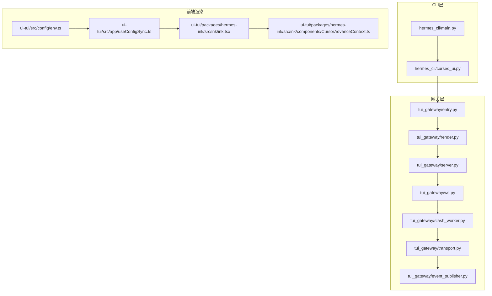
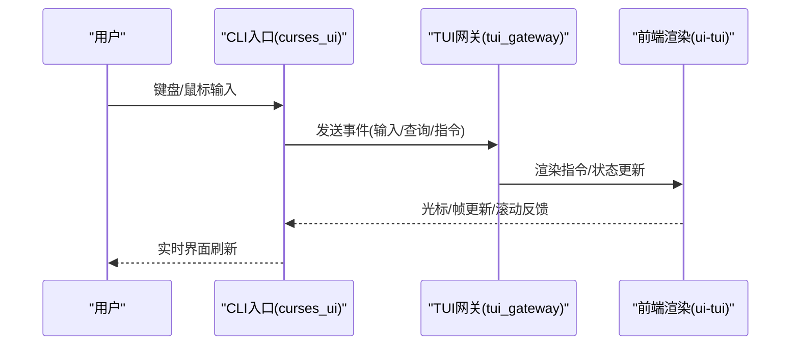
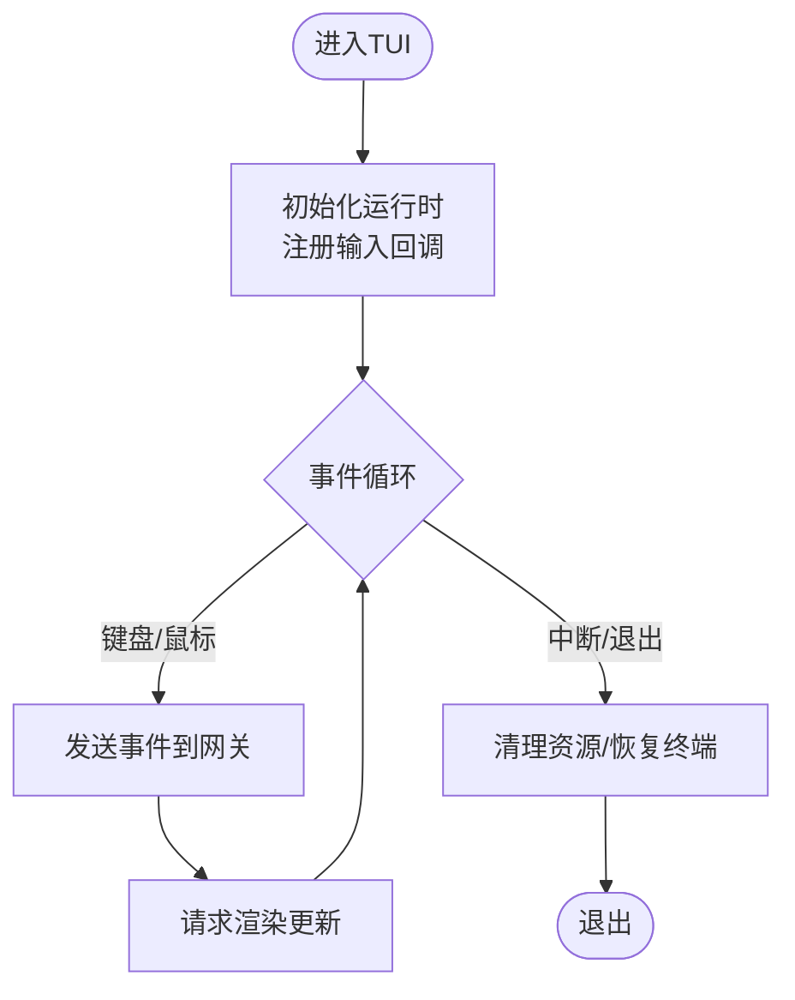
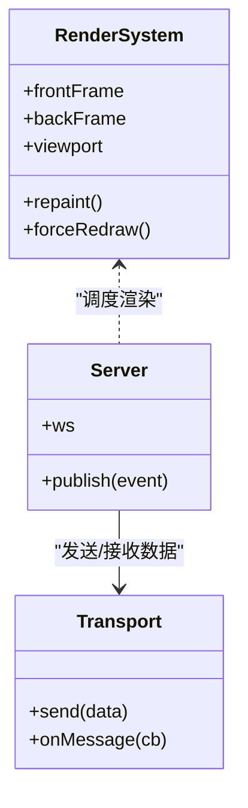
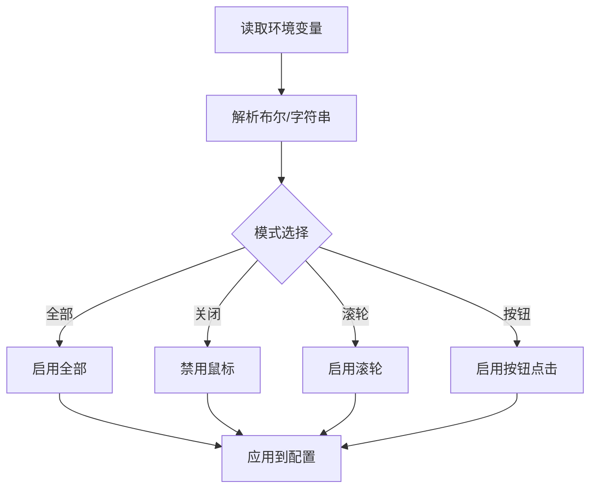
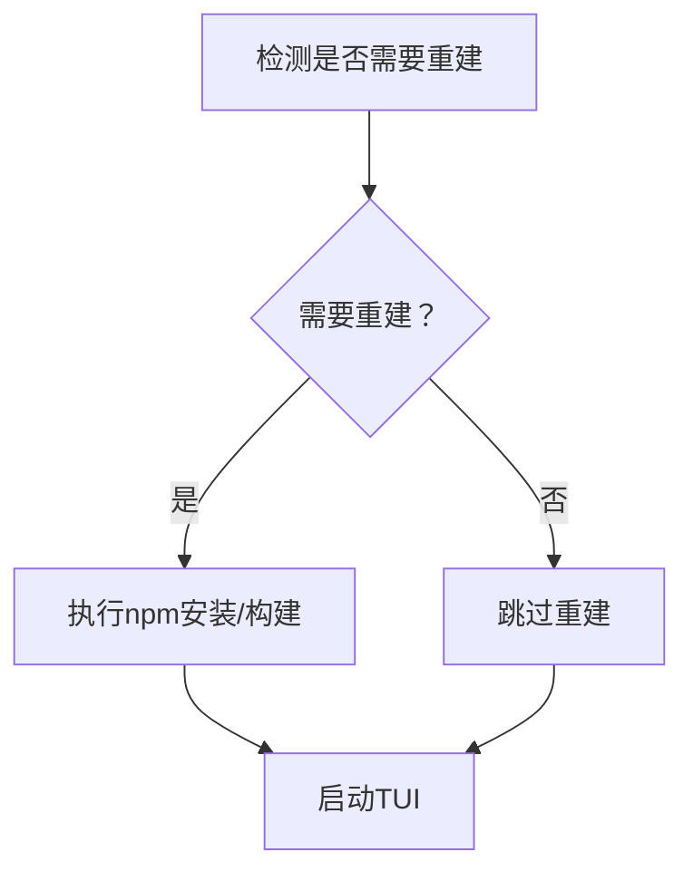
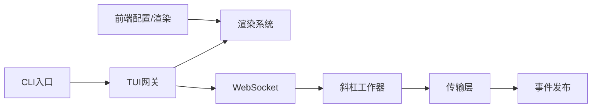
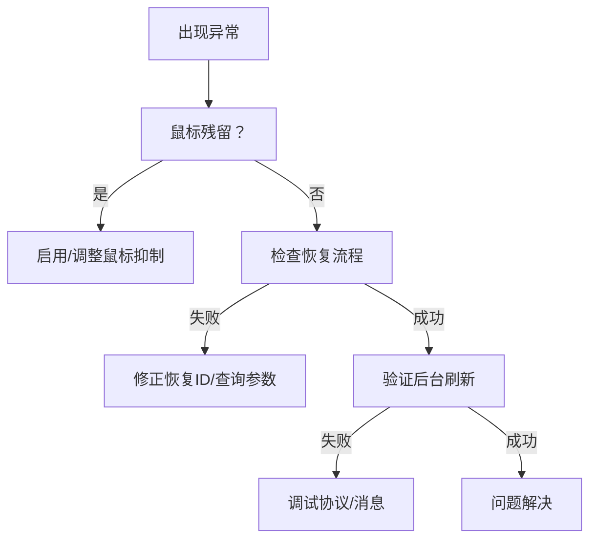

# TUI界面

<cite>
**本文引用的文件**
- [hermes_cli/curses_ui.py](file://hermes_cli/curses_ui.py)
- [hermes_cli/main.py](file://hermes_cli/main.py)
- [tui_gateway/entry.py](file://tui_gateway/entry.py)
- [tui_gateway/render.py](file://tui_gateway/render.py)
- [tui_gateway/server.py](file://tui_gateway/server.py)
- [tui_gateway/ws.py](file://tui_gateway/ws.py)
- [tui_gateway/slash_worker.py](file://tui_gateway/slash_worker.py)
- [tui_gateway/transport.py](file://tui_gateway/transport.py)
- [tui_gateway/event_publisher.py](file://tui_gateway/event_publisher.py)
- [ui-tui/src/app/useConfigSync.ts](file://ui-tui/src/app/useConfigSync.ts)
- [ui-tui/src/config/env.ts](file://ui-tui/src/config/env.ts)
- [ui-tui/packages/hermes-ink/src/ink/ink.tsx](file://ui-tui/packages/hermes-ink/src/ink/ink.tsx)
- [ui-tui/packages/hermes-ink/src/ink/components/CursorAdvanceContext.ts](file://ui-tui/packages/hermes-ink/src/ink/components/CursorAdvanceContext.ts)
- [tests/hermes_cli/test_tui_npm_install.py](file://tests/hermes_cli/test_tui_npm_install.py)
- [tests/cli/test_cli_background_tui_refresh.py](file://tests/cli/test_cli_background_tui_refresh.py)
- [tests/hermes_cli/test_tui_mouse_residue_suppression.py](file://tests/hermes_cli/test_tui_mouse_residue_suppression.py)
- [tests/hermes_cli/test_tui_resume_flow.py](file://tests/hermes_cli/test_tui_resume_flow.py)
- [tests/tui_gateway/test_render.py](file://tests/tui_gateway/test_render.py)
- [tests/tui_gateway/test_protocol.py](file://tests/tui_gateway/test_protocol.py)
- [tests/tui_gateway/test_entry_sys_path.py](file://tests/tui_gateway/test_entry_sys_path.py)
- [tests/test_tui_gateway_server.py](file://tests/test_tui_gateway_server.py)
</cite>

## 目录
1. [简介](#简介)
2. [项目结构](#项目结构)
3. [核心组件](#核心组件)
4. [架构总览](#架构总览)
5. [详细组件分析](#详细组件分析)
6. [依赖关系分析](#依赖关系分析)
7. [性能考量](#性能考量)
8. [故障排除指南](#故障排除指南)
9. [结论](#结论)
10. [附录](#附录)

## 简介
本指南面向希望高效使用并理解Hermes Agent文本用户界面（TUI）的用户与开发者。TUI以终端为载体，提供可交互、可刷新、可响应的命令行体验；同时通过网关层与渲染层实现与后端服务的解耦，支持状态显示、进度指示与动态更新等实时功能。本指南将从设计理念、导航与交互、与CLI的差异、配置与自定义、实时渲染机制、性能优化与故障排除等方面进行系统阐述。

## 项目结构
TUI相关代码主要分布在以下区域：
- hermes_cli：TUI入口与Curses UI实现，负责启动、事件循环与键盘/鼠标输入处理。
- tui_gateway：TUI网关，负责WebSocket通信、事件发布、渲染调度与协议适配。
- ui-tui：前端渲染与配置，基于React与自研渲染引擎，提供主题、鼠标行为、环境变量等配置项。
- tests：覆盖TUI构建、刷新、鼠标抑制、恢复流程与网关协议等测试用例。

**图表来源**
- [hermes_cli/main.py](file://hermes_cli/main.py)
- [hermes_cli/curses_ui.py](file://hermes_cli/curses_ui.py)
- [tui_gateway/entry.py](file://tui_gateway/entry.py)
- [tui_gateway/render.py](file://tui_gateway/render.py)
- [tui_gateway/server.py](file://tui_gateway/server.py)
- [tui_gateway/ws.py](file://tui_gateway/ws.py)
- [tui_gateway/slash_worker.py](file://tui_gateway/slash_worker.py)
- [tui_gateway/transport.py](file://tui_gateway/transport.py)
- [tui_gateway/event_publisher.py](file://tui_gateway/event_publisher.py)
- [ui-tui/src/config/env.ts](file://ui-tui/src/config/env.ts)
- [ui-tui/src/app/useConfigSync.ts](file://ui-tui/src/app/useConfigSync.ts)
- [ui-tui/packages/hermes-ink/src/ink/ink.tsx](file://ui-tui/packages/hermes-ink/src/ink/ink.tsx)
- [ui-tui/packages/hermes-ink/src/ink/components/CursorAdvanceContext.ts](file://ui-tui/packages/hermes-ink/src/ink/components/CursorAdvanceContext.ts)

**章节来源**
- [hermes_cli/main.py](file://hermes_cli/main.py)
- [hermes_cli/curses_ui.py](file://hermes_cli/curses_ui.py)
- [tui_gateway/entry.py](file://tui_gateway/entry.py)
- [tui_gateway/render.py](file://tui_gateway/render.py)
- [tui_gateway/server.py](file://tui_gateway/server.py)
- [tui_gateway/ws.py](file://tui_gateway/ws.py)
- [tui_gateway/slash_worker.py](file://tui_gateway/slash_worker.py)
- [tui_gateway/transport.py](file://tui_gateway/transport.py)
- [tui_gateway/event_publisher.py](file://tui_gateway/event_publisher.py)
- [ui-tui/src/config/env.ts](file://ui-tui/src/config/env.ts)
- [ui-tui/src/app/useConfigSync.ts](file://ui-tui/src/app/useConfigSync.ts)
- [ui-tui/packages/hermes-ink/src/ink/ink.tsx](file://ui-tui/packages/hermes-ink/src/ink/ink.tsx)
- [ui-tui/packages/hermes-ink/src/ink/components/CursorAdvanceContext.ts](file://ui-tui/packages/hermes-ink/src/ink/components/CursorAdvanceContext.ts)

## 核心组件
- CLI入口与Curses UI：负责初始化TUI运行时、处理键盘/鼠标输入、维护事件循环与渲染上下文。
- 网关层：封装WebSocket连接、事件发布、渲染调度与协议适配，确保前后端解耦与可扩展性。
- 前端渲染与配置：提供环境变量解析、鼠标行为归一化、渲染帧管理与光标通知机制，保障在不同终端中的稳定表现。

**章节来源**
- [hermes_cli/curses_ui.py](file://hermes_cli/curses_ui.py)
- [tui_gateway/entry.py](file://tui_gateway/entry.py)
- [tui_gateway/render.py](file://tui_gateway/render.py)
- [tui_gateway/server.py](file://tui_gateway/server.py)
- [tui_gateway/ws.py](file://tui_gateway/ws.py)
- [tui_gateway/slash_worker.py](file://tui_gateway/slash_worker.py)
- [tui_gateway/transport.py](file://tui_gateway/transport.py)
- [tui_gateway/event_publisher.py](file://tui_gateway/event_publisher.py)
- [ui-tui/src/config/env.ts](file://ui-tui/src/config/env.ts)
- [ui-tui/src/app/useConfigSync.ts](file://ui-tui/src/app/useConfigSync.ts)
- [ui-tui/packages/hermes-ink/src/ink/ink.tsx](file://ui-tui/packages/hermes-ink/src/ink/ink.tsx)
- [ui-tui/packages/hermes-ink/src/ink/components/CursorAdvanceContext.ts](file://ui-tui/packages/hermes-ink/src/ink/components/CursorAdvanceContext.ts)

## 架构总览
TUI采用“CLI驱动 + 网关桥接 + 前端渲染”的分层架构：
- CLI层：启动TUI运行时，建立与网关的连接，处理用户输入与系统信号。
- 网关层：统一事件与渲染调度，负责协议适配与传输抽象。
- 前端层：基于React与自研渲染引擎，提供高可用的终端渲染与交互体验。

**图表来源**
- [hermes_cli/curses_ui.py](file://hermes_cli/curses_ui.py)
- [tui_gateway/entry.py](file://tui_gateway/entry.py)
- [tui_gateway/render.py](file://tui_gateway/render.py)
- [ui-tui/src/app/useConfigSync.ts](file://ui-tui/src/app/useConfigSync.ts)

## 详细组件分析

### CLI层：Curses UI与输入处理
- 职责：初始化TUI运行时、注册键盘/鼠标回调、维护事件循环、与网关通信。
- 关键点：输入事件映射到网关协议，状态变更触发重绘，支持中断与退出清理。

**图表来源**
- [hermes_cli/curses_ui.py](file://hermes_cli/curses_ui.py)

**章节来源**
- [hermes_cli/curses_ui.py](file://hermes_cli/curses_ui.py)

### 网关层：事件发布与渲染调度
- 渲染子系统：负责帧缓冲、视口管理与渲染调度，支持全量重绘与增量更新。
- 服务器与WS：提供WebSocket通道，承载事件流与状态推送。
- 协议与传输：抽象传输层，便于替换或扩展后端。

**图表来源**
- [tui_gateway/render.py](file://tui_gateway/render.py)
- [tui_gateway/server.py](file://tui_gateway/server.py)
- [tui_gateway/transport.py](file://tui_gateway/transport.py)

**章节来源**
- [tui_gateway/render.py](file://tui_gateway/render.py)
- [tui_gateway/server.py](file://tui_gateway/server.py)
- [tui_gateway/transport.py](file://tui_gateway/transport.py)

### 前端渲染与配置：环境变量与鼠标行为
- 环境变量解析：支持启动参数与环境变量，决定默认行为（如鼠标跟踪模式）。
- 鼠标行为归一化：兼容多种输入模式（关闭/滚轮/按钮/全部），并提供向后兼容策略。
- 渲染引擎：提供帧重绘、强制刷新、光标声明与前进/后退帧管理。

**图表来源**
- [ui-tui/src/config/env.ts](file://ui-tui/src/config/env.ts)
- [ui-tui/src/app/useConfigSync.ts](file://ui-tui/src/app/useConfigSync.ts)

**章节来源**
- [ui-tui/src/config/env.ts](file://ui-tui/src/config/env.ts)
- [ui-tui/src/app/useConfigSync.ts](file://ui-tui/src/app/useConfigSync.ts)
- [ui-tui/packages/hermes-ink/src/ink/ink.tsx](file://ui-tui/packages/hermes-ink/src/ink/ink.tsx)
- [ui-tui/packages/hermes-ink/src/ink/components/CursorAdvanceContext.ts](file://ui-tui/packages/hermes-ink/src/ink/components/CursorAdvanceContext.ts)

### TUI与CLI的差异与优势
- 交互密度：TUI在单屏内提供更丰富的交互控件与状态展示，适合高频操作。
- 实时性：通过网关与渲染系统，TUI能快速反映后端状态变化，减少等待。
- 可定制：配置项丰富，支持鼠标行为、主题、刷新策略等个性化设置。
- 终端友好：针对不同终端的兼容性处理，提升跨平台一致性。

**章节来源**
- [hermes_cli/curses_ui.py](file://hermes_cli/curses_ui.py)
- [tui_gateway/render.py](file://tui_gateway/render.py)
- [ui-tui/src/app/useConfigSync.ts](file://ui-tui/src/app/useConfigSync.ts)

### 导航方法、快捷键与交互模式
- 快捷键：支持常用操作（如刷新、退出、搜索等），具体按键映射由Curses UI定义。
- 交互模式：支持文本输入、列表选择、滚动浏览与状态切换。
- 鼠标行为：根据配置启用滚轮/按钮/全部或关闭，避免与终端选择冲突。

**章节来源**
- [hermes_cli/curses_ui.py](file://hermes_cli/curses_ui.py)
- [ui-tui/src/app/useConfigSync.ts](file://ui-tui/src/app/useConfigSync.ts)

### 配置选项与自定义方法
- 环境变量：如鼠标跟踪模式、启动查询/图像参数等，可在启动前设置。
- 配置同步：前端配置与后端状态保持一致，支持动态调整。
- 自定义：通过配置文件与环境变量组合，实现个性化体验。

**章节来源**
- [ui-tui/src/config/env.ts](file://ui-tui/src/config/env.ts)
- [ui-tui/src/app/useConfigSync.ts](file://ui-tui/src/app/useConfigSync.ts)

### 实时功能：状态显示、进度指示与动态更新
- 状态显示：网关将后端状态推送到前端，渲染系统按需更新。
- 进度指示：通过增量渲染与帧缓冲，实现平滑的进度条与状态变化。
- 动态更新：事件驱动的渲染调度，保证界面与后端状态同步。

**章节来源**
- [tui_gateway/event_publisher.py](file://tui_gateway/event_publisher.py)
- [tui_gateway/render.py](file://tui_gateway/render.py)
- [ui-tui/packages/hermes-ink/src/ink/ink.tsx](file://ui-tui/packages/hermes-ink/src/ink/ink.tsx)

### 性能优化与渲染机制
- 增量渲染：仅更新变化区域，降低终端输出压力。
- 强制刷新：在外部清屏或损坏场景下，提供全量重绘路径。
- 光标管理：通过上下文通知物理光标移动，避免相对定位偏移。
- 构建与打包：前端资源的构建缓存与条件重建，减少重复安装与编译。

**图表来源**
- [tests/hermes_cli/test_tui_npm_install.py](file://tests/hermes_cli/test_tui_npm_install.py)

**章节来源**
- [ui-tui/packages/hermes-ink/src/ink/ink.tsx](file://ui-tui/packages/hermes-ink/src/ink/ink.tsx)
- [ui-tui/packages/hermes-ink/src/ink/components/CursorAdvanceContext.ts](file://ui-tui/packages/hermes-ink/src/ink/components/CursorAdvanceContext.ts)
- [tests/hermes_cli/test_tui_npm_install.py](file://tests/hermes_cli/test_tui_npm_install.py)

## 依赖关系分析
- CLI依赖网关提供的事件发布与渲染接口。
- 网关依赖传输层与渲染系统，向上提供统一协议。
- 前端依赖配置解析与渲染引擎，向下对接终端能力。

**图表来源**
- [hermes_cli/curses_ui.py](file://hermes_cli/curses_ui.py)
- [tui_gateway/entry.py](file://tui_gateway/entry.py)
- [tui_gateway/render.py](file://tui_gateway/render.py)
- [tui_gateway/ws.py](file://tui_gateway/ws.py)
- [tui_gateway/slash_worker.py](file://tui_gateway/slash_worker.py)
- [tui_gateway/transport.py](file://tui_gateway/transport.py)
- [tui_gateway/event_publisher.py](file://tui_gateway/event_publisher.py)
- [ui-tui/src/config/env.ts](file://ui-tui/src/config/env.ts)

**章节来源**
- [hermes_cli/curses_ui.py](file://hermes_cli/curses_ui.py)
- [tui_gateway/entry.py](file://tui_gateway/entry.py)
- [tui_gateway/render.py](file://tui_gateway/render.py)
- [tui_gateway/ws.py](file://tui_gateway/ws.py)
- [tui_gateway/slash_worker.py](file://tui_gateway/slash_worker.py)
- [tui_gateway/transport.py](file://tui_gateway/transport.py)
- [tui_gateway/event_publisher.py](file://tui_gateway/event_publisher.py)
- [ui-tui/src/config/env.ts](file://ui-tui/src/config/env.ts)

## 性能考量
- 减少不必要的重绘：利用增量渲染与最小化输出。
- 合理使用强制刷新：仅在必要时触发全量重绘，避免频繁清屏。
- 鼠标行为优化：在tmux等环境中启用滚轮模式，减少选择干扰。
- 构建缓存：避免重复安装与编译，缩短启动时间。

**章节来源**
- [ui-tui/packages/hermes-ink/src/ink/ink.tsx](file://ui-tui/packages/hermes-ink/src/ink/ink.tsx)
- [ui-tui/src/app/useConfigSync.ts](file://ui-tui/src/app/useConfigSync.ts)
- [tests/hermes_cli/test_tui_npm_install.py](file://tests/hermes_cli/test_tui_npm_install.py)

## 故障排除指南
- 鼠标残留问题：启用鼠标抑制策略，避免历史事件影响当前会话。
- 恢复流程异常：检查恢复ID与查询参数，确保启动参数正确。
- 刷新问题：在后台模式下验证TUI刷新逻辑，确保状态同步。
- 网关协议错误：核对协议版本与消息格式，确保前后端兼容。

**图表来源**
- [tests/hermes_cli/test_tui_mouse_residue_suppression.py](file://tests/hermes_cli/test_tui_mouse_residue_suppression.py)
- [tests/hermes_cli/test_tui_resume_flow.py](file://tests/hermes_cli/test_tui_resume_flow.py)
- [tests/cli/test_cli_background_tui_refresh.py](file://tests/cli/test_cli_background_tui_refresh.py)
- [tests/tui_gateway/test_protocol.py](file://tests/tui_gateway/test_protocol.py)

**章节来源**
- [tests/hermes_cli/test_tui_mouse_residue_suppression.py](file://tests/hermes_cli/test_tui_mouse_residue_suppression.py)
- [tests/hermes_cli/test_tui_resume_flow.py](file://tests/hermes_cli/test_tui_resume_flow.py)
- [tests/cli/test_cli_background_tui_refresh.py](file://tests/cli/test_cli_background_tui_refresh.py)
- [tests/tui_gateway/test_protocol.py](file://tests/tui_gateway/test_protocol.py)

## 结论
TUI通过清晰的分层设计与完善的事件/渲染机制，在终端中提供了接近图形界面的交互体验。结合灵活的配置与优化策略，用户可以在不同环境下获得稳定、流畅且可定制的使用体验。建议优先掌握输入/输出映射、鼠标行为与刷新策略，以充分发挥TUI的交互潜力。

## 附录
- 最佳实践与使用技巧
  - 使用环境变量快速切换鼠标模式，避免与终端选择冲突。
  - 在tmux中启用滚轮模式，减少选择干扰。
  - 合理使用强制刷新，仅在必要时触发全量重绘。
  - 通过恢复ID与查询参数快速回到上次会话状态。
  - 定期检查构建缓存，减少重复安装与编译。

**章节来源**
- [ui-tui/src/config/env.ts](file://ui-tui/src/config/env.ts)
- [ui-tui/src/app/useConfigSync.ts](file://ui-tui/src/app/useConfigSync.ts)
- [tests/hermes_cli/test_tui_npm_install.py](file://tests/hermes_cli/test_tui_npm_install.py)
- [tests/hermes_cli/test_tui_resume_flow.py](file://tests/hermes_cli/test_tui_resume_flow.py)