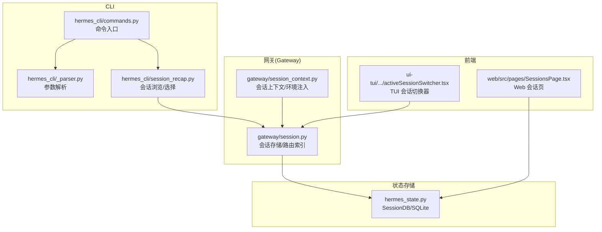
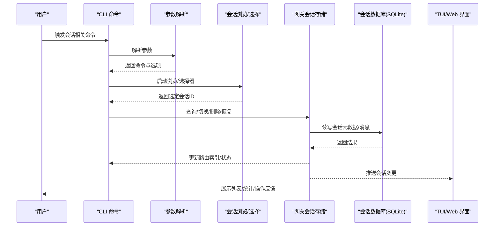
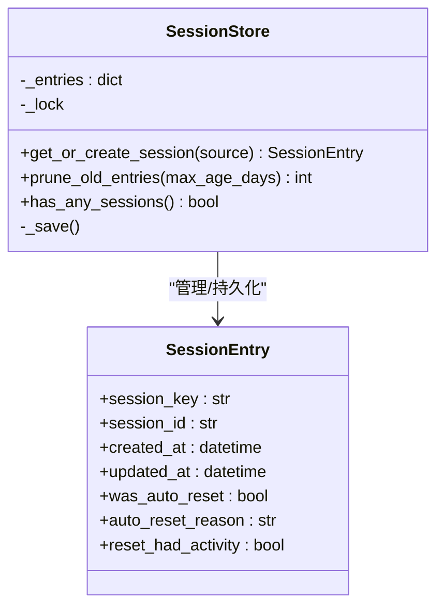
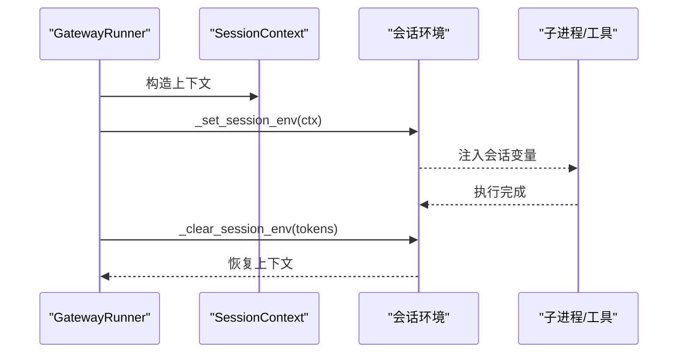
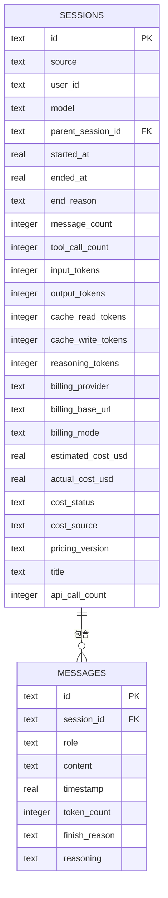
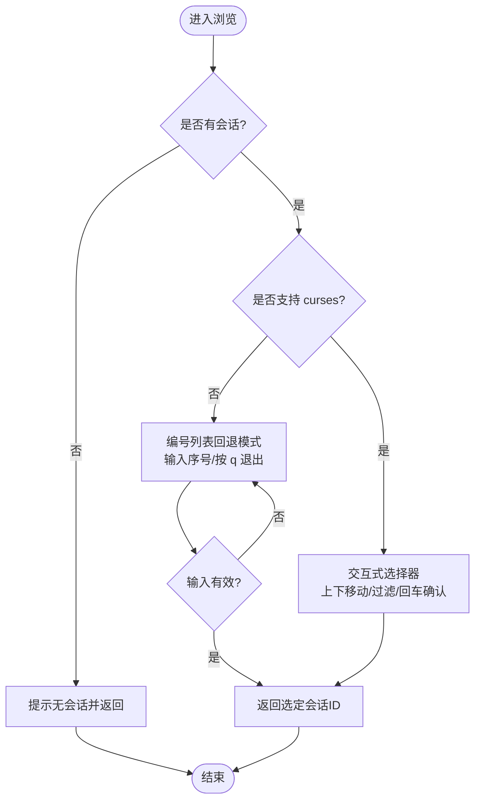
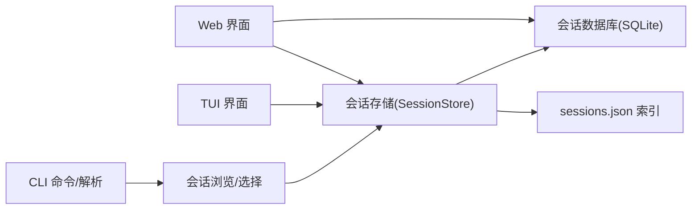

# 会话管理

<cite>
**本文引用的文件**
- [gateway/session.py](file://gateway/session.py)
- [gateway/session_context.py](file://gateway/session_context.py)
- [hermes_state.py](file://hermes_state.py)
- [hermes_cli/session_recap.py](file://hermes_cli/session_recap.py)
- [hermes_cli/_parser.py](file://hermes_cli/_parser.py)
- [hermes_cli/commands.py](file://hermes_cli/commands.py)
- [tests/gateway/test_session.py](file://tests/gateway/test_session.py)
- [tests/gateway/test_session_store_prune.py](file://tests/gateway/test_session_store_prune.py)
- [tests/gateway/test_session_reset_notify.py](file://tests/gateway/test_session_reset_notify.py)
- [tests/hermes_cli/test_session_browse.py](file://tests/hermes_cli/test_session_browse.py)
- [tests/hermes_cli/test_resolve_last_session.py](file://tests/hermes_cli/test_resolve_last_session.py)
- [tests/gateway/test_session_env.py](file://tests/gateway/test_session_env.py)
- [website/docs/developer-guide/session-storage.md](file://website/docs/developer-guide/session-storage.md)
- [website/i18n/zh-Hans/docusaurus-plugin-content-docs/current/developer-guide/session-storage.md](file://website/i18n/zh-Hans/docusaurus-plugin-content-docs/current/developer-guide/session-storage.md)
- [website/i18n/zh-Hans/docusaurus-plugin-content-docs/current/user-guide/sessions.md](file://website/i18n/zh-Hans/docusaurus-plugin-content-docs/current/user-guide/sessions.md)
- [tools/environments/local.py](file://tools/environments/local.py)
- [ui-tui/src/components/activeSessionSwitcher.tsx](file://ui-tui/src/components/activeSessionSwitcher.tsx)
- [web/src/pages/SessionsPage.tsx](file://web/src/pages/SessionsPage.tsx)
</cite>

## 目录
1. [简介](#简介)
2. [项目结构](#项目结构)
3. [核心组件](#核心组件)
4. [架构总览](#架构总览)
5. [详细组件分析](#详细组件分析)
6. [依赖关系分析](#依赖关系分析)
7. [性能考量](#性能考量)
8. [故障排除指南](#故障排除指南)
9. [结论](#结论)
10. [附录](#附录)

## 简介
本指南系统性阐述 Hermes Agent 的会话管理能力，覆盖会话概念、生命周期、创建/切换/删除/恢复机制、状态持久化与恢复、会话浏览与交互选择器、会话历史查看与管理、会话边界钩子与环境变量、安全隔离与数据保护、最佳实践与故障排除。内容基于仓库内真实实现与测试用例，确保可操作与可验证。

## 项目结构
围绕会话管理的关键模块分布于网关、CLI、状态数据库与前端界面：
- 网关侧负责会话存储、路由索引、自动重置策略与环境注入
- CLI 提供会话浏览、选择与历史检索
- hermes_state 提供会话数据库（SQLite）与消息持久化
- 前端提供会话列表、搜索、导出与清理等管理能力

图示来源
- [gateway/session.py](file://gateway/session.py)
- [gateway/session_context.py](file://gateway/session_context.py)
- [hermes_state.py](file://hermes_state.py)
- [hermes_cli/commands.py](file://hermes_cli/commands.py)
- [hermes_cli/_parser.py](file://hermes_cli/_parser.py)
- [hermes_cli/session_recap.py](file://hermes_cli/session_recap.py)
- [ui-tui/src/components/activeSessionSwitcher.tsx](file://ui-tui/src/components/activeSessionSwitcher.tsx)
- [web/src/pages/SessionsPage.tsx](file://web/src/pages/SessionsPage.tsx)

章节来源
- [gateway/session.py](file://gateway/session.py)
- [gateway/session_context.py](file://gateway/session_context.py)
- [hermes_state.py](file://hermes_state.py)
- [hermes_cli/commands.py](file://hermes_cli/commands.py)
- [hermes_cli/_parser.py](file://hermes_cli/_parser.py)
- [hermes_cli/session_recap.py](file://hermes_cli/session_recap.py)
- [ui-tui/src/components/activeSessionSwitcher.tsx](file://ui-tui/src/components/activeSessionSwitcher.tsx)
- [web/src/pages/SessionsPage.tsx](file://web/src/pages/SessionsPage.tsx)

## 核心组件
- 会话存储与路由索引：维护活跃会话键到会话ID的映射，支持按来源聚合、过期控制与磁盘持久化
- 会话上下文与环境注入：在处理请求时注入会话相关环境变量，保证隔离与可追溯
- 会话数据库（SQLite）：统一存储会话元数据、消息与全文检索索引，支持并发写入与重试
- 会话浏览与选择：CLI 交互式选择器与 TUI/Web 界面的会话列表、筛选与操作
- 自动重置策略：空闲/每日/两者皆可/永不，支持通知与排除平台
- 清理与归档：按年龄裁剪旧会话并落盘更新

章节来源
- [gateway/session.py](file://gateway/session.py)
- [gateway/session_context.py](file://gateway/session_context.py)
- [hermes_state.py](file://hermes_state.py)
- [tests/gateway/test_session_store_prune.py](file://tests/gateway/test_session_store_prune.py)
- [tests/gateway/test_session_reset_notify.py](file://tests/gateway/test_session_reset_notify.py)
- [tests/gateway/test_session.py](file://tests/gateway/test_session.py)

## 架构总览
下图展示从 CLI 到网关、再到状态数据库与前端的整体流程，以及会话边界钩子与环境变量的注入点。

图示来源
- [hermes_cli/commands.py](file://hermes_cli/commands.py)
- [hermes_cli/_parser.py](file://hermes_cli/_parser.py)
- [hermes_cli/session_recap.py](file://hermes_cli/session_recap.py)
- [gateway/session.py](file://gateway/session.py)
- [hermes_state.py](file://hermes_state.py)
- [ui-tui/src/components/activeSessionSwitcher.tsx](file://ui-tui/src/components/activeSessionSwitcher.tsx)
- [web/src/pages/SessionsPage.tsx](file://web/src/pages/SessionsPage.tsx)

## 详细组件分析

### 会话存储与路由索引（Gateway SessionStore）
- 职责
  - 维护 sessions.json 的内存字典，映射 session_key 到 SessionEntry
  - 支持按来源聚合、活跃状态标记、过期判定与自动重置
  - 提供 prune_old_entries 按最大存活天数清理陈旧条目，线程安全
  - 与 SQLite 数据库存储协同，确保磁盘落盘一致性
- 关键行为
  - 并发安全：prune 期间持有锁；读写路径受锁保护
  - 序列化：to_dict/from_dict 支持重启后恢复 was_auto_reset、auto_reset_reason 等字段
  - 默认过期天数：90 天，可通过配置调整
- 交互
  - get_or_create_session(source) 创建或复用现有会话
  - prune_old_entries(max_age_days) 返回移除数量并触发落盘

图示来源
- [gateway/session.py](file://gateway/session.py)
- [tests/gateway/test_session_store_prune.py](file://tests/gateway/test_session_store_prune.py)
- [tests/gateway/test_session_reset_notify.py](file://tests/gateway/test_session_reset_notify.py)

章节来源
- [gateway/session.py](file://gateway/session.py)
- [tests/gateway/test_session_store_prune.py](file://tests/gateway/test_session_store_prune.py)
- [tests/gateway/test_session_reset_notify.py](file://tests/gateway/test_session_reset_notify.py)

### 会话上下文与环境变量（SessionContext 与会话环境）
- 会话上下文
  - 包含 source（平台/渠道）、connected_platforms、home_channels 等
  - 作为会话生命周期的载体，驱动会话键生成与路由
- 会话环境注入
  - 在处理请求时，将会话相关变量注入到上下文中，避免污染全局环境
  - 支持并发任务隔离，防止 os.environ 竞态导致的值串扰
  - 提供 _set_session_env 与 _clear_session_env 的配对调用，确保恢复
- 环境变量示例
  - HERMES_SESSION_PLATFORM、HERMES_SESSION_CHAT_ID、HERMES_SESSION_USER_ID、HERMES_SESSION_KEY 等

图示来源
- [gateway/session_context.py](file://gateway/session_context.py)
- [tests/gateway/test_session_env.py](file://tests/gateway/test_session_env.py)

章节来源
- [gateway/session_context.py](file://gateway/session_context.py)
- [tests/gateway/test_session_env.py](file://tests/gateway/test_session_env.py)

### 会话数据库（SQLite）与消息持久化
- 数据库职责
  - 统一存储会话元数据（sessions 表）与消息（messages 表）
  - 使用 FTS5 对消息内容建立全文检索索引，配合触发器同步
  - 多进程共享同一 state.db，采用短超时、随机抖动重试、BEGIN IMMEDIATE 与周期性 WAL checkpoint 降低写入竞争
- 常见操作
  - 创建/结束/重新打开会话
  - 追加消息、查询会话、按 MRU 排序与搜索
- 版本与迁移
  - 文档记录当前 schema 版本与迁移策略，确保向后兼容

图示来源
- [website/docs/developer-guide/session-storage.md](file://website/docs/developer-guide/session-storage.md)
- [website/i18n/zh-Hans/docusaurus-plugin-content-docs/current/developer-guide/session-storage.md](file://website/i18n/zh-Hans/docusaurus-plugin-content-docs/current/developer-guide/session-storage.md)

章节来源
- [hermes_state.py](file://hermes_state.py)
- [website/docs/developer-guide/session-storage.md](file://website/docs/developer-guide/session-storage.md)
- [website/i18n/zh-Hans/docusaurus-plugin-content-docs/current/developer-guide/session-storage.md](file://website/i18n/zh-Hans/docusaurus-plugin-content-docs/current/developer-guide/session-storage.md)

### 会话浏览与交互选择器（CLI 与 TUI/Web）
- CLI 浏览
  - 当无可用会话时返回 None 并提示
  - 无 curses 环境时回退到编号列表输入，支持 q 退出、键盘中断返回 None
  - 支持按标题/预览/ID 显示，过滤与选择
- TUI 与 Web
  - TUI 切换器：显示“新建”、“实时会话”、“历史”三段列表，支持滚动、过滤、删除
  - Web 会话页：分页加载、搜索（FTS5）、批量操作、导出、清理旧会话

图示来源
- [tests/hermes_cli/test_session_browse.py](file://tests/hermes_cli/test_session_browse.py)
- [ui-tui/src/components/activeSessionSwitcher.tsx](file://ui-tui/src/components/activeSessionSwitcher.tsx)
- [web/src/pages/SessionsPage.tsx](file://web/src/pages/SessionsPage.tsx)

章节来源
- [tests/hermes_cli/test_session_browse.py](file://tests/hermes_cli/test_session_browse.py)
- [ui-tui/src/components/activeSessionSwitcher.tsx](file://ui-tui/src/components/activeSessionSwitcher.tsx)
- [web/src/pages/SessionsPage.tsx](file://web/src/pages/SessionsPage.tsx)

### 会话历史查看与管理
- 历史排序与 MRU
  - 通过 last_active 字段排序，确保最近活动的会话优先可见
- 搜索与筛选
  - Web 页面支持搜索框与 FTS5 检索，按匹配片段高亮
- 批量操作
  - Web 支持删除、导出、清理旧会话；TUI 支持删除与选择切换
- 清理策略
  - prune_old_entries 按 max_age_days 删除陈旧条目，线程安全并落盘

章节来源
- [tests/hermes_cli/test_resolve_last_session.py](file://tests/hermes_cli/test_resolve_last_session.py)
- [web/src/pages/SessionsPage.tsx](file://web/src/pages/SessionsPage.tsx)
- [tests/gateway/test_session_store_prune.py](file://tests/gateway/test_session_store_prune.py)

### 会话边界钩子与环境变量
- 边界钩子
  - 在会话创建/切换/结束等关键节点可插入钩子，用于审计、告警或资源回收
- 环境变量
  - HERMES_SESSION_* 系列变量在处理请求时注入，确保工具与子进程仅感知当前会话上下文
  - 通过上下文变量隔离，避免跨任务污染

章节来源
- [gateway/session_context.py](file://gateway/session_context.py)
- [tests/gateway/test_session_env.py](file://tests/gateway/test_session_env.py)

### 会话安全与隔离
- 会话隔离
  - 每用户/每通道独立会话键，避免上下文污染与费用共享
  - 群组会话 per 用户开关可控制共享/隔离
- 数据保护
  - 会话环境变量通过上下文注入，不污染全局环境
  - 子进程 HOME 与敏感变量隔离，避免泄露
- 平台与权限
  - 重置策略可排除特定平台的通知
  - 访问控制与审计可通过边界钩子扩展

章节来源
- [website/i18n/zh-Hans/docusaurus-plugin-content-docs/current/user-guide/sessions.md](file://website/i18n/zh-Hans/docusaurus-plugin-content-docs/current/user-guide/sessions.md)
- [tools/environments/local.py](file://tools/environments/local.py)
- [tests/gateway/test_session_env.py](file://tests/gateway/test_session_env.py)

## 依赖关系分析
- 组件耦合
  - CLI 通过命令与解析器驱动会话浏览；浏览结果经网关会话存储转发至数据库
  - 网关会话存储依赖 SQLite 数据库进行持久化；同时维护 sessions.json 内存索引
  - 前端通过 RPC/REST 与网关交互，读取会话列表、统计与执行管理操作
- 外部依赖
  - SQLite（WAL 模式）与 FTS5
  - curses（可选，回退到标准输入）
  - 前端框架（React/TUI）

图示来源
- [hermes_cli/commands.py](file://hermes_cli/commands.py)
- [hermes_cli/_parser.py](file://hermes_cli/_parser.py)
- [hermes_cli/session_recap.py](file://hermes_cli/session_recap.py)
- [gateway/session.py](file://gateway/session.py)
- [hermes_state.py](file://hermes_state.py)
- [web/src/pages/SessionsPage.tsx](file://web/src/pages/SessionsPage.tsx)
- [ui-tui/src/components/activeSessionSwitcher.tsx](file://ui-tui/src/components/activeSessionSwitcher.tsx)

章节来源
- [hermes_cli/commands.py](file://hermes_cli/commands.py)
- [hermes_cli/_parser.py](file://hermes_cli/_parser.py)
- [hermes_cli/session_recap.py](file://hermes_cli/session_recap.py)
- [gateway/session.py](file://gateway/session.py)
- [hermes_state.py](file://hermes_state.py)
- [web/src/pages/SessionsPage.tsx](file://web/src/pages/SessionsPage.tsx)
- [ui-tui/src/components/activeSessionSwitcher.tsx](file://ui-tui/src/components/activeSessionSwitcher.tsx)

## 性能考量
- 写入竞争处理
  - 短 SQLite 超时、应用层重试（随机抖动）、BEGIN IMMEDIATE、周期性 WAL checkpoint
  - 降低“ convoy effect”，提升并发吞吐
- 索引与搜索
  - sessions 表按 source/started_at 等建立索引；消息表配合 FTS5 触发器
- 清理策略
  - prune_old_entries 仅在必要时写盘，避免频繁 IO

章节来源
- [website/docs/developer-guide/session-storage.md](file://website/docs/developer-guide/session-storage.md)
- [website/i18n/zh-Hans/docusaurus-plugin-content-docs/current/developer-guide/session-storage.md](file://website/i18n/zh-Hans/docusaurus-plugin-content-docs/current/developer-guide/session-storage.md)
- [tests/gateway/test_session_store_prune.py](file://tests/gateway/test_session_store_prune.py)

## 故障排除指南
- 无会话可选
  - 现象：CLI 浏览提示无会话
  - 排查：确认是否存在已结束或被清理的会话；检查 sessions.json 是否为空；确认数据库中是否存在历史会话
- 选择器异常
  - 现象：curses 不可用回退失败或输入无效
  - 排查：确认终端交互环境；尝试使用回退模式输入序号；检查键盘中断处理
- 清理未生效
  - 现象：prune 后仍存在旧会话
  - 排查：确认 max_age_days 设置；检查 prune 是否触发落盘；并发场景下确认锁释放
- 自动重置问题
  - 现象：会话未按预期重置或通知缺失
  - 排查：核对 SessionResetPolicy.mode 与 notify 配置；确认后台进程是否阻止重置；检查排除平台设置
- 环境变量污染
  - 现象：工具读取到错误的会话上下文
  - 排查：确认 _set_session_env/_clear_session_env 成对调用；避免直接修改 os.environ；检查并发任务上下文传播

章节来源
- [tests/hermes_cli/test_session_browse.py](file://tests/hermes_cli/test_session_browse.py)
- [tests/gateway/test_session_store_prune.py](file://tests/gateway/test_session_store_prune.py)
- [tests/gateway/test_session_reset_notify.py](file://tests/gateway/test_session_reset_notify.py)
- [tests/gateway/test_session_env.py](file://tests/gateway/test_session_env.py)

## 结论
Hermes Agent 的会话管理以“网关存储 + SQLite 数据库 + 前端界面”为核心，辅以严格的环境隔离与自动重置策略，既满足多平台并发访问，又保障会话历史的可检索与可治理。通过 CLI/TUI/Web 的统一入口，用户可以高效地创建、切换、删除、恢复与清理会话，结合边界钩子与安全隔离策略，形成完整、可观测、可审计的会话生命周期管理体系。

## 附录
- 常用命令与入口
  - 会话浏览与选择：参考 CLI 测试中的交互行为
  - 会话历史查看：通过 Web/TUI 的分页与搜索功能
- 最佳实践
  - 合理设置自动重置策略，平衡上下文连续性与资源占用
  - 定期清理旧会话，控制 sessions.json 与数据库规模
  - 使用边界钩子进行审计与告警，确保合规与可观测
  - 严格遵循会话环境注入与清理流程，避免上下文泄漏