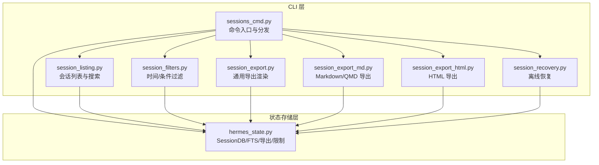
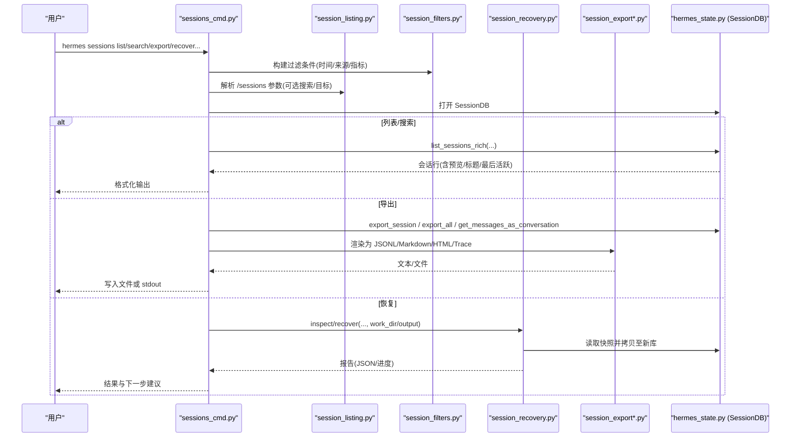
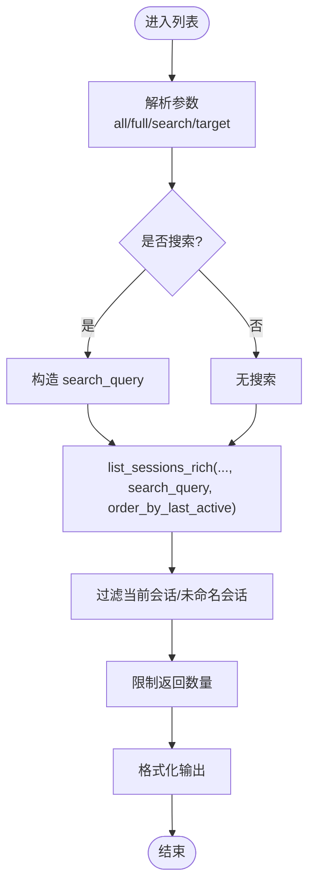
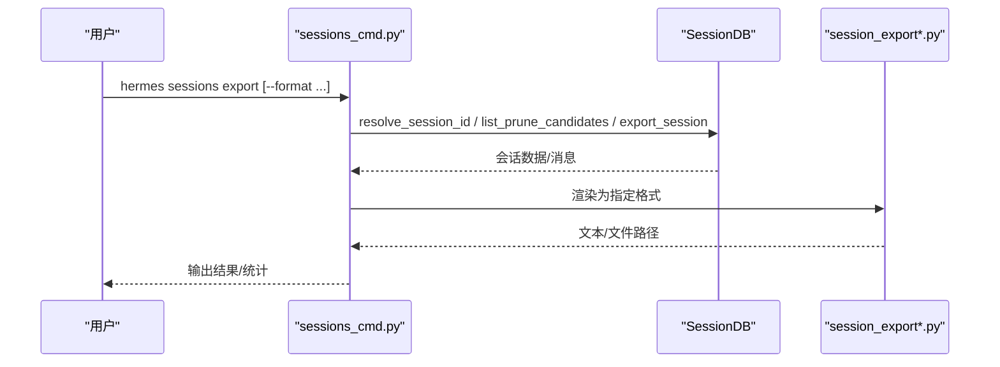
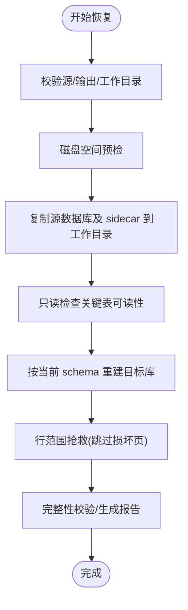
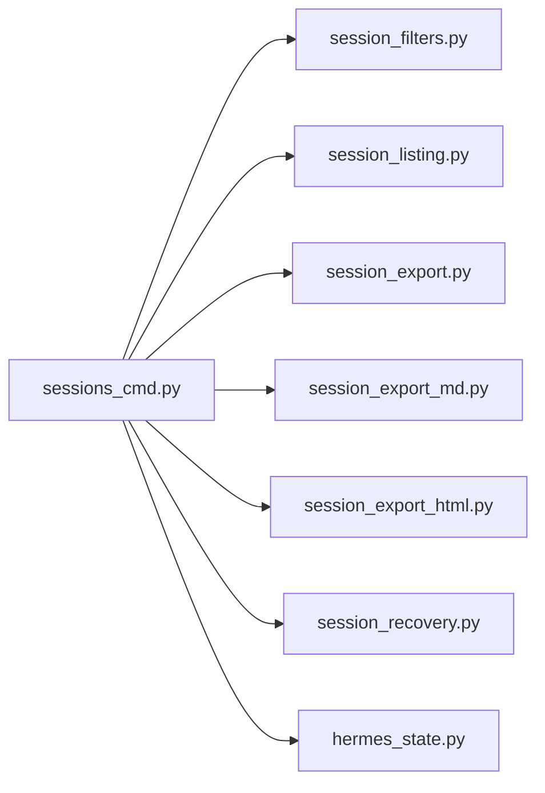

# 会话管理

<cite>
**本文引用的文件**
- [hermes_cli/sessions_cmd.py](file://hermes_cli/sessions_cmd.py)
- [hermes_cli/session_listing.py](file://hermes_cli/session_listing.py)
- [hermes_cli/session_recovery.py](file://hermes_cli/session_recovery.py)
- [hermes_cli/session_export.py](file://hermes_cli/session_export.py)
- [hermes_cli/session_export_md.py](file://hermes_cli/session_export_md.py)
- [hermes_cli/session_export_html.py](file://hermes_cli/session_export_html.py)
- [hermes_cli/session_filters.py](file://hermes_cli/session_filters.py)
- [hermes_state.py](file://hermes_state.py)
</cite>

## 目录
1. [简介](#简介)
2. [项目结构](#项目结构)
3. [核心组件](#核心组件)
4. [架构总览](#架构总览)
5. [详细组件分析](#详细组件分析)
6. [依赖关系分析](#依赖关系分析)
7. [性能与容量考虑](#性能与容量考虑)
8. [故障排查指南](#故障排查指南)
9. [结论](#结论)
10. [附录：常用命令速查](#附录：常用命令速查)

## 简介
本文件系统性说明 Hermes Agent 的“会话管理”能力，覆盖以下主题：
- 会话的创建、浏览、恢复与管理操作
- hermes sessions 子命令的功能：列表查看、搜索过滤、状态监控、导出/导入、归档/修剪、删除、修复与离线恢复
- 会话生命周期：自动清理、持久化存储、备份恢复
- 上下文保持机制：如何在新的会话中继续之前的工作
- 大型项目的会话组织策略与最佳实践
- 多用户环境下的会话隔离与安全注意事项

## 项目结构
围绕“会话管理”的关键代码主要分布在 CLI 层与状态存储层：
- CLI 层负责命令解析、参数校验、数据导出/渲染、恢复流程编排
- 状态存储层提供 SQLite 持久化、全文检索、会话查询与导出等能力



图表来源
- [hermes_cli/sessions_cmd.py:1-800](file://hermes_cli/sessions_cmd.py#L1-L800)
- [hermes_cli/session_listing.py:1-118](file://hermes_cli/session_listing.py#L1-L118)
- [hermes_cli/session_filters.py:1-235](file://hermes_cli/session_filters.py#L1-L235)
- [hermes_cli/session_export.py:1-318](file://hermes_cli/session_export.py#L1-L318)
- [hermes_cli/session_export_md.py:1-200](file://hermes_cli/session_export_md.py#L1-L200)
- [hermes_cli/session_export_html.py:1-200](file://hermes_cli/session_export_html.py#L1-L200)
- [hermes_cli/session_recovery.py:1-800](file://hermes_cli/session_recovery.py#L1-L800)
- [hermes_state.py:1-200](file://hermes_state.py#L1-L200)

章节来源
- [hermes_cli/sessions_cmd.py:1-800](file://hermes_cli/sessions_cmd.py#L1-L800)
- [hermes_state.py:1-200](file://hermes_state.py#L1-L200)

## 核心组件
- 会话数据库（SessionDB）：基于 SQLite，支持 WAL 模式、FTS5 全文检索、会话元数据与消息历史持久化、压缩分割链（parent_session_id）。
- 会话导出与渲染：JSONL、Markdown/QMD、HTML、Trace JSONL、仅用户提示导出。
- 会话恢复：离线、非破坏性恢复，安全校验、磁盘空间预检、行级范围抢救。
- 会话过滤：统一的时间与条件过滤器构建，用于 prune/archive/export/list。
- 会话列表与搜索：跨源/按会话键/标题/ID 搜索，排除当前会话，控制显示未命名会话。

章节来源
- [hermes_state.py:1-200](file://hermes_state.py#L1-L200)
- [hermes_cli/session_export.py:1-318](file://hermes_cli/session_export.py#L1-L318)
- [hermes_cli/session_recovery.py:1-800](file://hermes_cli/session_recovery.py#L1-L800)
- [hermes_cli/session_filters.py:1-235](file://hermes_cli/session_filters.py#L1-L235)
- [hermes_cli/session_listing.py:1-118](file://hermes_cli/session_listing.py#L1-L118)

## 架构总览
下图展示了从 CLI 到存储层的调用关系与数据流。



图表来源
- [hermes_cli/sessions_cmd.py:1-800](file://hermes_cli/sessions_cmd.py#L1-L800)
- [hermes_cli/session_listing.py:1-118](file://hermes_cli/session_listing.py#L1-L118)
- [hermes_cli/session_filters.py:1-235](file://hermes_cli/session_filters.py#L1-L235)
- [hermes_cli/session_recovery.py:1-800](file://hermes_cli/session_recovery.py#L1-L800)
- [hermes_cli/session_export.py:1-318](file://hermes_cli/session_export.py#L1-L318)
- [hermes_state.py:1-200](file://hermes_state.py#L1-L200)

## 详细组件分析

### 会话列表与搜索（list/browse/search）
- 支持按来源限定或全量列出；可包含未命名会话；默认排除当前会话。
- 支持通过标题/ID 模糊匹配进行快速定位；当使用搜索时，会优先按最近活跃排序。
- 支持 workspace 过滤（按仓库根或 cwd 的 basename/子串匹配）。



图表来源
- [hermes_cli/session_listing.py:1-118](file://hermes_cli/session_listing.py#L1-L118)
- [hermes_cli/sessions_cmd.py:239-312](file://hermes_cli/sessions_cmd.py#L239-L312)

章节来源
- [hermes_cli/session_listing.py:1-118](file://hermes_cli/session_listing.py#L1-L118)
- [hermes_cli/sessions_cmd.py:239-312](file://hermes_cli/sessions_cmd.py#L239-L312)

### 会话过滤（prune/archive/export 共用）
- 时间窗口：支持相对时长（如 5h/30m/2d/1w）与绝对 ISO 时间；older_than/newer_than 作用于 last_active，before/after 作用于 started_at。
- 其他维度：source、title_like、end_reason、cwd_prefix、min/max messages、model/provider、user/chat_id/chat_type、branch_like、token/cost/tool_calls 区间。
- 空窗口检测：对 after/before 与 newer_than/older_than 组合做合法性校验。

```mermaid
flowchart TD
In(["输入参数"]) --> T1["解析 older_than/newer_than -> last_active 边界"]
In --> T2["解析 before/after -> started_at 边界"]
T1 --> V{"窗口合法?"}
T2 --> V
V -- 否 --> Err["抛出 ValueError(空窗口)"]
V -- 是 --> Merge["合并 source/title/end_reason/cwd/指标等"]
Merge --> Out({"filters 字典"})
```

图表来源
- [hermes_cli/session_filters.py:1-235](file://hermes_cli/session_filters.py#L1-L235)

章节来源
- [hermes_cli/session_filters.py:1-235](file://hermes_cli/session_filters.py#L1-L235)

### 会话导出（export）
- 格式：JSONL、Markdown/QMD、HTML、Trace JSONL、仅用户提示（jsonl/md）。
- 单会话或多会话：HTML 支持侧边栏导航；Markdown/QMD 生成带校验摘要的文件；Trace 支持本地导出或上传。
- 敏感信息：支持 redact/no_redact；trace 默认开启脱敏。
- 批量导出需至少一个过滤条件，避免误导出全部。



图表来源
- [hermes_cli/sessions_cmd.py:313-779](file://hermes_cli/sessions_cmd.py#L313-L779)
- [hermes_cli/session_export.py:1-318](file://hermes_cli/session_export.py#L1-L318)
- [hermes_cli/session_export_md.py:1-200](file://hermes_cli/session_export_md.py#L1-L200)
- [hermes_cli/session_export_html.py:1-200](file://hermes_cli/session_export_html.py#L1-L200)

章节来源
- [hermes_cli/sessions_cmd.py:313-779](file://hermes_cli/sessions_cmd.py#L313-L779)
- [hermes_cli/session_export.py:1-318](file://hermes_cli/session_export.py#L1-L318)
- [hermes_cli/session_export_md.py:1-200](file://hermes_cli/session_export_md.py#L1-L200)
- [hermes_cli/session_export_html.py:1-200](file://hermes_cli/session_export_html.py#L1-L200)

### 会话恢复（recover/repair）
- repair：尝试原地修复 schema，必要时生成备份；失败时引导使用 recover。
- recover：离线、非破坏性恢复。将源数据库及其 sidecar 复制到临时工作目录，只读检查可读性，再按当前 schema 重建目标库；跳过损坏页，记录跳过范围；输出验证报告。
- 安全：禁止输出覆盖源或其 sidecar；磁盘空间预检；并发访问保护。



图表来源
- [hermes_cli/sessions_cmd.py:67-225](file://hermes_cli/sessions_cmd.py#L67-L225)
- [hermes_cli/session_recovery.py:1-800](file://hermes_cli/session_recovery.py#L1-L800)

章节来源
- [hermes_cli/sessions_cmd.py:67-225](file://hermes_cli/sessions_cmd.py#L67-L225)
- [hermes_cli/session_recovery.py:1-800](file://hermes_cli/session_recovery.py#L1-L800)

### 会话删除、归档与修剪（delete/prune/archive）
- delete：确认式删除会话及其消息。
- prune/archive：基于过滤条件批量处理；支持 dry-run 预览。
- 与导出联动：支持导出后删除（需显式确认），确保先验证导出文件再删除。

章节来源
- [hermes_cli/sessions_cmd.py:780-800](file://hermes_cli/sessions_cmd.py#L780-L800)
- [hermes_cli/session_filters.py:1-235](file://hermes_cli/session_filters.py#L1-L235)

### 会话上下文保持与恢复（resume）
- 会话在数据库中持久化，支持通过 ID/标题/编号恢复。
- 列表界面支持搜索与筛选，便于快速定位目标会话。
- 大会话恢复有安全上限，防止一次性加载过多消息导致内存压力。

章节来源
- [hermes_cli/session_listing.py:1-118](file://hermes_cli/session_listing.py#L1-L118)
- [hermes_state.py:87-158](file://hermes_state.py#L87-L158)

## 依赖关系分析
- sessions_cmd.py 作为命令中枢，依赖 session_filters 构建过滤条件，依赖 session_listing 解析交互参数，依赖各导出模块渲染输出，依赖 session_recovery 执行恢复流程，最终通过 hermes_state.SessionDB 访问持久化数据。
- hermes_state 提供统一的会话查询、导出、限制与 FTS5 检索能力。



图表来源
- [hermes_cli/sessions_cmd.py:1-800](file://hermes_cli/sessions_cmd.py#L1-L800)
- [hermes_cli/session_filters.py:1-235](file://hermes_cli/session_filters.py#L1-L235)
- [hermes_cli/session_listing.py:1-118](file://hermes_cli/session_listing.py#L1-L118)
- [hermes_cli/session_export.py:1-318](file://hermes_cli/session_export.py#L1-L318)
- [hermes_cli/session_export_md.py:1-200](file://hermes_cli/session_export_md.py#L1-L200)
- [hermes_cli/session_export_html.py:1-200](file://hermes_cli/session_export_html.py#L1-L200)
- [hermes_cli/session_recovery.py:1-800](file://hermes_cli/session_recovery.py#L1-L800)
- [hermes_state.py:1-200](file://hermes_state.py#L1-L200)

## 性能与容量考虑
- 会话恢复采用分块拷贝与行范围抢救，避免一次性扫描损坏表；对 state_meta 等元数据表单独处理，跳过衍生字段重建。
- 导出与恢复均提供进度回调与报告，便于监控与诊断。
- 会话恢复前进行磁盘空间预检，防止因空间不足导致中断。
- 会话恢复过程中对源数据库进行快照复制，避免直接打开原始文件，降低并发风险。
- 会话恢复与导出均支持限制与分页，避免内存溢出。

章节来源
- [hermes_cli/session_recovery.py:164-237](file://hermes_cli/session_recovery.py#L164-L237)
- [hermes_cli/session_recovery.py:380-663](file://hermes_cli/session_recovery.py#L380-L663)
- [hermes_state.py:87-158](file://hermes_state.py#L87-L158)

## 故障排查指南
- 无法打开会话数据库：检查权限与文件完整性；必要时使用 repair 或 recover。
- 恢复失败：查看 recovery report 中的 skipped_rowid_ranges 与错误信息；必要时调整 work_dir/output 所在文件系统以释放空间。
- 导出为空：确认 session_id 是否存在或过滤条件是否正确；对于 trace 导出，若无消息则不会生成内容。
- 列表为空：确认是否使用了 all/full 选项；搜索模式下会包含未命名会话并按最近活跃排序。

章节来源
- [hermes_cli/sessions_cmd.py:67-225](file://hermes_cli/sessions_cmd.py#L67-L225)
- [hermes_cli/session_recovery.py:357-378](file://hermes_cli/session_recovery.py#L357-L378)
- [hermes_cli/sessions_cmd.py:313-779](file://hermes_cli/sessions_cmd.py#L313-L779)

## 结论
Hermes Agent 的会话管理以 SQLite 为核心，结合 CLI 的多形态导出与离线恢复能力，提供了从创建、浏览、恢复到归档/修剪的全生命周期管理。通过严格的过滤与安全检查、完善的进度与报告机制，以及灵活的导出格式，能够满足个人与团队在不同场景下的需求。建议在大型项目中按来源/工作区/时间窗口组织会话，并结合导出与恢复流程建立备份与审计策略。

## 附录：常用命令速查
- 列表与搜索
  - hermes sessions list
  - hermes sessions browse
  - hermes sessions search <关键词>
- 过滤与批量操作
  - hermes sessions prune --older-than/--newer-than/--before/--after/--source/--title/--cwd/--min-messages/--max-messages/--model/--provider/--user/--chat-id/--chat-type/--branch/--min-tokens/--max-tokens/--min-cost/--max-cost/--min-tool-calls/--max-tool-calls
  - hermes sessions archive 同上过滤
  - hermes sessions delete --session-id
- 导出
  - hermes sessions export --format jsonl|md|qmd|html|trace --output/-
  - hermes sessions export --only user-prompts --format jsonl|md
  - hermes sessions export --upload/--public/--no-redact（trace）
  - hermes sessions export --dry-run
- 恢复与修复
  - hermes sessions repair
  - hermes sessions recover --source --output --inspect-only --allow-partial --work-dir --chunk-size --report

章节来源
- [hermes_cli/sessions_cmd.py:1-800](file://hermes_cli/sessions_cmd.py#L1-L800)
- [hermes_cli/session_filters.py:1-235](file://hermes_cli/session_filters.py#L1-L235)
- [hermes_cli/session_recovery.py:1-800](file://hermes_cli/session_recovery.py#L1-L800)
- [hermes_cli/session_export.py:1-318](file://hermes_cli/session_export.py#L1-L318)
- [hermes_cli/session_export_md.py:1-200](file://hermes_cli/session_export_md.py#L1-L200)
- [hermes_cli/session_export_html.py:1-200](file://hermes_cli/session_export_html.py#L1-L200)