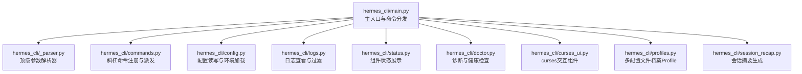
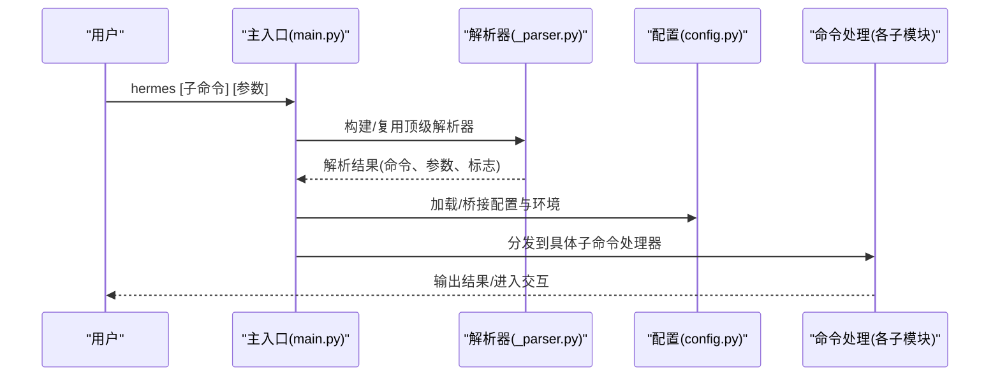
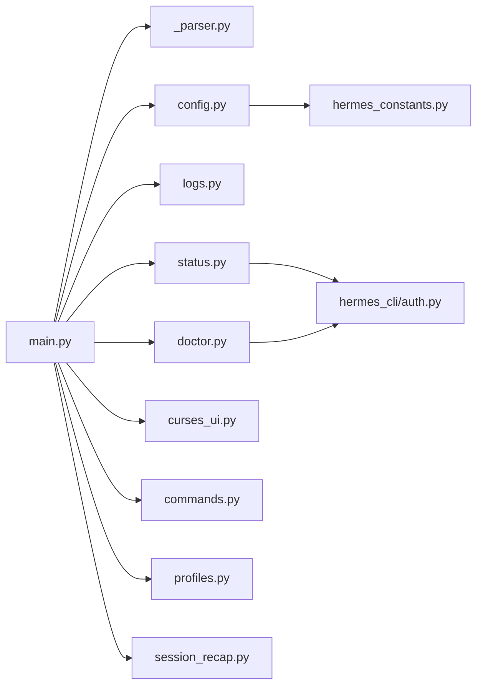

# 命令行界面

<cite>
**本文引用的文件**
- [hermes_cli/main.py](file://hermes_cli/main.py)
- [hermes_cli/_parser.py](file://hermes_cli/_parser.py)
- [hermes_cli/commands.py](file://hermes_cli/commands.py)
- [hermes_cli/config.py](file://hermes_cli/config.py)
- [hermes_cli/curses_ui.py](file://hermes_cli/curses_ui.py)
- [hermes_cli/session_recap.py](file://hermes_cli/session_recap.py)
- [hermes_cli/profiles.py](file://hermes_cli/profiles.py)
- [hermes_cli/logs.py](file://hermes_cli/logs.py)
- [hermes_cli/status.py](file://hermes_cli/status.py)
- [hermes_cli/doctor.py](file://hermes_cli/doctor.py)
</cite>

## 目录
1. [简介](#简介)
2. [项目结构](#项目结构)
3. [核心组件](#核心组件)
4. [架构总览](#架构总览)
5. [详细组件分析](#详细组件分析)
6. [依赖关系分析](#依赖关系分析)
7. [性能考量](#性能考量)
8. [故障排除指南](#故障排除指南)
9. [结论](#结论)
10. [附录](#附录)

## 简介
本指南面向Hermes Agent命令行界面（CLI）的使用者与维护者，系统性介绍CLI的功能、命令语法、参数选项、配置管理、会话管理、斜杠命令参考、交互式功能与TUI特性。文档提供从入门到高级的渐进式学习路径，兼顾新手快速上手与高级用户的深度需求。

## 项目结构
Hermes CLI以模块化方式组织，核心入口负责解析命令与参数，子命令在主程序中注册并分发；配置管理、日志查看、状态检查、诊断工具等均作为独立模块提供。斜杠命令定义集中于统一注册表，供CLI帮助、网关派发、平台映射与自动补全共享。

图表来源
- [hermes_cli/main.py](file://hermes_cli/main.py)
- [hermes_cli/_parser.py](file://hermes_cli/_parser.py)
- [hermes_cli/commands.py](file://hermes_cli/commands.py)
- [hermes_cli/config.py](file://hermes_cli/config.py)
- [hermes_cli/logs.py](file://hermes_cli/logs.py)
- [hermes_cli/status.py](file://hermes_cli/status.py)
- [hermes_cli/doctor.py](file://hermes_cli/doctor.py)
- [hermes_cli/curses_ui.py](file://hermes_cli/curses_ui.py)
- [hermes_cli/profiles.py](file://hermes_cli/profiles.py)
- [hermes_cli/session_recap.py](file://hermes_cli/session_recap.py)

章节来源
- [hermes_cli/main.py](file://hermes_cli/main.py)
- [hermes_cli/_parser.py](file://hermes_cli/_parser.py)

## 核心组件
- 参数解析与入口：顶级参数解析器定义全局标志与子命令；主入口根据解析结果选择执行路径，支持TUI/CLI模式切换、配置覆盖、会话恢复等。
- 斜杠命令系统：集中注册所有斜杠命令，提供描述、别名、参数提示、分类与平台可用性门控，支持CLI与网关两端一致派发。
- 配置管理：提供配置读取、编辑、设置、向导等功能；支持安全权限与容器/托管模式差异处理。
- 日志与状态：提供日志尾读、实时跟随、过滤与组件统计；状态命令汇总环境、密钥、认证、网关、计划任务与会话信息。
- 诊断工具：检测版本一致性、服务状态、包依赖、配置文件、提供商连通性与安全通告。
- 交互式UI：基于curses的多选/单选菜单、搜索与滚动，兼容非TTY回退方案。
- Profile与会话：Profile隔离多实例；会话摘要用于快速回顾最近活动。

章节来源
- [hermes_cli/_parser.py](file://hermes_cli/_parser.py)
- [hermes_cli/commands.py](file://hermes_cli/commands.py)
- [hermes_cli/config.py](file://hermes_cli/config.py)
- [hermes_cli/logs.py](file://hermes_cli/logs.py)
- [hermes_cli/status.py](file://hermes_cli/status.py)
- [hermes_cli/doctor.py](file://hermes_cli/doctor.py)
- [hermes_cli/curses_ui.py](file://hermes_cli/curses_ui.py)
- [hermes_cli/profiles.py](file://hermes_cli/profiles.py)
- [hermes_cli/session_recap.py](file://hermes_cli/session_recap.py)

## 架构总览
CLI采用“入口解析—子命令分发—功能模块调用”的分层设计。入口负责早期决策（如TUI优先级）、配置加载、日志初始化与环境变量桥接；各子命令模块按职责划分，避免循环依赖。

图表来源
- [hermes_cli/main.py](file://hermes_cli/main.py)
- [hermes_cli/_parser.py](file://hermes_cli/_parser.py)
- [hermes_cli/config.py](file://hermes_cli/config.py)

## 详细组件分析

### 入口与参数解析
- 全局标志与继承：支持模型/提供商覆盖、工具集、工作树、钩子自动批准、技能预加载、危险命令豁免、会话ID注入、忽略用户配置、跳过规则、TUI/CLI切换、开发模式等。
- 子命令chat：支持单次查询、图像附件、模型/提供商覆盖、工具集、会话恢复/继续、工作树、检查点、最大轮次、危险命令豁免、忽略配置/规则、来源标签、TUI/CLI/开发模式等。
- 早期决策：TUI优先级判定、鼠标残留抑制、Termux快速版本输出、Profile覆盖、IPv4偏好、日志初始化等。

章节来源
- [hermes_cli/_parser.py](file://hermes_cli/_parser.py)
- [hermes_cli/main.py](file://hermes_cli/main.py)

### 斜杠命令系统
- 注册中心：集中定义命令名称、描述、类别、别名、参数占位符、可选子命令、CLI/网关可用性与配置门控。
- 派发与可用性：支持CLI侧与网关侧派发；部分命令在特定配置下才显示；插件命令动态纳入。
- 自动补全与帮助：从注册表生成帮助文本、菜单项与自动补全候选，保证跨平台一致体验。

章节来源
- [hermes_cli/commands.py](file://hermes_cli/commands.py)

### 配置管理
- 文件位置：~/.hermes/config.yaml（主要配置）、~/.hermes/.env（密钥与环境）。
- 安全与托管：托管安装（NixOS/Homebrew）与容器模式下的权限与可见性处理；敏感变量写入限制。
- 更新与迁移：安装方式检测、推荐更新命令、Docker与托管模式提示；配置缓存与线程安全读写。
- 环境桥接：启动前将config.yaml中的安全开关与网络偏好桥接到环境变量，确保后续模块一致行为。

章节来源
- [hermes_cli/config.py](file://hermes_cli/config.py)

### 日志与状态
- 日志查看：支持agent、errors、gateway、gui、desktop等日志文件；支持尾读、实时跟随、级别过滤、会话过滤、时间范围、组件过滤。
- 状态展示：汇总环境、模型/提供商、API密钥、OAuth状态、订阅能力、终端后端、消息平台、网关服务、计划任务与会话数量；支持深度检查（连通性探测）。

章节来源
- [hermes_cli/logs.py](file://hermes_cli/logs.py)
- [hermes_cli/status.py](file://hermes_cli/status.py)

### 诊断与健康检查
- 安全通告：检测已知风险包版本并给出修复建议与确认机制。
- 环境与依赖：Python版本、虚拟环境、必需/可选包、版本一致性校验。
- 配置文件：~/.hermes/.env存在性与内容检查、项目根目录.fallback。
- 提供商与服务：提供商配置有效性、连通性探测、服务单元与linger状态（Linux）、s6监督状态（容器）。
- 可自动修复：缺失的空.env文件创建并设置权限。

章节来源
- [hermes_cli/doctor.py](file://hermes_cli/doctor.py)

### 交互式UI与会话
- curses组件：多选清单、单选列表、搜索过滤、滚动与光标控制、TTY/非TTY回退；输入缓冲清理防止残留字节污染后续输入。
- 会话摘要：基于最近回合与工具调用生成简洁回顾，包含工具使用计数、最近编辑文件、最新请求与回复预览。

章节来源
- [hermes_cli/curses_ui.py](file://hermes_cli/curses_ui.py)
- [hermes_cli/session_recap.py](file://hermes_cli/session_recap.py)

### Profile与多实例
- Profile隔离：每个Profile为独立HERMES_HOME，包含自己的配置、环境、记忆、会话、技能、网关、计划任务与日志。
- 创建与克隆：支持全新创建、克隆配置或全部内容、排除基础设施目录、剥离运行时文件；可选择不安装捆绑技能。
- 别名与包装脚本：在~/.local/bin创建包装脚本，支持Windows .bat与POSIX脚本；冲突检测与安全覆盖。

章节来源
- [hermes_cli/profiles.py](file://hermes_cli/profiles.py)

## 依赖关系分析
- 入口依赖解析器与配置模块；配置模块依赖常量与工具；日志/状态/诊断模块依赖配置与常量；命令系统依赖配置与插件发现；curses组件依赖颜色与终端能力；Profile与会话摘要相对独立但被其他模块调用。

图表来源
- [hermes_cli/main.py](file://hermes_cli/main.py)
- [hermes_cli/_parser.py](file://hermes_cli/_parser.py)
- [hermes_cli/config.py](file://hermes_cli/config.py)
- [hermes_cli/logs.py](file://hermes_cli/logs.py)
- [hermes_cli/status.py](file://hermes_cli/status.py)
- [hermes_cli/doctor.py](file://hermes_cli/doctor.py)
- [hermes_cli/curses_ui.py](file://hermes_cli/curses_ui.py)
- [hermes_cli/commands.py](file://hermes_cli/commands.py)
- [hermes_cli/profiles.py](file://hermes_cli/profiles.py)
- [hermes_cli/session_recap.py](file://hermes_cli/session_recap.py)

## 性能考量
- 启动优化：Termux快速版本输出、早期鼠标残留抑制、配置缓存与线程锁、IPv4偏好早绑定。
- 日志读取：大文件尾读采用分块策略与编码降级；实时跟随使用小休眠周期。
- 命令注册：斜杠命令注册一次性构建查找表，避免重复扫描；插件命令惰性发现。
- UI渲染：curses事件循环仅在需要时刷新，滚动与过滤在内存中完成，减少I/O。

## 故障排除指南
- 版本不一致：pyproject.toml与模块版本不匹配导致hermes --version显示陈旧版本，需同步版本文件。
- 网关服务：Linux下linger未启用可能导致注销后停止；容器内s6监督状态需关注静态服务与Profile网关数量。
- 日志不可见：首次运行前无日志文件属正常；使用hermes logs列出日志或在错误场景下查看errors.log。
- 配置损坏：config.yaml解析失败会回退默认配置并记录警告；可备份corrupt文件进行修复。
- 诊断建议：按doctor输出逐项修正；对无法自动修复的问题按提示手动处理并确认。

章节来源
- [hermes_cli/doctor.py](file://hermes_cli/doctor.py)
- [hermes_cli/logs.py](file://hermes_cli/logs.py)
- [hermes_cli/config.py](file://hermes_cli/config.py)

## 结论
Hermes CLI通过清晰的模块化设计与统一的斜杠命令注册体系，实现了从基础聊天到复杂会话管理、配置与诊断的全栈能力。入口层的早期决策与环境桥接保障了跨平台一致性；命令系统与交互组件提升了可用性；Profile与会话摘要增强了多实例与上下文回顾能力。结合doctor与status，用户可以高效地完成安装、配置、运行与排障。

## 附录

### 命令速查与示例
- 启动与模式
  - hermes：交互式聊天（默认）
  - hermes --tui：现代TUI启动
  - hermes --cli：强制经典REPL
  - hermes chat -q "你好"：单次查询
- 会话与恢复
  - hermes -c：恢复最近会话
  - hermes -c "项目名"：按名称恢复
  - hermes --resume <会话ID>：按ID恢复
  - hermes sessions browse：交互式浏览与选择
- 配置与模型
  - hermes config：查看配置
  - hermes config edit：编辑配置
  - hermes model：切换默认模型
  - hermes fallback：回退链管理
- 工具与技能
  - hermes tools：工具管理
  - hermes skills：技能搜索/安装/审计
  - hermes cron：计划任务管理
- 平台与网关
  - hermes gateway：前台运行网关
  - hermes gateway install/start/stop/status/uninstall：服务管理
  - hermes platforms：平台状态
- 调试与诊断
  - hermes logs：查看日志（支持-follow、级别、会话、组件、时间范围）
  - hermes status：组件状态概览
  - hermes doctor：健康检查与修复建议
  - hermes doctor --ack <ID>：确认安全通告
- Profile
  - hermes profile create <名称> [--clone|--clone-all] [--no-skills]
  - hermes profile use <名称>
  - hermes profile list/show/delete

章节来源
- [hermes_cli/_parser.py](file://hermes_cli/_parser.py)
- [hermes_cli/main.py](file://hermes_cli/main.py)
- [hermes_cli/logs.py](file://hermes_cli/logs.py)
- [hermes_cli/status.py](file://hermes_cli/status.py)
- [hermes_cli/doctor.py](file://hermes_cli/doctor.py)
- [hermes_cli/profiles.py](file://hermes_cli/profiles.py)

### 斜杠命令参考（精选）
- 会话控制：/new、/resume、/title、/history、/save、/retry、/undo、/branch、/compress、/rollback、/snapshot、/stop、/agents、/queue、/steer、/goal、/subgoal、/status、/whoami、/profile、/sethome
- 配置与显示：/config、/model、/codex-runtime、/personality、/statusbar、/verbose、/footer、/yolo、/reasoning、/fast、/skin、/indicator、/voice、/busy
- 工具与技能：/tools、/toolsets、/skills、/bundles、/cron、/curator、/kanban、/reload、/reload-mcp、/reload-skills、/browser、/plugins
- 信息与退出：/commands、/help、/restart、/usage、/insights、/platforms、/platform、/copy、/paste、/image、/update、/version、/debug、/quit

章节来源
- [hermes_cli/commands.py](file://hermes_cli/commands.py)

### TUI与交互式特性
- TUI优先级：--cli强制REPL，--tui强制TUI，否则读取display.interface；Termux快速路径与鼠标残留抑制。
- curses菜单：支持搜索过滤、多选/单选、滚动、颜色与回退；输入缓冲清理避免残留字节污染。
- 会话摘要：基于最近回合与工具调用生成回顾，便于快速定位上下文。

章节来源
- [hermes_cli/main.py](file://hermes_cli/main.py)
- [hermes_cli/curses_ui.py](file://hermes_cli/curses_ui.py)
- [hermes_cli/session_recap.py](file://hermes_cli/session_recap.py)