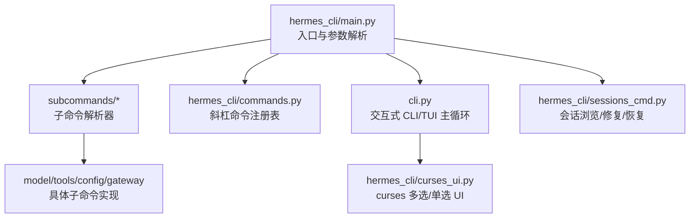
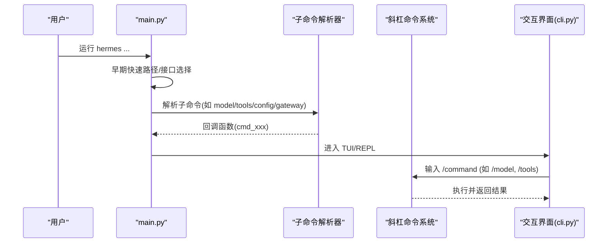
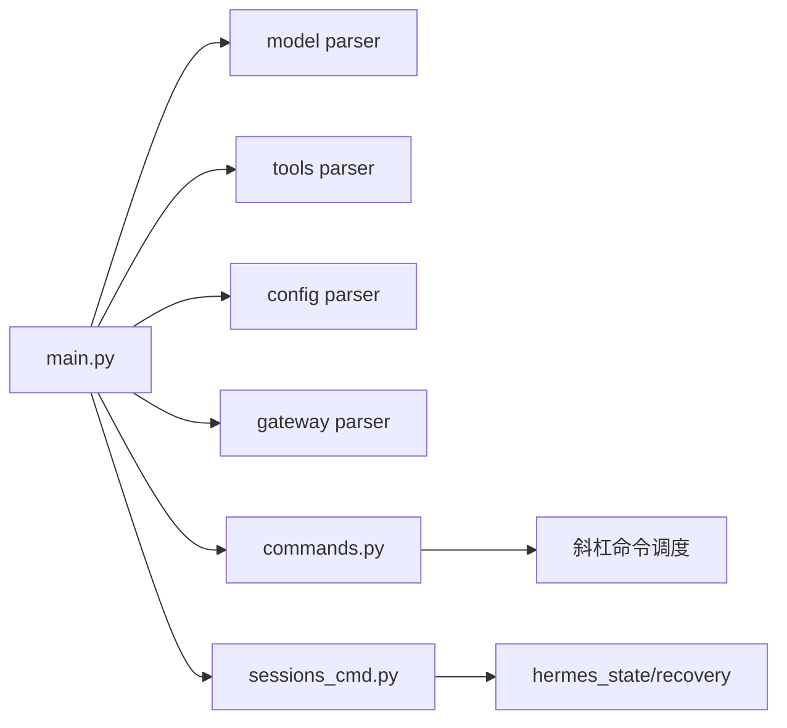

# 命令行界面

<cite>
**本文引用的文件**
- [cli.py](file://cli.py)
- [hermes_cli/main.py](file://hermes_cli/main.py)
- [hermes_cli/commands.py](file://hermes_cli/commands.py)
- [hermes_cli/subcommands/model.py](file://hermes_cli/subcommands/model.py)
- [hermes_cli/subcommands/tools.py](file://hermes_cli/subcommands/tools.py)
- [hermes_cli/subcommands/config.py](file://hermes_cli/subcommands/config.py)
- [hermes_cli/subcommands/gateway.py](file://hermes_cli/subcommands/gateway.py)
- [hermes_cli/curses_ui.py](file://hermes_cli/curses_ui.py)
- [hermes_cli/sessions_cmd.py](file://hermes_cli/sessions_cmd.py)
</cite>

## 目录
1. [简介](#简介)
2. [项目结构](#项目结构)
3. [核心组件](#核心组件)
4. [架构总览](#架构总览)
5. [详细组件分析](#详细组件分析)
6. [依赖关系分析](#依赖关系分析)
7. [性能考虑](#性能考虑)
8. [故障排查指南](#故障排查指南)
9. [结论](#结论)
10. [附录：常用工作流与快捷键](#附录：常用工作流与快捷键)

## 简介
本参考文档面向 Hermes Agent 的命令行界面（CLI），覆盖所有主要命令、选项与参数，包括 hermes、hermes model、hermes tools、hermes config、hermes gateway 等。文档同时解释交互式 TUI 模式、会话管理、配置管理、模型切换、工具管理等核心功能，并提供从基础到高级的工作流示例、快捷键说明、错误处理与调试选项，帮助不同经验水平的用户高效使用 Hermes Agent。

## 项目结构
Hermes CLI 由入口主程序与大量子命令模块组成：
- 入口与启动流程：hermes_cli/main.py
- 全局命令注册与斜杠命令：hermes_cli/commands.py
- 各子命令解析器：hermes_cli/subcommands/*（如 model、tools、config、gateway）
- 交互 UI 与 curses 组件：cli.py、hermes_cli/curses_ui.py
- 会话管理与恢复：hermes_cli/sessions_cmd.py

图表来源
- [hermes_cli/main.py:439-485](file://hermes_cli/main.py#L439-L485)
- [hermes_cli/commands.py:102-345](file://hermes_cli/commands.py#L102-L345)
- [cli.py:50-93](file://cli.py#L50-L93)
- [hermes_cli/curses_ui.py:1-6](file://hermes_cli/curses_ui.py#L1-L6)
- [hermes_cli/sessions_cmd.py:1-20](file://hermes_cli/sessions_cmd.py#L1-L20)

章节来源
- [hermes_cli/main.py:1-120](file://hermes_cli/main.py#L1-L120)
- [hermes_cli/commands.py:1-120](file://hermes_cli/commands.py#L1-L120)

## 核心组件
- 入口与启动：负责早期快速路径、TUI/CLI 选择、配置文件加载、日志初始化、子命令注册与分发。
- 子命令解析器：为每个顶层命令提供独立的 argparse 子命令树，便于扩展与维护。
- 斜杠命令系统：集中注册 /new、/model、/tools、/reasoning 等运行时命令，支持忙时策略与平台可见性控制。
- 交互 UI：基于 prompt_toolkit 和 curses 的终端界面，支持富文本、历史、补全与键盘导航。
- 会话管理：会话浏览、恢复、修复、导出与状态检查。

章节来源
- [hermes_cli/main.py:439-485](file://hermes_cli/main.py#L439-L485)
- [hermes_cli/commands.py:102-345](file://hermes_cli/commands.py#L102-L345)
- [cli.py:50-93](file://cli.py#L50-L93)
- [hermes_cli/sessions_cmd.py:58-200](file://hermes_cli/sessions_cmd.py#L58-L200)

## 架构总览
CLI 启动后根据环境决定进入 TUI 或经典 REPL；随后加载配置与环境变量桥接，并注册子命令。用户在 TUI 中通过斜杠命令进行会话控制、模型切换、工具管理等操作；在 CLI 模式下通过子命令直接执行任务。

图表来源
- [hermes_cli/main.py:311-339](file://hermes_cli/main.py#L311-L339)
- [hermes_cli/main.py:439-485](file://hermes_cli/main.py#L439-L485)
- [hermes_cli/commands.py:102-345](file://hermes_cli/commands.py#L102-L345)
- [cli.py:50-93](file://cli.py#L50-L93)

## 详细组件分析

### 顶层命令与子命令
- hermes：默认进入交互式聊天；也可带子命令执行特定任务。
- hermes model：交互式选择推理提供商与默认模型，支持刷新缓存、门户 URL、OAuth 参数、超时、CA bundle、禁用 TLS 验证等。
- hermes tools：按平台启用/禁用工具集或 MCP 工具；支持列表、启用、禁用、post-setup 钩子。
- hermes config：查看/编辑/获取/设置/删除配置项，打印路径、检查迁移。
- hermes gateway：消息网关管理（run/start/stop/restart/status/install/uninstall），支持前台运行、服务安装、替换实例、外部进程管理器、深度状态检查等。

章节来源
- [hermes_cli/subcommands/model.py:12-63](file://hermes_cli/subcommands/model.py#L12-L63)
- [hermes_cli/subcommands/tools.py:12-96](file://hermes_cli/subcommands/tools.py#L12-L96)
- [hermes_cli/subcommands/config.py:12-69](file://hermes_cli/subcommands/config.py#L12-L69)
- [hermes_cli/subcommands/gateway.py:32-200](file://hermes_cli/subcommands/gateway.py#L32-L200)

### 交互式 TUI 模式
- 启动决策：优先显式 --cli/--tui 或环境变量 HERMES_TUI=1；若非交互式终端则回退到 CLI；否则读取 display.interface 配置。
- 鼠标残留抑制：在 TUI 接管前关闭终端鼠标追踪序列，避免滚动污染。
- 交互能力：prompt_toolkit 提供历史、补全、富文本显示；curses 用于多选型菜单（工具/技能选择）。

章节来源
- [hermes_cli/main.py:311-339](file://hermes_cli/main.py#L311-L339)
- [hermes_cli/main.py:341-371](file://hermes_cli/main.py#L341-L371)
- [cli.py:50-93](file://cli.py#L50-L93)
- [hermes_cli/curses_ui.py:1-6](file://hermes_cli/curses_ui.py#L1-L6)

### 会话管理
- 会话浏览与恢复：支持修复损坏数据库、离线恢复、生成报告、选择性允许部分数据。
- 会话操作：新建、标题、压缩、分支、导出、历史记录、重试、撤销、暂停/停止等（通过斜杠命令）。
- 状态与上下文：查看 token 用量、上下文窗口详情、压缩统计、吞吐量等。

章节来源
- [hermes_cli/sessions_cmd.py:58-200](file://hermes_cli/sessions_cmd.py#L58-L200)
- [hermes_cli/commands.py:102-345](file://hermes_cli/commands.py#L102-L345)

### 配置管理
- 配置来源优先级：用户配置 ~/.hermes/config.yaml > 项目级 cli-config.yaml；环境变量可覆盖；受托管范围（managed scope）最后叠加。
- 键映射与环境桥接：terminal、browser、auxiliary、security、sessions 等段会映射到环境变量供下游工具使用。
- 配置子命令：show/edit/get/set/unset/path/env-path/check/migrate。

章节来源
- [cli.py:409-790](file://cli.py#L409-L790)
- [hermes_cli/subcommands/config.py:12-69](file://hermes_cli/subcommands/config.py#L12-L69)

### 模型切换
- 交互式向导：选择提供商与模型，支持刷新模型列表、门户与推理 API URL、OAuth client id/scope、无浏览器登录、HTTP 超时、CA bundle、禁用 TLS 验证。
- 运行时命令：/model 可在会话内切换模型，支持 --global 持久化、--session 会话级、--refresh 刷新缓存。

章节来源
- [hermes_cli/subcommands/model.py:12-63](file://hermes_cli/subcommands/model.py#L12-L63)
- [hermes_cli/commands.py:196-204](file://hermes_cli/commands.py#L196-L204)

### 工具管理
- 工具集与 MCP：内置工具集（如 web、memory）与 MCP server:tool 形式工具均可按平台启用/禁用。
- 子命令：list [--platform]、disable <name...> [--platform]、enable <name...> [--platform]、post-setup <key>。
- 运行时命令：/tools、/toolsets、/reload-mcp、/skills 等。

章节来源
- [hermes_cli/subcommands/tools.py:12-96](file://hermes_cli/subcommands/tools.py#L12-L96)
- [hermes_cli/commands.py:254-308](file://hermes_cli/commands.py#L254-L308)

### 网关管理
- 生命周期：run（前台）、start/stop/restart（服务）、status（含 deep/full/system）、install/uninstall（含 system/run-as-user/start-now/no-start-on-login 等）。
- 运行选项：verbose/quiet、replace、force、no-supervise、external-supervisor、accept hooks。
- 兼容标志：--platform 保留以兼容旧文档但不公开。

章节来源
- [hermes_cli/subcommands/gateway.py:32-200](file://hermes_cli/subcommands/gateway.py#L32-L200)

## 依赖关系分析
- main.py 导入各子命令构建器，形成“入口 -> 解析器 -> 处理器”的解耦结构。
- commands.py 作为斜杠命令的单一事实源，被 CLI、网关、Telegram/Slack 等平台复用。
- cli.py 依赖 prompt_toolkit 与 curses 提供交互体验；curses_ui.py 提供通用多选/单选 UI。
- sessions_cmd.py 依赖 hermes_state 与 recovery 模块进行数据库修复与恢复。

图表来源
- [hermes_cli/main.py:439-485](file://hermes_cli/main.py#L439-L485)
- [hermes_cli/commands.py:102-345](file://hermes_cli/commands.py#L102-L345)
- [hermes_cli/sessions_cmd.py:58-200](file://hermes_cli/sessions_cmd.py#L58-L200)

章节来源
- [hermes_cli/main.py:439-485](file://hermes_cli/main.py#L439-L485)
- [hermes_cli/commands.py:102-345](file://hermes_cli/commands.py#L102-L345)
- [hermes_cli/sessions_cmd.py:58-200](file://hermes_cli/sessions_cmd.py#L58-L200)

## 性能考虑
- 早期快速路径：版本查询、TUI 判断、IPv4 偏好等在导入重依赖前完成，减少冷启动开销。
- 配置缓存：raw config 读取与 managed overlay 合并仅一次，避免重复 YAML 解析。
- 懒加载：部分模块（如 prompt_toolkit）按需导入，降低非交互场景的启动成本。
- 输出优化：富文本与表格对齐、紧凑时间/令牌计数格式化，提升可读性与渲染效率。

章节来源
- [hermes_cli/main.py:272-339](file://hermes_cli/main.py#L272-L339)
- [hermes_cli/main.py:712-744](file://hermes_cli/main.py#L712-L744)
- [cli.py:96-121](file://cli.py#L96-L121)

## 故障排查指南
- 非交互式环境误用：某些命令需要 TTY（如 tools/setup/model），若通过管道调用会报错退出。
- 配置错误：YAML 解析失败会记录警告并回退到默认值；可通过 config check/migrate 修复。
- 会话数据库损坏：使用 sessions repair/recover 进行修复与离线恢复，必要时生成报告。
- 网关服务冲突：前台 run 时可用 replace/force 替换已有实例；systemd/launchd 环境下注意 start-on-login 与 external-supervisor。
- 网络与 TLS：model 子命令支持自定义 CA bundle 与 insecure 选项（仅限测试）；network.force_ipv4 可强制 IPv4。

章节来源
- [hermes_cli/main.py:488-503](file://hermes_cli/main.py#L488-L503)
- [hermes_cli/subcommands/config.py:12-69](file://hermes_cli/subcommands/config.py#L12-L69)
- [hermes_cli/sessions_cmd.py:58-200](file://hermes_cli/sessions_cmd.py#L58-L200)
- [hermes_cli/subcommands/model.py:12-63](file://hermes_cli/subcommands/model.py#L12-L63)
- [hermes_cli/subcommands/gateway.py:32-200](file://hermes_cli/subcommands/gateway.py#L32-L200)

## 结论
Hermes CLI 提供了完整的命令行与交互式界面，覆盖模型、工具、配置、网关与会话管理等核心能力。通过清晰的子命令结构与统一的斜杠命令系统，用户可以在不同场景下高效完成任务。结合早期快速路径与懒加载机制，系统在易用性与性能之间取得良好平衡。建议新用户从基础命令开始，逐步掌握 TUI 与高级配置；高级用户可利用托管范围、平台工具集与网关服务化部署满足复杂需求。

## 附录：常用工作流与快捷键

### 常用工作流
- 设置新模型
  - 使用交互式向导：hermes model
  - 刷新模型列表：hermes model --refresh
  - 指定门户与推理 API：hermes model --portal-url <url> --inference-url <url>
  - 无浏览器 OAuth：hermes model --no-browser
- 启用特定工具
  - 列出工具：hermes tools list [--platform cli]
  - 启用工具集/MCP 工具：hermes tools enable <name...> [--platform cli]
  - 禁用工具：hermes tools disable <name...> [--platform cli]
  - 运行 post-setup 钩子：hermes tools post-setup <key>
- 管理会话
  - 新建会话：/new [name]
  - 设置标题：/title [name]
  - 压缩上下文：/compress [here [N] | focus topic | --preview|--dry-run]
  - 分支探索：/branch [name]
  - 导出会话：/export [profile] [-o output.tar.gz]
  - 浏览/恢复会话：hermes sessions browse / repair / recover
- 网关服务化
  - 前台运行：hermes gateway run [-v|-q] [--replace|--force|--no-supervise|--external-supervisor]
  - 安装服务：hermes gateway install [--system|--run-as-user|--start-now|--start-on-login]
  - 启停与状态：hermes gateway start|stop|restart|status [--deep|--full|--system]

### 快捷键与交互提示
- TUI 模式选择：--tui/--cli 或 HERMES_TUI=1；非 TTY 自动回退 CLI。
- 忙时行为：/busy 控制 Enter 在代理忙碌时的行为（queue/steer/interrupt/status）。
- 指示器风格：/indicator 选择 TUI 忙指示器样式。
- 语音与唤醒：/voice on/off/tts；/wake on/off/status。
- 快速复制与粘贴：/copy [number]；/paste；/image <path>。
- 诊断与更新：/debug [nous|local]；/update；/version。

章节来源
- [hermes_cli/commands.py:102-345](file://hermes_cli/commands.py#L102-L345)
- [hermes_cli/subcommands/model.py:12-63](file://hermes_cli/subcommands/model.py#L12-L63)
- [hermes_cli/subcommands/tools.py:12-96](file://hermes_cli/subcommands/tools.py#L12-L96)
- [hermes_cli/subcommands/config.py:12-69](file://hermes_cli/subcommands/config.py#L12-L69)
- [hermes_cli/subcommands/gateway.py:32-200](file://hermes_cli/subcommands/gateway.py#L32-L200)
- [hermes_cli/sessions_cmd.py:58-200](file://hermes_cli/sessions_cmd.py#L58-L200)