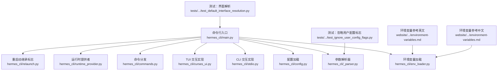
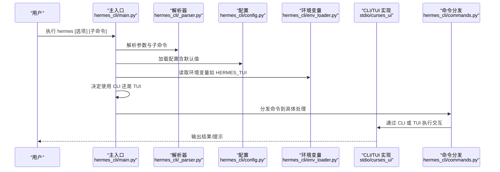
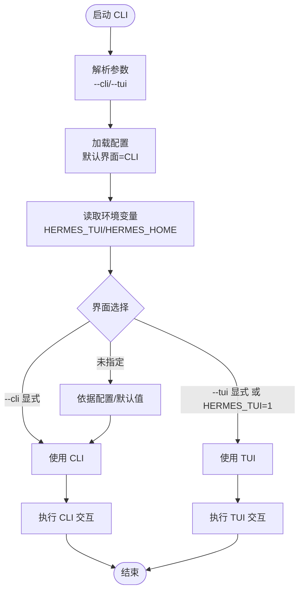
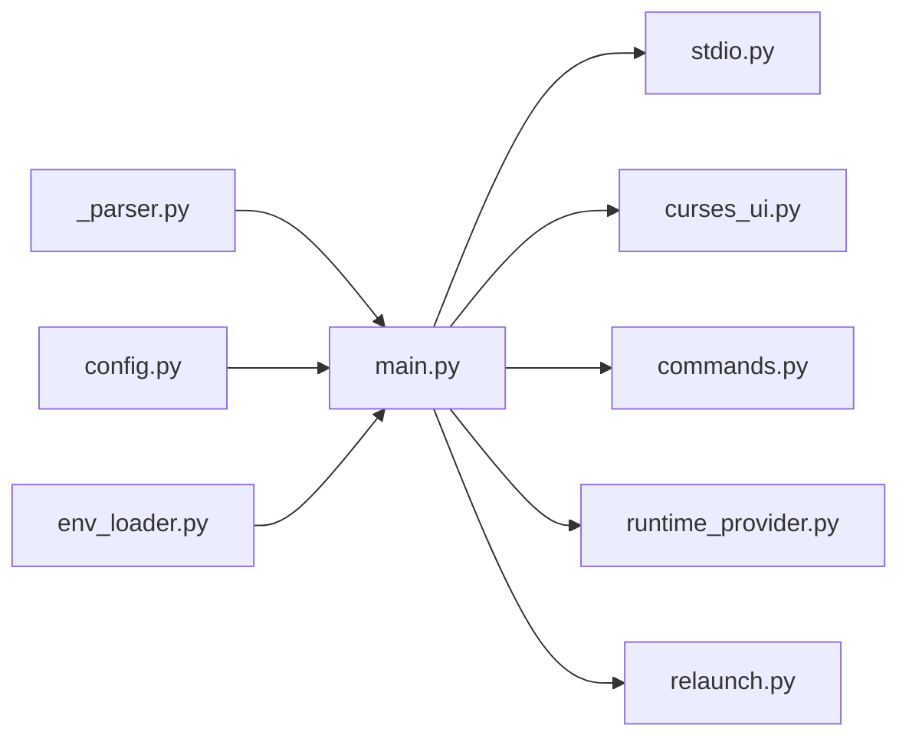

# 基础使用

<cite>
**本文引用的文件**
- [hermes_cli/main.py](file://hermes_cli/main.py)
- [hermes_cli/_parser.py](file://hermes_cli/_parser.py)
- [hermes_cli/config.py](file://hermes_cli/config.py)
- [hermes_cli/env_loader.py](file://hermes_cli/env_loader.py)
- [hermes_cli/curses_ui.py](file://hermes_cli/curses_ui.py)
- [hermes_cli/stdio.py](file://hermes_cli/stdio.py)
- [hermes_cli/commands.py](file://hermes_cli/commands.py)
- [hermes_cli/profiles.py](file://hermes_cli/profiles.py)
- [hermes_cli/runtime_provider.py](file://hermes_cli/runtime_provider.py)
- [hermes_cli/relaunch.py](file://hermes_cli/relaunch.py)
- [tests/hermes_cli/test_default_interface_resolution.py](file://tests/hermes_cli/test_default_interface_resolution.py)
- [tests/hermes_cli/test_ignore_user_config_flags.py](file://tests/hermes_cli/test_ignore_user_config_flags.py)
- [website/docs/reference/environment-variables.md](file://website/docs/reference/environment-variables.md)
- [website/i18n/zh-Hans/docusaurus-plugin-content-docs/current/reference/environment-variables.md](file://website/i18n/zh-Hans/docusaurus-plugin-content-docs/current/reference/environment-variables.md)
</cite>

## 目录
1. [简介](#简介)
2. [项目结构](#项目结构)
3. [核心组件](#核心组件)
4. [架构总览](#架构总览)
5. [详细组件分析](#详细组件分析)
6. [依赖关系分析](#依赖关系分析)
7. [性能考虑](#性能考虑)
8. [故障排除指南](#故障排除指南)
9. [结论](#结论)
10. [附录](#附录)

## 简介
本指南面向首次使用 Hermes Agent CLI 的用户，帮助您快速掌握命令行界面的基本概念、启动方式与交互流程。内容涵盖：
- hermes 命令的常用用法与默认行为
- 界面选择参数（如 --cli、--tui）
- 从零开始的使用示例（启动、对话、退出）
- 环境变量（如 HERMES_TUI、HERMES_HOME）的作用与影响
- 常见使用场景与最佳实践

## 项目结构
Hermes CLI 的核心实现位于 hermes_cli 包中，入口文件负责解析参数、加载配置与环境变量，并根据界面选择进入 CLI 或 TUI 模式。测试与文档提供了关于界面解析、环境变量与默认行为的重要参考。

图表来源
- [hermes_cli/main.py](file://hermes_cli/main.py)
- [hermes_cli/_parser.py](file://hermes_cli/_parser.py)
- [hermes_cli/config.py](file://hermes_cli/config.py)
- [hermes_cli/env_loader.py](file://hermes_cli/env_loader.py)
- [hermes_cli/stdio.py](file://hermes_cli/stdio.py)
- [hermes_cli/curses_ui.py](file://hermes_cli/curses_ui.py)
- [hermes_cli/commands.py](file://hermes_cli/commands.py)
- [hermes_cli/runtime_provider.py](file://hermes_cli/runtime_provider.py)
- [hermes_cli/relaunch.py](file://hermes_cli/relaunch.py)
- [tests/.../test_default_interface_resolution.py](file://tests/hermes_cli/test_default_interface_resolution.py)
- [tests/.../test_ignore_user_config_flags.py](file://tests/hermes_cli/test_ignore_user_config_flags.py)
- [website/.../environment-variables.md](file://website/docs/reference/environment-variables.md)
- [website/.../environment-variables.md](file://website/i18n/zh-Hans/docusaurus-plugin-content-docs/current/reference/environment-variables.md)

章节来源
- [hermes_cli/main.py](file://hermes_cli/main.py)
- [hermes_cli/_parser.py](file://hermes_cli/_parser.py)
- [hermes_cli/config.py](file://hermes_cli/config.py)
- [hermes_cli/env_loader.py](file://hermes_cli/env_loader.py)
- [hermes_cli/stdio.py](file://hermes_cli/stdio.py)
- [hermes_cli/curses_ui.py](file://hermes_cli/curses_ui.py)
- [hermes_cli/commands.py](file://hermes_cli/commands.py)
- [hermes_cli/runtime_provider.py](file://hermes_cli/runtime_provider.py)
- [hermes_cli/relaunch.py](file://hermes_cli/relaunch.py)
- [tests/.../test_default_interface_resolution.py](file://tests/hermes_cli/test_default_interface_resolution.py)
- [tests/.../test_ignore_user_config_flags.py](file://tests/hermes_cli/test_ignore_user_config_flags.py)
- [website/.../environment-variables.md](file://website/docs/reference/environment-variables.md)
- [website/.../environment-variables.md](file://website/i18n/zh-Hans/docusaurus-plugin-content-docs/current/reference/environment-variables.md)

## 核心组件
- 参数解析器：负责解析顶层参数与子命令，支持 --cli、--tui 等界面选择标志，并在测试中验证其行为。
- 配置系统：提供默认配置（默认界面为 CLI），并允许通过配置文件覆盖。
- 环境变量加载：读取 HERMES_TUI、HERMES_HOME 等环境变量，影响界面选择与运行时路径。
- 交互层：CLI 模式通过标准输入输出进行对话；TUI 模式通过终端 UI 提供更丰富的交互体验。
- 命令分发：将解析后的命令路由到具体处理逻辑。
- 运行时提供者：管理运行时环境与资源。
- 重启动继承标志：确保某些标志在重启时被继承。

章节来源
- [hermes_cli/_parser.py](file://hermes_cli/_parser.py)
- [hermes_cli/config.py](file://hermes_cli/config.py)
- [hermes_cli/env_loader.py](file://hermes_cli/env_loader.py)
- [hermes_cli/stdio.py](file://hermes_cli/stdio.py)
- [hermes_cli/curses_ui.py](file://hermes_cli/curses_ui.py)
- [hermes_cli/commands.py](file://hermes_cli/commands.py)
- [hermes_cli/runtime_provider.py](file://hermes_cli/runtime_provider.py)
- [hermes_cli/relaunch.py](file://hermes_cli/relaunch.py)

## 架构总览
下图展示了 CLI 启动的关键流程：参数解析 → 环境变量与配置 → 界面选择 → 命令执行。

图表来源
- [hermes_cli/main.py](file://hermes_cli/main.py)
- [hermes_cli/_parser.py](file://hermes_cli/_parser.py)
- [hermes_cli/config.py](file://hermes_cli/config.py)
- [hermes_cli/env_loader.py](file://hermes_cli/env_loader.py)
- [hermes_cli/stdio.py](file://hermes_cli/stdio.py)
- [hermes_cli/curses_ui.py](file://hermes_cli/curses_ui.py)
- [hermes_cli/commands.py](file://hermes_cli/commands.py)

## 详细组件分析

### 参数与界面选择
- --cli：强制使用经典 CLI 界面。
- --tui：强制使用 TUI 界面。
- 默认行为：若未显式指定，系统会综合配置与环境变量决定界面；默认配置显示界面为 CLI。
- 环境变量：
  - HERMES_TUI=1：等同于 --tui，强制 TUI。
  - HERMES_HOME：用于确定配置与数据目录位置，影响路径显示与运行时行为。
- 测试验证：
  - 顶层参数与子命令中的 --cli/--tui 行为一致。
  - 默认配置界面为 CLI。
  - 环境变量与标志的优先级与继承关系在测试中有覆盖。

图表来源
- [hermes_cli/_parser.py](file://hermes_cli/_parser.py)
- [hermes_cli/config.py](file://hermes_cli/config.py)
- [hermes_cli/env_loader.py](file://hermes_cli/env_loader.py)
- [tests/.../test_default_interface_resolution.py](file://tests/hermes_cli/test_default_interface_resolution.py)

章节来源
- [hermes_cli/_parser.py](file://hermes_cli/_parser.py)
- [hermes_cli/config.py](file://hermes_cli/config.py)
- [hermes_cli/env_loader.py](file://hermes_cli/env_loader.py)
- [tests/.../test_default_interface_resolution.py](file://tests/hermes_cli/test_default_interface_resolution.py)

### 从零开始的使用示例
以下示例展示如何从命令行启动 CLI 并进行基本对话与退出。请根据实际安装路径替换 hermes 命令。

- 启动 CLI（默认界面）
  - hermes
  - 若需明确使用 CLI，可添加 --cli
  - hermes --cli

- 启动 TUI（如需图形化界面）
  - hermes --tui

- 进行基本对话
  - 在 CLI 中直接输入问题或指令，查看返回结果
  - 在 TUI 中通过界面输入并查看响应

- 退出程序
  - CLI：输入退出命令或使用终端快捷键
  - TUI：通过界面提供的退出选项或快捷键

章节来源
- [hermes_cli/main.py](file://hermes_cli/main.py)
- [hermes_cli/stdio.py](file://hermes_cli/stdio.py)
- [hermes_cli/curses_ui.py](file://hermes_cli/curses_ui.py)

### 环境变量的作用
- HERMES_TUI
  - 设置为 1 时强制使用 TUI，等同于 --tui
  - 未设置时遵循配置与参数解析结果
- HERMES_HOME
  - 指定配置与数据目录位置
  - 影响路径显示与运行时行为
- 其他相关变量（参考文档）
  - HERMES_TUI_DIR：预构建 TUI 目录路径
  - HERMES_TUI_RESUME：按会话 ID 恢复 TUI 会话
  - HERMES_TUI_THEME：强制 TUI 主题
  - HERMES_INFERENCE_MODEL：临时覆盖推理模型

章节来源
- [hermes_cli/env_loader.py](file://hermes_cli/env_loader.py)
- [website/.../environment-variables.md](file://website/docs/reference/environment-variables.md)
- [website/.../environment-variables.md](file://website/i18n/zh-Hans/docusaurus-plugin-content-docs/current/reference/environment-variables.md)

### 命令与子命令
- hermes：顶层命令，支持界面选择与通用选项
- hermes chat：进入对话模式（CLI/TUI 均可）
- hermes profile：管理配置文件档（详见文档页面）

章节来源
- [hermes_cli/_parser.py](file://hermes_cli/_parser.py)
- [hermes_cli/commands.py](file://hermes_cli/commands.py)
- [website/docs/reference/profile-commands.md](file://website/docs/reference/profile-commands.md)

## 依赖关系分析
- 参数解析器与配置系统耦合紧密，共同决定界面选择
- 环境变量加载为界面选择与路径解析提供外部输入
- 交互层（CLI/TUI）对上层命令分发透明
- 运行时提供者与重启动继承标志保证运行一致性

图表来源
- [hermes_cli/_parser.py](file://hermes_cli/_parser.py)
- [hermes_cli/config.py](file://hermes_cli/config.py)
- [hermes_cli/env_loader.py](file://hermes_cli/env_loader.py)
- [hermes_cli/main.py](file://hermes_cli/main.py)
- [hermes_cli/stdio.py](file://hermes_cli/stdio.py)
- [hermes_cli/curses_ui.py](file://hermes_cli/curses_ui.py)
- [hermes_cli/commands.py](file://hermes_cli/commands.py)
- [hermes_cli/runtime_provider.py](file://hermes_cli/runtime_provider.py)
- [hermes_cli/relaunch.py](file://hermes_cli/relaunch.py)

章节来源
- [hermes_cli/main.py](file://hermes_cli/main.py)
- [hermes_cli/_parser.py](file://hermes_cli/_parser.py)
- [hermes_cli/config.py](file://hermes_cli/config.py)
- [hermes_cli/env_loader.py](file://hermes_cli/env_loader.py)
- [hermes_cli/stdio.py](file://hermes_cli/stdio.py)
- [hermes_cli/curses_ui.py](file://hermes_cli/curses_ui.py)
- [hermes_cli/commands.py](file://hermes_cli/commands.py)
- [hermes_cli/runtime_provider.py](file://hermes_cli/runtime_provider.py)
- [hermes_cli/relaunch.py](file://hermes_cli/relaunch.py)

## 性能考虑
- 界面选择对性能影响较小，主要取决于模型与网络延迟
- 合理设置环境变量（如 HERMES_TUI_DIR）可减少首次启动的准备时间
- 在批处理或自动化场景中，可通过 HERMES_INFERENCE_MODEL 固定模型以避免不必要的切换

## 故障排除指南
- 界面选择不符合预期
  - 检查是否同时设置了 --cli 与 --tui，以及 HERMES_TUI 的值
  - 查看配置文件中的 display.interface 设置
- 无法找到 hermes 命令
  - 确认已正确安装并加入 PATH
- 路径显示异常
  - 检查 HERMES_HOME 是否指向期望的目录
- 忽略用户配置或规则
  - 使用测试中验证的 --ignore-user-config 与 --ignore-rules 标志进行排查

章节来源
- [tests/.../test_default_interface_resolution.py](file://tests/hermes_cli/test_default_interface_resolution.py)
- [tests/.../test_ignore_user_config_flags.py](file://tests/hermes_cli/test_ignore_user_config_flags.py)
- [hermes_cli/env_loader.py](file://hermes_cli/env_loader.py)

## 结论
通过本指南，您可以：
- 明确 hermes 命令的常用用法与默认行为
- 正确使用 --cli 与 --tui 选择界面
- 掌握环境变量（HERMES_TUI、HERMES_HOME 等）对行为的影响
- 完成从零开始的启动、对话与退出流程
- 在常见场景中采用最佳实践，提升使用效率

## 附录
- 更多命令参考与示例，请参阅官方文档页面“Profile Commands Reference”与“Environment Variables”。