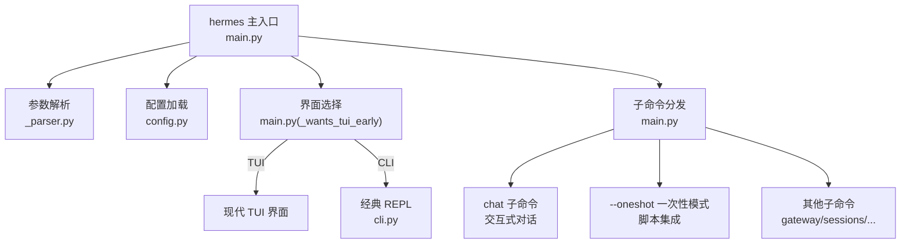
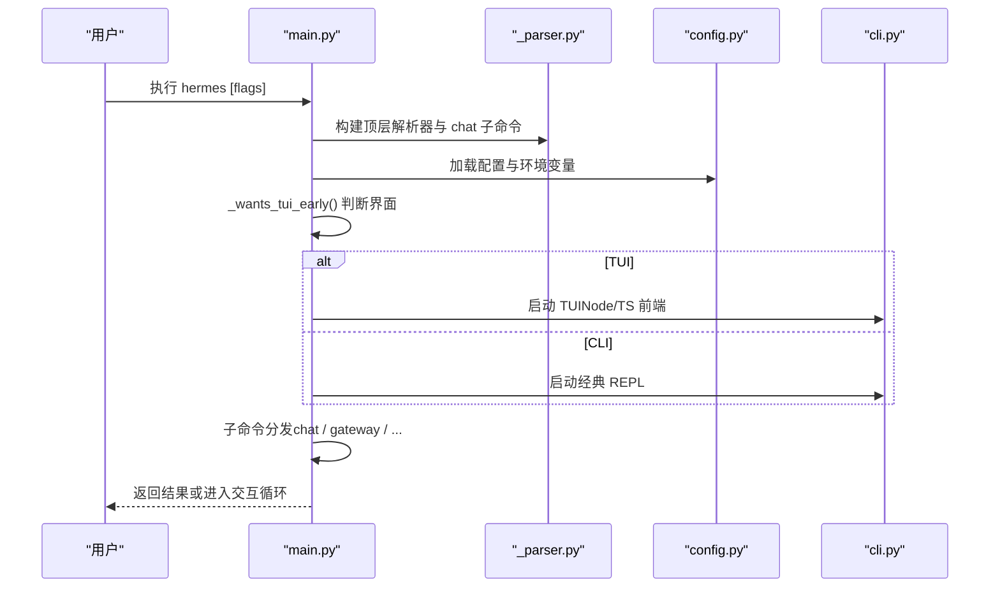
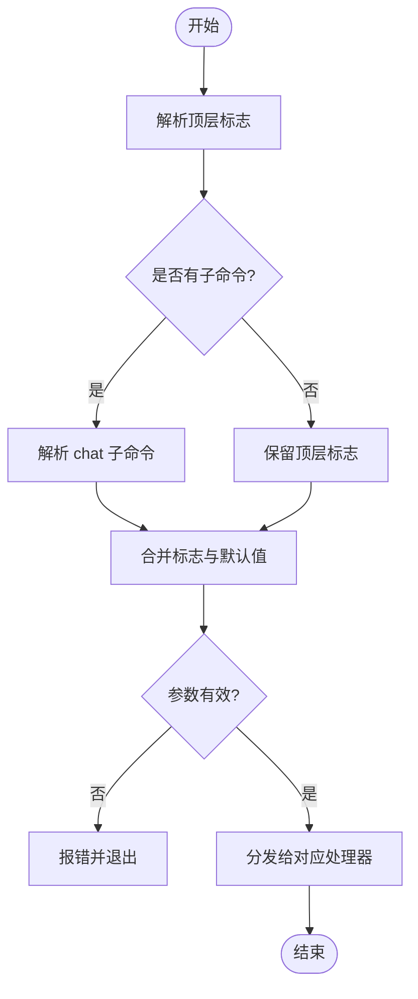
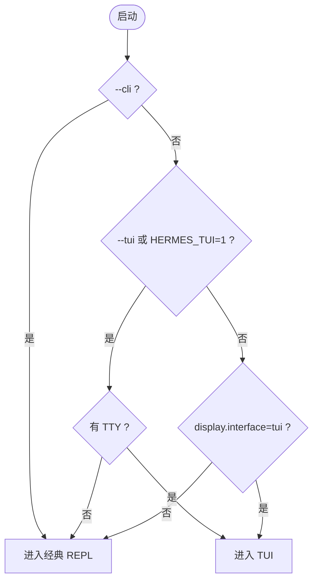
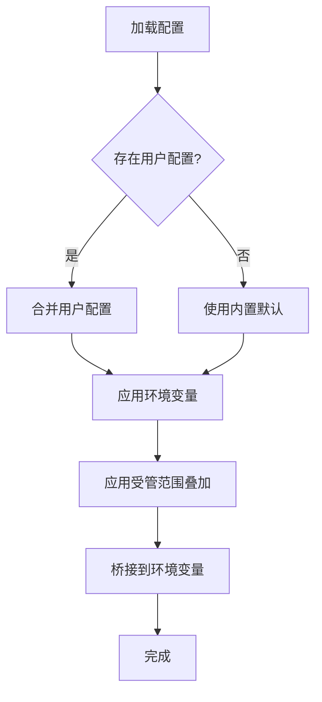
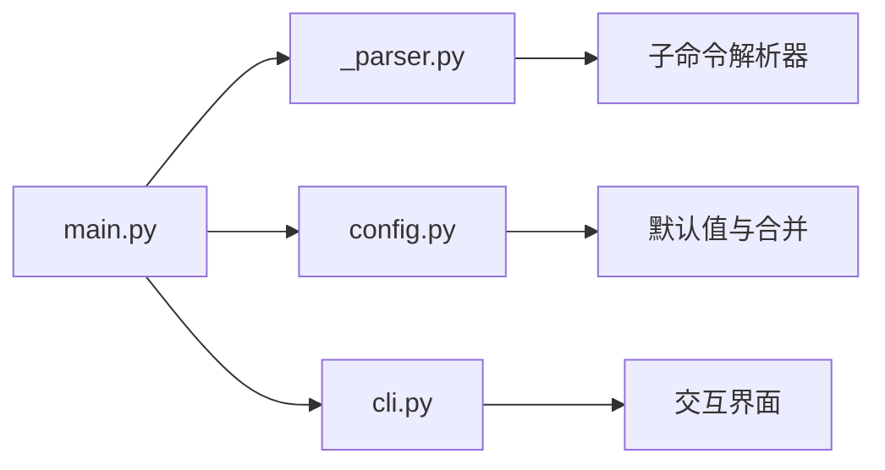

# 基础命令和界面

<cite>
**本文引用的文件**
- [hermes_cli/main.py](file://hermes_cli/main.py)
- [hermes_cli/_parser.py](file://hermes_cli/_parser.py)
- [cli.py](file://cli.py)
- [hermes_cli/config.py](file://hermes_cli/config.py)
</cite>

## 目录
1. [简介](#简介)
2. [项目结构](#项目结构)
3. [核心组件](#核心组件)
4. [架构总览](#架构总览)
5. [详细组件分析](#详细组件分析)
6. [依赖关系分析](#依赖关系分析)
7. [性能考虑](#性能考虑)
8. [故障排除指南](#故障排除指南)
9. [结论](#结论)
10. [附录](#附录)

## 简介
本章节面向 Hermes Agent CLI 的基础命令与界面，聚焦以下目标：
- 解释 hermes 主命令的三种运行模式：交互式聊天（CLI）、TUI、以及一次性/脚本化模式（--oneshot）的区别与适用场景。
- 详解关键启动参数：--cli、--tui、--profile/-p、--model、--provider、--reasoning、--toolsets、--resume/-r、--continue/-c、--in、--worktree/-w、--safe-mode、--ignore-user-config、--ignore-rules、--accept-hooks、--yolo、--pass-session-id、--dev 等的作用与使用场景。
- 说明命令行解析器的工作原理：参数优先级、默认值处理、错误处理机制，以及与配置文件和环境变量的合并策略。
- 提供常见使用模式的示例：直接对话、批量执行、脚本集成、会话恢复、工作区隔离等。
- 解释进程标题设置、UTF-8 支持、跨平台兼容性处理。
- 给出故障排除指南，覆盖常见的启动问题与环境配置问题。

## 项目结构
Hermes CLI 的入口与参数解析集中在 hermes_cli/main.py 与 hermes_cli/_parser.py；交互界面与运行时在 cli.py；配置加载与合并逻辑在 hermes_cli/config.py。整体流程如下：
- 启动阶段：快速路径检测版本、应用 --profile 覆盖、加载 .env、早期日志初始化、IPv4 偏好设置。
- 参数解析：顶层 argparse 构建 chat 子命令及共享标志，支持“继承到重新执行”的标志集。
- 界面选择：基于 --cli/--tui、TTY 检测、display.interface 配置决定进入 TUI 或经典 REPL。
- 运行模式：chat 子命令进入交互式对话；--oneshot 用于一次性任务；gateway 等子命令由各自子解析器处理。

图表来源
- [hermes_cli/main.py:232-339](file://hermes_cli/main.py#L232-L339)
- [hermes_cli/_parser.py:87-503](file://hermes_cli/_parser.py#L87-L503)
- [cli.py:1-120](file://cli.py#L1-L120)

章节来源
- [hermes_cli/main.py:232-339](file://hermes_cli/main.py#L232-L339)
- [hermes_cli/_parser.py:87-503](file://hermes_cli/_parser.py#L87-L503)
- [cli.py:1-120](file://cli.py#L1-L120)

## 核心组件
- 命令行解析器（argparse）：定义顶层标志与 chat 子命令，支持标志继承与重复注册，避免重复默认覆盖。
- 界面选择器：在导入重依赖前尽早判断是否进入 TUI，避免非 TTY 环境误启动。
- 配置系统：从用户配置、项目配置、环境变量、受管范围叠加多层合并，并安全回退到默认值。
- 运行模式：
  - 交互式聊天（CLI）：prompt_toolkit 驱动的 REPL，适合日常对话与工具调用。
  - TUI 模式：现代终端界面，适合富文本展示与交互。
  - 一次性模式（--oneshot）：发送单次提示并输出最终结果，适合脚本与管道集成。

章节来源
- [hermes_cli/_parser.py:87-503](file://hermes_cli/_parser.py#L87-L503)
- [hermes_cli/main.py:232-339](file://hermes_cli/main.py#L232-L339)
- [cli.py:1-120](file://cli.py#L1-L120)

## 架构总览
下图展示了从启动到运行的关键路径：参数解析、配置加载、界面选择、子命令分发与运行。

图表来源
- [hermes_cli/main.py:232-339](file://hermes_cli/main.py#L232-L339)
- [hermes_cli/_parser.py:87-503](file://hermes_cli/_parser.py#L87-L503)
- [cli.py:1-120](file://cli.py#L1-L120)

## 详细组件分析

### 命令行解析器（argparse）工作原理
- 顶层标志：
  - --version/-V：显示版本并退出。
  - -z/--oneshot PROMPT：一次性模式，仅输出最终响应文本，适合脚本与管道。
  - --usage-file PATH：一次性模式下写入用量报告 JSON。
  - -m/--model、--provider、--reasoning：覆盖本次调用的模型、提供商与推理强度。
  - -t/--toolsets：启用指定工具集。
  - --resume/-r SESSION、--continue/-c [SESSION_NAME]：恢复最近或指定会话。
  - --no-restore-cwd：恢复会话时不切换工作目录。
  - --in DIR：启动或恢复前切换到指定目录。
  - --worktree/-w：在隔离 git worktree 中运行。
  - --accept-hooks：自动批准未见的 shell hooks（CI/无头环境）。
  - --skills/-s：预加载技能。
  - --yolo：绕过危险命令审批（谨慎使用）。
  - --pass-session-id：将会话 ID 注入系统提示。
  - --ignore-user-config：忽略用户配置，仅用内置默认（仍加载 .env）。
  - --ignore-rules：跳过 AGENTS.md/SOUL.md/.cursorrules 等自动注入。
  - --safe-mode：禁用所有自定义（包含 --ignore-user-config 与 --ignore-rules）。
  - --tui：启动现代 TUI。
  - --cli：强制经典 prompt_toolkit REPL（覆盖 display.interface=tui）。
  - --dev：配合 --tui 通过 tsx 运行 TypeScript 源（跳过 dist 构建）。
- 标志继承：通过 inherit_on_relaunch 标记，使 relaunch 时保留必要标志。
- chat 子命令：复用顶层标志，避免重复默认覆盖（使用 SUPPRESS），并提供 -q/--query、--image、--verbose、--quiet、--checkpoints、--max-turns、--source 等选项。

图表来源
- [hermes_cli/_parser.py:87-503](file://hermes_cli/_parser.py#L87-L503)

章节来源
- [hermes_cli/_parser.py:87-503](file://hermes_cli/_parser.py#L87-L503)

### 界面选择与运行模式
- 界面选择优先级：
  - 显式 --cli 优先，强制经典 REPL。
  - 显式 --tui 或 HERMES_TUI=1 优先，尝试启动 TUI。
  - TTY 检测：若非交互式 stdio（管道/重定向），则不启动 TUI。
  - 配置项 display.interface=tui：在无冲突时作为默认。
- 鼠标跟踪残留抑制：在 TUI 热路径早期关闭终端鼠标追踪序列，避免滚动污染。
- 运行模式：
  - 交互式聊天（CLI）：prompt_toolkit 驱动，适合人类交互。
  - TUI：现代终端界面，适合富文本与复杂交互。
  - 一次性模式（--oneshot）：单轮执行，输出最终结果，适合自动化。

图表来源
- [hermes_cli/main.py:232-339](file://hermes_cli/main.py#L232-L339)

章节来源
- [hermes_cli/main.py:232-339](file://hermes_cli/main.py#L232-L339)

### 配置系统与默认值处理
- 配置来源优先级：
  - 用户配置 ~/.hermes/config.yaml（可被 --ignore-user-config 跳过）。
  - 项目配置 ./cli-config.yaml（作为 fallback）。
  - 环境变量（如 TERMINAL_*、AUXILIARY_*、HERMES_*）。
  - 受管范围叠加（管理员固定值最后生效）。
- 默认值：内置大量默认项（模型、终端、浏览器、压缩、代理、显示、安全等），并在加载失败时安全回退。
- 环境变量桥接：将配置项映射为环境变量，供 terminal_tool 等模块读取。
- 安全与隐私：支持 redact_secrets 开关，早期桥接到 HERMES_REDACT_SECRETS。

图表来源
- [cli.py:409-790](file://cli.py#L409-L790)
- [hermes_cli/config.py:45-156](file://hermes_cli/config.py#L45-L156)

章节来源
- [cli.py:409-790](file://cli.py#L409-L790)
- [hermes_cli/config.py:45-156](file://hermes_cli/config.py#L45-L156)

### 进程标题、UTF-8 支持与跨平台兼容
- 进程标题：优先使用 setproctitle，其次通过 ctypes 调用 prctl/pthread_setname_np，Windows 下无需额外设置。
- UTF-8 支持：在 Windows 上尽早引入 hermes_bootstrap 以设置 UTF-8 标准输入输出，避免 UnicodeEncodeError。
- 跨平台兼容：
  - 早期版本检测与 Termux/容器环境优化。
  - 鼠标跟踪序列抑制以避免终端滚动污染。
  - IPv4 偏好提前应用，避免 HTTP 客户端创建时的网络问题。

章节来源
- [hermes_cli/main.py:232-270](file://hermes_cli/main.py#L232-L270)
- [hermes_cli/main.py:272-371](file://hermes_cli/main.py#L272-L371)
- [cli.py:15-24](file://cli.py#L15-L24)

### 常见使用模式示例
- 直接对话（CLI）：
  - hermes：启动交互式聊天。
  - hermes chat -q "你好"：单轮查询模式。
  - hermes --tui：启动现代 TUI。
  - hermes --cli：强制经典 REPL。
- 会话恢复与工作区：
  - hermes -c：恢复最近会话。
  - hermes --resume latest：恢复最近会话。
  - hermes --in ./dir：切换到目录后启动或恢复该工作区的会话。
  - hermes -w：在隔离 git worktree 中运行。
- 脚本集成与批量执行：
  - hermes -z "你的提示"：一次性模式，仅输出最终结果。
  - hermes -z "你的提示" --usage-file usage.json：写入用量报告。
  - hermes chat -q "任务"：单轮任务执行。
- 模型与提供商覆盖：
  - hermes -m anthropic/claude-sonnet-4 --provider openrouter：覆盖模型与提供商。
  - hermes --reasoning high：提高推理强度。
- 安全与调试：
  - hermes --safe-mode：禁用所有自定义，便于定位问题。
  - hermes --ignore-user-config：忽略用户配置，仅用内置默认。
  - hermes --accept-hooks：自动批准未知 hooks（CI/无头环境）。
  - hermes --yolo：绕过危险命令审批（谨慎使用）。

章节来源
- [hermes_cli/_parser.py:87-503](file://hermes_cli/_parser.py#L87-L503)
- [hermes_cli/main.py:232-339](file://hermes_cli/main.py#L232-L339)

## 依赖关系分析
- main.py 依赖：
  - _parser.py：构建顶层解析器与 chat 子命令。
  - config.py：加载配置与环境变量。
  - cli.py：实现交互界面与运行时。
- 子命令解析器：
  - 各子命令（gateway、sessions、model、setup 等）通过 build_*_parser 函数注册。
- 配置系统：
  - 多来源合并（用户配置、项目配置、环境变量、受管范围）。
  - 安全回退与备份损坏配置。

图表来源
- [hermes_cli/main.py:439-485](file://hermes_cli/main.py#L439-L485)
- [hermes_cli/_parser.py:87-503](file://hermes_cli/_parser.py#L87-L503)
- [cli.py:409-790](file://cli.py#L409-L790)

章节来源
- [hermes_cli/main.py:439-485](file://hermes_cli/main.py#L439-L485)
- [hermes_cli/_parser.py:87-503](file://hermes_cli/_parser.py#L87-L503)
- [cli.py:409-790](file://cli.py#L409-L790)

## 性能考虑
- 快速路径：
  - 超快版本检测：在导入重依赖前处理 --version。
  - 早期界面选择：避免在非 TTY 环境启动 TUI。
  - 配置缓存：减少重复 YAML 解析与合并开销。
- 资源管理：
  - 一次性模式硬退出：避免解释器终止阶段的崩溃风险。
  - 鼠标跟踪抑制：减少终端滚动污染。
- 网络优化：
  - 提前应用 IPv4 偏好，避免后续 HTTP 客户端创建时的网络问题。

章节来源
- [hermes_cli/main.py:232-339](file://hermes_cli/main.py#L232-L339)
- [hermes_cli/main.py:105-222](file://hermes_cli/main.py#L105-L222)

## 故障排除指南
- 无法启动 TUI：
  - 检查是否处于非 TTY 环境（管道/重定向），此时不会启动 TUI。
  - 使用 --tui 显式请求 TUI，若仍失败会给出明确错误信息。
- 配置解析失败：
  - 查看 agent.log 与 errors.log 中的警告信息。
  - 损坏的配置会被备份为 .bak 文件，建议修复后重启。
- 环境变量未生效：
  - 确认配置项已正确映射到环境变量（如 TERMINAL_*、AUXILIARY_*）。
  - 使用 --ignore-user-config 排除用户配置干扰。
- 权限与路径问题：
  - 检查 HERMES_HOME 是否正确设置。
  - 在 Docker 环境中注意 UID/GID 映射与卷挂载权限。
- 网络问题：
  - 启用 network.force_ipv4 强制 IPv4。
  - 检查代理与防火墙设置。

章节来源
- [hermes_cli/config.py:45-156](file://hermes_cli/config.py#L45-L156)
- [hermes_cli/main.py:232-339](file://hermes_cli/main.py#L232-L339)

## 结论
Hermes Agent CLI 提供了灵活的命令与界面支持，涵盖交互式聊天、现代 TUI 与一次性脚本模式。通过完善的参数解析、配置系统与跨平台兼容处理，用户可以在多种环境下高效使用。建议根据场景选择合适的模式与参数，并结合故障排除指南解决常见问题。

## 附录
- 常用命令速查：
  - hermes：启动交互式聊天。
  - hermes chat -q "提示"：单轮查询。
  - hermes --tui：启动 TUI。
  - hermes --cli：强制经典 REPL。
  - hermes -z "提示"：一次性模式。
  - hermes -c：恢复最近会话。
  - hermes --in ./dir：切换到目录后启动/恢复。
  - hermes -w：隔离 worktree。
  - hermes --safe-mode：安全模式。
  - hermes --ignore-user-config：忽略用户配置。
  - hermes --accept-hooks：自动批准 hooks。
  - hermes --yolo：绕过危险命令审批。
  - hermes --pass-session-id：注入会话 ID。
  - hermes --model/-m、--provider、--reasoning：覆盖模型与推理强度。
  - hermes --toolsets/-t：启用工具集。

章节来源
- [hermes_cli/_parser.py:87-503](file://hermes_cli/_parser.py#L87-L503)
- [hermes_cli/main.py:232-339](file://hermes_cli/main.py#L232-L339)