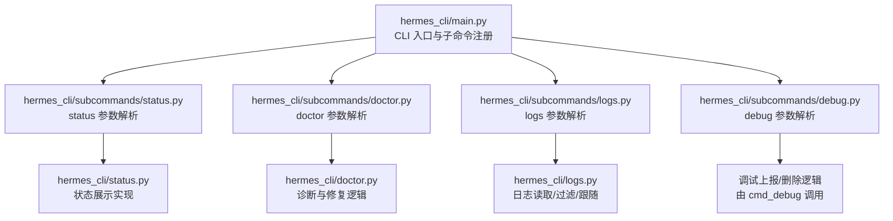
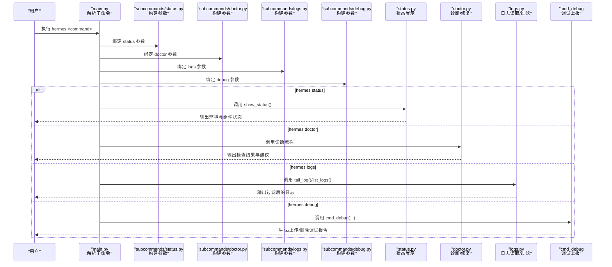
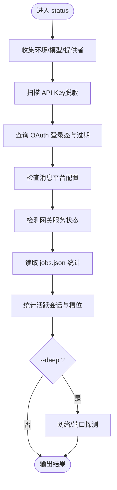
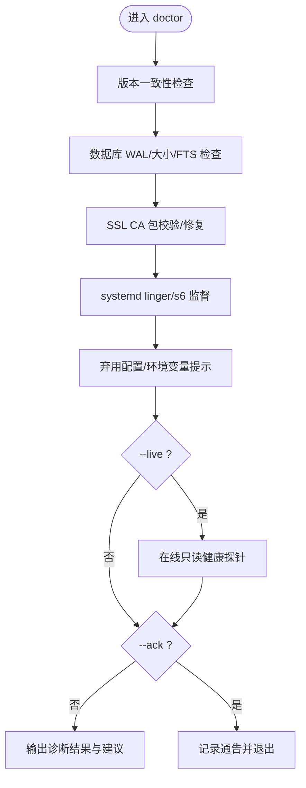
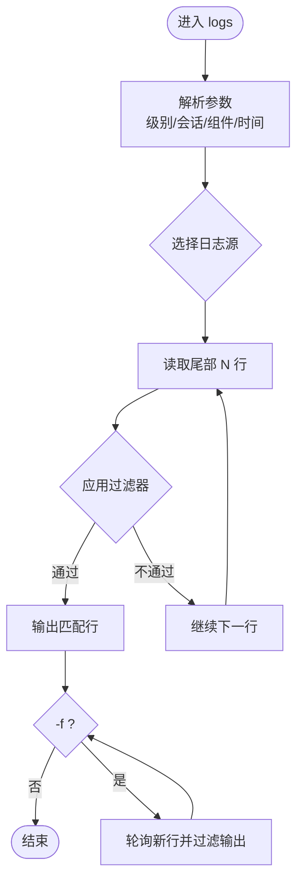
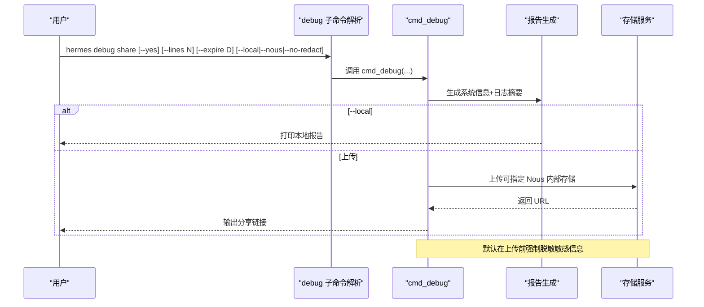
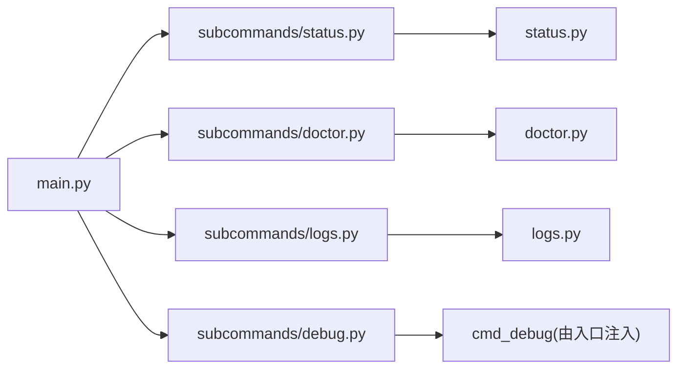

# 实用工具命令

<cite>
**本文引用的文件**
- [hermes_cli/main.py](file://hermes_cli/main.py)
- [hermes_cli/commands.py](file://hermes_cli/commands.py)
- [hermes_cli/subcommands/status.py](file://hermes_cli/subcommands/status.py)
- [hermes_cli/status.py](file://hermes_cli/status.py)
- [hermes_cli/subcommands/doctor.py](file://hermes_cli/subcommands/doctor.py)
- [hermes_cli/doctor.py](file://hermes_cli/doctor.py)
- [hermes_cli/subcommands/logs.py](file://hermes_cli/subcommands/logs.py)
- [hermes_cli/logs.py](file://hermes_cli/logs.py)
- [hermes_cli/subcommands/debug.py](file://hermes_cli/subcommands/debug.py)
</cite>

## 目录
1. [简介](#简介)
2. [项目结构](#项目结构)
3. [核心组件](#核心组件)
4. [架构总览](#架构总览)
5. [详细组件分析](#详细组件分析)
6. [依赖关系分析](#依赖关系分析)
7. [性能注意事项](#性能注意事项)
8. [故障排查指南](#故障排查指南)
9. [结论](#结论)
10. [附录](#附录)

## 简介
本文件面向 Hermes Agent 的“实用工具命令”，聚焦诊断与维护场景，覆盖以下能力：
- 系统状态检查：hermes status（含 --all、--deep）
- 配置与依赖诊断：hermes doctor（含 --fix、--live、--ack）
- 日志查看与分析：hermes logs（支持级别过滤、会话过滤、时间范围、组件过滤、实时跟随）
- 调试与上报：hermes debug share/delete（本地或上传至公共/私有存储，支持脱敏与过期策略）

同时提供最佳实践建议与常见问题快速定位方法。

## 项目结构
Hermes CLI 的命令入口与子命令解析集中在主程序与各子命令模块中；具体诊断维护命令的实现位于 hermes_cli 下的对应模块。

图表来源
- [hermes_cli/main.py:439-485](file://hermes_cli/main.py#L439-L485)
- [hermes_cli/subcommands/status.py:12-28](file://hermes_cli/subcommands/status.py#L12-L28)
- [hermes_cli/subcommands/doctor.py:12-44](file://hermes_cli/subcommands/doctor.py#L12-L44)
- [hermes_cli/subcommands/logs.py:13-78](file://hermes_cli/subcommands/logs.py#L13-L78)
- [hermes_cli/subcommands/debug.py:13-100](file://hermes_cli/subcommands/debug.py#L13-L100)

章节来源
- [hermes_cli/main.py:439-485](file://hermes_cli/main.py#L439-L485)

## 核心组件
- 状态检查：hermes status
  - 显示环境、模型/提供者、API Key、OAuth 登录态、消息平台、网关服务、定时任务、会话占用等。
  - 可选深度检查：OpenRouter 可达性、端口占用探测等。
- 诊断修复：hermes doctor
  - 静态检查：安装方式、版本一致性、SQLite WAL 模式、证书包、systemd linger、已弃用配置/环境变量等。
  - 可选在线健康探针：--live 对部分后端进行只读连通性探测。
  - 自动修复：--fix 尝试修复证书包等问题。
  - 安全通告：--ack 确认某条安全通告并退出。
- 日志管理：hermes logs
  - 支持多日志源：agent/errors/gateway/gui/desktop/mcp。
  - 过滤：按级别、会话 ID、组件前缀、相对时间。
  - 实时跟随：-f。
- 调试上报：hermes debug
  - 打包最近日志与系统信息，上传到公共粘贴服务或 Nous 内部存储，支持行数控制、过期天数、是否脱敏、本地打印、删除已上传条目。

章节来源
- [hermes_cli/status.py:132-725](file://hermes_cli/status.py#L132-L725)
- [hermes_cli/doctor.py:305-800](file://hermes_cli/doctor.py#L305-L800)
- [hermes_cli/logs.py:1-398](file://hermes_cli/logs.py#L1-L398)
- [hermes_cli/subcommands/debug.py:13-100](file://hermes_cli/subcommands/debug.py#L13-L100)

## 架构总览
下图展示了从 CLI 入口到各诊断维护命令的调用路径与职责划分。

图表来源
- [hermes_cli/main.py:439-485](file://hermes_cli/main.py#L439-L485)
- [hermes_cli/subcommands/status.py:12-28](file://hermes_cli/subcommands/status.py#L12-L28)
- [hermes_cli/subcommands/doctor.py:12-44](file://hermes_cli/subcommands/doctor.py#L12-L44)
- [hermes_cli/subcommands/logs.py:13-78](file://hermes_cli/subcommands/logs.py#L13-L78)
- [hermes_cli/subcommands/debug.py:13-100](file://hermes_cli/subcommands/debug.py#L13-L100)

## 详细组件分析

### hermes status：系统状态检查
- 功能要点
  - 环境：项目路径、Python 版本、.env 存在性、当前模型与提供者。
  - API Key：常见提供商密钥是否存在（脱敏显示）。
  - OAuth：Nous Portal、OpenAI Codex、Qwen、MiniMax、xAI 等登录态与过期信息。
  - 消息平台：Telegram/Discord/WhatsApp/Slack 等 token 与 home channel。
  - 网关服务：运行状态、管理器类型、PID、服务与进程不一致提示。
  - 定时任务：jobs.json 统计。
  - 会话：活跃会话数、最近活动时间、并发槽位使用详情。
  - 深度检查（--deep）：OpenRouter 可达性、端口 18789 占用情况。
- 使用示例
  - 常规：hermes status
  - 全部细节（脱敏）：hermes status --all
  - 深度检查：hermes status --deep

图表来源
- [hermes_cli/status.py:132-725](file://hermes_cli/status.py#L132-L725)

章节来源
- [hermes_cli/status.py:132-725](file://hermes_cli/status.py#L132-L725)

### hermes doctor：配置与依赖诊断
- 功能要点
  - 版本一致性：pyproject.toml 与 hermes_cli.__version__ 对比。
  - SQLite 健康：WAL/rollback 模式、WAL 过大风险、数据库大小告警、优化建议。
  - SSL 证书包：验证与自动修复（--fix）。
  - systemd linger：Linux 下守护进程登出后存活问题提示。
  - s6 监督：容器内 s6 服务状态概览。
  - 弃用项：配置键与环境变量迁移建议。
  - 在线健康探针（--live）：对 Firecrawl/FAL/浏览器/MCP/TTS/STT 等进行只读连通性探测。
  - 安全通告（--ack）：确认指定通告 ID 并退出。
- 使用示例
  - 基础诊断：hermes doctor
  - 尝试自动修复：hermes doctor --fix
  - 加入在线探针：hermes doctor --live
  - 确认安全通告：hermes doctor --ack ADVISORY_ID

图表来源
- [hermes_cli/doctor.py:305-800](file://hermes_cli/doctor.py#L305-L800)
- [hermes_cli/subcommands/doctor.py:12-44](file://hermes_cli/subcommands/doctor.py#L12-L44)

章节来源
- [hermes_cli/subcommands/doctor.py:12-44](file://hermes_cli/subcommands/doctor.py#L12-L44)
- [hermes_cli/doctor.py:305-800](file://hermes_cli/doctor.py#L305-L800)

### hermes logs：日志管理与分析
- 功能要点
  - 日志源：agent/errors/gateway/gui/desktop/mcp。
  - 过滤：
    - 级别：--level（DEBUG/INFO/WARNING/ERROR/CRITICAL）
    - 会话：--session（子串匹配）
    - 组件：--component（基于 logger 名称前缀）
    - 时间：--since（如 1h、30m、2d）
  - 实时跟随：-f（Ctrl+C 停止）
  - 列表：hermes logs list 显示可用日志及大小/时间
- 使用示例
  - 查看最近 50 行：hermes logs
  - 实时跟随：hermes logs -f
  - 仅错误及以上：hermes logs --level ERROR
  - 按会话过滤：hermes logs --session abc123
  - 仅工具相关：hermes logs --component tools
  - 最近一小时：hermes logs --since 1h
  - 列表日志：hermes logs list

图表来源
- [hermes_cli/logs.py:1-398](file://hermes_cli/logs.py#L1-L398)
- [hermes_cli/subcommands/logs.py:13-78](file://hermes_cli/subcommands/logs.py#L13-L78)

章节来源
- [hermes_cli/subcommands/logs.py:13-78](file://hermes_cli/subcommands/logs.py#L13-L78)
- [hermes_cli/logs.py:1-398](file://hermes_cli/logs.py#L1-L398)

### hermes debug：调试与上报
- 功能要点
  - 打包系统信息与近期日志，支持：
    - 上传到公共粘贴服务或 Nous 内部存储（--nous）
    - 控制包含的行数（--lines）
    - 设置过期天数（--expire）
    - 本地打印而非上传（--local）
    - 关闭上传时脱敏（--no-redact，默认会强制脱敏）
    - 跳过交互式确认（--yes，用于脚本/CI）
  - 删除已上传条目：hermes debug delete <url>
- 使用示例
  - 交互式上传：hermes debug share
  - 非交互上传：hermes debug share --yes
  - 更多日志行：hermes debug share --lines 500
  - 延长保留期：hermes debug share --expire 30
  - 仅本地打印：hermes debug share --local
  - 关闭脱敏：hermes debug share --no-redact
  - 私有存储：hermes debug share --nous
  - 删除：hermes debug delete https://paste.rs/abc123

图表来源
- [hermes_cli/subcommands/debug.py:13-100](file://hermes_cli/subcommands/debug.py#L13-L100)

章节来源
- [hermes_cli/subcommands/debug.py:13-100](file://hermes_cli/subcommands/debug.py#L13-L100)

## 依赖关系分析
- 入口与路由
  - main.py 负责导入并注册各子命令解析器（status/doctor/logs/debug 等），并将 func 指向对应处理函数。
- 命令定义
  - commands.py 集中定义斜杠命令注册表，便于帮助、自动补全与网关分发；与 CLI 子命令互补。
- 子命令与实现
  - subcommands/* 仅负责参数解析与绑定处理函数；实际逻辑在 hermes_cli/status.py、doctor.py、logs.py 等模块。

图表来源
- [hermes_cli/main.py:439-485](file://hermes_cli/main.py#L439-L485)
- [hermes_cli/subcommands/status.py:12-28](file://hermes_cli/subcommands/status.py#L12-L28)
- [hermes_cli/subcommands/doctor.py:12-44](file://hermes_cli/subcommands/doctor.py#L12-L44)
- [hermes_cli/subcommands/logs.py:13-78](file://hermes_cli/subcommands/logs.py#L13-L78)
- [hermes_cli/subcommands/debug.py:13-100](file://hermes_cli/subcommands/debug.py#L13-L100)

章节来源
- [hermes_cli/main.py:439-485](file://hermes_cli/main.py#L439-L485)

## 性能注意事项
- 日志过滤
  - 启用过滤时会读取更多原始行以确保足够匹配结果，大文件采用分段回读策略，避免一次性加载。
- 深度检查
  - --deep 会发起网络请求与端口探测，建议在需要时再开启。
- 在线探针
  - doctor --live 会对多个后端发起只读连通性探测，可能产生网络开销，按需使用。
- 并发与资源
  - 状态检查中的会话槽位统计与数据库读取为轻量操作，但频繁调用仍应合理间隔。

[本节为通用指导，无需特定文件引用]

## 故障排查指南
- 无法查看日志
  - 现象：提示日志文件不存在
  - 原因：尚未运行过 Hermes，日志未生成
  - 解决：先运行一次聊天或网关以生成日志，再使用 hermes logs
- 级别/组件过滤无效
  - 现象：无输出或输出不符合预期
  - 原因：级别字符串非法或组件名不在已知前缀集合
  - 解决：使用 DEBUG/INFO/WARNING/ERROR/CRITICAL；组件名需来自 COMPONENT_PREFIXES 映射
- 在线探针失败
  - 现象：doctor --live 显示不可达
  - 原因：网络限制、代理配置、凭据缺失
  - 解决：检查网络与代理、确保必要环境变量已设置
- 证书包损坏
  - 现象：HTTPS 请求失败
  - 解决：运行 hermes doctor --fix 自动修复；或手动重装 certifi
- 会话槽位耗尽
  - 现象：新会话被拒绝
  - 解决：通过 hermes status 查看槽位占用，释放空闲会话或调整并发上限

章节来源
- [hermes_cli/logs.py:174-207](file://hermes_cli/logs.py#L174-L207)
- [hermes_cli/doctor.py:646-730](file://hermes_cli/doctor.py#L646-L730)
- [hermes_cli/status.py:650-683](file://hermes_cli/status.py#L650-L683)

## 结论
- hermes status 适合快速了解系统整体健康与配置现状。
- hermes doctor 提供全面的静态检查与可选在线探针，支持自动修复与安全通告确认。
- hermes logs 提供灵活的日志过滤与实时跟踪，便于定位问题。
- hermes debug 便于收集与共享诊断材料，支持本地与私有存储方案。
建议将上述命令纳入日常巡检与排障流程，结合定期健康检查与性能监控，提升系统稳定性与可观测性。

[本节为总结性内容，无需特定文件引用]

## 附录
- 常用组合
  - 快速健康检查：hermes status --deep
  - 完整诊断：hermes doctor --live
  - 实时排障：hermes logs -f --level WARNING --component gateway
  - 收集问题材料：hermes debug share --yes --lines 500 --expire 14

[本节为补充说明，无需特定文件引用]