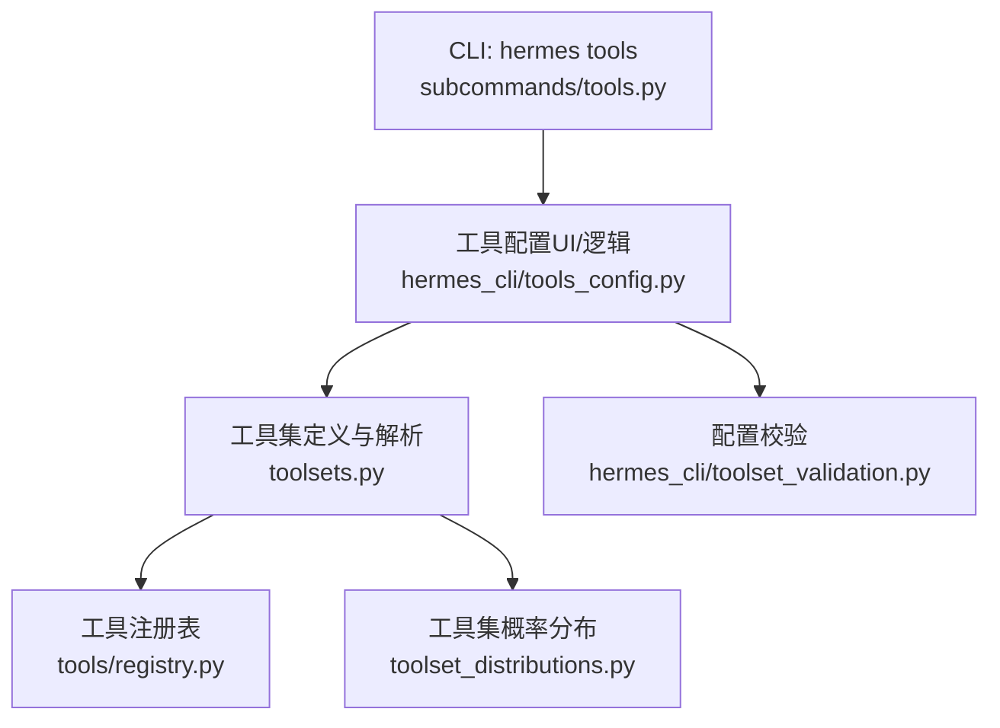
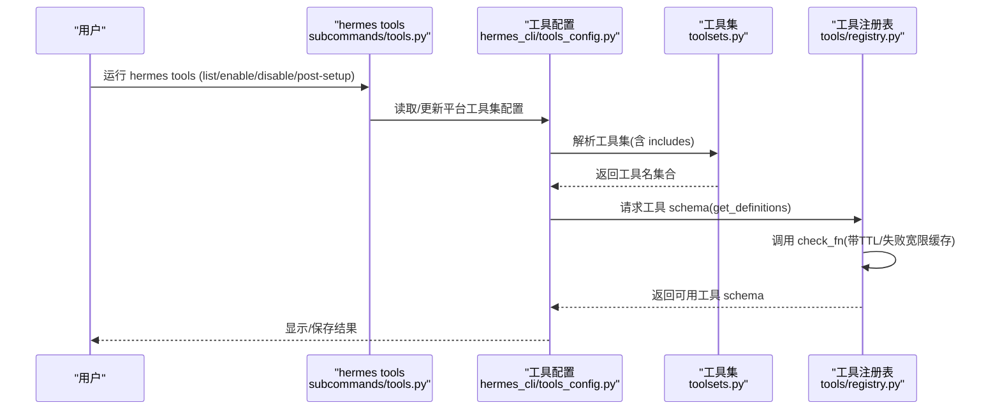
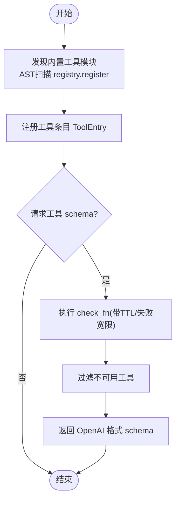
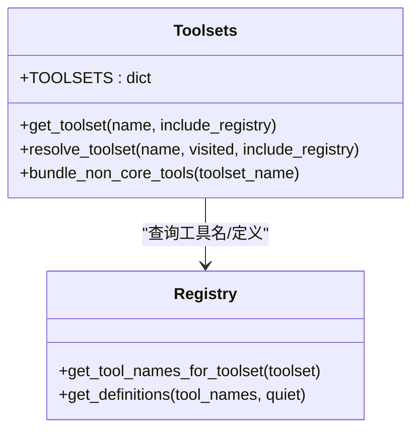
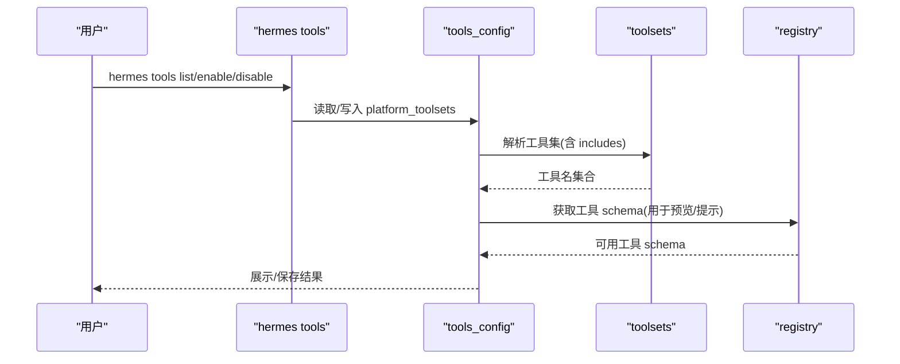
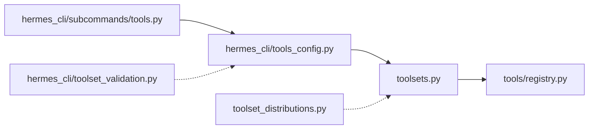

# 工具管理

<cite>
**本文引用的文件**
- [toolsets.py](file://toolsets.py)
- [hermes_cli/tools_config.py](file://hermes_cli/tools_config.py)
- [hermes_cli/toolset_validation.py](file://hermes_cli/toolset_validation.py)
- [tools/registry.py](file://tools/registry.py)
- [hermes_cli/subcommands/tools.py](file://hermes_cli/subcommands/tools.py)
- [toolset_distributions.py](file://toolset_distributions.py)
</cite>

## 目录
1. [简介](#简介)
2. [项目结构](#项目结构)
3. [核心组件](#核心组件)
4. [架构总览](#架构总览)
5. [详细组件分析](#详细组件分析)
6. [依赖关系分析](#依赖关系分析)
7. [性能考虑](#性能考虑)
8. [故障排查指南](#故障排查指南)
9. [结论](#结论)
10. [附录](#附录)

## 简介
本文件系统性说明 Hermes Agent 的工具管理能力，覆盖工具的发现、安装、配置与验证；解释 hermes tools 子命令的功能（列表查看、启用/禁用、依赖检查、权限与安全）；介绍内置工具与自定义工具的管理方式；阐述工具集（toolsets）的概念、组合与分发策略；说明安全沙箱与执行环境隔离机制；提供工具开发指南（接口规范、调试与测试）；并给出性能监控与故障诊断方法。

## 项目结构
围绕“工具管理”的关键模块分布如下：
- 工具注册与发现：tools/registry.py
- 工具集定义与解析：toolsets.py
- CLI 工具配置与交互：hermes_cli/tools_config.py、hermes_cli/subcommands/tools.py
- 配置校验：hermes_cli/toolset_validation.py
- 工具集概率分布（用于数据生成/评测）：toolset_distributions.py

图表来源
- [hermes_cli/subcommands/tools.py:12-95](file://hermes_cli/subcommands/tools.py#L12-L95)
- [hermes_cli/tools_config.py:91-124](file://hermes_cli/tools_config.py#L91-L124)
- [toolsets.py:101-640](file://toolsets.py#L101-L640)
- [tools/registry.py:414-764](file://tools/registry.py#L414-L764)
- [hermes_cli/toolset_validation.py:18-74](file://hermes_cli/toolset_validation.py#L18-L74)
- [toolset_distributions.py:27-214](file://toolset_distributions.py#L27-L214)

章节来源
- [hermes_cli/subcommands/tools.py:12-95](file://hermes_cli/subcommands/tools.py#L12-L95)
- [hermes_cli/tools_config.py:91-124](file://hermes_cli/tools_config.py#L91-L124)
- [toolsets.py:101-640](file://toolsets.py#L101-L640)
- [tools/registry.py:414-764](file://tools/registry.py#L414-L764)
- [hermes_cli/toolset_validation.py:18-74](file://hermes_cli/toolset_validation.py#L18-L74)
- [toolset_distributions.py:27-214](file://toolset_distributions.py#L27-L214)

## 核心组件
- 工具注册表（Registry）
  - 负责工具元数据、处理器、可用性检查（check_fn）、动态 schema 覆盖、并发安全的注册/查询/分发。
  - 提供 discover_builtin_tools 自动发现自注册工具模块；提供 get_definitions 输出模型可用的工具 schema。
- 工具集（Toolsets）
  - 将工具按场景分组（如 web、browser、terminal、coding 等），支持包含其他工具集的组合式定义。
  - 提供 resolve_toolset 递归展开工具集，get_toolset 获取定义并可合并插件注册的工具。
- CLI 工具配置
  - 提供交互式与命令行方式启用/禁用工具集，处理 provider 配置与 post-setup 钩子。
  - 维护平台维度的工具集开关，保存至配置文件。
- 配置校验
  - 校验 platform_toolsets 中的工具集名称是否有效，避免“零工具”静默降级。
- 工具集分布
  - 为批量任务或评测提供概率化的工具集采样策略。

章节来源
- [tools/registry.py:108-159](file://tools/registry.py#L108-L159)
- [tools/registry.py:201-230](file://tools/registry.py#L201-L230)
- [tools/registry.py:414-764](file://tools/registry.py#L414-L764)
- [toolsets.py:101-640](file://toolsets.py#L101-L640)
- [toolsets.py:644-800](file://toolsets.py#L644-L800)
- [hermes_cli/tools_config.py:91-124](file://hermes_cli/tools_config.py#L91-L124)
- [hermes_cli/toolset_validation.py:18-74](file://hermes_cli/toolset_validation.py#L18-L74)
- [toolset_distributions.py:27-214](file://toolset_distributions.py#L27-L214)

## 架构总览
下图展示从 CLI 到工具注册表的完整链路：用户通过 hermes tools 选择/启用工具集，系统解析工具集并查询注册表，结合 check_fn 的可用性缓存，最终生成模型可用的工具 schema。

图表来源
- [hermes_cli/subcommands/tools.py:12-95](file://hermes_cli/subcommands/tools.py#L12-L95)
- [hermes_cli/tools_config.py:91-124](file://hermes_cli/tools_config.py#L91-L124)
- [toolsets.py:644-800](file://toolsets.py#L644-L800)
- [tools/registry.py:717-764](file://tools/registry.py#L717-L764)

## 详细组件分析

### 工具注册表（Registry）
- 功能要点
  - 自动发现内置工具模块（基于 AST 扫描 registry.register 调用）。
  - 工具条目 ToolEntry 记录 name、toolset、schema、handler、check_fn、requires_env、is_async、描述、emoji、最大结果大小、动态 schema 覆盖。
  - check_fn 缓存：TTL 约 30 秒，失败宽限窗口约 60 秒，避免外部状态抖动导致工具突然不可用。
  - 并发安全：读写锁 + 快照机制，支持 MCP 动态刷新。
  - 提供 get_definitions 过滤出当前可用的工具 schema。
- 关键流程
  - 启动时导入工具模块完成注册。
  - 运行时根据工具集名与 check_fn 结果生成 schema。
  - 支持插件覆盖内置工具（需显式授权）。

图表来源
- [tools/registry.py:108-159](file://tools/registry.py#L108-L159)
- [tools/registry.py:201-230](file://tools/registry.py#L201-L230)
- [tools/registry.py:233-380](file://tools/registry.py#L233-L380)
- [tools/registry.py:717-764](file://tools/registry.py#L717-L764)

章节来源
- [tools/registry.py:108-159](file://tools/registry.py#L108-L159)
- [tools/registry.py:201-230](file://tools/registry.py#L201-L230)
- [tools/registry.py:233-380](file://tools/registry.py#L233-L380)
- [tools/registry.py:414-764](file://tools/registry.py#L414-L764)

### 工具集（Toolsets）
- 概念
  - 工具集是对工具的分类与组合，便于按场景启用（如 web、browser、terminal、coding、hermes-cli 等）。
  - 支持 includes 组合多个工具集，resolve_toolset 递归展开去重。
  - 支持 include_registry 合并插件注册的工具，使扩展工具可无缝加入现有工具集。
- 内置与平台工具集
  - 内置基础工具集：web、search、vision、image_gen、video_gen、bfl、computer_use、terminal、skills、browser、cronjob、file、tts、todo、memory、context_engine、session_search、project、desktop_ui、clarify、code_execution、delegation、homeassistant、kanban、discord、yuanbao、feishu_doc、feishu_drive、spotify 等。
  - 平台工具集：hermes-cli、hermes-cron、hermes-telegram、hermes-discord、hermes-whatsapp、hermes-slack、hermes-signal、hermes-bluebubbles、hermes-homeassistant、hermes-email、hermes-mattermost、hermes-matrix、hermes-dingtalk、hermes-feishu、hermes-weixin、hermes-qqbot、hermes-wecom、hermes-wecom-callback、hermes-yuanbao、hermes-sms、hermes-webhook、hermes-gateway 等。
- 使用方式
  - 通过 hermes tools 启用/禁用工具集。
  - 通过 resolve_toolset 获取最终工具名列表。
  - 通过 bundle_non_core_tools 计算平台包的非核心增量工具，便于禁用某平台包时保留核心工具。

图表来源
- [toolsets.py:101-640](file://toolsets.py#L101-L640)
- [toolsets.py:644-800](file://toolsets.py#L644-L800)
- [tools/registry.py:476-485](file://tools/registry.py#L476-L485)
- [tools/registry.py:717-764](file://tools/registry.py#L717-L764)

章节来源
- [toolsets.py:101-640](file://toolsets.py#L101-L640)
- [toolsets.py:644-800](file://toolsets.py#L644-L800)

### CLI 工具配置（hermes tools）
- 子命令
  - list [--platform]：列出所有工具及其启用状态。
  - enable <name...> [--platform]：启用工具集或 MCP 工具。
  - disable <name...> [--platform]：禁用工具集或 MCP 工具。
  - post-setup <key>：运行后端所需的 post-setup 安装钩子（如浏览器、cua-driver、KittenTTS/Piper、Spotify、Langfuse、xAI 等）。
- 配置流程
  - 选择平台 → 勾选/取消工具集 → 对需要 API Key 的工具进行 provider 配置 → 保存至配置文件。
  - 默认关闭的工具集包括 homeassistant、spotify、discord、discord_admin、video、video_gen、x_search、a2a 等。
  - 支持平台限制的工具集（如 discord_admin 仅对 discord 平台可见）。
  - 支持插件工具集追加到清单末尾，避免重复键。

图表来源
- [hermes_cli/subcommands/tools.py:12-95](file://hermes_cli/subcommands/tools.py#L12-L95)
- [hermes_cli/tools_config.py:91-124](file://hermes_cli/tools_config.py#L91-L124)
- [toolsets.py:644-800](file://toolsets.py#L644-L800)
- [tools/registry.py:717-764](file://tools/registry.py#L717-L764)

章节来源
- [hermes_cli/subcommands/tools.py:12-95](file://hermes_cli/subcommands/tools.py#L12-L95)
- [hermes_cli/tools_config.py:91-124](file://hermes_cli/tools_config.py#L91-L124)

### 配置校验（toolset_validation）
- 目的
  - 防止因配置迁移错误导致 toolset 名称无效，进而出现“零工具”静默降级。
- 行为
  - 校验 platform_toolsets 中每个平台的工具集名称是否有效。
  - 若全部无效，给出明确警告并建议重新运行 hermes tools 配置。
  - 当检测到类似 hermes 而非 hermes-cli 的错误时，给出修正建议。

章节来源
- [hermes_cli/toolset_validation.py:18-74](file://hermes_cli/toolset_validation.py#L18-L74)

### 工具集分布（toolset_distributions）
- 用途
  - 在批量数据处理或评测场景中，按概率随机启用不同工具集，模拟真实工作负载。
- 能力
  - 预置多种分布（default、research、development、safe、balanced、minimal、terminal_only、terminal_web、creative、reasoning、browser_use、browser_only、browser_tasks、terminal_tasks、mixed_tasks）。
  - sample_toolsets_from_distribution 按概率采样工具集，保证至少选中一个工具集。

章节来源
- [toolset_distributions.py:27-214](file://toolset_distributions.py#L27-L214)
- [toolset_distributions.py:241-282](file://toolset_distributions.py#L241-L282)

## 依赖关系分析
- 低耦合设计
  - CLI 层只负责参数解析与交互，不直接持有工具实现。
  - 工具集层专注组合与解析，不关心具体工具实现。
  - 注册表集中管理工具元数据与可用性检查，屏蔽底层差异。
- 关键依赖链
  - hermes tools → tools_config → toolsets → registry
  - toolset_validation 独立于 registry，便于单元测试。
  - distributions 依赖 toolsets.validate_toolset 做合法性校验。

图表来源
- [hermes_cli/subcommands/tools.py:12-95](file://hermes_cli/subcommands/tools.py#L12-L95)
- [hermes_cli/tools_config.py:91-124](file://hermes_cli/tools_config.py#L91-L124)
- [toolsets.py:644-800](file://toolsets.py#L644-L800)
- [tools/registry.py:414-764](file://tools/registry.py#L414-L764)
- [hermes_cli/toolset_validation.py:18-74](file://hermes_cli/toolset_validation.py#L18-L74)
- [toolset_distributions.py:241-282](file://toolset_distributions.py#L241-L282)

章节来源
- [hermes_cli/subcommands/tools.py:12-95](file://hermes_cli/subcommands/tools.py#L12-L95)
- [hermes_cli/tools_config.py:91-124](file://hermes_cli/tools_config.py#L91-L124)
- [toolsets.py:644-800](file://toolsets.py#L644-L800)
- [tools/registry.py:414-764](file://tools/registry.py#L414-L764)
- [hermes_cli/toolset_validation.py:18-74](file://hermes_cli/toolset_validation.py#L18-L74)
- [toolset_distributions.py:241-282](file://toolset_distributions.py#L241-L282)

## 性能考虑
- check_fn 缓存
  - TTL 约 30 秒，失败宽限约 60 秒，减少频繁探测外部状态（Docker、Playwright、网络等）带来的开销与抖动。
- 工具发现缓存
  - 基于文件 mtime+size 的发现缓存，降低启动时 AST 扫描成本。
- 并发安全
  - 注册表使用读写锁与快照，避免 MCP 动态刷新期间的竞态。
- 结果大小限制
  - 工具错误体有上限，避免异常信息过大影响上下文。

章节来源
- [tools/registry.py:233-380](file://tools/registry.py#L233-L380)
- [tools/registry.py:108-159](file://tools/registry.py#L108-L159)
- [tools/registry.py:717-764](file://tools/registry.py#L717-L764)

## 故障排查指南
- 常见症状
  - 工具突然不可用：可能是 check_fn 失败（外部依赖不可用），但会在失败宽限内继续可用。
  - 工具列表为空：检查 platform_toolsets 是否包含无效工具集名称，或全部被禁用。
- 排查步骤
  - 运行 hermes tools list --platform <平台> 查看当前启用状态。
  - 运行 hermes tools enable/disable 调整工具集。
  - 对需要后端的工具运行 hermes tools post-setup <key> 完成安装。
  - 检查日志中关于 check_fn 失败的警告，确认外部依赖恢复。
- 配置校验
  - 若 platform_toolsets 全无效，会收到明确警告并建议重新配置。

章节来源
- [tools/registry.py:233-380](file://tools/registry.py#L233-L380)
- [hermes_cli/toolset_validation.py:18-74](file://hermes_cli/toolset_validation.py#L18-L74)
- [hermes_cli/subcommands/tools.py:12-95](file://hermes_cli/subcommands/tools.py#L12-L95)

## 结论
Hermes Agent 的工具管理以“注册表 + 工具集 + CLI 配置”为核心，实现了灵活、可扩展且安全的工具编排。通过 check_fn 缓存与失败宽限提升稳定性，通过工具集组合与平台化配置满足多样化场景，通过 CLI 与 post-setup 简化安装与运维。配合工具集分布，可在批量任务中模拟真实工具使用模式。

## 附录

### 工具发现、安装、配置与验证流程
- 发现
  - 启动时自动扫描 tools/*.py，识别自注册工具模块并完成注册。
- 安装
  - 对需要额外依赖的工具，通过 hermes tools post-setup <key> 安装后端（浏览器、cua-driver、TTS 等）。
- 配置
  - 使用 hermes tools 选择平台与工具集，必要时配置 provider 与 API Key。
- 验证
  - 通过 hermes tools list 查看启用状态；通过 get_definitions 获取可用工具 schema；通过 toolset_validation 校验配置有效性。

章节来源
- [tools/registry.py:108-159](file://tools/registry.py#L108-L159)
- [hermes_cli/subcommands/tools.py:12-95](file://hermes_cli/subcommands/tools.py#L12-L95)
- [hermes_cli/tools_config.py:91-124](file://hermes_cli/tools_config.py#L91-L124)
- [hermes_cli/toolset_validation.py:18-74](file://hermes_cli/toolset_validation.py#L18-L74)

### 内置工具与自定义工具管理
- 内置工具
  - 通过 tools/*.py 自注册，统一由 registry 管理。
- 自定义工具
  - 可通过插件机制注册新工具或覆盖内置工具（需显式授权），并加入相应工具集。
  - 工具集可通过 includes 组合，或通过 get_toolset(include_registry=True) 合并插件工具。

章节来源
- [tools/registry.py:562-644](file://tools/registry.py#L562-L644)
- [toolsets.py:644-714](file://toolsets.py#L644-L714)

### 工具集（toolsets）概念与使用
- 概念
  - 工具集是按场景划分的工具集合，支持组合与平台化配置。
- 使用
  - 通过 hermes tools 启用/禁用；通过 resolve_toolset 获取最终工具名；通过 bundle_non_core_tools 计算平台包增量。

章节来源
- [toolsets.py:101-640](file://toolsets.py#L101-L640)
- [toolsets.py:644-800](file://toolsets.py#L644-L800)

### 安全沙箱与执行环境隔离
- 安全策略
  - 工具通过 check_fn 控制可用性，避免在不满足条件时暴露危险能力。
  - 部分工具集（如 webhook）默认受限，避免本地执行风险。
  - 桌面 GUI 相关工具仅在 GUI 会话中启用，避免远程误用。
- 执行环境
  - 终端与进程工具支持多后端（本地、容器、云端），通过环境变量与配置隔离执行环境。
  - cua-driver 后台控制桌面，不抢占焦点，保障安全性。

章节来源
- [toolsets.py:30-98](file://toolsets.py#L30-L98)
- [toolsets.py:262-279](file://toolsets.py#L262-L279)
- [toolsets.py:179-187](file://toolsets.py#L179-L187)

### 工具开发指南
- 接口规范
  - 在工具模块顶层调用 registry.register 声明 schema、handler、toolset、check_fn、requires_env、is_async、描述、emoji、最大结果大小、动态 schema 覆盖。
- 调试方法
  - 使用 hermes tools list 验证工具是否可用；查看日志中 check_fn 警告；通过 get_definitions 检查 schema。
- 测试策略
  - 针对 check_fn 编写单元测试，覆盖成功与失败路径；验证工具集组合与平台限制；使用 toolset_validation 校验配置。

章节来源
- [tools/registry.py:201-230](file://tools/registry.py#L201-L230)
- [tools/registry.py:562-644](file://tools/registry.py#L562-L644)
- [tools/registry.py:717-764](file://tools/registry.py#L717-L764)
- [hermes_cli/toolset_validation.py:18-74](file://hermes_cli/toolset_validation.py#L18-L74)

### 性能监控与故障诊断
- 监控点
  - check_fn 缓存命中率与失效时间；工具发现缓存命中情况；工具 schema 生成耗时。
- 诊断
  - 关注日志中 check_fn 失败与工具不可用的警告；使用 hermes tools list 快速定位问题；对后端依赖执行 post-setup 修复。

章节来源
- [tools/registry.py:233-380](file://tools/registry.py#L233-L380)
- [tools/registry.py:108-159](file://tools/registry.py#L108-L159)
- [hermes_cli/subcommands/tools.py:12-95](file://hermes_cli/subcommands/tools.py#L12-L95)