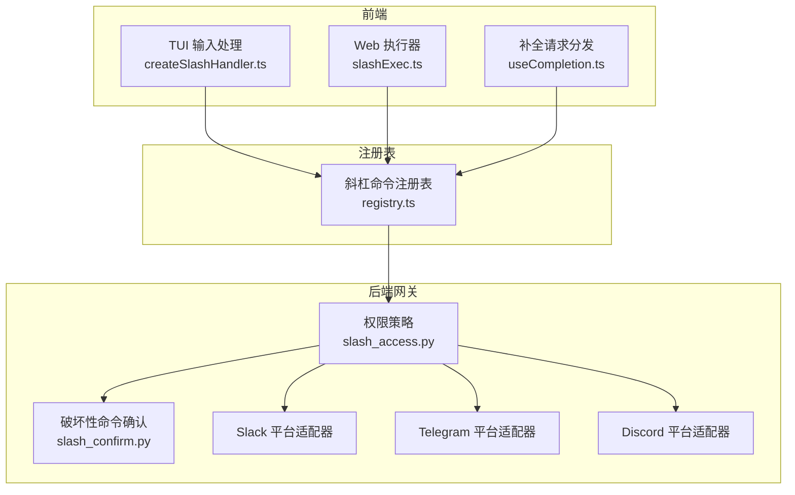
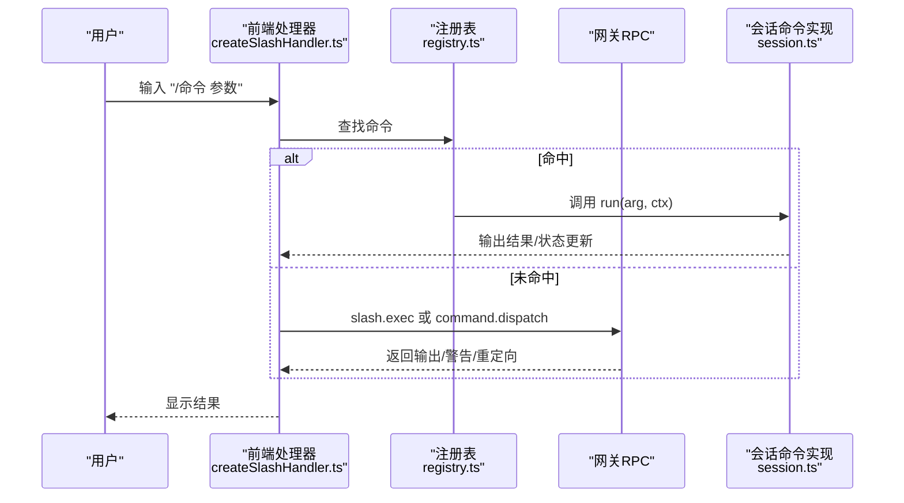
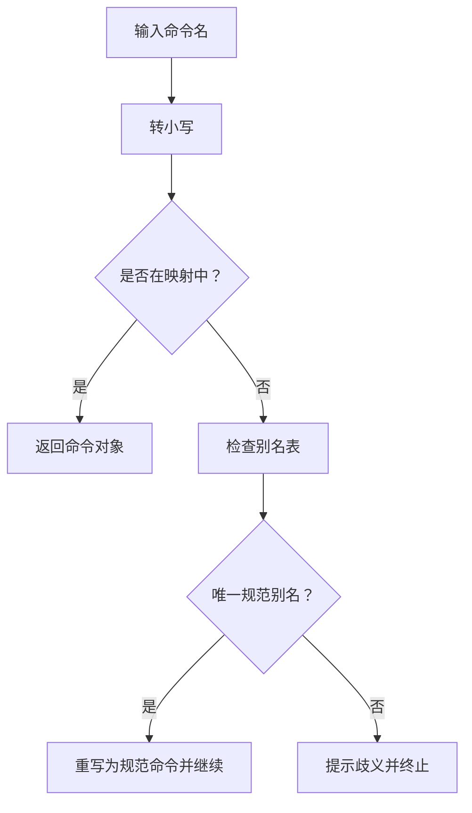
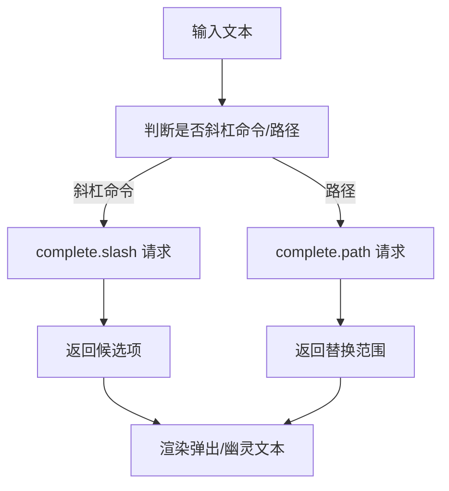
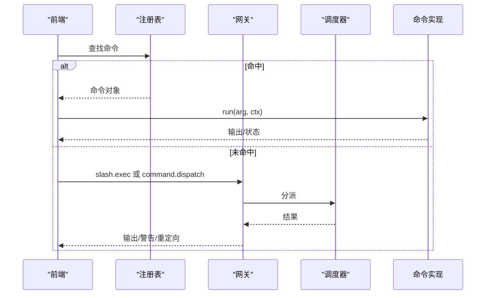
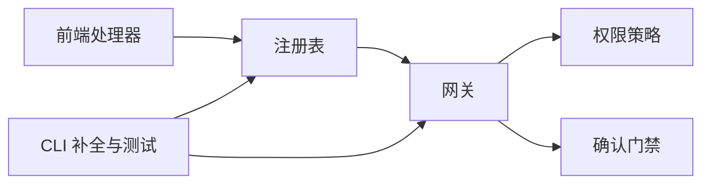

# 斜杠命令参考

<cite>
**本文引用的文件**
- [ui-tui/src/app/createSlashHandler.ts](file://ui-tui/src/app/createSlashHandler.ts)
- [web/src/lib/slashExec.ts](file://web/src/lib/slashExec.ts)
- [ui-tui/src/app/slash/registry.ts](file://ui-tui/src/app/slash/registry.ts)
- [ui-tui/src/app/slash/commands/session.ts](file://ui-tui/src/app/slash/commands/session.ts)
- [ui-tui/src/hooks/useCompletion.ts](file://ui-tui/src/hooks/useCompletion.ts)
- [website/docs/reference/slash-commands.md](file://website/docs/reference/slash-commands.md)
- [website/docs/user-guide/messaging/index.md](file://website/docs/user-guide/messaging/index.md)
- [tests/hermes_cli/test_commands.py](file://tests/hermes_cli/test_commands.py)
- [tests/gateway/test_slack.py](file://tests/gateway/test_slack.py)
- [tests/gateway/test_discord_slash_auth.py](file://tests/gateway/test_discord_slash_auth.py)
- [tests/gateway/test_destructive_slash_confirm.py](file://tests/gateway/test_destructive_slash_confirm.py)
- [tests/gateway/test_approve_deny_commands.py](file://tests/gateway/test_approve_deny_commands.py)
- [hermes_cli/_parser.py](file://hermes_cli/_parser.py)
- [hermes_cli/completion.py](file://hermes_cli/completion.py)
- [gateway/slash_access.py](file://gateway/slash_access.py)
- [tools/slash_confirm.py](file://tools/slash_confirm.py)
- [gateway/platforms/slack.py](file://gateway/platforms/slack.py)
- [gateway/platforms/telegram.py](file://gateway/platforms/telegram.py)
- [gateway/platforms/discord.py](file://gateway/platforms/discord.py)
</cite>

## 目录
1. [简介](#简介)
2. [项目结构](#项目结构)
3. [核心组件](#核心组件)
4. [架构总览](#架构总览)
5. [详细组件分析](#详细组件分析)
6. [依赖关系分析](#依赖关系分析)
7. [性能考量](#性能考量)
8. [故障排除指南](#故障排除指南)
9. [结论](#结论)
10. [附录](#附录)

## 简介
本参考手册系统梳理 Hermes Agent 的斜杠命令体系，覆盖交互式 CLI、Web 界面与多平台消息网关中的命令行为。内容包括：
- 命令清单与语法说明（含别名、参数、子命令）
- 执行时机与上下文要求
- 自动补全与智能提示机制
- 组合使用与工作流建议
- 历史版本与废弃命令迁移
- 安全限制与权限控制
- 调试与故障排除方法

## 项目结构
斜杠命令在前端（TUI/Web）、CLI 与后端网关之间形成分层协作：
- 前端负责输入解析、自动补全、回显与会话状态更新
- CLI 提供本地命令行能力与补全策略
- 网关负责跨平台授权、确认门禁与消息路由

图表来源
- [ui-tui/src/app/createSlashHandler.ts:39-84](file://ui-tui/src/app/createSlashHandler.ts#L39-L84)
- [web/src/lib/slashExec.ts:76-129](file://web/src/lib/slashExec.ts#L76-L129)
- [ui-tui/src/hooks/useCompletion.ts:11-40](file://ui-tui/src/hooks/useCompletion.ts#L11-L40)
- [ui-tui/src/app/slash/registry.ts:1-20](file://ui-tui/src/app/slash/registry.ts#L1-L20)
- [gateway/slash_access.py](file://gateway/slash_access.py)
- [tools/slash_confirm.py](file://tools/slash_confirm.py)
- [gateway/platforms/slack.py](file://gateway/platforms/slack.py)
- [gateway/platforms/telegram.py](file://gateway/platforms/telegram.py)
- [gateway/platforms/discord.py](file://gateway/platforms/discord.py)

章节来源
- [ui-tui/src/app/createSlashHandler.ts:39-84](file://ui-tui/src/app/createSlashHandler.ts#L39-L84)
- [web/src/lib/slashExec.ts:76-129](file://web/src/lib/slashExec.ts#L76-L129)
- [ui-tui/src/hooks/useCompletion.ts:11-40](file://ui-tui/src/hooks/useCompletion.ts#L11-L40)
- [ui-tui/src/app/slash/registry.ts:1-20](file://ui-tui/src/app/slash/registry.ts#L1-L20)

## 核心组件
- 命令注册与查找：通过集中注册表聚合核心、会话、运维、设置与调试命令，并支持大小写不敏感的按名查找与别名映射。
- 前端执行链路：TUI/Web 将斜杠命令交由注册表匹配，未命中时回退到网关 RPC；同时支持别名规范化与歧义提示。
- 补全与提示：根据输入类型选择“斜杠命令补全”或“路径补全”，并提供智能提示与幽灵文本建议。
- 权限与确认：对高风险命令启用“破坏性命令确认”流程，结合平台级用户/角色/频道白名单进行授权。

章节来源
- [ui-tui/src/app/slash/registry.ts:1-20](file://ui-tui/src/app/slash/registry.ts#L1-L20)
- [ui-tui/src/app/createSlashHandler.ts:39-84](file://ui-tui/src/app/createSlashHandler.ts#L39-L84)
- [web/src/lib/slashExec.ts:76-129](file://web/src/lib/slashExec.ts#L76-L129)
- [ui-tui/src/hooks/useCompletion.ts:11-40](file://ui-tui/src/hooks/useCompletion.ts#L11-L40)

## 架构总览
斜杠命令从输入到执行的关键序列如下：

图表来源
- [ui-tui/src/app/createSlashHandler.ts:39-84](file://ui-tui/src/app/createSlashHandler.ts#L39-L84)
- [ui-tui/src/app/slash/registry.ts:1-20](file://ui-tui/src/app/slash/registry.ts#L1-L20)
- [ui-tui/src/app/slash/commands/session.ts:161-204](file://ui-tui/src/app/slash/commands/session.ts#L161-L204)
- [web/src/lib/slashExec.ts:76-129](file://web/src/lib/slashExec.ts#L76-L129)

## 详细组件分析

### 命令注册与查找
- 注册表聚合多类命令并建立名称到命令对象的映射，支持别名列表。
- 查找逻辑大小写不敏感，且可基于别名表进行规范化与歧义提示。

图表来源
- [ui-tui/src/app/slash/registry.ts:16-20](file://ui-tui/src/app/slash/registry.ts#L16-L20)
- [ui-tui/src/app/createSlashHandler.ts:48-75](file://ui-tui/src/app/createSlashHandler.ts#L48-L75)

章节来源
- [ui-tui/src/app/slash/registry.ts:1-20](file://ui-tui/src/app/slash/registry.ts#L1-L20)
- [ui-tui/src/app/createSlashHandler.ts:48-75](file://ui-tui/src/app/createSlashHandler.ts#L48-L75)

### 自动补全与智能提示
- 输入检测：识别以“/”开头的斜杠命令与绝对路径片段。
- 补全策略：
  - 对斜杠命令：调用“slash 补全”接口，返回候选项与替换范围。
  - 对路径：调用“路径补全”接口，支持幽灵文本建议。
- CLI 行为：精确匹配时添加尾随空格，部分匹配时不重复建议；支持子命令前缀过滤与隐藏。

图表来源
- [ui-tui/src/hooks/useCompletion.ts:11-40](file://ui-tui/src/hooks/useCompletion.ts#L11-L40)
- [tests/hermes_cli/test_commands.py:506-737](file://tests/hermes_cli/test_commands.py#L506-L737)

章节来源
- [ui-tui/src/hooks/useCompletion.ts:11-40](file://ui-tui/src/hooks/useCompletion.ts#L11-L40)
- [tests/hermes_cli/test_commands.py:506-737](file://tests/hermes_cli/test_commands.py#L506-L737)

### 命令执行与回退
- 命中注册表：直接调用命令实现，更新会话历史与 UI 状态。
- 未命中：通过网关 RPC 路由至“slash.exec”或“command.dispatch”，支持别名重定向与技能发送。

图表来源
- [ui-tui/src/app/createSlashHandler.ts:39-84](file://ui-tui/src/app/createSlashHandler.ts#L39-L84)
- [web/src/lib/slashExec.ts:76-129](file://web/src/lib/slashExec.ts#L76-L129)

章节来源
- [ui-tui/src/app/createSlashHandler.ts:39-84](file://ui-tui/src/app/createSlashHandler.ts#L39-L84)
- [web/src/lib/slashExec.ts:76-129](file://web/src/lib/slashExec.ts#L76-L129)

### 会话相关命令（核心）
以下命令在文档与测试中广泛出现，适用于 CLI、TUI 与消息平台：

- /new 或 /reset
  - 作用：新建会话（重置会话 ID 与历史），可选标题；支持跳过确认的标志位。
  - 上下文：需要网关运行与会话上下文。
  - 示例：/new my-experiment、/reset now、/new --yes my-experiment。
  - 参考：[website/docs/reference/slash-commands.md:35-61](file://website/docs/reference/slash-commands.md#L35-L61)

- /resume [name]
  - 作用：恢复之前命名的会话。
  - 示例：/resume my-session。
  - 参考：[website/docs/reference/slash-commands.md:54-55](file://website/docs/reference/slash-commands.md#L54-L55)

- /sessions（TUI 别名：/switch）
  - 作用：浏览与恢复历史会话；TUI 下打开实时会话切换器。
  - 参考：[website/docs/reference/slash-commands.md:55-56](file://website/docs/reference/slash-commands.md#L55-L56)

- /compress [focus 主题]
  - 作用：手动压缩对话上下文（刷新记忆并摘要）；可指定焦点主题。
  - 实现：调用会话压缩 RPC，更新转录与用量统计。
  - 参考：[ui-tui/src/app/slash/commands/session.ts:161-204](file://ui-tui/src/app/slash/commands/session.ts#L161-L204)

- /status
  - 作用：显示会话信息与本地“会话回顾”摘要（模型、提供商、配置、令牌统计、最近对话等）。
  - 参考：[website/docs/reference/slash-commands.md:57-58](file://website/docs/reference/slash-commands.md#L57-L58)

- /help
  - 作用：展示可用命令列表与简要描述。
  - 行为：CLI 中补全显示元数据为“描述”。
  - 参考：[tests/hermes_cli/test_commands.py:514-517](file://tests/hermes_cli/test_commands.py#L514-L517)

- /retry、/undo、/clear、/title、/history、/save、/stop、/queue、/steer、/goal、/subgoal、/agents、/background、/branch、/handoff、/snapshot、/rollback、/redraw
  - 作用与用法详见参考文档与测试用例。
  - 参考：[website/docs/reference/slash-commands.md:35-61](file://website/docs/reference/slash-commands.md#L35-L61)

章节来源
- [website/docs/reference/slash-commands.md:35-61](file://website/docs/reference/slash-commands.md#L35-L61)
- [ui-tui/src/app/slash/commands/session.ts:161-204](file://ui-tui/src/app/slash/commands/session.ts#L161-L204)
- [tests/hermes_cli/test_commands.py:514-517](file://tests/hermes_cli/test_commands.py#L514-L517)

### 消息平台命令（聊天内）
- /new、/reset、/model、/personality、/retry、/undo、/status、/whoami、/stop、/approve、/deny、/sethome、/compress、/title、/resume、/usage、/insights、/reasoning、/voice、/rollback、/background、/reload-mcp、/update、/help
- 说明：上述命令在消息平台（如 Slack、Telegram、Discord）中作为聊天内斜杠命令使用，支持权限控制与确认门禁。
- 参考：[website/docs/user-guide/messaging/index.md:132-160](file://website/docs/user-guide/messaging/index.md#L132-L160)

章节来源
- [website/docs/user-guide/messaging/index.md:132-160](file://website/docs/user-guide/messaging/index.md#L132-L160)

### 命令别名与规范化
- 前端在未命中注册表时，会尝试别名规范化与歧义提示，避免错误执行。
- 测试验证了别名映射与歧义提示的行为。
- 参考：[ui-tui/src/app/createSlashHandler.ts:48-75](file://ui-tui/src/app/createSlashHandler.ts#L48-L75)

章节来源
- [ui-tui/src/app/createSlashHandler.ts:48-75](file://ui-tui/src/app/createSlashHandler.ts#L48-L75)

### 命令组合与工作流
- 典型工作流示例（基于文档）：
  - 新建实验会话 → 设置目标与标题 → 使用 /background 后台执行任务 → 中途用 /steer 注入上下文 → 结束后用 /compress 压缩上下文 → 用 /snapshot 创建快照以便回溯。
- 参考：[website/docs/reference/slash-commands.md:35-61](file://website/docs/reference/slash-commands.md#L35-L61)

章节来源
- [website/docs/reference/slash-commands.md:35-61](file://website/docs/reference/slash-commands.md#L35-L61)

### 历史版本与废弃命令
- Slack 平台原生斜杠命令清单与保留命令限制：平台侧对内置命令有保留限制，应用注册不得超过上限并需排除保留项。
- 参考：[tests/hermes_cli/test_commands.py:314-337](file://tests/hermes_cli/test_commands.py#L314-L337)

章节来源
- [tests/hermes_cli/test_commands.py:314-337](file://tests/hermes_cli/test_commands.py#L314-L337)

### 安全限制与权限要求
- 权限策略：
  - 支持按来源（scope）解析策略，允许/禁止用户与命令集合，以及管理员用户集。
  - 当策略关闭时，统一视为管理员权限，保持向后兼容。
- 授权门禁：
  - 用户白名单、角色白名单、频道白名单等，确保命令仅在允许范围内执行。
- 破坏性命令确认：
  - 对高风险命令（如 /new）启用“确认门禁”，等待用户批准或取消。
- 参考：
  - [gateway/slash_access.py](file://gateway/slash_access.py)
  - [tests/gateway/test_discord_slash_auth.py:211-265](file://tests/gateway/test_discord_slash_auth.py#L211-L265)
  - [tests/gateway/test_destructive_slash_confirm.py:109-148](file://tests/gateway/test_destructive_slash_confirm.py#L109-L148)
  - [tests/gateway/test_approve_deny_commands.py](file://tests/gateway/test_approve_deny_commands.py)

章节来源
- [gateway/slash_access.py](file://gateway/slash_access.py)
- [tests/gateway/test_discord_slash_auth.py:211-265](file://tests/gateway/test_discord_slash_auth.py#L211-L265)
- [tests/gateway/test_destructive_slash_confirm.py:109-148](file://tests/gateway/test_destructive_slash_confirm.py#L109-L148)
- [tests/gateway/test_approve_deny_commands.py](file://tests/gateway/test_approve_deny_commands.py)

## 依赖关系分析
- 前端依赖注册表进行命令解析与别名规范化；未命中时回退到网关 RPC。
- 网关侧依赖权限策略与确认模块，保障命令安全执行。
- CLI 与测试用例共同定义补全与行为约束（如命令数量上限、别名唯一性、保留命令排除）。

图表来源
- [ui-tui/src/app/createSlashHandler.ts:39-84](file://ui-tui/src/app/createSlashHandler.ts#L39-L84)
- [ui-tui/src/app/slash/registry.ts:1-20](file://ui-tui/src/app/slash/registry.ts#L1-L20)
- [gateway/slash_access.py](file://gateway/slash_access.py)
- [tools/slash_confirm.py](file://tools/slash_confirm.py)
- [tests/hermes_cli/test_commands.py:309-337](file://tests/hermes_cli/test_commands.py#L309-L337)

章节来源
- [ui-tui/src/app/createSlashHandler.ts:39-84](file://ui-tui/src/app/createSlashHandler.ts#L39-L84)
- [ui-tui/src/app/slash/registry.ts:1-20](file://ui-tui/src/app/slash/registry.ts#L1-L20)
- [gateway/slash_access.py](file://gateway/slash_access.py)
- [tools/slash_confirm.py](file://tools/slash_confirm.py)
- [tests/hermes_cli/test_commands.py:309-337](file://tests/hermes_cli/test_commands.py#L309-L337)

## 性能考量
- 前端补全采用防抖与去重策略，避免频繁网络请求与渲染抖动。
- 命令执行优先走本地注册表，未命中再走网关 RPC，减少不必要的远程调用。
- 会话压缩与摘要生成在命令内部完成，避免额外 LLM 调用影响性能。

章节来源
- [ui-tui/src/hooks/useCompletion.ts:54-79](file://ui-tui/src/hooks/useCompletion.ts#L54-L79)
- [ui-tui/src/app/createSlashHandler.ts:77-84](file://ui-tui/src/app/createSlashHandler.ts#L77-L84)

## 故障排除指南
- 命令未响应或无输出
  - 检查是否命中注册表；若未命中，确认网关 RPC 是否返回输出或警告。
  - 参考：[ui-tui/src/app/createSlashHandler.ts:77-84](file://ui-tui/src/app/createSlashHandler.ts#L77-L84)
- 别名歧义
  - 若出现多个候选别名，前端会提示歧义并终止；请使用更精确的命令名。
  - 参考：[ui-tui/src/app/createSlashHandler.ts:69-74](file://ui-tui/src/app/createSlashHandler.ts#L69-L74)
- 权限不足
  - 平台侧可能因用户/角色/频道不在白名单而拒绝；查看网关日志与环境变量配置。
  - 参考：[tests/gateway/test_discord_slash_auth.py:211-265](file://tests/gateway/test_discord_slash_auth.py#L211-L265)
- 需要确认的破坏性命令
  - 触发确认门禁后，等待用户批准；可通过 /approve 或 /deny 处理。
  - 参考：[tests/gateway/test_destructive_slash_confirm.py:109-148](file://tests/gateway/test_destructive_slash_confirm.py#L109-L148)
- CLI 补全异常
  - 检查补全过滤与幽灵文本逻辑；确保斜杠命令与路径补全分流正确。
  - 参考：[tests/hermes_cli/test_commands.py:506-737](file://tests/hermes_cli/test_commands.py#L506-L737)

章节来源
- [ui-tui/src/app/createSlashHandler.ts:69-84](file://ui-tui/src/app/createSlashHandler.ts#L69-L84)
- [tests/gateway/test_discord_slash_auth.py:211-265](file://tests/gateway/test_discord_slash_auth.py#L211-L265)
- [tests/gateway/test_destructive_slash_confirm.py:109-148](file://tests/gateway/test_destructive_slash_confirm.py#L109-L148)
- [tests/hermes_cli/test_commands.py:506-737](file://tests/hermes_cli/test_commands.py#L506-L737)

## 结论
Hermes Agent 的斜杠命令体系在前端、CLI 与网关之间实现了清晰的职责分离与安全控制。通过注册表、别名规范化、智能补全与确认门禁，既保证了易用性，也强化了安全性。建议在实际使用中结合权限策略与确认门禁，配合会话压缩与快照管理，构建稳健的工作流。

## 附录
- 命令清单与参考
  - 会话管理：/new、/reset、/resume、/sessions、/clear、/history、/save、/title、/compress、/rollback、/snapshot、/stop、/queue、/steer、/goal、/subgoal、/agents、/background、/branch、/handoff、/redraw
  - 会话信息：/status、/usage、/insights
  - 模型与推理：/model、/reasoning
  - 语音与媒体：/voice
  - 平台集成：/sethome、/reload-mcp、/update、/help、/<技能名>
  - 参考：[website/docs/reference/slash-commands.md:35-61](file://website/docs/reference/slash-commands.md#L35-L61)，[website/docs/user-guide/messaging/index.md:132-160](file://website/docs/user-guide/messaging/index.md#L132-L160)