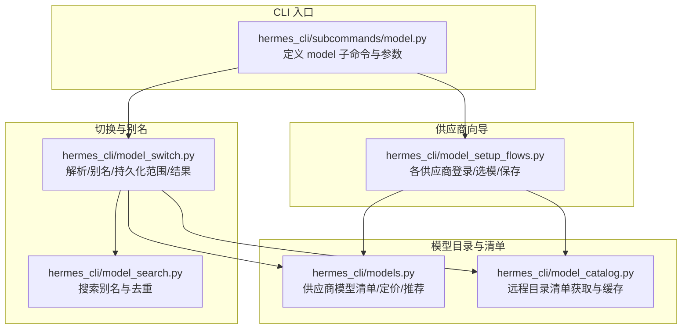
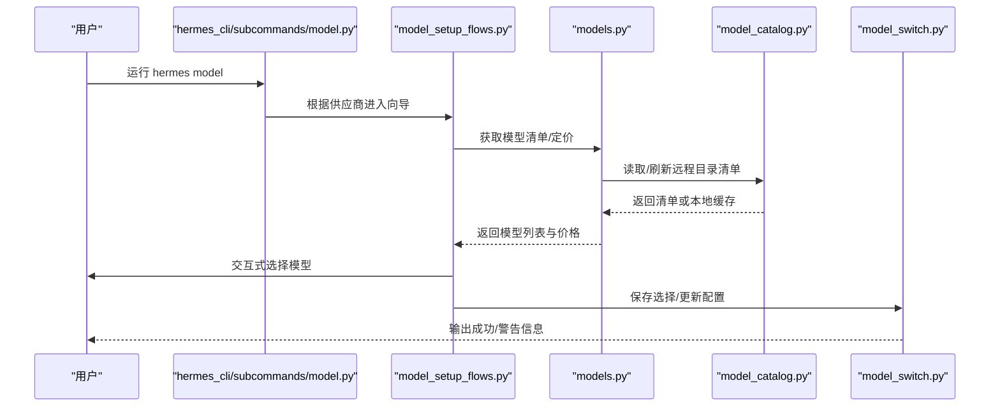
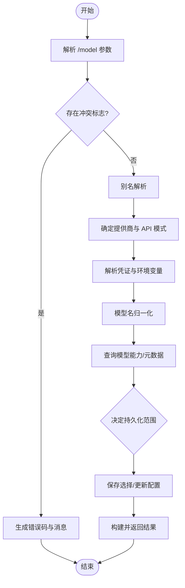
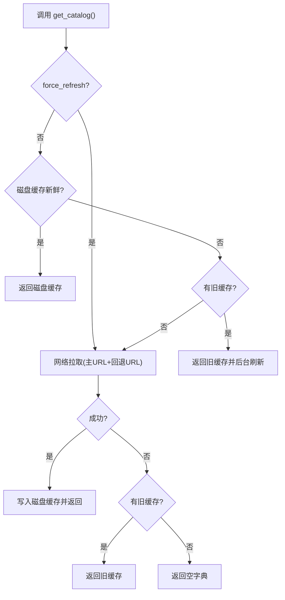
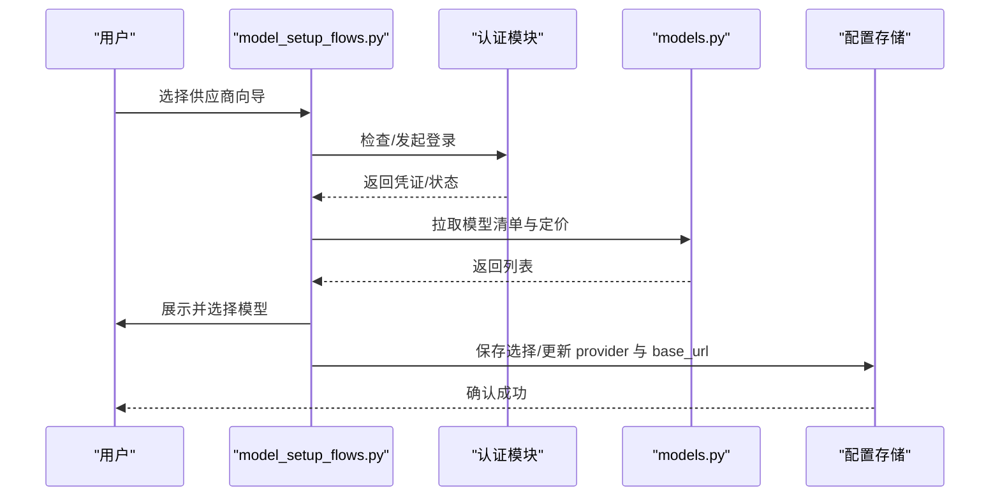
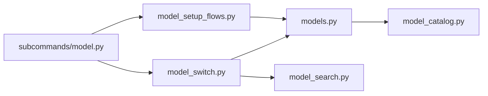

# 模型管理

<cite>
**本文引用的文件**
- [hermes_cli/subcommands/model.py](file://hermes_cli/subcommands/model.py)
- [hermes_cli/models.py](file://hermes_cli/models.py)
- [hermes_cli/model_switch.py](file://hermes_cli/model_switch.py)
- [hermes_cli/model_catalog.py](file://hermes_cli/model_catalog.py)
- [hermes_cli/model_setup_flows.py](file://hermes_cli/model_setup_flows.py)
- [hermes_cli/model_search.py](file://hermes_cli/model_search.py)
</cite>

## 目录
1. [简介](#简介)
2. [项目结构](#项目结构)
3. [核心组件](#核心组件)
4. [架构总览](#架构总览)
5. [详细组件分析](#详细组件分析)
6. [依赖关系分析](#依赖关系分析)
7. [性能与成本优化](#性能与成本优化)
8. [故障排除与回滚](#故障排除与回滚)
9. [结论](#结论)
10. [附录：常用场景的模型选择建议](#附录常用场景的模型选择建议)

## 简介
本文件面向 Hermes Agent 的“模型管理”能力，聚焦 hermes model 子命令的完整流程：模型发现、安装/配置、切换与测试。文档覆盖支持的模型提供商（OpenAI、Anthropic、Google Gemini、xAI、NVIDIA、阿里云等）的配置方式，解释模型参数（温度、最大令牌数、系统提示词等）在 Hermes 中的设置位置与生效路径，并提供性能调优与成本优化策略、不同使用场景的选型建议，以及故障排除与回滚指南。

## 项目结构
围绕模型管理的代码主要分布在 CLI 层与共享逻辑层：
- 子命令入口与参数解析：hermes_cli/subcommands/model.py
- 模型目录、供应商清单与定价：hermes_cli/models.py
- 模型切换与别名解析、持久化范围决策：hermes_cli/model_switch.py
- 远程目录清单获取与缓存：hermes_cli/model_catalog.py
- 各供应商交互式向导流程：hermes_cli/model_setup_flows.py
- 模型搜索别名与去重：hermes_cli/model_search.py

图表来源
- [hermes_cli/subcommands/model.py:12-62](file://hermes_cli/subcommands/model.py#L12-L62)
- [hermes_cli/models.py:221-616](file://hermes_cli/models.py#L221-L616)
- [hermes_cli/model_catalog.py:268-330](file://hermes_cli/model_catalog.py#L268-L330)
- [hermes_cli/model_switch.py:494-743](file://hermes_cli/model_switch.py#L494-L743)
- [hermes_cli/model_setup_flows.py:178-800](file://hermes_cli/model_setup_flows.py#L178-L800)
- [hermes_cli/model_search.py:14-50](file://hermes_cli/model_search.py#L14-L50)

章节来源
- [hermes_cli/subcommands/model.py:12-62](file://hermes_cli/subcommands/model.py#L12-L62)
- [hermes_cli/models.py:221-616](file://hermes_cli/models.py#L221-L616)
- [hermes_cli/model_switch.py:494-743](file://hermes_cli/model_switch.py#L494-L743)
- [hermes_cli/model_catalog.py:268-330](file://hermes_cli/model_catalog.py#L268-L330)
- [hermes_cli/model_setup_flows.py:178-800](file://hermes_cli/model_setup_flows.py#L178-L800)
- [hermes_cli/model_search.py:14-50](file://hermes_cli/model_search.py#L14-L50)

## 核心组件
- 子命令与参数：model 子命令提供 --refresh、--portal-url、--inference-url、--client-id、--scope、--no-browser、--timeout、--ca-bundle、--insecure 等选项，用于 Nous Portal 登录与刷新模型列表。
- 模型清单与定价：维护多供应商模型 ID 列表、推荐集、免费/付费分层、门户推荐合并、定价查询等。
- 切换与持久化：统一解析 /model 参数、别名解析、供应商与 API 模式判定、凭证解析、模型名归一化、元数据查找、结果构建；支持 --global/--session/--once 控制持久化范围。
- 目录清单缓存：从远程 JSON 清单拉取并缓存，支持 TTL、回退 URL、离线降级与后台刷新。
- 供应商向导：按供应商引导完成认证、模型选择、配置写入与提供者激活。
- 搜索别名：为 UI 搜索提供更友好的别名与去重键。

章节来源
- [hermes_cli/subcommands/model.py:12-62](file://hermes_cli/subcommands/model.py#L12-L62)
- [hermes_cli/models.py:632-799](file://hermes_cli/models.py#L632-L799)
- [hermes_cli/model_switch.py:460-743](file://hermes_cli/model_switch.py#L460-L743)
- [hermes_cli/model_catalog.py:268-330](file://hermes_cli/model_catalog.py#L268-L330)
- [hermes_cli/model_setup_flows.py:178-800](file://hermes_cli/model_setup_flows.py#L178-L800)
- [hermes_cli/model_search.py:14-50](file://hermes_cli/model_search.py#L14-L50)

## 架构总览
下图展示一次典型的 “hermes model” 交互流程：用户触发子命令 → 解析参数 → 进入对应供应商向导 → 认证/拉取模型 → 选择并保存 → 更新配置与提供者状态。

图表来源
- [hermes_cli/subcommands/model.py:12-62](file://hermes_cli/subcommands/model.py#L12-L62)
- [hermes_cli/model_setup_flows.py:178-800](file://hermes_cli/model_setup_flows.py#L178-L800)
- [hermes_cli/models.py:221-616](file://hermes_cli/models.py#L221-L616)
- [hermes_cli/model_catalog.py:268-330](file://hermes_cli/model_catalog.py#L268-L330)
- [hermes_cli/model_switch.py:494-743](file://hermes_cli/model_switch.py#L494-L743)

## 详细组件分析

### 子命令 hermes model：参数与入口
- 功能：交互式选择推理提供商与默认模型。
- 关键参数：
  - --refresh：清除磁盘缓存并重新拉取每个提供商的 /v1/models 列表。
  - --portal-url / --inference-url：指定 Nous Portal 与推理 API 基地址。
  - --client-id / --scope：OAuth 客户端标识与权限范围。
  - --no-browser：不自动打开浏览器进行 OAuth。
  - --timeout：HTTP 超时秒数。
  - --ca-bundle / --insecure：自定义 CA 证书或禁用 TLS 校验（仅测试）。
- 行为：将处理函数注入到命令行解析器，作为 model 子命令的入口。

章节来源
- [hermes_cli/subcommands/model.py:12-62](file://hermes_cli/subcommands/model.py#L12-L62)

### 模型清单与定价：providers、推荐与分层
- 供应商模型清单：集中维护各供应商的模型 ID 列表（如 OpenAI、Anthropic、Google Gemini、xAI、NVIDIA、阿里云等），并包含聚合器视图（如 openrouter、ai-gateway）。
- 推荐与分层：
  - 免费/付费分层：基于门户定价与账户层级，对免费用户仅显示可选免费模型，付费模型灰显不可选。
  - 门户推荐合并：将门户推荐的免费/付费模型追加到本地清单末尾，保证新模型及时可见。
- 定价查询：非阻塞获取实时定价，失败时降级为空字典，不影响主流程。

章节来源
- [hermes_cli/models.py:221-616](file://hermes_cli/models.py#L221-L616)
- [hermes_cli/models.py:632-799](file://hermes_cli/models.py#L632-L799)

### 模型切换：解析、别名、持久化范围与结果
- 参数解析：统一解析 /model 参数，支持 --provider、--global、--session、--once、--refresh 等标志，兼容 Unicode 短横线。
- 别名解析：内置别名映射（如 sonnet→claude-sonnet、gpt5→gpt-5、gemini→gemini 等），支持直接别名（绕过目录解析，适用于 Ollama Cloud 等）。
- 持久化范围：
  - --once：仅本次会话有效。
  - --session：仅当前会话有效。
  - --global：持久化到配置文件。
  - 未指定且带 --provider：默认会话级（探索性切换）。
  - 其他情况：遵循配置项 model.persist_switch_by_default（默认 False）。
- 结果对象：包含是否成功、新模型、目标提供商、API Key/Base URL、API 模式、错误/警告信息、能力元数据、是否全局等。

图表来源
- [hermes_cli/model_switch.py:494-743](file://hermes_cli/model_switch.py#L494-L743)
- [hermes_cli/model_switch.py:580-623](file://hermes_cli/model_switch.py#L580-L623)
- [hermes_cli/model_switch.py:297-352](file://hermes_cli/model_switch.py#L297-L352)

章节来源
- [hermes_cli/model_switch.py:494-743](file://hermes_cli/model_switch.py#L494-L743)
- [hermes_cli/model_switch.py:580-623](file://hermes_cli/model_switch.py#L580-L623)
- [hermes_cli/model_switch.py:297-352](file://hermes_cli/model_switch.py#L297-L352)

### 目录清单：远程获取、缓存与回退
- 清单来源：远程 JSON 清单（默认站点 + GitHub 回退），按版本校验 schema。
- 缓存策略：进程内缓存 + 磁盘缓存（~/.hermes/cache/model_catalog.json），TTL 可配；过期时“边用边刷新”（Stale-while-revalidate）。
- 访问接口：
  - get_catalog(force_refresh)：返回解析后的清单或空字典。
  - get_curated_openrouter_models() / get_curated_nous_models()：返回特定供应商的推荐模型。
  - get_default_model_from_cache(provider)：仅读缓存，不触发网络。
  - seed_cache_from_checkout(project_root)：从本地仓库种子清单覆盖磁盘缓存。
  - reset_cache()：清理进程内缓存。

图表来源
- [hermes_cli/model_catalog.py:268-330](file://hermes_cli/model_catalog.py#L268-L330)
- [hermes_cli/model_catalog.py:126-174](file://hermes_cli/model_catalog.py#L126-L174)
- [hermes_cli/model_catalog.py:203-231](file://hermes_cli/model_catalog.py#L203-L231)
- [hermes_cli/model_catalog.py:436-472](file://hermes_cli/model_catalog.py#L436-L472)

章节来源
- [hermes_cli/model_catalog.py:268-330](file://hermes_cli/model_catalog.py#L268-L330)
- [hermes_cli/model_catalog.py:126-174](file://hermes_cli/model_catalog.py#L126-L174)
- [hermes_cli/model_catalog.py:203-231](file://hermes_cli/model_catalog.py#L203-L231)
- [hermes_cli/model_catalog.py:436-472](file://hermes_cli/model_catalog.py#L436-L472)

### 供应商向导：认证、选模与配置
- OpenRouter：提示输入 API Key，拉取模型与定价，选择后保存并设置 provider/base_url/api_mode。
- Vercel AI Gateway：类似流程，设置 provider/base_url/api_mode。
- MoA（Mixture of Agents）：选择预设（含聚合器与参考模型），保存为虚拟 provider。
- Nous Portal：登录/续期，拉取推荐模型与定价，按账户层级过滤，保存并更新配置。
- OpenAI Codex：OAuth 登录，拉取模型，保存并更新配置。
- xAI Grok OAuth：OAuth 登录，拉取模型，保存并更新配置。
- Qwen OAuth：复用本地 Qwen CLI 登录，选择模型并保存。

图表来源
- [hermes_cli/model_setup_flows.py:178-800](file://hermes_cli/model_setup_flows.py#L178-L800)
- [hermes_cli/models.py:221-616](file://hermes_cli/models.py#L221-L616)

章节来源
- [hermes_cli/model_setup_flows.py:178-800](file://hermes_cli/model_setup_flows.py#L178-L800)
- [hermes_cli/models.py:221-616](file://hermes_cli/models.py#L221-L616)

### 搜索与去重：模型别名
- 目的：为 UI 搜索提供更友好文本，避免裸 wire id（如 k3）难以检索。
- 机制：维护 wire id 到别名集合的映射，并派生规范公开 slug 用于去重。
- 影响：仅改变搜索 haystack 与去重键，不改变实际发送到提供商的模型 ID。

章节来源
- [hermes_cli/model_search.py:14-50](file://hermes_cli/model_search.py#L14-L50)

## 依赖关系分析
- CLI 子命令依赖向导流程；向导流程依赖模型清单与目录清单；切换逻辑依赖 providers、模型归一化与 models_dev 能力元数据；目录清单依赖网络与磁盘缓存。
- 耦合点：
  - 清单与定价：models.py 与 model_catalog.py 紧密协作，确保在线/离线一致性。
  - 切换与向导：model_switch.py 提供统一的解析与持久化语义，向导负责具体供应商交互。
  - 搜索别名：model_search.py 独立于业务逻辑，仅增强 UI 体验。

图表来源
- [hermes_cli/subcommands/model.py:12-62](file://hermes_cli/subcommands/model.py#L12-L62)
- [hermes_cli/model_setup_flows.py:178-800](file://hermes_cli/model_setup_flows.py#L178-L800)
- [hermes_cli/models.py:221-616](file://hermes_cli/models.py#L221-L616)
- [hermes_cli/model_catalog.py:268-330](file://hermes_cli/model_catalog.py#L268-L330)
- [hermes_cli/model_switch.py:494-743](file://hermes_cli/model_switch.py#L494-L743)
- [hermes_cli/model_search.py:14-50](file://hermes_cli/model_search.py#L14-L50)

章节来源
- [hermes_cli/subcommands/model.py:12-62](file://hermes_cli/subcommands/model.py#L12-L62)
- [hermes_cli/model_setup_flows.py:178-800](file://hermes_cli/model_setup_flows.py#L178-L800)
- [hermes_cli/models.py:221-616](file://hermes_cli/models.py#L221-L616)
- [hermes_cli/model_catalog.py:268-330](file://hermes_cli/model_catalog.py#L268-L330)
- [hermes_cli/model_switch.py:494-743](file://hermes_cli/model_switch.py#L494-L743)
- [hermes_cli/model_search.py:14-50](file://hermes_cli/model_search.py#L14-L50)

## 性能与成本优化
- 目录清单缓存：通过 TTL 与“边用边刷新”降低网络开销，冷启动时优先返回旧缓存，后台异步刷新。
- 非阻塞定价：定价查询失败不阻断主流程，避免 UI 卡顿。
- 模型选择策略：
  - 免费/付费分层：免费用户仅展示免费模型，减少无效尝试与潜在费用。
  - 推荐合并：门户推荐的新模型及时可见，减少手动维护成本。
- 成本敏感场景：
  - 优先选择轻量/快速模型（如 flash/mini 系列）用于高吞吐低延迟任务。
  - 复杂推理任务再选用高质量模型，结合工具调用与上下文压缩降低 token 消耗。
- 参数调优（通用指导）：
  - 温度（temperature）：创意写作提高多样性，代码生成降低以避免不稳定。
  - 最大令牌数（max_tokens/max_completion_tokens）：限制输出长度以控制成本与延迟。
  - 系统提示词（system prompt）：明确角色与约束，减少无效轮次与重试。
  - 频率惩罚/重复惩罚：抑制重复输出，提升质量。
  - 注意：上述参数由上层运行时/传输层在构造请求时注入，Hermes 的模型管理关注“选择与配置”，具体参数传递取决于所选提供商与 API 模式。

[本节为通用指导，不直接分析具体文件]

## 故障排除与回滚
- 目录清单不可用：
  - 现象：模型列表为空或不更新。
  - 排查：检查网络与站点可达性；使用 --refresh 强制刷新；查看磁盘缓存是否损坏；必要时使用 seed_cache_from_checkout 从本地仓库恢复。
- 认证失败/会话过期：
  - 现象：Nous/xAI/Codex 等 OAuth 提供商无法拉取模型。
  - 处理：向导中提供“重用现有凭证/重新认证/取消”；过期时自动提示重新登录。
- 模型不可选/灰显：
  - 现象：免费用户看到付费模型但不可选。
  - 处理：升级账户或选择免费模型；也可通过门户推荐了解当前可用免费模型。
- 切换未生效：
  - 现象：切换后仍使用旧模型。
  - 处理：确认持久化范围（--global/--session/--once）；检查配置是否被后续会话覆盖；使用 resolve_effective_model 优先级规则（会话覆盖 > 频道/会话持久化 > 全局默认）。
- 回滚机制：
  - 通过再次执行 hermes model 选择原模型或使用 --global 恢复默认；对于会话级切换，关闭会话即失效；对于一次性切换（--once），下一轮自动回退。

章节来源
- [hermes_cli/model_catalog.py:268-330](file://hermes_cli/model_catalog.py#L268-L330)
- [hermes_cli/model_setup_flows.py:398-622](file://hermes_cli/model_setup_flows.py#L398-L622)
- [hermes_cli/model_switch.py:580-623](file://hermes_cli/model_switch.py#L580-L623)
- [hermes_cli/model_switch.py:760-784](file://hermes_cli/model_switch.py#L760-L784)

## 结论
Hermes 的模型管理以“清单驱动 + 向导式配置 + 统一切换语义”为核心，兼顾在线/离线体验与多供应商生态。通过目录清单缓存、定价分层与推荐合并，用户能快速找到合适模型；通过统一的参数解析与持久化范围控制，确保切换意图准确落地。配合合理的参数调优与成本策略，可在不同场景下取得最佳效果。

[本节为总结，不直接分析具体文件]

## 附录：常用场景的模型选择建议
- 代码生成：
  - 倾向：具备强工具调用与结构化输出的模型（如 Claude Sonnet/Opus、GPT 系列、Gemini Pro、DeepSeek 等）。
  - 参数建议：较低温度、合理最大令牌数、明确的系统提示词约束。
- 创意写作：
  - 倾向：多样化与叙事能力强的模型（如 Claude Haiku/Sonnet、GPT 系列）。
  - 参数建议：适度提高温度，放宽最大令牌数以允许更长创作。
- 数据分析/推理：
  - 倾向：推理能力强、指令遵循好的模型（如 Claude Opus、GPT 系列、Gemini Pro）。
  - 参数建议：中等温度、严格系统提示词、限制输出长度以提高稳定性。
- 低成本/高吞吐：
  - 倾向：轻量/快速模型（flash/mini 系列）。
  - 参数建议：较低温度、较短最大令牌数，结合工具调用减少轮次。

[本节为通用指导，不直接分析具体文件]