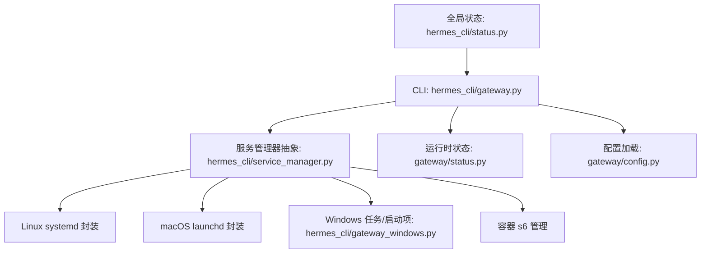
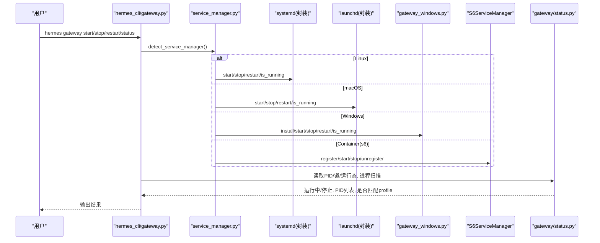
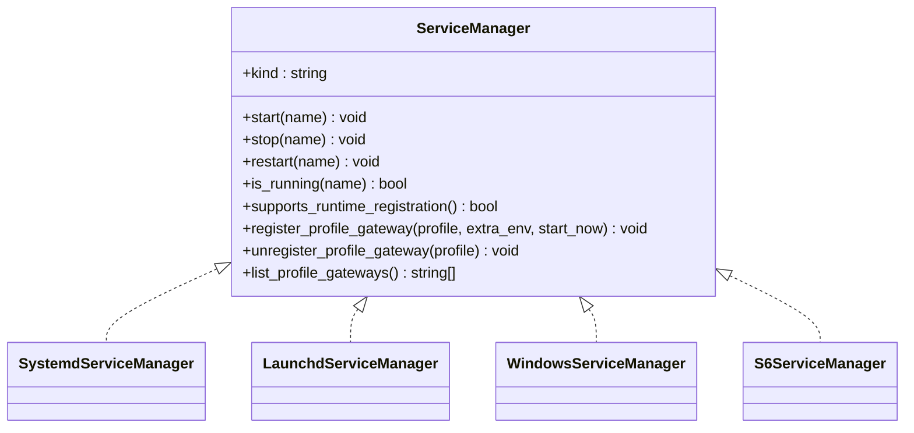
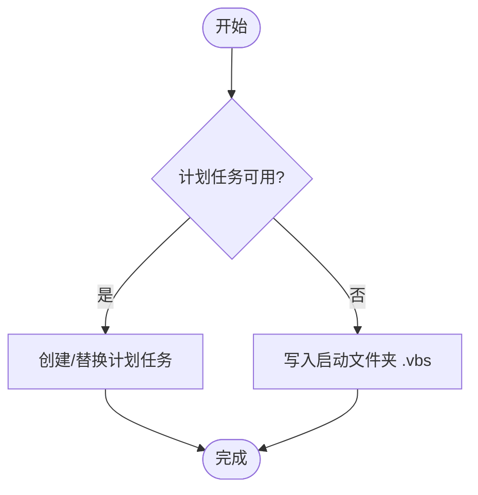
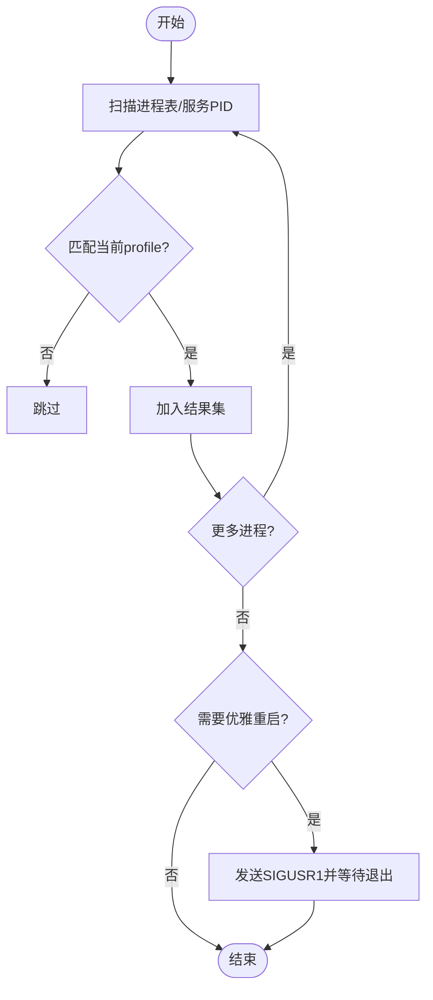
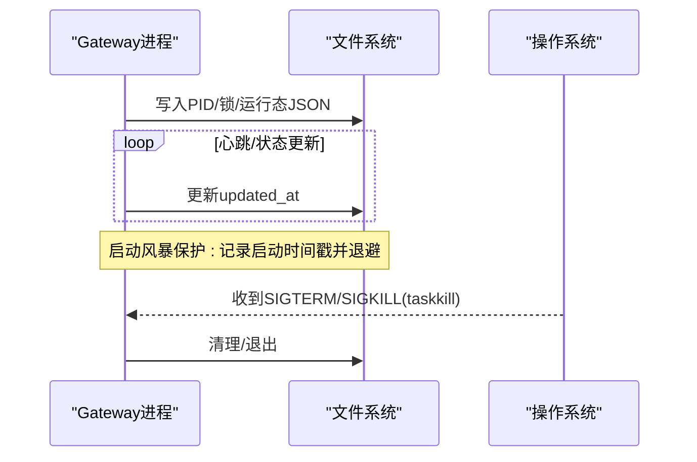
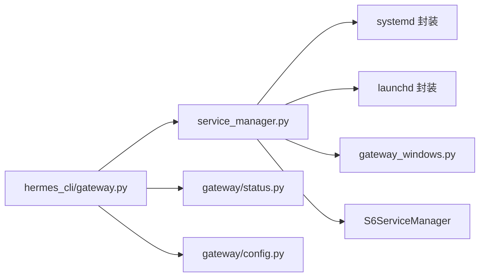

# 网关管理

<cite>
**本文引用的文件**
- [hermes_cli/gateway.py](file://hermes_cli/gateway.py)
- [hermes_cli/service_manager.py](file://hermes_cli/service_manager.py)
- [hermes_cli/gateway_windows.py](file://hermes_cli/gateway_windows.py)
- [gateway/config.py](file://gateway/config.py)
- [gateway/status.py](file://gateway/status.py)
- [hermes_cli/status.py](file://hermes_cli/status.py)
</cite>

## 目录
1. [简介](#简介)
2. [项目结构](#项目结构)
3. [核心组件](#核心组件)
4. [架构总览](#架构总览)
5. [详细组件分析](#详细组件分析)
6. [依赖关系分析](#依赖关系分析)
7. [性能与资源调优](#性能与资源调优)
8. [故障排除指南](#故障排除指南)
9. [安全配置与网络访问控制最佳实践](#安全配置与网络访问控制最佳实践)
10. [结论](#结论)

## 简介
本文件面向 Hermes Agent 的“网关管理”能力，覆盖以下目标：
- 网关服务的启动、停止、重启与状态监控操作说明
- hermes gateway 子命令的功能（安装、卸载、配置、日志查看）
- 不同操作系统上的服务管理方式（systemd、launchd、Windows 任务/启动项、容器 s6）
- 多实例部署与负载均衡配置要点
- 性能调优参数与资源限制设置
- 故障排除指南（常见问题诊断与解决方案）
- 安全配置与网络访问控制最佳实践

## 项目结构
Hermes 网关管理由 CLI 层、平台服务抽象层、平台后端实现以及运行时状态模块共同组成：
- CLI 入口与子命令：hermes_cli/gateway.py
- 跨平台服务管理器抽象：hermes_cli/service_manager.py
- Windows 专用后端：hermes_cli/gateway_windows.py
- 网关配置加载与校验：gateway/config.py
- 运行时状态与进程发现：gateway/status.py
- 全局状态展示（含网关服务行）：hermes_cli/status.py

图表来源
- [hermes_cli/gateway.py:1-120](file://hermes_cli/gateway.py#L1-L120)
- [hermes_cli/service_manager.py:86-127](file://hermes_cli/service_manager.py#L86-L127)
- [hermes_cli/gateway_windows.py:1-80](file://hermes_cli/gateway_windows.py#L1-L80)
- [gateway/status.py:1-50](file://gateway/status.py#L1-L50)
- [gateway/config.py:1-30](file://gateway/config.py#L1-L30)
- [hermes_cli/status.py:543-578](file://hermes_cli/status.py#L543-L578)

章节来源
- [hermes_cli/gateway.py:1-120](file://hermes_cli/gateway.py#L1-L120)
- [hermes_cli/service_manager.py:86-127](file://hermes_cli/service_manager.py#L86-L127)
- [hermes_cli/gateway_windows.py:1-80](file://hermes_cli/gateway_windows.py#L1-L80)
- [gateway/status.py:1-50](file://gateway/status.py#L1-L50)
- [gateway/config.py:1-30](file://gateway/config.py#L1-L30)
- [hermes_cli/status.py:543-578](file://hermes_cli/status.py#L543-L578)

## 核心组件
- 服务生命周期与进程扫描
  - 通过进程表扫描与服务管理器协同，识别当前运行的网关进程及所属 profile，避免误杀或误报。
  - 支持优雅重启路径（SIGUSR1 + drain），在 systemd/launchd/s6 等环境下配合自动重启策略。
- 跨平台服务抽象
  - 统一 start/stop/restart/is_running 接口；s6 支持运行时注册 per-profile 网关。
- 平台后端
  - Linux: systemd 用户/系统作用域
  - macOS: launchd
  - Windows: 计划任务 + 启动文件夹回退
  - 容器: s6-overlay 动态服务目录
- 配置与状态
  - 配置加载、类型归一化、端口绑定平台检测、watchdog 秒数归一化
  - PID 文件、锁文件、运行态 JSON、启动风暴保护、进程存活检查

章节来源
- [hermes_cli/gateway.py:100-178](file://hermes_cli/gateway.py#L100-L178)
- [hermes_cli/gateway.py:357-578](file://hermes_cli/gateway.py#L357-L578)
- [hermes_cli/service_manager.py:53-84](file://hermes_cli/service_manager.py#L53-L84)
- [hermes_cli/service_manager.py:203-318](file://hermes_cli/service_manager.py#L203-L318)
- [hermes_cli/gateway_windows.py:574-715](file://hermes_cli/gateway_windows.py#L574-L715)
- [gateway/config.py:150-191](file://gateway/config.py#L150-L191)
- [gateway/status.py:247-278](file://gateway/status.py#L247-L278)

## 架构总览
下图展示了从 CLI 到各平台服务后端的调用链路与关键交互点。

图表来源
- [hermes_cli/gateway.py:100-178](file://hermes_cli/gateway.py#L100-L178)
- [hermes_cli/service_manager.py:86-127](file://hermes_cli/service_manager.py#L86-L127)
- [hermes_cli/gateway_windows.py:574-715](file://hermes_cli/gateway_windows.py#L574-L715)
- [gateway/status.py:247-278](file://gateway/status.py#L247-L278)

## 详细组件分析

### 组件A：服务管理器抽象与后端选择
- 职责
  - 检测当前环境可用的服务管理器（s6、windows、launchd、systemd、none）
  - 提供统一的 start/stop/restart/is_running 接口
  - 仅 s6 后端支持运行时注册 per-profile 网关
- 关键点
  - 对 host 后端（systemd/launchd/windows）不暴露运行时注册方法，调用方需先检查 supports_runtime_registration()
  - s6 使用 /run/service 动态目录，按 profile 生成 gateway-<name> 服务槽位

图表来源
- [hermes_cli/service_manager.py:53-84](file://hermes_cli/service_manager.py#L53-L84)
- [hermes_cli/service_manager.py:203-318](file://hermes_cli/service_manager.py#L203-L318)
- [hermes_cli/service_manager.py:601-710](file://hermes_cli/service_manager.py#L601-L710)

章节来源
- [hermes_cli/service_manager.py:86-127](file://hermes_cli/service_manager.py#L86-L127)
- [hermes_cli/service_manager.py:203-318](file://hermes_cli/service_manager.py#L203-L318)
- [hermes_cli/service_manager.py:601-710](file://hermes_cli/service_manager.py#L601-L710)

### 组件B：Windows 服务后端（计划任务 + 启动项回退）
- 职责
  - 创建/删除计划任务，失败时回退到启动文件夹
  - 生成稳定的工作目录与脚本（cmd/vbs），隐藏控制台窗口
  - 提供 install/start/stop/restart/is_running
- 关键点
  - 使用 wscript.exe 启动 python 并隐藏控制台，避免登录时的 CTRL_CLOSE 导致任务被取消
  - 计划任务 XML 包含重启策略与最小权限原则
  - 支持 UAC 提权执行安装/卸载

图表来源
- [hermes_cli/gateway_windows.py:574-715](file://hermes_cli/gateway_windows.py#L574-L715)
- [hermes_cli/gateway_windows.py:589-644](file://hermes_cli/gateway_windows.py#L589-L644)
- [hermes_cli/gateway_windows.py:701-715](file://hermes_cli/gateway_windows.py#L701-L715)

章节来源
- [hermes_cli/gateway_windows.py:1-80](file://hermes_cli/gateway_windows.py#L1-L80)
- [hermes_cli/gateway_windows.py:574-715](file://hermes_cli/gateway_windows.py#L574-L715)
- [hermes_cli/gateway_windows.py:701-715](file://hermes_cli/gateway_windows.py#L701-L715)

### 组件C：进程扫描与优雅重启
- 职责
  - 扫描当前主机上所有疑似网关进程，过滤出属于当前 profile 的实例
  - 通过 SIGUSR1 触发优雅退出（drain），等待进程退出后再进行后续操作
- 关键点
  - 排除祖先进程以避免误判 CLI 自身为网关
  - Windows 下合并 venv launcher 伪进程，避免重复计数
  - 优雅重启超时预算来自配置解析，确保 drain 时间足够

图表来源
- [hermes_cli/gateway.py:357-578](file://hermes_cli/gateway.py#L357-L578)
- [hermes_cli/gateway.py:242-295](file://hermes_cli/gateway.py#L242-L295)

章节来源
- [hermes_cli/gateway.py:242-295](file://hermes_cli/gateway.py#L242-L295)
- [hermes_cli/gateway.py:357-578](file://hermes_cli/gateway.py#L357-L578)

### 组件D：运行时状态与守护
- 职责
  - 维护 PID 文件、锁文件、运行态 JSON
  - 记录启动次数并检测“启动风暴”，实施退避
  - 提供跨平台进程存活检查、终止工具
- 关键点
  - 严格校验 updated_at 字段格式与时序范围
  - 通过命令行解析判断是否为真正的 gateway run 进程
  - 优雅终止：POSIX 用 SIGTERM/SIGKILL，Windows 用 taskkill /T /F

图表来源
- [gateway/status.py:71-128](file://gateway/status.py#L71-L128)
- [gateway/status.py:247-278](file://gateway/status.py#L247-L278)
- [gateway/status.py:569-594](file://gateway/status.py#L569-L594)

章节来源
- [gateway/status.py:71-128](file://gateway/status.py#L71-L128)
- [gateway/status.py:247-278](file://gateway/status.py#L247-L278)
- [gateway/status.py:569-594](file://gateway/status.py#L569-L594)

### 组件E：配置加载与端口绑定检测
- 职责
  - 加载并归一化网关配置
  - 检测哪些平台会绑定 TCP 端口，防止冲突
  - 规范化 watchdog 秒数，保证 Type=notify 与应用心跳一致
- 关键点
  - PORT_BINDING_PLATFORM_VALUES 集中管理端口绑定平台
  - 条件模式（如飞书 webhook）仅在特定模式下绑定端口
  - 环境变量优先级高于配置文件，且支持 secret scope 注入

章节来源
- [gateway/config.py:150-191](file://gateway/config.py#L150-L191)
- [gateway/config.py:376-417](file://gateway/config.py#L376-L417)
- [gateway/config.py:234-250](file://gateway/config.py#L234-L250)

## 依赖关系分析
- 耦合性
  - CLI 与 service_manager 解耦：通过 Protocol 抽象，便于扩展新后端
  - 平台后端独立实现，互不影响
  - 状态模块与 CLI 强相关，但通过文件契约松耦合
- 外部依赖
  - psutil：跨平台进程信息获取
  - 系统工具：systemctl、launchctl、schtasks、s6-*
- 潜在循环
  - 通过延迟导入避免循环依赖（例如 gateway.status 在扫描时再导入）

图表来源
- [hermes_cli/gateway.py:1-120](file://hermes_cli/gateway.py#L1-L120)
- [hermes_cli/service_manager.py:86-127](file://hermes_cli/service_manager.py#L86-L127)
- [hermes_cli/gateway_windows.py:1-80](file://hermes_cli/gateway_windows.py#L1-L80)
- [gateway/status.py:1-50](file://gateway/status.py#L1-L50)
- [gateway/config.py:1-30](file://gateway/config.py#L1-L30)

章节来源
- [hermes_cli/gateway.py:1-120](file://hermes_cli/gateway.py#L1-L120)
- [hermes_cli/service_manager.py:86-127](file://hermes_cli/service_manager.py#L86-L127)
- [hermes_cli/gateway_windows.py:1-80](file://hermes_cli/gateway_windows.py#L1-L80)
- [gateway/status.py:1-50](file://gateway/status.py#L1-L50)
- [gateway/config.py:1-30](file://gateway/config.py#L1-L30)

## 性能与资源调优
- 服务健康与看门狗
  - 使用 coerce_systemd_watchdog_seconds 将 watchdog 秒数归一化为有效正整数或禁用，避免 Type=notify 与应用心跳不一致
- 流式与缓冲
  - streaming 配置可调整编辑间隔与缓冲区阈值，平衡实时性与平台速率限制
- 会话与并发
  - 通过 active_sessions 与 max_concurrent_sessions 限制并发会话，避免过载
- 启动风暴保护
  - 记录启动时间戳并在窗口内超过阈值时退避，防止崩溃循环

章节来源
- [gateway/config.py:150-191](file://gateway/config.py#L150-L191)
- [gateway/config.py:720-800](file://gateway/config.py#L720-L800)
- [hermes_cli/status.py:650-683](file://hermes_cli/status.py#L650-L683)
- [gateway/status.py:71-128](file://gateway/status.py#L71-L128)

## 故障排除指南
- 常见症状与定位
  - 服务已安装但未运行：检查服务管理器状态与 PID 文件
  - 进程存在但非网关：通过命令行匹配过滤，避免误报
  - 启动风暴：查看启动日志与退避行为
- 诊断步骤
  - 使用 hermes status 查看网关服务行与管理器类型
  - 检查 PID/锁/运行态 JSON 是否一致
  - 在 Windows 上使用计划任务/启动项排查
- 解决建议
  - 使用优雅重启（SIGUSR1）释放占用资源
  - 清理残留 PID/锁文件后重试
  - 修正端口冲突（避免多个平台同时绑定同一端口）

章节来源
- [hermes_cli/status.py:543-578](file://hermes_cli/status.py#L543-L578)
- [gateway/status.py:247-278](file://gateway/status.py#L247-L278)
- [gateway/status.py:569-594](file://gateway/status.py#L569-L594)
- [gateway/config.py:376-417](file://gateway/config.py#L376-L417)

## 安全配置与网络访问控制最佳实践
- 最小权限与隔离
  - Windows 计划任务以最小权限运行，避免不必要的提权
  - s6 容器中以 hermes 用户运行，限制文件系统与进程权限
- 密钥与凭据
  - 使用 secret scope 注入敏感信息，避免明文配置
  - 状态输出中对 API Key 进行脱敏显示
- 网络暴露面
  - 仅启用必要的端口绑定平台，避免端口冲突与不必要暴露
  - 结合防火墙/反向代理限制访问来源

章节来源
- [hermes_cli/gateway_windows.py:589-644](file://hermes_cli/gateway_windows.py#L589-L644)
- [hermes_cli/service_manager.py:601-710](file://hermes_cli/service_manager.py#L601-L710)
- [gateway/config.py:376-417](file://gateway/config.py#L376-L417)
- [hermes_cli/status.py:35-44](file://hermes_cli/status.py#L35-L44)

## 结论
Hermes 网关管理通过 CLI 与跨平台服务抽象，实现了统一的启动/停止/重启/状态能力，并在不同环境中具备健壮的生命周期管理与故障恢复机制。借助配置归一化、端口绑定检测、启动风暴保护与优雅重启，系统在可用性、可观测性与安全性方面提供了良好基础。建议在多实例部署中结合 per-profile 隔离与合理的并发限制，以获得稳定高效的网关服务。