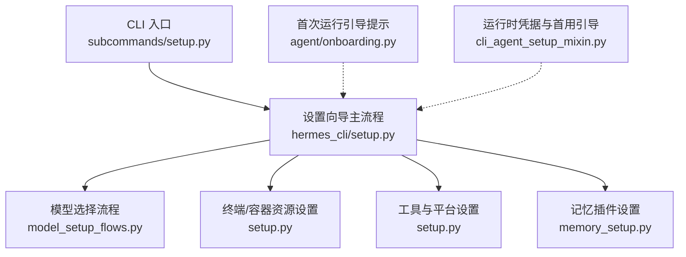
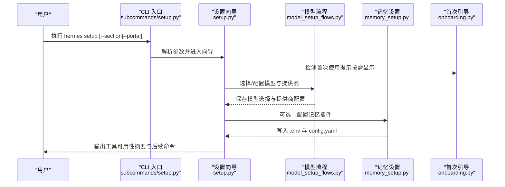
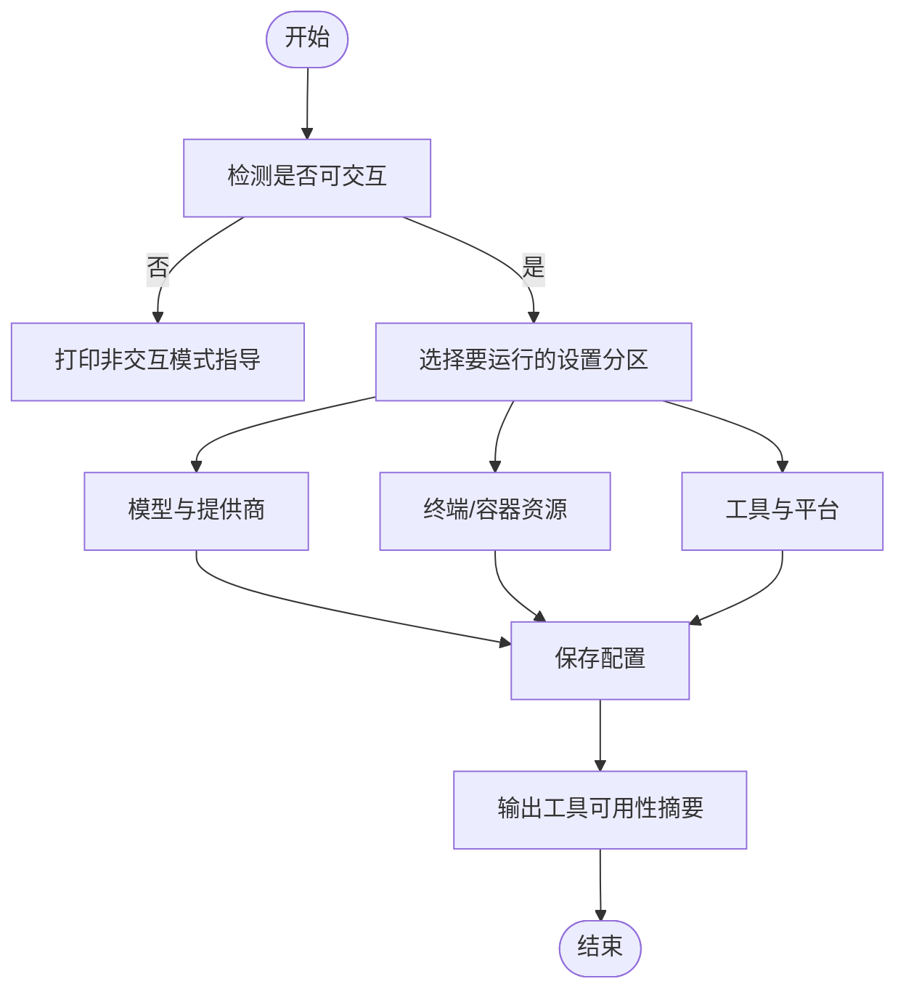
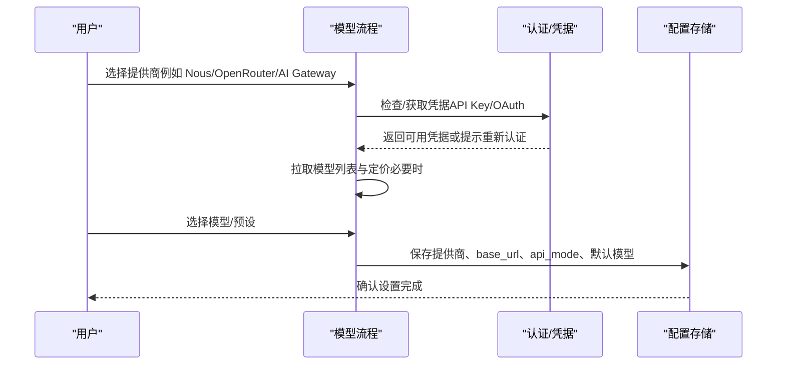
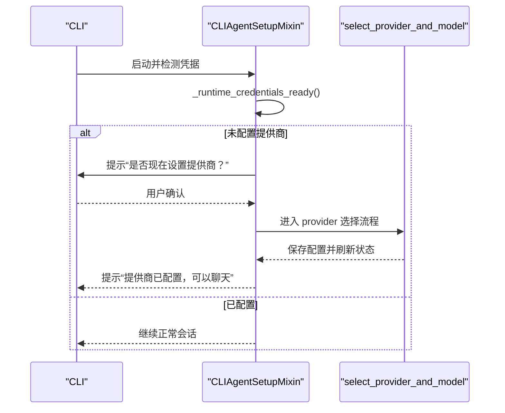
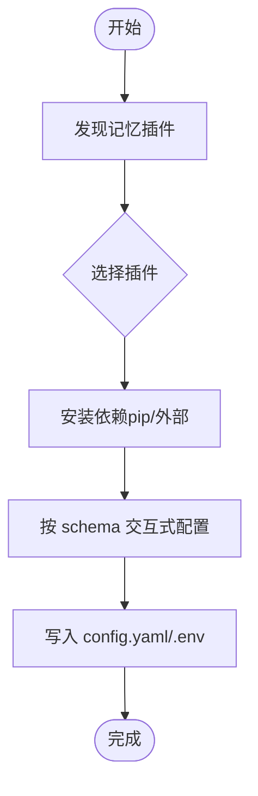
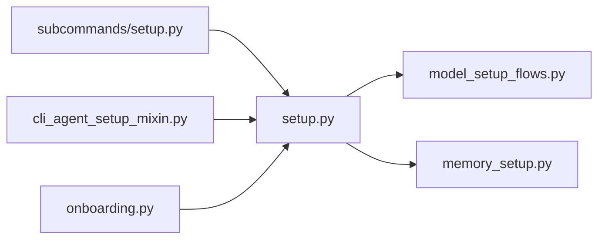

# 设置向导

<cite>
**本文引用的文件**
- [hermes_cli/setup.py](file://hermes_cli/setup.py)
- [hermes_cli/model_setup_flows.py](file://hermes_cli/model_setup_flows.py)
- [hermes_cli/subcommands/setup.py](file://hermes_cli/subcommands/setup.py)
- [hermes_cli/cli_agent_setup_mixin.py](file://hermes_cli/cli_agent_setup_mixin.py)
- [agent/onboarding.py](file://agent/onboarding.py)
- [hermes_cli/memory_setup.py](file://hermes_cli/memory_setup.py)
</cite>

## 目录
1. [简介](#简介)
2. [项目结构](#项目结构)
3. [核心组件](#核心组件)
4. [架构总览](#架构总览)
5. [详细组件分析](#详细组件分析)
6. [依赖关系分析](#依赖关系分析)
7. [性能考量](#性能考量)
8. [故障排除指南](#故障排除指南)
9. [结论](#结论)
10. [附录](#附录)

## 简介
本文件面向 Hermes Agent 的“设置向导”功能，系统化说明交互式设置向导的工作流程、首次安装后的初始设置步骤（API 密钥配置、模型选择、权限与工具启用等）、高级设置选项（自定义路径、代理/容器资源、插件管理等）、自动化与非交互式批量配置能力、配置验证与错误恢复机制，并提供常见场景下的推荐配置模板与排障指引。

## 项目结构
设置向导由 CLI 子命令驱动，核心入口在 setup 子命令解析器中；主交互逻辑集中在 setup 模块；按提供者划分的模型选择流程被拆分到 model_setup_flows；首次运行时的上下文提示由 onboarding 模块提供；记忆插件的设置由 memory_setup 管理。

图表来源
- [hermes_cli/subcommands/setup.py:12-67](file://hermes_cli/subcommands/setup.py#L12-L67)
- [hermes_cli/setup.py:1-12](file://hermes_cli/setup.py#L1-L12)
- [hermes_cli/model_setup_flows.py:1-19](file://hermes_cli/model_setup_flows.py#L1-L19)
- [hermes_cli/memory_setup.py:1-6](file://hermes_cli/memory_setup.py#L1-L6)
- [agent/onboarding.py:1-11](file://agent/onboarding.py#L1-L11)
- [hermes_cli/cli_agent_setup_mixin.py:1-13](file://hermes_cli/cli_agent_setup_mixin.py#L1-L13)

章节来源
- [hermes_cli/subcommands/setup.py:12-67](file://hermes_cli/subcommands/setup.py#L12-L67)
- [hermes_cli/setup.py:1-12](file://hermes_cli/setup.py#L1-L12)

## 核心组件
- 设置向导主流程：提供模块化分区（模型、终端、Agent 设置、消息平台、工具），支持完整向导与快速模式，输出完成摘要与下一步操作建议。
- 模型选择流程：按提供者（Nous Portal、OpenRouter、AI Gateway、MoA、Codex、xAI、Qwen 等）分别实现认证、模型列表获取、定价展示与保存选择。
- 首次运行引导：检测无推理提供商时，在 CLI 启动阶段提示并引导进入 provider 选择流程。
- 非交互式模式：通过环境变量或 TTY 探测自动切换为非交互模式，打印指导信息以便脚本化配置。
- 记忆插件设置：基于插件发现与 schema 驱动的交互式配置，自动安装依赖、写入 .env 与 config.yaml。
- 终端/容器资源设置：交互式配置持久化、CPU/内存/磁盘等资源参数，以及特定后端（如 Vercel Sandbox）的专属设置。

章节来源
- [hermes_cli/setup.py:1-12](file://hermes_cli/setup.py#L1-L12)
- [hermes_cli/model_setup_flows.py:1-19](file://hermes_cli/model_setup_flows.py#L1-L19)
- [hermes_cli/cli_agent_setup_mixin.py:221-283](file://hermes_cli/cli_agent_setup_mixin.py#L221-L283)
- [hermes_cli/setup.py:172-199](file://hermes_cli/setup.py#L172-L199)
- [hermes_cli/memory_setup.py:283-425](file://hermes_cli/memory_setup.py#L283-L425)
- [hermes_cli/setup.py:725-800](file://hermes_cli/setup.py#L725-L800)

## 架构总览
设置向导采用“子命令 + 模块化流程”的架构：
- subcommands/setup.py 负责注册 hermes setup 子命令及参数（section、--non-interactive、--reset、--reconfigure、--quick、--portal）。
- setup.py 实现向导主循环与各分区交互，并在结束时输出工具可用性摘要与下一步命令。
- model_setup_flows.py 将不同提供者的认证与模型选择流程解耦，便于扩展与维护。
- cli_agent_setup_mixin.py 在 CLI 启动时检测是否已配置推理提供商，若未配置则引导用户进入 provider 选择。
- agent/onboarding.py 提供一次性提示（如首次消息行为、工具进度提示、旧版残留清理等），避免重复打扰。
- memory_setup.py 以插件为中心，动态发现可用记忆提供者，按 schema 交互式配置并持久化。

图表来源
- [hermes_cli/subcommands/setup.py:12-67](file://hermes_cli/subcommands/setup.py#L12-L67)
- [hermes_cli/setup.py:1-12](file://hermes_cli/setup.py#L1-L12)
- [hermes_cli/model_setup_flows.py:178-247](file://hermes_cli/model_setup_flows.py#L178-L247)
- [hermes_cli/memory_setup.py:283-425](file://hermes_cli/memory_setup.py#L283-L425)
- [agent/onboarding.py:22-30](file://agent/onboarding.py#L22-L30)

## 详细组件分析

### 设置向导主流程（hermes_cli/setup.py）
- 模块化分区：模型、终端、Agent 设置、消息平台、工具，可单独运行某一节。
- 非交互式模式：当 stdin 不可交互或设置了非交互标志时，打印指导信息，建议使用环境变量或配置命令进行批量化配置。
- 输入处理：支持密码掩码、菜单选择、多选清单，兼容 curses 与回退到普通输入。
- 完成摘要：汇总各工具可用性（视觉、网页搜索、浏览器自动化、图像/视频生成、TTS/STT、Modal、Home Assistant、Spotify、Skills Hub、Terminal、任务规划、技能等），并给出下一步命令与配置文件位置。
- 容器资源设置：针对 Docker/Singularity/Modal/Daytona/Vercel Sandbox 等后端，交互式配置持久化、CPU/内存/磁盘等参数。

图表来源
- [hermes_cli/setup.py:172-199](file://hermes_cli/setup.py#L172-L199)
- [hermes_cli/setup.py:396-723](file://hermes_cli/setup.py#L396-L723)
- [hermes_cli/setup.py:725-800](file://hermes_cli/setup.py#L725-L800)

章节来源
- [hermes_cli/setup.py:172-199](file://hermes_cli/setup.py#L172-L199)
- [hermes_cli/setup.py:396-723](file://hermes_cli/setup.py#L396-L723)
- [hermes_cli/setup.py:725-800](file://hermes_cli/setup.py#L725-L800)

### 模型选择流程（hermes_cli/model_setup_flows.py）
- OpenRouter：确保 API Key，拉取模型列表与定价，选择后更新配置为 chat_completions 模式并设置 base_url。
- AI Gateway：类似 OpenRouter，但使用 Vercel AI Gateway 的 base_url 与模型列表。
- MoA（Mixture of Agents）：虚拟提供商，选择预设后清除旧的 endpoint 凭据，保存默认预设名称。
- Nous Portal：登录/续期 OAuth，拉取 curated 模型与定价，根据免费/付费分层过滤模型，保存选择并更新提供商。
- OpenAI Codex：OAuth 登录，拉取模型列表，保存选择并更新提供商。
- xAI Grok OAuth：OAuth 登录，选择模型并更新提供商。
- Qwen OAuth：复用本地 Qwen CLI 登录状态，选择模型并更新提供商。

图表来源
- [hermes_cli/model_setup_flows.py:178-247](file://hermes_cli/model_setup_flows.py#L178-L247)
- [hermes_cli/model_setup_flows.py:259-310](file://hermes_cli/model_setup_flows.py#L259-L310)
- [hermes_cli/model_setup_flows.py:313-395](file://hermes_cli/model_setup_flows.py#L313-L395)
- [hermes_cli/model_setup_flows.py:398-621](file://hermes_cli/model_setup_flows.py#L398-L621)
- [hermes_cli/model_setup_flows.py:623-709](file://hermes_cli/model_setup_flows.py#L623-L709)
- [hermes_cli/model_setup_flows.py:711-790](file://hermes_cli/model_setup_flows.py#L711-L790)

章节来源
- [hermes_cli/model_setup_flows.py:178-247](file://hermes_cli/model_setup_flows.py#L178-L247)
- [hermes_cli/model_setup_flows.py:259-310](file://hermes_cli/model_setup_flows.py#L259-L310)
- [hermes_cli/model_setup_flows.py:313-395](file://hermes_cli/model_setup_flows.py#L313-L395)
- [hermes_cli/model_setup_flows.py:398-621](file://hermes_cli/model_setup_flows.py#L398-L621)
- [hermes_cli/model_setup_flows.py:623-709](file://hermes_cli/model_setup_flows.py#L623-L709)
- [hermes_cli/model_setup_flows.py:711-790](file://hermes_cli/model_setup_flows.py#L711-L790)

### 首次运行引导（hermes_cli/cli_agent_setup_mixin.py）
- 运行时凭据检测：在 CLI 启动时尝试解析提供商凭据；若失败且未配置任何提供商，则在交互式环境中提示用户立即设置。
- 首用引导：调用 select_provider_and_model 统一走 provider 选择流程，完成后同步 CLI 状态并重建 agent。

图表来源
- [hermes_cli/cli_agent_setup_mixin.py:221-283](file://hermes_cli/cli_agent_setup_mixin.py#L221-L283)

章节来源
- [hermes_cli/cli_agent_setup_mixin.py:221-283](file://hermes_cli/cli_agent_setup_mixin.py#L221-L283)

### 首次使用提示（agent/onboarding.py）
- 一次性提示：在首次遇到某些行为分支（如忙碌时消息处理、工具进度、旧版残留清理、构建用户画像）时显示提示，并通过 onboarding.seen 标记避免重复。
- 模式控制：可通过配置项控制是否主动询问构建用户画像。

章节来源
- [agent/onboarding.py:22-30](file://agent/onboarding.py#L22-L30)
- [agent/onboarding.py:147-196](file://agent/onboarding.py#L147-L196)
- [agent/onboarding.py:203-248](file://agent/onboarding.py#L203-L248)

### 记忆插件设置（hermes_cli/memory_setup.py）
- 插件发现：扫描 plugins/memory 目录，加载可用提供者及其 schema。
- 依赖安装：根据 plugin.yaml 声明的 pip 依赖与外部依赖，自动安装或提示手动安装。
- 交互式配置：按 schema 字段类型（选择、秘密、文本）进行交互，支持条件字段（when）与动态默认值（default_from）。
- 持久化：激活记忆提供者至 config.yaml，非秘密字段写入 provider 原生配置，秘密字段写入 .env（带权限限制）。

图表来源
- [hermes_cli/memory_setup.py:205-238](file://hermes_cli/memory_setup.py#L205-L238)
- [hermes_cli/memory_setup.py:107-203](file://hermes_cli/memory_setup.py#L107-L203)
- [hermes_cli/memory_setup.py:283-425](file://hermes_cli/memory_setup.py#L283-L425)

章节来源
- [hermes_cli/memory_setup.py:205-238](file://hermes_cli/memory_setup.py#L205-L238)
- [hermes_cli/memory_setup.py:107-203](file://hermes_cli/memory_setup.py#L107-L203)
- [hermes_cli/memory_setup.py:283-425](file://hermes_cli/memory_setup.py#L283-L425)

## 依赖关系分析
- CLI 子命令解析器依赖设置向导主流程，后者再按需调用模型流程与记忆设置。
- 模型流程依赖认证与配置模块，用于保存提供商、base_url、api_mode 与默认模型。
- 首次运行引导与设置向导相互协作：CLI 启动时检测并引导，设置向导完成后提供工具可用性摘要。
- 记忆设置依赖插件系统，读取 plugin.yaml 中的依赖与 schema，保证可扩展性。

图表来源
- [hermes_cli/subcommands/setup.py:12-67](file://hermes_cli/subcommands/setup.py#L12-L67)
- [hermes_cli/setup.py:1-12](file://hermes_cli/setup.py#L1-L12)
- [hermes_cli/model_setup_flows.py:1-19](file://hermes_cli/model_setup_flows.py#L1-L19)
- [hermes_cli/memory_setup.py:1-6](file://hermes_cli/memory_setup.py#L1-L6)
- [hermes_cli/cli_agent_setup_mixin.py:1-13](file://hermes_cli/cli_agent_setup_mixin.py#L1-L13)
- [agent/onboarding.py:1-11](file://agent/onboarding.py#L1-L11)

章节来源
- [hermes_cli/subcommands/setup.py:12-67](file://hermes_cli/subcommands/setup.py#L12-L67)
- [hermes_cli/setup.py:1-12](file://hermes_cli/setup.py#L1-L12)

## 性能考量
- 模型列表与定价拉取：在非阻塞情况下获取，失败时回退到内置列表，避免向导卡顿。
- 插件依赖安装：仅在缺失时安装，支持超时与失败回退，减少等待时间。
- 交互式界面：优先使用 curses 提升体验，不可用时回退到标准输入，保证兼容性。
- 配置写入：原子写入与权限限制，避免并发写入导致的数据损坏与敏感信息泄露。

[本节为通用性能讨论，不直接分析具体文件]

## 故障排除指南
- 无法进入交互模式：检查 stdin 是否为 TTY 或是否设置了非交互标志；在非交互模式下使用环境变量或配置命令进行批量化配置。
- 提供商认证失败：根据提示重新认证或更换提供商；对于 OAuth 提供商，确保浏览器登录成功并刷新凭据。
- 模型选择为空：检查网络连通性与提供商接口；如无可用模型，可使用自定义模型名或回退到内置列表。
- 记忆插件不可用：确认插件已安装且依赖满足；查看 status 输出中缺失的环境变量并补齐。
- 配置未生效：确认 config.yaml 与 .env 已正确写入；重启 CLI 或新会话以加载最新配置。

章节来源
- [hermes_cli/setup.py:172-199](file://hermes_cli/setup.py#L172-L199)
- [hermes_cli/model_setup_flows.py:178-247](file://hermes_cli/model_setup_flows.py#L178-L247)
- [hermes_cli/memory_setup.py:478-559](file://hermes_cli/memory_setup.py#L478-L559)

## 结论
Hermes Agent 的设置向导提供了模块化、可扩展且友好的首次安装与持续配置体验。通过 CLI 子命令驱动、按提供者拆分的模型流程、一次性引导提示与记忆插件的动态配置，用户可以在交互式或非交互式环境下高效完成 API 密钥配置、模型选择、权限与工具启用、高级设置与插件管理。结合配置摘要与故障排除指引，用户可以快速定位问题并完成修复。

[本节为总结性内容，不直接分析具体文件]

## 附录
- 常用命令参考：
  - 完整向导：hermes setup
  - 仅配置模型：hermes setup model
  - 仅配置终端：hermes setup terminal
  - 仅配置网关：hermes setup gateway
  - 仅配置工具：hermes setup tools
  - 一键 Nous Portal 设置：hermes setup --portal
  - 非交互模式：hermes setup --non-interactive
  - 重置配置：hermes setup --reset
  - 快速模式（仅缺省项）：hermes setup --quick

章节来源
- [hermes_cli/subcommands/setup.py:17-66](file://hermes_cli/subcommands/setup.py#L17-L66)
- [hermes_cli/setup.py:682-723](file://hermes_cli/setup.py#L682-L723)