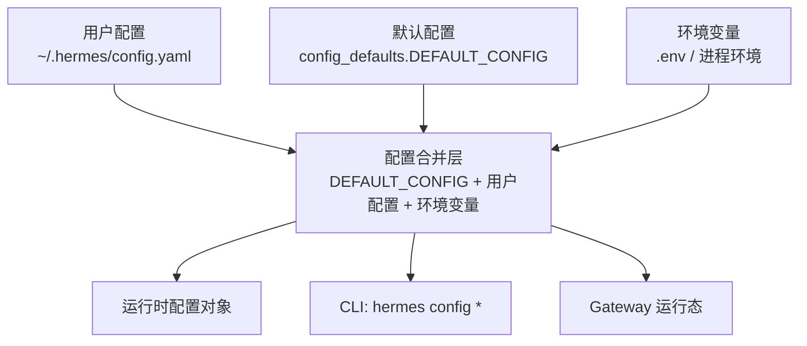
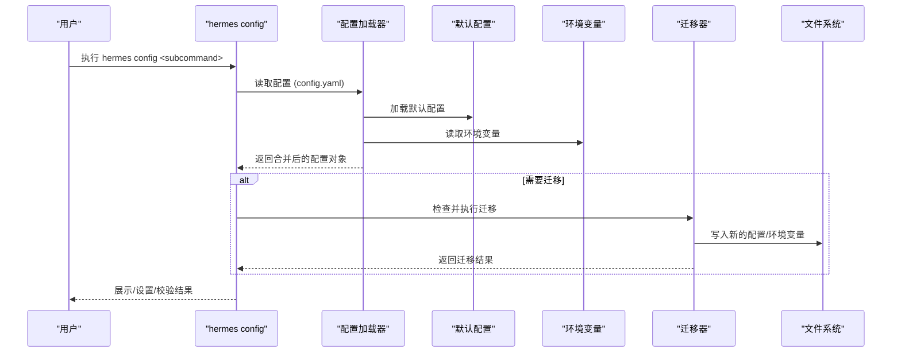
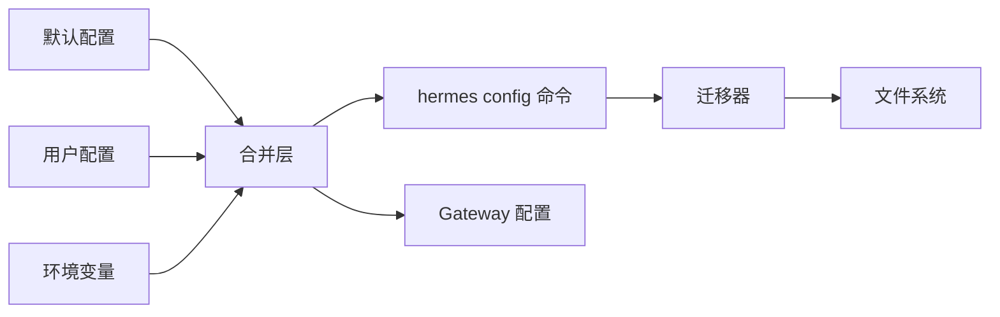

# 配置管理

<cite>
**本文引用的文件**
- [cli-config.yaml.example](file://cli-config.yaml.example)
- [hermes_cli/config.py](file://hermes_cli/config.py)
- [hermes_cli/subcommands/config.py](file://hermes_cli/subcommands/config.py)
- [hermes_cli/config_defaults.py](file://hermes_cli/config_defaults.py)
- [hermes_cli/config_migrations.py](file://hermes_cli/config_migrations.py)
- [gateway/config.py](file://gateway/config.py)
- [tests/tools/test_terminal_error_redaction.py](file://tests/tools/test_terminal_error_redaction.py)
</cite>

## 目录
1. [简介](#简介)
2. [项目结构](#项目结构)
3. [核心组件](#核心组件)
4. [架构总览](#架构总览)
5. [详细组件分析](#详细组件分析)
6. [依赖关系分析](#依赖关系分析)
7. [性能考量](#性能考量)
8. [故障排查指南](#故障排查指南)
9. [结论](#结论)
10. [附录](#附录)

## 简介
本文件面向 Hermes Agent 的配置管理系统，聚焦以下目标：
- 解释配置文件结构与层次、继承与合并机制
- 说明 hermes config 子命令的查看、修改、验证与备份能力
- 阐明环境变量与配置文件的关系与优先级规则
- 给出多环境（开发/测试/生产）配置分离策略
- 介绍配置热重载与动态更新机制
- 提供最佳实践（敏感信息保护、模板化、版本控制）
- 提供迁移与升级指南，帮助从旧版本平滑过渡到新版本

## 项目结构
Hermes 的配置由“默认配置 + 用户配置 + 环境变量”三部分组合而成，并通过 CLI 工具进行统一管理与迁移。关键位置如下：
- 示例配置模板：cli-config.yaml.example
- 配置加载与 CLI 命令实现：hermes_cli/config.py
- 子命令解析器：hermes_cli/subcommands/config.py
- 默认配置定义：hermes_cli/config_defaults.py
- 配置迁移脚本：hermes_cli/config_migrations.py
- Gateway 侧配置加载：gateway/config.py
- 安全输出脱敏（避免泄露密钥）：tests/tools/test_terminal_error_redaction.py

图表来源
- [hermes_cli/config_defaults.py:1-200](file://hermes_cli/config_defaults.py#L1-L200)
- [hermes_cli/config.py:1-200](file://hermes_cli/config.py#L1-L200)
- [cli-config.yaml.example:1-800](file://cli-config.yaml.example#L1-L800)

章节来源
- [hermes_cli/config.py:1-200](file://hermes_cli/config.py#L1-L200)
- [hermes_cli/config_defaults.py:1-200](file://hermes_cli/config_defaults.py#L1-L200)
- [cli-config.yaml.example:1-800](file://cli-config.yaml.example#L1-L800)

## 核心组件
- 配置源与合并
  - 默认配置：在 DEFAULT_CONFIG 中集中声明所有键与默认值，保证新字段可向后兼容
  - 用户配置：位于 ~/.hermes/config.yaml，覆盖默认值
  - 环境变量：通过 .env 或进程环境注入，用于密钥与运行时开关
- CLI 配置命令
  - show/edit/get/set/unset/path/env-path/check/migrate
- 配置迁移
  - 按版本号顺序执行迁移步骤，自动补齐缺失字段、清理废弃项、重命名键等
- 安全与容错
  - 解析失败时回退到默认配置并备份损坏文件
  - 输出中对敏感信息进行脱敏处理

章节来源
- [hermes_cli/config.py:45-156](file://hermes_cli/config.py#L45-L156)
- [hermes_cli/config.py:5155-5319](file://hermes_cli/config.py#L5155-L5319)
- [hermes_cli/config_migrations.py:647-686](file://hermes_cli/config_migrations.py#L647-L686)
- [tests/tools/test_terminal_error_redaction.py:1-154](file://tests/tools/test_terminal_error_redaction.py#L1-L154)

## 架构总览
下图展示了配置读取、合并、CLI 操作与迁移的整体流程。

图表来源
- [hermes_cli/config.py:5155-5319](file://hermes_cli/config.py#L5155-L5319)
- [hermes_cli/config_migrations.py:647-686](file://hermes_cli/config_migrations.py#L647-L686)
- [hermes_cli/config_defaults.py:1-200](file://hermes_cli/config_defaults.py#L1-L200)

## 详细组件分析

### 配置文件结构与层次
- 顶层键包括 model、terminal、browser、compression、prompt_caching、web、agent、mcp、tool_output、tool_loop_guardrails 等
- 各模块内部支持嵌套字典，如 terminal.backend、compression.threshold、agent.gateway_timeout 等
- 示例模板提供了详尽注释，便于理解每个键的作用与取值范围

建议：
- 将通用基线放在默认配置中，用户仅保留差异部分
- 使用分层键组织配置，避免扁平化导致冲突

章节来源
- [cli-config.yaml.example:1-800](file://cli-config.yaml.example#L1-L800)
- [hermes_cli/config_defaults.py:1-800](file://hermes_cli/config_defaults.py#L1-L800)

### 继承与合并机制
- 合并顺序：默认配置 → 用户配置 → 环境变量（对密钥与运行时开关生效）
- 默认配置集中维护，新增键不会破坏旧配置；未设置的键使用默认值
- 用户配置以 YAML 形式存在，支持覆盖任意层级键
- 环境变量优先于配置文件中对应键，适合注入密钥与敏感信息

注意：
- 某些路径/行为受环境变量影响（例如编辑器、Shell、Python/Node 相关变量），写入口受限以避免安全风险

章节来源
- [hermes_cli/config.py:157-200](file://hermes_cli/config.py#L157-L200)
- [hermes_cli/config_defaults.py:1-200](file://hermes_cli/config_defaults.py#L1-L200)

### hermes config 子命令
- show：显示当前有效配置
- edit：打开配置文件进行编辑
- get <key> [--json]：获取某个配置项的值，支持 JSON 输出
- set <key> <value> [--force]：设置配置项，--force 允许未知键写入
- unset <key>：删除配置项
- path：打印配置文件路径
- env-path：打印 .env 文件路径
- check：检查缺失或过期的配置项
- migrate：交互式迁移，补齐缺失项、清理废弃项、重命名字段

使用要点：
- 使用 get 快速定位问题
- 使用 check 了解缺失项与版本状态
- 使用 migrate 完成升级时的配置演进

章节来源
- [hermes_cli/subcommands/config.py:12-68](file://hermes_cli/subcommands/config.py#L12-L68)
- [hermes_cli/config.py:5155-5319](file://hermes_cli/config.py#L5155-L5319)

### 环境变量与配置文件的关系与优先级
- 环境变量主要用于密钥与运行时开关，优先于配置文件中同名键
- 常见密钥通过 OPTIONAL_ENV_VARS 注册，check 会提示缺失
- 写入口对危险的环境变量名进行黑名单限制，防止通过界面误改系统级变量

最佳实践：
- 将密钥放入 .env 或进程环境，不要明文写入 config.yaml
- 使用 check 定期巡检缺失的必需密钥

章节来源
- [hermes_cli/config.py:964-985](file://hermes_cli/config.py#L964-L985)
- [hermes_cli/config.py:157-200](file://hermes_cli/config.py#L157-L200)

### 多环境配置管理策略
- 开发/测试/生产可通过不同的 .env 与 config.yaml 组合实现隔离
- 推荐做法：
  - 将公共基线放入默认配置
  - 将环境差异放入各自环境的 .env（密钥）与 config.yaml（非敏感差异）
  - 通过环境变量切换不同后端、超时、日志级别等
- 容器化部署时，可在镜像中内置默认配置，运行时通过挂载 .env 与 config.yaml 注入差异

章节来源
- [cli-config.yaml.example:1-800](file://cli-config.yaml.example#L1-L800)
- [hermes_cli/config.py:1-200](file://hermes_cli/config.py#L1-L200)

### 配置热重载与动态更新
- MCP 服务器配置支持运行时自动重载（当 mcp.auto_reload_on_config_change 为 true）
- 当检测到配置变更，会自动重建工具集合并刷新 MCP 连接
- 若关闭自动重载，系统将提示通过命令手动重载

注意事项：
- 自动重载会触发工具快照重建，可能影响缓存命中
- 在生产环境中可根据稳定性需求选择关闭自动重载并采用计划内重载

章节来源
- [hermes_cli/config_defaults.py:531-543](file://hermes_cli/config_defaults.py#L531-L543)
- [gateway/config.py:937-937](file://gateway/config.py#L937-L937)

### 配置备份与错误恢复
- 当 config.yaml 无法解析时，系统会尝试将其备份为带时间戳的 .bak 文件，并回退到默认配置
- 该机制确保用户原始配置不丢失，同时保障服务可用性
- 建议在 CI/CD 中启用配置校验，提前发现语法错误

章节来源
- [hermes_cli/config.py:45-156](file://hermes_cli/config.py#L45-L156)

### 安全与敏感信息保护
- 输出中对包含密钥的字符串进行脱敏，避免在错误消息或日志中泄露
- 环境变量写入入口对危险变量名进行黑名单限制
- 建议使用专用密钥管理服务或平台提供的凭据注入方式

章节来源
- [tests/tools/test_terminal_error_redaction.py:1-154](file://tests/tools/test_terminal_error_redaction.py#L1-L154)
- [hermes_cli/config.py:157-200](file://hermes_cli/config.py#L157-L200)

### 配置迁移与升级指南
- 迁移按版本号顺序执行，确保幂等性与可追溯性
- 常见迁移类型：
  - 清理废弃的环境变量
  - 重命名字段（如 write_mode → write_approval）
  - 移动扁平键到嵌套结构（如 stt.model → provider 特定段）
  - 添加新字段并写入默认值
- 升级流程：
  - 运行 hermes config check 查看缺失项
  - 运行 hermes config migrate 执行迁移
  - 根据提示补充必要密钥或调整配置

章节来源
- [hermes_cli/config_migrations.py:647-686](file://hermes_cli/config_migrations.py#L647-L686)
- [hermes_cli/config_migrations.py:76-645](file://hermes_cli/config_migrations.py#L76-L645)

## 依赖关系分析
- 配置加载依赖默认配置与用户配置，环境变量作为运行时覆盖
- CLI 命令通过子命令解析器绑定到具体处理函数
- 迁移器依赖配置加载器提供的读写接口，按版本顺序执行
- Gateway 侧使用独立配置加载逻辑，但同样遵循默认+用户+环境变量的合并原则

图表来源
- [hermes_cli/config.py:1-200](file://hermes_cli/config.py#L1-L200)
- [hermes_cli/config_defaults.py:1-200](file://hermes_cli/config_defaults.py#L1-L200)
- [hermes_cli/config_migrations.py:647-686](file://hermes_cli/config_migrations.py#L647-L686)
- [gateway/config.py:937-937](file://gateway/config.py#L937-L937)

章节来源
- [hermes_cli/config.py:1-200](file://hermes_cli/config.py#L1-L200)
- [hermes_cli/config_defaults.py:1-200](file://hermes_cli/config_defaults.py#L1-L200)
- [hermes_cli/config_migrations.py:647-686](file://hermes_cli/config_migrations.py#L647-L686)
- [gateway/config.py:937-937](file://gateway/config.py#L937-L937)

## 性能考量
- 自动压缩与上下文管理：合理设置 compression.threshold 与 target_ratio，避免频繁压缩带来的开销
- MCP 自动重载：在高并发场景下可考虑关闭自动重载，改为计划内重载以减少缓存失效
- 数据库 WAL 模式：根据文件系统特性选择合适的 journal_mode，提升并发写入性能
- 工具输出截断：通过 tool_output 限制终端输出大小，减少上下文占用

[本节为通用指导，无需特定文件引用]

## 故障排查指南
- 配置解析失败：检查 config.yaml 语法，查看是否已生成 .bak 备份文件
- 密钥未生效：确认环境变量是否正确设置，使用 hermes config get 验证最终值
- 迁移后行为异常：使用 hermes config check 查看缺失项，必要时重新运行 migrate
- 输出泄露风险：确认脱敏机制生效，避免在日志中打印完整密钥

章节来源
- [hermes_cli/config.py:45-156](file://hermes_cli/config.py#L45-L156)
- [tests/tools/test_terminal_error_redaction.py:1-154](file://tests/tools/test_terminal_error_redaction.py#L1-L154)

## 结论
Hermes 的配置系统通过“默认配置 + 用户配置 + 环境变量”的分层设计，结合 CLI 工具与迁移机制，实现了安全、可维护且易于演进的配置管理。建议在生产环境中：
- 严格区分环境与密钥
- 启用配置校验与备份
- 谨慎选择热重载策略
- 定期执行迁移与巡检

[本节为总结性内容，无需特定文件引用]

## 附录
- 常用命令速查
  - hermes config show
  - hermes config get <key>
  - hermes config set <key> <value>
  - hermes config unset <key>
  - hermes config check
  - hermes config migrate
- 最佳实践清单
  - 使用 .env 管理密钥
  - 使用模板化配置（基于 cli-config.yaml.example）
  - 在 CI 中执行 hermes config check
  - 定期备份 config.yaml 与 .env
  - 使用迁移命令平滑升级

[本节为补充信息，无需特定文件引用]