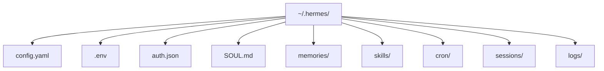
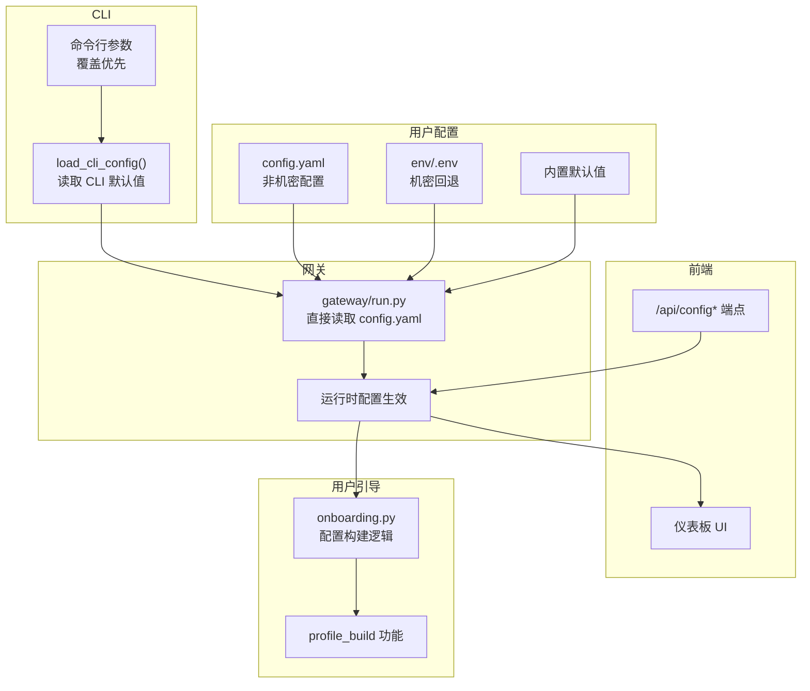
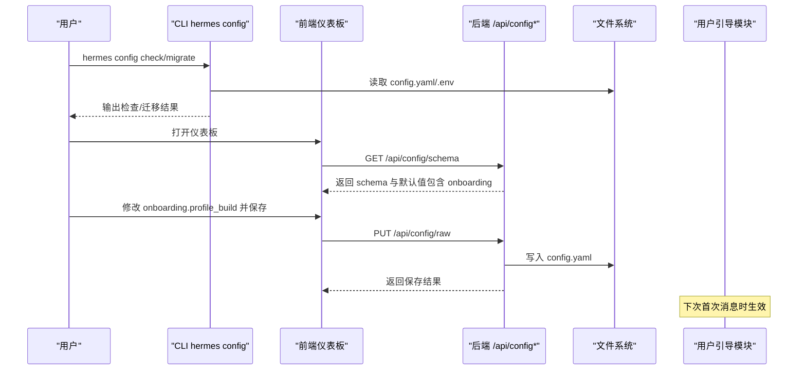
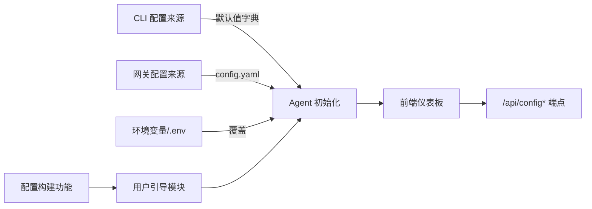
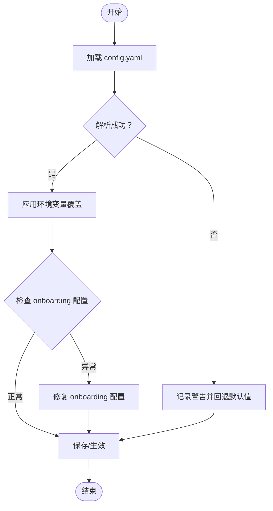

# 配置管理

<cite>
**本文引用的文件**
- [配置（中文）](file://website/i18n/zh-Hans/docusaurus-plugin-content-docs/current/user-guide/configuration.md)
- [CLI 命令（中文）](file://website/i18n/zh-Hans/docusaurus-plugin-content-docs/current/reference/cli-commands.md)
- [配置模型与提供者（中文）](file://website/i18n/zh-Hans/docusaurus-plugin-content-docs/current/user-guide/configuring-models.md)
- [网关内部（中文）](file://website/i18n/zh-Hans/docusaurus-plugin-content-docs/current/developer-guide/gateway-internals.md)
- [测试：配置加载与回退（中文）](file://tests/hermes_cli/test_config.py)
- [测试：Web 服务器配置接口（中文）](file://tests/hermes_cli/test_web_server.py)
- [前端 API（中文）](file://web/src/lib/api.ts)
- [TUI 网关上下文（中文）](file://ui-tui/src/app/createGatewayEventHandler.ts)
- [用户引导模块（中文）](file://agent/onboarding.py)
- [网关运行入口（中文）](file://gateway/run.py)
- [CLI Web 服务器（中文）](file://hermes_cli/web_server.py)
- [测试：用户引导（中文）](file://tests/agent/test_onboarding.py)
- [CLI 配置示例（中文）](file://cli-config.yaml.example)
</cite>

## 更新摘要
**所做更改**
- 新增用户引导配置构建功能章节，详细介绍 onboarding.profile_build 配置选项
- 更新配置文件结构与可用选项部分，添加新的 onboarding 配置块
- 更新配置热重载与验证部分，包含用户引导功能的热重载机制
- 更新配置迁移与备份恢复策略，添加用户引导配置的处理
- 更新仪表板配置折叠功能，说明 onboarding.profile_build 与仪表板布局的关系

## 目录
1. [简介](#简介)
2. [项目结构](#项目结构)
3. [核心组件](#核心组件)
4. [架构总览](#架构总览)
5. [详细组件分析](#详细组件分析)
6. [依赖关系分析](#依赖关系分析)
7. [性能考量](#性能考量)
8. [故障排查指南](#故障排查指南)
9. [结论](#结论)
10. [附录](#附录)

## 简介
本指南面向 Hermes Agent 的配置管理，围绕 config.yaml 展开，系统讲解配置结构、优先级与覆盖规则、命令行参数覆盖、环境变量替换、配置热重载与验证、迁移与备份恢复策略，以及在不同环境下的配置管理最佳实践。文档同时结合 CLI、网关与前端的实现，帮助读者在开发与运维场景中高效、安全地管理配置。

**更新** 新增用户引导配置构建功能，包括 onboarding.profile_build 配置选项和相关的仪表板配置折叠功能。

## 项目结构
Hermes 的配置主要位于用户主目录的 ~/.hermes/ 下，关键文件包括：
- config.yaml：非机密配置主文件（模型、显示、终端、压缩、委托、辅助任务、用户引导等）
- .env：机密信息（API Key、Token、密码等）
- auth.json：OAuth 凭据（如 Nous Portal）
- SOUL.md：Agent 身份（系统提示词槽位）
- memories/、skills/、cron/、sessions/、logs/：运行期数据与状态

**章节来源**
- [配置（中文）: 9-24:9-24](file://website/i18n/zh-Hans/docusaurus-plugin-content-docs/current/user-guide/configuration.md#L9-L24)

## 核心组件
- 配置文件与来源
  - config.yaml：集中存放非机密配置项，如 model、display、terminal、compression、delegation、auxiliary、onboarding 等
  - .env：存放机密信息，作为回退来源
  - 环境变量：可覆盖 config.yaml 与 .env 的值
  - 内置默认值：未设置时的安全兜底
- CLI 与网关
  - hermes config 子命令用于查看、编辑、设置、检查、迁移配置
  - 网关直接读取 config.yaml，不走 CLI 默认值字典，因此 CLI 与网关间存在差异
- 前端与仪表板
  - /api/config、/api/config/schema、/api/config/defaults、/api/config/raw、/api/env 等端点提供配置读取、校验与保存能力
  - onboarding.profile_build 配置影响仪表板布局和配置折叠行为

**更新** 新增 onboarding 配置块，支持用户引导配置构建功能。

**章节来源**
- [配置（中文）: 26-74:26-74](file://website/i18n/zh-Hans/docusaurus-plugin-content-docs/current/user-guide/configuration.md#L26-L74)
- [CLI 命令（中文）: 755-772:755-772](file://website/i18n/zh-Hans/docusaurus-plugin-content-docs/current/reference/cli-commands.md#L755-L772)
- [网关内部（中文）: 132-142:132-142](file://website/i18n/zh-Hans/docusaurus-plugin-content-docs/current/developer-guide/gateway-internals.md#L132-L142)
- [前端 API（中文）: 339-365:339-365](file://web/src/lib/api.ts#L339-L365)

## 架构总览
下图展示配置在 CLI、网关与前端之间的流向与覆盖关系，包括用户引导功能：

**图表来源**
- [配置（中文）: 45-56:45-56](file://website/i18n/zh-Hans/docusaurus-plugin-content-docs/current/user-guide/configuration.md#L45-L56)
- [网关内部（中文）: 132-142:132-142](file://website/i18n/zh-Hans/docusaurus-plugin-content-docs/current/developer-guide/gateway-internals.md#L132-L142)
- [前端 API（中文）: 339-365:339-365](file://web/src/lib/api.ts#L339-L365)
- [用户引导模块（中文）: 134-154:134-154](file://agent/onboarding.py#L134-L154)

**章节来源**
- [配置（中文）: 45-56:45-56](file://website/i18n/zh-Hans/docusaurus-plugin-content-docs/current/user-guide/configuration.md#L45-L56)
- [网关内部（中文）: 132-142:132-142](file://website/i18n/zh-Hans/docusaurus-plugin-content-docs/current/developer-guide/gateway-internals.md#L132-L142)
- [前端 API（中文）: 339-365:339-365](file://web/src/lib/api.ts#L339-L365)

## 详细组件分析

### 配置优先级与覆盖规则
- 解析顺序（从高到低）
  1) 命令行参数（单次调用覆盖）
  2) ~/.hermes/config.yaml
  3) ~/.hermes/.env
  4) 内置默认值
- 经验法则
  - 机密（API Key、Token、密码）放入 .env
  - 其他（模型、终端后端、压缩、内存限制、工具集、用户引导配置）放入 config.yaml
  - 当两者都设置时，config.yaml 对非机密项优先

**章节来源**
- [配置（中文）: 45-56:45-56](file://website/i18n/zh-Hans/docusaurus-plugin-content-docs/current/user-guide/configuration.md#L45-L56)

### 环境变量替换
- 在 config.yaml 中使用 ${VAR_NAME} 语法引用环境变量
- 支持在同一值中出现多个引用（如 url: "${HOST}:${PORT}"）
- 未设置的变量将保持原样（${UNDEFINED_VAR} 不展开）
- 仅支持 ${VAR} 语法，裸体 $VAR 不展开

**章节来源**
- [配置（中文）: 58-73:58-73](file://website/i18n/zh-Hans/docusaurus-plugin-content-docs/current/user-guide/configuration.md#L58-L73)

### 配置文件结构与可用选项
- config.yaml 的常见配置块
  - model：模型与提供商选择（含回退链与推理配置）
  - display：显示与交互行为（如 TUI 提示、代理面板开关等）
  - terminal：终端后端与运行环境（容器、进程等）
  - compression：上下文压缩策略与缓存
  - delegation：委派与外部协作
  - auxiliary.*：辅助任务与回退链（vision、web_extract、compression、skills_hub、mcp、approval、title_generation、triage_specifier 等）
  - **onboarding：用户引导配置（新增）**
    - onboarding.profile_build：控制是否在首次接触时提供配置构建流程
    - onboarding.seen：内部标记字典，记录已显示的引导提示
- CLI 与网关差异
  - CLI 使用 load_cli_config() 读取默认值字典，网关直接读取 config.yaml
  - 因此某些键在 CLI 默认值中存在但在用户配置中缺失时，CLI 与网关表现可能不同

**更新** 新增 onboarding 配置块，包含 profile_build 和 seen 两个子选项。

**章节来源**
- [配置（中文）: 26-74:26-74](file://website/i18n/zh-Hans/docusaurus-plugin-content-docs/current/user-guide/configuration.md#L26-L74)
- [网关内部（中文）: 132-142:132-142](file://website/i18n/zh-Hans/docusaurus-plugin-content-docs/current/developer-guide/gateway-internals.md#L132-L142)
- [用户引导模块（中文）: 134-154:134-154](file://agent/onboarding.py#L134-L154)

### 用户引导配置构建功能
- onboarding.profile_build 配置选项
  - 默认值：'ask'
  - 支持值：
    - 'ask'：首次接触时提供配置构建流程（默认行为）
    - 'off'：禁用配置构建流程，仅显示普通介绍
  - 配置位置：config.yaml 中的 onboarding.profile_build
- 用户引导工作原理
  - 首次消息时检查 onboarding.profile_build 设置
  - 如果设置为 'ask' 且尚未提供过引导，则插入配置构建指令
  - 引导完成后标记 onboarding.seen.profile_build_offered 为已显示
  - 后续消息使用普通介绍文本
- 仪表板配置折叠
  - onboarding.profile_build 被归类到 agent 分类中
  - 由于是唯一的 onboarding 配置字段，被折叠到 agent 标签页
  - 与其他 messaging-platform 配置合并，避免产生孤立的标签页

**更新** 新增用户引导配置构建功能的详细说明。

**章节来源**
- [用户引导模块（中文）: 134-154:134-154](file://agent/onboarding.py#L134-L154)
- [用户引导模块（中文）: 157-183:157-183](file://agent/onboarding.py#L157-L183)
- [网关运行入口（中文）: 9454-9482:9454-9482](file://gateway/run.py#L9454-L9482)
- [CLI Web 服务器（中文）: 513-521:513-521](file://hermes_cli/web_server.py#L513-L521)

### 配置热重载与验证
- 热重载
  - 网关通过直接读取 config.yaml 实现热重载；修改后重启相关服务即可生效
  - 前端通过 /api/config/raw 获取/保存原始 YAML 文本，支持在线编辑与保存
  - **用户引导配置热重载**：修改 onboarding.profile_build 后，下次首次消息时生效
- 验证
  - hermes config check 可检查缺失或过期配置
  - hermes config migrate 可交互式添加新增选项
  - 前端 /api/config/schema 返回字段与分类顺序，用于 UI 呈现与校验
  - 前端 /api/config/defaults 返回默认值，用于对比与补全
  - **仪表板配置折叠验证**：确认 onboarding.profile_build 正确归类到 agent 分类

**图表来源**
- [CLI 命令（中文）: 755-772:755-772](file://website/i18n/zh-Hans/docusaurus-plugin-content-docs/current/reference/cli-commands.md#L755-L772)
- [前端 API（中文）: 339-365:339-365](file://web/src/lib/api.ts#L339-L365)
- [CLI Web 服务器（中文）: 513-521:513-521](file://hermes_cli/web_server.py#L513-L521)

**章节来源**
- [CLI 命令（中文）: 755-772:755-772](file://website/i18n/zh-Hans/docusaurus-plugin-content-docs/current/reference/cli-commands.md#L755-L772)
- [前端 API（中文）: 339-365:339-365](file://web/src/lib/api.ts#L339-L365)

### 配置迁移、备份与恢复
- 迁移
  - 使用 hermes config migrate 交互式添加新增配置项
  - 使用 hermes config check 检查缺失或过期项
  - **用户引导配置迁移**：新安装的用户自动获得默认的 onboarding.profile_build: ask
- 备份
  - 备份 ~/.hermes/ 目录（包含 config.yaml、.env、auth.json、SOUL.md 等）
  - **备份用户引导状态**：config.yaml 中的 onboarding.seen 字典包含已显示的引导提示标记
- 恢复
  - 将备份的 ~/.hermes/ 目录还原至原位，重启相关服务
  - 如需保留机密，确保 .env 与 auth.json 的权限正确
  - **恢复用户引导状态**：恢复后的配置继续跟踪已显示的引导提示

**更新** 新增用户引导配置的迁移、备份和恢复说明。

**章节来源**
- [配置（中文）: 26-74:26-74](file://website/i18n/zh-Hans/docusaurus-plugin-content-docs/current/user-guide/configuration.md#L26-L74)
- [CLI 命令（中文）: 755-772:755-772](file://website/i18n/zh-Hans/docusaurus-plugin-content-docs/current/reference/cli-commands.md#L755-L772)
- [用户引导模块（中文）: 203-235:203-235](file://agent/onboarding.py#L203-L235)

### 配置与环境变量的关系
- 环境变量可覆盖 config.yaml 与 .env 的值
- config.yaml 支持 ${VAR} 占位符展开
- 网关从多个来源读取配置：~/.hermes/.env、~/.hermes/config.yaml、环境变量
- CLI 与网关的配置来源不同，导致某些键在两者间表现差异

**章节来源**
- [配置（中文）: 45-56:45-56](file://website/i18n/zh-Hans/docusaurus-plugin-content-docs/current/user-guide/configuration.md#L45-L56)
- [网关内部（中文）: 132-142:132-142](file://website/i18n/zh-Hans/docusaurus-plugin-content-docs/current/developer-guide/gateway-internals.md#L132-L142)

### 命令行参数覆盖配置
- CLI 参数优先级最高，仅影响本次调用
- hermes chat 等命令支持 --model、--toolsets、--provider 等参数
- hermes config set 会将机密写入 .env，其他写入 config.yaml

**章节来源**
- [配置（中文）: 45-56:45-56](file://website/i18n/zh-Hans/docusaurus-plugin-content-docs/current/user-guide/configuration.md#L45-L56)
- [CLI 命令（中文）: 755-772:755-772](file://website/i18n/zh-Hans/docusaurus-plugin-content-docs/current/reference/cli-commands.md#L755-L772)

### 配置语法、数据类型与验证规则
- 语法
  - YAML 格式，支持对象、数组、字符串、数字、布尔等
  - 支持 ${VAR} 环境变量占位符
- 数据类型
  - 字符串、整数、浮点数、布尔、列表、字典
- 验证规则
  - 前端 /api/config/schema 返回字段定义与分类顺序
  - hermes config check 用于发现缺失或过期配置
  - .env 与 config.yaml 的分离有助于避免机密泄露
  - **仪表板配置折叠验证**：确认 onboarding 配置正确归类到 agent 分类

**更新** 新增仪表板配置折叠的验证说明。

**章节来源**
- [配置（中文）: 58-73:58-73](file://website/i18n/zh-Hans/docusaurus-plugin-content-docs/current/user-guide/configuration.md#L58-L73)
- [前端 API（中文）: 339-365:339-365](file://web/src/lib/api.ts#L339-L365)
- [CLI Web 服务器（中文）: 513-521:513-521](file://hermes_cli/web_server.py#L513-L521)

### 完整示例与注释说明
- 示例文件
  - datagen-config-examples/trajectory_compression.yaml、web_research.yaml 提供了配置片段示例
  - **新增用户引导配置示例**：在 config.yaml 中添加 onboarding 配置块
- 注释说明
  - 在 config.yaml 中添加注释以解释各配置项用途与取值范围
  - 对敏感项使用 .env 并在 config.yaml 中以 ${VAR} 引用
  - **用户引导配置注释**：说明 onboarding.profile_build 的作用和可选值

**更新** 新增用户引导配置的示例和注释说明。

**章节来源**
- [配置（中文）: 26-74:26-74](file://website/i18n/zh-Hans/docusaurus-plugin-content-docs/current/user-guide/configuration.md#L26-L74)
- [CLI 配置示例（中文）: 300-312:300-312](file://cli-config.yaml.example#L300-L312)

### 配置热重载机制
- 网关直接读取 config.yaml，修改后重启相关服务即可生效
- 前端通过 /api/config/raw 获取/保存 YAML，支持在线编辑
- TUI 端在启动时拉取 display.* 等配置，确保显示行为一致
- **用户引导配置热重载**：修改 onboarding.profile_build 后，在下次首次消息时生效

**更新** 新增用户引导配置的热重载说明。

**章节来源**
- [网关内部（中文）: 132-142:132-142](file://website/i18n/zh-Hans/docusaurus-plugin-content-docs/current/developer-guide/gateway-internals.md#L132-L142)
- [前端 API（中文）: 339-365:339-365](file://web/src/lib/api.ts#L339-L365)
- [TUI 网关上下文（中文）: 155-198:155-198](file://ui-tui/src/app/createGatewayEventHandler.ts#L155-L198)

## 依赖关系分析
- CLI 与网关的配置来源差异
  - CLI 使用 load_cli_config() 读取默认值字典
  - 网关直接读取 config.yaml，不依赖 CLI 默认值
- 前端依赖后端 /api/config* 端点获取与保存配置
- .env 与 config.yaml 的分离降低机密泄露风险
- **用户引导功能依赖**
  - 网关运行时读取 onboarding 配置决定是否提供配置构建流程
  - 用户引导模块负责配置构建逻辑和状态跟踪
  - 仪表板根据配置折叠规则显示 onboarding 设置

**更新** 新增用户引导功能的依赖关系分析。

**图表来源**
- [网关内部（中文）: 132-142:132-142](file://website/i18n/zh-Hans/docusaurus-plugin-content-docs/current/developer-guide/gateway-internals.md#L132-L142)
- [前端 API（中文）: 339-365:339-365](file://web/src/lib/api.ts#L339-L365)
- [用户引导模块（中文）: 134-154:134-154](file://agent/onboarding.py#L134-L154)

**章节来源**
- [网关内部（中文）: 132-142:132-142](file://website/i18n/zh-Hans/docusaurus-plugin-content-docs/current/developer-guide/gateway-internals.md#L132-L142)
- [前端 API（中文）: 339-365:339-365](file://web/src/lib/api.ts#L339-L365)

## 性能考量
- 配置热重载建议在非高峰时段进行，避免频繁重启带来的短暂中断
- 对于大型配置文件，建议拆分常用与高级选项，减少不必要的变更
- 使用 .env 存放机密，避免在 config.yaml 中明文存储，提升安全性
- **用户引导配置性能**：onboarding.profile_build 仅在首次消息时检查，对正常运行无性能影响

**更新** 新增用户引导配置的性能考量。

## 故障排查指南
- 配置加载失败与回退
  - 当 config.yaml 存在语法错误或格式问题时，系统会回退到默认配置并发出警告
  - 重复加载同一文件时会去重警告，编辑文件后 mtime 变化会触发重新警告
- 配置校验
  - 使用 hermes config check 发现缺失或过期配置
  - 使用 hermes config migrate 交互式补齐新增项
  - **用户引导配置校验**：检查 onboarding.seen 字典的完整性
- 前端配置接口
  - /api/config/schema 返回字段定义，/api/config/defaults 返回默认值
  - /api/config/raw 支持获取/保存原始 YAML 文本
  - **仪表板配置折叠故障排查**：确认 onboarding.profile_build 正确显示在 agent 标签页

**图表来源**
- [测试：配置加载与回退（中文）: 100-157:100-157](file://tests/hermes_cli/test_config.py#L100-L157)
- [测试：用户引导（中文）: 307-312:307-312](file://tests/agent/test_onboarding.py#L307-L312)

**章节来源**
- [测试：配置加载与回退（中文）: 100-157:100-157](file://tests/hermes_cli/test_config.py#L100-L157)
- [测试：Web 服务器配置接口（中文）: 806-830:806-830](file://tests/hermes_cli/test_web_server.py#L806-L830)
- [前端 API（中文）: 339-365:339-365](file://web/src/lib/api.ts#L339-L365)

## 结论
Hermes Agent 的配置管理以 config.yaml 为核心，配合 .env 与环境变量实现灵活覆盖与安全隔离。CLI、网关与前端通过统一的 API 与 schema 实现配置的可视化、校验与热重载。新增的用户引导配置构建功能提供了可选的配置构建流程，通过 onboarding.profile_build 控制是否启用。遵循"机密进 .env、其他进 config.yaml"的经验法则，结合迁移、备份与恢复策略，可在多环境中稳定地管理配置。

**更新** 新增用户引导配置构建功能的总结。

## 附录
- 相关命令
  - hermes config show/edit/set/path/env-path/check/migrate
- 相关端点
  - /api/config、/api/config/defaults、/api/config/schema、/api/config/raw、/api/env
- **新增配置选项**
  - onboarding.profile_build：控制用户引导配置构建功能（'ask' 或 'off'）
  - onboarding.seen：内部状态标记字典

**更新** 新增用户引导配置选项的附录信息。

**章节来源**
- [CLI 命令（中文）: 755-772:755-772](file://website/i18n/zh-Hans/docusaurus-plugin-content-docs/current/reference/cli-commands.md#L755-L772)
- [前端 API（中文）: 339-365:339-365](file://web/src/lib/api.ts#L339-L365)
- [用户引导模块（中文）: 134-154:134-154](file://agent/onboarding.py#L134-L154)