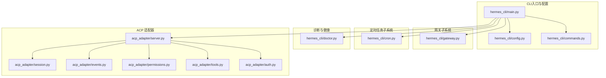
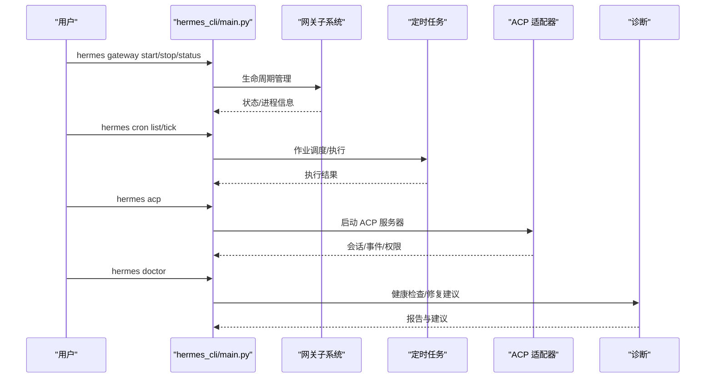
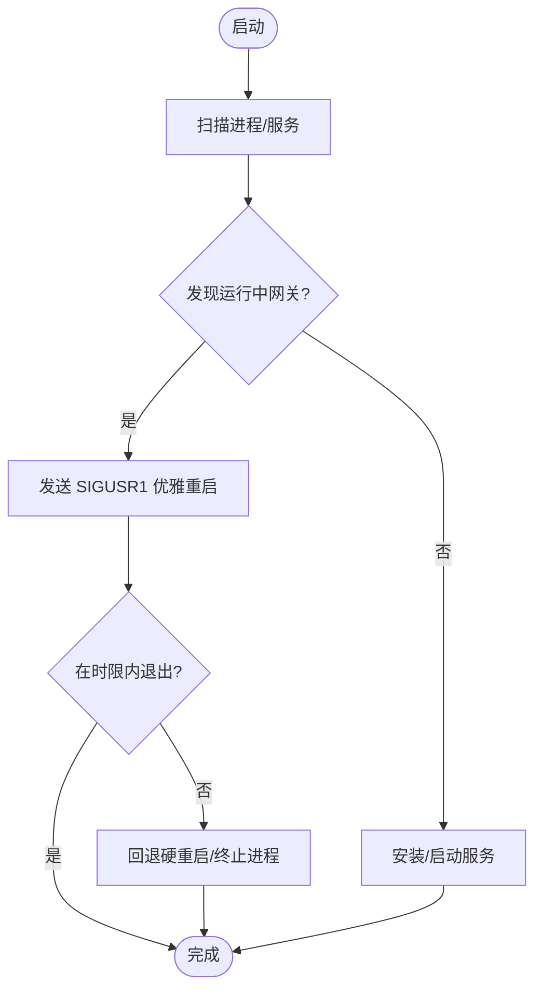
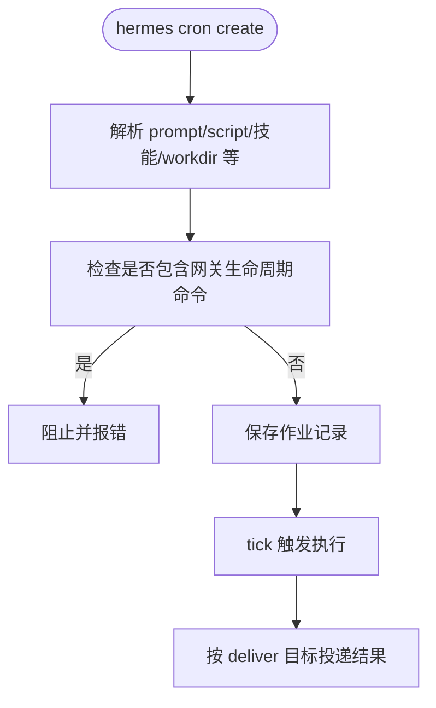
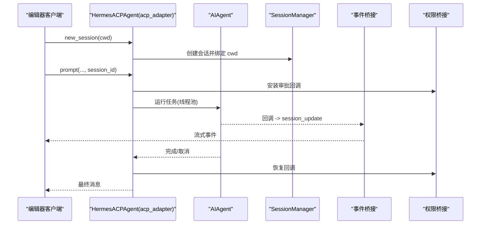
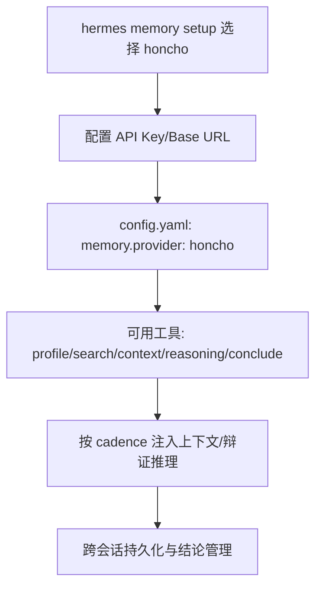
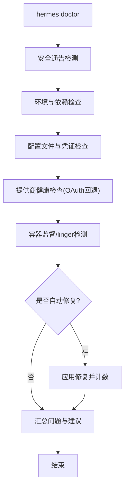
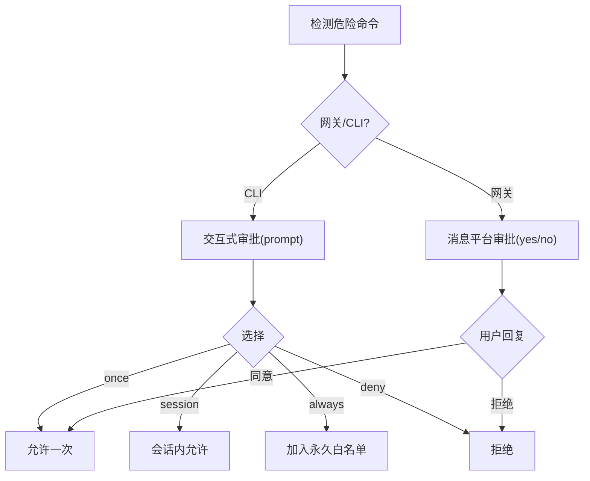
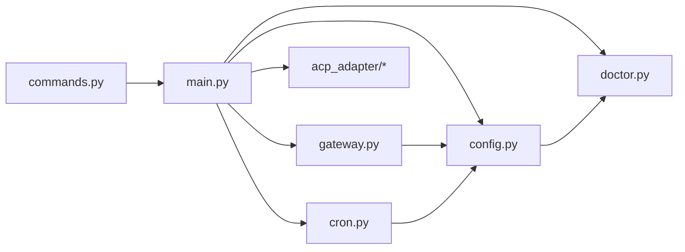

# 高级功能

<cite>
**本文引用的文件**
- [hermes_cli/main.py](file://hermes_cli/main.py)
- [hermes_cli/gateway.py](file://hermes_cli/gateway.py)
- [hermes_cli/cron.py](file://hermes_cli/cron.py)
- [hermes_cli/doctor.py](file://hermes_cli/doctor.py)
- [hermes_cli/commands.py](file://hermes_cli/commands.py)
- [hermes_cli/config.py](file://hermes_cli/config.py)
- [acp_adapter/server.py](file://acp_adapter/server.py)
- [acp_adapter/session.py](file://acp_adapter/session.py)
- [acp_adapter/events.py](file://acp_adapter/events.py)
- [acp_adapter/permissions.py](file://acp_adapter/permissions.py)
- [acp_adapter/tools.py](file://acp_adapter/tools.py)
- [acp_adapter/auth.py](file://acp_adapter/auth.py)
- [website/docs/reference/cli-commands.md](file://website/docs/reference/cli-commands.md)
- [website/docs/user-guide/features/acp.md](file://website/docs/user-guide/features/acp.md)
- [website/docs/user-guide/features/honcho.md](file://website/docs/user-guide/features/honcho.md)
- [website/docs/user-guide/security.md](file://website/docs/user-guide/security.md)
- [website/docs/developer-guide/architecture.md](file://website/docs/developer-guide/architecture.md)
</cite>

## 目录
1. [简介](#简介)
2. [项目结构](#项目结构)
3. [核心组件](#核心组件)
4. [架构总览](#架构总览)
5. [详细组件分析](#详细组件分析)
6. [依赖分析](#依赖分析)
7. [性能考虑](#性能考虑)
8. [故障排除指南](#故障排除指南)
9. [结论](#结论)
10. [附录](#附录)

## 简介
本指南聚焦于 Hermes Agent CLI 的高级功能与运维实践，涵盖：
- 网关（Gateway）生命周期管理与服务化部署
- 定时任务（Cron）调度与安全防护
- ACP 服务器与编辑器集成
- Honcho 持久化记忆与多智能体对齐
- 诊断与健康检查（doctor）、日志与可观测性
- 性能监控与优化
- 批量与自动化脚本
- 高级安全与权限控制
- 与其他系统集成的高级方法

目标读者为需要在生产环境稳定运行、扩展与集成 Hermes 的工程师与高级用户。

## 项目结构
Hermes CLI 采用“命令子系统 + 插件/平台适配”的分层架构。顶层入口负责解析命令、加载配置与日志、初始化运行时；各子系统（网关、定时任务、ACp、内存插件等）通过统一接口与核心 Agent 协作。

**图示来源**
- [website/docs/developer-guide/architecture.md:51-134](file://website/docs/developer-guide/architecture.md#L51-L134)
- [hermes_cli/main.py:1-120](file://hermes_cli/main.py#L1-L120)
- [hermes_cli/gateway.py:1-120](file://hermes_cli/gateway.py#L1-L120)
- [hermes_cli/cron.py:1-60](file://hermes_cli/cron.py#L1-L60)
- [hermes_cli/doctor.py:1-60](file://hermes_cli/doctor.py#L1-L60)
- [acp_adapter/server.py:1-60](file://acp_adapter/server.py#L1-L60)

**章节来源**
- [website/docs/developer-guide/architecture.md:51-134](file://website/docs/developer-guide/architecture.md#L51-L134)

## 核心组件
- CLI 入口与命令注册：顶层入口解析参数、加载配置与日志，注册命令与子系统。
- 网关管理：进程扫描、服务化（systemd/launchd）、优雅重启、状态查询。
- 定时任务：作业创建/编辑/暂停/恢复/触发、安全模式（禁止网关生命周期指令）。
- 诊断与健康：版本一致性、依赖、配置文件、凭证、容器监督、服务挂起检测。
- ACP 适配器：JSON-RPC stdio 服务器、会话管理、事件桥接、权限桥接、工具渲染、认证复用。
- 内存与记忆：Honcho 作为内存提供者，提供跨会话持久化、用户画像、辩证推理与结论管理。

**章节来源**
- [hermes_cli/main.py:1-120](file://hermes_cli/main.py#L1-L120)
- [hermes_cli/commands.py:64-200](file://hermes_cli/commands.py#L64-L200)
- [hermes_cli/gateway.py:557-620](file://hermes_cli/gateway.py#L557-L620)
- [hermes_cli/cron.py:190-246](file://hermes_cli/cron.py#L190-L246)
- [hermes_cli/doctor.py:448-520](file://hermes_cli/doctor.py#L448-L520)
- [acp_adapter/server.py:1-60](file://acp_adapter/server.py#L1-L60)
- [acp_adapter/session.py:1-60](file://acp_adapter/session.py#L1-L60)
- [acp_adapter/events.py:1-60](file://acp_adapter/events.py#L1-L60)
- [acp_adapter/permissions.py:1-60](file://acp_adapter/permissions.py#L1-L60)
- [acp_adapter/tools.py:1-60](file://acp_adapter/tools.py#L1-L60)
- [acp_adapter/auth.py:1-60](file://acp_adapter/auth.py#L1-L60)

## 架构总览
Hermes CLI 通过统一入口协调各子系统。网关与定时任务在后台运行，提供事件驱动与周期性能力；ACP 适配器将 Agent 能力暴露给编辑器；诊断模块贯穿运行时健康检查与修复建议。

**图示来源**
- [hermes_cli/main.py:1-120](file://hermes_cli/main.py#L1-L120)
- [hermes_cli/gateway.py:557-620](file://hermes_cli/gateway.py#L557-L620)
- [hermes_cli/cron.py:150-188](file://hermes_cli/cron.py#L150-L188)
- [acp_adapter/server.py:1-60](file://acp_adapter/server.py#L1-L60)
- [hermes_cli/doctor.py:448-520](file://hermes_cli/doctor.py#L448-L520)

## 详细组件分析

### 网关（Gateway）管理
- 进程发现与扫描：跨平台进程表扫描、服务管理器 PID 查询、祖先链排除，避免误判 CLI 进程。
- 服务化与守护：systemd/launchd 单元状态、环境变量镜像、linger 检测；支持全局与按配置文件扫描。
- 优雅重启与自重启：SIGUSR1 触发 drain-aware 重启，等待在途任务完成；失败回退硬重启路径。
- 状态与诊断：结合进程扫描与服务状态，输出 PID、运行状态与建议。

**图示来源**
- [hermes_cli/gateway.py:309-584](file://hermes_cli/gateway.py#L309-L584)
- [hermes_cli/gateway.py:225-277](file://hermes_cli/gateway.py#L225-L277)

**章节来源**
- [hermes_cli/gateway.py:557-620](file://hermes_cli/gateway.py#L557-L620)
- [hermes_cli/gateway.py:225-277](file://hermes_cli/gateway.py#L225-L277)
- [hermes_cli/gateway.py:309-584](file://hermes_cli/gateway.py#L309-L584)

### 定时任务（Cron）与安全
- 作业管理：创建、编辑、暂停/恢复、立即触发、删除、状态与列表展示。
- 安全防护：禁止在作业内容中包含网关生命周期命令（restart/stop/kill），防止重启风暴。
- 与网关联动：当网关未运行时提示安装/前台运行；显示下次执行时间与交付目标。

**图示来源**
- [hermes_cli/cron.py:190-246](file://hermes_cli/cron.py#L190-L246)
- [hermes_cli/cron.py:203-211](file://hermes_cli/cron.py#L203-L211)
- [hermes_cli/cron.py:150-188](file://hermes_cli/cron.py#L150-L188)

**章节来源**
- [hermes_cli/cron.py:190-246](file://hermes_cli/cron.py#L190-L246)
- [hermes_cli/cron.py:203-211](file://hermes_cli/cron.py#L203-L211)
- [hermes_cli/cron.py:150-188](file://hermes_cli/cron.py#L150-L188)

### ACP 服务器与编辑器集成
- 启动与协议：以 stdio JSON-RPC 运行，保留 stdout 用于协议，stderr 输出日志。
- 会话管理：按编辑器 cwd 绑定任务作用域，支持新建、加载、fork、列出与清理。
- 事件桥接：将 Agent 回调（工具进度、思考、步骤）转为 ACP 事件，异步线程安全转发。
- 权限桥接：将危险命令审批映射为“一次/总是/拒绝”，超时与失败默认拒绝。
- 工具渲染：将文件/终端/搜索等工具结果渲染为编辑器友好内容。
- 认证复用：复用 Hermes 运行时解析器，继承当前 provider/凭据；首次运行可通过终端认证方法引导 setup。

**图示来源**
- [acp_adapter/server.py:1-60](file://acp_adapter/server.py#L1-L60)
- [acp_adapter/session.py:1-60](file://acp_adapter/session.py#L1-L60)
- [acp_adapter/events.py:1-60](file://acp_adapter/events.py#L1-L60)
- [acp_adapter/permissions.py:1-60](file://acp_adapter/permissions.py#L1-L60)
- [acp_adapter/tools.py:1-60](file://acp_adapter/tools.py#L1-L60)
- [acp_adapter/auth.py:1-60](file://acp_adapter/auth.py#L1-L60)

**章节来源**
- [website/docs/user-guide/features/acp.md:1-219](file://website/docs/user-guide/features/acp.md#L1-L219)
- [website/docs/developer-guide/acp-internals.md:1-184](file://website/docs/developer-guide/acp-internals.md#L1-L184)
- [acp_adapter/server.py:1-60](file://acp_adapter/server.py#L1-L60)
- [acp_adapter/session.py:1-60](file://acp_adapter/session.py#L1-L60)
- [acp_adapter/events.py:1-60](file://acp_adapter/events.py#L1-L60)
- [acp_adapter/permissions.py:1-60](file://acp_adapter/permissions.py#L1-L60)
- [acp_adapter/tools.py:1-60](file://acp_adapter/tools.py#L1-L60)
- [acp_adapter/auth.py:1-60](file://acp_adapter/auth.py#L1-L60)

### Honcho 持久化记忆与多智能体
- 功能增强：跨会话持久化、用户画像、会话摘要、多智能体隔离、语义检索、结论管理。
- 工具集：profile/read/update、search、context、reasoning、conclude。
- 配置与迁移：通过 memory.provider: honcho 启用；旧版 hermes honcho setup 仍可用，重定向到 memory setup。
- 预算与净化：上下文注入预算、注入频率、辩证刷新节奏；对记忆上下文进行净化与截断，防止格式破坏。

**图示来源**
- [website/docs/user-guide/features/honcho.md:1-239](file://website/docs/user-guide/features/honcho.md#L1-L239)
- [website/docs/user-guide/features/memory-providers.md:46-69](file://website/docs/user-guide/features/memory-providers.md#L46-L69)

**章节来源**
- [website/docs/user-guide/features/honcho.md:1-239](file://website/docs/user-guide/features/honcho.md#L1-L239)
- [website/docs/user-guide/features/memory-providers.md:46-69](file://website/docs/user-guide/features/memory-providers.md#L46-L69)

### 诊断与健康检查（doctor）
- 安全通告：检测已知漏洞与过期依赖，提供修复建议与确认跳过。
- 环境与依赖：Python 版本、虚拟环境、必需/可选包、.env/config.yaml 存在性与内容校验。
- 凭证与提供商：针对不同提供商的健康检查与 OAuth 回退判断。
- 容器与服务：s6 监督状态、systemd linger 检测；必要时自动修复（如创建 .env）。
- 诊断加速：针对运行时门控工具（如 Honcho、Kanban worker）的可用性修正。

**图示来源**
- [hermes_cli/doctor.py:448-520](file://hermes_cli/doctor.py#L448-L520)
- [hermes_cli/doctor.py:261-351](file://hermes_cli/doctor.py#L261-L351)
- [hermes_cli/doctor.py:527-542](file://hermes_cli/doctor.py#L527-L542)

**章节来源**
- [hermes_cli/doctor.py:448-520](file://hermes_cli/doctor.py#L448-L520)
- [hermes_cli/doctor.py:261-351](file://hermes_cli/doctor.py#L261-L351)
- [hermes_cli/doctor.py:527-542](file://hermes_cli/doctor.py#L527-L542)

### 安全与权限控制
- 危险命令审批：CLI/TUI 与网关消息平台的审批流程；可配置超时与永久白名单。
- 用户授权：网关层叠授权体系，限制非授权用户交互。
- 审批超时与回退：超时默认拒绝，fail-closed；容器环境下危险命令检查跳过（容器即边界）。
- 审批策略：一次性/会话/永久/拒绝；支持环境变量开关。

**图示来源**
- [website/docs/user-guide/security.md:113-211](file://website/docs/user-guide/security.md#L113-L211)

**章节来源**
- [website/docs/user-guide/security.md:113-211](file://website/docs/user-guide/security.md#L113-L211)

### 日志与可观测性
- 日志初始化：CLI/GUI 模式下的集中日志；IPv4 优先与敏感信息脱敏开关。
- 日志位置：agent.log、errors.log、gui.log；dashboard 与测试场景下的日志文件。
- 建议：使用 hermes logs 查看/过滤；doctor 输出到 stderr 便于快速定位。

**章节来源**
- [hermes_cli/main.py:436-472](file://hermes_cli/main.py#L436-L472)
- [hermes_cli/config.py:1-60](file://hermes_cli/config.py#L1-L60)

### 批量与自动化脚本
- hermes send：面向脚本/CI/监控守护进程的一次性消息发送，无需 Agent 循环。
- hermes cron：自然语言/表达式调度，支持技能附加、交付到任意平台、暂停/恢复/编辑。
- hermes webhook：动态 webhook 订阅管理。
- hermes hooks：Shell 钩子的检查、批准与移除。
- hermes backup/import：备份与恢复，支持批量迁移。

**章节来源**
- [website/docs/reference/cli-commands.md:36-88](file://website/docs/reference/cli-commands.md#L36-L88)
- [hermes_cli/cron.py:150-188](file://hermes_cli/cron.py#L150-L188)

## 依赖分析
- 命令与入口耦合：commands.py 为所有 slash 命令的单一真相源；main.py 作为入口解析与路由。
- 网关与系统服务：gateway.py 依赖 systemd/launchd 工具与进程扫描；与 hermes_cli.config 交互读取环境。
- ACP 与 Agent：acp_adapter 依赖运行时 provider 解析与会话持久化；事件与权限桥接保证 UI 与安全。
- 诊断与配置：doctor 依赖 config 与 auth/status 模块，形成闭环健康检查。

**图示来源**
- [hermes_cli/commands.py:64-200](file://hermes_cli/commands.py#L64-L200)
- [hermes_cli/main.py:1-120](file://hermes_cli/main.py#L1-L120)
- [hermes_cli/config.py:1-60](file://hermes_cli/config.py#L1-L60)
- [hermes_cli/gateway.py:1-120](file://hermes_cli/gateway.py#L1-L120)
- [hermes_cli/cron.py:1-60](file://hermes_cli/cron.py#L1-L60)
- [hermes_cli/doctor.py:1-60](file://hermes_cli/doctor.py#L1-L60)
- [acp_adapter/server.py:1-60](file://acp_adapter/server.py#L1-L60)

**章节来源**
- [hermes_cli/commands.py:64-200](file://hermes_cli/commands.py#L64-L200)
- [hermes_cli/main.py:1-120](file://hermes_cli/main.py#L1-L120)
- [hermes_cli/config.py:1-60](file://hermes_cli/config.py#L1-L60)
- [hermes_cli/gateway.py:1-120](file://hermes_cli/gateway.py#L1-L120)
- [hermes_cli/cron.py:1-60](file://hermes_cli/cron.py#L1-L60)
- [hermes_cli/doctor.py:1-60](file://hermes_cli/doctor.py#L1-L60)
- [acp_adapter/server.py:1-60](file://acp_adapter/server.py#L1-L60)

## 性能考虑
- 网关重启与 drain：使用 SIGUSR1 触发 drain-aware 重启，减少在途任务中断；失败回退硬重启。
- Cron 与网关联动：网关未运行时避免无效调度；tick 仅在网关运行时触发。
- ACP 事件桥接：异步线程安全转发，避免阻塞主事件循环。
- 诊断与修复：doctor 自动修复（如创建 .env）减少手动干预；版本一致性检查避免冲突导致的性能回退。
- IPv4 优先与日志：早期应用 IPv4 偏好与集中日志，降低网络与 IO 开销。

**章节来源**
- [hermes_cli/gateway.py:225-277](file://hermes_cli/gateway.py#L225-L277)
- [hermes_cli/cron.py:150-188](file://hermes_cli/cron.py#L150-L188)
- [acp_adapter/events.py:1-60](file://acp_adapter/events.py#L1-L60)
- [hermes_cli/doctor.py:600-640](file://hermes_cli/doctor.py#L600-L640)
- [hermes_cli/main.py:454-472](file://hermes_cli/main.py#L454-L472)

## 故障排除指南
- 网关无法启动/重启
  - 使用 hermes gateway status 检查 PID 与服务状态；若 linger 关闭，启用 sudo loginctl enable-linger。
  - 若存在重启风暴风险，检查 cron 作业是否包含网关生命周期命令，doctor 会提示修复。
- Cron 作业未触发
  - 使用 hermes cron status 检查网关运行状态；未运行时需安装服务或前台运行。
  - 检查作业 deliver 目标与工作目录；必要时使用 no-agent 模式直接交付 stdout。
- ACP 会话异常
  - 确认 stdout 保留为协议通道；stderr 输出日志；检查会话管理器与事件桥接。
  - 审批超时或失败默认拒绝，检查编辑器侧审批流程。
- Honcho 未生效
  - 确认 config.yaml 中 memory.provider: honcho；使用 hermes memory setup 重新配置。
  - 检查上下文预算与注入频率，避免长会话上下文膨胀。
- doctor 建议
  - 逐条处理安全通告与依赖缺失；必要时 hermes doctor --ack 跳过已知通告。
  - 自动修复（如创建 .env）后再次运行 doctor 验证。

**章节来源**
- [hermes_cli/gateway.py:309-584](file://hermes_cli/gateway.py#L309-L584)
- [hermes_cli/cron.py:150-188](file://hermes_cli/cron.py#L150-L188)
- [acp_adapter/permissions.py:1-60](file://acp_adapter/permissions.py#L1-L60)
- [website/docs/user-guide/features/honcho.md:1-239](file://website/docs/user-guide/features/honcho.md#L1-L239)
- [hermes_cli/doctor.py:448-520](file://hermes_cli/doctor.py#L448-L520)

## 结论
Hermes Agent CLI 的高级功能围绕“稳定运行、安全可控、可观测与可扩展”展开。通过网关服务化、Cron 安全调度、ACP 编辑器集成、Honcho 持久化记忆与 doctor 诊断体系，可在生产环境中实现高可靠与高效率的自动化与智能体协作。建议在上线前完成 doctor 全面检查、配置 linger 与服务化、明确危险命令审批策略，并建立日志与监控基线。

## 附录
- 常用命令速查
  - hermes gateway：start/stop/status/install/uninstall
  - hermes cron：list/status/tick/create/edit/pause/resume/run/remove
  - hermes acp：启动 ACP 服务器
  - hermes doctor：健康检查与修复
  - hermes memory：Honcho 配置与状态
  - hermes send/webhook/hooks/backup/import/logs/config/pairing/skills/bundles/curator/kanban 等

**章节来源**
- [website/docs/reference/cli-commands.md:36-88](file://website/docs/reference/cli-commands.md#L36-L88)