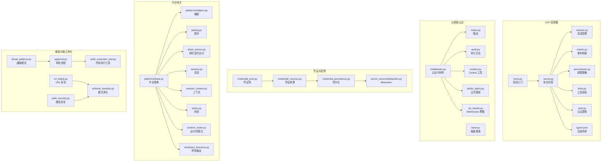
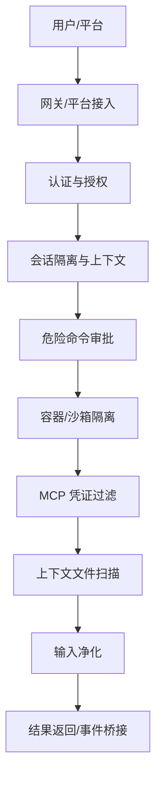
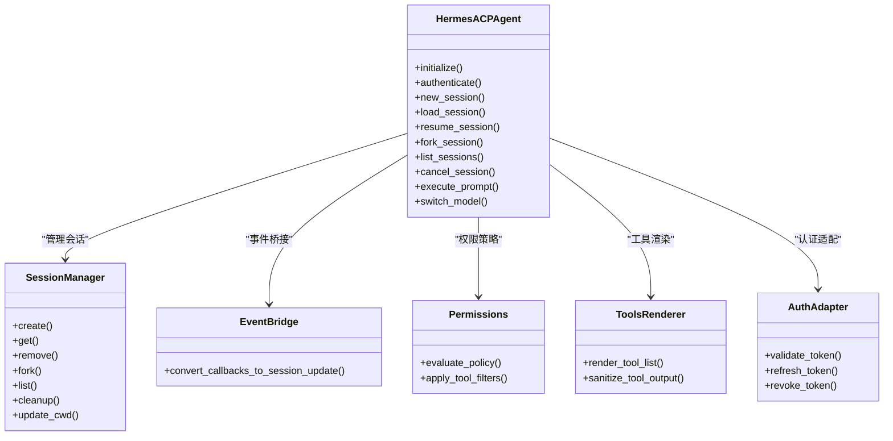
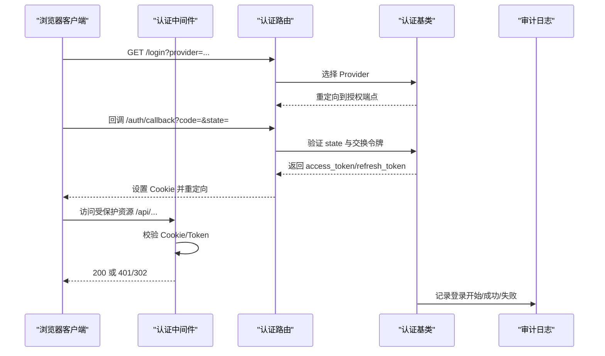
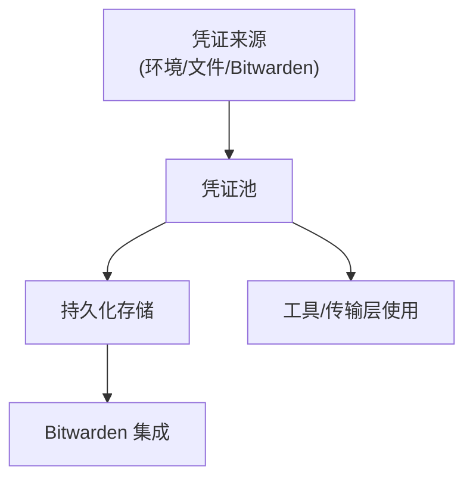
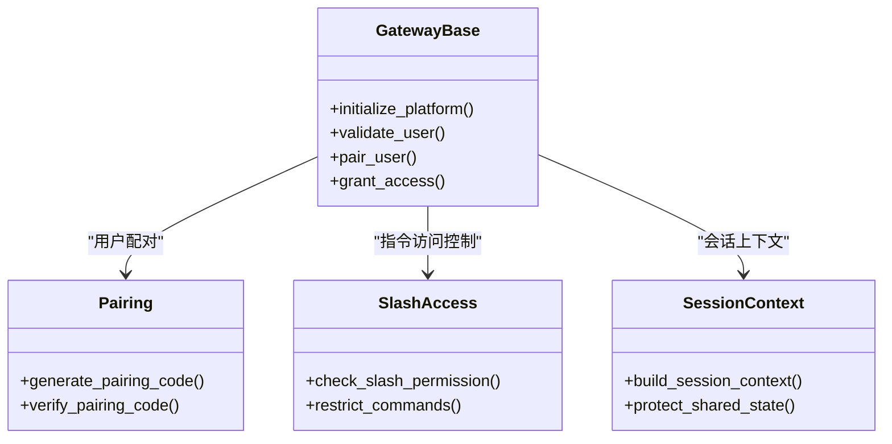
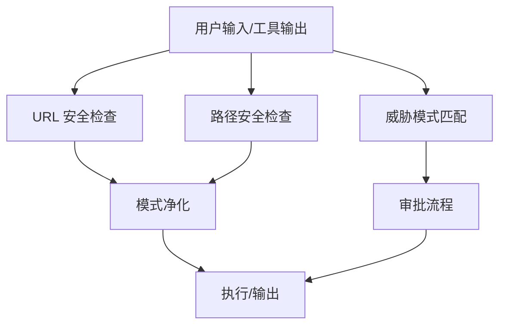
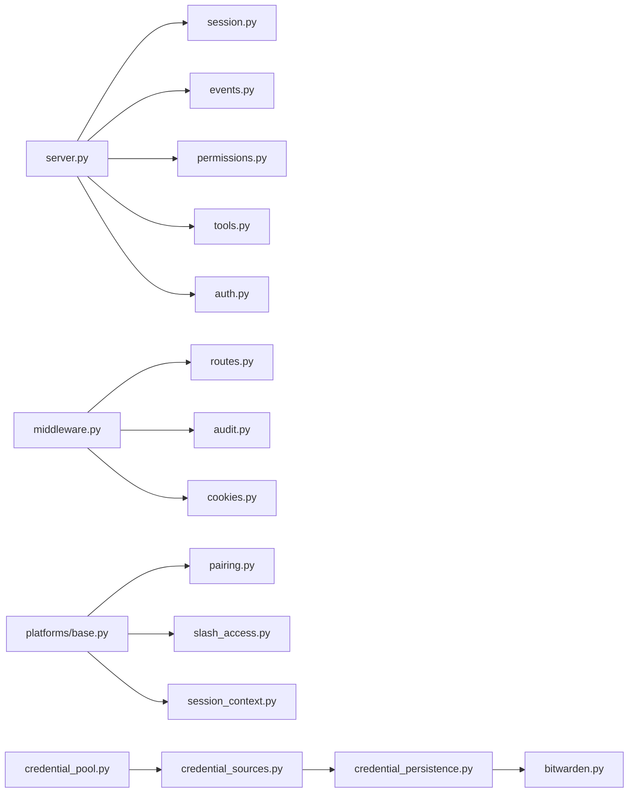

# 安全和权限

<cite>
**本文引用的文件**
- [acp_adapter/entry.py](file://acp_adapter/entry.py)
- [acp_adapter/server.py](file://acp_adapter/server.py)
- [acp_adapter/session.py](file://acp_adapter/session.py)
- [acp_adapter/events.py](file://acp_adapter/events.py)
- [acp_adapter/permissions.py](file://acp_adapter/permissions.py)
- [acp_adapter/tools.py](file://acp_adapter/tools.py)
- [acp_adapter/auth.py](file://acp_adapter/auth.py)
- [acp_registry/agent.json](file://acp_registry/agent.json)
- [hermes_cli/dashboard_auth/middleware.py](file://hermes_cli/dashboard_auth/middleware.py)
- [hermes_cli/dashboard_auth/base.py](file://hermes_cli/dashboard_auth/base.py)
- [hermes_cli/dashboard_auth/cookies.py](file://hermes_cli/dashboard_auth/cookies.py)
- [hermes_cli/dashboard_auth/routes.py](file://hermes_cli/dashboard_auth/routes.py)
- [hermes_cli/dashboard_auth/audit.py](file://hermes_cli/dashboard_auth/audit.py)
- [hermes_cli/dashboard_auth/public_paths.py](file://hermes_cli/dashboard_auth/public_paths.py)
- [hermes_cli/dashboard_auth/ws_tickets.py](file://hermes_cli/dashboard_auth/ws_tickets.py)
- [hermes_cli/security_audit.py](file://hermes_cli/security_audit.py)
- [hermes_cli/security_advisories.py](file://hermes_cli/security_advisories.py)
- [tools/threat_patterns.py](file://tools/threat_patterns.py)
- [tools/url_safety.py](file://tools/url_safety.py)
- [tools/path_security.py](file://tools/path_security.py)
- [tools/schema_sanitizer.py](file://tools/schema_sanitizer.py)
- [tools/approval.py](file://tools/approval.py)
- [tools/code_execution_tool.py](file://tools/code_execution_tool.py)
- [agent/credential_pool.py](file://agent/credential_pool.py)
- [agent/credential_sources.py](file://agent/credential_sources.py)
- [agent/credential_persistence.py](file://agent/credential_persistence.py)
- [agent/secret_sources/bitwarden.py](file://agent/secret_sources/bitwarden.py)
- [gateway/platforms/base.py](file://gateway/platforms/base.py)
- [gateway/platforms/helpers.py](file://gateway/platforms/helpers.py)
- [gateway/pairing.py](file://gateway/pairing.py)
- [gateway/slash_access.py](file://gateway/slash_access.py)
- [gateway/session.py](file://gateway/session.py)
- [gateway/session_context.py](file://gateway/session_context.py)
- [gateway/status.py](file://gateway/status.py)
- [gateway/runtime_footer.py](file://gateway/runtime_footer.py)
- [gateway/shutdown_forensics.py](file://gateway/shutdown_forensics.py)
- [website/docs/user-guide/security.md](file://website/docs/user-guide/security.md)
- [website/docs/developer-guide/acp-internals.md](file://website/docs/developer-guide/acp-internals.md)
- [website/i18n/zh-Hans/docusaurus-plugin-content-docs/current/developer-guide/acp-internals.md](file://website/i18n/zh-Hans/docusaurus-plugin-content-docs/current/developer-guide/acp-internals.md)
- [web/src/lib/api.ts](file://web/src/lib/api.ts)
- [tests/hermes_cli/test_dashboard_auth_middleware.py](file://tests/hermes_cli/test_dashboard_auth_middleware.py)
- [tests/hermes_cli/test_dashboard_auth_audit.py](file://tests/hermes_cli/test_dashboard_auth_audit.py)
- [tests/acp/test_auth.py](file://tests/acp/test_auth.py)
- [tests/acp/test_session.py](file://tests/acp/test_session.py)
- [tests/acp/test_permissions.py](file://tests/acp/test_permissions.py)
- [tests/acp/test_tools.py](file://tests/acp/test_tools.py)
- [tests/acp/test_events.py](file://tests/acp/test_events.py)
- [tests/acp/test_entry.py](file://tests/acp/test_entry.py)
- [tests/acp/test_server.py](file://tests/acp/test_server.py)
- [tests/acp/test_edit_approval.py](file://tests/acp/test_edit_approval.py)
- [tests/acp/test_approval_isolation.py](file://tests/acp/test_approval_isolation.py)
- [tests/acp/test_session_db_private_access.py](file://tests/acp/test_session_db_private_access.py)
- [tests/acp/test_ping_suppression.py](file://tests/acp/test_ping_suppression.py)
- [tests/acp/test_registry_manifest.py](file://tests/acp/test_registry_manifest.py)
- [tests/acp/test_mcp_e2e.py](file://tests/acp/test_mcp_e2e.py)
</cite>

## 目录
1. [引言](#引言)
2. [项目结构](#项目结构)
3. [核心组件](#核心组件)
4. [架构总览](#架构总览)
5. [详细组件分析](#详细组件分析)
6. [依赖关系分析](#依赖关系分析)
7. [性能考虑](#性能考虑)
8. [故障排查指南](#故障排查指南)
9. [结论](#结论)
10. [附录](#附录)

## 引言
本文件面向安全工程师与系统管理员，系统化阐述 Hermes Agent 的安全与权限体系，覆盖安全架构、身份认证与授权、ACCP（Agent Control Protocol）适配器、凭证管理、访问控制、安全配置、威胁防护、审计日志、数据加密与网络隔离、合规性要求等主题，并提供安全最佳实践、漏洞管理与应急响应建议。

## 项目结构
Hermes Agent 的安全与权限相关代码主要分布在以下模块：
- ACP 适配器：负责将 Agent 封装为异步 JSON-RPC 服务，提供会话、事件桥接、权限与工具渲染能力
- 仪表板认证与授权：基于 Cookie/Token 的登录、会话校验、中间件与审计
- 凭证与密钥管理：凭证池、来源与持久化，以及 Bitwarden 集成
- 平台网关与用户授权：消息平台接入、配对与访问控制
- 威胁检测与输入净化：URL 安全、路径安全、模式匹配与审批流程
- 文档与测试：官方安全文档、ACP 内部机制说明及大量安全相关测试用例

图表来源
- [acp_adapter/entry.py:1-50](file://acp_adapter/entry.py#L1-L50)
- [acp_adapter/server.py:1-120](file://acp_adapter/server.py#L1-L120)
- [acp_adapter/session.py:1-120](file://acp_adapter/session.py#L1-L120)
- [acp_adapter/events.py:1-120](file://acp_adapter/events.py#L1-L120)
- [acp_adapter/permissions.py:1-120](file://acp_adapter/permissions.py#L1-L120)
- [acp_adapter/tools.py:1-120](file://acp_adapter/tools.py#L1-L120)
- [acp_adapter/auth.py:1-120](file://acp_adapter/auth.py#L1-L120)
- [acp_registry/agent.json:1-120](file://acp_registry/agent.json#L1-L120)
- [hermes_cli/dashboard_auth/middleware.py:1-120](file://hermes_cli/dashboard_auth/middleware.py#L1-L120)
- [hermes_cli/dashboard_auth/base.py:1-120](file://hermes_cli/dashboard_auth/base.py#L1-L120)
- [hermes_cli/dashboard_auth/cookies.py:1-120](file://hermes_cli/dashboard_auth/cookies.py#L1-L120)
- [hermes_cli/dashboard_auth/routes.py:1-120](file://hermes_cli/dashboard_auth/routes.py#L1-L120)
- [hermes_cli/dashboard_auth/audit.py:1-120](file://hermes_cli/dashboard_auth/audit.py#L1-L120)
- [hermes_cli/dashboard_auth/public_paths.py:1-120](file://hermes_cli/dashboard_auth/public_paths.py#L1-L120)
- [hermes_cli/dashboard_auth/ws_tickets.py:1-120](file://hermes_cli/dashboard_auth/ws_tickets.py#L1-L120)
- [agent/credential_pool.py:1-120](file://agent/credential_pool.py#L1-L120)
- [agent/credential_sources.py:1-120](file://agent/credential_sources.py#L1-L120)
- [agent/credential_persistence.py:1-120](file://agent/credential_persistence.py#L1-L120)
- [agent/secret_sources/bitwarden.py:1-120](file://agent/secret_sources/bitwarden.py#L1-L120)
- [gateway/platforms/base.py:1-120](file://gateway/platforms/base.py#L1-L120)
- [gateway/platforms/helpers.py:1-120](file://gateway/platforms/helpers.py#L1-L120)
- [gateway/pairing.py:1-120](file://gateway/pairing.py#L1-L120)
- [gateway/slash_access.py:1-120](file://gateway/slash_access.py#L1-L120)
- [gateway/session.py:1-120](file://gateway/session.py#L1-L120)
- [gateway/session_context.py:1-120](file://gateway/session_context.py#L1-L120)
- [gateway/status.py:1-120](file://gateway/status.py#L1-L120)
- [gateway/runtime_footer.py:1-120](file://gateway/runtime_footer.py#L1-L120)
- [gateway/shutdown_forensics.py:1-120](file://gateway/shutdown_forensics.py#L1-L120)
- [tools/threat_patterns.py:1-120](file://tools/threat_patterns.py#L1-L120)
- [tools/url_safety.py:1-120](file://tools/url_safety.py#L1-L120)
- [tools/path_security.py:1-120](file://tools/path_security.py#L1-L120)
- [tools/schema_sanitizer.py:1-120](file://tools/schema_sanitizer.py#L1-L120)
- [tools/approval.py:1-120](file://tools/approval.py#L1-L120)
- [tools/code_execution_tool.py:1-120](file://tools/code_execution_tool.py#L1-L120)

章节来源
- [website/docs/user-guide/security.md:1-211](file://website/docs/user-guide/security.md#L1-L211)
- [website/docs/developer-guide/acp-internals.md:1-77](file://website/docs/developer-guide/acp-internals.md#L1-L77)
- [website/i18n/zh-Hans/docusaurus-plugin-content-docs/current/developer-guide/acp-internals.md:1-77](file://website/i18n/zh-Hans/docusaurus-plugin-content-docs/current/developer-guide/acp-internals.md#L1-L77)

## 核心组件
- ACP 适配器：提供 Agent 的生命周期、会话、事件桥接、权限与工具渲染，确保外部客户端通过 JSON-RPC 安全交互
- 仪表板认证：基于 Provider 的登录、会话校验、Cookie/Token 管理、中间件拦截与审计日志
- 凭证与密钥：凭证池聚合多来源凭据，持久化与 Bitwarden 集成，避免明文泄露
- 平台网关：消息平台接入层，实现用户授权、配对与访问控制
- 威胁与输入净化：URL/路径安全、模式匹配与审批流程，防止注入与越权操作
- 文档与测试：官方安全文档与大量安全测试用例，覆盖认证、会话、权限、工具、事件等

章节来源
- [acp_adapter/server.py:1-120](file://acp_adapter/server.py#L1-L120)
- [acp_adapter/session.py:1-120](file://acp_adapter/session.py#L1-L120)
- [acp_adapter/permissions.py:1-120](file://acp_adapter/permissions.py#L1-L120)
- [acp_adapter/tools.py:1-120](file://acp_adapter/tools.py#L1-L120)
- [acp_adapter/auth.py:1-120](file://acp_adapter/auth.py#L1-L120)
- [hermes_cli/dashboard_auth/middleware.py:1-120](file://hermes_cli/dashboard_auth/middleware.py#L1-L120)
- [hermes_cli/dashboard_auth/audit.py:1-120](file://hermes_cli/dashboard_auth/audit.py#L1-L120)
- [agent/credential_pool.py:1-120](file://agent/credential_pool.py#L1-L120)
- [agent/credential_sources.py:1-120](file://agent/credential_sources.py#L1-L120)
- [agent/credential_persistence.py:1-120](file://agent/credential_persistence.py#L1-L120)
- [tools/threat_patterns.py:1-120](file://tools/threat_patterns.py#L1-L120)
- [tools/url_safety.py:1-120](file://tools/url_safety.py#L1-L120)
- [tools/path_security.py:1-120](file://tools/path_security.py#L1-L120)
- [tools/approval.py:1-120](file://tools/approval.py#L1-L120)

## 架构总览
Hermes 的安全采用“纵深防御”设计，包含七层边界：
1) 用户授权：允许谁与 Agent 交互（白名单、私聊配对）
2) 危险命令审批：破坏性操作的人工审核
3) 容器隔离：Docker/Singularity/Modal 硬化沙箱
4) MCP 凭证过滤：环境变量隔离
5) 上下文文件扫描：项目文件中的提示注入检测
6) 会话隔离：跨会话数据与状态不可见；定时任务存储路径防路径穿越
7) 输入净化：终端后端工作目录参数经白名单校验，防止命令注入

图表来源
- [website/docs/user-guide/security.md:11-22](file://website/docs/user-guide/security.md#L11-L22)

章节来源
- [website/docs/user-guide/security.md:1-211](file://website/docs/user-guide/security.md#L1-L211)

## 详细组件分析

### ACP 适配器：生命周期、会话、事件桥接、审批与工具渲染
ACP 适配器将同步 Agent 封装为异步 JSON-RPC stdio 服务器，关键职责包括：
- 初始化与认证
- 会话创建/加载/恢复/派生/列举/取消
- 提示词执行与模型切换
- 将同步回调接入异步通知

图表来源
- [acp_adapter/server.py:1-120](file://acp_adapter/server.py#L1-L120)
- [acp_adapter/session.py:1-120](file://acp_adapter/session.py#L1-L120)
- [acp_adapter/events.py:1-120](file://acp_adapter/events.py#L1-L120)
- [acp_adapter/permissions.py:1-120](file://acp_adapter/permissions.py#L1-L120)
- [acp_adapter/tools.py:1-120](file://acp_adapter/tools.py#L1-L120)
- [acp_adapter/auth.py:1-120](file://acp_adapter/auth.py#L1-L120)

章节来源
- [website/docs/developer-guide/acp-internals.md:1-77](file://website/docs/developer-guide/acp-internals.md#L1-L77)
- [website/i18n/zh-Hans/docusaurus-plugin-content-docs/current/developer-guide/acp-internals.md:1-77](file://website/i18n/zh-Hans/docusaurus-plugin-content-docs/current/developer-guide/acp-internals.md#L1-L77)
- [acp_adapter/entry.py:1-50](file://acp_adapter/entry.py#L1-L50)
- [acp_adapter/server.py:1-120](file://acp_adapter/server.py#L1-L120)
- [acp_adapter/session.py:1-120](file://acp_adapter/session.py#L1-L120)
- [acp_adapter/events.py:1-120](file://acp_adapter/events.py#L1-L120)
- [acp_adapter/permissions.py:1-120](file://acp_adapter/permissions.py#L1-L120)
- [acp_adapter/tools.py:1-120](file://acp_adapter/tools.py#L1-L120)
- [acp_adapter/auth.py:1-120](file://acp_adapter/auth.py#L1-L120)
- [acp_registry/agent.json:1-120](file://acp_registry/agent.json#L1-L120)

### 仪表板认证与授权：登录、会话校验、中间件与审计
仪表板认证提供 Provider 驱动的登录流程、会话令牌校验、Cookie 管理、公开路径与 WebSocket 票据，并记录审计日志。

图表来源
- [hermes_cli/dashboard_auth/middleware.py:1-120](file://hermes_cli/dashboard_auth/middleware.py#L1-L120)
- [hermes_cli/dashboard_auth/routes.py:1-120](file://hermes_cli/dashboard_auth/routes.py#L1-L120)
- [hermes_cli/dashboard_auth/base.py:1-120](file://hermes_cli/dashboard_auth/base.py#L1-L120)
- [hermes_cli/dashboard_auth/audit.py:1-120](file://hermes_cli/dashboard_auth/audit.py#L1-L120)
- [web/src/lib/api.ts:258-287](file://web/src/lib/api.ts#L258-L287)

章节来源
- [hermes_cli/dashboard_auth/middleware.py:1-120](file://hermes_cli/dashboard_auth/middleware.py#L1-L120)
- [hermes_cli/dashboard_auth/base.py:1-120](file://hermes_cli/dashboard_auth/base.py#L1-L120)
- [hermes_cli/dashboard_auth/cookies.py:1-120](file://hermes_cli/dashboard_auth/cookies.py#L1-L120)
- [hermes_cli/dashboard_auth/routes.py:1-120](file://hermes_cli/dashboard_auth/routes.py#L1-L120)
- [hermes_cli/dashboard_auth/audit.py:1-120](file://hermes_cli/dashboard_auth/audit.py#L1-L120)
- [hermes_cli/dashboard_auth/public_paths.py:1-120](file://hermes_cli/dashboard_auth/public_paths.py#L1-L120)
- [hermes_cli/dashboard_auth/ws_tickets.py:1-120](file://hermes_cli/dashboard_auth/ws_tickets.py#L1-L120)
- [web/src/lib/api.ts:258-287](file://web/src/lib/api.ts#L258-L287)

### 凭证与密钥管理：凭证池、来源与 Bitwarden
凭证池聚合来自不同来源的凭据，结合持久化与 Bitwarden 集成，避免明文泄露并支持动态轮换。

图表来源
- [agent/credential_pool.py:1-120](file://agent/credential_pool.py#L1-L120)
- [agent/credential_sources.py:1-120](file://agent/credential_sources.py#L1-L120)
- [agent/credential_persistence.py:1-120](file://agent/credential_persistence.py#L1-L120)
- [agent/secret_sources/bitwarden.py:1-120](file://agent/secret_sources/bitwarden.py#L1-L120)

章节来源
- [agent/credential_pool.py:1-120](file://agent/credential_pool.py#L1-L120)
- [agent/credential_sources.py:1-120](file://agent/credential_sources.py#L1-L120)
- [agent/credential_persistence.py:1-120](file://agent/credential_persistence.py#L1-L120)
- [agent/secret_sources/bitwarden.py:1-120](file://agent/secret_sources/bitwarden.py#L1-L120)

### 平台网关与用户授权：消息平台接入、配对与访问控制
网关层实现消息平台接入、用户授权、配对与访问控制，确保仅授权用户可与 Agent 交互。

图表来源
- [gateway/platforms/base.py:1-120](file://gateway/platforms/base.py#L1-L120)
- [gateway/platforms/helpers.py:1-120](file://gateway/platforms/helpers.py#L1-L120)
- [gateway/pairing.py:1-120](file://gateway/pairing.py#L1-L120)
- [gateway/slash_access.py:1-120](file://gateway/slash_access.py#L1-L120)
- [gateway/session_context.py:1-120](file://gateway/session_context.py#L1-L120)

章节来源
- [gateway/platforms/base.py:1-120](file://gateway/platforms/base.py#L1-L120)
- [gateway/platforms/helpers.py:1-120](file://gateway/platforms/helpers.py#L1-L120)
- [gateway/pairing.py:1-120](file://gateway/pairing.py#L1-L120)
- [gateway/slash_access.py:1-120](file://gateway/slash_access.py#L1-L120)
- [gateway/session_context.py:1-120](file://gateway/session_context.py#L1-L120)

### 威胁检测与输入净化：URL/路径安全、模式匹配与审批
系统通过威胁模式匹配、URL/路径安全检查、模式净化与审批流程，降低注入与越权风险。

图表来源
- [tools/threat_patterns.py:1-120](file://tools/threat_patterns.py#L1-L120)
- [tools/url_safety.py:1-120](file://tools/url_safety.py#L1-L120)
- [tools/path_security.py:1-120](file://tools/path_security.py#L1-L120)
- [tools/schema_sanitizer.py:1-120](file://tools/schema_sanitizer.py#L1-L120)
- [tools/approval.py:1-120](file://tools/approval.py#L1-L120)
- [tools/code_execution_tool.py:1-120](file://tools/code_execution_tool.py#L1-L120)

章节来源
- [tools/threat_patterns.py:1-120](file://tools/threat_patterns.py#L1-L120)
- [tools/url_safety.py:1-120](file://tools/url_safety.py#L1-L120)
- [tools/path_security.py:1-120](file://tools/path_security.py#L1-L120)
- [tools/schema_sanitizer.py:1-120](file://tools/schema_sanitizer.py#L1-L120)
- [tools/approval.py:1-120](file://tools/approval.py#L1-L120)
- [tools/code_execution_tool.py:1-120](file://tools/code_execution_tool.py#L1-L120)

## 依赖关系分析
- 组件耦合与内聚：ACP 适配器内部模块高内聚，通过明确接口进行解耦；仪表板认证中间件统一拦截，降低各路由重复逻辑
- 外部依赖与集成：ACCP 注册清单与第三方客户端对接；凭证来源与 Bitwarden 集成；平台网关与多种消息平台
- 潜在循环依赖：当前结构清晰，未发现明显循环依赖
- 接口契约：认证中间件与路由之间通过 Cookie/Token 明确契约；事件桥接通过异步通知解耦

图表来源
- [acp_adapter/server.py:1-120](file://acp_adapter/server.py#L1-L120)
- [acp_adapter/session.py:1-120](file://acp_adapter/session.py#L1-L120)
- [acp_adapter/events.py:1-120](file://acp_adapter/events.py#L1-L120)
- [acp_adapter/permissions.py:1-120](file://acp_adapter/permissions.py#L1-L120)
- [acp_adapter/tools.py:1-120](file://acp_adapter/tools.py#L1-L120)
- [acp_adapter/auth.py:1-120](file://acp_adapter/auth.py#L1-L120)
- [hermes_cli/dashboard_auth/middleware.py:1-120](file://hermes_cli/dashboard_auth/middleware.py#L1-L120)
- [hermes_cli/dashboard_auth/routes.py:1-120](file://hermes_cli/dashboard_auth/routes.py#L1-L120)
- [hermes_cli/dashboard_auth/audit.py:1-120](file://hermes_cli/dashboard_auth/audit.py#L1-L120)
- [hermes_cli/dashboard_auth/cookies.py:1-120](file://hermes_cli/dashboard_auth/cookies.py#L1-L120)
- [gateway/platforms/base.py:1-120](file://gateway/platforms/base.py#L1-L120)
- [gateway/pairing.py:1-120](file://gateway/pairing.py#L1-L120)
- [gateway/slash_access.py:1-120](file://gateway/slash_access.py#L1-L120)
- [gateway/session_context.py:1-120](file://gateway/session_context.py#L1-L120)
- [agent/credential_pool.py:1-120](file://agent/credential_pool.py#L1-L120)
- [agent/credential_sources.py:1-120](file://agent/credential_sources.py#L1-L120)
- [agent/credential_persistence.py:1-120](file://agent/credential_persistence.py#L1-L120)
- [agent/secret_sources/bitwarden.py:1-120](file://agent/secret_sources/bitwarden.py#L1-L120)

章节来源
- [acp_adapter/server.py:1-120](file://acp_adapter/server.py#L1-L120)
- [hermes_cli/dashboard_auth/middleware.py:1-120](file://hermes_cli/dashboard_auth/middleware.py#L1-L120)
- [gateway/platforms/base.py:1-120](file://gateway/platforms/base.py#L1-L120)
- [agent/credential_pool.py:1-120](file://agent/credential_pool.py#L1-L120)

## 性能考虑
- 会话并发与线程安全：会话管理器需保证高并发下的线程安全与低锁争用
- 事件桥接延迟：回调转事件应尽量减少阻塞，避免影响主 Agent 循环
- 审计日志异步化：审计写入不应阻塞主业务流程
- 凭证池缓存：对频繁使用的凭据进行短期缓存，降低来源查询开销
- 审批与容器隔离：在容器后端可跳过危险命令检查，但需确保容器边界有效

## 故障排查指南
- 认证失败与 401：检查 Cookie/Token 是否正确设置与未过期；确认中间件是否正确拦截与重定向
- 审计日志异常：确认日志目录存在且可写；注意令牌字段会被脱敏
- ACP 会话问题：检查会话 ID 生成与清理逻辑；核对事件桥接是否正常
- 凭证获取失败：检查来源配置与 Bitwarden 连通性；确认持久化文件权限
- 危险命令审批：确认永久允许列表配置；检查 CLI/Gateway 的审批流程

章节来源
- [tests/hermes_cli/test_dashboard_auth_middleware.py:221-258](file://tests/hermes_cli/test_dashboard_auth_middleware.py#L221-L258)
- [tests/hermes_cli/test_dashboard_auth_audit.py:1-81](file://tests/hermes_cli/test_dashboard_auth_audit.py#L1-L81)
- [tests/acp/test_session.py:1-120](file://tests/acp/test_session.py#L1-L120)
- [tests/acp/test_auth.py:1-120](file://tests/acp/test_auth.py#L1-L120)
- [tests/acp/test_permissions.py:1-120](file://tests/acp/test_permissions.py#L1-L120)
- [tests/acp/test_tools.py:1-120](file://tests/acp/test_tools.py#L1-L120)
- [tests/acp/test_events.py:1-120](file://tests/acp/test_events.py#L1-L120)
- [tests/acp/test_entry.py:1-120](file://tests/acp/test_entry.py#L1-L120)
- [tests/acp/test_server.py:1-120](file://tests/acp/test_server.py#L1-L120)
- [tests/acp/test_edit_approval.py:1-120](file://tests/acp/test_edit_approval.py#L1-L120)
- [tests/acp/test_approval_isolation.py:1-120](file://tests/acp/test_approval_isolation.py#L1-L120)
- [tests/acp/test_session_db_private_access.py:1-120](file://tests/acp/test_session_db_private_access.py#L1-L120)
- [tests/acp/test_ping_suppression.py:1-120](file://tests/acp/test_ping_suppression.py#L1-L120)
- [tests/acp/test_registry_manifest.py:1-120](file://tests/acp/test_registry_manifest.py#L1-L120)
- [tests/acp/test_mcp_e2e.py:1-120](file://tests/acp/test_mcp_e2e.py#L1-L120)

## 结论
Hermes Agent 的安全与权限体系通过“纵深防御”理念构建，从用户授权、危险命令审批、容器隔离、凭证过滤、上下文扫描、会话隔离到输入净化形成完整闭环。ACP 适配器、仪表板认证、凭证管理与平台网关共同构成可扩展、可观测、可审计的安全基础设施。建议在生产环境中结合官方安全文档与测试用例，持续完善配置与监控。

## 附录
- 安全配置选项与最佳实践：参阅官方安全文档与 ACP 内部机制说明
- 威胁防护与合规：遵循威胁模式匹配、URL/路径安全与审批流程；确保审计日志不泄露敏感信息
- 应急响应：建立认证失败、会话异常、凭证失效与容器逃逸的快速处置流程

章节来源
- [website/docs/user-guide/security.md:1-211](file://website/docs/user-guide/security.md#L1-L211)
- [website/docs/developer-guide/acp-internals.md:1-77](file://website/docs/developer-guide/acp-internals.md#L1-L77)
- [hermes_cli/security_audit.py:1-120](file://hermes_cli/security_audit.py#L1-L120)
- [hermes_cli/security_advisories.py:1-120](file://hermes_cli/security_advisories.py#L1-L120)