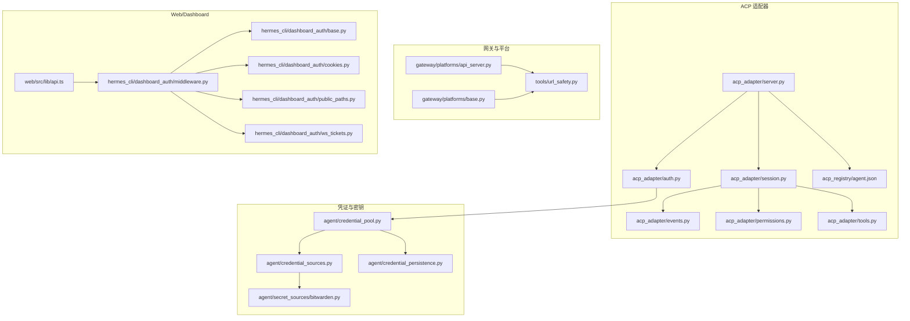
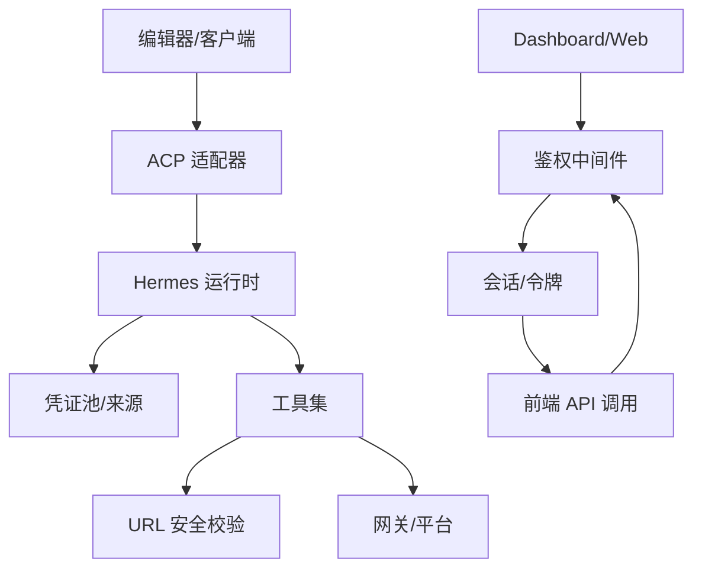
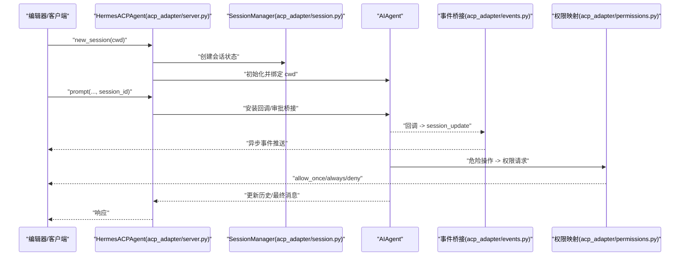
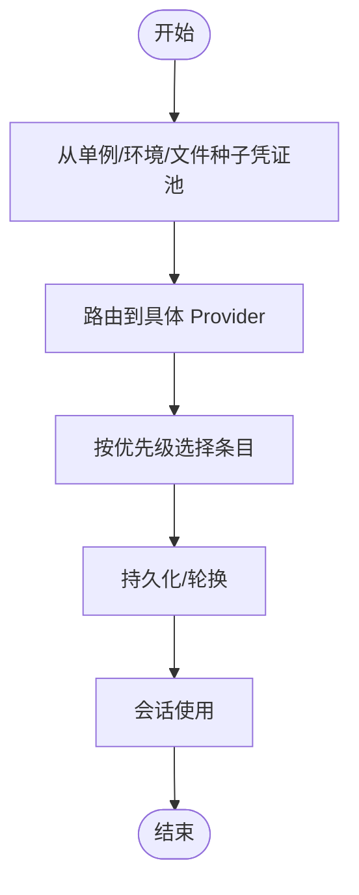
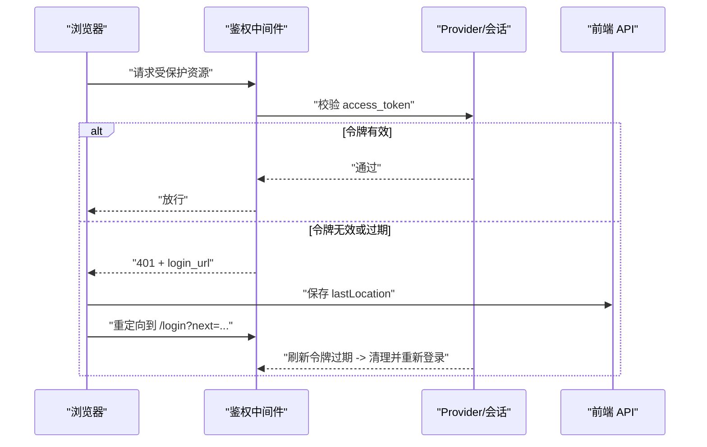
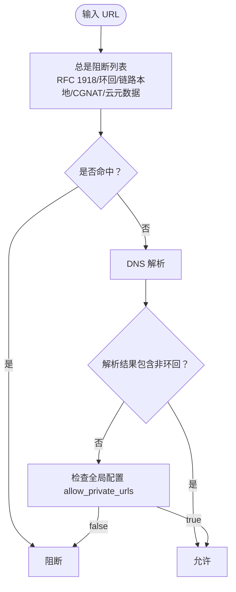
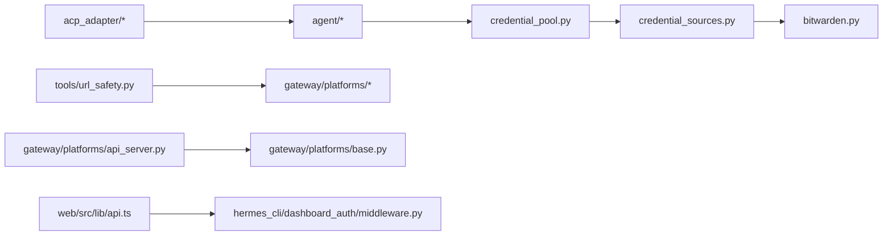

# 安全架构

<cite>
**本文引用的文件**
- [SECURITY.md](file://SECURITY.md)
- [network-egress-isolation.md](file://docs/security/network-egress-isolation.md)
- [acp-internals.md](file://website/docs/developer-guide/acp-internals.md)
- [acp-internals-zh.md](file://website/i18n/zh-Hans/docusaurus-plugin-content-docs/current/developer-guide/acp-internals.md)
- [security.md](file://website/docs/user-guide/security.md)
- [security-zh.md](file://website/i18n/zh-Hans/docusaurus-plugin-content-docs/current/user-guide/security.md)
- [test_url_safety.py](file://tests/tools/test_url_safety.py)
- [test_api_server_bind_guard.py](file://tests/gateway/test_api_server_bind_guard.py)
- [api.ts](file://web/src/lib/api.ts)
- [test_auth_commands.py](file://tests/hermes_cli/test_auth_commands.py)
- [test_basic_provider.py](file://tests/plugins/dashboard_auth/test_basic_provider.py)
- [test_dashboard_auth_401_reauth.py](file://tests/hermes_cli/test_dashboard_auth_401_reauth.py)
- [acp_adapter/auth.py](file://acp_adapter/auth.py)
- [acp_adapter/server.py](file://acp_adapter/server.py)
- [acp_adapter/session.py](file://acp_adapter/session.py)
- [acp_adapter/events.py](file://acp_adapter/events.py)
- [acp_adapter/permissions.py](file://acp_adapter/permissions.py)
- [acp_adapter/tools.py](file://acp_adapter/tools.py)
- [acp_registry/agent.json](file://acp_registry/agent.json)
- [hermes_cli/dashboard_auth/middleware.py](file://hermes_cli/dashboard_auth/middleware.py)
- [hermes_cli/dashboard_auth/base.py](file://hermes_cli/dashboard_auth/base.py)
- [hermes_cli/dashboard_auth/cookies.py](file://hermes_cli/dashboard_auth/cookies.py)
- [hermes_cli/dashboard_auth/public_paths.py](file://hermes_cli/dashboard_auth/public_paths.py)
- [hermes_cli/dashboard_auth/ws_tickets.py](file://hermes_cli/dashboard_auth/ws_tickets.py)
- [hermes_cli/auth.py](file://hermes_cli/auth.py)
- [agent/credential_pool.py](file://agent/credential_pool.py)
- [agent/credential_sources.py](file://agent/credential_sources.py)
- [agent/secret_sources/bitwarden.py](file://agent/secret_sources/bitwarden.py)
- [agent/credential_persistence.py](file://agent/credential_persistence.py)
- [tools/url_safety.py](file://tools/url_safety.py)
- [gateway/platforms/base.py](file://gateway/platforms/base.py)
- [gateway/platforms/api_server.py](file://gateway/platforms/api_server.py)
- [gateway/session.py](file://gateway/session.py)
- [gateway/pairing.py](file://gateway/pairing.py)
- [gateway/platform_registry.py](file://gateway/platform_registry.py)
- [gateway/channel_directory.py](file://gateway/channel_directory.py)
- [gateway/hooks.py](file://gateway/hooks.py)
- [gateway/status.py](file://gateway/status.py)
- [gateway/display_config.py](file://gateway/display_config.py)
- [gateway/memory_monitor.py](file://gateway/memory_monitor.py)
- [gateway/shutdown_forensics.py](file://gateway/shutdown_forensics.py)
- [gateway/stream_dispatch.py](file://gateway/stream_dispatch.py)
- [gateway/stream_events.py](file://gateway/stream_events.py)
- [gateway/whatsapp_identity.py](file://gateway/whatsapp_identity.py)
- [gateway/whatsapp_network.py](file://gateway/whatsapp_network.py)
- [gateway/telegram_network.py](file://gateway/telegram_network.py)
- [gateway/msgraph_webhook.py](file://gateway/msgraph_webhook.py)
- [gateway/feishu_meeting_invite.py](file://gateway/feishu_meeting_invite.py)
- [gateway/feishu_comment.py](file://gateway/feishu_comment.py)
- [gateway/feishu_comment_rules.py](file://gateway/feishu_comment_rules.py)
- [gateway/feishu_crypto.py](file://gateway/feishu_crypto.py)
- [gateway/yuanbao_proto.py](file://gateway/yuanbao_proto.py)
- [gateway/yuanbao_media.py](file://gateway/yuanbao_media.py)
- [gateway/yuanbao_sticker.py](file://gateway/yuanbao_sticker.py)
- [gateway/webhook.py](file://gateway/webhook.py)
- [gateway/restart.py](file://gateway/restart.py)
- [gateway/run.py](file://gateway/run.py)
- [gateway/config.py](file://gateway/config.py)
- [gateway/delivery.py](file://gateway/delivery.py)
- [gateway/session_context.py](file://gateway/session_context.py)
- [gateway/platforms/_http_client_limits.py](file://gateway/platforms/_http_client_limits.py)
- [gateway/platforms/helpers.py](file://gateway/platforms/helpers.py)
- [gateway/platforms/qqbot/base.py](file://gateway/platforms/qqbot/base.py)
- [gateway/platforms/bluebubbles/base.py](file://gateway/platforms/bluebubbles/base.py)
- [gateway/platforms/email/base.py](file://gateway/platforms/email/base.py)
- [gateway/platforms/signal/base.py](file://gateway/platforms/signal/base.py)
- [gateway/platforms/telegram/base.py](file://gateway/platforms/telegram/base.py)
- [gateway/platforms/whatsapp/base.py](file://gateway/platforms/whatsapp/base.py)
- [gateway/platforms/wecom/base.py](file://gateway/platforms/wecom/base.py)
- [gateway/platforms/weixin/base.py](file://gateway/platforms/weixin/base.py)
- [gateway/platforms/yuanbao/base.py](file://gateway/platforms/yuanbao/base.py)
- [gateway/platforms/feishu/base.py](file://gateway/platforms/feishu/base.py)
- [gateway/platforms/matrix/base.py](file://gateway/platforms/matrix/base.py)
- [gateway/platforms/slack/base.py](file://gateway/platforms/slack/base.py)
- [gateway/platforms/telegram_network.py](file://gateway/platforms/telegram_network.py)
- [gateway/platforms/whatsapp_network.py](file://gateway/platforms/whatsapp_network.py)
- [gateway/platforms/msgraph_webhook.py](file://gateway/platforms/msgraph_webhook.py)
- [gateway/platforms/feishu_meeting_invite.py](file://gateway/platforms/feishu_meeting_invite.py)
- [gateway/platforms/feishu_comment.py](file://gateway/platforms/feishu_comment.py)
- [gateway/platforms/feishu_comment_rules.py](file://gateway/platforms/feishu_comment_rules.py)
- [gateway/platforms/feishu_crypto.py](file://gateway/platforms/feishu_crypto.py)
- [gateway/platforms/yuanbao_proto.py](file://gateway/platforms/yuanbao_proto.py)
- [gateway/platforms/yuanbao_media.py](file://gateway/platforms/yuanbao_media.py)
- [gateway/platforms/yuanbao_sticker.py](file://gateway/platforms/yuanbao_sticker.py)
- [gateway/platforms/webhook.py](file://gateway/platforms/webhook.py)
- [gateway/platforms/qqbot/api_server.py](file://gateway/platforms/qqbot/api_server.py)
- [gateway/platforms/bluebubbles/api_server.py](file://gateway/platforms/bluebubbles/api_server.py)
- [gateway/platforms/email/api_server.py](file://gateway/platforms/email/api_server.py)
- [gateway/platforms/signal/api_server.py](file://gateway/platforms/signal/api_server.py)
- [gateway/platforms/telegram/api_server.py](file://gateway/platforms/telegram/api_server.py)
- [gateway/platforms/whatsapp/api_server.py](file://gateway/platforms/whatsapp/api_server.py)
- [gateway/platforms/wecom/api_server.py](file://gateway/platforms/wecom/api_server.py)
- [gateway/platforms/weixin/api_server.py](file://gateway/platforms/weixin/api_server.py)
- [gateway/platforms/yuanbao/api_server.py](file://gateway/platforms/yuanbao/api_server.py)
- [gateway/platforms/feishu/api_server.py](file://gateway/platforms/feishu/api_server.py)
- [gateway/platforms/matrix/api_server.py](file://gateway/platforms/matrix/api_server.py)
- [gateway/platforms/slack/api_server.py](file://gateway/platforms/slack/api_server.py)
- [gateway/platforms/qqbot/api_server.py](file://gateway/platforms/qqbot/api_server.py)
- [gateway/platforms/bluebubbles/api_server.py](file://gateway/platforms/bluebubbles/api_server.py)
- [gateway/platforms/email/api_server.py](file://gateway/platforms/email/api_server.py)
- [gateway/platforms/signal/api_server.py](file://gateway/platforms/signal/api_server.py)
- [gateway/platforms/telegram/api_server.py](file://gateway/platforms/telegram/api_server.py)
- [gateway/platforms/whatsapp/api_server.py](file://gateway/platforms/whatsapp/api_server.py)
- [gateway/platforms/wecom/api_server.py](file://gateway/platforms/wecom/api_server.py)
- [gateway/platforms/weixin/api_server.py](file://gateway/platforms/weixin/api_server.py)
- [gateway/platforms/yuanbao/api_server.py](file://gateway/platforms/yuanbao/api_server.py)
- [gateway/platforms/feishu/api_server.py](file://gateway/platforms/feishu/api_server.py)
- [gateway/platforms/matrix/api_server.py](file://gateway/platforms/matrix/api_server.py)
- [gateway/platforms/slack/api_server.py](file://gateway/platforms/slack/api_server.py)
</cite>

## 目录
1. [引言](#引言)
2. [项目结构](#项目结构)
3. [核心组件](#核心组件)
4. [架构总览](#架构总览)
5. [详细组件分析](#详细组件分析)
6. [依赖分析](#依赖分析)
7. [性能考虑](#性能考虑)
8. [故障排查指南](#故障排查指南)
9. [结论](#结论)
10. [附录](#附录)

## 引言
本文件面向安全架构师与开发者，系统性阐述 Hermes Agent 的安全架构设计与实现。内容覆盖整体安全理念、威胁模型与防护策略，重点解析 ACP（Agent Control Protocol）适配器的安全机制、凭证来源系统与安全边界设计，以及身份验证、授权控制与访问隔离的实现细节。同时，结合网络安全、数据保护与隐私安全的具体实现，提供安全配置指南、威胁检测与风险评估方法，帮助读者在生产环境中正确部署与运维。

## 项目结构
Hermes Agent 的安全能力由多层模块协同实现：
- ACP 适配器：将 Agent 的同步能力封装为异步 JSON-RPC stdio 服务，负责会话生命周期、事件桥接、权限审批与工具渲染。
- 凭证与密钥管理：集中于运行时解析器与凭证池，支持多种来源（环境变量、文件、第三方集成等）。
- 网络与平台安全：包括 URL 安全校验、网关绑定与连接守卫、平台特定网络与加密逻辑。
- Web/Dashboard 安全：基于 Cookie/Token 的会话管理、刷新与重认证、前端路由拦截与登录回跳。
- 文档与测试：官方用户指南与开发者文档对安全策略进行说明，配套大量单元测试验证安全边界。

图表来源
- [acp_adapter/server.py](file://acp_adapter/server.py)
- [acp_adapter/session.py](file://acp_adapter/session.py)
- [acp_adapter/events.py](file://acp_adapter/events.py)
- [acp_adapter/permissions.py](file://acp_adapter/permissions.py)
- [acp_adapter/tools.py](file://acp_adapter/tools.py)
- [acp_adapter/auth.py](file://acp_adapter/auth.py)
- [acp_registry/agent.json](file://acp_registry/agent.json)
- [agent/credential_pool.py](file://agent/credential_pool.py)
- [agent/credential_sources.py](file://agent/credential_sources.py)
- [agent/secret_sources/bitwarden.py](file://agent/secret_sources/bitwarden.py)
- [agent/credential_persistence.py](file://agent/credential_persistence.py)
- [gateway/platforms/base.py](file://gateway/platforms/base.py)
- [gateway/platforms/api_server.py](file://gateway/platforms/api_server.py)
- [tools/url_safety.py](file://tools/url_safety.py)
- [hermes_cli/dashboard_auth/middleware.py](file://hermes_cli/dashboard_auth/middleware.py)
- [hermes_cli/dashboard_auth/base.py](file://hermes_cli/dashboard_auth/base.py)
- [hermes_cli/dashboard_auth/cookies.py](file://hermes_cli/dashboard_auth/cookies.py)
- [hermes_cli/dashboard_auth/public_paths.py](file://hermes_cli/dashboard_auth/public_paths.py)
- [hermes_cli/dashboard_auth/ws_tickets.py](file://hermes_cli/dashboard_auth/ws_tickets.py)
- [web/src/lib/api.ts](file://web/src/lib/api.ts)

章节来源
- [acp-internals.md](file://website/docs/developer-guide/acp-internals.md)
- [acp-internals-zh.md](file://website/i18n/zh-Hans/docusaurus-plugin-content-docs/current/developer-guide/acp-internals.md)

## 核心组件
- ACP 适配器：负责会话生命周期、事件桥接、权限审批与工具渲染，复用 Hermes 运行时的认证与凭证解析，确保会话与工具调用在受控边界内执行。
- 凭证与密钥管理：集中解析与路由提供商凭据，支持优先级与来源索引，提供安全存储与轮换机制。
- 网络与平台安全：URL 安全校验、网关绑定与连接守卫、平台特定网络与加密逻辑，防止 SSRF、内网探测与未授权访问。
- Web/Dashboard 安全：基于中间件的鉴权与会话管理，支持刷新令牌过期处理与前端自动重定向登录。

章节来源
- [acp-internals.md](file://website/docs/developer-guide/acp-internals.md)
- [acp-internals-zh.md](file://website/i18n/zh-Hans/docusaurus-plugin-content-docs/current/developer-guide/acp-internals.md)
- [security.md](file://website/docs/user-guide/security.md)
- [security-zh.md](file://website/i18n/zh-Hans/docusaurus-plugin-content-docs/current/user-guide/security.md)

## 架构总览
Hermes Agent 的安全架构遵循“最小权限、纵深防御、边界清晰”的原则：
- 认证与授权：ACP 适配器复用运行时解析器，统一认证入口；Dashboard 采用中间件+Cookie/Token 的会话管理。
- 访问隔离：会话与工具调用在受限工作目录下执行，避免跨会话与跨用户的数据泄露。
- 网络隔离：URL 安全校验与网关绑定守卫，阻断内网与元数据服务访问；平台网络实现加密与签名。
- 数据保护与隐私：凭证池与持久化采用安全存储策略；前端在 401/会话过期时触发重认证与页面刷新，避免长期持有失效令牌。

图表来源
- [acp_adapter/server.py](file://acp_adapter/server.py)
- [acp_adapter/auth.py](file://acp_adapter/auth.py)
- [agent/credential_pool.py](file://agent/credential_pool.py)
- [tools/url_safety.py](file://tools/url_safety.py)
- [gateway/platforms/api_server.py](file://gateway/platforms/api_server.py)
- [hermes_cli/dashboard_auth/middleware.py](file://hermes_cli/dashboard_auth/middleware.py)
- [web/src/lib/api.ts](file://web/src/lib/api.ts)

## 详细组件分析

### ACP 适配器安全机制
- 会话生命周期与工作目录绑定：会话携带编辑器 cwd，通过任务作用域覆盖将文件与终端工具限定在会话工作区内，避免越权访问。
- 事件桥接与回调恢复：在工作线程中运行 Agent，ACP I/O 在主线程，使用线程安全桥接；审批回调在会话执行期间临时安装，结束后恢复，避免全局污染。
- 权限审批映射：将危险终端审批 prompt 映射为 ACP 权限请求（允许一次/总是/拒绝），超时与桥接失败默认拒绝。
- 工具渲染与结果截断：将 Hermes 工具映射到 ACP 类型，对大型结果进行截断，降低 UI 风险面。
- 认证复用：ACP 不实现自有认证存储，复用运行时解析器，确保与全局 provider/凭据一致。

图表来源
- [acp_adapter/server.py](file://acp_adapter/server.py)
- [acp_adapter/session.py](file://acp_adapter/session.py)
- [acp_adapter/events.py](file://acp_adapter/events.py)
- [acp_adapter/permissions.py](file://acp_adapter/permissions.py)

章节来源
- [acp-internals.md](file://website/docs/developer-guide/acp-internals.md)
- [acp-internals-zh.md](file://website/i18n/zh-Hans/docusaurus-plugin-content-docs/current/developer-guide/acp-internals.md)

### 凭证来源系统与安全边界
- 运行时解析与路由：凭证池从多个来源聚合，支持优先级与标签索引，确保高优先级来源优先使用。
- 来源多样性：支持手动输入、环境变量、文件、Bitwarden 等第三方密管，满足不同部署场景。
- 持久化与轮换：凭证持久化与轮换策略保证在 Agent 重启后仍能保持会话连续性，同时避免长期持有敏感令牌。
- ACP 认证复用：ACP 通过运行时解析器获取当前配置的 provider/凭据，确保会话与全局配置一致。

图表来源
- [agent/credential_pool.py](file://agent/credential_pool.py)
- [agent/credential_sources.py](file://agent/credential_sources.py)
- [agent/secret_sources/bitwarden.py](file://agent/secret_sources/bitwarden.py)
- [agent/credential_persistence.py](file://agent/credential_persistence.py)
- [acp_adapter/auth.py](file://acp_adapter/auth.py)

章节来源
- [test_auth_commands.py](file://tests/hermes_cli/test_auth_commands.py)

### 身份验证与授权控制
- Dashboard 中间件：基于 Cookie/Token 的会话管理，支持刷新令牌过期处理与 401 重定向登录。
- Basic Provider：支持密码登录、会话签发与校验，拒绝互换使用访问/刷新令牌。
- 登录回跳：前端在 401/会话过期时自动保存当前位置并跳转登录，登录成功后回到原路径。

图表来源
- [hermes_cli/dashboard_auth/middleware.py](file://hermes_cli/dashboard_auth/middleware.py)
- [hermes_cli/dashboard_auth/base.py](file://hermes_cli/dashboard_auth/base.py)
- [hermes_cli/dashboard_auth/cookies.py](file://hermes_cli/dashboard_auth/cookies.py)
- [hermes_cli/dashboard_auth/public_paths.py](file://hermes_cli/dashboard_auth/public_paths.py)
- [hermes_cli/dashboard_auth/ws_tickets.py](file://hermes_cli/dashboard_auth/ws_tickets.py)
- [web/src/lib/api.ts](file://web/src/lib/api.ts)
- [test_basic_provider.py](file://tests/plugins/dashboard_auth/test_basic_provider.py)
- [test_dashboard_auth_401_reauth.py](file://tests/hermes_cli/test_dashboard_auth_401_reauth.py)

章节来源
- [test_basic_provider.py](file://tests/plugins/dashboard_auth/test_basic_provider.py)
- [test_dashboard_auth_401_reauth.py](file://tests/hermes_cli/test_dashboard_auth_401_reauth.py)
- [api.ts](file://web/src/lib/api.ts)

### 网络安全与数据保护
- URL 安全校验：严格阻断 RFC 1918、环回、链路本地、CGNAT、云元数据等地址；DNS 解析失败按“闭合”策略处理；重定向链在每跳重新校验。
- 网关绑定与连接守卫：对 0.0.0.0、::、::ffff:0.0.0.0 等通配符绑定进行严格校验，无 API Key 时拒绝危险配置；主机名解析混合结果只要出现非环回即视为可访问。
- SSRF 防护：所有具备 URL 功能的工具（搜索、提取、视觉、浏览器）在发起请求前进行安全校验，支持全局开关以放宽私有 URL 访问（仅在可控信任边界内启用）。

图表来源
- [tools/url_safety.py](file://tools/url_safety.py)
- [test_url_safety.py](file://tests/tools/test_url_safety.py)
- [gateway/platforms/base.py](file://gateway/platforms/base.py)
- [test_api_server_bind_guard.py](file://tests/gateway/test_api_server_bind_guard.py)
- [security.md](file://website/docs/user-guide/security.md)
- [security-zh.md](file://website/i18n/zh-Hans/docusaurus-plugin-content-docs/current/user-guide/security.md)

章节来源
- [test_url_safety.py](file://tests/tools/test_url_safety.py)
- [test_api_server_bind_guard.py](file://tests/gateway/test_api_server_bind_guard.py)
- [security.md](file://website/docs/user-guide/security.md)
- [security-zh.md](file://website/i18n/zh-Hans/docusaurus-plugin-content-docs/current/user-guide/security.md)

### 平台与传输安全
- 平台网络：各平台（Telegram、WhatsApp、飞书、Microsoft Graph 等）实现网络层与加密/签名逻辑，确保消息与回调的安全性。
- 网关 API：API 服务器与平台适配器分离，平台侧实现各自的连接限制与速率控制，减少攻击面。

章节来源
- [gateway/platforms/telegram_network.py](file://gateway/platforms/telegram_network.py)
- [gateway/platforms/whatsapp_network.py](file://gateway/platforms/whatsapp_network.py)
- [gateway/platforms/msgraph_webhook.py](file://gateway/platforms/msgraph_webhook.py)
- [gateway/platforms/feishu_meeting_invite.py](file://gateway/platforms/feishu_meeting_invite.py)
- [gateway/platforms/feishu_comment.py](file://gateway/platforms/feishu_comment.py)
- [gateway/platforms/feishu_comment_rules.py](file://gateway/platforms/feishu_comment_rules.py)
- [gateway/platforms/feishu_crypto.py](file://gateway/platforms/feishu_crypto.py)
- [gateway/platforms/yuanbao_proto.py](file://gateway/platforms/yuanbao_proto.py)
- [gateway/platforms/yuanbao_media.py](file://gateway/platforms/yuanbao_media.py)
- [gateway/platforms/yuanbao_sticker.py](file://gateway/platforms/yuanbao_sticker.py)
- [gateway/platforms/webhook.py](file://gateway/platforms/webhook.py)

## 依赖分析
- 组件耦合：ACP 适配器与运行时解析器强耦合，凭证池与来源解耦；网关与平台模块通过统一接口扩展。
- 外部依赖：平台网络依赖各自服务的 API 与协议；URL 安全校验依赖系统 DNS 与网络栈。
- 循环依赖：未发现直接循环导入；事件桥接通过异步调度避免死锁。

图表来源
- [acp_adapter/server.py](file://acp_adapter/server.py)
- [agent/credential_pool.py](file://agent/credential_pool.py)
- [agent/credential_sources.py](file://agent/credential_sources.py)
- [agent/secret_sources/bitwarden.py](file://agent/secret_sources/bitwarden.py)
- [tools/url_safety.py](file://tools/url_safety.py)
- [gateway/platforms/api_server.py](file://gateway/platforms/api_server.py)
- [gateway/platforms/base.py](file://gateway/platforms/base.py)
- [web/src/lib/api.ts](file://web/src/lib/api.ts)
- [hermes_cli/dashboard_auth/middleware.py](file://hermes_cli/dashboard_auth/middleware.py)

## 性能考虑
- 事件桥接：使用线程安全的协程调度，避免阻塞主事件循环；工具渲染截断降低 UI 压力。
- URL 校验：DNS 解析失败快速失败，减少等待时间；全局配置放宽需谨慎评估风险与延迟。
- 网关守卫：绑定与连接守卫在启动阶段执行，避免运行时频繁校验带来的开销。

## 故障排查指南
- ACP 会话异常：检查会话工作目录绑定与工具调用日志，确认审批回调是否正确恢复。
- 凭证问题：核对凭证池优先级与来源索引，确认持久化与轮换策略生效。
- SSRF/网络访问失败：检查 URL 是否命中阻断规则，确认 DNS 解析结果与全局配置。
- Dashboard 401/重认证循环：确认刷新令牌是否过期，前端是否正确保存并回跳；检查 Cookie/Token 生命周期。

章节来源
- [acp-internals.md](file://website/docs/developer-guide/acp-internals.md)
- [test_url_safety.py](file://tests/tools/test_url_safety.py)
- [test_dashboard_auth_401_reauth.py](file://tests/hermes_cli/test_dashboard_auth_401_reauth.py)
- [api.ts](file://web/src/lib/api.ts)

## 结论
Hermes Agent 的安全架构通过“认证复用、会话隔离、URL 安全、平台加密与中间件鉴权”形成完整闭环。ACP 适配器作为安全边界的关键节点，将运行时能力与安全策略无缝集成；凭证池与来源系统提供灵活且安全的密钥管理；网关与平台实现网络层面的纵深防御。建议在生产环境中启用严格的 URL 安全策略与平台加密，合理配置凭证轮换与会话过期策略，并定期审计访问日志与权限审批记录。

## 附录
- 安全配置要点
  - 启用 URL 安全校验，除非在受控边界内明确需要放宽。
  - 使用凭证池优先级与来源索引，避免低优先级来源污染。
  - Dashboard 采用中间件鉴权，确保刷新令牌过期时自动清理并重登录。
  - 平台网络实现加密与签名，定期轮换密钥与证书。
- 威胁检测与风险评估
  - 监控 ACP 会话异常与工具调用失败。
  - 审计 URL 安全校验阻断事件与网关绑定守卫触发。
  - 定期检查凭证池条目与来源有效性，识别异常来源。
  - 对 Dashboard 登录失败与 401 重定向进行统计分析。

章节来源
- [SECURITY.md](file://SECURITY.md)
- [network-egress-isolation.md](file://docs/security/network-egress-isolation.md)
- [security.md](file://website/docs/user-guide/security.md)
- [security-zh.md](file://website/i18n/zh-Hans/docusaurus-plugin-content-docs/current/user-guide/security.md)