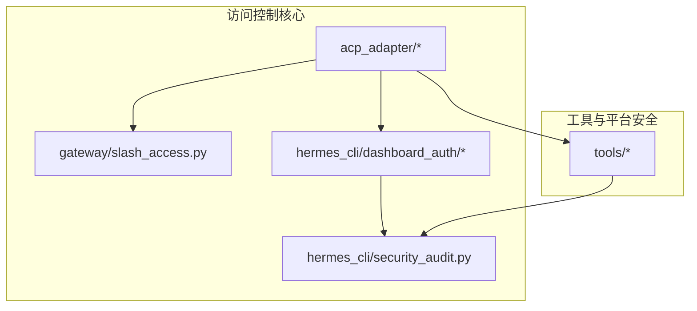
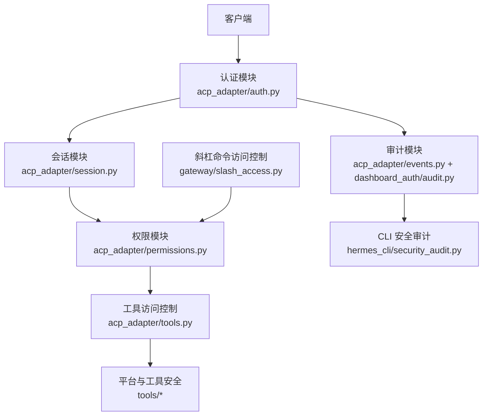
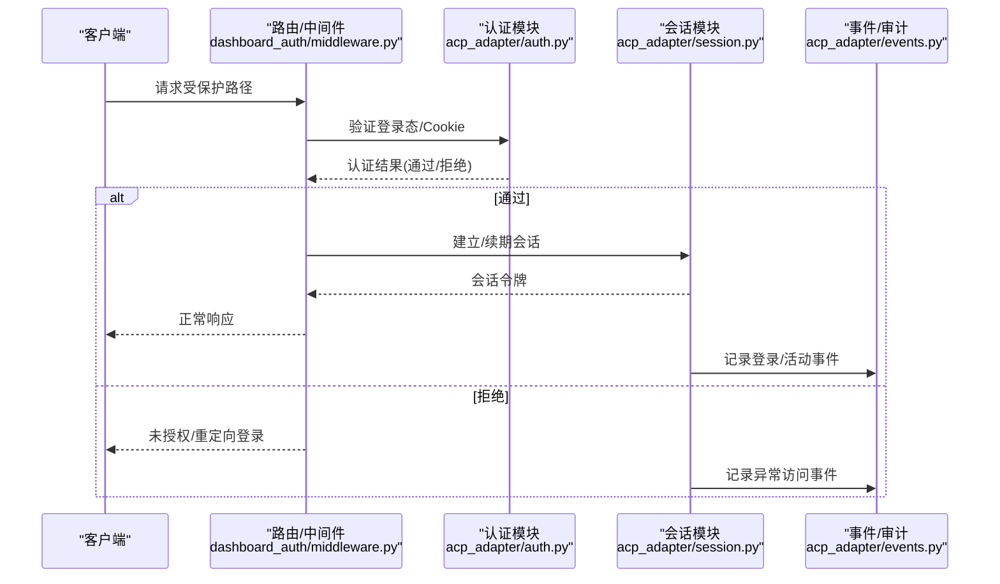
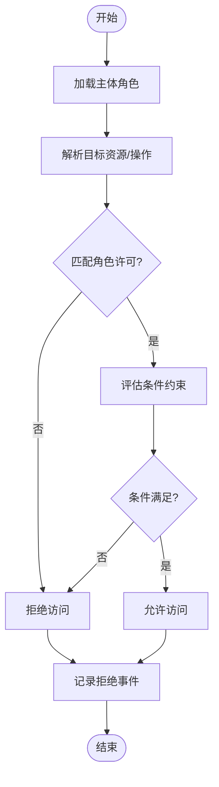
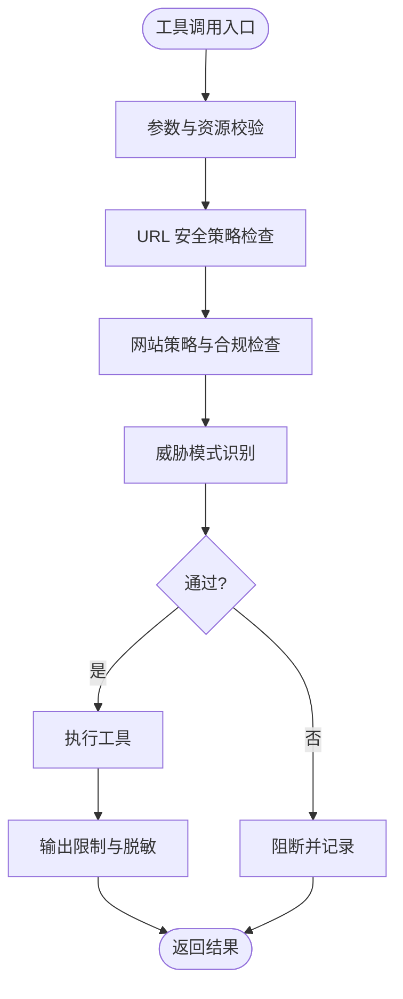
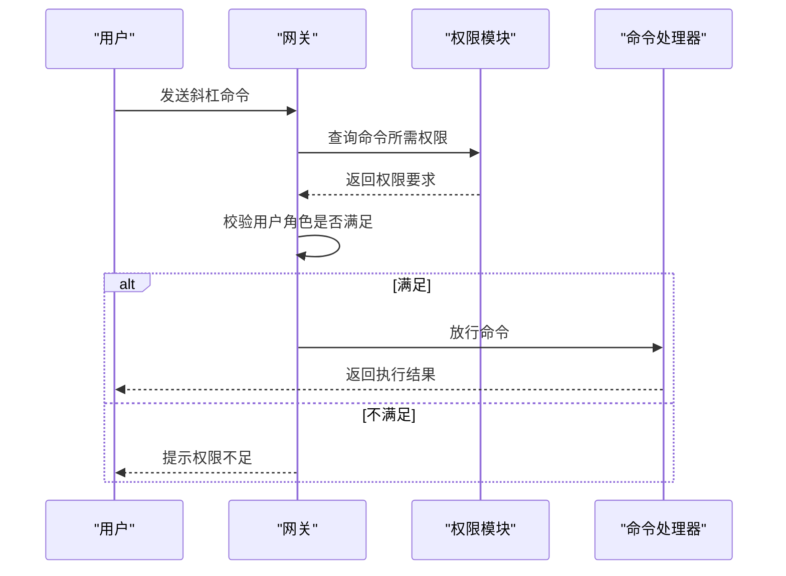
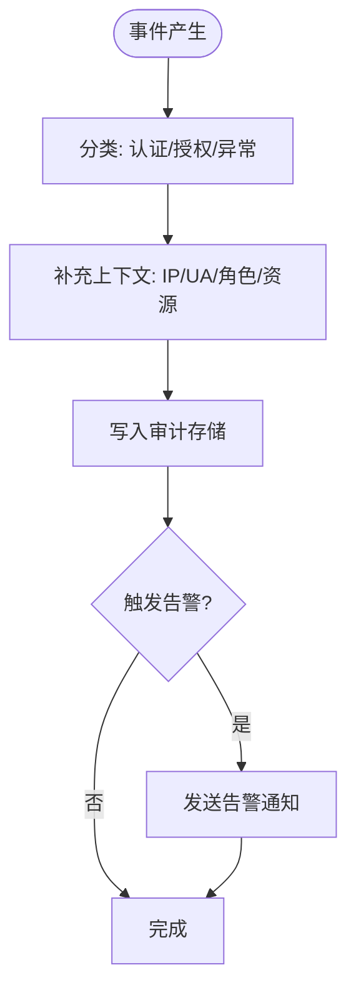
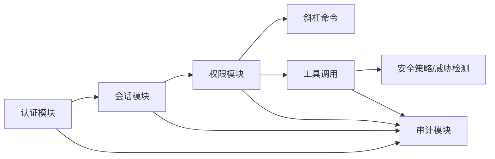

# 访问控制

<cite>
**本文引用的文件**
- [acp_adapter/__init__.py](file://acp_adapter/__init__.py)
- [acp_adapter/auth.py](file://acp_adapter/auth.py)
- [acp_adapter/edit_approval.py](file://acp_adapter/edit_approval.py)
- [acp_adapter/entry.py](file://acp_adapter/entry.py)
- [acp_adapter/events.py](file://acp_adapter/events.py)
- [acp_adapter/permissions.py](file://acp_adapter/permissions.py)
- [acp_adapter/server.py](file://acp_adapter/server.py)
- [acp_adapter/session.py](file://acp_adapter/session.py)
- [acp_adapter/tools.py](file://acp_adapter/tools.py)
- [gateway/slash_access.py](file://gateway/slash_access.py)
- [hermes_cli/dashboard_auth/audit.py](file://hermes_cli/dashboard_auth/audit.py)
- [hermes_cli/dashboard_auth/middleware.py](file://hermes_cli/dashboard_auth/middleware.py)
- [hermes_cli/dashboard_auth/public_paths.py](file://hermes_cli/dashboard_auth/public_paths.py)
- [hermes_cli/dashboard_auth/routes.py](file://hermes_cli/dashboard_auth/routes.py)
- [hermes_cli/security_audit.py](file://hermes_cli/security_audit.py)
- [tools/skills_guard.py](file://tools/skills_guard.py)
- [tools/tool_backend_helpers.py](file://tools/tool_backend_helpers.py)
- [tools/url_safety.py](file://tools/url_safety.py)
- [tools/website_policy.py](file://tools/website_policy.py)
- [tools/threat_patterns.py](file://tools/threat_patterns.py)
- [tools/tirith_security.py](file://tools/tirith_security.py)
- [tests/acp/test_auth.py](file://tests/acp/test_auth.py)
- [tests/acp/test_permissions.py](file://tests/acp/test_permissions.py)
- [tests/acp/test_session.py](file://tests/acp/test_session.py)
- [tests/acp/test_tools.py](file://tests/acp/test_tools.py)
- [tests/acp/test_entry.py](file://tests/acp/test_entry.py)
- [tests/acp/test_events.py](file://tests/acp/test_events.py)
- [tests/acp/test_edit_approval.py](file://tests/acp/test_edit_approval.py)
- [tests/acp/test_server.py](file://tests/acp/test_server.py)
</cite>

## 目录
1. [简介](#简介)
2. [项目结构](#项目结构)
3. [核心组件](#核心组件)
4. [架构总览](#架构总览)
5. [详细组件分析](#详细组件分析)
6. [依赖关系分析](#依赖关系分析)
7. [性能考量](#性能考量)
8. [故障排除指南](#故障排除指南)
9. [结论](#结论)
10. [附录](#附录)

## 简介
本文件面向系统管理员与安全工程师，系统化梳理 Hermes Agent 的访问控制体系，重点覆盖以下方面：
- ACCP 权限管理机制：权限模型、角色与资源映射、访问决策流程
- 认证流程：登录态、Cookie 与会话、公共路径与中间件策略
- 会话控制策略：会话生命周期、超时与续期、异常检测与审计
- 斜杠命令访问控制：命令白名单与权限校验
- 平台权限与工具访问限制：工具后端安全、URL 安全策略、威胁模式识别
- 权限配置、审计日志与异常检测：安全审计与告警联动
- 最佳实践与故障排除：部署与运维建议

## 项目结构
访问控制相关代码主要分布在如下模块：
- acp_adapter：ACCP 核心适配器（认证、会话、权限、工具、事件等）
- gateway/slash_access：斜杠命令访问控制入口
- hermes_cli/dashboard_auth：仪表盘认证与审计
- hermes_cli/security_audit：CLI 安全审计
- tools/*：工具执行安全、URL 安全、网站策略与威胁检测

**图表来源**
- [acp_adapter/__init__.py](file://acp_adapter/__init__.py)
- [gateway/slash_access.py](file://gateway/slash_access.py)
- [hermes_cli/dashboard_auth/audit.py](file://hermes_cli/dashboard_auth/audit.py)
- [hermes_cli/security_audit.py](file://hermes_cli/security_audit.py)
- [tools/url_safety.py](file://tools/url_safety.py)

**章节来源**
- [acp_adapter/__init__.py](file://acp_adapter/__init__.py)
- [gateway/slash_access.py](file://gateway/slash_access.py)
- [hermes_cli/dashboard_auth/audit.py](file://hermes_cli/dashboard_auth/audit.py)
- [hermes_cli/security_audit.py](file://hermes_cli/security_audit.py)
- [tools/url_safety.py](file://tools/url_safety.py)

## 核心组件
- 认证与会话：负责用户身份验证、会话建立与续期、登录态持久化
- 权限与角色：定义资源与操作集合、角色到权限映射、访问决策
- 工具访问控制：对工具调用进行前置校验与限制
- 事件与审计：记录访问事件、异常行为与安全审计
- 斜杠命令访问控制：基于权限的命令拦截与放行
- 平台与工具安全：URL 安全策略、网站策略、威胁模式识别

**章节来源**
- [acp_adapter/auth.py](file://acp_adapter/auth.py)
- [acp_adapter/session.py](file://acp_adapter/session.py)
- [acp_adapter/permissions.py](file://acp_adapter/permissions.py)
- [acp_adapter/tools.py](file://acp_adapter/tools.py)
- [acp_adapter/events.py](file://acp_adapter/events.py)
- [gateway/slash_access.py](file://gateway/slash_access.py)
- [hermes_cli/dashboard_auth/audit.py](file://hermes_cli/dashboard_auth/audit.py)
- [tools/url_safety.py](file://tools/url_safety.py)
- [tools/website_policy.py](file://tools/website_policy.py)
- [tools/threat_patterns.py](file://tools/threat_patterns.py)
- [tools/tirith_security.py](file://tools/tirith_security.py)

## 架构总览
下图展示访问控制在系统中的交互关系：客户端请求经由认证与会话模块完成身份确认；权限模块根据角色与资源进行访问决策；工具与平台安全模块在执行前进行二次校验；事件与审计模块贯穿全流程以支持审计与异常检测。

**图表来源**
- [acp_adapter/auth.py](file://acp_adapter/auth.py)
- [acp_adapter/session.py](file://acp_adapter/session.py)
- [acp_adapter/permissions.py](file://acp_adapter/permissions.py)
- [acp_adapter/tools.py](file://acp_adapter/tools.py)
- [acp_adapter/events.py](file://acp_adapter/events.py)
- [gateway/slash_access.py](file://gateway/slash_access.py)
- [hermes_cli/dashboard_auth/audit.py](file://hermes_cli/dashboard_auth/audit.py)
- [hermes_cli/security_audit.py](file://hermes_cli/security_audit.py)
- [tools/url_safety.py](file://tools/url_safety.py)

## 详细组件分析

### 认证与会话（acp_adapter）
- 认证流程要点
  - 登录态与 Cookie：通过登录页面与中间件维护会话，公共路径允许匿名访问
  - 会话生命周期：建立、续期与失效处理
  - 中间件策略：对受保护路径进行鉴权拦截
- 会话控制策略
  - 超时与续期：基于时间窗口的会话刷新
  - 异常检测：登录失败、并发会话、异常 IP 等触发告警
- 审计与事件
  - 记录登录、登出、权限变更、异常访问等事件
  - 与 CLI 安全审计联动，统一输出与告警

**图表来源**
- [acp_adapter/auth.py](file://acp_adapter/auth.py)
- [acp_adapter/session.py](file://acp_adapter/session.py)
- [acp_adapter/events.py](file://acp_adapter/events.py)
- [hermes_cli/dashboard_auth/middleware.py](file://hermes_cli/dashboard_auth/middleware.py)

**章节来源**
- [acp_adapter/auth.py](file://acp_adapter/auth.py)
- [acp_adapter/session.py](file://acp_adapter/session.py)
- [acp_adapter/events.py](file://acp_adapter/events.py)
- [hermes_cli/dashboard_auth/middleware.py](file://hermes_cli/dashboard_auth/middleware.py)
- [hermes_cli/dashboard_auth/public_paths.py](file://hermes_cli/dashboard_auth/public_paths.py)

### 权限模型与角色管理（acp_adapter）
- 权限模型
  - 资源与操作：抽象为资源集合与可执行操作集合
  - 角色到权限映射：角色具备一组许可，许可决定可访问的资源与操作
  - 访问决策：基于主体角色与目标资源/操作进行授权判断
- 决策过程
  - 输入：主体角色、资源标识、操作类型
  - 处理：匹配角色许可、叠加条件约束（如时间窗口、IP 白名单）
  - 输出：允许/拒绝，并记录决策轨迹
- 与斜杠命令集成
  - 命令访问控制在网关层进行，结合权限模块实现细粒度拦截

**图表来源**
- [acp_adapter/permissions.py](file://acp_adapter/permissions.py)
- [gateway/slash_access.py](file://gateway/slash_access.py)

**章节来源**
- [acp_adapter/permissions.py](file://acp_adapter/permissions.py)
- [gateway/slash_access.py](file://gateway/slash_access.py)

### 工具访问控制（acp_adapter/tools.py 与 tools/*）
- 工具后端安全
  - 执行前校验：参数合法性、资源访问范围、平台限制
  - 输出限制：结果大小、敏感信息脱敏、存储上限
- URL 安全策略
  - 对外部链接进行白名单/黑名单过滤，阻断高风险协议与域
- 网站策略与威胁检测
  - 网站内容合规性检查，识别钓鱼、恶意脚本等威胁模式
  - 与威胁模式库联动，动态更新策略

**图表来源**
- [acp_adapter/tools.py](file://acp_adapter/tools.py)
- [tools/url_safety.py](file://tools/url_safety.py)
- [tools/website_policy.py](file://tools/website_policy.py)
- [tools/threat_patterns.py](file://tools/threat_patterns.py)
- [tools/tirith_security.py](file://tools/tirith_security.py)

**章节来源**
- [acp_adapter/tools.py](file://acp_adapter/tools.py)
- [tools/url_safety.py](file://tools/url_safety.py)
- [tools/website_policy.py](file://tools/website_policy.py)
- [tools/threat_patterns.py](file://tools/threat_patterns.py)
- [tools/tirith_security.py](file://tools/tirith_security.py)

### 斜杠命令访问控制（gateway/slash_access.py）
- 命令白名单与权限映射：不同命令绑定不同权限级别
- 执行前拦截：在进入命令处理流程前进行权限校验
- 降级与回退：权限不足时返回提示或引导至更高权限流程

**图表来源**
- [gateway/slash_access.py](file://gateway/slash_access.py)
- [acp_adapter/permissions.py](file://acp_adapter/permissions.py)

**章节来源**
- [gateway/slash_access.py](file://gateway/slash_access.py)
- [acp_adapter/permissions.py](file://acp_adapter/permissions.py)

### 审计日志与异常检测（acp_adapter/events.py 与 hermes_cli/dashboard_auth/audit.py）
- 审计范围
  - 认证事件：登录成功/失败、会话建立/销毁
  - 授权事件：权限变更、命令访问尝试、工具调用
  - 异常事件：频繁失败、异常 IP、越权尝试
- 日志格式与存储
  - 结构化字段：时间戳、主体、资源、操作、结果、上下文
  - 存储位置：本地文件与可选远程聚合
- 异常检测
  - 基于阈值与规则的实时检测（如短时间内多次失败）
  - 与安全运营中心联动，触发告警与封禁

**图表来源**
- [acp_adapter/events.py](file://acp_adapter/events.py)
- [hermes_cli/dashboard_auth/audit.py](file://hermes_cli/dashboard_auth/audit.py)

**章节来源**
- [acp_adapter/events.py](file://acp_adapter/events.py)
- [hermes_cli/dashboard_auth/audit.py](file://hermes_cli/dashboard_auth/audit.py)

## 依赖关系分析
- 组件耦合
  - 认证与会话模块为其他模块提供身份与会话能力
  - 权限模块被命令与工具调用链路广泛依赖
  - 审计模块横切多个模块，形成统一的可观测性基础
- 外部依赖
  - Cookie/Session 存储、数据库（会话与审计）、第三方认证服务（可选）
- 潜在环路
  - 通过接口契约避免直接循环依赖，审计模块仅消费事件而不反向依赖业务模块

**图表来源**
- [acp_adapter/auth.py](file://acp_adapter/auth.py)
- [acp_adapter/session.py](file://acp_adapter/session.py)
- [acp_adapter/permissions.py](file://acp_adapter/permissions.py)
- [acp_adapter/events.py](file://acp_adapter/events.py)
- [gateway/slash_access.py](file://gateway/slash_access.py)
- [acp_adapter/tools.py](file://acp_adapter/tools.py)
- [tools/url_safety.py](file://tools/url_safety.py)
- [tools/threat_patterns.py](file://tools/threat_patterns.py)

**章节来源**
- [acp_adapter/auth.py](file://acp_adapter/auth.py)
- [acp_adapter/session.py](file://acp_adapter/session.py)
- [acp_adapter/permissions.py](file://acp_adapter/permissions.py)
- [acp_adapter/events.py](file://acp_adapter/events.py)
- [gateway/slash_access.py](file://gateway/slash_access.py)
- [acp_adapter/tools.py](file://acp_adapter/tools.py)
- [tools/url_safety.py](file://tools/url_safety.py)
- [tools/threat_patterns.py](file://tools/threat_patterns.py)

## 性能考量
- 会话与权限缓存：对常用角色与权限进行内存缓存，降低查询开销
- 异步审计：审计写入采用异步队列，避免阻塞主流程
- URL 与策略检查：预编译正则与白名单，减少运行时匹配成本
- 超时与重试：会话续期与权限查询设置合理超时与指数退避

## 故障排除指南
- 常见问题
  - 登录失败：检查 Cookie 设置、会话存储可用性、中间件路径配置
  - 权限不足：核对角色许可、命令/工具权限映射、条件约束
  - 工具调用被阻断：检查 URL 安全策略、网站策略与威胁模式库
  - 审计缺失：确认审计模块初始化、存储路径权限、告警通道配置
- 测试与验证
  - 使用测试套件验证认证、权限、会话、工具与事件模块的行为一致性
- 快速定位
  - 查看审计日志中“拒绝/异常”事件，结合上下文字段快速定位问题根因

**章节来源**
- [tests/acp/test_auth.py](file://tests/acp/test_auth.py)
- [tests/acp/test_permissions.py](file://tests/acp/test_permissions.py)
- [tests/acp/test_session.py](file://tests/acp/test_session.py)
- [tests/acp/test_tools.py](file://tests/acp/test_tools.py)
- [tests/acp/test_entry.py](file://tests/acp/test_entry.py)
- [tests/acp/test_events.py](file://tests/acp/test_events.py)
- [tests/acp/test_edit_approval.py](file://tests/acp/test_edit_approval.py)
- [tests/acp/test_server.py](file://tests/acp/test_server.py)

## 结论
Hermes Agent 的访问控制体系以 ACCP 为核心，结合认证、会话、权限、工具与平台安全、审计与异常检测，形成从入口到执行的全链路安全闭环。通过角色与资源的精细化建模、命令与工具的细粒度控制、以及持续的审计与告警，系统能够在保障可用性的前提下，有效降低越权与滥用风险。建议在生产环境中启用严格的 URL 安全策略、定期审查角色与许可映射、强化异常检测与告警联动，并遵循最小权限原则进行权限配置。

## 附录
- 最佳实践
  - 权限配置
    - 采用最小权限原则，按职责分配角色
    - 定期复核角色许可，清理冗余权限
    - 对高危命令与工具设置额外条件约束（如时间窗口、IP 白名单）
  - 安全策略配置
    - 启用 HTTPS 与安全 Cookie 标志
    - 配置强密码策略与多因素认证（MFA）
    - 建立 URL 白名单与网站策略基线，定期更新威胁模式库
  - 运维建议
    - 开启审计日志并接入集中式日志系统
    - 设置阈值告警与自动化封禁策略
    - 定期演练权限滥用与异常访问场景，完善应急预案