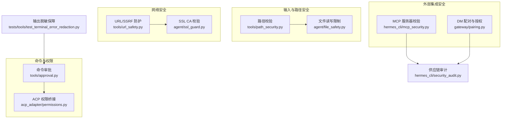
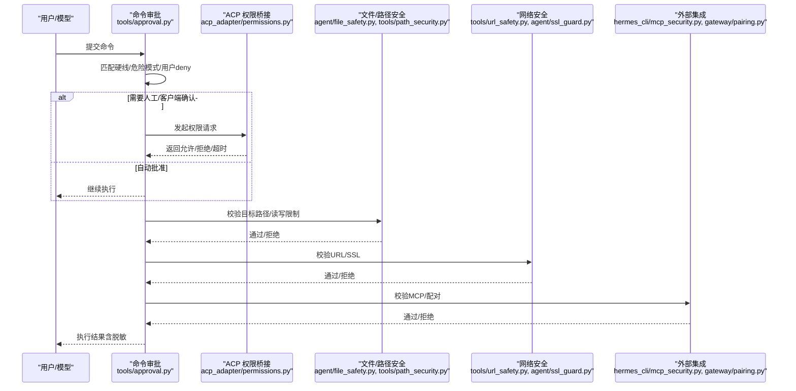
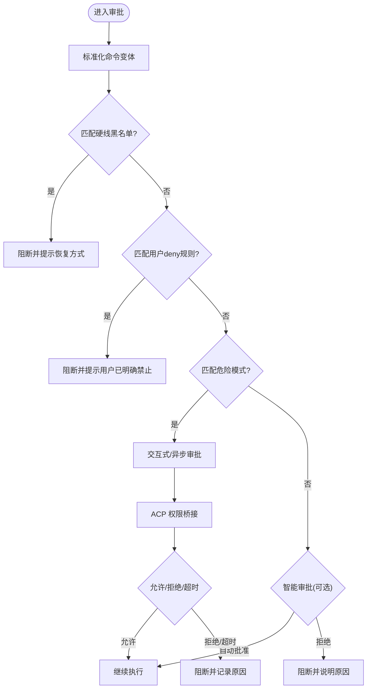
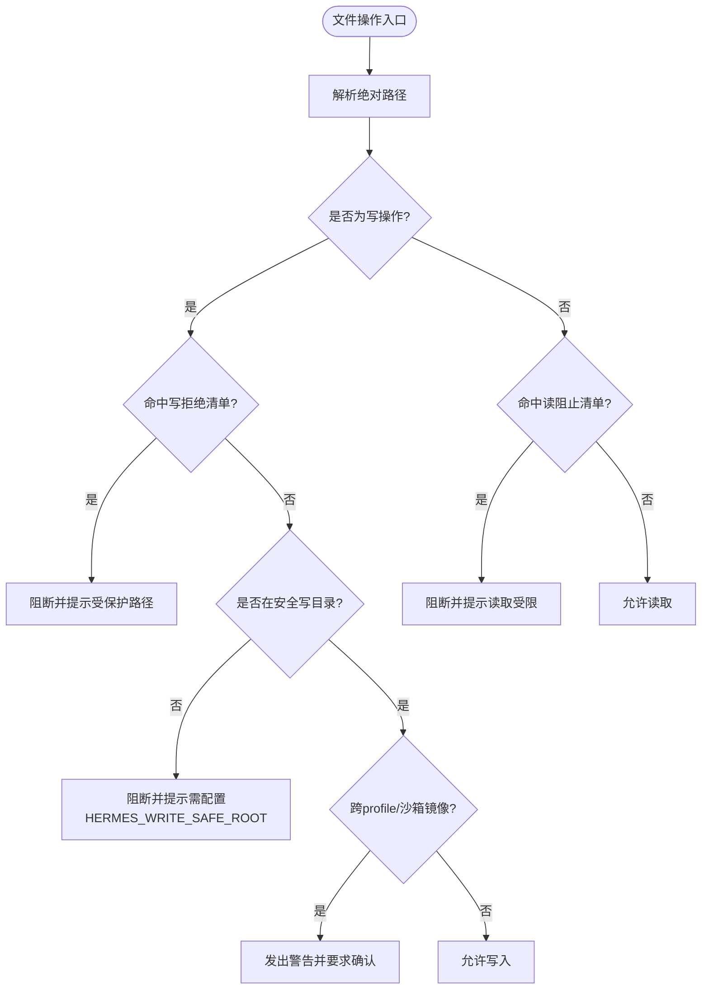
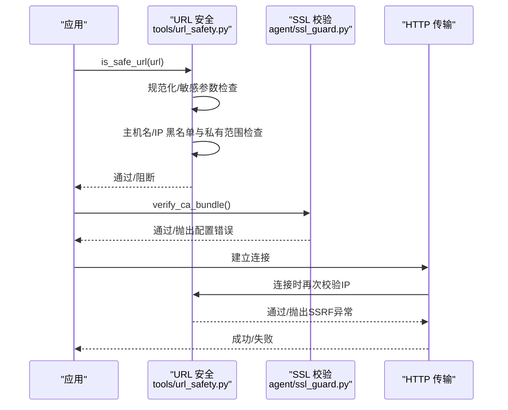
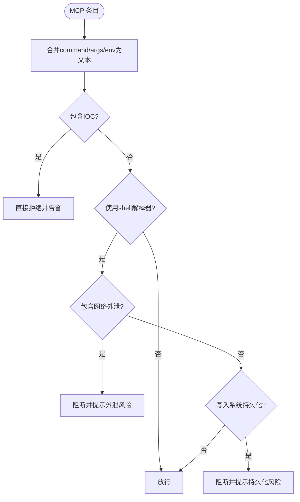
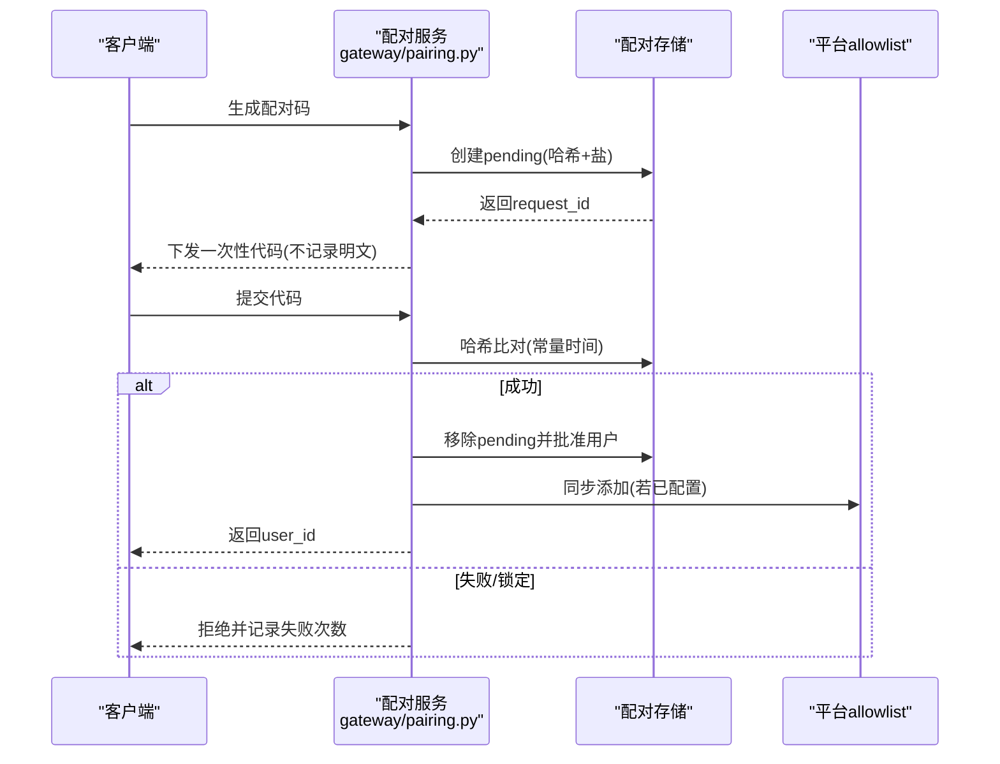
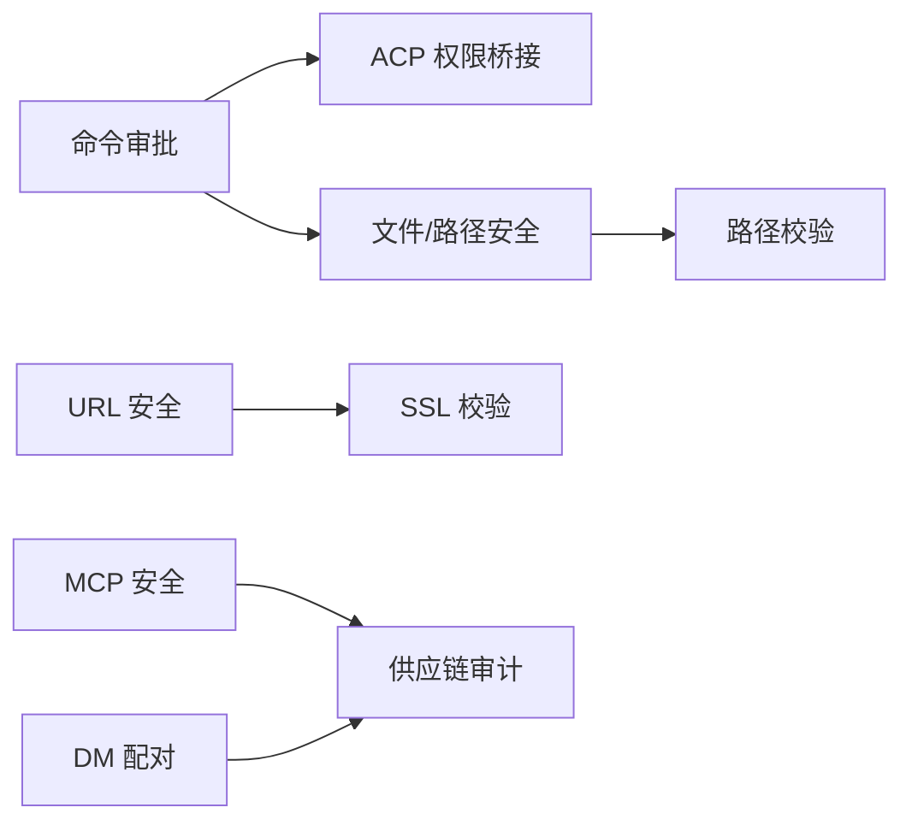

# 安全考虑

<cite>
**本文引用的文件**
- [tools/path_security.py](file://tools/path_security.py)
- [agent/file_safety.py](file://agent/file_safety.py)
- [hermes_cli/mcp_security.py](file://hermes_cli/mcp_security.py)
- [acp_adapter/permissions.py](file://acp_adapter/permissions.py)
- [tools/approval.py](file://tools/approval.py)
- [tools/url_safety.py](file://tools/url_safety.py)
- [agent/ssl_guard.py](file://agent/ssl_guard.py)
- [gateway/pairing.py](file://gateway/pairing.py)
- [hermes_cli/security_audit.py](file://hermes_cli/security_audit.py)
- [tests/tools/test_terminal_error_redaction.py](file://tests/tools/test_terminal_error_redaction.py)
</cite>

## 目录
1. [简介](#简介)
2. [项目结构](#项目结构)
3. [核心组件](#核心组件)
4. [架构总览](#架构总览)
5. [详细组件分析](#详细组件分析)
6. [依赖关系分析](#依赖关系分析)
7. [性能与安全权衡](#性能与安全权衡)
8. [故障排查指南](#故障排查指南)
9. [结论](#结论)
10. [附录：生产基线与加固建议](#附录生产基线与加固建议)

## 简介
本文件面向生产部署与运维团队，系统性梳理 Hermes Agent 的安全能力与控制点，覆盖权限控制、输入验证、命令审批、DM 配对、容器隔离、路径安全、输入清理、工具护栏、敏感信息保护、网络安全与访问控制策略。同时提供安全配置指南、风险评估方法、常见威胁防护与应急响应流程，以及审计日志、安全扫描与合规性检查的实践建议。

## 项目结构
围绕安全的关键模块分布在以下位置：
- 命令审批与危险指令检测：tools/approval.py
- ACP 权限桥接：acp_adapter/permissions.py
- 路径与文件安全：tools/path_security.py、agent/file_safety.py
- 网络安全（SSRF）：tools/url_safety.py
- SSL/TLS 证书校验：agent/ssl_guard.py
- DM 配对与授权：gateway/pairing.py
- MCP 服务器安全校验：hermes_cli/mcp_security.py
- 供应链漏洞审计：hermes_cli/security_audit.py
- 输出脱敏测试用例：tests/tools/test_terminal_error_redaction.py

**图表来源**
- [tools/approval.py:1-120](file://tools/approval.py#L1-L120)
- [acp_adapter/permissions.py:1-183](file://acp_adapter/permissions.py#L1-L183)
- [tools/path_security.py:1-44](file://tools/path_security.py#L1-L44)
- [agent/file_safety.py:1-180](file://agent/file_safety.py#L1-L180)
- [tools/url_safety.py:1-120](file://tools/url_safety.py#L1-L120)
- [agent/ssl_guard.py:1-102](file://agent/ssl_guard.py#L1-L102)
- [hermes_cli/mcp_security.py:1-182](file://hermes_cli/mcp_security.py#L1-L182)
- [gateway/pairing.py:1-120](file://gateway/pairing.py#L1-L120)
- [hermes_cli/security_audit.py:1-120](file://hermes_cli/security_audit.py#L1-L120)
- [tests/tools/test_terminal_error_redaction.py:1-154](file://tests/tools/test_terminal_error_redaction.py#L1-L154)

**章节来源**
- [tools/approval.py:1-120](file://tools/approval.py#L1-L120)
- [tools/path_security.py:1-44](file://tools/path_security.py#L1-L44)
- [agent/file_safety.py:1-180](file://agent/file_safety.py#L1-L180)
- [tools/url_safety.py:1-120](file://tools/url_safety.py#L1-L120)
- [agent/ssl_guard.py:1-102](file://agent/ssl_guard.py#L1-L102)
- [hermes_cli/mcp_security.py:1-182](file://hermes_cli/mcp_security.py#L1-L182)
- [gateway/pairing.py:1-120](file://gateway/pairing.py#L1-L120)
- [hermes_cli/security_audit.py:1-120](file://hermes_cli/security_audit.py#L1-L120)
- [tests/tools/test_terminal_error_redaction.py:1-154](file://tests/tools/test_terminal_error_redaction.py#L1-L154)

## 核心组件
- 命令审批机制：通过硬线黑名单、危险模式匹配、用户 deny 规则与智能辅助 LLM 决策，结合上下文变量实现并发安全的会话级审批状态管理；支持 CLI 交互与网关异步审批回调。
- ACP 权限桥接：将 Hermes 的“允许一次/会话/永久”语义映射到 ACP 的许可选项，并生成待执行工具调用更新，等待客户端响应后回译为 Hermes 结果。
- 路径与文件安全：统一的路径解析与越界检测，严格的写拒绝清单与读阻止清单，跨配置文件与沙箱镜像写入警告，防止误写或越权访问。
- 网络安全（SSRF）：对 URL 进行规范化、查询参数敏感字段识别、主机名与 IP 白名单/黑名单校验，连接时二次 DNS 校验，阻断云元数据与内网地址。
- SSL/TLS 校验：启动前校验 CA 包完整性与可加载性，给出修复指引，避免静默失败。
- DM 配对：基于不可混淆字符集、密码学随机数、过期时间、速率限制、失败锁定与文件权限控制的配对流程，支持与平台 allowlist 同步。
- MCP 服务器安全：拦截网络外泄形状、系统持久化写入形状与已知 IOC，保存与启动双阶段校验。
- 供应链审计：扫描 venv、插件与 MCP 组件版本，批量查询 OSV.dev，输出严重级别与修复版本，支持 CI 门禁。

**章节来源**
- [tools/approval.py:1-120](file://tools/approval.py#L1-L120)
- [acp_adapter/permissions.py:1-183](file://acp_adapter/permissions.py#L1-L183)
- [tools/path_security.py:1-44](file://tools/path_security.py#L1-L44)
- [agent/file_safety.py:1-180](file://agent/file_safety.py#L1-L180)
- [tools/url_safety.py:1-120](file://tools/url_safety.py#L1-L120)
- [agent/ssl_guard.py:1-102](file://agent/ssl_guard.py#L1-L102)
- [gateway/pairing.py:1-120](file://gateway/pairing.py#L1-L120)
- [hermes_cli/mcp_security.py:1-182](file://hermes_cli/mcp_security.py#L1-L182)
- [hermes_cli/security_audit.py:1-120](file://hermes_cli/security_audit.py#L1-L120)

## 架构总览
Hermes 的安全架构采用“多层防御 + 最小权限 + 默认拒绝”的原则：
- 入口层：命令审批与 ACP 权限桥接决定是否允许执行高危操作。
- 资源层：路径与文件安全限制读写范围，防止越权访问与误写。
- 网络层：URL 安全与 SSL 校验阻断 SSRF 与证书问题。
- 集成层：MCP 服务器安全校验与 DM 配对确保外部集成可信。
- 运营层：供应链审计与输出脱敏保障运行期与交付期安全。

**图表来源**
- [tools/approval.py:1-120](file://tools/approval.py#L1-L120)
- [acp_adapter/permissions.py:1-183](file://acp_adapter/permissions.py#L1-L183)
- [agent/file_safety.py:1-180](file://agent/file_safety.py#L1-L180)
- [tools/path_security.py:1-44](file://tools/path_security.py#L1-L44)
- [tools/url_safety.py:1-120](file://tools/url_safety.py#L1-L120)
- [agent/ssl_guard.py:1-102](file://agent/ssl_guard.py#L1-L102)
- [hermes_cli/mcp_security.py:1-182](file://hermes_cli/mcp_security.py#L1-L182)
- [gateway/pairing.py:1-120](file://gateway/pairing.py#L1-L120)

## 详细组件分析

### 命令审批机制
- 硬线黑名单：针对破坏性操作（如递归删除根目录、格式化文件系统、写入块设备、系统关机/重启等）无条件阻断，即使 YOLO 模式也不放行。
- 危险模式匹配：覆盖 rm/chmod/chown/dd/systemctl/kill 等高风险命令及管道注入、编码解码执行等变体。
- 用户 deny 规则：config.yaml 中 approvals.deny 支持 fnmatch 模式，优先级高于 yolo 与 mode=off。
- 上下文隔离：使用 contextvars 绑定会话键、turn_id、tool_call_id，避免并发环境下的状态污染。
- 智能审批：可选地通过辅助 LLM 对低风险命令自动批准，并在前后触发观察钩子（pre/post approval），对敏感文本进行脱敏。

**图表来源**
- [tools/approval.py:350-540](file://tools/approval.py#L350-L540)
- [tools/approval.py:690-800](file://tools/approval.py#L690-L800)
- [acp_adapter/permissions.py:110-183](file://acp_adapter/permissions.py#L110-L183)

**章节来源**
- [tools/approval.py:1-120](file://tools/approval.py#L1-L120)
- [tools/approval.py:350-540](file://tools/approval.py#L350-L540)
- [tools/approval.py:690-800](file://tools/approval.py#L690-L800)
- [acp_adapter/permissions.py:110-183](file://acp_adapter/permissions.py#L110-L183)

### 路径与文件安全
- 路径校验：统一 resolve() + relative_to() 校验，检测 .. 穿越与符号链接绕过。
- 写拒绝清单：屏蔽 SSH、.env、OAuth 缓存、sudoers、passwd/shadow 等敏感路径；支持 HERMES_WRITE_SAFE_ROOT 限定安全写目录。
- 读阻止清单：屏蔽内部缓存、凭证存储、项目 .env 等，防止提示注入与凭据泄露。
- 跨配置/沙箱镜像警告：当写入目标属于其他 profile 或沙箱镜像时，给出明确警告，要求显式确认。

**图表来源**
- [tools/path_security.py:15-44](file://tools/path_security.py#L15-L44)
- [agent/file_safety.py:28-180](file://agent/file_safety.py#L28-L180)
- [agent/file_safety.py:194-362](file://agent/file_safety.py#L194-L362)
- [agent/file_safety.py:417-506](file://agent/file_safety.py#L417-L506)
- [agent/file_safety.py:551-616](file://agent/file_safety.py#L551-L616)

**章节来源**
- [tools/path_security.py:15-44](file://tools/path_security.py#L15-L44)
- [agent/file_safety.py:28-180](file://agent/file_safety.py#L28-L180)
- [agent/file_safety.py:194-362](file://agent/file_safety.py#L194-L362)
- [agent/file_safety.py:417-506](file://agent/file_safety.py#L417-L506)
- [agent/file_safety.py:551-616](file://agent/file_safety.py#L551-L616)

### 网络安全（SSRF）与 TLS
- URL 安全：规范化 URL、识别敏感查询参数、阻断云元数据主机名与 IP、私有/环回/保留/CNGAT 地址；支持全局开关 security.allow_private_urls 与代理环境处理。
- 连接时校验：在 httpx 传输层替换网络后端，连接前再次解析并校验 IP，阻断 Unix socket 直连。
- SSL 校验：启动时校验 CA bundle 存在性与可加载性，给出修复建议。

**图表来源**
- [tools/url_safety.py:58-162](file://tools/url_safety.py#L58-L162)
- [tools/url_safety.py:311-520](file://tools/url_safety.py#L311-L520)
- [tools/url_safety.py:539-753](file://tools/url_safety.py#L539-L753)
- [agent/ssl_guard.py:46-102](file://agent/ssl_guard.py#L46-L102)

**章节来源**
- [tools/url_safety.py:58-162](file://tools/url_safety.py#L58-L162)
- [tools/url_safety.py:311-520](file://tools/url_safety.py#L311-L520)
- [tools/url_safety.py:539-753](file://tools/url_safety.py#L539-L753)
- [agent/ssl_guard.py:46-102](file://agent/ssl_guard.py#L46-L102)

### MCP 服务器安全
- 拦截网络外泄：检测 shell 解释器配合 curl/wget/nc/socat/Invoke-WebRequest 等外发工具。
- 拦截系统持久化：检测写入 authorized_keys、/etc/ssh、PAM、sudoers、cron、rc 文件等。
- IOC 阻断：内置已知攻击指标（SSH 公钥片段、源 IP 段），保存与启动双阶段拒绝。

**图表来源**
- [hermes_cli/mcp_security.py:33-88](file://hermes_cli/mcp_security.py#L33-L88)
- [hermes_cli/mcp_security.py:121-182](file://hermes_cli/mcp_security.py#L121-L182)

**章节来源**
- [hermes_cli/mcp_security.py:33-88](file://hermes_cli/mcp_security.py#L33-L88)
- [hermes_cli/mcp_security.py:121-182](file://hermes_cli/mcp_security.py#L121-L182)

### DM 配对与授权
- 代码生成：8 位不混淆字符、密码学随机、1 小时过期、每平台最多 3 个待处理。
- 速率限制与锁定：每用户 10 分钟一次，失败 5 次锁定 1 小时。
- 存储安全：原子写入、0600 权限、哈希存储代码（salt+SHA-256）、常量时间比较。
- 与平台 allowlist 同步：若已配置环境变量 allowlist，则批准时追加、撤销时移除，保持单一事实来源。

**图表来源**
- [gateway/pairing.py:46-120](file://gateway/pairing.py#L46-L120)
- [gateway/pairing.py:379-403](file://gateway/pairing.py#L379-L403)
- [gateway/pairing.py:609-722](file://gateway/pairing.py#L609-L722)
- [gateway/pairing.py:735-768](file://gateway/pairing.py#L735-L768)

**章节来源**
- [gateway/pairing.py:46-120](file://gateway/pairing.py#L46-L120)
- [gateway/pairing.py:379-403](file://gateway/pairing.py#L379-L403)
- [gateway/pairing.py:609-722](file://gateway/pairing.py#L609-L722)
- [gateway/pairing.py:735-768](file://gateway/pairing.py#L735-L768)

### 输出脱敏与敏感信息保护
- 终端工具错误与回溯：确保错误消息与 traceback 中的密钥形状字符串被掩蔽。
- 成功输出：支持命令感知的脱敏器，可按需关闭脱敏（仅用于调试场景）。
- 测试覆盖：多场景断言确保密钥不被泄露。

**章节来源**
- [tests/tools/test_terminal_error_redaction.py:1-154](file://tests/tools/test_terminal_error_redaction.py#L1-L154)

## 依赖关系分析
- 命令审批依赖上下文变量与插件生命周期钩子，A CP 权限桥接依赖事件循环调度与超时控制。
- 文件安全依赖路径解析与系统路径常量，跨 profile 与沙箱镜像检测依赖路径形状匹配。
- 网络安全依赖 DNS 解析与 httpx 传输层替换，SSL 校验依赖 certifi 与系统 CA 包。
- MCP 安全依赖命令行解析与正则匹配，供应链审计依赖 importlib.metadata 与 OSV.dev API。

**图表来源**
- [tools/approval.py:1-120](file://tools/approval.py#L1-L120)
- [acp_adapter/permissions.py:1-183](file://acp_adapter/permissions.py#L1-L183)
- [tools/path_security.py:1-44](file://tools/path_security.py#L1-L44)
- [agent/file_safety.py:1-180](file://agent/file_safety.py#L1-L180)
- [tools/url_safety.py:1-120](file://tools/url_safety.py#L1-L120)
- [agent/ssl_guard.py:1-102](file://agent/ssl_guard.py#L1-L102)
- [hermes_cli/mcp_security.py:1-182](file://hermes_cli/mcp_security.py#L1-L182)
- [gateway/pairing.py:1-120](file://gateway/pairing.py#L1-L120)
- [hermes_cli/security_audit.py:1-120](file://hermes_cli/security_audit.py#L1-L120)

**章节来源**
- [tools/approval.py:1-120](file://tools/approval.py#L1-L120)
- [acp_adapter/permissions.py:1-183](file://acp_adapter/permissions.py#L1-L183)
- [tools/path_security.py:1-44](file://tools/path_security.py#L1-L44)
- [agent/file_safety.py:1-180](file://agent/file_safety.py#L1-L180)
- [tools/url_safety.py:1-120](file://tools/url_safety.py#L1-L120)
- [agent/ssl_guard.py:1-102](file://agent/ssl_guard.py#L1-L102)
- [hermes_cli/mcp_security.py:1-182](file://hermes_cli/mcp_security.py#L1-L182)
- [gateway/pairing.py:1-120](file://gateway/pairing.py#L1-L120)
- [hermes_cli/security_audit.py:1-120](file://hermes_cli/security_audit.py#L1-L120)

## 性能与安全权衡
- 命令审批：预编译正则减少冷启动开销；上下文变量避免进程级锁竞争。
- URL 安全：DNS 解析在异步线程执行，避免阻塞事件循环；连接时二次校验增加少量延迟但显著提升安全性。
- 供应链审计：批量查询 OSV.dev，并行获取详情，控制并发度以避免网络拥塞。
- 文件安全：路径解析与相对路径检查为 O(n) 复杂度，影响极小；沙箱镜像检测为字符串匹配，开销低。

[本节为通用指导，无需特定文件来源]

## 故障排查指南
- SSL 配置错误：若出现证书加载失败，检查 HERMES_CA_BUNDLE、SSL_CERT_FILE、REQUESTS_CA_BUNDLE、CURL_CA_BUNDLE 指向的文件是否存在且有效；运行 hermes doctor --fix 或重装 certifi/openai/httpx。
- SSRF 阻断：若请求被阻断，检查域名是否解析到私有/云元数据 IP；必要时启用 security.allow_private_urls 并评估风险。
- 命令审批阻断：查看硬线黑名单与危险模式匹配原因；如需执行，请在安全环境中手动运行或通过审批流程。
- MCP 条目被拒：检查 command/args/env 是否包含外泄或持久化写入模式；移除 IOC 并修正命令。
- DM 配对失败：检查速率限制与锁定状态；确认 pending 列表与过期时间；核对平台 allowlist 环境变量。

**章节来源**
- [agent/ssl_guard.py:46-102](file://agent/ssl_guard.py#L46-L102)
- [tools/url_safety.py:311-520](file://tools/url_safety.py#L311-L520)
- [tools/approval.py:350-540](file://tools/approval.py#L350-L540)
- [hermes_cli/mcp_security.py:121-182](file://hermes_cli/mcp_security.py#L121-L182)
- [gateway/pairing.py:609-722](file://gateway/pairing.py#L609-L722)

## 结论
Hermes Agent 通过命令审批、路径与文件安全、网络安全、SSL 校验、MCP 安全、DM 配对与供应链审计等多层控制，构建了从输入到执行、从本地到网络的全面安全体系。生产部署应遵循最小权限、默认拒绝与纵深防御原则，结合审计与扫描实现持续合规。

[本节为总结性内容，无需特定文件来源]

## 附录：生产基线与加固建议
- 权限控制
  - 启用命令审批，配置 approvals.mode 与 approvals.deny；对高危命令强制人工审批。
  - 使用 ACP 权限桥接，限制“允许永久”选项，优先“允许一次/会话”。
- 输入验证
  - 对所有文件路径使用 validate_within_dir 与 read/write 拒绝清单；限制写目录至 HERMES_WRITE_SAFE_ROOT。
  - 对 URL 使用 is_safe_url 与 ssrf_safe_http_transport；禁用不必要的 private URL 访问。
- 工具护栏
  - 对 MCP 服务器进行保存与启动双阶段校验；移除 IOC 与危险模式。
  - 对终端输出启用脱敏，避免密钥泄露。
- 敏感信息保护
  - 禁止读写 .env、auth.json、mcp-tokens、pairing 等敏感路径；使用 secret sources 管理凭据。
  - 对 DM 配对代码使用哈希存储与常量时间比较，设置过期与速率限制。
- 网络安全
  - 启用 SSL CA 校验；定期更新 certifi；配置企业 CA 包并确保可加载。
  - 使用代理时注意 DNS 解析行为；避免 SSRF 与重定向绕过。
- 访问控制策略
  - 使用 DM 配对与平台 allowlist 控制接入；定期审查 approved 列表。
  - 对 cron 与后台任务启用审批模式，避免无人值守的高危执行。
- 风险评估方法
  - 使用 hermes security audit 扫描 venv、插件与 MCP 组件；按严重级别处理发现项。
  - 结合日志与审计钩子，追踪审批决策与工具调用轨迹。
- 应急响应流程
  - 发现 IOC 或 SSRF 尝试：立即阻断相关命令与网络访问，审查 MCP 配置与 pairing 列表。
  - 发生权限提升或持久化写入：检查 sudoers/PAM/cron/rc 文件，清除恶意条目并重置凭据。
  - 供应链漏洞：升级受影响组件至修复版本，复跑审计确认闭环。
- 审计日志与合规检查
  - 启用 pre/post approval 钩子，记录命令、描述、决策与上下文 ID。
  - 定期导出 pairing 与 approved 列表，审计平台 allowlist 变更。
  - 将 security audit 纳入 CI 门禁，fail-on 阈值根据业务风险设定。

[本节为通用指导，无需特定文件来源]