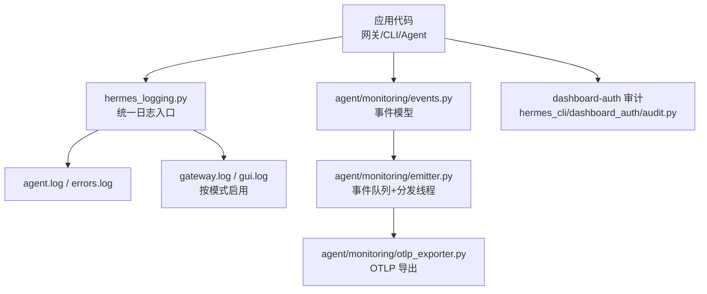
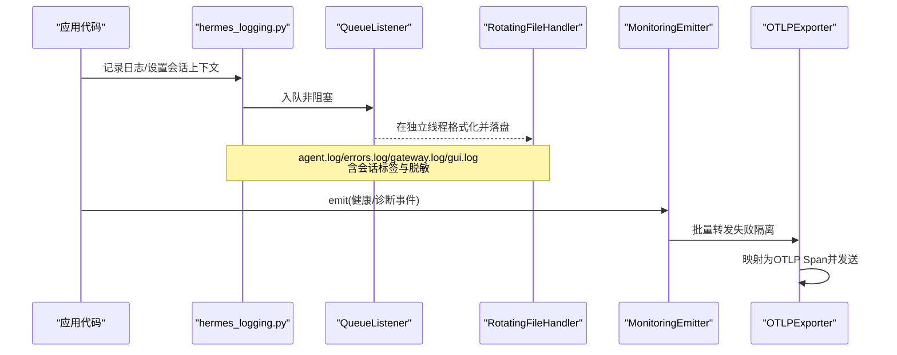
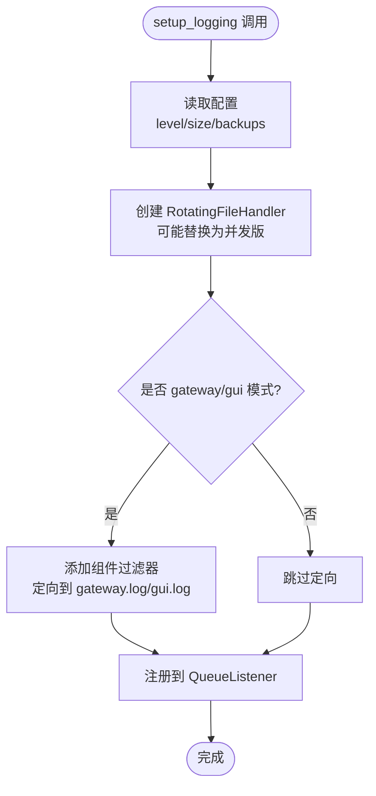
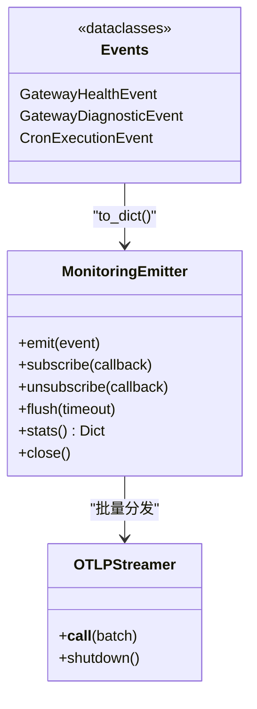
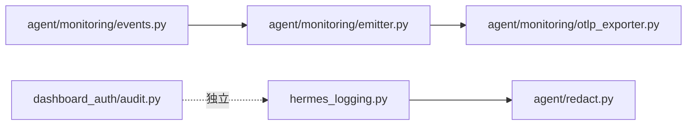

# 审计日志

<cite>
**本文引用的文件**
- [hermes_logging.py](file://hermes_logging.py)
- [agent/redact.py](file://agent/redact.py)
- [agent/monitoring/events.py](file://agent/monitoring/events.py)
- [agent/monitoring/emitter.py](file://agent/monitoring/emitter.py)
- [agent/monitoring/otlp_exporter.py](file://agent/monitoring/otlp_exporter.py)
- [agent/monitoring/redaction.py](file://agent/monitoring/redaction.py)
- [hermes_cli/dashboard_auth/audit.py](file://hermes_cli/dashboard_auth/audit.py)
- [gateway/stream_events.py](file://gateway/stream_events.py)
</cite>

## 目录
1. [简介](#简介)
2. [项目结构](#项目结构)
3. [核心组件](#核心组件)
4. [架构总览](#架构总览)
5. [详细组件分析](#详细组件分析)
6. [依赖关系分析](#依赖关系分析)
7. [性能考虑](#性能考虑)
8. [故障排查指南](#故障排查指南)
9. [结论](#结论)
10. [附录](#附录)

## 简介
本文件面向运维与合规团队，系统化说明 Hermes Agent 的审计日志体系：操作审计、事件追踪与合规性报告。内容覆盖用户行为记录、系统事件捕获、错误日志收集；日志级别配置、敏感信息过滤与日志轮转策略；实时日志监控、告警规则与性能影响评估；日志分析工具与查询语法建议；常见安全事件的识别方法与响应流程；以及完整的日志管理策略与故障诊断指南。

## 项目结构
Hermes Agent 将“可观测性”拆分为三层：
- 本地持久化日志：统一入口 hermes_logging.py，输出 agent.log、errors.log，并在 gateway/gui 模式下分别输出 gateway.log、gui.log。所有文件均通过 RotatingFileHandler 实现轮转，并使用 RedactingFormatter 防止敏感信息落盘。
- 结构化监控事件：agent/monitoring/events.py 定义健康与诊断事件；emitter.py 提供高吞吐、非阻塞的事件发射器；otlp_exporter.py 将事件映射为 OTLP Span 并导出到外部可观测平台。
- 认证审计日志：hermes_cli/dashboard_auth/audit.py 输出 dashboard-auth.log，对令牌类字段进行强制脱敏。

**图表来源**
- [hermes_logging.py:259-376](file://hermes_logging.py#L259-L376)
- [agent/monitoring/events.py:19-80](file://agent/monitoring/events.py#L19-L80)
- [agent/monitoring/emitter.py:36-116](file://agent/monitoring/emitter.py#L36-L116)
- [agent/monitoring/otlp_exporter.py:107-180](file://agent/monitoring/otlp_exporter.py#L107-L180)
- [hermes_cli/dashboard_auth/audit.py:71-96](file://hermes_cli/dashboard_auth/audit.py#L71-L96)

**章节来源**
- [hermes_logging.py:1-28](file://hermes_logging.py#L1-L28)
- [agent/monitoring/events.py:1-80](file://agent/monitoring/events.py#L1-L80)
- [agent/monitoring/emitter.py:1-20](file://agent/monitoring/emitter.py#L1-L20)
- [agent/monitoring/otlp_exporter.py:1-22](file://agent/monitoring/otlp_exporter.py#L1-L22)
- [hermes_cli/dashboard_auth/audit.py:1-11](file://hermes_cli/dashboard_auth/audit.py#L1-L11)

## 核心组件
- 统一日志子系统（hermes_logging.py）
  - 单点 setup_logging() 初始化，支持多模式（cli/gateway/gui/cron），自动创建 agent.log、errors.log，按需创建 gateway.log、gui.log。
  - 使用 RotatingFileHandler（Windows 下并发安全替换为 ConcurrentRotatingFileHandler），配合 _ManagedRotatingFileHandler 处理权限与外部轮转检测。
  - 异步队列化写入：QueueListener + QueueHandler，避免事件循环被 I/O 阻塞。
  - 会话上下文注入：set_session_context()/clear_session_context() 在每条日志中附加 session_id，便于关联。
  - 组件路由：_ComponentFilter 将 gateway.*、plugins.platforms 等日志定向到 gateway.log；GUI 相关日志定向到 gui.log。
  - 静默第三方噪声：openai/httpx/grpc/websockets 等默认降级为 WARNING。
- 敏感信息过滤（agent/redact.py）
  - 基于正则的强脱敏：API Key、Bearer Token、JWT、数据库连接串、Authorization 头、URL 参数与 userinfo 等。
  - 环境变量/配置文件/表单/JSON 等多场景匹配；控制字符拆分 token 的合并与掩码。
  - 可通过配置或环境变量关闭全局脱敏（生产默认开启），但安全边界处可使用 force=True 强制脱敏。
- 监控事件与导出（agent/monitoring/*）
  - events.py：GatewayHealthEvent、GatewayDiagnosticEvent、CronExecutionEvent 等无内容事件模型。
  - emitter.py：MonitoringEmitter 提供 O(微秒) 级别的 emit()，内部环形队列 + 后台分发线程，失败隔离，永不抛异常到调用方。
  - otlp_exporter.py：将事件映射为 OTel Span，支持可选 SDK 懒加载与环境变量头解析，持续订阅 emitter 批量导出。
  - redaction.py：对外发数据执行“秘密优先、PII 次之”的强制脱敏，不可被关闭。
- 认证审计日志（hermes_cli/dashboard_auth/audit.py）
  - 固定 JSON 行格式，包含时间戳与事件类型；对 access_token、refresh_token、code、state、cookie、Authorization 等字段强制丢弃。
  - 写入失败仅记录警告，不中断认证流程。

**章节来源**
- [hermes_logging.py:259-376](file://hermes_logging.py#L259-L376)
- [hermes_logging.py:415-548](file://hermes_logging.py#L415-L548)
- [hermes_logging.py:550-760](file://hermes_logging.py#L550-L760)
- [agent/redact.py:1-80](file://agent/redact.py#L1-L80)
- [agent/redact.py:772-800](file://agent/redact.py#L772-L800)
- [agent/monitoring/events.py:19-80](file://agent/monitoring/events.py#L19-L80)
- [agent/monitoring/emitter.py:36-116](file://agent/monitoring/emitter.py#L36-L116)
- [agent/monitoring/otlp_exporter.py:107-180](file://agent/monitoring/otlp_exporter.py#L107-L180)
- [agent/monitoring/redaction.py:1-72](file://agent/monitoring/redaction.py#L1-L72)
- [hermes_cli/dashboard_auth/audit.py:26-96](file://hermes_cli/dashboard_auth/audit.py#L26-L96)

## 架构总览
下图展示从业务侧到日志与监控导出的完整链路：

**图表来源**
- [hermes_logging.py:550-760](file://hermes_logging.py#L550-L760)
- [agent/monitoring/emitter.py:36-116](file://agent/monitoring/emitter.py#L36-L116)
- [agent/monitoring/otlp_exporter.py:168-180](file://agent/monitoring/otlp_exporter.py#L168-L180)

## 详细组件分析

### 统一日志子系统（hermes_logging.py）
- 关键职责
  - 集中式初始化：setup_logging() 支持 hermes_home、log_level、max_size_mb、backup_count、mode、force 等参数。
  - 文件分离：agent.log（全量）、errors.log（WARNING+）、gateway.log（仅 gateway.* 等）、gui.log（仅 GUI 组件）。
  - 会话关联：set_session_context()/clear_session_context() 注入 [session_id] 到每行日志。
  - 轮转与权限：_ManagedRotatingFileHandler 确保 managed 模式下的组写权限，并检测外部轮转后自动重开句柄。
  - 异步写入：QueueListener + QueueHandler 避免事件循环阻塞；flush_log_queue()/drain_log_queue() 用于测试与硬退出路径。
- 配置与级别
  - 默认 INFO，errors.log 固定 WARNING+。
  - 可从 config.yaml 读取 logging.level/max_size_mb/backup_count。
  - 第三方库默认降级至 WARNING，减少噪音。
- Windows 并发安全
  - 使用 concurrent-log-handler 的 ConcurrentRotatingFileHandler 替代 stdlib 的 RotatingFileHandler，避免 WinError 32。
  - handleError 屏蔽已知的锁超时异常，避免污染桌面聊天输出。

**图表来源**
- [hermes_logging.py:259-376](file://hermes_logging.py#L259-L376)
- [hermes_logging.py:415-548](file://hermes_logging.py#L415-L548)
- [hermes_logging.py:550-760](file://hermes_logging.py#L550-L760)

**章节来源**
- [hermes_logging.py:259-376](file://hermes_logging.py#L259-L376)
- [hermes_logging.py:415-548](file://hermes_logging.py#L415-L548)
- [hermes_logging.py:550-760](file://hermes_logging.py#L550-L760)

### 敏感信息过滤（agent/redact.py）
- 覆盖范围
  - API Key 前缀、Bearer 令牌、JWT、Authorization 头、数据库连接串、URL 查询参数与 userinfo、表单 body、YAML/INI 配置键值等。
  - 控制字符拆分 token 的合并与掩码，避免绕过。
- 策略
  - 默认开启，可通过配置或环境变量关闭全局脱敏；安全边界处可用 force=True 强制脱敏。
  - 短令牌完全掩码，长令牌保留首尾片段以便调试。
- 典型用法
  - 日志格式化器 RedactingFormatter 使用此模块进行文本脱敏。
  - 监控导出前的字符串也经 agent/monitoring/redaction.py 二次清洗。

**章节来源**
- [agent/redact.py:1-80](file://agent/redact.py#L1-L80)
- [agent/redact.py:772-800](file://agent/redact.py#L772-L800)

### 监控事件与导出（agent/monitoring/*）
- 事件模型（events.py）
  - GatewayHealthEvent：网关健康快照/生命周期事件，不含对话内容。
  - GatewayDiagnosticEvent：红字诊断事件，包含子系统、错误类别、严重级别等。
  - CronExecutionEvent：定时任务执行生命周期投影。
- 发射器（emitter.py）
  - emit() 保证 O(微秒) 返回，内部队列满时丢弃最旧事件，统计 dropped。
  - 后台线程批量分发到订阅者（如 OTLP 流式导出），每个订阅者失败隔离。
  - 进程级单例 get_emitter()，subscribe/unsubscribe 控制启用状态。
- OTLP 导出（otlp_exporter.py）
  - 可选依赖，首次使用时尝试懒安装；若不可用则抛出 OTLPUnavailable。
  - 将事件映射为 Span attributes，仅保留白名单字段，并对字符串执行 redact_for_export。
  - start_streaming(config) 根据配置启用并订阅 emitter。

**图表来源**
- [agent/monitoring/emitter.py:36-116](file://agent/monitoring/emitter.py#L36-L116)
- [agent/monitoring/otlp_exporter.py:184-217](file://agent/monitoring/otlp_exporter.py#L184-L217)
- [agent/monitoring/events.py:19-80](file://agent/monitoring/events.py#L19-L80)

**章节来源**
- [agent/monitoring/events.py:19-80](file://agent/monitoring/events.py#L19-L80)
- [agent/monitoring/emitter.py:36-116](file://agent/monitoring/emitter.py#L36-L116)
- [agent/monitoring/otlp_exporter.py:107-180](file://agent/monitoring/otlp_exporter.py#L107-L180)
- [agent/monitoring/redaction.py:1-72](file://agent/monitoring/redaction.py#L1-L72)

### 认证审计日志（hermes_cli/dashboard_auth/audit.py）
- 事件类型
  - login_start/login_success/login_failure/logout/refresh_success/refresh_failure/revoke/session_verify_failure/ws_ticket_minted/ws_ticket_rejected/token_auth_success/token_auth_failure/native_authorize_start/native_code_issued/native_token_success/native_token_failure。
- 安全设计
  - 固定 JSON 行格式，时间戳 UTC。
  - 强制丢弃访问令牌、刷新令牌、授权码、state、ticket、cookie、Authorization 等字段。
  - 写入失败仅记录警告，不影响认证主流程。

**章节来源**
- [hermes_cli/dashboard_auth/audit.py:26-96](file://hermes_cli/dashboard_auth/audit.py#L26-L96)

### 流式事件契约（gateway/stream_events.py）
- 作用
  - 定义 agent→gateway 的结构化流事件（MessageChunk、ToolCallChunk、ToolCallFinished 等），用于呈现层，不进入会话历史。
- 与日志的关系
  - 这些事件本身不是日志，但可作为审计与排障的参考：例如 ToolCallFinished 的 duration/ok 可用于性能与健康分析。

**章节来源**
- [gateway/stream_events.py:1-172](file://gateway/stream_events.py#L1-L172)

## 依赖关系分析
- hermes_logging.py 依赖 agent/redact.py 进行格式化脱敏；在 Windows 上依赖 concurrent-log-handler。
- agent/monitoring/emitter.py 为松耦合总线，下游订阅者（如 OTLP 导出）可插拔。
- agent/monitoring/otlp_exporter.py 依赖 opentelemetry-sdk（可选），通过环境变量注入请求头，避免在配置中明文存放密钥。
- dashboard-auth 审计日志独立于主日志系统，最小依赖，适合早期启动阶段使用。

**图表来源**
- [hermes_logging.py:315-376](file://hermes_logging.py#L315-L376)
- [agent/monitoring/emitter.py:167-187](file://agent/monitoring/emitter.py#L167-L187)
- [agent/monitoring/otlp_exporter.py:107-116](file://agent/monitoring/otlp_exporter.py#L107-L116)
- [hermes_cli/dashboard_auth/audit.py:59-68](file://hermes_cli/dashboard_auth/audit.py#L59-L68)

**章节来源**
- [hermes_logging.py:315-376](file://hermes_logging.py#L315-L376)
- [agent/monitoring/emitter.py:167-187](file://agent/monitoring/emitter.py#L167-L187)
- [agent/monitoring/otlp_exporter.py:107-116](file://agent/monitoring/otlp_exporter.py#L107-L116)
- [hermes_cli/dashboard_auth/audit.py:59-68](file://hermes_cli/dashboard_auth/audit.py#L59-L68)

## 性能考虑
- 日志写入
  - 异步队列化：所有文件写入经由 QueueListener，避免事件循环阻塞；Windows 下跨进程旋转锁不会卡住主循环。
  - 外部轮转检测：_ManagedRotatingFileHandler 在每次 emit 前 stat baseFilename，发现 inode 变化即重开句柄，避免写入旧文件。
  - 噪声抑制：第三方库默认 WARNING，降低 I/O 与 CPU 开销。
- 监控事件
  - emit() 非阻塞、永不抛异常；队列满时丢弃最旧事件，保护热路径。
  - 批量分发：每次最多 256 条事件，减少网络往返。
  - 导出失败隔离：单个订阅者异常不影响其他订阅者与热路径。
- 内存与磁盘
  - 日志轮转：默认 5MB/文件，保留 3 份；errors.log 更小更短保活。
  - 监控队列：最大 10,000 条，bounded memory。

[本节为通用性能指导，无需特定文件引用]

## 故障排查指南
- 无法写入日志
  - 检查日志目录权限与磁盘空间；确认 setup_logging() 已调用且 mode 正确。
  - Windows 下如遇并发旋转锁超时，会被静默处理；若频繁出现，检查是否有多个进程同时持有同一日志句柄。
- 日志未包含会话 ID
  - 确认在会话开始时调用 set_session_context(session_id)，结束时 clear_session_context()。
- 敏感信息泄露
  - 确认 RedactingFormatter 已启用；必要时在安全边界使用 force=True 强制脱敏。
  - 对于外发数据，确认已通过 agent/monitoring/redaction.py 的 redact_for_export。
- 监控事件丢失
  - 查看 emitter.stats() 中的 dropped 计数；检查订阅者是否成功 subscribe。
  - 若 OTLP 导出不可用，确认已安装可选依赖并配置 endpoint。
- 认证审计缺失
  - 检查 $HERMES_HOME/logs/dashboard-auth.log 是否存在；写入失败会记录警告但不中断认证。

**章节来源**
- [hermes_logging.py:415-548](file://hermes_logging.py#L415-L548)
- [hermes_logging.py:550-760](file://hermes_logging.py#L550-L760)
- [agent/monitoring/emitter.py:132-158](file://agent/monitoring/emitter.py#L132-L158)
- [agent/monitoring/otlp_exporter.py:220-232](file://agent/monitoring/otlp_exporter.py#L220-L232)
- [hermes_cli/dashboard_auth/audit.py:71-96](file://hermes_cli/dashboard_auth/audit.py#L71-L96)

## 结论
Hermes Agent 的审计日志体系以“统一入口、分层输出、强制脱敏、异步高吞吐”为核心原则：
- 本地日志满足日常排障与合规留存；
- 结构化监控事件支撑实时健康与诊断；
- 认证审计保障身份与令牌流转的可追溯性；
- 通过 OTLP 导出无缝接入企业可观测平台。
结合合理的级别配置、轮转策略与告警规则，可在保障性能与安全的前提下，为运维与合规提供完整的数据基础。

[本节为总结性内容，无需特定文件引用]

## 附录

### 日志级别与轮转策略建议
- 日志级别
  - 生产默认 INFO；errors.log 固定 WARNING+。
  - 调试时可启用 verbose 模式（DEBUG 控制台输出），注意控制第三方库噪音。
- 轮转策略
  - 默认 5MB/文件，保留 3 份；errors.log 2MB/2 份。
  - 如需更大容量或更长保留期，可通过配置调整 max_size_mb 与 backup_count。
- 组件路由
  - 使用 --component 或日志前缀筛选：gateway、agent、tools、cli、cron、gui。

**章节来源**
- [hermes_logging.py:259-376](file://hermes_logging.py#L259-L376)
- [hermes_logging.py:142-158](file://hermes_logging.py#L142-L158)

### 实时日志监控与告警规则
- 实时监控
  - 使用 tail/follow 观察 agent.log、errors.log、gateway.log、gui.log。
  - 关注 ERROR/CRITICAL 级别与高频重复错误。
- 告警规则（示例）
  - 连续 N 分钟内 errors.log 中 ERROR 数量超过阈值。
  - gateway.log 中平台适配器断连/重连失败次数突增。
  - dashboard-auth.log 中登录失败/刷新失败比率异常。
  - 监控事件：GatewayDiagnosticEvent 的 severity=error 或 error_class 命中高危类别。
- 指标采集
  - 通过 OTLP 导出到 DataDog/Prometheus/Grafana 等平台，建立仪表盘与告警。

[本节为通用实践建议，无需特定文件引用]

### 日志分析工具与查询语法
- 本地分析
  - 使用 grep/awk/sed 或日志分析工具（如 jq 处理 JSON 审计日志）进行过滤与聚合。
  - 利用 session_id 进行会话级关联分析。
- 远程分析
  - 将 OTLP Span 导入可观测平台，使用结构化字段（如 hermes.event、hermes.subsystem、hermes.error_class）构建查询。
- 查询语法建议
  - 关键字：event、subsystem、error_class、severity、tool_name、status。
  - 时间窗口：最近 1h/24h 等。
  - 组合条件：severity=error AND subsystem=platforms OR subsystem=cron。

[本节为通用实践建议，无需特定文件引用]

### 常见安全事件识别与响应流程
- 识别方法
  - 认证失败激增：dashboard-auth.log 中 login_failure/refesh_failure 突增。
  - 令牌泄露迹象：日志中出现未脱敏的 sk-*、ghp_*、Bearer 等模式。
  - 平台断连：gateway.log 中适配器重连失败或致命错误。
  - 诊断事件：GatewayDiagnosticEvent 的 error_class 命中已知攻击面（如鉴权失败、越权）。
- 响应流程
  - 立即：隔离受影响会话/平台，重置可疑凭证。
  - 短期：扩大日志采样级别，收集近 24h 日志与监控数据。
  - 长期：加固输入校验与脱敏策略，完善告警阈值与演练。

**章节来源**
- [hermes_cli/dashboard_auth/audit.py:34-57](file://hermes_cli/dashboard_auth/audit.py#L34-L57)
- [agent/monitoring/events.py:45-63](file://agent/monitoring/events.py#L45-L63)
- [agent/redact.py:772-800](file://agent/redact.py#L772-L800)