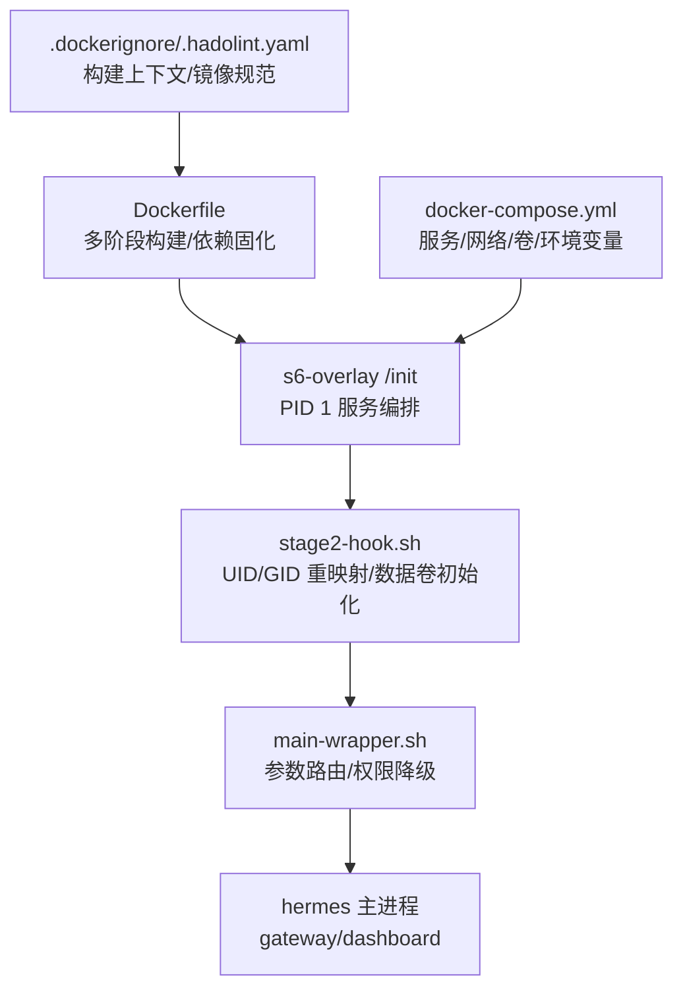
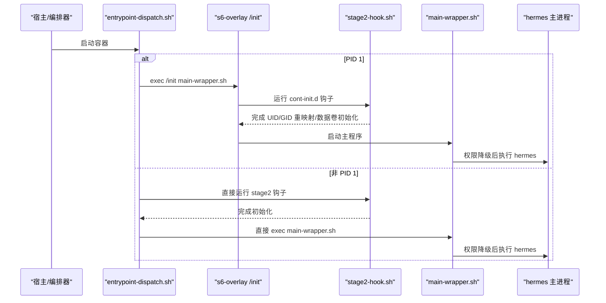
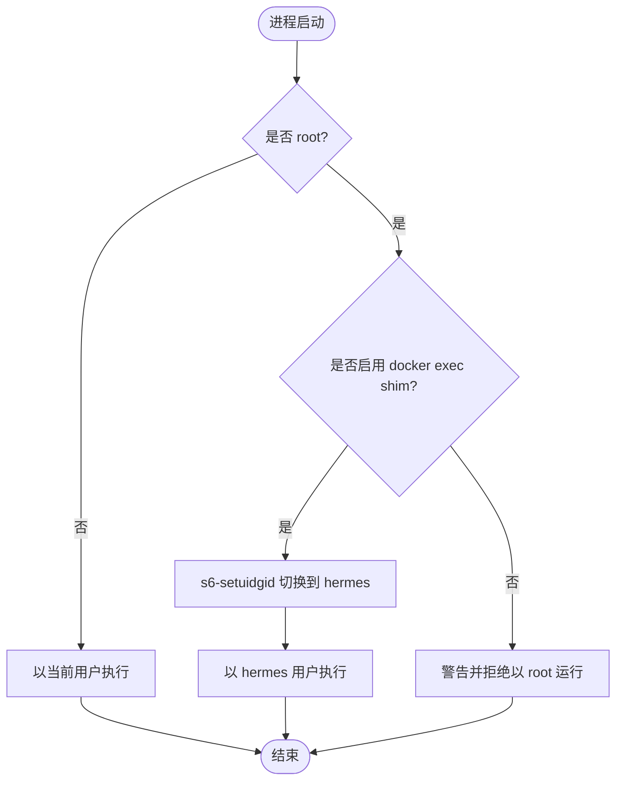
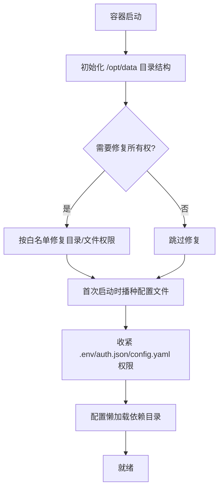
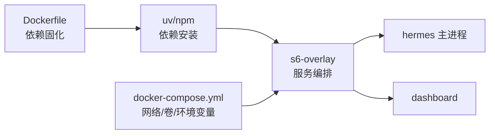

# 容器隔离

<cite>
**本文引用的文件**
- [Dockerfile](file://Dockerfile)
- [docker-compose.yml](file://docker-compose.yml)
- [.dockerignore](file://.dockerignore)
- [.hadolint.yaml](file://.hadolint.yaml)
- [entrypoint-dispatch.sh](file://docker/entrypoint-dispatch.sh)
- [stage2-hook.sh](file://docker/stage2-hook.sh)
- [main-wrapper.sh](file://docker/main-wrapper.sh)
- [hermes-exec-shim.sh](file://docker/hermes-exec-shim.sh)
- [SECURITY.md](file://SECURITY.md)
</cite>

## 目录
1. [简介](#简介)
2. [项目结构](#项目结构)
3. [核心组件](#核心组件)
4. [架构总览](#架构总览)
5. [详细组件分析](#详细组件分析)
6. [依赖关系分析](#依赖关系分析)
7. [性能与资源限制](#性能与资源限制)
8. [故障排查指南](#故障排查指南)
9. [结论](#结论)
10. [附录：生产基线与最佳实践](#附录生产基线与最佳实践)

## 简介
本文件面向生产环境，系统化说明 Hermes Agent 在容器中的隔离与安全能力，覆盖进程隔离、文件系统沙箱、权限降级、网络隔离、环境变量隔离、内存与资源限制、镜像安全扫描与漏洞检测、启动安全、逃逸防护与监控，以及可复用的部署模板与调优建议。文档以仓库中实际的 Docker 构建与运行时脚本为依据，确保可操作性与可审计性。

## 项目结构
Hermes Agent 的容器化由多阶段镜像构建与 s6-overlay 服务编排组成，关键目录与职责如下：
- 镜像构建与依赖固化：Dockerfile 定义基础镜像、系统依赖、Python/Node 依赖、前端构建产物、s6-overlay 安装、只读代码层与数据卷挂载点。
- 启动流程：entrypoint-dispatch.sh 负责 PID 1 判定与 s6 或直启路径选择；stage2-hook.sh 完成 UID/GID 重映射、数据卷初始化与权限修复；main-wrapper.sh 负责参数路由与权限降级；hermes-exec-shim.sh 提供 docker exec 时的权限降级。
- 服务编排：docker-compose.yml 提供 gateway 与 dashboard 双服务示例，默认使用 host 网络并绑定本地配置目录为数据卷。
- 安全策略：SECURITY.md 明确信任边界与隔离姿态；.hadolint.yaml 约束镜像构建规则；.dockerignore 控制构建上下文，减少攻击面。

图表来源
- [Dockerfile:52-457](file://Dockerfile#L52-L457)
- [entrypoint-dispatch.sh:1-26](file://docker/entrypoint-dispatch.sh#L1-L26)
- [stage2-hook.sh:1-592](file://docker/stage2-hook.sh#L1-L592)
- [main-wrapper.sh:1-92](file://docker/main-wrapper.sh#L1-L92)
- [docker-compose.yml:29-77](file://docker-compose.yml#L29-L77)

章节来源
- [Dockerfile:52-457](file://Dockerfile#L52-L457)
- [docker-compose.yml:29-77](file://docker-compose.yml#L29-L77)
- [.dockerignore:1-106](file://.dockerignore#L1-L106)
- [.hadolint.yaml:1-37](file://.hadolint.yaml#L1-L37)

## 核心组件
- 镜像构建与依赖固化
  - 固定基础镜像与工具链版本，使用 SHA 校验第三方包，避免供应链风险。
  - 将 Python/Node 依赖与前端构建产物预编译入镜像，减少运行时下载与执行不可信代码的机会。
  - 通过 .dockerignore 排除测试、文档与开发工件，缩小镜像体积与攻击面。
- 启动与生命周期管理
  - entrypoint-dispatch.sh 判断是否拥有 PID 1，决定走 s6-overlay 完整监督树或直接回退路径。
  - stage2-hook.sh 在用户服务启动前完成 UID/GID 重映射、数据卷所有权修复、敏感文件权限收紧、配置迁移与技能同步等。
  - main-wrapper.sh 对 CMD 进行路由（直接执行、hermes 子命令），并以 s6-setuidgid 降权到 hermes 用户。
  - hermes-exec-shim.sh 拦截 root 下的 docker exec，自动降权到 hermes，防止 root 写入导致后续网关无法读取。
- 服务编排与网络
  - docker-compose.yml 提供 gateway 与 dashboard 两个服务，默认 host 网络，便于本地调试；dashboard 仅监听 127.0.0.1。
- 安全策略与合规
  - SECURITY.md 明确“操作系统级隔离是唯一可信边界”，推荐终端后端隔离或全进程包裹两种姿态。
  - .hadolint.yaml 强制基础镜像 SHA 锁定，并对若干规则给出工程权衡说明。

章节来源
- [Dockerfile:52-457](file://Dockerfile#L52-L457)
- [entrypoint-dispatch.sh:1-26](file://docker/entrypoint-dispatch.sh#L1-L26)
- [stage2-hook.sh:1-592](file://docker/stage2-hook.sh#L1-L592)
- [main-wrapper.sh:1-92](file://docker/main-wrapper.sh#L1-L92)
- [hermes-exec-shim.sh:1-88](file://docker/hermes-exec-shim.sh#L1-L88)
- [docker-compose.yml:29-77](file://docker-compose.yml#L29-L77)
- [SECURITY.md:58-119](file://SECURITY.md#L58-L119)
- [.hadolint.yaml:1-37](file://.hadolint.yaml#L1-L37)

## 架构总览
下图展示了从容器入口到业务进程的完整调用链，包括 PID 1 判定、s6 监督树、权限降级与数据卷初始化。

图表来源
- [entrypoint-dispatch.sh:15-26](file://docker/entrypoint-dispatch.sh#L15-L26)
- [stage2-hook.sh:1-592](file://docker/stage2-hook.sh#L1-L592)
- [main-wrapper.sh:20-92](file://docker/main-wrapper.sh#L20-L92)

章节来源
- [entrypoint-dispatch.sh:1-26](file://docker/entrypoint-dispatch.sh#L1-L26)
- [stage2-hook.sh:1-592](file://docker/stage2-hook.sh#L1-L592)
- [main-wrapper.sh:1-92](file://docker/main-wrapper.sh#L1-L92)

## 详细组件分析

### 进程隔离与权限降级
- 最小特权原则
  - 镜像内创建专用 hermes 用户（非 root），所有受管服务通过 s6-setuidgid 降权运行。
  - 代码层与依赖层为 root 拥有且只读，运行时写操作限定于 /opt/data（HERMES_HOME）。
- docker exec 保护
  - hermes-exec-shim.sh 拦截 root 下的 docker exec，自动切换到 hermes 用户，避免 root 写入破坏后续权限。
  - 支持显式退出标志用于诊断场景，但默认拒绝 root 执行。
- 启动时强制拒绝不当 --user
  - stage2-hook.sh 与 main-wrapper.sh 均检查并拒绝任意非 hermes 的 --user 启动，引导使用 HERMES_UID/HERMES_GID 或 PUID/PGID 别名实现主机 UID 对齐。

图表来源
- [hermes-exec-shim.sh:41-88](file://docker/hermes-exec-shim.sh#L41-L88)
- [main-wrapper.sh:31-59](file://docker/main-wrapper.sh#L31-L59)
- [stage2-hook.sh:23-74](file://docker/stage2-hook.sh#L23-L74)

章节来源
- [hermes-exec-shim.sh:1-88](file://docker/hermes-exec-shim.sh#L1-L88)
- [main-wrapper.sh:1-92](file://docker/main-wrapper.sh#L1-L92)
- [stage2-hook.sh:23-74](file://docker/stage2-hook.sh#L23-L74)

### 文件系统沙箱与访问控制
- 只读代码层与数据卷分离
  - /opt/hermes 为只读代码与依赖层，/opt/data 为持久化数据卷，二者严格分离，防止会话自修改破坏镜像。
- 数据卷初始化与权限修复
  - stage2-hook.sh 在首次启动时创建必要目录，按白名单递归修复 hermes 拥有的子目录与顶层状态文件，避免 root 写入导致的权限问题。
  - 对 .env、config.yaml、auth.json 等敏感文件设置严格权限（如 600/640）。
- 软链接防护
  - 针对 chown/chmod/seed 等操作，若目标路径包含符号链接则拒绝执行，降低 TOCTOU 风险。
- 可选后端依赖隔离
  - 懒加载依赖被重定向至 /opt/data/lazy-packages，追加到 sys.path 末尾，保证不会覆盖核心模块，维持“密封 venv”的安全语义。

图表来源
- [stage2-hook.sh:76-592](file://docker/stage2-hook.sh#L76-L592)
- [Dockerfile:378-393](file://Dockerfile#L378-L393)

章节来源
- [stage2-hook.sh:76-592](file://docker/stage2-hook.sh#L76-L592)
- [Dockerfile:378-393](file://Dockerfile#L378-L393)

### 环境变量隔离与凭据管理
- 环境变量最小化
  - 通过 s6-overlay 的 with-contenv 机制，仅在必要时注入运行所需的环境变量，避免泄露宿主机环境。
- 凭据文件保护
  - .env 与 auth.json 在启动时被严格限制权限；支持首次启动从环境变量播种，并在重启时不覆盖已有凭据。
- 凭据作用域
  - 安全策略强调凭据在进程间传递时需过滤，仅允许显式声明的变量透传，降低无意泄露风险。

章节来源
- [stage2-hook.sh:418-494](file://docker/stage2-hook.sh#L418-L494)
- [SECURITY.md:121-135](file://SECURITY.md#L121-L135)

### 网络隔离与暴露面控制
- 默认网络模式
  - docker-compose.yml 默认使用 host 网络，便于本地调试；dashboard 仅监听 127.0.0.1，避免意外外网暴露。
- 外部表面治理
  - SECURITY.md 要求对所有网络暴露面启用访问控制（如 allowlist），禁止无鉴权的公网暴露。
- 反向代理与隧道
  - 建议使用 SSH 隧道或反向代理为 dashboard/API 增加认证，避免直接暴露。

章节来源
- [docker-compose.yml:29-77](file://docker-compose.yml#L29-L77)
- [SECURITY.md:171-223](file://SECURITY.md#L171-L223)

### 容器启动安全与镜像扫描
- 启动安全
  - 入口脚本区分 PID 1 与非 PID 1 路径，确保 s6 监督树可用；拒绝不支持的 --user 启动方式，提供清晰错误提示。
- 镜像安全
  - 基础镜像与第三方包使用 SHA 锁定；.hadolint.yaml 强制镜像构建规范；.dockerignore 排除不必要文件，减小攻击面。
- 漏洞检测建议
  - 建议在 CI 中加入镜像扫描（如 Trivy、Grype）与依赖审计（npm audit、pip audit），阻断含高危漏洞的镜像进入流水线。

章节来源
- [entrypoint-dispatch.sh:1-26](file://docker/entrypoint-dispatch.sh#L1-L26)
- [Dockerfile:52-457](file://Dockerfile#L52-L457)
- [.hadolint.yaml:1-37](file://.hadolint.yaml#L1-L37)
- [.dockerignore:1-106](file://.dockerignore#L1-L106)

### 容器逃逸防护与监控
- 逃逸防护要点
  - 保持代码层只读、数据卷最小化挂载；避免将宿主机敏感目录（如 /var/run/docker.sock）暴露给容器；如需 Docker-in-Docker，需按 stage2-hook.sh 逻辑处理组权限并限制 socket 访问范围。
  - 遵循 SECURITY.md 的隔离姿态：对不受信输入采用终端后端隔离或全进程包裹。
- 监控与告警
  - 建议采集容器启动失败、权限错误、文件权限变更、异常进程数与资源使用峰值等指标；结合日志聚合平台建立告警规则。
  - 对 gateway/dashboard 健康检查与存活探针进行持续观测，发现异常快速自愈。

章节来源
- [stage2-hook.sh:118-172](file://docker/stage2-hook.sh#L118-L172)
- [SECURITY.md:58-119](file://SECURITY.md#L58-L119)

## 依赖关系分析
- 构建期依赖
  - Python 依赖通过 uv sync 冻结安装；Node 依赖通过 npm install 并缓存；Playwright 浏览器二进制预装到只读路径。
- 运行期依赖
  - s6-overlay 作为 PID 1 与服务管理器；hermes 主进程通过 main-wrapper.sh 启动；dashboard 作为独立服务运行。
- 外部集成
  - 可通过环境变量与挂载文件接入外部凭据与配置；网络暴露面需配合反向代理或防火墙策略。

图表来源
- [Dockerfile:171-267](file://Dockerfile#L171-L267)
- [docker-compose.yml:29-77](file://docker-compose.yml#L29-L77)

章节来源
- [Dockerfile:171-267](file://Dockerfile#L171-L267)
- [docker-compose.yml:29-77](file://docker-compose.yml#L29-L77)

## 性能与资源限制
- 构建性能优化
  - 分层缓存：先复制清单再安装依赖；前端构建与 Python 依赖解耦；清理缓存与临时文件。
  - 使用 --link 与 chmod 减少额外权限遍历开销。
- 运行时性能
  - 禁用 Python 字节码写入与标准输出缓冲，提升日志实时性与 I/O 效率。
  - 预构建 TUI 前端，避免运行时 npm install 竞争与失败。
- 资源限制建议
  - 在编排层设置 CPU/内存上限与 OOM 策略；对 gateway 与 dashboard 分别限制资源，避免相互影响。
  - 对长时间运行的任务（如浏览器自动化）设置超时与重试策略，防止资源泄漏。

章节来源
- [Dockerfile:54-91](file://Dockerfile#L54-L91)
- [Dockerfile:171-276](file://Dockerfile#L171-L276)
- [Dockerfile:359-393](file://Dockerfile#L359-L393)

## 故障排查指南
- 常见启动错误
  - 使用了不支持的 --user：参考 stage2-hook.sh 与 main-wrapper.sh 的错误提示，改用 HERMES_UID/HERMES_GID 或 PUID/PGID。
  - 数据卷权限错误：检查 /opt/data 下 hermes 拥有的子目录与文件权限，确认 stage2-hook.sh 已正确执行。
  - docker exec 权限问题：确认 hermes-exec-shim.sh 生效，避免 root 写入导致后续网关无法读取。
- 日志与诊断
  - 查看 s6 监督日志与 gateway/dashboard 日志；启用容器健康检查与存活探针。
  - 对异常进程与资源使用进行监控，结合告警快速定位问题。

章节来源
- [stage2-hook.sh:23-74](file://docker/stage2-hook.sh#L23-L74)
- [main-wrapper.sh:31-59](file://docker/main-wrapper.sh#L31-L59)
- [hermes-exec-shim.sh:41-88](file://docker/hermes-exec-shim.sh#L41-L88)

## 结论
Hermes Agent 的容器化方案以“操作系统级隔离”为核心，通过只读代码层、数据卷分离、严格的权限降级与最小化暴露面，构建了可审计、可运维的生产级容器基线。配合镜像安全扫描、依赖冻结与监控告警，可在复杂环境中稳定运行并有效抵御常见攻击面。

## 附录：生产基线与最佳实践
- 镜像构建
  - 固定基础镜像与依赖版本；使用 SHA 校验；启用 hadolint 与依赖审计；最小化构建上下文。
- 启动与权限
  - 默认以 root 启动并由 s6 监督，随后降权到 hermes；通过 HERMES_UID/HERMES_GID 或 PUID/PGID 对齐主机 UID/GID；拒绝不当 --user。
- 数据与配置
  - 将 /opt/data 作为唯一持久化卷；敏感文件权限收紧；首次启动自动播种必要配置。
- 网络与暴露面
  - 默认仅本地监听；对外暴露需经反向代理或隧道并启用认证；为每个网络适配器配置 allowlist。
- 安全与合规
  - 遵循 SECURITY.md 的隔离姿态；对不受信输入采用终端后端隔离或全进程包裹；审查第三方技能与插件。
- 监控与运维
  - 采集启动失败、权限错误、资源使用与进程异常指标；设置健康检查与告警；定期更新基础镜像与依赖。

章节来源
- [SECURITY.md:301-325](file://SECURITY.md#L301-L325)
- [docker-compose.yml:29-77](file://docker-compose.yml#L29-L77)
- [Dockerfile:52-457](file://Dockerfile#L52-L457)
- [stage2-hook.sh:76-592](file://docker/stage2-hook.sh#L76-L592)