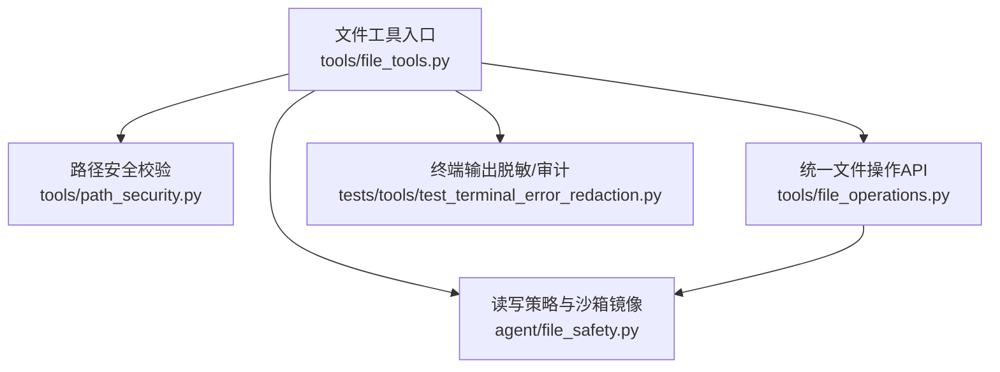
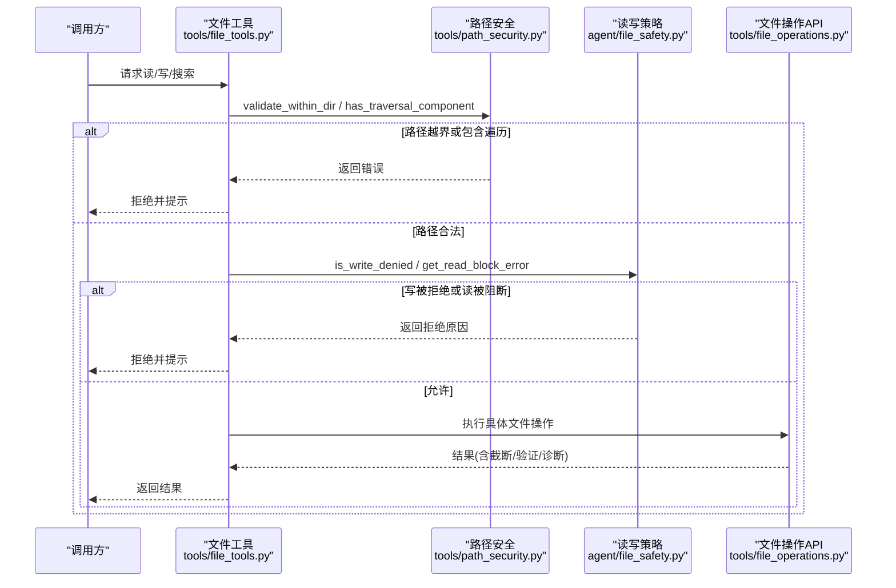
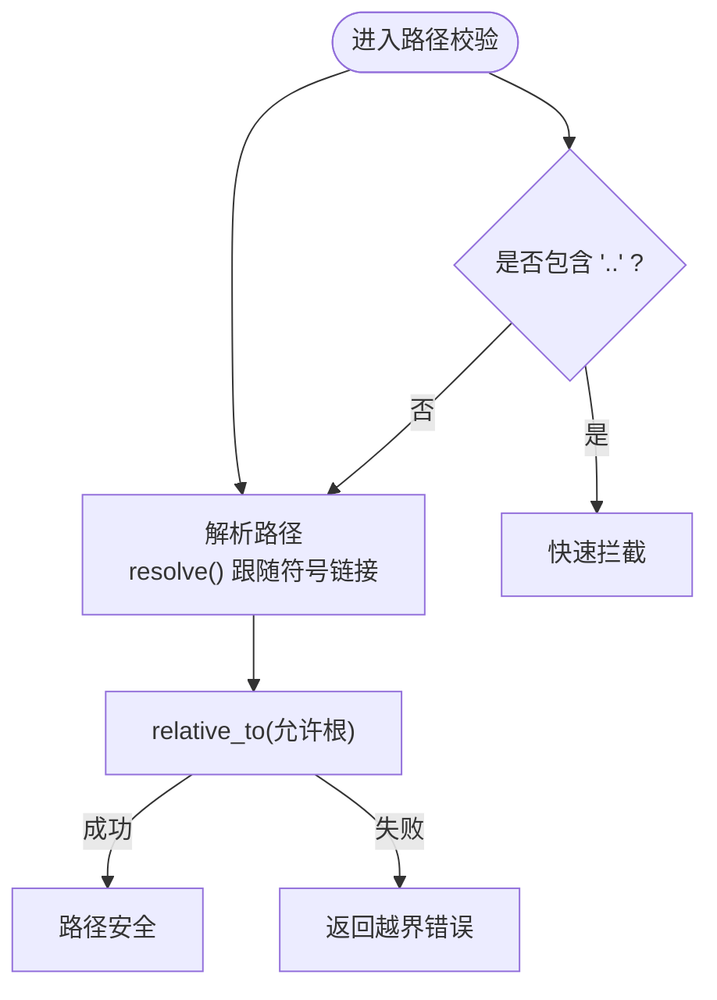
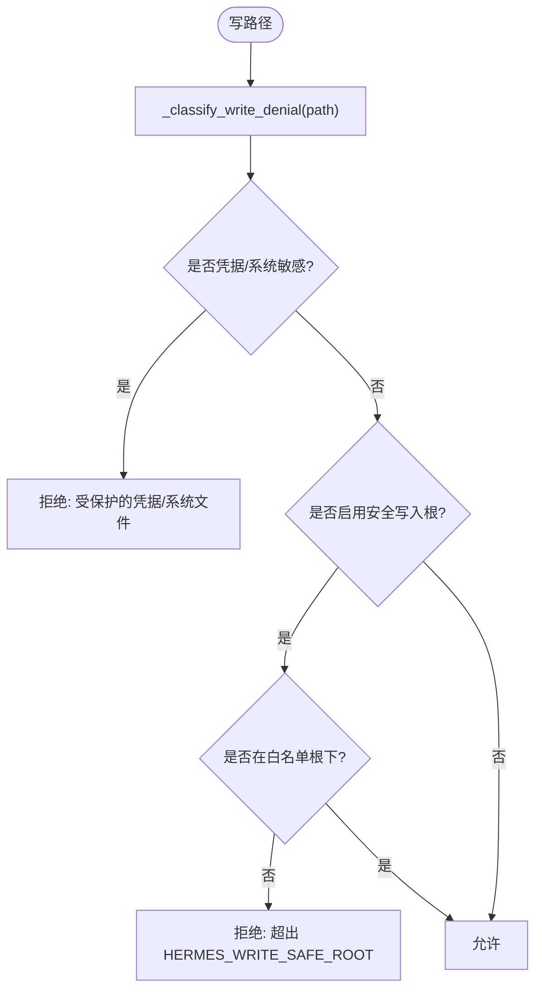
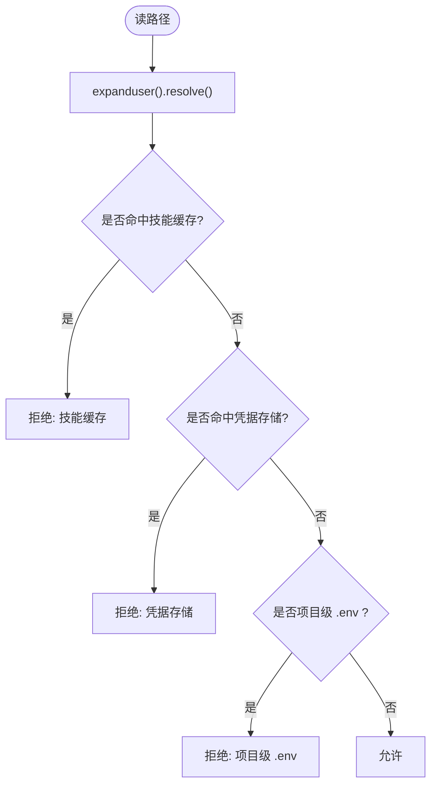
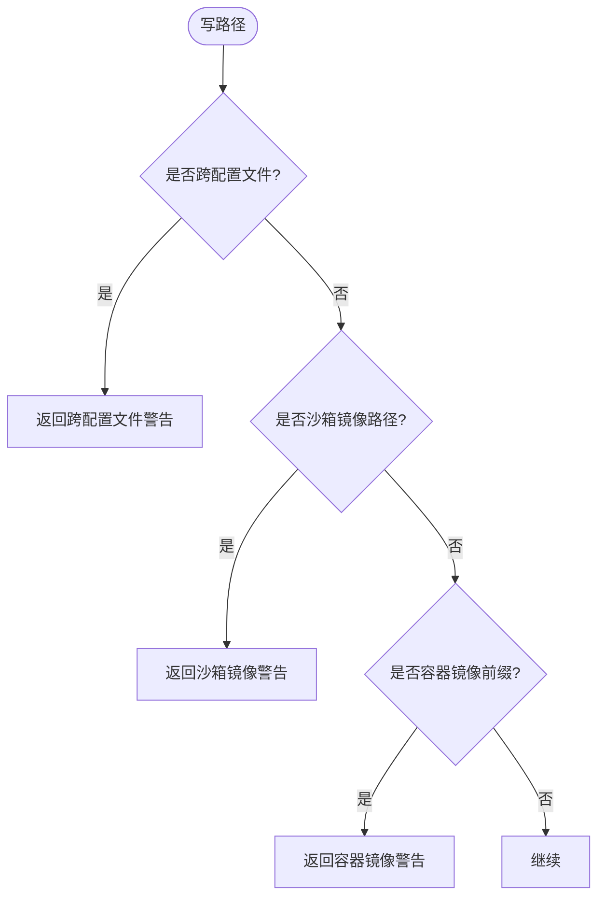
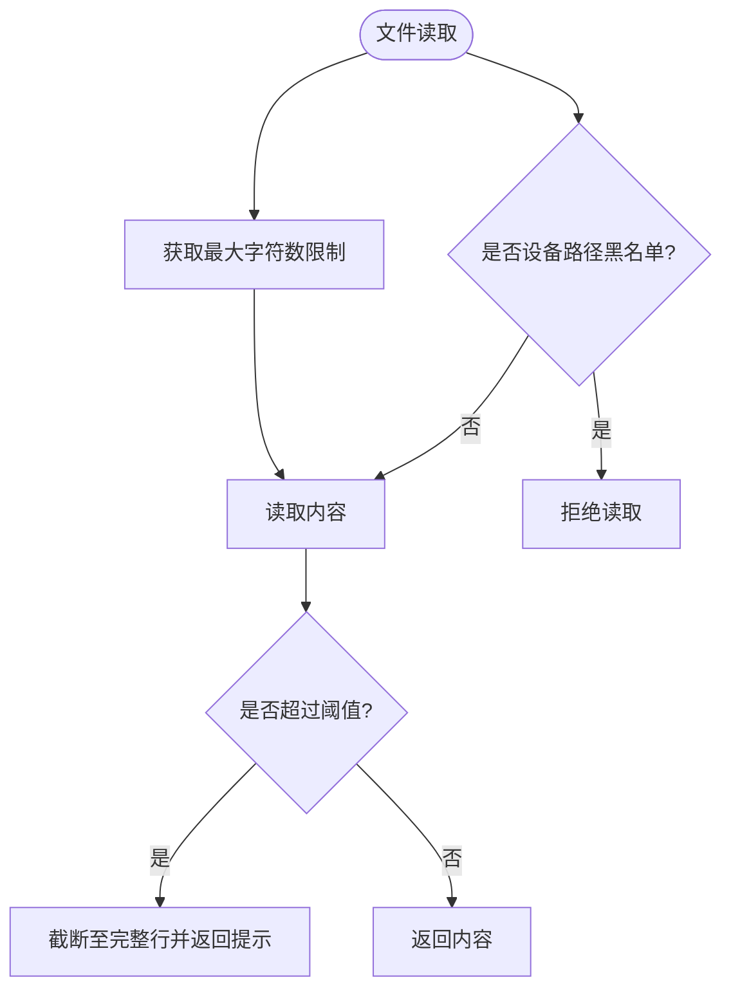
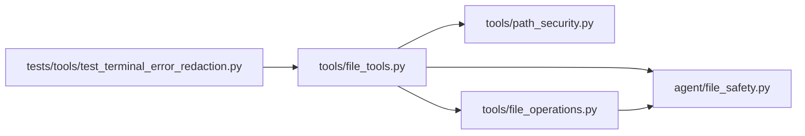

# 文件系统沙箱

<cite>
**本文引用的文件**
- [agent/file_safety.py](file://agent/file_safety.py)
- [tools/path_security.py](file://tools/path_security.py)
- [tools/file_tools.py](file://tools/file_tools.py)
- [tools/file_operations.py](file://tools/file_operations.py)
- [tests/tools/test_terminal_error_redaction.py](file://tests/tools/test_terminal_error_redaction.py)
</cite>

## 目录
1. [简介](#简介)
2. [项目结构](#项目结构)
3. [核心组件](#核心组件)
4. [架构总览](#架构总览)
5. [详细组件分析](#详细组件分析)
6. [依赖关系分析](#依赖关系分析)
7. [性能考虑](#性能考虑)
8. [故障排查指南](#故障排查指南)
9. [结论](#结论)
10. [附录](#附录)

## 简介
本文件面向“文件系统沙箱”的安全能力，系统性说明路径安全校验、读写权限控制、目录遍历限制、符号链接处理、敏感文件保护、临时文件与磁盘空间限制策略、沙箱环境映射与挂载点行为、以及审计日志与异常检测。文档同时提供可复用的安全配置模板与自定义规则建议，并给出开发调试最佳实践。

## 项目结构
围绕文件系统沙箱的关键代码分布在以下模块：
- agent/file_safety.py：集中实现读/写拒绝策略、跨配置文件写入软防护、沙箱镜像路径识别等。
- tools/path_security.py：通用路径校验工具（目录边界、遍历组件检查）。
- tools/file_tools.py：文件操作工具入口，集成读取大小限制、设备路径黑名单、终端工作目录解析等。
- tools/file_operations.py：统一封装跨后端（本地/Docker/SSH/容器）的文件读写、搜索等操作，复用写拒绝策略。
- tests/tools/test_terminal_error_redaction.py：验证终端输出中的敏感信息脱敏，体现审计与泄露防护。

**图表来源**
- [tools/file_tools.py:1-200](file://tools/file_tools.py#L1-L200)
- [tools/path_security.py:1-44](file://tools/path_security.py#L1-L44)
- [agent/file_safety.py:1-694](file://agent/file_safety.py#L1-L694)
- [tools/file_operations.py:1-200](file://tools/file_operations.py#L1-L200)
- [tests/tools/test_terminal_error_redaction.py:1-154](file://tests/tools/test_terminal_error_redaction.py#L1-L154)

**章节来源**
- [tools/file_tools.py:1-200](file://tools/file_tools.py#L1-L200)
- [tools/path_security.py:1-44](file://tools/path_security.py#L1-L44)
- [agent/file_safety.py:1-694](file://agent/file_safety.py#L1-L694)
- [tools/file_operations.py:1-200](file://tools/file_operations.py#L1-L200)
- [tests/tools/test_terminal_error_redaction.py:1-154](file://tests/tools/test_terminal_error_redaction.py#L1-L154)

## 核心组件
- 路径安全校验
  - 目录边界校验：确保目标路径在允许根目录下，自动跟随符号链接并规范化“..”组件。
  - 遍历组件检测：快速判断是否存在“..”以拦截明显越界尝试。
- 读写访问控制
  - 写拒绝清单：精确匹配与目录前缀匹配，覆盖系统关键文件、凭据存储、Hermes内部状态等。
  - 读拒绝清单：屏蔽技能缓存、凭据文件、项目级 .env 等敏感内容。
  - 安全写入根：通过环境变量限定可写范围，未在白名单内的写操作将被拒绝。
- 沙箱镜像与跨配置文件写入
  - 识别沙箱镜像路径形状，避免对副本进行误写。
  - 跨配置文件写入软防护：提示并阻止非预期跨配置文件修改。
- 文件操作工具
  - 读取大小限制：防止大文件一次性返回导致上下文溢出。
  - 设备路径黑名单：避免阻塞或无限输出。
  - 统一后端抽象：将文件操作表达为 shell 命令，适配多种执行环境。

**章节来源**
- [tools/path_security.py:15-44](file://tools/path_security.py#L15-L44)
- [agent/file_safety.py:28-178](file://agent/file_safety.py#L28-L178)
- [agent/file_safety.py:194-337](file://agent/file_safety.py#L194-L337)
- [agent/file_safety.py:386-506](file://agent/file_safety.py#L386-L506)
- [agent/file_safety.py:533-616](file://agent/file_safety.py#L533-L616)
- [tools/file_tools.py:52-149](file://tools/file_tools.py#L52-L149)
- [tools/file_operations.py:47-55](file://tools/file_operations.py#L47-L55)

## 架构总览
下图展示从文件工具到安全策略的调用链，以及沙箱镜像与跨配置文件场景的处理分支。

**图表来源**
- [tools/file_tools.py:152-200](file://tools/file_tools.py#L152-L200)
- [tools/path_security.py:15-44](file://tools/path_security.py#L15-L44)
- [agent/file_safety.py:101-178](file://agent/file_safety.py#L101-L178)
- [tools/file_operations.py:149-151](file://tools/file_operations.py#L149-L151)

## 详细组件分析

### 路径安全校验（目录边界与遍历）
- validate_within_dir：使用 Path.resolve() 跟随符号链接并规范化路径，再通过 relative_to 判定是否在允许根内。失败时返回明确错误消息。
- has_traversal_component：快速扫描路径片段是否包含“..”，用于前置拦截。

**图表来源**
- [tools/path_security.py:15-44](file://tools/path_security.py#L15-L44)

**章节来源**
- [tools/path_security.py:15-44](file://tools/path_security.py#L15-L44)

### 写拒绝策略（敏感文件与凭据保护）
- 构建写拒绝集合与前缀列表：覆盖 SSH 私钥、认证文件、系统关键路径、Hermes 内部状态等。
- 分类器 _classify_write_denial：按“凭据类”、“安全根外”等类别返回拒绝原因；若启用安全写入根且不在白名单则拒绝。
- 对外接口：is_write_denied、get_write_denied_error 供上层统一拒绝与提示。

**图表来源**
- [agent/file_safety.py:28-178](file://agent/file_safety.py#L28-L178)

**章节来源**
- [agent/file_safety.py:28-178](file://agent/file_safety.py#L28-L178)
- [tools/file_operations.py:47-55](file://tools/file_operations.py#L47-L55)

### 读拒绝策略（敏感文件与注入载体）
- 读拒绝覆盖三类：技能缓存（防提示注入）、Hermes 凭据存储、项目级 .env 等常见密钥文件。
- 统一入口 raise_if_read_blocked：在提供者加载本地输入时强制应用同一套读边界。

**图表来源**
- [agent/file_safety.py:194-337](file://agent/file_safety.py#L194-L337)

**章节来源**
- [agent/file_safety.py:194-337](file://agent/file_safety.py#L194-L337)

### 跨配置文件写入与沙箱镜像写入（软防护）
- 跨配置文件写入：识别当前活跃 profile 与目标 profile，若写入 skills/plugins/cron/memories 等受控区域，返回警告并要求显式确认。
- 沙箱镜像写入：识别形如 sandboxes/<backend>/<task>/home/.hermes/... 的路径，提示该写落在副本而非权威状态，避免静默成功与数据分歧。
- 容器镜像写入：当文件工具在容器内执行时，根据传入的镜像前缀识别真实权威路径。

**图表来源**
- [agent/file_safety.py:386-506](file://agent/file_safety.py#L386-L506)
- [agent/file_safety.py:533-616](file://agent/file_safety.py#L533-L616)
- [agent/file_safety.py:635-693](file://agent/file_safety.py#L635-L693)

**章节来源**
- [agent/file_safety.py:386-506](file://agent/file_safety.py#L386-L506)
- [agent/file_safety.py:533-616](file://agent/file_safety.py#L533-L616)
- [agent/file_safety.py:635-693](file://agent/file_safety.py#L635-L693)

### 文件操作工具（读取限制、设备黑名单、工作目录解析）
- 读取大小限制：默认字符上限，支持配置化；超大文件会截断并提示使用分页。
- 设备路径黑名单：阻止读取可能阻塞或产生无限输出的设备节点。
- 工作目录解析：基于 TERMINAL_CWD 解析相对路径，避免进程 cwd 与工作区不一致导致的误写。

**图表来源**
- [tools/file_tools.py:52-149](file://tools/file_tools.py#L52-L149)

**章节来源**
- [tools/file_tools.py:52-149](file://tools/file_tools.py#L52-L149)

## 依赖关系分析
- file_tools 依赖 path_security 做路径边界校验，依赖 file_safety 做读写策略判定，并通过 file_operations 统一执行底层操作。
- file_operations 复用 file_safety 的写拒绝策略，保证跨后端一致性。
- 测试用例验证终端输出中的敏感信息会被脱敏，体现审计与泄露防护闭环。

**图表来源**
- [tools/file_tools.py:1-200](file://tools/file_tools.py#L1-L200)
- [tools/path_security.py:1-44](file://tools/path_security.py#L1-L44)
- [agent/file_safety.py:1-694](file://agent/file_safety.py#L1-L694)
- [tools/file_operations.py:1-200](file://tools/file_operations.py#L1-L200)
- [tests/tools/test_terminal_error_redaction.py:1-154](file://tests/tools/test_terminal_error_redaction.py#L1-L154)

**章节来源**
- [tools/file_tools.py:1-200](file://tools/file_tools.py#L1-L200)
- [tools/path_security.py:1-44](file://tools/path_security.py#L1-L44)
- [agent/file_safety.py:1-694](file://agent/file_safety.py#L1-L694)
- [tools/file_operations.py:1-200](file://tools/file_operations.py#L1-L200)
- [tests/tools/test_terminal_error_redaction.py:1-154](file://tests/tools/test_terminal_error_redaction.py#L1-L154)

## 性能考虑
- 读取大小限制避免单次返回过大内容，降低模型上下文压力与网络开销。
- 路径校验优先使用 resolve() 与 relative_to()，时间复杂度与路径长度线性相关，开销低。
- 设备路径黑名单为静态集合，O(1) 查找，避免 I/O 阻塞。
- 写拒绝策略采用集合与前缀匹配，整体高效；可通过合理设置安全写入根减少误判。

[本节为通用指导，不直接分析具体文件]

## 故障排查指南
- 读/写被拒绝
  - 检查路径是否命中凭据/系统敏感文件或技能缓存。
  - 若启用了安全写入根，确认目标路径是否在白名单根或其子目录下。
- 跨配置文件/沙箱镜像警告
  - 确认是否误写到了副本或非当前 profile 的受控区域。
  - 在用户明确授权后，可使用显式参数绕过软防护（遵循最小权限原则）。
- 终端输出泄露
  - 参考测试用例，确保错误信息与回显经过脱敏处理，避免密钥泄露。

**章节来源**
- [agent/file_safety.py:101-178](file://agent/file_safety.py#L101-L178)
- [agent/file_safety.py:194-337](file://agent/file_safety.py#L194-L337)
- [agent/file_safety.py:386-506](file://agent/file_safety.py#L386-L506)
- [agent/file_safety.py:533-616](file://agent/file_safety.py#L533-L616)
- [tests/tools/test_terminal_error_redaction.py:1-154](file://tests/tools/test_terminal_error_redaction.py#L1-L154)

## 结论
本沙箱通过“路径边界 + 读写拒绝 + 沙箱镜像识别 + 读取限制 + 输出脱敏”的多层防御，构建了稳健的文件系统访问控制体系。建议在部署中结合安全写入根与环境隔离，配合审计日志与异常检测，持续优化策略与规则。

[本节为总结性内容，不直接分析具体文件]

## 附录

### 安全配置模板（示例）
- 环境变量
  - HERMES_WRITE_SAFE_ROOT：设置允许写入的根目录（多目录用平台分隔符连接）。
  - file_read_max_chars：限制单次读取的最大字符数（默认值由工具内置）。
- 策略要点
  - 仅开放必要目录为可写根。
  - 保持读拒绝清单与写拒绝清单同步更新，覆盖新增敏感路径。
  - 在容器/沙箱环境中，正确传递镜像前缀以便识别权威路径。

[本节为通用指导，不直接分析具体文件]

### 自定义沙箱规则建议
- 新增敏感路径：在写拒绝集合与前缀列表中补充，并在读拒绝清单中增加对应条目。
- 扩展安全写入根：在环境变量中追加新目录，并确保目录权限最小化。
- 强化路径校验：在工具入口处统一调用 validate_within_dir 与 has_traversal_component。

[本节为通用指导，不直接分析具体文件]

### 开发最佳实践与调试方法
- 始终使用绝对路径或基于 TERMINAL_CWD 的相对路径，避免进程 cwd 差异导致误写。
- 在单元测试中模拟终端环境与 active environments，验证读写拒绝与脱敏逻辑。
- 利用日志与审计输出定位拒绝原因（凭据/安全根/镜像路径），并结合测试用例复现问题。

**章节来源**
- [tools/file_tools.py:152-200](file://tools/file_tools.py#L152-L200)
- [tests/tools/test_terminal_error_redaction.py:1-154](file://tests/tools/test_terminal_error_redaction.py#L1-L154)