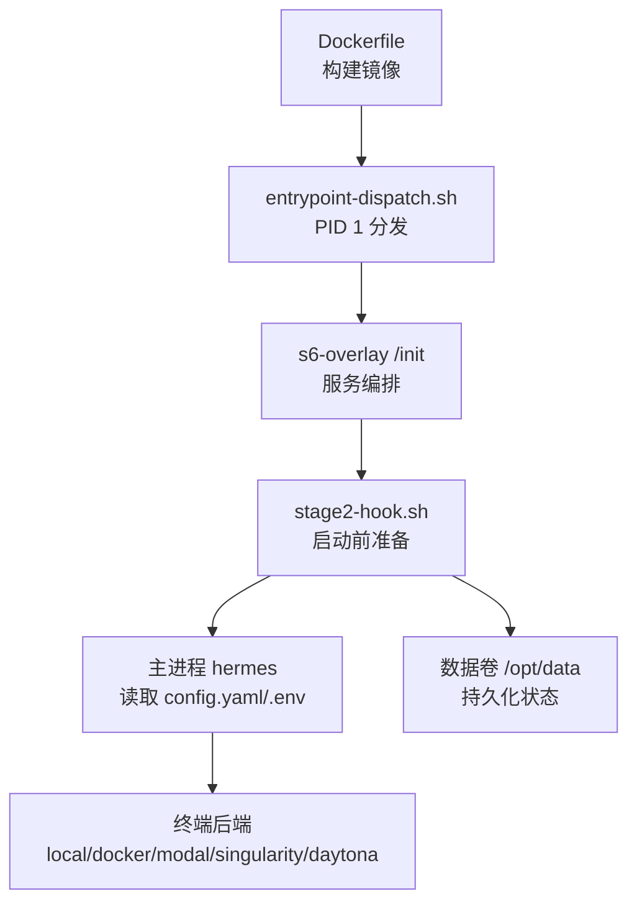
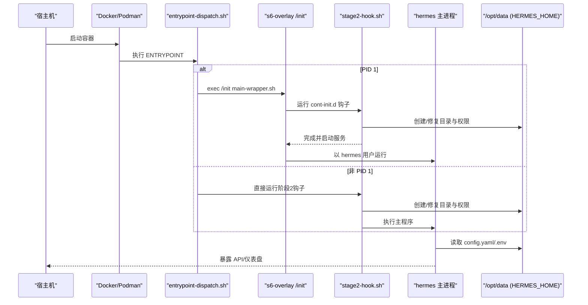
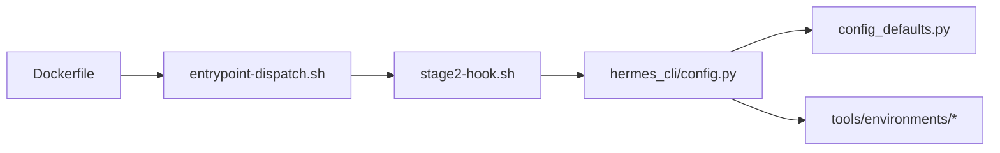

# 环境配置

<cite>
**本文引用的文件**
- [Dockerfile](file://Dockerfile)
- [docker-compose.yml](file://docker-compose.yml)
- [docker/entrypoint-dispatch.sh](file://docker/entrypoint-dispatch.sh)
- [docker/stage2-hook.sh](file://docker/stage2-hook.sh)
- [hermes_cli/config.py](file://hermes_cli/config.py)
- [hermes_cli/config_defaults.py](file://hermes_cli/config_defaults.py)
- [cli-config.yaml.example](file://cli-config.yaml.example)
- [.envrc](file://.envrc)
- [tools/environments/docker.py](file://tools/environments/docker.py)
- [tools/environments/modal.py](file://tools/environments/modal.py)
- [tools/environments/local.py](file://tools/environments/local.py)
</cite>

## 目录
1. [简介](#简介)
2. [项目结构](#项目结构)
3. [核心组件](#核心组件)
4. [架构总览](#架构总览)
5. [详细组件分析](#详细组件分析)
6. [依赖关系分析](#依赖关系分析)
7. [性能考量](#性能考量)
8. [故障排查指南](#故障排查指南)
9. [结论](#结论)
10. [附录](#附录)

## 简介
本文件面向开发与生产环境的 Hermes Agent 环境配置，覆盖 Docker 容器、Modal 云函数与本地执行环境的参数、环境变量注入、配置文件挂载、密钥管理策略、多环境部署、配置热更新、环境变量优先级、健康检查、配置验证与故障恢复机制，并提供模板与自动化脚本建议。目标是帮助你在不同环境中以一致、安全、可维护的方式运行 Hermes Agent。

## 项目结构
Hermes 的环境配置由“镜像构建期 + 启动引导期 + 运行时配置”三层组成：
- 镜像构建期（Dockerfile）：安装系统依赖、Python/Node 工具链、预构建前端、固定 SQLite 版本、s6-overlay 服务化、写入只读代码树与默认环境变量。
- 启动引导期（entrypoint-dispatch.sh、stage2-hook.sh）：PID 1 分发、UID/GID 重映射、数据卷权限修复、初始配置种子、技能同步、浏览器二进制发现、网关状态初始化等。
- 运行时配置（config.yaml/.env、终端后端配置、平台集成变量）：通过 CLI 配置模块加载、合并默认值与环境变量、提供安全写回与迁移。

图表来源
- [Dockerfile:52-458](file://Dockerfile#L52-L458)
- [docker/entrypoint-dispatch.sh:1-26](file://docker/entrypoint-dispatch.sh#L1-L26)
- [docker/stage2-hook.sh:1-592](file://docker/stage2-hook.sh#L1-L592)

章节来源
- [Dockerfile:52-458](file://Dockerfile#L52-L458)
- [docker/entrypoint-dispatch.sh:1-26](file://docker/entrypoint-dispatch.sh#L1-L26)
- [docker/stage2-hook.sh:1-592](file://docker/stage2-hook.sh#L1-L592)

## 核心组件
- 容器入口与调度器
  - entrypoint-dispatch.sh：在非 PID 1 运行时降级到直接引导；在 PID 1 时交由 s6-overlay 管理。
  - stage2-hook.sh：负责 UID/GID 重映射、数据卷权限修复、配置种子、技能同步、浏览器二进制发现、网关初始状态等。
- 配置加载与安全
  - hermes_cli/config.py：统一加载 config.yaml/.env，提供解析失败备份、缓存、线程锁、危险环境变量写保护、安装方式检测等。
  - hermes_cli/config_defaults.py：默认配置项（含 terminal、browser、compression 等）。
- 终端执行环境
  - tools/environments/*：支持 local、docker、modal、singularity、daytona、vercel_sandbox 等后端，提供资源限制、网络隔离、卷挂载、持久化等选项。
- Compose 编排
  - docker-compose.yml：定义 gateway 与 dashboard 服务、端口绑定、数据卷挂载、环境变量注入。

章节来源
- [docker/entrypoint-dispatch.sh:1-26](file://docker/entrypoint-dispatch.sh#L1-L26)
- [docker/stage2-hook.sh:1-592](file://docker/stage2-hook.sh#L1-L592)
- [hermes_cli/config.py:1-800](file://hermes_cli/config.py#L1-L800)
- [hermes_cli/config_defaults.py:1-800](file://hermes_cli/config_defaults.py#L1-L800)
- [docker-compose.yml:1-77](file://docker-compose.yml#L1-L77)

## 架构总览
下图展示从容器启动到配置生效的关键路径：

图表来源
- [docker/entrypoint-dispatch.sh:1-26](file://docker/entrypoint-dispatch.sh#L1-L26)
- [docker/stage2-hook.sh:1-592](file://docker/stage2-hook.sh#L1-L592)
- [Dockerfile:424-458](file://Dockerfile#L424-L458)

## 详细组件分析

### Docker 容器配置
- 基础镜像与依赖
  - 使用 Debian trixie，预装 Python、Node 26、Playwright、s6-overlay、固定 SQLite 库等。
  - 设置 PYTHONUNBUFFERED、PYTHONDONTWRITEBYTECODE、PLAYWRIGHT_BROWSERS_PATH 等运行时环境变量。
- 只读代码树与可写数据卷
  - /opt/hermes 为只读安装树；/opt/data（HERMES_HOME）为持久化数据卷，存放配置、会话、日志、技能等。
  - 通过 --chmod 与 useradd 确保最小权限；PATH 中优先 hermes-exec-shim 以在 docker exec 时自动降权。
- 服务化与生命周期
  - s6-overlay 作为 PID 1 管理服务；cont-init.d 顺序执行初始化脚本；s6-rc.d 声明静态服务（main-hermes、dashboard）。
  - entrypoint-dispatch.sh 兼容非 PID 1 场景，降级到直接引导。
- 关键环境变量
  - HERMES_HOME=/opt/data、HERMES_WRITE_SAFE_ROOT=/opt/data、HERMES_DISABLE_LAZY_INSTALLS=1、HERMES_LAZY_INSTALL_TARGET=/opt/data/lazy-packages。
  - HERMES_UID/HERMES_GID（或 PUID/PGID）用于 UID/GID 重映射；API_SERVER_HOST/API_SERVER_KEY 控制 API 服务器暴露。
  - AGENT_BROWSER_EXECUTABLE_PATH 由 stage2-hook 自动发现 Chromium 并注入 s6 container_environment。

章节来源
- [Dockerfile:52-458](file://Dockerfile#L52-L458)
- [docker/entrypoint-dispatch.sh:1-26](file://docker/entrypoint-dispatch.sh#L1-L26)
- [docker/stage2-hook.sh:1-592](file://docker/stage2-hook.sh#L1-L592)

### Modal 云函数设置
- 终端后端选择
  - 在配置中设置 terminal.backend = "modal"，并通过 modal_image 指定镜像。
  - 可通过 container_cpu/container_memory/container_disk 控制资源配额；container_persistent 控制文件系统是否跨会话持久化。
- 环境变量与密钥
  - 将 Modal 所需的凭据通过 .env 或平台提供的密钥注入方式传入（例如 MODAL_* 相关变量），避免硬编码。
- 网络与隔离
  - 云端执行天然具备隔离；如需访问外部资源，需确保 Modal 网络策略允许出站请求。

章节来源
- [hermes_cli/config_defaults.py:279-396](file://hermes_cli/config_defaults.py#L279-L396)
- [cli-config.yaml.example:303-328](file://cli-config.yaml.example#L303-L328)
- [tools/environments/modal.py](file://tools/environments/modal.py)

### 本地环境参数
- 终端后端选择
  - terminal.backend = "local"，cwd 指向工作目录；home_mode 控制 HOME 行为；timeout 控制命令超时。
- 环境变量透传
  - env_passthrough 指定要透传到沙箱执行的环境变量；shell_init_files 指定登录 shell 初始化文件。
- 安全与权限
  - 本地执行注意 PATH、EDITOR、SHELL 等敏感变量；CLI 写回 .env 时会拒绝危险变量名。

章节来源
- [hermes_cli/config_defaults.py:279-396](file://hermes_cli/config_defaults.py#L279-L396)
- [cli-config.yaml.example:223-245](file://cli-config.yaml.example#L223-L245)
- [hermes_cli/config.py:158-233](file://hermes_cli/config.py#L158-L233)

### 环境变量注入、配置文件挂载与密钥管理
- 配置文件位置
  - ~/.hermes/config.yaml 为主配置；~/.hermes/.env 存放 API 密钥与敏感变量。
- 加载与优先级
  - 默认配置来自 config_defaults.py；用户 config.yaml 覆盖默认值；.env 中的键会注入到运行时环境变量，并在配置展开时使用。
  - 解析失败时自动备份损坏的 config.yaml，并回退到默认配置，同时记录警告。
- 安全写回
  - 通过 CLI 写回 .env 时，拒绝危险变量名（如 LD_PRELOAD、PYTHONPATH、PATH、HERMES_HOME 等），防止 RCE 或运行时劫持。
- 密钥注入策略
  - 推荐将密钥放入 .env，或通过平台密钥管理（如 Docker secrets、云平台密钥服务）注入环境变量；避免将密钥写入代码仓库。
  - 对于需要挂载的文件型密钥（如 Google Chat SA JSON），通过 volume 挂载到容器内只读路径，再通过环境变量引用该路径。

章节来源
- [hermes_cli/config.py:45-156](file://hermes_cli/config.py#L45-L156)
- [hermes_cli/config.py:158-233](file://hermes_cli/config.py#L158-L233)
- [docker-compose.yml:36-61](file://docker-compose.yml#L36-L61)

### 多环境部署、配置热更新与优先级
- 多环境
  - 开发：本地 backend 或 docker backend；测试：docker/modal 沙箱；生产：compose 或编排平台（Kubernetes/Fly/Nomad）。
  - 通过不同的 compose 文件或环境变量区分环境（如 API_SERVER_HOST、TEAMS_*、GOOGLE_CHAT_*）。
- 配置热更新
  - MCP auto_reload_on_config_change 默认开启；当 mcp_servers 变更时自动重载连接。
  - 其他配置变更通常需重启进程以生效；CLI 提供配置查看与编辑命令。
- 优先级
  - 默认配置 < 用户 config.yaml < .env 注入的环境变量 < 运行时命令行/平台注入的变量。

章节来源
- [hermes_cli/config_defaults.py:531-543](file://hermes_cli/config_defaults.py#L531-L543)
- [hermes_cli/config.py:235-260](file://hermes_cli/config.py#L235-L260)

### 健康检查、配置验证与故障恢复
- 健康检查
  - 可使用 HTTP 端点（若启用 API 服务器）或进程存活信号进行健康探测；Dashboard 提供状态视图。
  - 建议在编排层加入 liveness/readiness 探针，结合日志与指标（OTLP exporter）监控。
- 配置验证
  - 解析失败自动备份损坏的 config.yaml；CLI 提供 doctor/verify 能力辅助诊断。
  - 对 .env 写入进行危险变量白名单/黑名单校验，防止误改。
- 故障恢复
  - stage2-hook 在每次启动修复数据卷权限、重置 profiles/cron/pairing 所有权，避免 root 写入导致的权限问题。
  - auth.json 首次启动可从环境变量引导；rebootstrap 可在必要时替换失效的 Nous 会话。
  - gateway_state.json 支持首次启动自引导状态（running），便于编排层期望服务立即可用。

章节来源
- [docker/stage2-hook.sh:174-530](file://docker/stage2-hook.sh#L174-L530)
- [hermes_cli/config.py:45-156](file://hermes_cli/config.py#L45-L156)

### 最佳实践（开发 vs 生产）
- 开发
  - 使用 local 或 docker backend；通过 .env 注入密钥；利用 devShell（nix flake）快速搭建环境。
  - 保持 config.yaml 精简，频繁变更通过 CLI 命令调整。
- 生产
  - 使用 compose 或编排平台；仅暴露必要端口；使用只读代码树与最小权限；启用 OTLP 导出。
  - 通过平台密钥管理注入敏感信息；定期拉取新镜像并滚动重启；保留数据卷备份。

章节来源
- [docker-compose.yml:1-77](file://docker-compose.yml#L1-L77)
- [Dockerfile:52-458](file://Dockerfile#L52-L458)

## 依赖关系分析
Hermes 的环境配置依赖如下模块与脚本：
- 镜像构建依赖：Dockerfile 中的系统包、Python/Node 依赖、s6-overlay。
- 启动依赖：entrypoint-dispatch.sh 与 stage2-hook.sh 协调 s6-overlay 与服务。
- 配置依赖：hermes_cli/config.py 与 config_defaults.py 提供默认值与加载逻辑。
- 终端后端依赖：tools/environments/* 实现不同执行环境的具体逻辑。

图表来源
- [Dockerfile:52-458](file://Dockerfile#L52-L458)
- [docker/entrypoint-dispatch.sh:1-26](file://docker/entrypoint-dispatch.sh#L1-L26)
- [docker/stage2-hook.sh:1-592](file://docker/stage2-hook.sh#L1-L592)
- [hermes_cli/config.py:1-800](file://hermes_cli/config.py#L1-L800)
- [hermes_cli/config_defaults.py:1-800](file://hermes_cli/config_defaults.py#L1-L800)

章节来源
- [Dockerfile:52-458](file://Dockerfile#L52-L458)
- [docker/entrypoint-dispatch.sh:1-26](file://docker/entrypoint-dispatch.sh#L1-L26)
- [docker/stage2-hook.sh:1-592](file://docker/stage2-hook.sh#L1-L592)
- [hermes_cli/config.py:1-800](file://hermes_cli/config.py#L1-L800)
- [hermes_cli/config_defaults.py:1-800](file://hermes_cli/config_defaults.py#L1-L800)

## 性能考量
- 构建缓存
  - Dockerfile 分阶段安装依赖，分离前端构建与 Python 依赖，提升缓存命中率。
- 运行时优化
  - 禁用 Python 字节码写入、懒安装目标重定向至可写数据卷，避免破坏只读 venv。
  - 固定 SQLite 版本以避免 WAL 重置 bug；启用 s6-overlay 以高效进程管理。
- 资源限制
  - 终端后端支持 CPU/内存/磁盘限制；按需启用网络隔离与卷挂载。

[本节为通用指导，不直接分析具体文件]

## 故障排查指南
- 常见启动问题
  - 非 PID 1 运行时：entrypoint-dispatch.sh 会降级并提示；确认编排平台是否正确传递 PID 1。
  - 权限错误：stage2-hook 会尝试修复数据卷与子目录所有权；若仍失败，检查 HERMES_UID/HERMES_GID 与宿主 UID/GID 映射。
  - 浏览器不可用：确认 PLAYWRIGHT_BROWSERS_PATH 存在且包含可执行二进制；stage2-hook 会自动注入 AGENT_BROWSER_EXECUTABLE_PATH。
- 配置问题
  - config.yaml 解析失败：查看备份文件（*.corrupt.*.bak）并修复 YAML；CLI 会输出警告并回退默认配置。
  - .env 写入被拒：检查是否尝试写入危险变量名；如需修改，直接编辑文件或使用受控流程。
- 健康与恢复
  - 使用 Dashboard 或 API 服务器端点进行健康检查；结合日志与指标定位问题。
  - 通过 rebootstrap 或重新注入 auth.json 恢复认证状态；必要时重置 gateway_state.json。

章节来源
- [docker/entrypoint-dispatch.sh:1-26](file://docker/entrypoint-dispatch.sh#L1-L26)
- [docker/stage2-hook.sh:174-530](file://docker/stage2-hook.sh#L174-L530)
- [hermes_cli/config.py:45-156](file://hermes_cli/config.py#L45-L156)

## 结论
Hermes Agent 提供了完善的容器化与多环境配置能力：通过 Dockerfile 构建稳定镜像、entrypoint-dispatch.sh 与 stage2-hook.sh 保障启动健壮性、hermes_cli/config.py 提供安全的配置加载与写回、终端后端支持多种执行环境。遵循本文的最佳实践，可以在开发、测试与生产环境中以一致、安全、可维护的方式部署与运维 Hermes Agent。

[本节为总结，不直接分析具体文件]

## 附录

### 环境变量参考（节选）
- 容器与运行时
  - HERMES_HOME、HERMES_WRITE_SAFE_ROOT、HERMES_DISABLE_LAZY_INSTALLS、HERMES_LAZY_INSTALL_TARGET
  - HERMES_UID、HERMES_GID（或 PUID、PGID）
  - AGENT_BROWSER_EXECUTABLE_PATH（由 stage2-hook 自动注入）
- 平台集成
  - API_SERVER_HOST、API_SERVER_KEY
  - TEAMS_*、GOOGLE_CHAT_*（按平台文档启用）
- 终端后端
  - terminal.backend、terminal.docker_image、terminal.modal_image、terminal.singularity_image、terminal.daytona_image
  - container_cpu、container_memory、container_disk、container_persistent

章节来源
- [Dockerfile:54-63](file://Dockerfile#L54-L63)
- [Dockerfile:378-393](file://Dockerfile#L378-L393)
- [docker-compose.yml:36-61](file://docker-compose.yml#L36-L61)
- [hermes_cli/config_defaults.py:279-396](file://hermes_cli/config_defaults.py#L279-L396)

### 配置模板与脚本建议
- 模板
  - 复制 cli-config.yaml.example 到 ~/.hermes/config.yaml，按需启用 terminal.backend 与对应后端参数。
  - 在 ~/.hermes/.env 中注入密钥；避免提交到版本库。
- 自动化脚本
  - 使用 docker-compose up/down 管理服务；通过 CI/CD 拉取最新镜像并滚动重启。
  - 在编排平台中注入密钥（如 Kubernetes Secrets、云平台密钥服务），并以只读方式挂载到容器。

章节来源
- [cli-config.yaml.example:1-800](file://cli-config.yaml.example#L1-L800)
- [docker-compose.yml:1-77](file://docker-compose.yml#L1-L77)