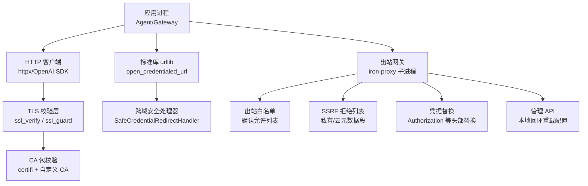
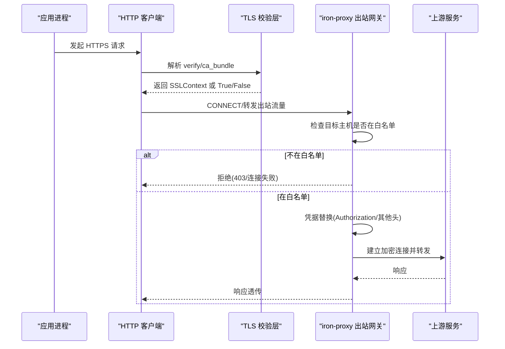
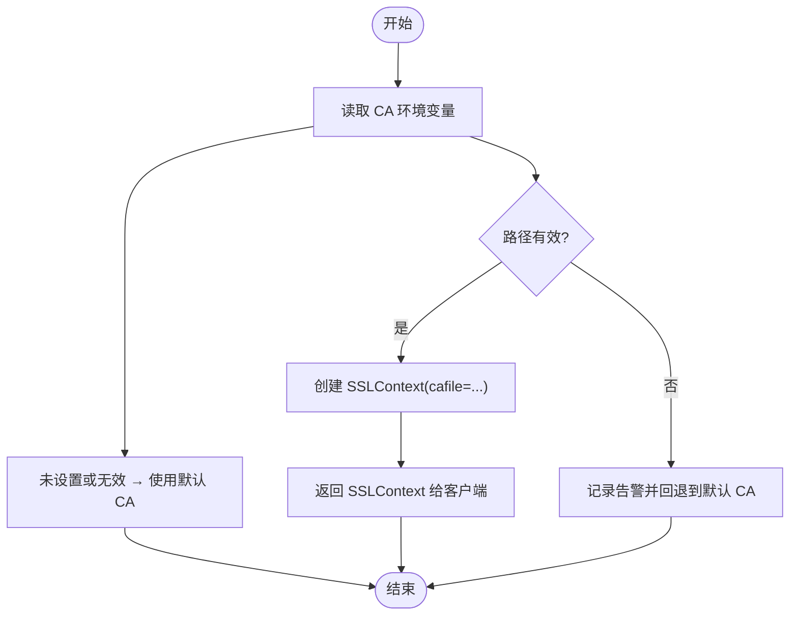
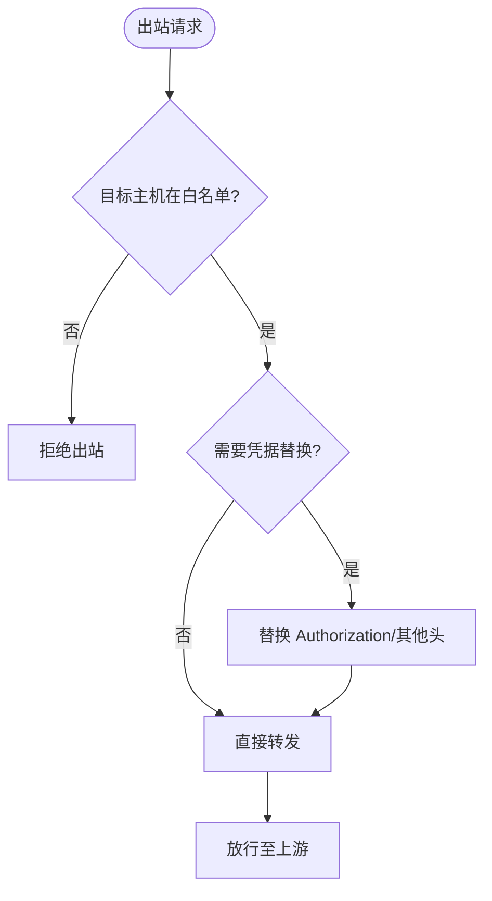
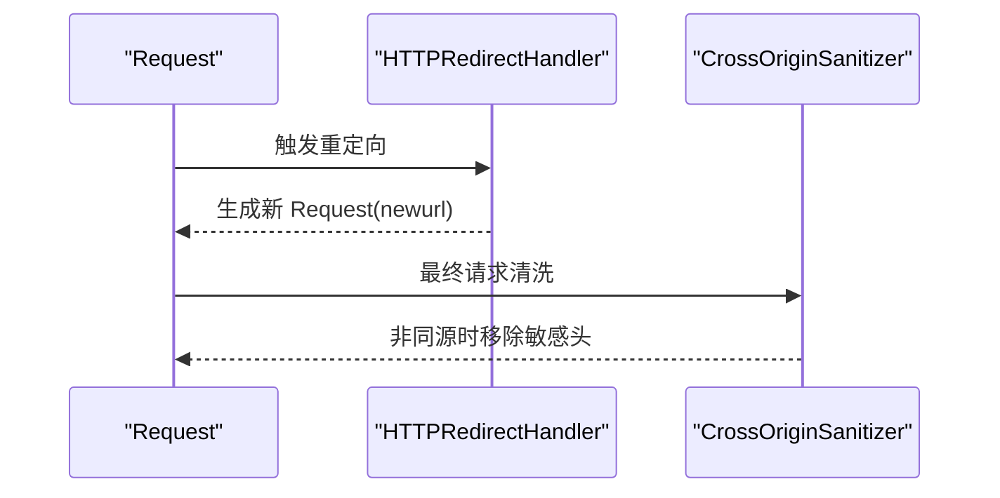
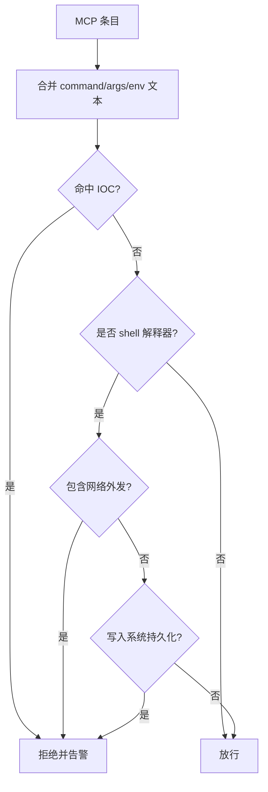
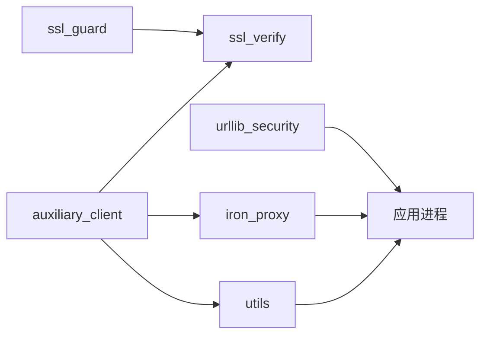

# 网络隔离

<cite>
**本文引用的文件**
- [agent/ssl_guard.py](file://agent/ssl_guard.py)
- [agent/ssl_verify.py](file://agent/ssl_verify.py)
- [hermes_cli/urllib_security.py](file://hermes_cli/urllib_security.py)
- [hermes_cli/mcp_security.py](file://hermes_cli/mcp_security.py)
- [agent/proxy_sources/iron_proxy.py](file://agent/proxy_sources/iron_proxy.py)
- [utils.py](file://utils.py)
- [agent/auxiliary_client.py](file://agent/auxiliary_client.py)
</cite>

## 目录
1. [简介](#简介)
2. [项目结构](#项目结构)
3. [核心组件](#核心组件)
4. [架构总览](#架构总览)
5. [详细组件分析](#详细组件分析)
6. [依赖关系分析](#依赖关系分析)
7. [性能考虑](#性能考虑)
8. [故障排查指南](#故障排查指南)
9. [结论](#结论)
10. [附录：生产基线与合规配置模板](#附录生产基线与合规配置模板)

## 简介
本文件面向生产环境，系统化说明 Hermes Agent 的网络隔离与网络安全策略，覆盖出站请求过滤、入站连接限制、网络命名空间隔离（通过容器/沙箱实现）、SSL/TLS 证书验证、HTTPS 代理配置与证书颁发机构管理、DNS 查询控制、端口访问限制、防火墙规则配置、流量监控、异常检测与威胁防护。文档同时提供可落地的配置模板与安全基线建议，帮助在复杂企业环境中实现最小权限的出站访问与强化的 TLS 信任链。

## 项目结构
围绕网络隔离的关键代码分布在以下模块：
- SSL/TLS 校验与 CA 管理：agent/ssl_guard.py、agent/ssl_verify.py
- 标准库 urllib 安全重定向与跨域头清理：hermes_cli/urllib_security.py
- MCP 服务器入口安全校验（防外发与持久化）：hermes_cli/mcp_security.py
- 出站流量拦截与凭据替换（iron-proxy 集成）：agent/proxy_sources/iron_proxy.py
- 代理环境变量规范化与主机名匹配工具：utils.py
- 辅助客户端对代理与 TLS 参数的统一注入：agent/auxiliary_client.py

图表来源
- [agent/ssl_guard.py:68-102](file://agent/ssl_guard.py#L68-L102)
- [agent/ssl_verify.py:22-64](file://agent/ssl_verify.py#L22-L64)
- [hermes_cli/urllib_security.py:31-132](file://hermes_cli/urllib_security.py#L31-L132)
- [agent/proxy_sources/iron_proxy.py:131-251](file://agent/proxy_sources/iron_proxy.py#L131-L251)

章节来源
- [agent/ssl_guard.py:1-102](file://agent/ssl_guard.py#L1-L102)
- [agent/ssl_verify.py:1-64](file://agent/ssl_verify.py#L1-L64)
- [hermes_cli/urllib_security.py:1-140](file://hermes_cli/urllib_security.py#L1-L140)
- [hermes_cli/mcp_security.py:1-182](file://hermes_cli/mcp_security.py#L1-L182)
- [agent/proxy_sources/iron_proxy.py:1-800](file://agent/proxy_sources/iron_proxy.py#L1-L800)
- [utils.py:580-667](file://utils.py#L580-L667)
- [agent/auxiliary_client.py:3200-3211](file://agent/auxiliary_client.py#L3200-L3211)

## 核心组件
- SSL/TLS 证书校验与 CA 管理
  - 启动前校验 CA bundle 路径与内容有效性，避免后续出现模糊错误。
  - 为 httpx/OpenAI 客户端解析 verify 参数，支持显式禁用（仅开发）、自定义 CA、环境变量 CA、默认系统 CA。
- 出站请求过滤与凭据替换
  - 通过 iron-proxy 子进程作为出站网关，默认拒绝所有出站，仅允许预定义 AI 提供商域名；对 Authorization 等头部进行凭据替换，使沙箱内只持有不透明令牌。
  - 内置 SSRF 保护，拒绝访问私有网段、云元数据地址等危险范围。
- 入站连接限制与命名空间隔离
  - 通过容器/沙箱运行工作负载，结合铁壳出站网关，将入站暴露面收敛到必要端口；出站强制经代理。
- 标准库 urllib 安全处理
  - 跨域重定向时剥离敏感头，防止凭据泄露到不同源。
- MCP 服务器入口安全
  - 阻止 shell 解释器执行网络外发或写入系统持久化位置，阻断已知 IOC 条目。
- 代理环境变量规范化
  - 标准化 HTTP(S)/ALL_PROXY 等环境变量格式，确保下游客户端正确识别代理。

章节来源
- [agent/ssl_guard.py:68-102](file://agent/ssl_guard.py#L68-L102)
- [agent/ssl_verify.py:22-64](file://agent/ssl_verify.py#L22-L64)
- [agent/proxy_sources/iron_proxy.py:131-251](file://agent/proxy_sources/iron_proxy.py#L131-L251)
- [hermes_cli/urllib_security.py:31-132](file://hermes_cli/urllib_security.py#L31-L132)
- [hermes_cli/mcp_security.py:121-182](file://hermes_cli/mcp_security.py#L121-L182)
- [utils.py:580-588](file://utils.py#L580-L588)

## 架构总览
下图展示从应用进程到出站流量的关键路径与安全点：

图表来源
- [agent/ssl_verify.py:22-64](file://agent/ssl_verify.py#L22-L64)
- [agent/proxy_sources/iron_proxy.py:131-200](file://agent/proxy_sources/iron_proxy.py#L131-L200)

章节来源
- [agent/ssl_verify.py:1-64](file://agent/ssl_verify.py#L1-L64)
- [agent/proxy_sources/iron_proxy.py:1-800](file://agent/proxy_sources/iron_proxy.py#L1-L800)

## 详细组件分析

### SSL/TLS 证书验证与 CA 管理
- 启动前 CA bundle 校验
  - 读取 HERMES_CA_BUNDLE、SSL_CERT_FILE、REQUESTS_CA_BUNDLE、CURL_CA_BUNDLE 等环境变量，校验路径存在、类型正确、大小合理且可被 OpenSSL 加载。
  - 校验 certifi 内置 cacert.pem 完整性，避免“找不到文件或损坏”导致的模糊错误。
- httpx/OpenAI 客户端 verify 解析
  - 优先级：显式禁用（仅开发）→ 指定 ca_bundle → 环境变量 CA → 默认系统 CA。
  - 当使用自定义 CA 时，构造 ssl.SSLContext 并传入客户端；若路径不存在则降级到默认 CA 并记录告警。

图表来源
- [agent/ssl_guard.py:68-102](file://agent/ssl_guard.py#L68-L102)
- [agent/ssl_verify.py:22-64](file://agent/ssl_verify.py#L22-L64)

章节来源
- [agent/ssl_guard.py:1-102](file://agent/ssl_guard.py#L1-L102)
- [agent/ssl_verify.py:1-64](file://agent/ssl_verify.py#L1-L64)

### 出站请求过滤与凭据替换（iron-proxy）
- 默认策略：默认拒绝所有出站，仅允许预定义的 AI 提供商域名（如 OpenAI、Anthropic、Google、Mistral、Groq、Together、DeepSeek、X.AI、Nous）。
- 凭据替换：对 Authorization 及特定头部（如 x-api-key、api-key、x-goog-api-key）进行替换，使沙箱内仅持有不透明令牌。
- SSRF 保护：拒绝访问环回、链路本地、RFC1918、CGNAT、IPv6 ULA、IPv4 映射 IPv6 等危险段。
- 管理与重载：通过本地回环的管理 API 重载配置，无需重启即可生效。

图表来源
- [agent/proxy_sources/iron_proxy.py:131-200](file://agent/proxy_sources/iron_proxy.py#L131-L200)
- [agent/proxy_sources/iron_proxy.py:226-251](file://agent/proxy_sources/iron_proxy.py#L226-L251)

章节来源
- [agent/proxy_sources/iron_proxy.py:1-800](file://agent/proxy_sources/iron_proxy.py#L1-L800)

### 标准库 urllib 安全重定向与跨域头清理
- 跨域重定向时仅保留安全头（accept、user-agent），移除可能携带凭据的其他头，防止凭据泄露到不同源。
- 通过安装处理器在请求生命周期末尾再次清洗，确保即使后续处理器重新添加头也能被清理。

图表来源
- [hermes_cli/urllib_security.py:31-132](file://hermes_cli/urllib_security.py#L31-L132)

章节来源
- [hermes_cli/urllib_security.py:1-140](file://hermes_cli/urllib_security.py#L1-L140)

### MCP 服务器入口安全（防外发与持久化）
- 阻止 shell 解释器执行网络外发命令（curl/wget/nc/socat 等）与疑似数据外泄的参数模式。
- 阻止写入系统持久化表面（SSH keys、PAM、sudoers、cron、shell rc 等），阻断后门植入。
- 硬编码 IOC 黑名单（已知攻击密钥与源 IP），命中即拒绝。

图表来源
- [hermes_cli/mcp_security.py:121-182](file://hermes_cli/mcp_security.py#L121-L182)

章节来源
- [hermes_cli/mcp_security.py:1-182](file://hermes_cli/mcp_security.py#L1-L182)

### 代理环境变量规范化与 URL 主机名校验
- 标准化 HTTP(S)/ALL_PROXY 等环境变量为规范 URL 形式，确保下游客户端正确识别代理。
- 提供 base_url_hostname/base_url_host_matches 等工具函数，用于精确匹配上游主机名，避免子串误判导致路由错误。

章节来源
- [utils.py:580-667](file://utils.py#L580-L667)

### 辅助客户端对代理与 TLS 的统一注入
- 在创建辅助客户端时，统一注入 keepalive 与代理配置，并对代理环境变量进行规范化与校验。
- 支持 per-provider 的 ssl_ca_cert 与 ssl_verify 配置项，保证会话中切换 TLS 策略仍生效。

章节来源
- [agent/auxiliary_client.py:3200-3211](file://agent/auxiliary_client.py#L3200-L3211)

## 依赖关系分析
- agent/ssl_guard.py 与 agent/ssl_verify.py 共同负责 TLS 信任链与证书校验，前者侧重启动期健壮性，后者侧重运行时 verify 解析。
- hermes_cli/urllib_security.py 为标准库请求提供跨域安全处理，独立于第三方 HTTP 客户端。
- agent/proxy_sources/iron_proxy.py 作为出站网关，依赖系统 openssl 与外部二进制，并通过管理 API 热重载。
- utils.py 提供代理环境变量规范化与主机名匹配工具，被多处调用以保障一致性。
- agent/auxiliary_client.py 整合上述能力，统一注入代理与 TLS 策略。

图表来源
- [agent/ssl_guard.py:68-102](file://agent/ssl_guard.py#L68-L102)
- [agent/ssl_verify.py:22-64](file://agent/ssl_verify.py#L22-L64)
- [hermes_cli/urllib_security.py:31-132](file://hermes_cli/urllib_security.py#L31-L132)
- [agent/proxy_sources/iron_proxy.py:131-251](file://agent/proxy_sources/iron_proxy.py#L131-L251)
- [utils.py:580-667](file://utils.py#L580-L667)
- [agent/auxiliary_client.py:3200-3211](file://agent/auxiliary_client.py#L3200-L3211)

章节来源
- [agent/ssl_guard.py:1-102](file://agent/ssl_guard.py#L1-L102)
- [agent/ssl_verify.py:1-64](file://agent/ssl_verify.py#L1-L64)
- [hermes_cli/urllib_security.py:1-140](file://hermes_cli/urllib_security.py#L1-L140)
- [agent/proxy_sources/iron_proxy.py:1-800](file://agent/proxy_sources/iron_proxy.py#L1-L800)
- [utils.py:580-667](file://utils.py#L580-L667)
- [agent/auxiliary_client.py:3200-3211](file://agent/auxiliary_client.py#L3200-L3211)

## 性能考虑
- iron-proxy 子进程版本探测结果缓存，减少频繁子进程调用开销。
- 管理 API 支持热重载配置，避免重启带来的连接中断与性能抖动。
- 代理环境变量规范化仅在必要时执行，避免重复计算。
- 默认拒绝策略减少不必要的出站尝试，降低网络延迟与资源消耗。

[本节为通用指导，不直接分析具体文件]

## 故障排查指南
- 启动阶段 CA bundle 错误
  - 现象：提示 CA bundle 缺失、损坏或无法加载。
  - 处理：运行修复命令或手动重装相关依赖；检查自定义 CA 环境变量指向是否正确。
- 出站被拒绝
  - 现象：连接超时或被代理拒绝。
  - 处理：确认目标主机是否在出站白名单；如需新增，更新 iron-proxy 配置并重载。
- 凭据未替换
  - 现象：上游认证失败。
  - 处理：检查对应 provider 的头部匹配规则（Authorization/x-api-key/api-key/x-goog-api-key）与环境变量映射。
- 跨域重定向导致认证失败
  - 现象：重定向后 401/403。
  - 处理：确认是否发生跨域重定向；尽量保持同域或使用服务端重定向策略。
- MCP 条目被拒绝
  - 现象：保存或启动时报错。
  - 处理：检查是否包含 shell 解释器与网络外发/持久化写入；移除 IOC 字符串。

章节来源
- [agent/ssl_guard.py:68-102](file://agent/ssl_guard.py#L68-L102)
- [agent/proxy_sources/iron_proxy.py:131-251](file://agent/proxy_sources/iron_proxy.py#L131-L251)
- [hermes_cli/urllib_security.py:31-132](file://hermes_cli/urllib_security.py#L31-L132)
- [hermes_cli/mcp_security.py:121-182](file://hermes_cli/mcp_security.py#L121-L182)

## 结论
Hermes Agent 在网络隔离方面提供了分层防御：启动期 CA bundle 校验、运行时 TLS 策略解析、出站默认拒绝与白名单控制、凭据替换、SSRF 保护、跨域头清理以及 MCP 入口安全。配合容器/沙箱与最小权限原则，可在生产环境实现强化的出站访问控制与安全的 TLS 信任链。建议在生产中启用默认拒绝策略、严格管理 CA 与代理配置，并结合日志与审计进行持续监控。

[本节为总结，不直接分析具体文件]

## 附录：生产基线与合规配置模板

- 出站请求过滤
  - 启用默认拒绝策略，仅允许必要的 AI 提供商域名。
  - 定期审查与更新白名单，避免过度放宽。
  - 参考：[agent/proxy_sources/iron_proxy.py:131-200](file://agent/proxy_sources/iron_proxy.py#L131-L200)

- 入站连接限制
  - 仅暴露必要端口（如管理 API 绑定本地回环）。
  - 使用防火墙/安全组限制来源 IP。
  - 参考：[agent/proxy_sources/iron_proxy.py:108-124](file://agent/proxy_sources/iron_proxy.py#L108-L124)

- 网络命名空间隔离
  - 在容器/沙箱中运行工作负载，出站强制经 iron-proxy。
  - 禁止在沙箱内直接访问内部网络与云元数据。
  - 参考：[agent/proxy_sources/iron_proxy.py:226-251](file://agent/proxy_sources/iron_proxy.py#L226-L251)

- SSL/TLS 证书验证与 CA 管理
  - 启动前校验 CA bundle，避免模糊错误。
  - 生产环境禁止禁用 TLS 验证。
  - 参考：[agent/ssl_guard.py:68-102](file://agent/ssl_guard.py#L68-L102)、[agent/ssl_verify.py:22-64](file://agent/ssl_verify.py#L22-L64)

- HTTPS 代理配置
  - 标准化代理环境变量，确保下游客户端正确识别。
  - 在辅助客户端中统一注入代理与 TLS 策略。
  - 参考：[utils.py:580-588](file://utils.py#L580-L588)、[agent/auxiliary_client.py:3200-3211](file://agent/auxiliary_client.py#L3200-L3211)

- DNS 查询控制
  - 在容器/沙箱中配置可信 DNS 服务器，避免污染。
  - 结合出站白名单限制解析到的上游主机。
  - 参考：[agent/proxy_sources/iron_proxy.py:131-200](file://agent/proxy_sources/iron_proxy.py#L131-L200)

- 端口访问限制
  - 仅开放必要端口，管理 API 绑定本地回环。
  - 使用防火墙规则限制来源与目的端口。
  - 参考：[agent/proxy_sources/iron_proxy.py:108-124](file://agent/proxy_sources/iron_proxy.py#L108-L124)

- 防火墙规则配置
  - 默认拒绝入站与出站，按需放行。
  - 屏蔽私有网段与云元数据地址。
  - 参考：[agent/proxy_sources/iron_proxy.py:226-251](file://agent/proxy_sources/iron_proxy.py#L226-L251)

- 流量监控、异常检测与威胁防护
  - 启用 iron-proxy 日志与审计（预留审计路径）。
  - 监控出站白名单命中率与拒绝次数。
  - 对 MCP 条目进行安全扫描，阻止外发与持久化写入。
  - 参考：[hermes_cli/mcp_security.py:121-182](file://hermes_cli/mcp_security.py#L121-L182)

- 生产基线与合规要点
  - 禁止在生产禁用 TLS 验证。
  - 使用受信任的 CA 与最小权限出站白名单。
  - 定期轮换 CA 与管理密钥，限制文件权限。
  - 对所有入口（MCP、API）进行安全校验与审计。

[本节为模板与基线建议，不直接分析具体文件]