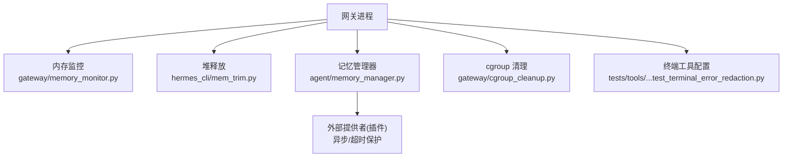
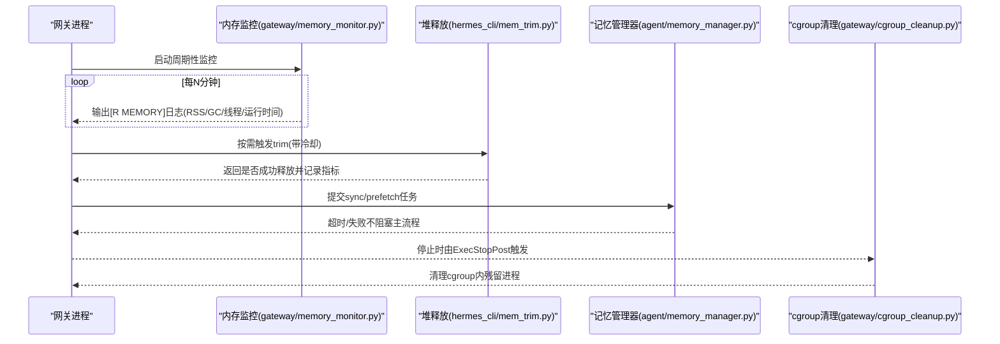
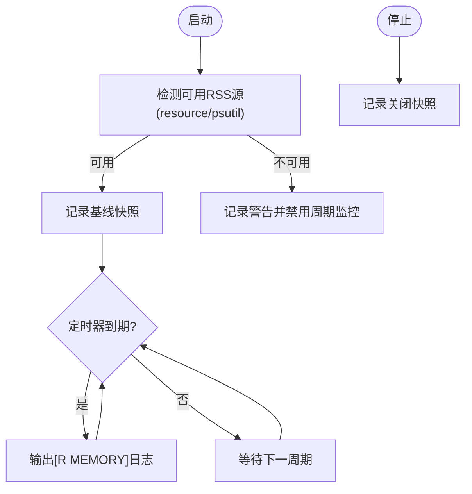
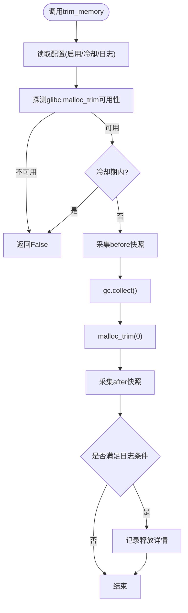
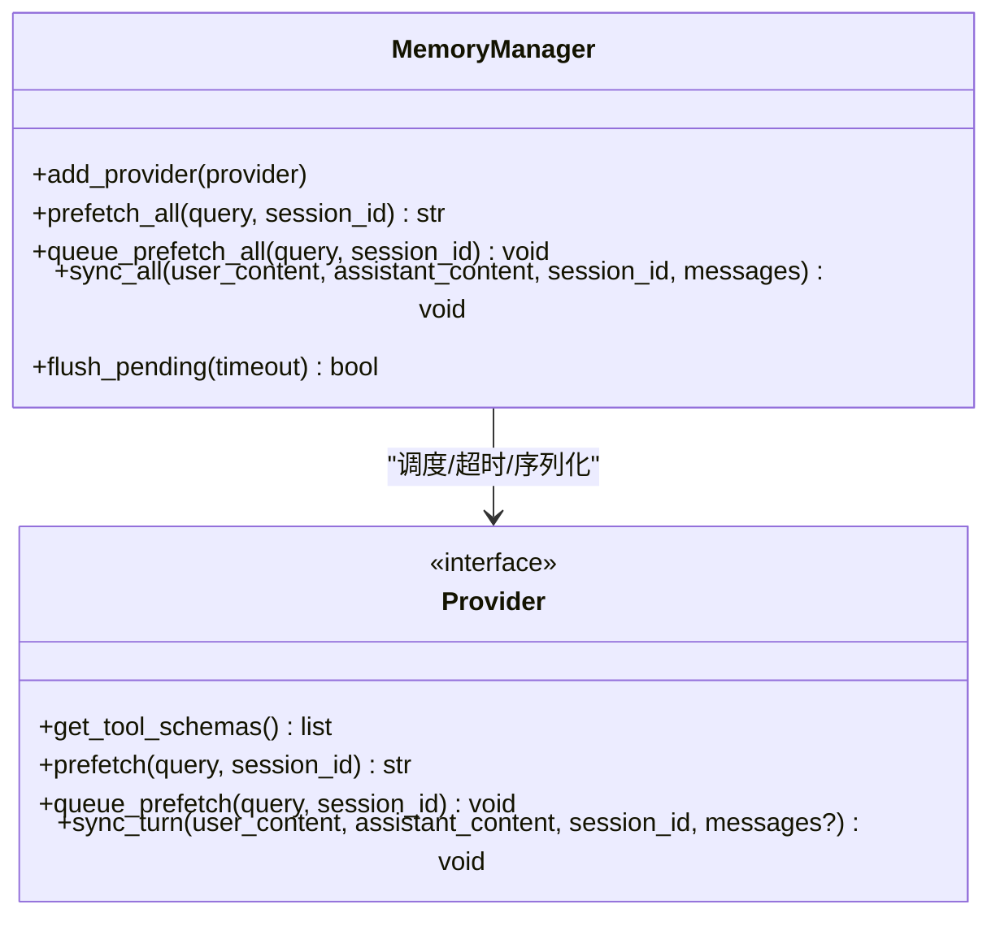
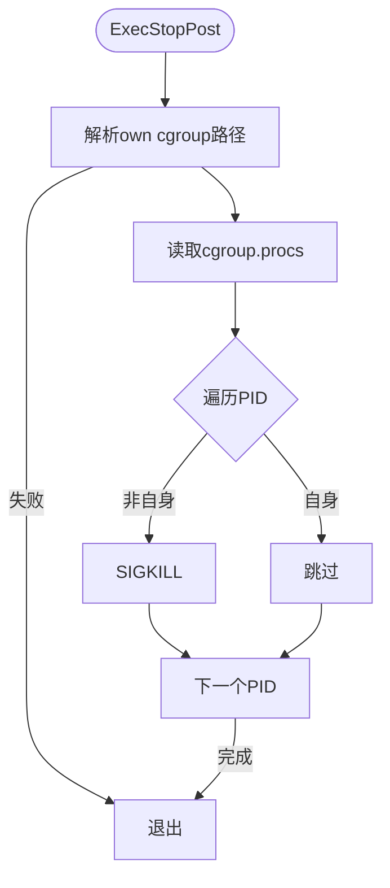
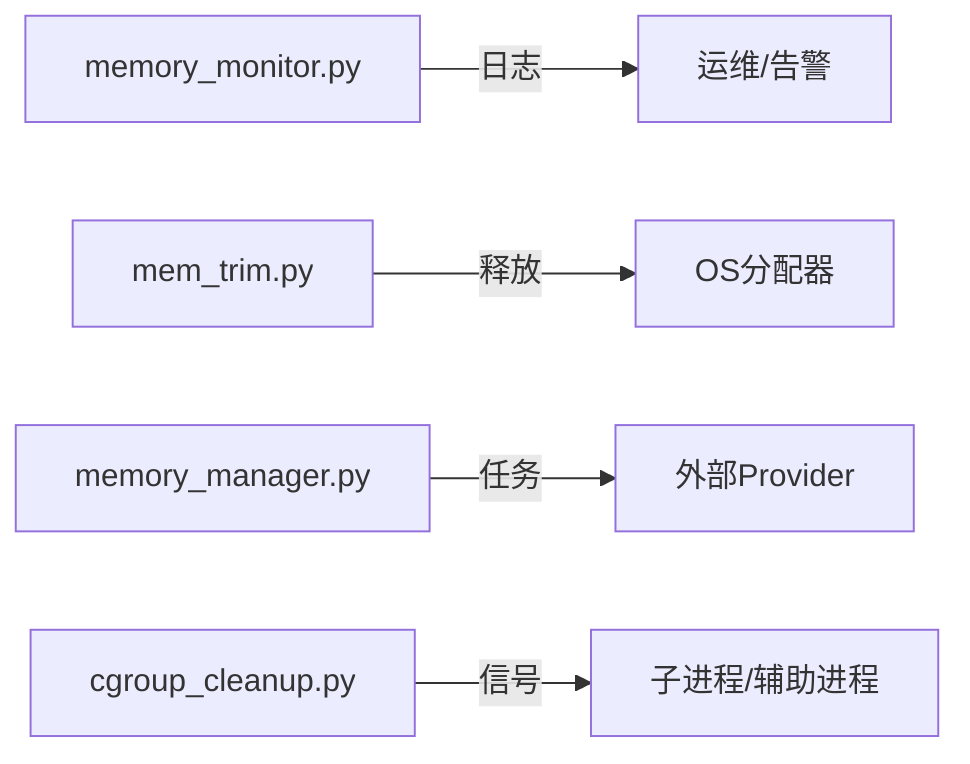

# 资源限制

<cite>
**本文引用的文件**
- [gateway/memory_monitor.py](file://gateway/memory_monitor.py)
- [hermes_cli/mem_trim.py](file://hermes_cli/mem_trim.py)
- [agent/memory_manager.py](file://agent/memory_manager.py)
- [gateway/cgroup_cleanup.py](file://gateway/cgroup_cleanup.py)
- [tests/tools/test_terminal_error_redaction.py](file://tests/tools/test_terminal_error_redaction.py)
</cite>

## 目录
1. [简介](#简介)
2. [项目结构](#项目结构)
3. [核心组件](#核心组件)
4. [架构总览](#架构总览)
5. [详细组件分析](#详细组件分析)
6. [依赖关系分析](#依赖关系分析)
7. [性能考量](#性能考量)
8. [故障排查指南](#故障排查指南)
9. [结论](#结论)
10. [附录](#附录)

## 简介
本文件聚焦 Hermes Agent 在 CPU、内存与存储方面的资源限制与治理机制，覆盖以下主题：
- Docker 容器资源配额（进程级 cgroup 清理）
- 云函数/远程执行环境的资源约束（通过终端工具配置项体现）
- 本地环境资源管理（内存监控、垃圾回收、堆释放）
- 内存使用监控、GC 优化与泄漏防护
- 网络带宽限制、I/O 操作限制与并发连接控制（结合速率限制与超时策略）
- 资源限制配置示例与性能调优建议
- 资源使用监控、告警阈值与自动扩缩容策略
- 生产环境最佳实践与容量规划

## 项目结构
与资源限制直接相关的代码主要分布在以下模块：
- gateway/memory_monitor.py：周期性记录进程 RSS、线程数与 GC 计数，便于发现慢泄漏。
- hermes_cli/mem_trim.py：在 Linux/glibc 上调用 malloc_trim 释放空闲堆页，配合 GC 降低常驻内存。
- agent/memory_manager.py：后台同步/预取任务调度，避免阻塞主流程；提供超时与单工作线程序列化，防止资源被长时间占用。
- gateway/cgroup_cleanup.py：systemd ExecStopPost 钩子中清理 cgroup 内残留进程，保障容器/单元重启不被孤儿进程阻塞。
- tests/tools/test_terminal_error_redaction.py：展示终端工具对运行环境（含 Modal/Docker/Singularity/Daytona）的配置项，间接体现远端执行资源的隔离与约束入口。

图表来源
- [gateway/memory_monitor.py:1-231](file://gateway/memory_monitor.py#L1-L231)
- [hermes_cli/mem_trim.py:1-256](file://hermes_cli/mem_trim.py#L1-L256)
- [agent/memory_manager.py:1-800](file://agent/memory_manager.py#L1-L800)
- [gateway/cgroup_cleanup.py:1-82](file://gateway/cgroup_cleanup.py#L1-L82)
- [tests/tools/test_terminal_error_redaction.py:13-24](file://tests/tools/test_terminal_error_redaction.py#L13-L24)

章节来源
- [gateway/memory_monitor.py:1-231](file://gateway/memory_monitor.py#L1-L231)
- [hermes_cli/mem_trim.py:1-256](file://hermes_cli/mem_trim.py#L1-L256)
- [agent/memory_manager.py:1-800](file://agent/memory_manager.py#L1-L800)
- [gateway/cgroup_cleanup.py:1-82](file://gateway/cgroup_cleanup.py#L1-L82)
- [tests/tools/test_terminal_error_redaction.py:13-24](file://tests/tools/test_terminal_error_redaction.py#L13-L24)

## 核心组件
- 内存监控器：以固定间隔输出结构化日志行，包含 RSS、GC 计数、线程数与运行时长，支持基线与关闭时快照。
- 堆释放器：在 glibc 环境下触发 malloc_trim，配合 GC 周期性地归还空闲堆页给操作系统，具备冷却时间与可观测性。
- 记忆管理器：将同步/预取任务放入单工作线程的后台执行器，提供超时、去重与优雅关闭，避免外部提供者拖垮主循环。
- cgroup 清理：在系统单元停止后强制清理 cgroup 中的遗留进程，确保容器/服务重启不受阻碍。
- 终端工具环境配置：通过配置项指定运行模式与镜像，为远端执行（如 Modal/Docker）提供资源边界入口。

章节来源
- [gateway/memory_monitor.py:1-231](file://gateway/memory_monitor.py#L1-L231)
- [hermes_cli/mem_trim.py:1-256](file://hermes_cli/mem_trim.py#L1-L256)
- [agent/memory_manager.py:1-800](file://agent/memory_manager.py#L1-L800)
- [gateway/cgroup_cleanup.py:1-82](file://gateway/cgroup_cleanup.py#L1-L82)
- [tests/tools/test_terminal_error_redaction.py:13-24](file://tests/tools/test_terminal_error_redaction.py#L13-L24)

## 架构总览
下图展示了资源限制相关组件之间的交互：监控与回收围绕网关进程展开，记忆管理器负责外部任务的资源隔离与超时，cgroup 清理作为最后防线保证进程生命周期整洁。

图表来源
- [gateway/memory_monitor.py:1-231](file://gateway/memory_monitor.py#L1-L231)
- [hermes_cli/mem_trim.py:1-256](file://hermes_cli/mem_trim.py#L1-L256)
- [agent/memory_manager.py:1-800](file://agent/memory_manager.py#L1-L800)
- [gateway/cgroup_cleanup.py:1-82](file://gateway/cgroup_cleanup.py#L1-L82)

## 详细组件分析

### 内存监控（RSS/GC/线程）
- 功能要点
  - 使用标准库 resource.getrusage 或可选 psutil 读取进程 RSS，跨平台兼容。
  - 每 N 分钟输出一条结构化日志，包含 RSS、GC 代计数、活跃线程数与运行时长。
  - 启动时记录基线，关闭时记录最终快照，便于定位泄漏。
- 设计权衡
  - 监控线程为守护线程，不影响进程退出。
  - 若无法获取 RSS，则降级为警告并跳过周期性日志，避免影响稳定性。
- 适用场景
  - 长期运行的网关进程，用于发现缓慢的内存增长与线程泄漏。

图表来源
- [gateway/memory_monitor.py:1-231](file://gateway/memory_monitor.py#L1-L231)

章节来源
- [gateway/memory_monitor.py:1-231](file://gateway/memory_monitor.py#L1-L231)

### 堆释放（malloc_trim + GC）
- 功能要点
  - 在 Linux/glibc 下探测并调用 malloc_trim，配合 gc.collect() 释放空闲堆页。
  - 支持冷却时间、最小信息日志阈值与强制模式，避免频繁全量 GC 带来的抖动。
  - 收集 VmRSS/RssAnon 等轻量指标，便于评估释放效果。
- 配置要点
  - 通过 context.memory_trim 开关、冷却秒数、日志频率与最小变化阈值进行调节。
- 适用场景
  - 长驻进程在批量关闭或空闲时段主动释放内存，降低峰值与平均 RSS。

图表来源
- [hermes_cli/mem_trim.py:1-256](file://hermes_cli/mem_trim.py#L1-L256)

章节来源
- [hermes_cli/mem_trim.py:1-256](file://hermes_cli/mem_trim.py#L1-L256)

### 记忆管理器（任务隔离与超时）
- 功能要点
  - 将 provider 的 sync_turn 与 queue_prefetch_all 放入单工作线程执行器，串行化写入，避免竞争与堆积。
  - 外部 provider 的 prefetch 支持超时，避免卡死主流程。
  - 关闭时优雅等待队列耗尽，未完成的 future 会被丢弃并记录。
- 设计权衡
  - 单工作线程保证顺序与可控并发；对慢/挂起 provider 提供隔离。
  - 对外部 prefetch 设置超时，避免无限等待。
- 适用场景
  - 需要与外部存储/索引/向量库交互的记忆后端，需避免阻塞对话主循环。

图表来源
- [agent/memory_manager.py:1-800](file://agent/memory_manager.py#L1-L800)

章节来源
- [agent/memory_manager.py:1-800](file://agent/memory_manager.py#L1-L800)

### cgroup 清理（容器/单元级进程回收）
- 功能要点
  - 在 systemd ExecStopPost 阶段读取当前 cgroup 路径，遍历 cgroup.procs 并向除自身外的所有 PID 发送 SIGKILL。
  - 解决长生命周期的辅助进程（如 adb、平台桥接）未被追踪导致的孤儿进程问题，保障 Restart=always 正常生效。
- 适用场景
  - 容器化部署或 systemd 管理的网关进程，确保停止时彻底清理资源。

图表来源
- [gateway/cgroup_cleanup.py:1-82](file://gateway/cgroup_cleanup.py#L1-L82)

章节来源
- [gateway/cgroup_cleanup.py:1-82](file://gateway/cgroup_cleanup.py#L1-L82)

### 终端工具与环境约束（Modal/Docker/本地）
- 功能要点
  - 测试用例展示了终端工具的运行时配置项，包括 env_type、timeout、modal_mode、docker_image、singularity_image、modal_image、daytona_image 等。
  - 这些配置项为远端执行环境提供了资源边界入口（例如选择镜像、设置超时），从而间接实现 CPU/内存/存储与并发限制。
- 适用场景
  - 需要在不同执行环境（本地、Docker、Modal、Singularity、Daytona）间切换的任务，统一通过配置项约束资源。

章节来源
- [tests/tools/test_terminal_error_redaction.py:13-24](file://tests/tools/test_terminal_error_redaction.py#L13-L24)

## 依赖关系分析
- 组件耦合
  - 内存监控与堆释放均面向进程级资源，彼此独立但可协同（先 GC 再 trim）。
  - 记忆管理器与外部 provider 松耦合，通过接口与超时机制解耦。
  - cgroup 清理位于进程生命周期末尾，作为兜底手段。
- 外部依赖
  - 内存监控依赖 resource（标准库）或 psutil（可选）。
  - 堆释放依赖 glibc 的 malloc_trim（Linux）。
  - 记忆管理器可能依赖外部存储/索引服务，需考虑其延迟与错误。
- 潜在环依赖
  - 各模块之间无直接循环导入，主要通过事件/日志/配置协作。

图表来源
- [gateway/memory_monitor.py:1-231](file://gateway/memory_monitor.py#L1-L231)
- [hermes_cli/mem_trim.py:1-256](file://hermes_cli/mem_trim.py#L1-L256)
- [agent/memory_manager.py:1-800](file://agent/memory_manager.py#L1-L800)
- [gateway/cgroup_cleanup.py:1-82](file://gateway/cgroup_cleanup.py#L1-L82)

## 性能考量
- 内存监控
  - 默认 5 分钟一次，适合长期观测；可根据负载调整间隔。
  - 在资源不可用时自动降级，避免影响主流程。
- 堆释放
  - 冷却时间避免频繁触发；强制模式适用于批量关闭场景。
  - 仅在 glibc 环境有效，其他平台安全无副作用。
- 记忆管理器
  - 单工作线程序列化写入，减少竞争；外部 prefetch 超时保护。
  - 关闭时优雅等待，避免阻塞进程退出。
- cgroup 清理
  - 仅在执行停止阶段运行，开销极低；确保容器/单元快速重启。

[本节为通用性能讨论，无需特定文件引用]

## 故障排查指南
- 内存持续增长
  - 检查 memory_monitor 输出的 RSS 趋势与 GC 计数，定位异常增长区间。
  - 在关键节点调用 mem_trim 并观察 RSS 变化，确认是否为堆碎片导致。
- 外部 provider 拖慢主流程
  - 检查 memory_manager 的超时与后台任务状态，确认是否有 provider 响应过慢。
  - 调整外部 prefetch 超时或禁用问题 provider。
- 容器/服务无法重启
  - 确认 cgroup_cleanup 是否被执行，查看是否仍有残留进程。
- 远端执行资源不足
  - 通过终端工具配置项调整 timeout、镜像与运行模式，必要时提升配额或更换实例规格。

章节来源
- [gateway/memory_monitor.py:1-231](file://gateway/memory_monitor.py#L1-L231)
- [hermes_cli/mem_trim.py:1-256](file://hermes_cli/mem_trim.py#L1-L256)
- [agent/memory_manager.py:1-800](file://agent/memory_manager.py#L1-L800)
- [gateway/cgroup_cleanup.py:1-82](file://gateway/cgroup_cleanup.py#L1-L82)
- [tests/tools/test_terminal_error_redaction.py:13-24](file://tests/tools/test_terminal_error_redaction.py#L13-L24)

## 结论
Hermes Agent 通过多层机制实现资源限制与治理：
- 进程级：内存监控与堆释放降低常驻内存，识别泄漏与碎片。
- 任务级：记忆管理器隔离外部依赖，提供超时与序列化，避免资源被长时间占用。
- 系统级：cgroup 清理确保容器/单元停止时的资源回收。
- 执行环境：终端工具配置项为远端执行提供资源边界入口。
结合监控、告警与合理的扩缩容策略，可在生产环境中稳定运行并高效利用资源。

[本节为总结，无需特定文件引用]

## 附录

### 配置示例与调优建议
- 内存监控
  - 调整监控间隔与日志级别，关注 RSS 与线程数趋势。
- 堆释放
  - 合理设置冷却时间与日志阈值；在批量关闭场景使用强制模式。
- 记忆管理器
  - 根据外部 provider 性能调整 prefetch 超时；必要时禁用慢 provider。
- 终端工具
  - 选择合适的运行模式与镜像；设置合理的 timeout；在远端环境限制 CPU/内存/存储。

[本节为通用指导，无需特定文件引用]

### 监控、告警与自动扩缩容
- 监控
  - 基于 memory_monitor 的结构化日志建立 RSS/GC/线程数时序。
  - 记录 mem_trim 释放前后指标，评估释放效果。
- 告警
  - 当 RSS 持续上升且 GC 无效时触发告警；当外部 provider 超时率升高时告警。
- 自动扩缩容
  - 结合会话/任务负载与资源使用率，动态调整实例规格或副本数；在低负载时缩容，高负载时扩容。

[本节为通用策略，无需特定文件引用]

### 生产最佳实践与容量规划
- 预留余量：为峰值负载预留 20%-30% 的资源缓冲。
- 渐进式发布：灰度发布新 provider 或配置变更，观察资源曲线。
- 定期压测：模拟高峰负载，验证超时、限流与回收策略有效性。
- 容量规划：依据历史 RSS/GC/线程数与任务吞吐，估算所需 CPU/内存/存储与实例数量。

[本节为通用实践，无需特定文件引用]