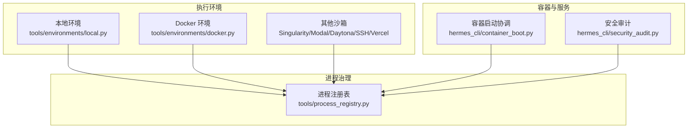
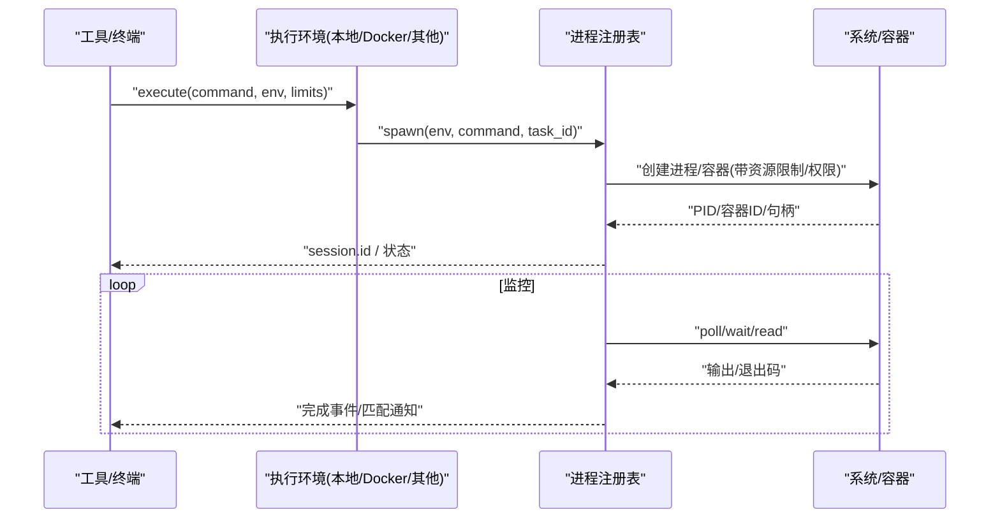
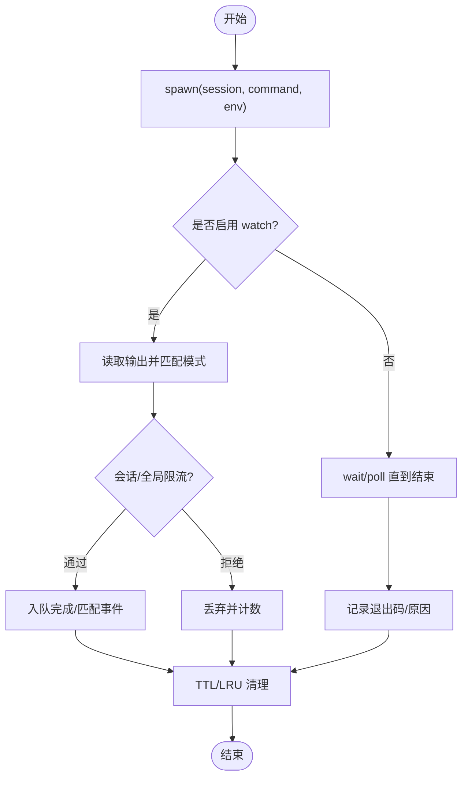
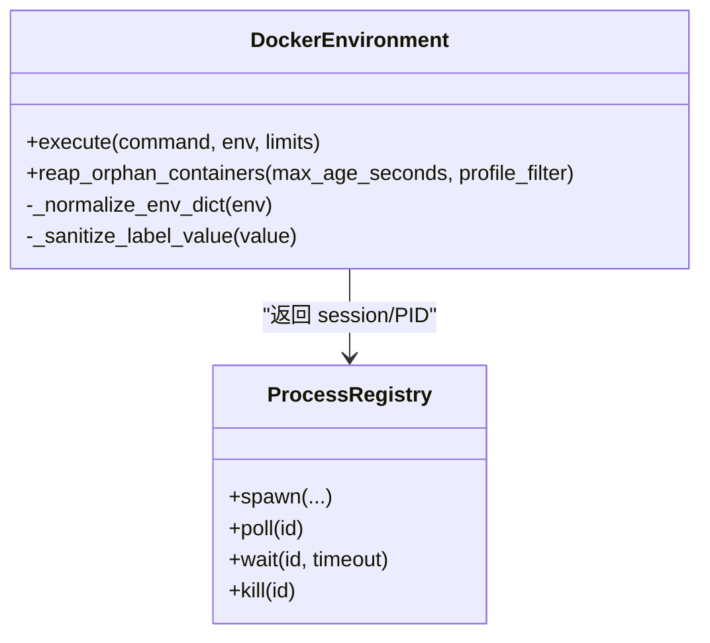
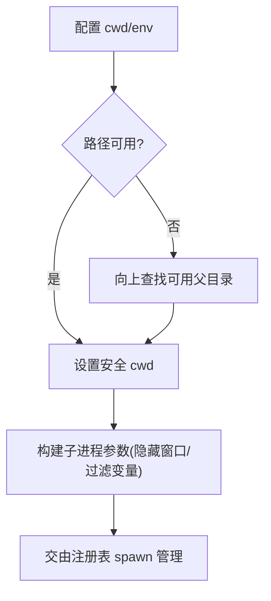
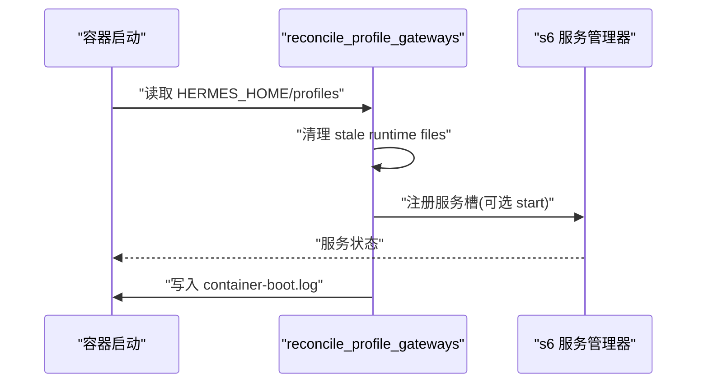
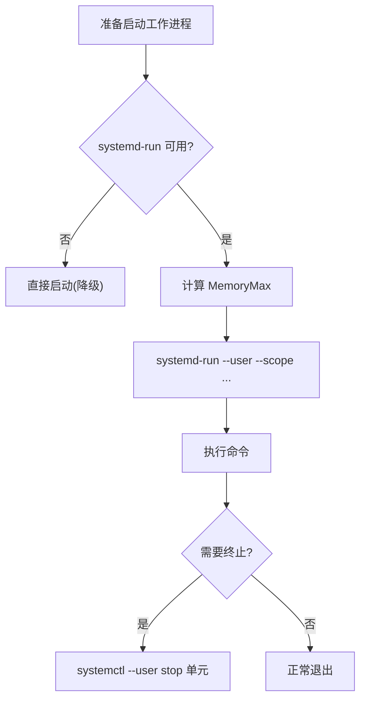
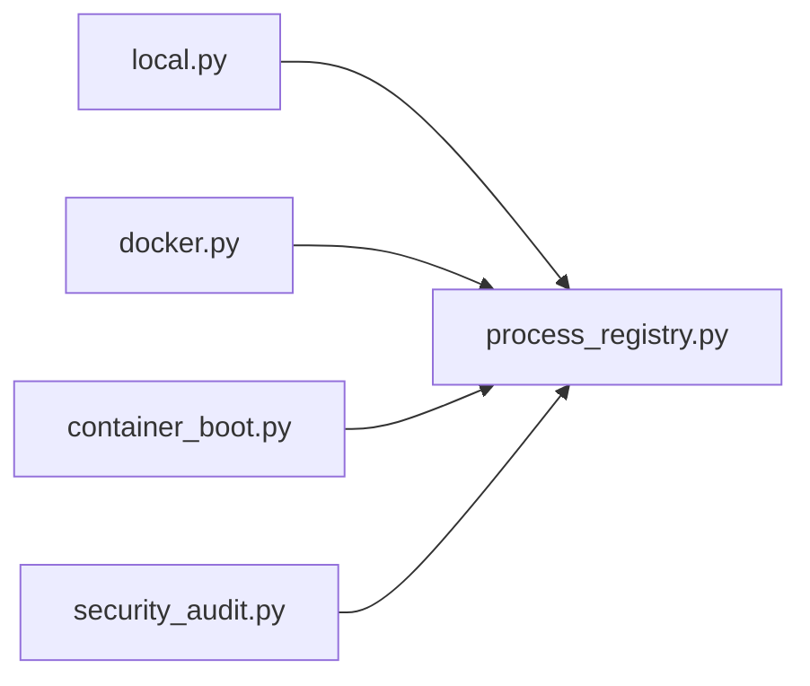

# 进程隔离

<cite>
**本文引用的文件**
- [tools/process_registry.py](file://tools/process_registry.py)
- [hermes_cli/container_boot.py](file://hermes_cli/container_boot.py)
- [tools/environments/docker.py](file://tools/environments/docker.py)
- [tools/environments/local.py](file://tools/environments/local.py)
- [hermes_cli/security_audit.py](file://hermes_cli/security_audit.py)
- [tests/tools/test_terminal_error_redaction.py](file://tests/tools/test_terminal_error_redaction.py)
</cite>

## 目录
1. [简介](#简介)
2. [项目结构](#项目结构)
3. [核心组件](#核心组件)
4. [架构总览](#架构总览)
5. [详细组件分析](#详细组件分析)
6. [依赖关系分析](#依赖关系分析)
7. [性能考量](#性能考量)
8. [故障排除指南](#故障排除指南)
9. [结论](#结论)
10. [附录](#附录)

## 简介
本文件系统性说明 Hermes Agent 的进程隔离实现，覆盖进程生命周期管理、资源限制与权限控制；解释进程注册表的工作原理（监控、状态跟踪、资源清理）；阐述容器化执行、沙箱环境与隔离策略；提供生产环境的安全基线与最佳实践，并包含逃逸防护与监控告警机制。

## 项目结构
Hermes 的进程隔离由“执行环境抽象 + 进程注册表 + 容器/系统级隔离”三部分构成：
- 执行环境抽象：通过 tools/environments/* 统一封装本地、Docker、Singularity、Modal、Daytona、SSH、Vercel 等后端，屏蔽差异并提供安全启动参数。
- 进程注册表：tools/process_registry.py 统一管理后台进程的生命周期、输出缓冲、通知与清理。
- 容器/系统级隔离：hermes_cli/container_boot.py 负责容器内服务编排与重启恢复；docker.py 提供强化的容器运行参数；local.py 对本地子进程进行路径与环境安全处理；security_audit.py 提供供应链安全检查能力。

**图示来源**
- [tools/process_registry.py:1-80](file://tools/process_registry.py#L1-L80)
- [hermes_cli/container_boot.py:1-80](file://hermes_cli/container_boot.py#L1-L80)
- [tools/environments/docker.py:1-50](file://tools/environments/docker.py#L1-L50)
- [tools/environments/local.py:1-50](file://tools/environments/local.py#L1-L50)
- [hermes_cli/security_audit.py:1-50](file://hermes_cli/security_audit.py#L1-L50)

**章节来源**
- [tools/process_registry.py:1-80](file://tools/process_registry.py#L1-L80)
- [hermes_cli/container_boot.py:1-80](file://hermes_cli/container_boot.py#L1-L80)
- [tools/environments/docker.py:1-50](file://tools/environments/docker.py#L1-L50)
- [tools/environments/local.py:1-50](file://tools/environments/local.py#L1-L50)
- [hermes_cli/security_audit.py:1-50](file://hermes_cli/security_audit.py#L1-L50)

## 核心组件
- 进程注册表 ProcessRegistry：维护运行中/已结束进程、输出缓冲、完成队列、watch 模式匹配、全局限流与清理策略。支持 systemd cgroup 隔离与内存上限，避免工作进程 OOM 影响网关主进程。
- 容器启动协调 container_boot：在容器启动时重建 s6 服务槽位，按持久化状态自动拉起网关服务，清理过期运行时文件，记录重启日志。
- Docker 执行环境 docker：以最小权限启动容器（drop caps、no-new-privileges），可配置 CPU/内存/磁盘限制，标签化进程归属，清理孤儿容器。
- 本地执行环境 local：安全解析工作目录、转义路径、过滤敏感环境变量，确保子进程在受限环境中运行。
- 安全审计 security_audit：扫描 venv、插件与 MCP 命令中的依赖版本，查询 OSV.dev 漏洞信息，辅助合规与加固。

**章节来源**
- [tools/process_registry.py:341-466](file://tools/process_registry.py#L341-L466)
- [hermes_cli/container_boot.py:95-211](file://hermes_cli/container_boot.py#L95-L211)
- [tools/environments/docker.py:1-50](file://tools/environments/docker.py#L1-L50)
- [tools/environments/local.py:155-198](file://tools/environments/local.py#L155-L198)
- [hermes_cli/security_audit.py:1-50](file://hermes_cli/security_audit.py#L1-L50)

## 架构总览
下图展示从工具调用到进程执行的隔离链路：工具层选择执行环境，注册表统一调度，底层通过容器或系统 cgroup 实现隔离与资源限制。

**图示来源**
- [tools/process_registry.py:394-466](file://tools/process_registry.py#L394-L466)
- [tools/environments/docker.py:148-200](file://tools/environments/docker.py#L148-L200)
- [tools/environments/local.py:155-198](file://tools/environments/local.py#L155-L198)

## 详细组件分析

### 进程注册表：生命周期、监控与清理
- 生命周期
  - spawn：创建进程/容器，记录 session、task_id、pid_scope、systemd_unit 等元数据。
  - poll/wait：轮询或阻塞等待完成，读取输出缓冲（滚动窗口）。
  - kill/terminate：终止进程树，必要时通过 systemd unit 停止整个 cgroup，防止僵尸进程。
- 监控与通知
  - watch_patterns：匹配输出行，触发 completion_queue 事件；具备会话级冷却与全局熔断，避免消息风暴。
  - notify_on_complete：进程结束时统一通知。
- 清理与恢复
  - finished TTL、LRU 裁剪、checkpoint 文件恢复（gateway 场景）。
  - PID 复用防护：比较内核启动时间，避免误杀回收的 PID。
  - 分离会话刷新：当原进程对象丢失时，基于宿主 PID 存活判断迁移至 finished。

**图示来源**
- [tools/process_registry.py:487-700](file://tools/process_registry.py#L487-L700)
- [tools/process_registry.py:723-764](file://tools/process_registry.py#L723-L764)

**章节来源**
- [tools/process_registry.py:341-466](file://tools/process_registry.py#L341-L466)
- [tools/process_registry.py:487-700](file://tools/process_registry.py#L487-L700)
- [tools/process_registry.py:723-764](file://tools/process_registry.py#L723-L764)

### 容器化执行与沙箱：Docker 环境
- 安全启动
  - 默认 drop 所有能力、禁止提升权限、限制 PID 数。
  - 环境变量白名单校验与规范化，仅允许合法键名与字符串值。
- 资源限制
  - 可配置 CPU、内存、磁盘限额；标签 hermes-agent/hermes-profile 用于归属与清理。
- 清理与健壮性
  - 定期回收孤儿容器（exited、超过最大年龄、按 profile 过滤）。
  - 失败提示与诊断信息增强。

**图示来源**
- [tools/environments/docker.py:1-50](file://tools/environments/docker.py#L1-L50)
- [tools/environments/docker.py:148-200](file://tools/environments/docker.py#L148-L200)
- [tools/process_registry.py:394-466](file://tools/process_registry.py#L394-L466)

**章节来源**
- [tools/environments/docker.py:1-50](file://tools/environments/docker.py#L1-L50)
- [tools/environments/docker.py:148-200](file://tools/environments/docker.py#L148-L200)

### 本地进程隔离与安全：路径、环境与权限
- 工作目录安全
  - 解析并回退到可用目录，避免不可访问路径导致子进程启动失败。
  - Windows MSYS/Cygwin/WSL 路径转换，保证 bash/cd 正确解析。
- 环境变量与权限
  - 过滤内部敏感变量，避免泄露到子进程。
  - 使用隐藏标志减少 Windows 下不必要的窗口弹出。
- 与注册表协作
  - 本地进程通过注册表统一追踪，支持超时、中断与清理。

**图示来源**
- [tools/environments/local.py:155-198](file://tools/environments/local.py#L155-L198)
- [tools/process_registry.py:394-466](file://tools/process_registry.py#L394-L466)

**章节来源**
- [tools/environments/local.py:155-198](file://tools/environments/local.py#L155-L198)
- [tools/process_registry.py:394-466](file://tools/process_registry.py#L394-L466)

### 容器内服务编排与重启恢复
- 启动阶段
  - 扫描持久化 profiles，重建 s6 服务槽位，按 desired_state 决定是否自动启动。
  - 清理过时运行时文件（如 gateway.pid、processes.json），避免 PID 混淆。
- 日志与可观测性
  - 记录每次 reconcile 动作（profile、prior_state、action、prior_exit），便于排障。
- 角色识别
  - 根据容器 argv 识别 dashboard/gateway 角色，避免重复协调造成锁竞争。

**图示来源**
- [hermes_cli/container_boot.py:95-211](file://hermes_cli/container_boot.py#L95-L211)
- [hermes_cli/container_boot.py:413-530](file://hermes_cli/container_boot.py#L413-L530)
- [hermes_cli/container_boot.py:533-580](file://hermes_cli/container_boot.py#L533-L580)

**章节来源**
- [hermes_cli/container_boot.py:95-211](file://hermes_cli/container_boot.py#L95-L211)
- [hermes_cli/container_boot.py:413-530](file://hermes_cli/container_boot.py#L413-L530)
- [hermes_cli/container_boot.py:533-580](file://hermes_cli/container_boot.py#L533-L580)

### 系统级隔离与资源限制：systemd cgroup
- 目标
  - 将工作进程放入独立 transient cgroup，避免 OOM 波及网关主进程。
- 机制
  - 探测 systemd-run --user --scope 可用性并缓存结果。
  - 计算 per-worker 内存上限（考虑环境变量、cgroup 当前限制、物理内存比例与硬上限）。
  - 构造 systemd-run 参数（MemoryMax、OOMPolicy=kill），并以 collect 模式自动清理。
- 终止
  - 通过 systemctl --user stop 单元名停止整个 cgroup，捕获双 fork 后的后代进程。

**图示来源**
- [tools/process_registry.py:83-167](file://tools/process_registry.py#L83-L167)
- [tools/process_registry.py:170-284](file://tools/process_registry.py#L170-L284)
- [tools/process_registry.py:287-327](file://tools/process_registry.py#L287-L327)

**章节来源**
- [tools/process_registry.py:83-167](file://tools/process_registry.py#L83-L167)
- [tools/process_registry.py:170-284](file://tools/process_registry.py#L170-L284)
- [tools/process_registry.py:287-327](file://tools/process_registry.py#L287-L327)

### 安全审计与合规
- 扫描范围
  - venv 依赖、插件 requirements/pyproject、MCP 命令中的包版本。
- 漏洞查询
  - 批量查询 OSV.dev，聚合发现项，支持严重级别阈值。
- 用途
  - 作为生产前检查与持续合规的一部分，配合隔离策略降低供应链风险。

**章节来源**
- [hermes_cli/security_audit.py:1-50](file://hermes_cli/security_audit.py#L1-L50)
- [hermes_cli/security_audit.py:84-200](file://hermes_cli/security_audit.py#L84-L200)

## 依赖关系分析
- 组件耦合
  - 执行环境模块向注册表暴露 spawn/execute，注册表负责统一生命周期与清理。
  - 容器启动协调与注册表解耦，但共享进程/服务命名空间与持久化状态。
- 外部依赖
  - Docker CLI、systemd-run/systemctl、psutil、OSV.dev API。
- 潜在循环依赖
  - 各模块通过明确接口交互，未见循环导入迹象。

**图示来源**
- [tools/environments/local.py:155-198](file://tools/environments/local.py#L155-L198)
- [tools/environments/docker.py:148-200](file://tools/environments/docker.py#L148-L200)
- [hermes_cli/container_boot.py:95-211](file://hermes_cli/container_boot.py#L95-L211)
- [hermes_cli/security_audit.py:1-50](file://hermes_cli/security_audit.py#L1-L50)
- [tools/process_registry.py:394-466](file://tools/process_registry.py#L394-L466)

**章节来源**
- [tools/process_registry.py:394-466](file://tools/process_registry.py#L394-L466)
- [tools/environments/docker.py:148-200](file://tools/environments/docker.py#L148-L200)
- [tools/environments/local.py:155-198](file://tools/environments/local.py#L155-L198)
- [hermes_cli/container_boot.py:95-211](file://hermes_cli/container_boot.py#L95-L211)
- [hermes_cli/security_audit.py:1-50](file://hermes_cli/security_audit.py#L1-L50)

## 性能考量
- 输出缓冲与滚动窗口：限制输出大小，避免内存膨胀。
- 通知限流：会话级冷却与全局熔断，抑制高频 watch 匹配导致的告警风暴。
- systemd cgroup 隔离：避免工作进程 OOM 拖垮网关，提高整体稳定性。
- 孤儿清理：周期性回收未使用的容器，释放资源。

[本节为通用指导，不直接分析具体文件]

## 故障排除指南
- 常见症状与定位
  - 进程未退出或残留：检查注册表的 finished 集合与 checkpoint 恢复逻辑；确认 systemd unit 是否正确停止。
  - 容器泄漏：使用孤儿回收函数清理 exited 且超时的容器；核对 profile 标签。
  - 输出过多告警：查看 watch 限流与全局熔断状态，必要时调整间隔或禁用 watch。
  - 本地路径错误：确认 cwd 可访问性与路径转换逻辑；避免 root 目录泄漏到非 root 进程。
- 建议步骤
  - 查看 container-boot.log 了解服务启动/恢复情况。
  - 使用系统工具（systemctl --user status/journalctl）检查 cgroup 与日志。
  - 运行安全审计，排查依赖漏洞。

**章节来源**
- [tools/process_registry.py:487-700](file://tools/process_registry.py#L487-L700)
- [tools/environments/docker.py:148-200](file://tools/environments/docker.py#L148-L200)
- [hermes_cli/container_boot.py:533-580](file://hermes_cli/container_boot.py#L533-L580)
- [tests/tools/test_terminal_error_redaction.py:1-154](file://tests/tools/test_terminal_error_redaction.py#L1-L154)

## 结论
Hermes Agent 通过统一的执行环境抽象、健壮的进程注册表以及容器/系统级隔离，实现了可靠的进程隔离与资源管控。结合安全审计与完善的清理机制，可在生产环境中提供高可用的沙箱执行能力。建议在生产部署中启用容器化执行、开启 systemd cgroup 隔离、配置合理的资源限制与通知限流，并定期进行安全审计与资源清理。

[本节为总结，不直接分析具体文件]

## 附录
- 生产安全基线建议
  - 强制使用容器化执行（Docker/Singularity/Modal/Daytona），关闭不必要的能力与网络访问。
  - 启用 systemd cgroup 隔离与内存上限，避免 OOM 扩散。
  - 配置 watch 通知限流与全局熔断，防止告警风暴。
  - 定期运行安全审计，修复高危漏洞。
  - 保留并审查 container-boot.log 与进程 checkpoint，便于回溯。
- 参考用例
  - 终端命令在容器中执行并受资源限制：见测试中对 docker_image 等配置的引用。
  - 错误输出脱敏：确保敏感信息不会泄露到结果中。

**章节来源**
- [tests/tools/test_terminal_error_redaction.py:13-38](file://tests/tools/test_terminal_error_redaction.py#L13-L38)
- [tests/tools/test_terminal_error_redaction.py:47-154](file://tests/tools/test_terminal_error_redaction.py#L47-L154)