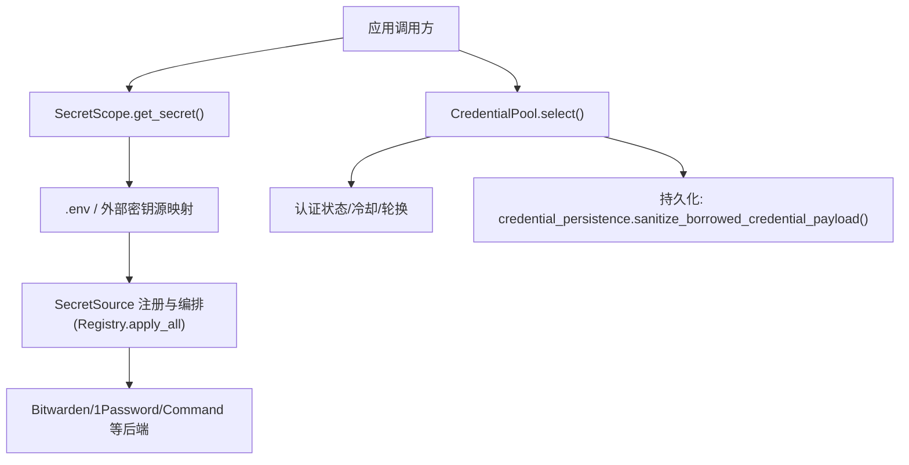
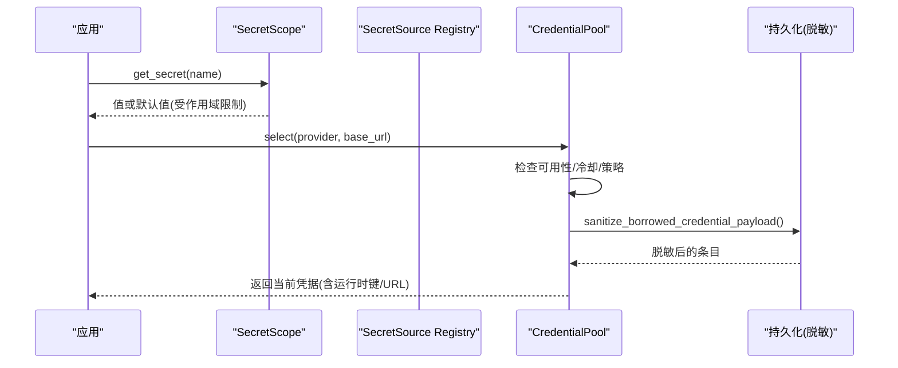
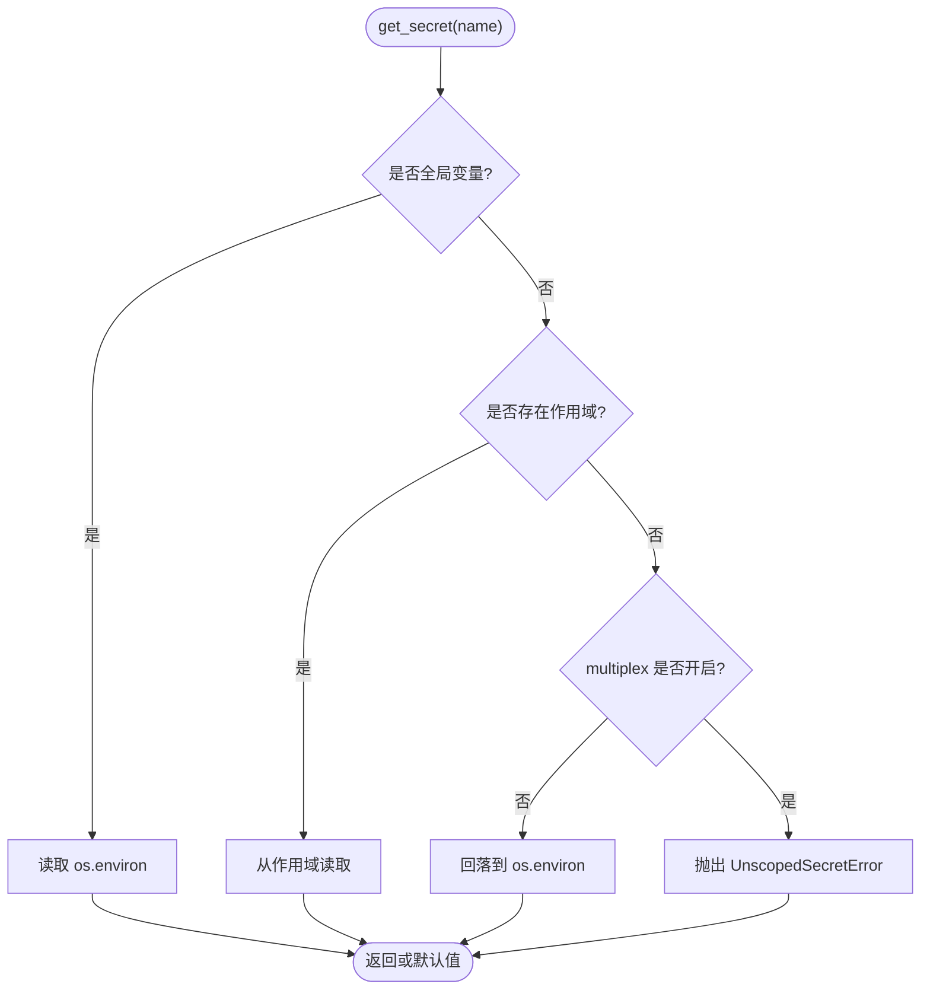
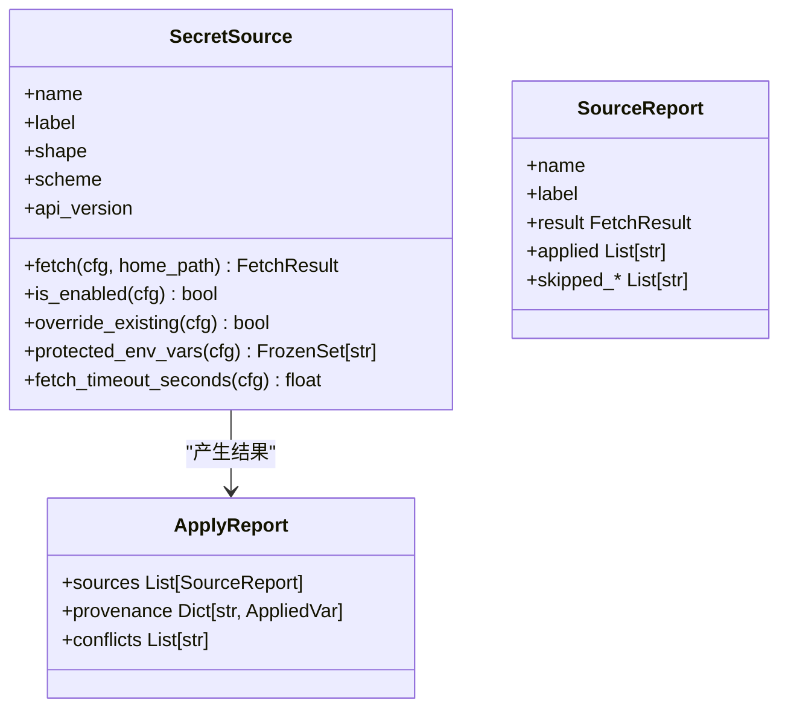
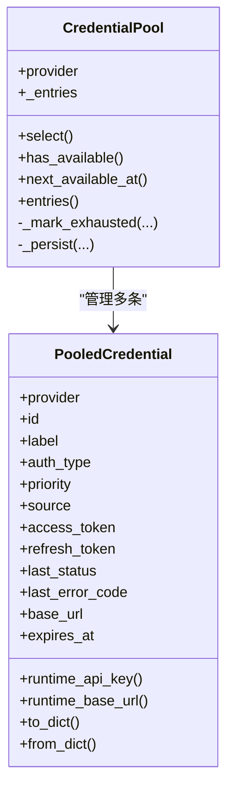
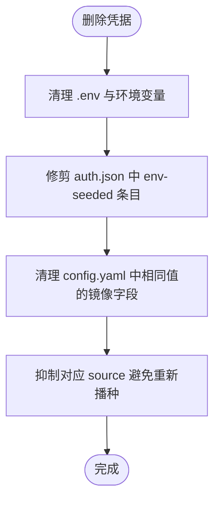
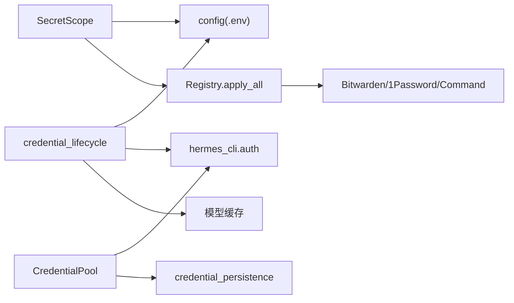

# 凭据管理

<cite>
**本文引用的文件**
- [agent/credential_pool.py](file://agent/credential_pool.py)
- [agent/secret_scope.py](file://agent/secret_scope.py)
- [agent/credential_sources.py](file://agent/credential_sources.py)
- [agent/credential_persistence.py](file://agent/credential_persistence.py)
- [agent/secret_sources/base.py](file://agent/secret_sources/base.py)
- [agent/secret_sources/registry.py](file://agent/secret_sources/registry.py)
- [hermes_cli/credential_lifecycle.py](file://hermes_cli/credential_lifecycle.py)
- [hermes_cli/secrets_cli.py](file://hermes_cli/secrets_cli.py)
</cite>

## 目录
1. [简介](#简介)
2. [项目结构](#项目结构)
3. [核心组件](#核心组件)
4. [架构总览](#架构总览)
5. [详细组件分析](#详细组件分析)
6. [依赖关系分析](#依赖关系分析)
7. [性能考量](#性能考量)
8. [故障排查指南](#故障排查指南)
9. [结论](#结论)
10. [附录](#附录)

## 简介
本文件系统性说明 Hermes Agent 的凭据管理机制，覆盖 API 密钥、访问令牌等敏感凭据的存储、注入、隔离、轮换与生命周期管理。重点包括：
- 多来源凭据的统一装配（环境变量、配置文件、外部密钥管理服务）
- 进程内作用域隔离（多 Profile 复用同一进程时的凭据隔离）
- 凭据池与失败回退（同提供商多凭据、冷却与死锁处理）
- 持久化安全策略（磁盘边界脱敏、指纹保留）
- 动态获取与轮换（启动时拉取、运行时刷新、CLI 工具辅助）
- 验证流程、泄露检测与应急响应
- 编码规范与测试策略建议

## 项目结构
凭据相关代码主要分布在以下模块：
- agent/secret_scope.py：按 Profile 的作用域解析凭据，避免跨 Profile 泄漏
- agent/secret_sources/*：统一的外部密钥源抽象与注册编排（Bitwarden、1Password、命令源等）
- agent/credential_pool.py：同提供商凭据池、选择策略、冷却与失效处理
- agent/credential_sources.py：各来源的移除策略与抑制机制
- agent/credential_persistence.py：写入 auth.json 前的脱敏与指纹计算
- hermes_cli/credential_lifecycle.py：跨 .env、auth.json、config.yaml 的凭据一致性维护
- hermes_cli/secrets_cli.py：外部密钥源（如 Bitwarden）的 CLI 配置、校验与同步

图表来源
- [agent/secret_scope.py:132-186](file://agent/secret_scope.py#L132-L186)
- [agent/credential_pool.py:633-768](file://agent/credential_pool.py#L633-L768)
- [agent/credential_persistence.py:151-175](file://agent/credential_persistence.py#L151-L175)
- [agent/secret_sources/registry.py:333-471](file://agent/secret_sources/registry.py#L333-L471)

章节来源
- [agent/secret_scope.py:1-294](file://agent/secret_scope.py#L1-L294)
- [agent/secret_sources/registry.py:1-471](file://agent/secret_sources/registry.py#L1-L471)
- [agent/credential_pool.py:1-800](file://agent/credential_pool.py#L1-L800)
- [agent/credential_persistence.py:1-175](file://agent/credential_persistence.py#L1-L175)

## 核心组件
- 凭据作用域 SecretScope：提供 per-task 的凭据映射，支持“失败关闭”模式，防止多 Profile 下凭据泄漏；同时定义全局环境变量白名单，确保部署级配置不受影响。
- 外部密钥源 SecretSource + Registry：统一的 fetch 契约、超时控制、优先级与冲突告警、来源溯源；支持 mapped/bulk 两种注入形状。
- 凭据池 CredentialPool：同提供商的多凭据池，支持多种选择策略、冷却时间、永久失效标记、并发租约与日志节流。
- 凭据持久化 credential_persistence：对非自有来源的凭据进行磁盘边界脱敏，仅保留不可逆指纹与元数据。
- 凭据生命周期 credential_lifecycle：在 .env、auth.json、config.yaml 三处保持一致性，避免删除/更新后残留导致的行为不一致。
- 凭据移除策略 credential_sources：为每种来源提供一致的清理与抑制逻辑，保证“删除即生效”。

章节来源
- [agent/secret_scope.py:1-294](file://agent/secret_scope.py#L1-L294)
- [agent/secret_sources/base.py:1-337](file://agent/secret_sources/base.py#L1-L337)
- [agent/secret_sources/registry.py:1-471](file://agent/secret_sources/registry.py#L1-L471)
- [agent/credential_pool.py:1-800](file://agent/credential_pool.py#L1-L800)
- [agent/credential_persistence.py:1-175](file://agent/credential_persistence.py#L1-L175)
- [hermes_cli/credential_lifecycle.py:1-273](file://hermes_cli/credential_lifecycle.py#L1-L273)
- [agent/credential_sources.py:1-444](file://agent/credential_sources.py#L1-L444)

## 架构总览
Hermes 的凭据体系由“读取路径”和“写入路径”组成：
- 读取路径：SecretScope 负责按任务上下文解析环境变量；SecretSource 在进程启动时从外部密钥源拉取并注入；CredentialPool 在运行时根据提供商选择可用凭据，处理失败与冷却。
- 写入路径：CLI 或界面通过 credential_lifecycle 统一更新 .env/config/auth.json；对外部密钥源的访问通过 secrets_cli 完成配置与同步。

图表来源
- [agent/secret_scope.py:132-186](file://agent/secret_scope.py#L132-L186)
- [agent/secret_sources/registry.py:333-471](file://agent/secret_sources/registry.py#L333-L471)
- [agent/credential_pool.py:633-768](file://agent/credential_pool.py#L633-L768)
- [agent/credential_persistence.py:151-175](file://agent/credential_persistence.py#L151-L175)

## 详细组件分析

### 凭据作用域 SecretScope
- 设计目标：在多 Profile 复用进程时，将每个 Profile 的凭据以 contextvar 形式注入到当前任务，禁止未显式设置作用域的读取回落到进程全局环境，从而避免跨 Profile 泄漏。
- 关键行为：
  - set_secret_scope/reset_secret_scope：安装/恢复当前任务的凭据映射
  - get_secret：按优先级解析（全局变量白名单 → 作用域 → 进程环境），在 multiplex 模式下未设置作用域直接抛出异常
  - build_profile_secret_scope：从 <home>/.env 与外部密钥源构建 Profile 专属映射，排除全局变量
- 安全要点：
  - 全局环境变量白名单严格限定，避免误把凭据当作全局配置
  - 解析 .env 时不污染进程环境，仅产出映射供作用域使用

图表来源
- [agent/secret_scope.py:132-186](file://agent/secret_scope.py#L132-L186)

章节来源
- [agent/secret_scope.py:1-294](file://agent/secret_scope.py#L1-L294)

### 外部密钥源 SecretSource 与注册编排
- 契约：
  - SecretSource.fetch(cfg, home_path) 必须同步、无阻塞、不提示，错误以 FetchResult.error/error_kind 返回
  - 支持 override_existing、protected_env_vars、fetch_timeout_seconds 等钩子
- 编排规则：
  - 优先级：mapped > bulk；先注册/配置的优先；first-wins 原则，冲突会记录警告
  - 超时保护：每个 source.fetch 有独立线程+超时，超时则报告 TIME_OUT
  - 来源溯源：ApplyReport.provenance 记录每个变量的来源与是否覆盖已有值
- 内置源：Bitwarden、1Password、Command（按需懒加载）

图表来源
- [agent/secret_sources/base.py:127-250](file://agent/secret_sources/base.py#L127-L250)
- [agent/secret_sources/registry.py:55-86](file://agent/secret_sources/registry.py#L55-L86)

章节来源
- [agent/secret_sources/base.py:1-337](file://agent/secret_sources/base.py#L1-L337)
- [agent/secret_sources/registry.py:1-471](file://agent/secret_sources/registry.py#L1-L471)

### 凭据池 CredentialPool
- 功能：
  - 维护同一提供商的多条凭据，支持 fill_first、round_robin、random、least_used 等策略
  - 基于 HTTP 状态码与错误语义计算冷却时间（401/429/402/5xx），区分临时与计费类耗尽
  - 识别“终端失败”（如 token_invalidated、token_revoked、invalid_grant 等）并标记 DEAD，不再自动恢复
  - 并发租约与日志节流，避免热点路径下的日志风暴
- 数据模型：PooledCredential 包含 provider、id、label、access_token、refresh_token、expires_at、base_url、agent_key 等字段，并提供 to_dict/from_dict 序列化与运行时键选择
- 持久化：写入前通过 credential_persistence.sanitize_borrowed_credential_payload 对非自有来源的凭据进行脱敏，仅保留指纹与元数据

图表来源
- [agent/credential_pool.py:185-290](file://agent/credential_pool.py#L185-L290)
- [agent/credential_pool.py:633-768](file://agent/credential_pool.py#L633-L768)

章节来源
- [agent/credential_pool.py:1-800](file://agent/credential_pool.py#L1-L800)
- [agent/credential_persistence.py:1-175](file://agent/credential_persistence.py#L1-L175)

### 凭据移除策略与一致性
- 目标：确保“删除凭据”在所有来源中稳定生效，不会因下次重新装载而复活
- 机制：
  - 针对 env:<VAR>、claude_code、hermes_pkce、device_code、qwen-cli、copilot gh_cli、custom_config 等来源分别实现 RemovalStep
  - 清理外部可观测状态（如删除 OAuth 文件或 .env 行），并抑制对应 source 以避免重新播种
  - 对于第三方工具拥有的文件（如 Claude Code、Qwen CLI），只抑制不删除，保持第三方工具可用
- 生命周期协调：
  - save_provider_env_credential/remove_provider_env_credential 在 .env、auth.json、config.yaml 三处保持一致性
  - 删除时清除 pool 中的 env-seeded 条目、模型缓存行，并清理 config.yaml 中相同值的镜像字段

图表来源
- [hermes_cli/credential_lifecycle.py:213-273](file://hermes_cli/credential_lifecycle.py#L213-L273)
- [agent/credential_sources.py:143-444](file://agent/credential_sources.py#L143-L444)

章节来源
- [hermes_cli/credential_lifecycle.py:1-273](file://hermes_cli/credential_lifecycle.py#L1-L273)
- [agent/credential_sources.py:1-444](file://agent/credential_sources.py#L1-L444)

### 外部密钥源 CLI（以 Bitwarden 为例）
- 能力：
  - setup：交互式安装 bws、保存访问令牌、选择项目、测试拉取
  - status：查看集成状态、二进制版本、令牌有效性
  - token：旋转访问令牌（可选校验）
  - sync：立即拉取并展示变更（dry-run 或 apply）
  - disable/install：禁用或安装二进制
- 安全实践：
  - 子进程调用最小化环境变量，屏蔽 ANSI 转义
  - 令牌输入使用掩码提示，避免明文回显
  - 校验失败不保存新令牌，降低误操作风险

章节来源
- [hermes_cli/secrets_cli.py:1-746](file://hermes_cli/secrets_cli.py#L1-L746)

## 依赖关系分析
- SecretScope 依赖 hermes_cli.config 的 .env 解析器，以及外部密钥源的值（通过 registry.apply_all 的结果）
- SecretSource Registry 依赖具体后端实现（Bitwarden、1Password、Command），并通过统一接口编排
- CredentialPool 依赖 hermes_cli.auth 的读写与提供者状态，以及 credential_persistence 的脱敏策略
- 生命周期模块依赖 config、auth store、模型缓存，确保三处一致

图表来源
- [agent/secret_scope.py:226-294](file://agent/secret_scope.py#L226-L294)
- [agent/secret_sources/registry.py:156-187](file://agent/secret_sources/registry.py#L156-L187)
- [agent/credential_pool.py:17-43](file://agent/credential_pool.py#L17-L43)
- [hermes_cli/credential_lifecycle.py:110-175](file://hermes_cli/credential_lifecycle.py#L110-L175)

章节来源
- [agent/secret_scope.py:1-294](file://agent/secret_scope.py#L1-L294)
- [agent/secret_sources/registry.py:1-471](file://agent/secret_sources/registry.py#L1-L471)
- [agent/credential_pool.py:1-800](file://agent/credential_pool.py#L1-L800)
- [hermes_cli/credential_lifecycle.py:1-273](file://hermes_cli/credential_lifecycle.py#L1-L273)

## 性能考量
- 凭据池选择路径为热路径，需避免重复 I/O 与日志风暴：
  - 使用 RLock 保护并发安全，避免竞争
  - “无可用条目”日志节流，防止共享日志锁争用导致事件循环卡顿
  - 冷却时间依据错误语义与唯一凭据场景动态缩短，提高恢复速度
- 外部密钥源 fetch 带超时保护，避免启动阻塞
- 配置读取采用只读副本与缓存策略，减少深拷贝开销

## 故障排查指南
- 常见问题定位：
  - 多 Profile 下凭据泄漏：确认是否在 multiplex 模式下正确设置 secret scope；若 get_secret 在无作用域时抛出异常，说明调用点未包裹 set_secret_scope
  - 凭据删除后仍出现：检查是否遗漏抑制对应 source；确认 auth.json 中已修剪 env-seeded 条目，config.yaml 镜像字段已清理
  - 外部密钥源拉取失败：查看 secrets status 输出与错误类型（AUTH_FAILED/TIMEOUT/NETWORK），按 remediation 指引修复
  - 凭据池持续耗尽：关注 last_error_code/failure_reason，判断是否为计费限制或终端失败；必要时手动 re-auth
- 日志与诊断：
  - 启用 HERMES_REDACT_SECRETS 以在输出中遮蔽敏感信息
  - 使用 hermes secrets bitwarden sync --apply 进行 dry-run 与实际导出对比
  - 检查 next_available_at 与 has_available 返回值，评估恢复时间

章节来源
- [agent/secret_scope.py:132-186](file://agent/secret_scope.py#L132-L186)
- [hermes_cli/secrets_cli.py:310-366](file://hermes_cli/secrets_cli.py#L310-L366)
- [agent/credential_pool.py:310-435](file://agent/credential_pool.py#L310-L435)

## 结论
Hermes 的凭据管理体系通过“作用域隔离 + 外部密钥源编排 + 凭据池智能调度 + 持久化脱敏 + 生命周期一致性”形成闭环，既满足多环境、多 Profile 的安全隔离需求，又提供了灵活的动态获取与轮换能力。配合 CLI 工具与严格的错误分类与冷却策略，能够在生产环境中稳健运行。

## 附录

### 安全配置指南与最佳实践
- 使用 SecretScope 包裹所有凭据读取路径，尤其在 multiplex 模式下
- 优先通过外部密钥源（Bitwarden/1Password/Command）注入，避免硬编码或明文存储
- 定期执行 hermes secrets bitwarden status/token/sync，确保令牌有效且最新
- 删除凭据时使用统一入口（credential_lifecycle），确保三处一致
- 启用 HERMES_REDACT_SECRETS，并在日志与错误输出中避免打印原始凭据

### 凭据泄露检测与应急响应
- 检测：
  - 扫描日志与错误输出中的凭据片段（可通过测试用例思路断言 "***" 替换）
  - 监控外部密钥源状态与令牌有效期
  - 审计 auth.json 中非自有来源的凭据是否被脱敏
- 响应：
  - 立即轮换受影响令牌（secrets_cli token）
  - 撤销旧令牌并更新 .env/config/auth.json
  - 审查调用点是否正确使用 SecretScope 与凭据池
  - 补充测试用例，覆盖错误路径的脱敏与抑制逻辑

### 编码规范与测试策略
- 编码规范：
  - 所有凭据读取走 SecretScope.get_secret，禁止直接 os.getenv
  - 新增外部密钥源需实现 SecretSource.fetch，遵循契约与超时约束
  - 凭据池选择与冷却逻辑不得绕过，避免破坏失败回退
  - 对外部工具文件（Claude/Qwen/Codex）只抑制不删除，尊重第三方所有权
- 测试策略：
  - 覆盖 multiplex 模式下的作用域隔离与未设置作用域的失败关闭
  - 验证外部密钥源超时、网络失败、认证失败的错误分类与提示
  - 校验凭据池在不同错误码下的冷却时间与 DEAD 标记
  - 验证删除凭据后，pool、config.yaml、.env 的一致性
  - 使用 mock 与 fixture 模拟外部密钥源与 auth store，确保幂等与可重复