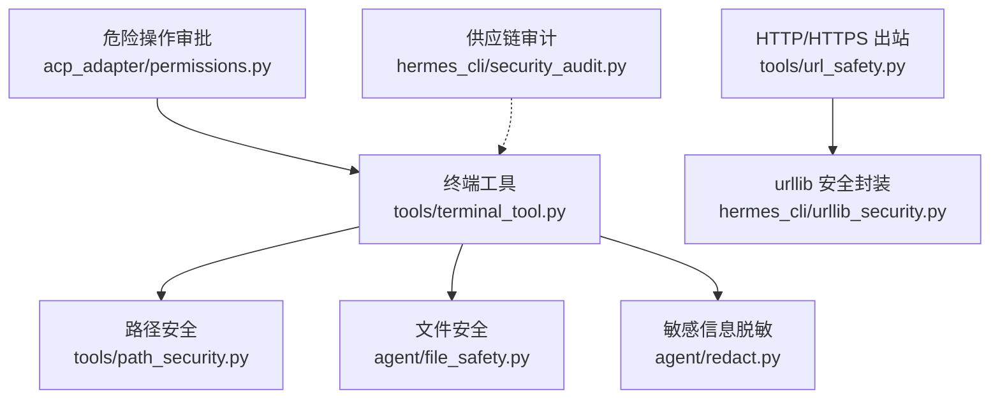
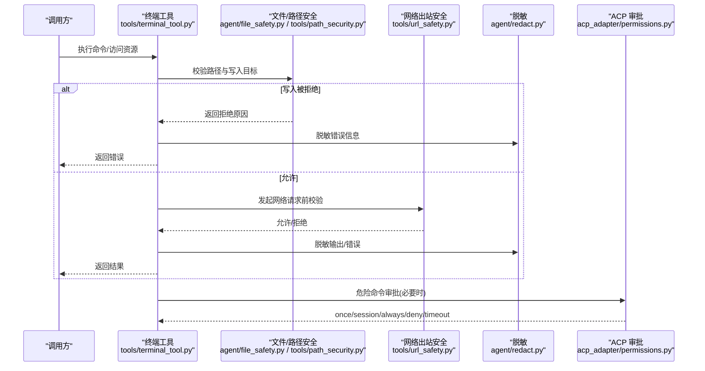
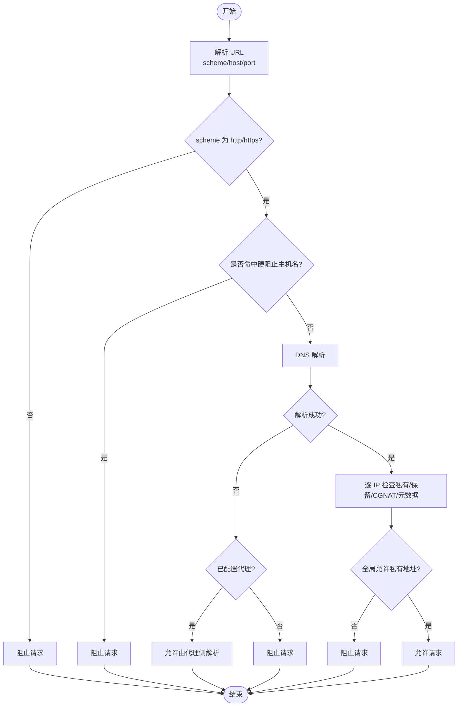
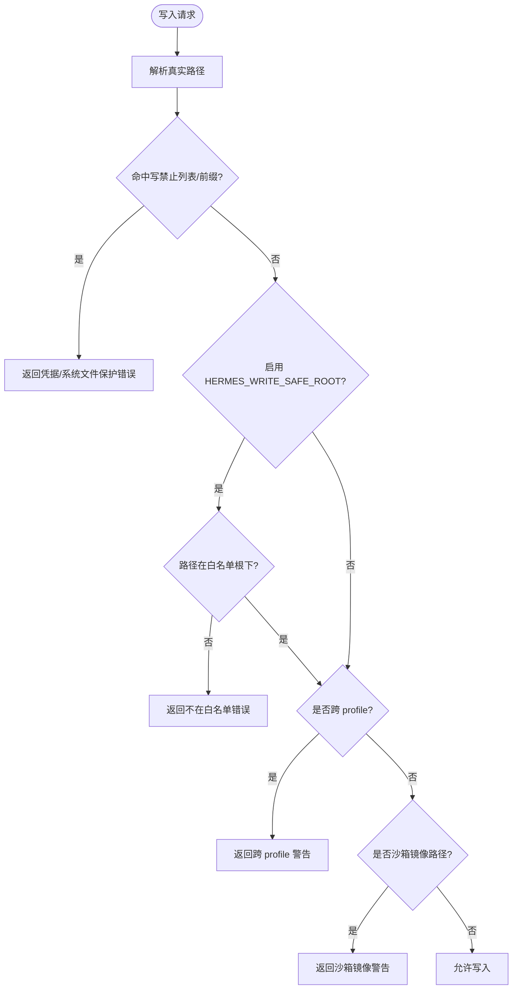
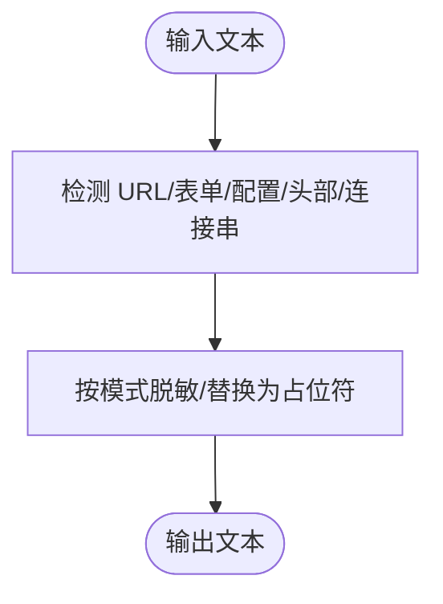
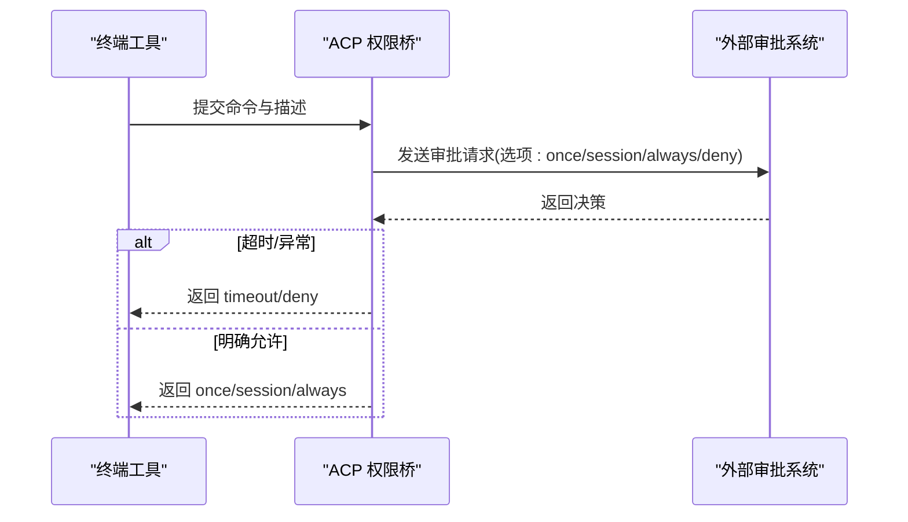
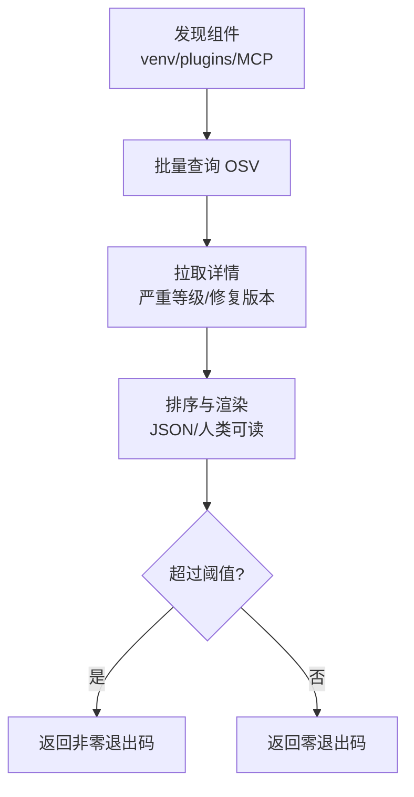
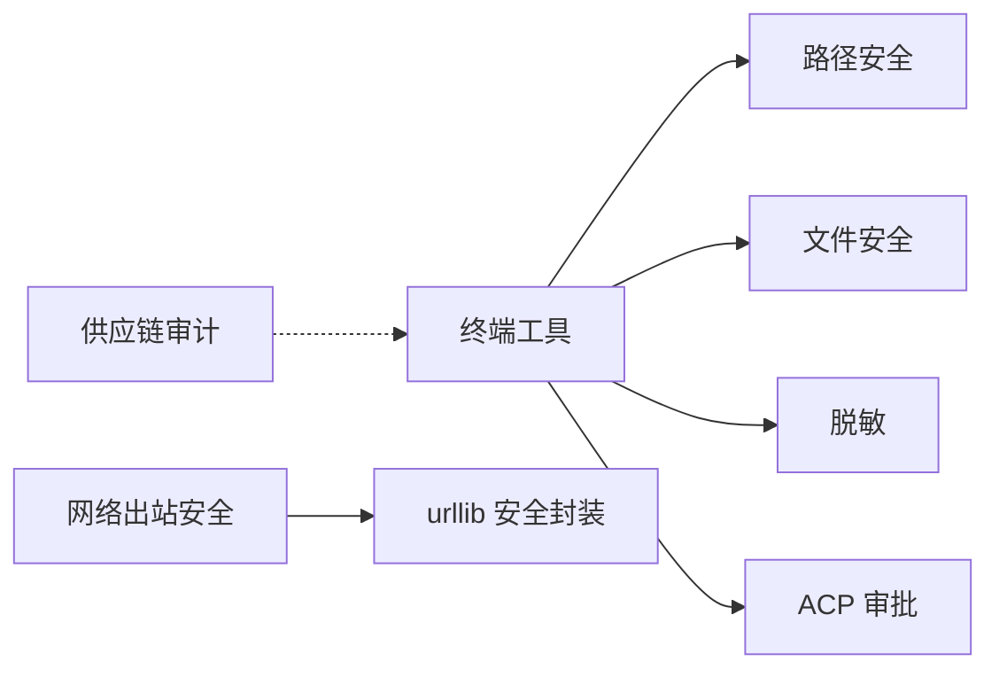

# 安全配置

<cite>
**本文引用的文件**
- [tools/url_safety.py](file://tools/url_safety.py)
- [tools/path_security.py](file://tools/path_security.py)
- [agent/file_safety.py](file://agent/file_safety.py)
- [hermes_cli/urllib_security.py](file://hermes_cli/urllib_security.py)
- [agent/redact.py](file://agent/redact.py)
- [tools/terminal_tool.py](file://tools/terminal_tool.py)
- [acp_adapter/permissions.py](file://acp_adapter/permissions.py)
- [hermes_cli/security_audit.py](file://hermes_cli/security_audit.py)
</cite>

## 目录
1. [简介](#简介)
2. [项目结构](#项目结构)
3. [核心组件](#核心组件)
4. [架构总览](#架构总览)
5. [详细组件分析](#详细组件分析)
6. [依赖关系分析](#依赖关系分析)
7. [性能考量](#性能考量)
8. [故障排除指南](#故障排除指南)
9. [结论](#结论)
10. [附录](#附录)

## 简介
本文件面向管理员与平台运维人员，系统化说明 Hermes Agent 的安全配置、权限控制与访问策略。内容覆盖：
- 安全级别设置、输入验证规则与输出过滤
- 路径安全、命令执行限制与资源访问控制
- 安全策略模板、默认安全设置与自定义安全规则
- 安全配置最佳实践与合规性检查方法
- 安全配置验证工具与故障排除指南
- 安全配置审核与监控方案

## 项目结构
围绕“网络出站安全”“文件系统读写安全”“敏感信息脱敏”“危险操作审批”“供应链漏洞审计”五大主题组织代码：
- 网络出站安全：URL 安全校验、SSRF 防护、重定向头清理
- 文件系统安全：写保护白名单/黑名单、跨 profile 写入软保护、沙箱镜像写入警告
- 敏感信息脱敏：日志与工具输出中的密钥、令牌、连接串等自动脱敏
- 危险操作审批：ACP 权限桥接，支持一次性/会话级/永久允许或拒绝
- 供应链审计：对 venv、插件、MCP 服务器进行 OSV 漏洞扫描

图表来源
- [tools/terminal_tool.py:1-200](file://tools/terminal_tool.py#L1-L200)
- [tools/path_security.py:1-44](file://tools/path_security.py#L1-L44)
- [agent/file_safety.py:1-200](file://agent/file_safety.py#L1-L200)
- [agent/redact.py:1-120](file://agent/redact.py#L1-L120)
- [tools/url_safety.py:1-120](file://tools/url_safety.py#L1-L120)
- [hermes_cli/urllib_security.py:1-140](file://hermes_cli/urllib_security.py#L1-L140)
- [acp_adapter/permissions.py:1-183](file://acp_adapter/permissions.py#L1-L183)
- [hermes_cli/security_audit.py:1-120](file://hermes_cli/security_audit.py#L1-L120)

章节来源
- [tools/terminal_tool.py:1-200](file://tools/terminal_tool.py#L1-L200)
- [tools/url_safety.py:1-120](file://tools/url_safety.py#L1-L120)
- [agent/file_safety.py:1-200](file://agent/file_safety.py#L1-L200)
- [agent/redact.py:1-120](file://agent/redact.py#L1-L120)
- [hermes_cli/urllib_security.py:1-140](file://hermes_cli/urllib_security.py#L1-L140)
- [acp_adapter/permissions.py:1-183](file://acp_adapter/permissions.py#L1-L183)
- [hermes_cli/security_audit.py:1-120](file://hermes_cli/security_audit.py#L1-L120)

## 核心组件
- URL 安全与 SSRF 防护：统一校验目标主机与 IP，阻断私有/内部地址与云元数据端点；提供同步/异步安全传输包装器，在 TCP 连接时再次校验，避免 DNS 重绑定。
- 路径安全：校验解析后的路径是否位于允许根目录下，检测“..”穿越。
- 文件安全：定义写禁止列表与白名单根目录，拦截敏感文件/目录写入；读取拦截 Hermes 内部缓存与凭据存储；跨 profile 与沙箱镜像写入软保护提示。
- 敏感信息脱敏：对日志、错误、工具输出进行多模式匹配（API Key、JWT、数据库连接串、Authorization 头等）并脱敏；支持强制模式与上下文开关。
- 危险操作审批：通过 ACP 将危险命令提交给外部系统审批，支持一次性/会话/永久允许或拒绝，超时自动拒绝。
- 供应链审计：扫描 venv、插件与 MCP 服务器中可识别的包版本，批量查询 OSV 并汇总严重等级与修复版本。

章节来源
- [tools/url_safety.py:1-120](file://tools/url_safety.py#L1-L120)
- [tools/path_security.py:1-44](file://tools/path_security.py#L1-L44)
- [agent/file_safety.py:1-200](file://agent/file_safety.py#L1-L200)
- [agent/redact.py:1-120](file://agent/redact.py#L1-L120)
- [acp_adapter/permissions.py:1-183](file://acp_adapter/permissions.py#L1-L183)
- [hermes_cli/security_audit.py:1-120](file://hermes_cli/security_audit.py#L1-L120)

## 架构总览
下图展示从“用户/模型指令”到“受控执行”的关键安全边界：命令进入终端工具后，先进行路径与文件安全校验，再根据环境执行；所有网络请求必须经过 URL 安全校验与可选的 SSRF 安全传输；所有输出与错误信息均经脱敏处理；危险命令需经 ACP 审批；定期运行供应链审计。

图表来源
- [tools/terminal_tool.py:1-200](file://tools/terminal_tool.py#L1-L200)
- [agent/file_safety.py:1-200](file://agent/file_safety.py#L1-L200)
- [tools/path_security.py:1-44](file://tools/path_security.py#L1-L44)
- [tools/url_safety.py:1-120](file://tools/url_safety.py#L1-L120)
- [agent/redact.py:1-120](file://agent/redact.py#L1-L120)
- [acp_adapter/permissions.py:1-183](file://acp_adapter/permissions.py#L1-L183)

## 详细组件分析

### 网络出站安全与 SSRF 防护
- 策略要点
  - 始终阻止云元数据主机名与链接本地/私有/保留/组播/未指定地址，以及 CGNAT 段。
  - 可通过环境变量或配置文件开启“允许私有/内部地址解析”，但云元数据地址仍被硬阻止。
  - 提供同步/异步安全传输包装器，在 TCP 连接时再次校验，防止 DNS 重绑定。
  - 对含敏感查询参数的 URL 进行识别与脱敏提示。
- 关键流程
  - is_safe_url/async_is_safe_url：解析 URL、DNS 解析、IP 分类、全局开关判断、代理环境下的容错放行。
  - _resolved_http_connect_ips：连接时二次校验，抛出受限异常以中断连接。
  - ssrf_safe_http_transport/ssrf_safe_async_http_transport：为 httpx 注入安全后端。
  - urllib 安全：跨源重定向时剥离非白名单头部，防止凭据泄露。

图表来源
- [tools/url_safety.py:415-520](file://tools/url_safety.py#L415-L520)
- [tools/url_safety.py:539-596](file://tools/url_safety.py#L539-L596)
- [hermes_cli/urllib_security.py:31-84](file://hermes_cli/urllib_security.py#L31-L84)

章节来源
- [tools/url_safety.py:1-120](file://tools/url_safety.py#L1-L120)
- [tools/url_safety.py:415-520](file://tools/url_safety.py#L415-L520)
- [tools/url_safety.py:539-596](file://tools/url_safety.py#L539-L596)
- [hermes_cli/urllib_security.py:1-140](file://hermes_cli/urllib_security.py#L1-L140)

### 路径安全与文件访问控制
- 路径安全
  - validate_within_dir：解析路径并校验是否在允许根目录内，检测“..”穿越。
  - has_traversal_component：快速检测路径片段是否包含“..”。
- 文件安全
  - 写禁止：精确匹配与目录前缀匹配，保护 SSH、凭据、Hermes 状态与 token 目录等。
  - 写白名单：HERMES_WRITE_SAFE_ROOT 限定可写范围，超出则拒绝。
  - 读禁止：拦截 Hermes 内部缓存、凭据存储与项目 .env 类文件，降低凭据泄露风险。
  - 跨 profile 与沙箱镜像：软保护，提示可能误写至其他 profile 或容器镜像副本。

图表来源
- [tools/path_security.py:15-44](file://tools/path_security.py#L15-L44)
- [agent/file_safety.py:28-178](file://agent/file_safety.py#L28-L178)
- [agent/file_safety.py:194-338](file://agent/file_safety.py#L194-L338)
- [agent/file_safety.py:417-506](file://agent/file_safety.py#L417-L506)
- [agent/file_safety.py:551-616](file://agent/file_safety.py#L551-L616)

章节来源
- [tools/path_security.py:1-44](file://tools/path_security.py#L1-L44)
- [agent/file_safety.py:28-178](file://agent/file_safety.py#L28-L178)
- [agent/file_safety.py:194-338](file://agent/file_safety.py#L194-L338)
- [agent/file_safety.py:417-506](file://agent/file_safety.py#L417-L506)
- [agent/file_safety.py:551-616](file://agent/file_safety.py#L551-L616)

### 敏感信息脱敏与输出过滤
- 能力
  - 多模式匹配：API Key 前缀、JWT、数据库连接串、Authorization 头、表单体、URL 查询参数、 userinfo 等。
  - 上下文控制：支持强制模式、代码文件模式、文件读取模式、严格 URL 凭据模式。
  - 终端工具错误与输出：确保错误消息与回溯不泄露凭据形状字符串。
- 建议
  - 保持默认开启脱敏；仅在调试特定问题时临时关闭，并记录告警。
  - 对第三方 SDK 输出的 URL 使用严格脱敏入口。

图表来源
- [agent/redact.py:1-120](file://agent/redact.py#L1-L120)
- [agent/redact.py:772-800](file://agent/redact.py#L772-L800)
- [tools/terminal_tool.py:57-62](file://tools/terminal_tool.py#L57-L62)

章节来源
- [agent/redact.py:1-120](file://agent/redact.py#L1-L120)
- [agent/redact.py:772-800](file://agent/redact.py#L772-L800)
- [tools/terminal_tool.py:57-62](file://tools/terminal_tool.py#L57-L62)

### 危险命令审批（ACP 权限桥接）
- 机制
  - 构建选项：一次性允许、会话级允许、永久允许、拒绝、总是拒绝（视 ACP 支持）。
  - 回调映射：将 ACP 决策映射为 Hermes 审批结果（once/session/always/deny/timeout）。
  - 超时与异常：超时视为无响应，返回 timeout；异常回退为 deny。
- 集成点
  - 终端工具在执行危险命令前触发审批回调。
  - 审批失败或超时时，命令被拒绝。

图表来源
- [acp_adapter/permissions.py:41-73](file://acp_adapter/permissions.py#L41-L73)
- [acp_adapter/permissions.py:98-183](file://acp_adapter/permissions.py#L98-L183)

章节来源
- [acp_adapter/permissions.py:1-183](file://acp_adapter/permissions.py#L1-L183)

### 供应链安全审计
- 扫描范围
  - venv 中已安装 Python 包
  - 插件 requirements/pyproject 中声明的精确版本
  - config.yaml 中 MCP 服务器的 npx/uvx 形式包引用
- 查询与呈现
  - 批量查询 OSV.dev，获取漏洞 ID、严重等级、摘要与修复版本
  - 支持 JSON/人类可读输出，支持按严重等级阈值退出码控制

图表来源
- [hermes_cli/security_audit.py:84-280](file://hermes_cli/security_audit.py#L84-L280)
- [hermes_cli/security_audit.py:300-481](file://hermes_cli/security_audit.py#L300-L481)
- [hermes_cli/security_audit.py:539-590](file://hermes_cli/security_audit.py#L539-L590)

章节来源
- [hermes_cli/security_audit.py:1-120](file://hermes_cli/security_audit.py#L1-L120)
- [hermes_cli/security_audit.py:300-481](file://hermes_cli/security_audit.py#L300-L481)
- [hermes_cli/security_audit.py:539-590](file://hermes_cli/security_audit.py#L539-L590)

## 依赖关系分析
- 终端工具依赖路径与文件安全模块，并在执行前后调用脱敏逻辑。
- 网络出站安全独立于具体 HTTP 客户端，通过传输层包装器或 urllib 处理器生效。
- ACP 权限桥作为审批中间件，与终端工具解耦，仅约定回调接口。
- 供应链审计独立于运行时，按需扫描并上报结果。

图表来源
- [tools/terminal_tool.py:1-200](file://tools/terminal_tool.py#L1-L200)
- [tools/path_security.py:1-44](file://tools/path_security.py#L1-L44)
- [agent/file_safety.py:1-200](file://agent/file_safety.py#L1-L200)
- [agent/redact.py:1-120](file://agent/redact.py#L1-L120)
- [tools/url_safety.py:1-120](file://tools/url_safety.py#L1-L120)
- [hermes_cli/urllib_security.py:1-140](file://hermes_cli/urllib_security.py#L1-L140)
- [acp_adapter/permissions.py:1-183](file://acp_adapter/permissions.py#L1-L183)
- [hermes_cli/security_audit.py:1-120](file://hermes_cli/security_audit.py#L1-L120)

章节来源
- [tools/terminal_tool.py:1-200](file://tools/terminal_tool.py#L1-L200)
- [tools/url_safety.py:1-120](file://tools/url_safety.py#L1-L120)
- [agent/file_safety.py:1-200](file://agent/file_safety.py#L1-L200)
- [agent/redact.py:1-120](file://agent/redact.py#L1-L120)
- [hermes_cli/urllib_security.py:1-140](file://hermes_cli/urllib_security.py#L1-L140)
- [acp_adapter/permissions.py:1-183](file://acp_adapter/permissions.py#L1-L183)
- [hermes_cli/security_audit.py:1-120](file://hermes_cli/security_audit.py#L1-L120)

## 性能考量
- URL 安全：DNS 解析可能阻塞事件循环，提供异步版本以避免主线程阻塞；连接时二次校验增加少量开销但显著降低风险。
- 脱敏：正则匹配较多，建议在高频路径（如大量日志）中合理选择模式与上下文开关，减少不必要的计算。
- 供应链审计：批量查询 OSV 并并行拉取详情，注意网络超时与并发度，避免频繁全量扫描。

[本节为通用指导，无需源码引用]

## 故障排除指南
- 无法访问内部服务
  - 检查是否启用了“允许私有/内部地址解析”；确认目标主机未被硬阻止（云元数据）。
  - 若使用代理，确认代理环境变量正确设置，以便 DNS 交由代理解析。
  - 参考：[tools/url_safety.py:220-280](file://tools/url_safety.py#L220-L280)、[tools/url_safety.py:415-520](file://tools/url_safety.py#L415-L520)
- 写入被拒绝
  - 确认目标路径不在写禁止列表/前缀；如需写入新位置，配置 HERMES_WRITE_SAFE_ROOT。
  - 若跨 profile 或写入沙箱镜像，按提示修正路径或使用显式授权。
  - 参考：[agent/file_safety.py:28-178](file://agent/file_safety.py#L28-L178)、[agent/file_safety.py:417-506](file://agent/file_safety.py#L417-L506)、[agent/file_safety.py:551-616](file://agent/file_safety.py#L551-L616)
- 输出/错误仍含敏感信息
  - 确认脱敏已启用；必要时使用强制模式；检查是否走第三方 SDK 直出路径，应改用安全脱敏入口。
  - 参考：[agent/redact.py:67-77](file://agent/redact.py#L67-L77)、[agent/redact.py:772-800](file://agent/redact.py#L772-L800)
- 危险命令未获批准
  - 检查 ACP 连接与超时设置；确认审批选项与映射是否正确。
  - 参考：[acp_adapter/permissions.py:110-183](file://acp_adapter/permissions.py#L110-L183)
- 供应链漏洞告警
  - 使用审计命令查看受影响组件与修复版本；按严重等级阈值决定是否阻断部署。
  - 参考：[hermes_cli/security_audit.py:539-590](file://hermes_cli/security_audit.py#L539-L590)

章节来源
- [tools/url_safety.py:220-280](file://tools/url_safety.py#L220-L280)
- [tools/url_safety.py:415-520](file://tools/url_safety.py#L415-L520)
- [agent/file_safety.py:28-178](file://agent/file_safety.py#L28-L178)
- [agent/file_safety.py:417-506](file://agent/file_safety.py#L417-L506)
- [agent/file_safety.py:551-616](file://agent/file_safety.py#L551-L616)
- [agent/redact.py:67-77](file://agent/redact.py#L67-L77)
- [agent/redact.py:772-800](file://agent/redact.py#L772-L800)
- [acp_adapter/permissions.py:110-183](file://acp_adapter/permissions.py#L110-L183)
- [hermes_cli/security_audit.py:539-590](file://hermes_cli/security_audit.py#L539-L590)

## 结论
本仓库构建了覆盖“网络—文件—输出—审批—供应链”的多层安全体系。通过默认严格的阻断策略、可配置的例外通道、连接时的二次校验、全面的脱敏与审批机制，以及可集成的供应链审计，能够在保证可用性的同时最大化降低安全风险。建议在生产环境中保持默认安全设置，结合最小权限原则与持续审计，确保长期合规与稳定运行。

[本节为总结，无需源码引用]

## 附录
- 安全策略模板与默认设置
  - 默认禁用私有/内部地址解析，云元数据地址始终阻止。
  - 默认启用敏感信息脱敏；可通过配置或环境变量调整。
  - 写操作默认限制在安全根目录或白名单路径。
  - 危险命令默认需要审批，超时自动拒绝。
  - 供应链审计按需运行，可按严重等级阈值控制 CI/CD 门禁。
- 合规性检查方法
  - 定期运行供应链审计，生成报告并归档。
  - 审查网络策略变更与例外项，确保最小化放行范围。
  - 审计文件写入策略与白名单，避免越权写入。
  - 检查脱敏开关与日志采样策略，确保无凭据泄露。
- 监控与审核方案
  - 收集 URL 安全拦截日志，关注频繁命中目标。
  - 统计危险命令审批通过率与拒绝率，评估策略合理性。
  - 跟踪供应链漏洞修复进度，建立升级计划。

[本节为通用指导，无需源码引用]