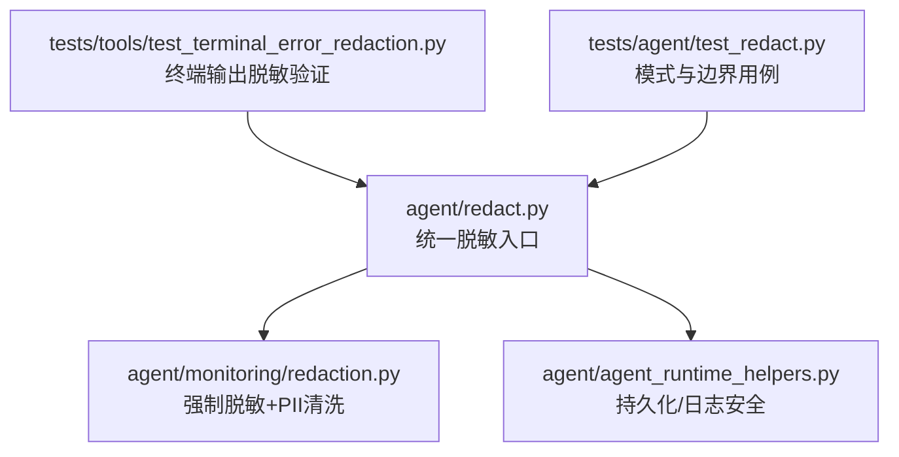
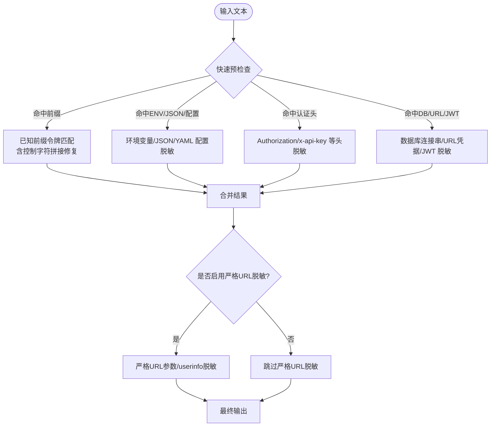
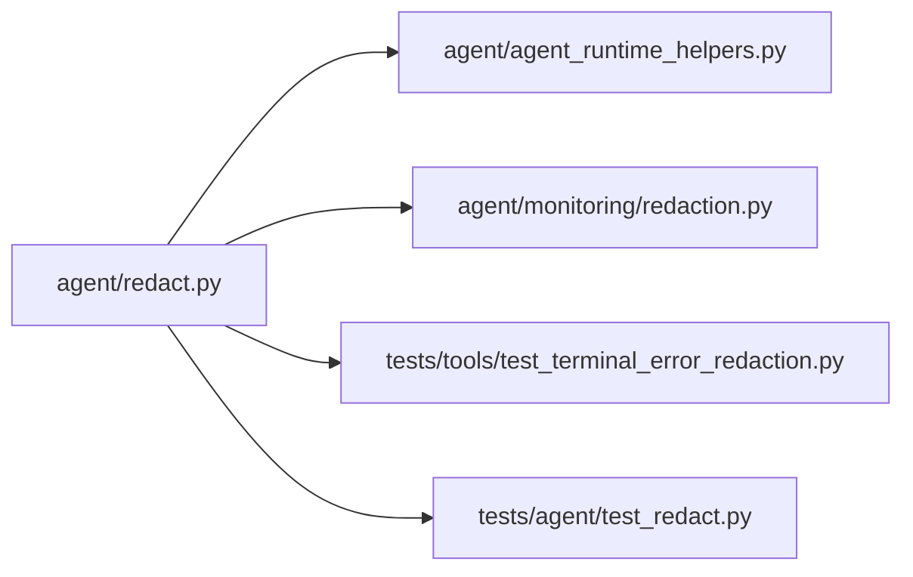
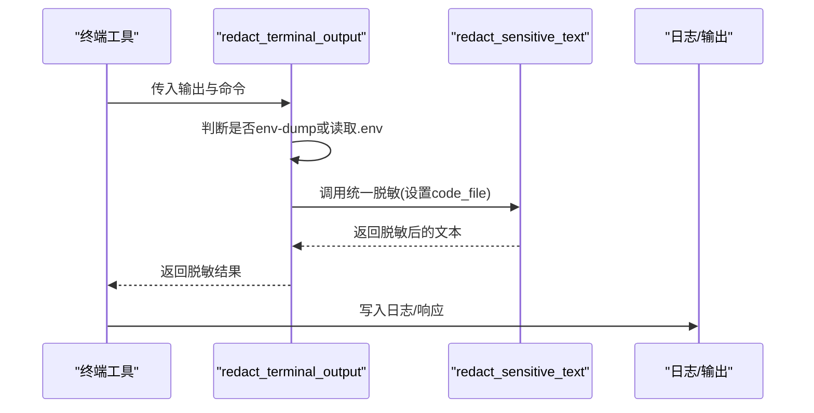

# 敏感数据脱敏

<cite>
**本文引用的文件**
- [agent/redact.py](file://agent/redact.py)
- [agent/monitoring/redaction.py](file://agent/monitoring/redaction.py)
- [tests/tools/test_terminal_error_redaction.py](file://tests/tools/test_terminal_error_redaction.py)
- [tests/agent/test_redact.py](file://tests/agent/test_redact.py)
- [agent/agent_runtime_helpers.py](file://agent/agent_runtime_helpers.py)
</cite>

## 目录
1. [简介](#简介)
2. [项目结构](#项目结构)
3. [核心组件](#核心组件)
4. [架构总览](#架构总览)
5. [详细组件分析](#详细组件分析)
6. [依赖关系分析](#依赖关系分析)
7. [性能考量](#性能考量)
8. [故障排查指南](#故障排查指南)
9. [结论](#结论)
10. [附录](#附录)

## 简介
本文件系统性说明本项目中的敏感数据脱敏机制，围绕正则表达式模式识别与自动脱敏展开。内容覆盖：
- API 密钥、令牌、密码等敏感信息的识别模式（含 OpenAI、GitHub、AWS 等前缀匹配）
- 环境变量、配置文件、JSON 字段、URL 查询参数等不同场景的脱敏策略
- 控制字符处理、JWT 令牌检测、数据库连接字符串保护
- 脱敏配置选项与自定义模式扩展方法
- 脱敏效果示例与性能优化建议
- 开发者最佳实践与测试方法

## 项目结构
敏感数据脱敏的核心实现集中在 agent/redact.py，并在监控导出路径中通过 agent/monitoring/redaction.py 进行二次加固；终端工具输出在 tests/tools/test_terminal_error_redaction.py 中验证；运行时持久化与日志格式化也集成该能力。

图表来源
- [agent/redact.py:772-1007](file://agent/redact.py#L772-L1007)
- [agent/monitoring/redaction.py:43-66](file://agent/monitoring/redaction.py#L43-L66)
- [agent/agent_runtime_helpers.py:1914-1917](file://agent/agent_runtime_helpers.py#L1914-L1917)
- [tests/tools/test_terminal_error_redaction.py:41-154](file://tests/tools/test_terminal_error_redaction.py#L41-L154)
- [tests/agent/test_redact.py:18-146](file://tests/agent/test_redact.py#L18-L146)

章节来源
- [agent/redact.py:772-1007](file://agent/redact.py#L772-L1007)
- [agent/monitoring/redaction.py:43-66](file://agent/monitoring/redaction.py#L43-L66)
- [agent/agent_runtime_helpers.py:1914-1917](file://agent/agent_runtime_helpers.py#L1914-L1917)
- [tests/tools/test_terminal_error_redaction.py:41-154](file://tests/tools/test_terminal_error_redaction.py#L41-L154)
- [tests/agent/test_redact.py:18-146](file://tests/agent/test_redact.py#L18-L146)

## 核心组件
- 统一脱敏函数：redact_sensitive_text(text, force=False, code_file=False, file_read=False, redact_url_credentials=False)
  - 负责按顺序应用多类正则规则，完成对日志、工具输出、配置片段等的脱敏
- 终端输出专用：redact_terminal_output(output, command=None, force=False)
  - 根据命令类型智能选择是否启用“环境变量/配置”脱敏路径
- 监控导出专用：redact_for_export(text)
  - 强制调用底层脱敏并追加 PII 清洗，确保不可关闭
- 显示掩码：mask_secret(value, head=4, tail=4, floor=12, placeholder="***", empty="")
  - 用于展示时保留首尾若干字符，便于调试
- 日志格式化器：RedactingFormatter
  - 将每条日志消息经脱敏后再输出

章节来源
- [agent/redact.py:549-608](file://agent/redact.py#L549-L608)
- [agent/redact.py:772-1007](file://agent/redact.py#L772-L1007)
- [agent/redact.py:1101-1128](file://agent/redact.py#L1101-L1128)
- [agent/monitoring/redaction.py:43-66](file://agent/monitoring/redaction.py#L43-L66)
- [agent/redact.py:1189-1198](file://agent/redact.py#L1189-L1198)

## 架构总览
脱敏流程以“快速预检查 + 多阶段正则替换”为核心，兼顾安全性与性能：
- 快速预检查：基于子串命中（如 "://"、"eyJ"、"uthorization"）决定是否执行对应复杂正则
- 多阶段替换：按优先级依次处理已知前缀令牌、环境变量赋值、JSON/YAML 配置键值、认证头、私有密钥块、数据库连接串、JWT、URL 凭据、表单体、手机号等
- 可选严格 URL 脱敏：在明确的安全边界处开启，对查询参数和 userinfo 做更严格的脱敏
- 终端输出感知：根据命令类型决定代码/配置上下文，避免误伤源码或配置常量

图表来源
- [agent/redact.py:772-1007](file://agent/redact.py#L772-L1007)
- [agent/redact.py:1131-1187](file://agent/redact.py#L1131-L1187)

## 详细组件分析

### 敏感信息识别模式
- 已知前缀令牌（API Key/Token）
  - 支持 OpenAI/Anthropic/OpenRouter (sk-)、GitHub PAT/OAuth/Refresh (ghp_/github_pat_/gho_/ghu_/ghs_/ghr_)、Slack (xoxb/xoxa/xoxp/xoxr)、Google API Key (AIza...)、AWS Access Key (AKIA...)、Stripe (sk_live_/sk_test_/rk_live_)、SendGrid (SG.)、HuggingFace (hf_)、Replicate (r8_)、npm、PyPI、DigitalOcean、AgentMail、ElevenLabs、Tavily、Exa、Groq、Matrix、RetainDB、Hindsight、Mem0、ByteRover、xAI、Notion、Fireworks、GitLab 家族等
  - 使用 _PREFIX_PATTERNS 列表与 _PREFIX_RE 组合匹配，并对控制字符分割的令牌进行拼接后匹配
- 环境变量赋值
  - 大写键：KEY=value（允许空格），小写键：openai_key=… 等，均要求键名包含敏感关键词且处于词边界
  - 排除程序化环境读取（os.getenv/process.env/$ENV{...}）以避免误伤代码片段
- 配置文件（YAML/Properties/类 .env 转储）
  - 点号命名空间键（如 spring.datasource.password=secret）、行首锚定键（password=… / export api_key=…）、未引号 YAML（password: secret）
  - 同样受词边界校验保护，避免误伤普通文本
- JSON 字段
  - 针对常见敏感键名（apiKey/token/secret/password 等）的值进行脱敏
- 认证头
  - Authorization（Bearer/Basic/Digest 等）及 x-api-key 等自定义头
- 私有密钥块
  - 匹配 BEGIN/END PRIVATE KEY 块并整体替换
- 数据库连接串
  - postgresql/mysql/mongodb/redis/amqp 等协议 user:PASSWORD@host 中的密码脱敏
- JWT 令牌
  - 以 eyJ 开头的 base64 头部，支持 1/2/3 段形式
- URL 查询参数与 userinfo
  - 默认不脱敏可导航 URL（保留 OAuth 回调、魔法链接、预签名链接）
  - 可通过 redact_url_credentials=True 在安全边界开启严格脱敏
- 控制字符处理
  - 当令牌被控制/零宽字符拆分时，先去除控制字符再匹配，然后映射回原文位置进行脱敏，避免绕过

章节来源
- [agent/redact.py:25-138](file://agent/redact.py#L25-L138)
- [agent/redact.py:140-227](file://agent/redact.py#L140-L227)
- [agent/redact.py:316-403](file://agent/redact.py#L316-L403)
- [agent/redact.py:409-465](file://agent/redact.py#L409-L465)
- [agent/redact.py:467-537](file://agent/redact.py#L467-L537)
- [agent/redact.py:772-1007](file://agent/redact.py#L772-L1007)

### 脱敏策略与场景
- 环境变量
  - 对 KEY=VALUE 形式的赋值进行脱敏，区分大小写键与词边界，避免误伤普通文本
- 配置文件
  - 对带命名空间的键、行首锚定键、未引号 YAML 值进行脱敏，同时跳过 URL 上下文
- JSON 字段
  - 对敏感键对应的字符串值进行脱敏，排除程序化读取占位
- URL 查询参数
  - 默认放行可导航 URL；在安全边界（如浏览器 CDP 端点、非导航出口）启用严格脱敏
- 表单体
  - 对纯 k=v&k=v 的单行表单体进行敏感参数值脱敏
- 终端输出
  - 根据命令类型判断是否为 env-dump 或读取 .env 文件，从而决定是否启用环境变量/配置脱敏路径

章节来源
- [agent/redact.py:772-1007](file://agent/redact.py#L772-L1007)
- [agent/redact.py:1010-1128](file://agent/redact.py#L1010-L1128)

### 控制字符处理
- 当令牌被换行符、ESC、零宽字符等分隔时，采用“去控制字符→匹配→映射回原文”的策略，确保即使被拆分也能完整脱敏
- 对跨行的情况谨慎处理，避免吞掉相邻行正常文本

章节来源
- [agent/redact.py:467-537](file://agent/redact.py#L467-L537)

### JWT 令牌检测
- 匹配以 eyJ 开头的 base64 头部，支持 header.payload 或 header.payload.signature 形式
- 对整段 JWT 进行脱敏，避免泄露载荷或签名

章节来源
- [agent/redact.py:398-403](file://agent/redact.py#L398-L403)
- [agent/redact.py:973-976](file://agent/redact.py#L973-L976)

### 数据库连接字符串保护
- 对 postgresql/mysql/mongodb/redis/amqp 等协议的 user:PASSWORD@host 中的密码进行脱敏
- 在代码文件中遇到 f-string 模板（花括号包裹）时保留原样，避免破坏模板

章节来源
- [agent/redact.py:363-374](file://agent/redact.py#L363-L374)
- [agent/redact.py:946-961](file://agent/redact.py#L946-L961)

### 脱敏配置选项
- 全局开关：HERMES_REDACT_SECRETS（默认开启）
  - 可在配置中通过 security.redact_secrets 桥接为环境变量
- 强制模式：force=True
  - 用于安全边界，忽略用户配置，始终脱敏
- 上下文模式：code_file/file_read
  - code_file=True 跳过 ENV/JSON 易误判的路径
  - file_read=True 将文件内容视为配置/数据，使用不可复用标记替代前缀令牌
- 严格 URL 脱敏：redact_url_credentials=True
  - 仅在非导航出口启用，对查询参数与 userinfo 做严格脱敏

章节来源
- [agent/redact.py:67-76](file://agent/redact.py#L67-L76)
- [agent/redact.py:772-807](file://agent/redact.py#L772-L807)
- [agent/redact.py:991-997](file://agent/redact.py#L991-L997)

### 自定义模式添加方法
- 新增前缀令牌：在 _PREFIX_PATTERNS 中添加新正则，并确保其字面前缀能被 _extract_literal_prefix 提取，以便快速预检查生效
- 新增敏感键名：更新 _SENSITIVE_QUERY_PARAMS/_SENSITIVE_BODY_KEYS/_JSON_KEY_NAMES 等集合/正则
- 新增配置键族：扩展 _SECRET_CFG_NAMES/_YAML_CFG_NAMES 并配合词边界校验
- 注意：所有新增需配套单元测试，确保无回归与误报

章节来源
- [agent/redact.py:78-138](file://agent/redact.py#L78-L138)
- [agent/redact.py:25-65](file://agent/redact.py#L25-L65)
- [agent/redact.py:181-227](file://agent/redact.py#L181-L227)
- [agent/redact.py:1142-1167](file://agent/redact.py#L1142-L1167)

### 脱敏效果示例（来自测试断言）
- 终端错误与回溯中的 API Key 会被脱敏，且不泄露原始值
- 成功输出可保留“脱敏关闭”选项行为，或通过命令感知脱敏器处理
- GitLab 各类 token 前缀均可正确脱敏，短后缀或嵌入标识不会误报
- 表单体中 password/token 等敏感值会被脱敏，其他字段保持原样

章节来源
- [tests/tools/test_terminal_error_redaction.py:41-154](file://tests/tools/test_terminal_error_redaction.py#L41-L154)
- [tests/agent/test_redact.py:23-85](file://tests/agent/test_redact.py#L23-L85)
- [tests/agent/test_redact.py:90-146](file://tests/agent/test_redact.py#L90-L146)

## 依赖关系分析
- agent/redact.py 提供统一脱敏能力，被多处引用：
  - 运行时持久化：agent/agent_runtime_helpers.py
  - 监控导出：agent/monitoring/redaction.py
  - 终端工具输出：tests/tools/test_terminal_error_redaction.py
  - 通用测试：tests/agent/test_redact.py

图表来源
- [agent/agent_runtime_helpers.py:1914-1917](file://agent/agent_runtime_helpers.py#L1914-L1917)
- [agent/monitoring/redaction.py:43-66](file://agent/monitoring/redaction.py#L43-L66)
- [tests/tools/test_terminal_error_redaction.py:41-154](file://tests/tools/test_terminal_error_redaction.py#L41-L154)
- [tests/agent/test_redact.py:18-146](file://tests/agent/test_redact.py#L18-L146)

章节来源
- [agent/agent_runtime_helpers.py:1914-1917](file://agent/agent_runtime_helpers.py#L1914-L1917)
- [agent/monitoring/redaction.py:43-66](file://agent/monitoring/redaction.py#L43-L66)
- [tests/tools/test_terminal_error_redaction.py:41-154](file://tests/tools/test_terminal_error_redaction.py#L41-L154)
- [tests/agent/test_redact.py:18-146](file://tests/agent/test_redact.py#L18-L146)

## 性能考量
- 快速预检查：通过子串存在性判断（如 "://"、"eyJ"、"uthorization"）大幅减少昂贵正则扫描次数
- 控制字符拼接匹配：仅在有控制字符时才执行额外逻辑，避免无谓开销
- 词边界校验：降低误报带来的重复匹配成本
- 严格 URL 脱敏仅在必要边界启用，避免全量扫描

章节来源
- [agent/redact.py:808-816](file://agent/redact.py#L808-L816)
- [agent/redact.py:1131-1187](file://agent/redact.py#L1131-L1187)

## 故障排查指南
- 确认脱敏开关状态
  - 检查 HERMES_REDACT_SECRETS 或配置项 security.redact_secrets
  - 若需要强制脱敏，使用 force=True 调用
- 定位误报/漏报
  - 检查是否命中快速预检查分支
  - 核对键名是否满足词边界与敏感关键词要求
  - 对于 URL 场景，确认是否启用了严格 URL 脱敏
- 终端输出异常
  - 使用 redact_terminal_output 并结合命令类型判断上下文
  - 参考终端错误脱敏测试用例验证行为
- 监控导出未脱敏
  - 监控导出路径强制调用底层脱敏，若仍失败，检查异常捕获与降级逻辑

章节来源
- [agent/redact.py:67-76](file://agent/redact.py#L67-L76)
- [agent/redact.py:772-807](file://agent/redact.py#L772-L807)
- [agent/redact.py:1101-1128](file://agent/redact.py#L1101-L1128)
- [agent/monitoring/redaction.py:43-66](file://agent/monitoring/redaction.py#L43-L66)
- [tests/tools/test_terminal_error_redaction.py:41-154](file://tests/tools/test_terminal_error_redaction.py#L41-L154)

## 结论
本项目的敏感数据脱敏体系以统一入口为核心，结合多类正则模式与快速预检查，覆盖环境变量、配置文件、JSON、URL、认证头、数据库连接串、JWT、私有密钥等多种场景，并通过终端输出感知与监控导出加固，确保在生产环境中尽可能避免敏感信息泄露。通过合理的配置选项与可扩展的模式定义，既能满足多样化需求，又能保持高性能与低误报率。

## 附录

### 关键流程图（终端输出脱敏）

图表来源
- [agent/redact.py:1101-1128](file://agent/redact.py#L1101-L1128)
- [agent/redact.py:772-1007](file://agent/redact.py#L772-L1007)

### 最佳实践
- 在安全边界（如错误上报、持久化、外部导出）优先使用 force=True
- 对可导航 URL 保持默认宽松策略，仅在非导航出口启用严格 URL 脱敏
- 新增第三方服务令牌时，补充前缀模式与单元测试
- 对终端输出使用 redact_terminal_output，避免误伤源码或配置常量
- 监控导出必须使用 redact_for_export，确保不可关闭的脱敏与 PII 清洗

章节来源
- [agent/redact.py:772-1007](file://agent/redact.py#L772-L1007)
- [agent/monitoring/redaction.py:43-66](file://agent/monitoring/redaction.py#L43-L66)
- [agent/redact.py:1101-1128](file://agent/redact.py#L1101-L1128)