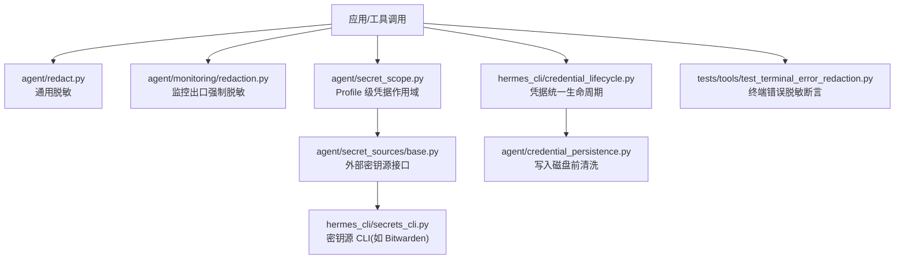
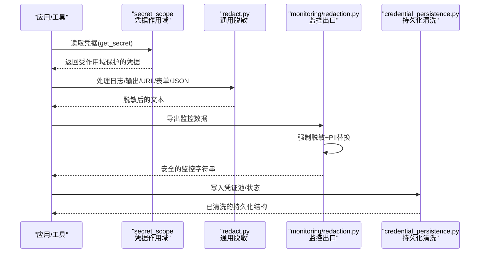
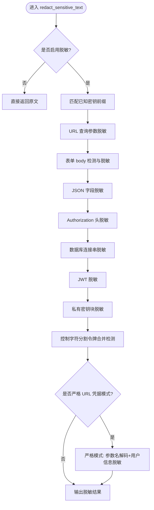
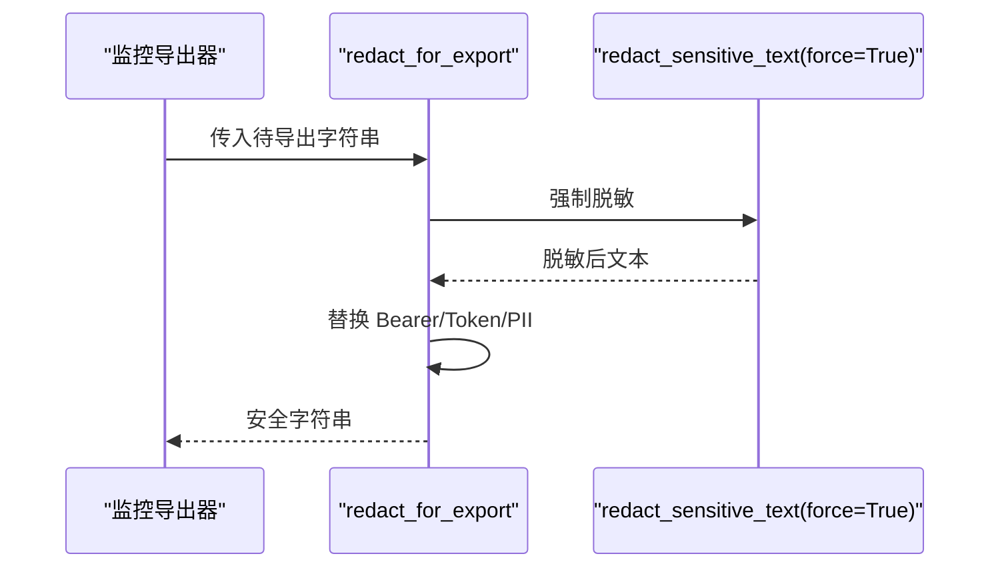
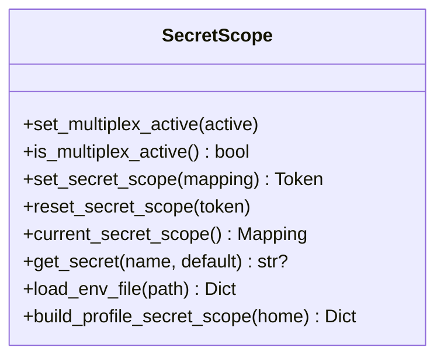
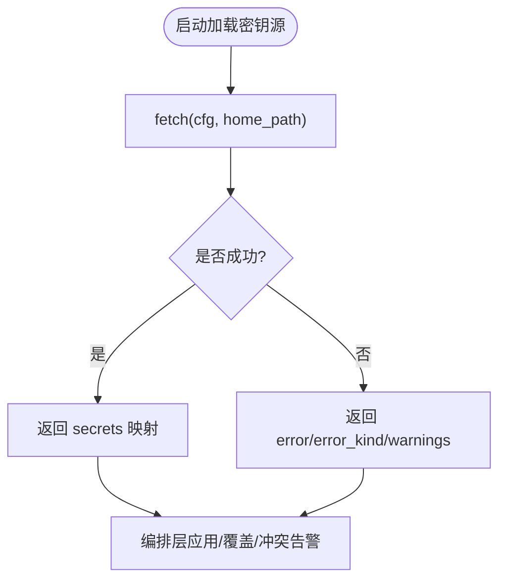
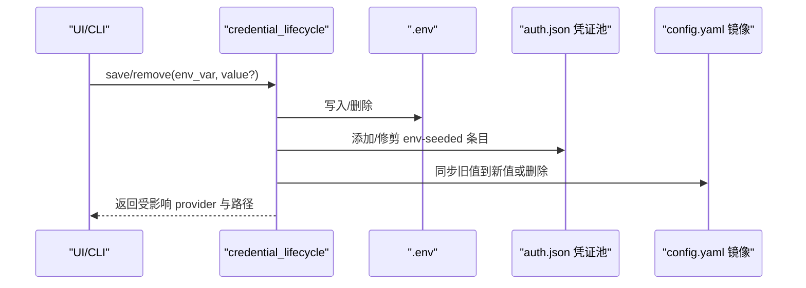
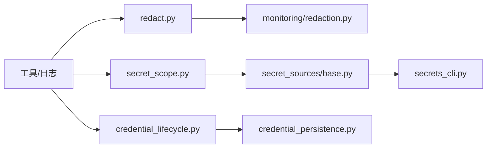

# 数据保护

<cite>
**本文引用的文件**   
- [agent/redact.py](file://agent/redact.py)
- [agent/monitoring/redaction.py](file://agent/monitoring/redaction.py)
- [agent/secret_scope.py](file://agent/secret_scope.py)
- [agent/secret_sources/base.py](file://agent/secret_sources/base.py)
- [hermes_cli/secrets_cli.py](file://hermes_cli/secrets_cli.py)
- [hermes_cli/credential_lifecycle.py](file://hermes_cli/credential_lifecycle.py)
- [agent/credential_persistence.py](file://agent/credential_persistence.py)
- [tests/tools/test_terminal_error_redaction.py](file://tests/tools/test_terminal_error_redaction.py)
</cite>

## 目录
1. [简介](#简介)
2. [项目结构](#项目结构)
3. [核心组件](#核心组件)
4. [架构总览](#架构总览)
5. [详细组件分析](#详细组件分析)
6. [依赖关系分析](#依赖关系分析)
7. [性能与安全特性](#性能与安全特性)
8. [故障排查指南](#故障排查指南)
9. [结论](#结论)
10. [附录：配置与合规、编码规范与测试](#附录配置与合规编码规范与测试)

## 简介
本文件面向开发者与运维人员，系统化说明 Hermes Agent 的数据保护能力与实践，覆盖敏感信息脱敏、凭据管理、数据存储安全、环境变量隔离、临时文件清理、数据传输加密、备份安全、日志与调试输出过滤、泄露检测与应急响应，以及开发期的安全编码规范与测试方法。文档以仓库中的实际实现为依据，提供可追溯的源码路径与图示，帮助在工程实践中落地“默认安全”的设计原则。

## 项目结构
围绕数据保护的关键模块分布在以下位置：
- 文本与日志脱敏：agent/redact.py、agent/monitoring/redaction.py
- 多租户/多 Profile 凭据隔离：agent/secret_scope.py
- 外部密钥源（如 Bitwarden）集成与 CLI：agent/secret_sources/base.py、hermes_cli/secrets_cli.py
- 凭据生命周期与持久化清洗：hermes_cli/credential_lifecycle.py、agent/credential_persistence.py
- 终端工具错误输出脱敏验证：tests/tools/test_terminal_error_redaction.py

**图表来源**
- [agent/redact.py:1-120](file://agent/redact.py#L1-L120)
- [agent/monitoring/redaction.py:1-72](file://agent/monitoring/redaction.py#L1-L72)
- [agent/secret_scope.py:1-120](file://agent/secret_scope.py#L1-L120)
- [agent/secret_sources/base.py:1-120](file://agent/secret_sources/base.py#L1-L120)
- [hermes_cli/secrets_cli.py:1-120](file://hermes_cli/secrets_cli.py#L1-L120)
- [hermes_cli/credential_lifecycle.py:1-120](file://hermes_cli/credential_lifecycle.py#L1-L120)
- [agent/credential_persistence.py:1-120](file://agent/credential_persistence.py#L1-L120)
- [tests/tools/test_terminal_error_redaction.py:1-154](file://tests/tools/test_terminal_error_redaction.py#L1-L154)

**章节来源**
- [agent/redact.py:1-120](file://agent/redact.py#L1-L120)
- [agent/monitoring/redaction.py:1-72](file://agent/monitoring/redaction.py#L1-L72)
- [agent/secret_scope.py:1-120](file://agent/secret_scope.py#L1-L120)
- [agent/secret_sources/base.py:1-120](file://agent/secret_sources/base.py#L1-L120)
- [hermes_cli/secrets_cli.py:1-120](file://hermes_cli/secrets_cli.py#L1-L120)
- [hermes_cli/credential_lifecycle.py:1-120](file://hermes_cli/credential_lifecycle.py#L1-L120)
- [agent/credential_persistence.py:1-120](file://agent/credential_persistence.py#L1-L120)
- [tests/tools/test_terminal_error_redaction.py:1-154](file://tests/tools/test_terminal_error_redaction.py#L1-L154)

## 核心组件
- 通用脱敏器：基于正则与上下文感知，对日志、工具输出、URL、表单、JSON、授权头等进行脱敏；支持按场景开关与强制模式。
- 监控出口脱敏：所有导出到监控系统的数据强制二次脱敏并替换 PII，失败时关闭放行。
- 多 Profile 凭据作用域：通过 ContextVar 为每个任务安装独立的环境映射，避免跨 Profile 泄漏；未设置作用域时在多路复用模式下主动失败。
- 外部密钥源：统一的启动期只读接口，支持超时、错误分类、子进程最小环境等安全约束。
- 凭据生命周期：统一保存/删除 API Key，协调 .env、auth.json 池、config.yaml 镜像，保持三者一致。
- 持久化清洗：写入磁盘前识别并移除或指纹化敏感字段，仅保留必要元数据。

**章节来源**
- [agent/redact.py:1-120](file://agent/redact.py#L1-L120)
- [agent/monitoring/redaction.py:1-72](file://agent/monitoring/redaction.py#L1-L72)
- [agent/secret_scope.py:1-120](file://agent/secret_scope.py#L1-L120)
- [agent/secret_sources/base.py:1-120](file://agent/secret_sources/base.py#L1-L120)
- [hermes_cli/credential_lifecycle.py:1-120](file://hermes_cli/credential_lifecycle.py#L1-L120)
- [agent/credential_persistence.py:1-120](file://agent/credential_persistence.py#L1-L120)

## 架构总览
下图展示了从“产生数据”到“对外暴露”的全链路数据保护点：输入侧读取凭据、运行时隔离、输出侧脱敏与 PII 替换、持久化清洗。

**图表来源**
- [agent/secret_scope.py:120-186](file://agent/secret_scope.py#L120-L186)
- [agent/redact.py:772-800](file://agent/redact.py#L772-L800)
- [agent/monitoring/redaction.py:43-66](file://agent/monitoring/redaction.py#L43-L66)
- [agent/credential_persistence.py:151-175](file://agent/credential_persistence.py#L151-L175)

## 详细组件分析

### 通用脱敏器（agent/redact.py）
- 能力范围
  - 已知供应商密钥前缀匹配（OpenAI、GitHub、AWS、Stripe、SendGrid 等），短令牌全掩码，长令牌保留首尾用于排障。
  - URL 查询参数、表单 body、JSON 字段、Authorization 头、数据库连接串、JWT、Telegram Bot Token、私有密钥块等。
  - 控制字符分割令牌检测，避免绕过。
  - 严格 URL 凭据脱敏模式，适用于非导航类 egress 边界。
  - 可通过环境变量/配置开关全局启用或禁用，但支持 force=True 的安全边界强制脱敏。
- 关键流程
  - 文本进入后依次执行：前缀令牌匹配、URL/表单/JSON/头部/DB 串/JWT/私钥等专项规则、控制字符拼接检测、最终组装输出。
  - 对 Web URL 默认放行（因为 OAuth 回调、魔法链接等需要原样传递），但在明确的安全边界可选择开启严格模式。

**图表来源**
- [agent/redact.py:772-800](file://agent/redact.py#L772-L800)
- [agent/redact.py:610-693](file://agent/redact.py#L610-L693)
- [agent/redact.py:488-537](file://agent/redact.py#L488-L537)

**章节来源**
- [agent/redact.py:1-120](file://agent/redact.py#L1-L120)
- [agent/redact.py:610-693](file://agent/redact.py#L610-L693)
- [agent/redact.py:772-800](file://agent/redact.py#L772-L800)
- [agent/redact.py:488-537](file://agent/redact.py#L488-L537)

### 监控出口脱敏（agent/monitoring/redaction.py）
- 策略
  - 无条件对所有导出字符串进行脱敏：先调用通用脱敏器（force=True），再额外替换 Bearer/Token 形状、PII（邮箱、电话、UUID）。
  - 若脱敏器不可用，则拒绝放行原始内容，改为占位标记，确保“失败即关闭”。
- 适用场景
  - 遥测、指标、审计日志等任何离开进程的字符串出口。

**图表来源**
- [agent/monitoring/redaction.py:43-66](file://agent/monitoring/redaction.py#L43-L66)

**章节来源**
- [agent/monitoring/redaction.py:1-72](file://agent/monitoring/redaction.py#L1-L72)

### 多 Profile 凭据作用域（agent/secret_scope.py）
- 设计要点
  - 使用 ContextVar 为当前任务安装独立的键值映射，避免将不同 Profile 的密钥注入进程全局 os.environ。
  - 当多路复用开启时，未安装作用域的 get_secret 调用会主动抛出异常（fail-closed），防止静默回退到 os.environ 导致跨 Profile 泄漏。
  - 真正的“全局环境变量”（部署/运行时级别）仍直接从 os.environ 读取，不受作用域影响。
- 典型用法
  - 网关在每个转发的 turn/adapter 调用前后安装/恢复作用域；CLI/定时任务也应在作用域内运行。

**图表来源**
- [agent/secret_scope.py:32-120](file://agent/secret_scope.py#L32-L120)
- [agent/secret_scope.py:132-186](file://agent/secret_scope.py#L132-L186)
- [agent/secret_scope.py:226-294](file://agent/secret_scope.py#L226-L294)

**章节来源**
- [agent/secret_scope.py:1-120](file://agent/secret_scope.py#L1-L120)
- [agent/secret_scope.py:132-186](file://agent/secret_scope.py#L132-L186)
- [agent/secret_scope.py:226-294](file://agent/secret_scope.py#L226-L294)

### 外部密钥源接口（agent/secret_sources/base.py）
- 契约
  - 启动期一次性同步 fetch，返回 name→value 映射；不修改 os.environ，由编排层决定应用顺序与冲突策略。
  - 禁止 raise 与交互提示；错误以结构化 ErrorKind 返回。
  - 子进程调用采用最小允许列表的环境变量，剥离 ANSI 转义，限制 stdin/stdout 行为。
- 安全特性
  - 超时控制、错误分类、可插拔 remediation 提示。
  - 子进程执行函数 run_secret_cli 严格白名单 env，避免携带完整凭据环境。

**图表来源**
- [agent/secret_sources/base.py:101-125](file://agent/secret_sources/base.py#L101-L125)
- [agent/secret_sources/base.py:278-337](file://agent/secret_sources/base.py#L278-L337)

**章节来源**
- [agent/secret_sources/base.py:1-120](file://agent/secret_sources/base.py#L1-L120)
- [agent/secret_sources/base.py:278-337](file://agent/secret_sources/base.py#L278-L337)

### 密钥源 CLI（Bitwarden 示例）（hermes_cli/secrets_cli.py）
- 功能
  - setup/status/sync/disable/install/token 等子命令，引导安装二进制、配置项目、校验 token、查看变更。
  - 交互式与非交互式模式均支持；非 TTY 下要求必要参数。
- 安全实践
  - 使用 masked secret prompt 输入敏感信息。
  - 子进程调用 bws 时显式设置 NO_COLOR，并对 stderr 做 ANSI 清洗。
  - 仅在必要时将 token 注入子进程环境，避免污染全局环境。

**章节来源**
- [hermes_cli/secrets_cli.py:1-120](file://hermes_cli/secrets_cli.py#L1-L120)
- [hermes_cli/secrets_cli.py:121-307](file://hermes_cli/secrets_cli.py#L121-L307)
- [hermes_cli/secrets_cli.py:369-447](file://hermes_cli/secrets_cli.py#L369-L447)
- [hermes_cli/secrets_cli.py:450-521](file://hermes_cli/secrets_cli.py#L450-L521)

### 凭据生命周期（hermes_cli/credential_lifecycle.py）
- 目标
  - 统一保存/删除 Provider 的 API Key，协调 .env、auth.json 凭证池、config.yaml 镜像，保证一致性。
- 关键点
  - 删除操作仅修剪 env-seeded 的凭证池条目，不触碰 OAuth/device-code/manual 等凭据。
  - config.yaml 中持有相同旧值的 api_key 镜像会被更新或删除，避免高优先级覆盖导致 401。
  - 删除后清理模型缓存，使 UI 不再显示已失效的 Provider。

**图表来源**
- [hermes_cli/credential_lifecycle.py:178-211](file://hermes_cli/credential_lifecycle.py#L178-L211)
- [hermes_cli/credential_lifecycle.py:213-273](file://hermes_cli/credential_lifecycle.py#L213-L273)

**章节来源**
- [hermes_cli/credential_lifecycle.py:1-120](file://hermes_cli/credential_lifecycle.py#L1-L120)
- [hermes_cli/credential_lifecycle.py:178-211](file://hermes_cli/credential_lifecycle.py#L178-L211)
- [hermes_cli/credential_lifecycle.py:213-273](file://hermes_cli/credential_lifecycle.py#L213-L273)

### 持久化清洗（agent/credential_persistence.py）
- 策略
  - 识别“借用/引用型”凭据来源，写入磁盘前移除真实敏感字段，仅保留指纹与元数据。
  - 对疑似敏感字段名（含驼峰/后缀）进行归一化判断，降低误放风险。
- 价值
  - 即使 auth.json 被意外泄露，也不会直接暴露可用凭据。

**章节来源**
- [agent/credential_persistence.py:1-120](file://agent/credential_persistence.py#L1-L120)
- [agent/credential_persistence.py:151-175](file://agent/credential_persistence.py#L151-L175)

### 终端错误输出脱敏验证（tests/tools/test_terminal_error_redaction.py）
- 目的
  - 确保终端工具的错误消息与回溯不会泄露凭据形状的字符串。
- 断言要点
  - 错误与 traceback 字段必须包含掩码标记，且不含原始密钥片段。
  - 成功输出可按配置选择是否脱敏，并支持命令感知的脱敏器。

**章节来源**
- [tests/tools/test_terminal_error_redaction.py:1-154](file://tests/tools/test_terminal_error_redaction.py#L1-L154)

## 依赖关系分析
- 耦合与职责
  - redact.py 作为通用脱敏库，被监控出口与各类工具/日志路径调用。
  - monitoring/redaction.py 在监控出口处强制二次脱敏，形成“兜底防线”。
  - secret_scope.py 为多 Profile 场景提供隔离，避免凭据跨任务泄漏。
  - secret_sources/base.py 定义外部密钥源契约，secrets_cli.py 提供具体后端（如 Bitwarden）的管理入口。
  - credential_lifecycle.py 与 credential_persistence.py 协作，保证凭据在存储与持久化时的安全。
- 潜在循环与解耦
  - 各模块通过明确的接口与数据流解耦，避免循环依赖；例如 base.py 不直接写 os.environ，由编排层负责应用。

**图表来源**
- [agent/redact.py:772-800](file://agent/redact.py#L772-L800)
- [agent/monitoring/redaction.py:43-66](file://agent/monitoring/redaction.py#L43-L66)
- [agent/secret_scope.py:132-186](file://agent/secret_scope.py#L132-L186)
- [agent/secret_sources/base.py:101-125](file://agent/secret_sources/base.py#L101-L125)
- [hermes_cli/secrets_cli.py:121-307](file://hermes_cli/secrets_cli.py#L121-L307)
- [hermes_cli/credential_lifecycle.py:213-273](file://hermes_cli/credential_lifecycle.py#L213-L273)
- [agent/credential_persistence.py:151-175](file://agent/credential_persistence.py#L151-L175)

**章节来源**
- [agent/redact.py:772-800](file://agent/redact.py#L772-L800)
- [agent/monitoring/redaction.py:43-66](file://agent/monitoring/redaction.py#L43-L66)
- [agent/secret_scope.py:132-186](file://agent/secret_scope.py#L132-L186)
- [agent/secret_sources/base.py:101-125](file://agent/secret_sources/base.py#L101-L125)
- [hermes_cli/secrets_cli.py:121-307](file://hermes_cli/secrets_cli.py#L121-L307)
- [hermes_cli/credential_lifecycle.py:213-273](file://hermes_cli/credential_lifecycle.py#L213-L273)
- [agent/credential_persistence.py:151-175](file://agent/credential_persistence.py#L151-L175)

## 性能与安全特性
- 性能
  - 脱敏使用预编译正则与快速短路（如关键词前置检查），避免对无关文本进行昂贵匹配。
  - 控制字符分割令牌检测仅在存在控制字符时触发，减少开销。
- 安全
  - 监控出口强制脱敏且失败关闭。
  - 多 Profile 作用域在多路复用模式下 fail-closed。
  - 外部密钥源子进程最小环境、ANSI 清洗、超时与错误分类。
  - 持久化前清洗敏感字段，仅保留指纹。

[本节为通用指导，无需特定文件引用]

## 故障排查指南
- 现象：监控导出出现“[redaction-unavailable]”
  - 原因：脱敏器不可用或被异常中断。
  - 处理：检查 agent/monitoring/redaction.py 的导入与调用路径，确保 redact_sensitive_text 可用；确认未禁用全局脱敏。
- 现象：多 Profile 环境下 get_secret 抛出未作用域错误
  - 原因：未在 set_secret_scope 上下文中读取凭据。
  - 处理：在网关/任务入口处安装作用域，并在退出时恢复。
- 现象：Bitwarden 集成无法列出项目或认证失败
  - 原因：token 无效、区域不匹配或未安装 bws。
  - 处理：使用 hermes_cli/secrets_cli.py 的 status/sync/token 子命令诊断；必要时重新 setup。
- 现象：删除 API Key 后 UI 仍显示对应 Provider
  - 原因：凭证池或模型缓存未清理。
  - 处理：通过 credential_lifecycle 的删除流程确保 pool 与缓存清理。

**章节来源**
- [agent/monitoring/redaction.py:43-66](file://agent/monitoring/redaction.py#L43-L66)
- [agent/secret_scope.py:132-186](file://agent/secret_scope.py#L132-L186)
- [hermes_cli/secrets_cli.py:310-366](file://hermes_cli/secrets_cli.py#L310-L366)
- [hermes_cli/credential_lifecycle.py:178-211](file://hermes_cli/credential_lifecycle.py#L178-L211)

## 结论
Hermes Agent 在数据保护方面构建了多层防御：启动期凭据隔离、运行时通用脱敏、监控出口强制脱敏、持久化清洗与外部密钥源的最小权限子进程执行。这些机制共同确保敏感信息在生命周期各阶段不被泄露，同时兼顾可观测性与可维护性。建议在生产环境中始终启用默认脱敏，结合多 Profile 作用域与外部密钥源，形成端到端的数据保护闭环。

[本节为总结，无需特定文件引用]

## 附录：配置与合规、编码规范与测试

### 数据保护配置指南
- 启用/禁用脱敏
  - 通过配置项或环境变量控制全局脱敏开关；安全边界可使用 force=True 强制脱敏。
  - 参考：agent/redact.py 中的开关与 redact_sensitive_text 的参数。
- 多 Profile 作用域
  - 在网关/任务入口安装 set_secret_scope，确保多路复用模式下凭据隔离。
  - 参考：agent/secret_scope.py 的作用域 API。
- 外部密钥源
  - 使用 hermes_cli/secrets_cli.py 完成安装、配置、校验与同步；遵循最小环境子进程调用。
  - 参考：agent/secret_sources/base.py 的契约与 CLI 实现。
- 凭据生命周期
  - 通过 credential_lifecycle 统一保存/删除 API Key，确保 .env、auth.json、config.yaml 一致。
  - 参考：hermes_cli/credential_lifecycle.py。
- 持久化清洗
  - 写入磁盘前自动清洗敏感字段，仅保留指纹与元数据。
  - 参考：agent/credential_persistence.py。

**章节来源**
- [agent/redact.py:772-800](file://agent/redact.py#L772-L800)
- [agent/secret_scope.py:132-186](file://agent/secret_scope.py#L132-L186)
- [hermes_cli/secrets_cli.py:121-307](file://hermes_cli/secrets_cli.py#L121-L307)
- [hermes_cli/credential_lifecycle.py:213-273](file://hermes_cli/credential_lifecycle.py#L213-L273)
- [agent/credential_persistence.py:151-175](file://agent/credential_persistence.py#L151-L175)

### 合规性要求
- 日志与监控不得包含明文凭据与 PII；监控出口强制脱敏。
- 多租户/多 Profile 环境需隔离凭据，禁止跨任务泄漏。
- 外部密钥源调用需最小权限、超时与错误分类，避免阻塞与泄露。
- 持久化存储不得包含明文敏感字段，应使用指纹替代。

[本节为通用合规指导，无需特定文件引用]

### 数据安全编码规范
- 一律通过 get_secret 读取凭据，避免直接访问 os.environ。
- 对外输出的任何字符串（日志、错误、监控）均需经脱敏处理；监控出口强制二次脱敏。
- 子进程调用使用最小允许环境变量，禁止 shell=True，stdin 重定向至空设备。
- 对 URL、表单、JSON、头部等敏感结构使用专用脱敏函数。
- 在作用域内执行可能读取凭据的代码块，确保多路复用模式下的隔离。

**章节来源**
- [agent/secret_scope.py:132-186](file://agent/secret_scope.py#L132-L186)
- [agent/monitoring/redaction.py:43-66](file://agent/monitoring/redaction.py#L43-L66)
- [agent/secret_sources/base.py:278-337](file://agent/secret_sources/base.py#L278-L337)
- [agent/redact.py:610-693](file://agent/redact.py#L610-L693)

### 测试方法
- 终端错误脱敏测试：验证错误与 traceback 不包含原始凭据，且支持命令感知脱敏。
- 监控导出脱敏：确保导出字符串经过强制脱敏与 PII 替换。
- 作用域隔离测试：在多路复用模式下验证未设置作用域的凭据读取会失败。
- 外部密钥源测试：校验子进程调用最小环境、超时与错误分类。
- 持久化清洗测试：验证写入磁盘前敏感字段被移除或指纹化。

**章节来源**
- [tests/tools/test_terminal_error_redaction.py:1-154](file://tests/tools/test_terminal_error_redaction.py#L1-L154)
- [agent/monitoring/redaction.py:43-66](file://agent/monitoring/redaction.py#L43-L66)
- [agent/secret_scope.py:132-186](file://agent/secret_scope.py#L132-L186)
- [agent/secret_sources/base.py:278-337](file://agent/secret_sources/base.py#L278-L337)
- [agent/credential_persistence.py:151-175](file://agent/credential_persistence.py#L151-L175)