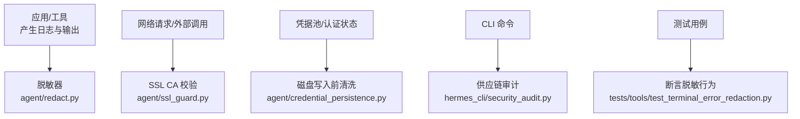
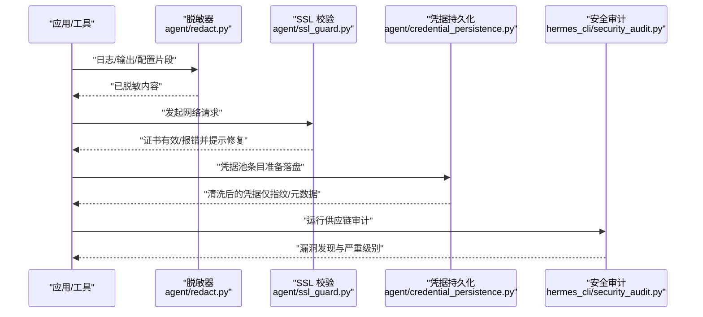
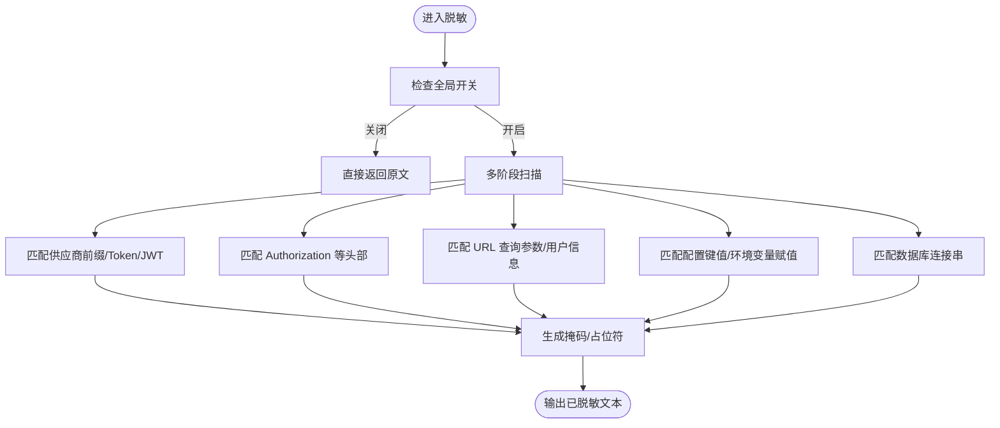
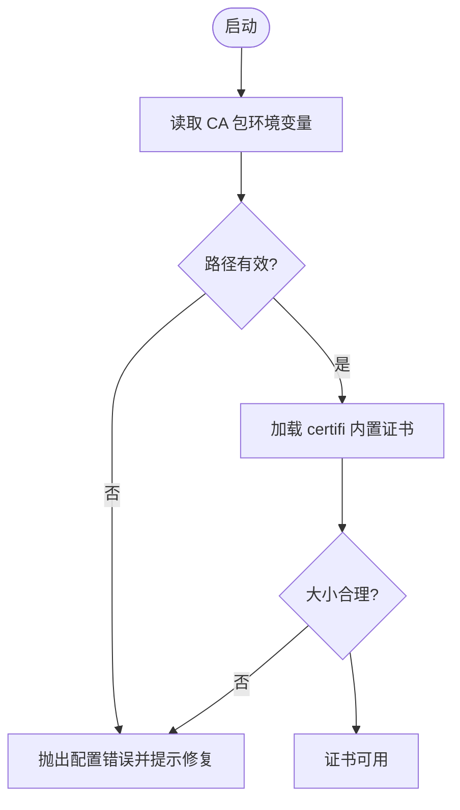
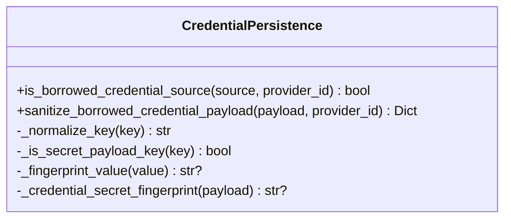
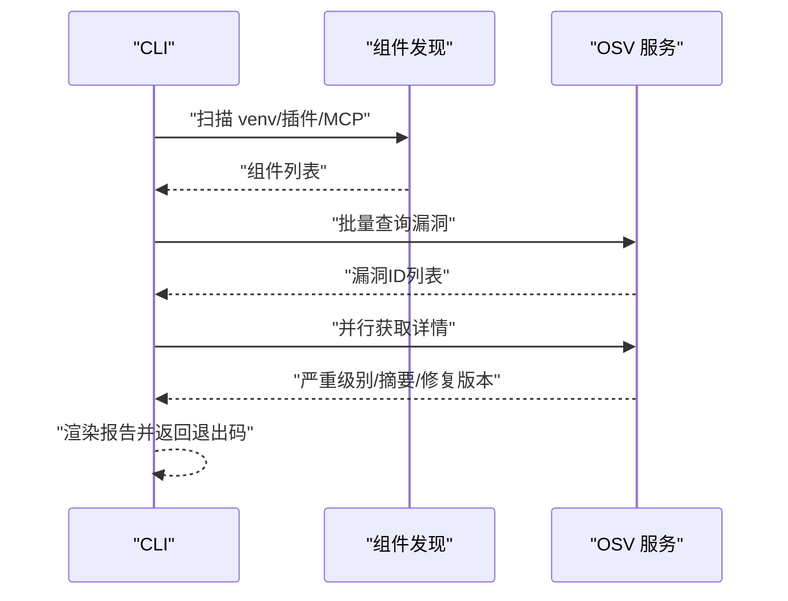
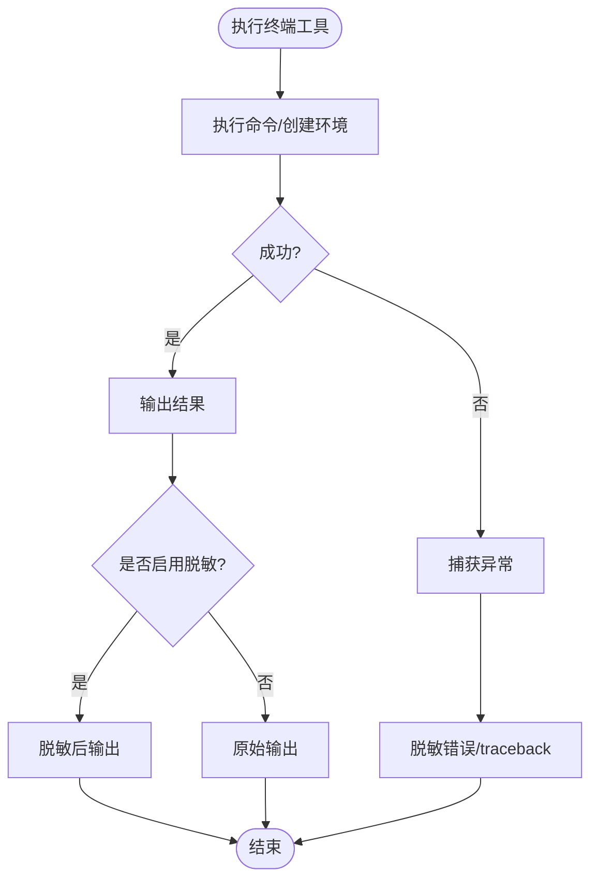
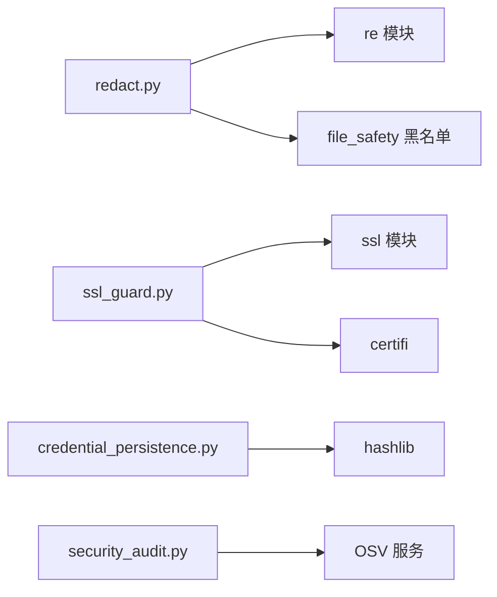

# 数据存储安全

<cite>
**本文引用的文件**
- [agent/redact.py](file://agent/redact.py)
- [agent/ssl_guard.py](file://agent/ssl_guard.py)
- [agent/credential_persistence.py](file://agent/credential_persistence.py)
- [hermes_cli/security_audit.py](file://hermes_cli/security_audit.py)
- [tests/tools/test_terminal_error_redaction.py](file://tests/tools/test_terminal_error_redaction.py)
</cite>

## 目录
1. [简介](#简介)
2. [项目结构](#项目结构)
3. [核心组件](#核心组件)
4. [架构总览](#架构总览)
5. [详细组件分析](#详细组件分析)
6. [依赖关系分析](#依赖关系分析)
7. [性能考虑](#性能考虑)
8. [故障排查指南](#故障排查指南)
9. [结论](#结论)
10. [附录](#附录)

## 简介
本文件聚焦 Hermes Agent 的数据存储安全，覆盖数据库字段加密、文件存储保护、内存数据安全、会话与用户信息、工具输出等敏感数据的脱敏与防护；同时涵盖临时文件清理、日志脱敏、调试输出过滤、数据库连接安全、备份数据加密、传输层加密、数据保留策略与合规性要求、数据泄露防护措施与安全审计方法，以及面向开发者的安全编码规范与漏洞检测方法。

## 项目结构
围绕“存储安全”的关键代码主要分布在以下模块：
- 日志与输出脱敏：agent/redact.py
- 传输层证书校验：agent/ssl_guard.py
- 凭据持久化边界清洗：agent/credential_persistence.py
- 供应链安全审计：hermes_cli/security_audit.py
- 终端工具错误输出脱敏验证：tests/tools/test_terminal_error_redaction.py

**图示来源**
- [agent/redact.py:1-120](file://agent/redact.py#L1-L120)
- [agent/ssl_guard.py:1-102](file://agent/ssl_guard.py#L1-L102)
- [agent/credential_persistence.py:1-175](file://agent/credential_persistence.py#L1-L175)
- [hermes_cli/security_audit.py:1-120](file://hermes_cli/security_audit.py#L1-L120)
- [tests/tools/test_terminal_error_redaction.py:1-154](file://tests/tools/test_terminal_error_redaction.py#L1-L154)

**章节来源**
- [agent/redact.py:1-120](file://agent/redact.py#L1-L120)
- [agent/ssl_guard.py:1-102](file://agent/ssl_guard.py#L1-L102)
- [agent/credential_persistence.py:1-175](file://agent/credential_persistence.py#L1-L175)
- [hermes_cli/security_audit.py:1-120](file://hermes_cli/security_audit.py#L1-L120)
- [tests/tools/test_terminal_error_redaction.py:1-154](file://tests/tools/test_terminal_error_redaction.py#L1-L154)

## 核心组件
- 日志与输出脱敏（agent/redact.py）
  - 通过正则匹配 API Key、Token、JWT、数据库连接串、Authorization 头、URL 查询参数等，对日志、工具输出、配置片段进行脱敏。
  - 支持控制字符拆分 Token 的合并检测，避免绕过。
  - 提供可配置的开关与环境变量控制，默认开启。
- 传输层证书校验（agent/ssl_guard.py）
  - 启动时校验 CA 包路径与有效性，防止因证书缺失或损坏导致的不透明失败。
  - 提供修复提示与跳过开关。
- 凭据持久化边界清洗（agent/credential_persistence.py）
  - 在写入 auth.json 等磁盘文件前，识别并移除原始凭据值，仅保留指纹与元数据。
  - 区分“自有来源”和“借用来源”，借用来源默认不写回明文。
- 供应链安全审计（hermes_cli/security_audit.py）
  - 扫描 venv、插件与 MCP 服务器依赖，向 OSV 查询已知漏洞，按严重级别排序并输出报告。
- 终端错误输出脱敏验证（tests/tools/test_terminal_error_redaction.py）
  - 确保异常文本、traceback 中的密钥被替换为占位符，且成功输出可按配置选择是否脱敏。

**章节来源**
- [agent/redact.py:1-120](file://agent/redact.py#L1-L120)
- [agent/ssl_guard.py:1-102](file://agent/ssl_guard.py#L1-L102)
- [agent/credential_persistence.py:1-175](file://agent/credential_persistence.py#L1-L175)
- [hermes_cli/security_audit.py:1-120](file://hermes_cli/security_audit.py#L1-L120)
- [tests/tools/test_terminal_error_redaction.py:1-154](file://tests/tools/test_terminal_error_redaction.py#L1-L154)

## 架构总览
下图展示从输入到落盘/输出的关键安全边界：

**图示来源**
- [agent/redact.py:772-800](file://agent/redact.py#L772-L800)
- [agent/ssl_guard.py:68-102](file://agent/ssl_guard.py#L68-L102)
- [agent/credential_persistence.py:151-175](file://agent/credential_persistence.py#L151-L175)
- [hermes_cli/security_audit.py:433-481](file://hermes_cli/security_audit.py#L433-L481)

## 详细组件分析

### 日志与输出脱敏（agent/redact.py）
- 功能要点
  - 识别并脱敏多种密钥形态：供应商前缀（如 sk-、ghp_、AKIA 等）、JWT、数据库连接串、Authorization 头、URL 查询参数、表单体键值对。
  - 处理控制字符拆分的 Token，避免通过不可见字符绕过。
  - 提供显示用掩码函数，保留前后若干字符以便调试，短值则完全掩蔽。
  - 支持全局开关与环境变量控制，默认启用。
- 复杂度与性能
  - 基于预编译正则的多阶段匹配，采用保守模式减少误报。
  - 对长文本使用快速前置判断（如关键词存在性）以减少回溯开销。
- 错误处理
  - 对无法匹配的文本原样返回，避免破坏合法内容。
  - 针对 URL、表单、配置等不同上下文分别处理，降低误伤。
- 优化建议
  - 在高吞吐场景下，可对热点路径增加缓存或批量处理。
  - 定期更新前缀与关键词规则以适配新供应商格式。

**图示来源**
- [agent/redact.py:78-138](file://agent/redact.py#L78-L138)
- [agent/redact.py:316-350](file://agent/redact.py#L316-L350)
- [agent/redact.py:371-450](file://agent/redact.py#L371-L450)
- [agent/redact.py:549-608](file://agent/redact.py#L549-L608)
- [agent/redact.py:772-800](file://agent/redact.py#L772-L800)

**章节来源**
- [agent/redact.py:1-120](file://agent/redact.py#L1-L120)
- [agent/redact.py:316-450](file://agent/redact.py#L316-L450)
- [agent/redact.py:549-608](file://agent/redact.py#L549-L608)
- [agent/redact.py:772-800](file://agent/redact.py#L772-L800)

### 传输层证书校验（agent/ssl_guard.py）
- 功能要点
  - 读取并校验 CA 包路径（支持多个环境变量），确保可加载且包含证书。
  - 校验 certifi 内置证书包的完整性与大小阈值。
  - 提供修复提示，便于运维快速恢复。
- 错误处理
  - 对缺失、非文件、过小、无法加载等情况抛出统一错误类型，附带修复指引。
- 优化建议
  - 在容器化部署中预置有效的 CA 包，避免运行时缺失。
  - 企业环境可通过环境变量指向内部 CA，但需确保路径正确。

**图示来源**
- [agent/ssl_guard.py:18-66](file://agent/ssl_guard.py#L18-L66)
- [agent/ssl_guard.py:68-102](file://agent/ssl_guard.py#L68-L102)

**章节来源**
- [agent/ssl_guard.py:1-102](file://agent/ssl_guard.py#L1-L102)

### 凭据持久化边界清洗（agent/credential_persistence.py）
- 功能要点
  - 识别凭据值字段（如 access_token、refresh_token、api_key、secret 等）。
  - 对“借用来源”的凭据条目，移除原始值，仅保留指纹与元数据。
  - 对自有来源（如手动输入、Hermes 拥有的 OAuth/device_code 状态）允许完整落盘。
- 数据结构与复杂度
  - 使用集合与正则进行键名归一化与匹配，时间复杂度近似 O(n)。
- 错误处理
  - 对未知来源采取保守策略（fail-closed），避免意外持久化敏感值。
- 优化建议
  - 扩展白名单时需严格评审，避免引入新的明文落盘风险。
  - 结合审计日志记录清洗行为，便于追踪。

**图示来源**
- [agent/credential_persistence.py:17-92](file://agent/credential_persistence.py#L17-L92)
- [agent/credential_persistence.py:103-175](file://agent/credential_persistence.py#L103-L175)

**章节来源**
- [agent/credential_persistence.py:1-175](file://agent/credential_persistence.py#L1-L175)

### 供应链安全审计（hermes_cli/security_audit.py）
- 功能要点
  - 扫描 Python venv、插件 requirements/pyproject、MCP 服务器命令中的版本依赖。
  - 批量查询 OSV.dev 获取已知漏洞，提取严重级别与修复版本。
  - 输出人类可读与 JSON 两种格式，支持按严重级别退出码控制。
- 复杂度与性能
  - 并行抓取漏洞详情，限制批次大小以避免超限。
- 错误处理
  - 网络异常时抛出明确错误，便于定位。
- 优化建议
  - 将审计纳入 CI 流程，阻断高危漏洞合并。
  - 定期更新扫描范围与解析规则。

**图示来源**
- [hermes_cli/security_audit.py:84-279](file://hermes_cli/security_audit.py#L84-L279)
- [hermes_cli/security_audit.py:300-408](file://hermes_cli/security_audit.py#L300-L408)
- [hermes_cli/security_audit.py:433-590](file://hermes_cli/security_audit.py#L433-L590)

**章节来源**
- [hermes_cli/security_audit.py:1-590](file://hermes_cli/security_audit.py#L1-L590)

### 终端错误输出脱敏验证（tests/tools/test_terminal_error_redaction.py）
- 功能要点
  - 验证终端工具的错误消息与 traceback 中不包含明文密钥。
  - 验证成功输出可按配置选择是否脱敏。
- 测试覆盖
  - 前台重试错误、后台启动错误、导入错误、外层异常等多类场景。
- 优化建议
  - 新增工具时补充对应脱敏断言，确保输出安全。

**图示来源**
- [tests/tools/test_terminal_error_redaction.py:1-154](file://tests/tools/test_terminal_error_redaction.py#L1-L154)

**章节来源**
- [tests/tools/test_terminal_error_redaction.py:1-154](file://tests/tools/test_terminal_error_redaction.py#L1-L154)

## 依赖关系分析
- 脱敏器依赖正则库与可选的文件安全黑名单（用于 .env 文件名匹配）。
- SSL 校验依赖系统 ssl 模块与 certifi。
- 凭据持久化依赖哈希算法与正则表达式进行键名归一化。
- 安全审计依赖标准库与 OSV 服务，无第三方强依赖。

**图示来源**
- [agent/redact.py:10-22](file://agent/redact.py#L10-L22)
- [agent/ssl_guard.py:9-14](file://agent/ssl_guard.py#L9-L14)
- [agent/credential_persistence.py:12-14](file://agent/credential_persistence.py#L12-L14)
- [hermes_cli/security_audit.py:22-39](file://hermes_cli/security_audit.py#L22-L39)

**章节来源**
- [agent/redact.py:10-22](file://agent/redact.py#L10-L22)
- [agent/ssl_guard.py:9-14](file://agent/ssl_guard.py#L9-L14)
- [agent/credential_persistence.py:12-14](file://agent/credential_persistence.py#L12-L14)
- [hermes_cli/security_audit.py:22-39](file://hermes_cli/security_audit.py#L22-L39)

## 性能考虑
- 脱敏器使用预编译正则与快速前置判断，避免全量回溯；在高吞吐日志场景建议批量处理与异步化。
- SSL 校验仅在启动时执行，影响有限；容器镜像应预装有效证书。
- 凭据清洗为轻量级字符串处理，开销可忽略。
- 安全审计并行抓取详情，注意网络超时与限流。

[本节为通用指导，无需特定文件引用]

## 故障排查指南
- 日志仍出现密钥
  - 确认全局脱敏开关未被关闭；检查是否属于未覆盖的上下文（如自定义输出路径）。
  - 参考脱敏器的上下文参数（如 code_file、file_read、redact_url_credentials）调整调用点。
- 网络请求证书错误
  - 检查 CA 包环境变量与 certifi 安装；使用修复提示重新安装或修正路径。
- 凭据未落盘或丢失
  - 确认来源是否为“借用来源”；若是，则不会写回明文，仅保留指纹。
- 审计失败
  - 检查网络连通性与 OSV 服务可用性；查看错误信息并重试。

**章节来源**
- [agent/redact.py:772-800](file://agent/redact.py#L772-L800)
- [agent/ssl_guard.py:32-66](file://agent/ssl_guard.py#L32-L66)
- [agent/credential_persistence.py:103-175](file://agent/credential_persistence.py#L103-L175)
- [hermes_cli/security_audit.py:539-590](file://hermes_cli/security_audit.py#L539-L590)

## 结论
Hermes Agent 在存储安全方面构建了多层防线：日志与输出全面脱敏、传输层证书强制校验、凭据落盘前清洗、供应链漏洞审计。这些机制共同降低了敏感数据泄露风险，提升了系统的整体安全性。建议在生产环境中持续启用默认安全策略，并将相关检查纳入 CI/CD 流程。

[本节为总结，无需特定文件引用]

## 附录

### 数据库字段加密与备份加密
- 当前仓库未发现直接的数据库字段加密实现；建议在应用层对敏感字段进行加密后再写入数据库，并在备份阶段对备份文件进行加密。
- 若使用外部数据库服务，请启用服务侧的透明数据加密（TDE）与备份加密选项。

[本节为通用指导，无需特定文件引用]

### 会话数据与用户信息保护
- 会话与用户信息应避免以明文形式持久化；如需落盘，请使用凭据持久化边界清洗策略，仅保存指纹与必要元数据。
- 对外暴露的会话标识不应包含敏感信息。

[本节为通用指导，无需特定文件引用]

### 临时文件清理与日志脱敏
- 临时文件应在使用后及时删除，避免残留敏感数据。
- 所有日志与调试输出必须经过脱敏器处理，确保不泄露密钥、令牌、连接串等。

[本节为通用指导，无需特定文件引用]

### 数据保留策略与合规性
- 制定数据保留期限，定期清理过期日志、会话与中间文件。
- 遵循最小留存原则，仅保留满足业务与合规要求的必要数据。

[本节为通用指导，无需特定文件引用]

### 数据泄露防护与安全审计
- 启用供应链安全审计，定期扫描依赖漏洞并按严重级别处理。
- 对关键变更进行安全评审，确保新增代码不引入明文落盘或日志泄露风险。

**章节来源**
- [hermes_cli/security_audit.py:433-590](file://hermes_cli/security_audit.py#L433-L590)

### 开发者安全编码规范与漏洞检测方法
- 编码规范
  - 禁止在日志、错误消息、配置文件与输出中打印明文密钥。
  - 使用脱敏器统一处理所有可能包含敏感信息的文本。
  - 凭据仅通过受控接口访问，不落盘明文。
- 漏洞检测
  - 在 CI 中集成安全审计，阻断高危漏洞合并。
  - 对新增工具与输出路径补充脱敏断言测试。

[本节为通用指导，无需特定文件引用]