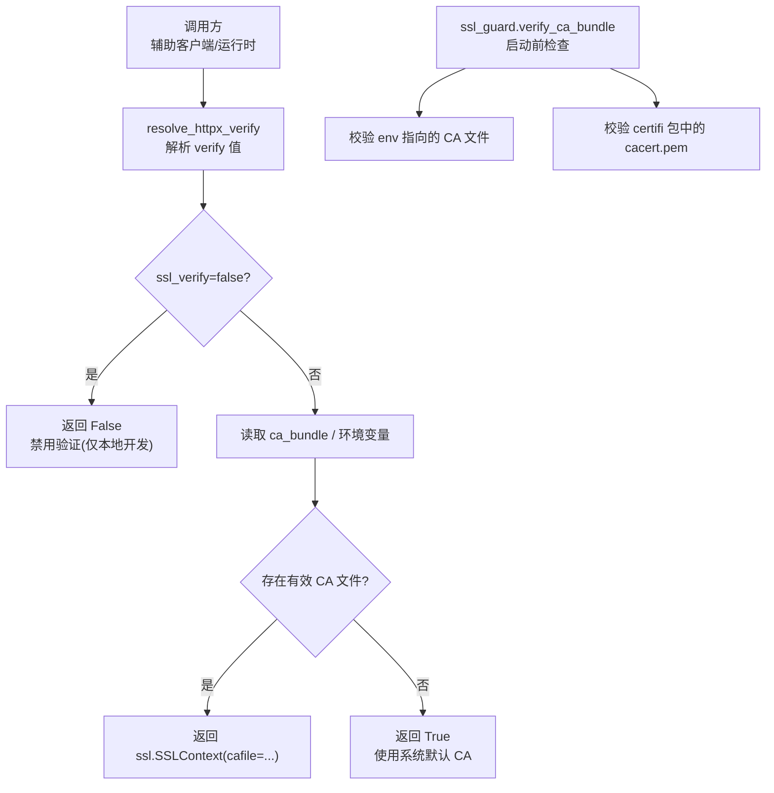
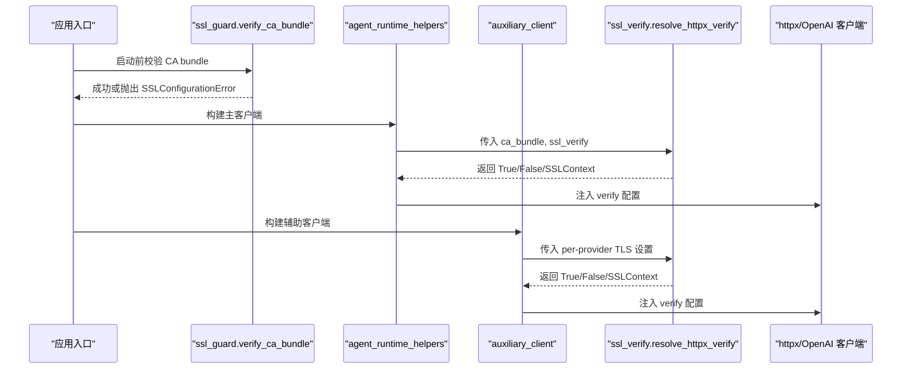
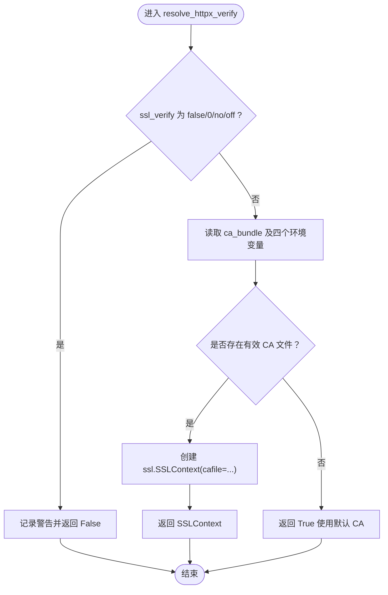
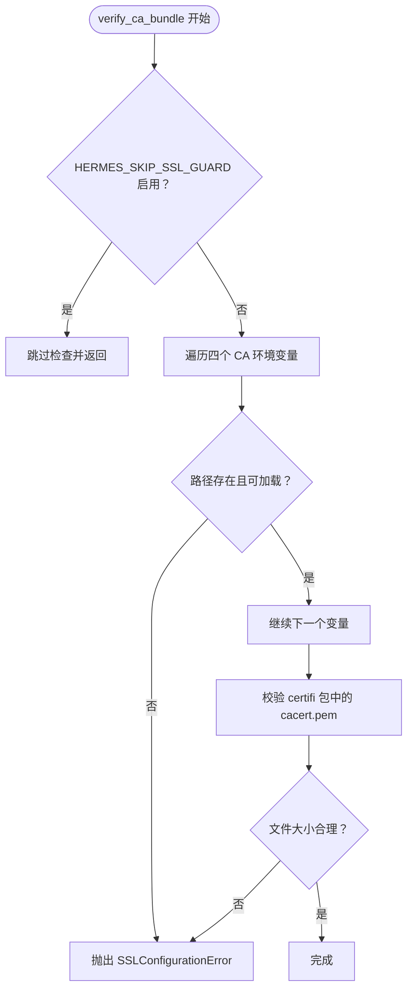
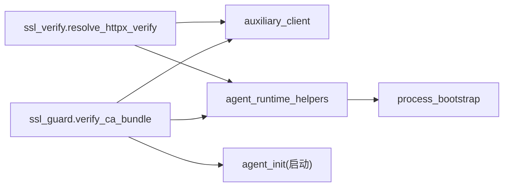

# SSL/TLS 配置

<cite>
**本文引用的文件**
- [agent/ssl_verify.py](file://agent/ssl_verify.py)
- [agent/ssl_guard.py](file://agent/ssl_guard.py)
- [agent/errors.py](file://agent/errors.py)
- [agent/auxiliary_client.py](file://agent/auxiliary_client.py)
- [agent/agent_runtime_helpers.py](file://agent/agent_runtime_helpers.py)
- [agent/process_bootstrap.py](file://agent/process_bootstrap.py)
- [tests/agent/test_ssl_verify.py](file://tests/agent/test_ssl_verify.py)
- [tests/agent/test_ssl_ca_guard.py](file://tests/agent/test_ssl_ca_guard.py)
- [docs/rca-ssl-cacert-post-git-pull.md](file://docs/rca-ssl-cacert-post-git-pull.md)
</cite>

## 目录
1. [简介](#简介)
2. [项目结构](#项目结构)
3. [核心组件](#核心组件)
4. [架构总览](#架构总览)
5. [详细组件分析](#详细组件分析)
6. [依赖关系分析](#依赖关系分析)
7. [性能与生产最佳实践](#性能与生产最佳实践)
8. [故障排除指南](#故障排除指南)
9. [监控指标建议](#监控指标建议)
10. [结论](#结论)

## 简介
本文件聚焦于 Hermes Agent 的 SSL/TLS 配置，重点说明证书验证机制、CA 包管理策略以及 HTTPS 连接安全。文档围绕 resolve_httpx_verify 函数展开，解释 ssl_verify 参数优先级、环境变量支持（HERMES_CA_BUNDLE、SSL_CERT_FILE、REQUESTS_CA_BUNDLE、CURL_CA_BUNDLE）与自定义 CA 包配置；同时给出证书验证失败的常见原因与解决方案，并提供生产环境的安全加固、性能优化与轮换建议，以及故障排除与监控指标配置指引。

## 项目结构
与 SSL/TLS 相关的关键代码集中在 agent 目录下：
- agent/ssl_verify.py：解析 httpx/OpenAI 客户端的 verify 行为，统一处理 ssl_verify、自定义 CA bundle 与环境变量。
- agent/ssl_guard.py：启动前校验 CA bundle 是否可用，避免后续网络调用出现模糊错误。
- agent/errors.py：定义 SSLConfigurationError，用于向上层暴露明确的 SSL 配置错误。
- agent/auxiliary_client.py：辅助客户端在创建 OpenAI/httpx 时复用 resolve_httpx_verify。
- agent/agent_runtime_helpers.py：运行时构造客户端时应用 TLS 设置。
- agent/process_bootstrap.py：进程级 keepalive HTTP 客户端构建，继承 TLS 设置。
- tests/agent/test_ssl_verify.py、tests/agent/test_ssl_ca_guard.py：覆盖核心逻辑与边界场景。
- docs/rca-ssl-cacert-post-git-pull.md：RCA 文档，记录更新后 CA bundle 损坏问题的根因与修复流程。

图表来源
- [agent/ssl_verify.py:22-63](file://agent/ssl_verify.py#L22-L63)
- [agent/ssl_guard.py:68-101](file://agent/ssl_guard.py#L68-L101)

章节来源
- [agent/ssl_verify.py:1-63](file://agent/ssl_verify.py#L1-L63)
- [agent/ssl_guard.py:1-101](file://agent/ssl_guard.py#L1-L101)
- [agent/errors.py:1-14](file://agent/errors.py#L1-L14)

## 核心组件
- resolve_httpx_verify：根据 ssl_verify、ca_bundle 和环境变量决定 httpx 的 verify 行为，返回布尔或 ssl.SSLContext。
- verify_ca_bundle：启动前校验显式 CA bundle 环境变量与内置 certifi 包中的 CA bundle 是否可加载且非空。
- SSLConfigurationError：统一的 SSL 配置异常类型，便于上层捕获并提示修复步骤。

章节来源
- [agent/ssl_verify.py:14-63](file://agent/ssl_verify.py#L14-L63)
- [agent/ssl_guard.py:28-101](file://agent/ssl_guard.py#L28-L101)
- [agent/errors.py:1-4](file://agent/errors.py#L1-L4)

## 架构总览
Hermes 在多处创建 HTTP 客户端（OpenAI SDK、httpx），所有客户端均通过统一的 TLS 解析逻辑获取 verify 配置，确保行为一致。启动阶段由 ssl_guard 提前发现 CA bundle 问题，避免进入业务逻辑后才抛出难以定位的错误。

图表来源
- [agent/ssl_guard.py:68-101](file://agent/ssl_guard.py#L68-L101)
- [agent/agent_runtime_helpers.py:2253-2265](file://agent/agent_runtime_helpers.py#L2253-L2265)
- [agent/auxiliary_client.py:141-166](file://agent/auxiliary_client.py#L141-L166)
- [agent/ssl_verify.py:22-63](file://agent/ssl_verify.py#L22-L63)

## 详细组件分析

### resolve_httpx_verify 工作原理
- 输入参数：
  - ca_bundle：每提供者的显式 CA bundle 路径（来自配置字段 ssl_ca_cert）。
  - ssl_verify：布尔或字符串形式的开关，false/0/no/off 表示禁用验证。
  - base_url：仅用于警告信息中指明目标端点。
- 优先级与行为：
  1) 若 ssl_verify 为 false 或等价字符串，直接返回 False 并记录警告（仅本地开发使用）。
  2) 否则尝试从 ca_bundle 或环境变量（HERMES_CA_BUNDLE、SSL_CERT_FILE、REQUESTS_CA_BUNDLE、CURL_CA_BUNDLE）中读取有效 CA 文件路径。
  3) 若找到有效文件，返回基于该文件的 ssl.SSLContext。
  4) 否则返回 True，使用系统/库默认 CA 集合。
- 返回值：bool 或 ssl.SSLContext，供 httpx/OpenAI 客户端作为 verify 参数使用。

图表来源
- [agent/ssl_verify.py:14-63](file://agent/ssl_verify.py#L14-L63)

章节来源
- [agent/ssl_verify.py:22-63](file://agent/ssl_verify.py#L22-L63)
- [tests/agent/test_ssl_verify.py:21-32](file://tests/agent/test_ssl_verify.py#L21-L32)

### ssl_guard 启动前校验
- 作用：在代理初始化阶段校验显式 CA bundle 环境变量与内置 certifi 包中的 CA bundle 是否可加载且非空。
- 关键行为：
  - 跳过条件：HERMES_SKIP_SSL_GUARD 设置为 1/true/yes/on 时跳过检查。
  - 校验顺序：依次检查 HERMES_CA_BUNDLE、SSL_CERT_FILE、REQUESTS_CA_BUNDLE、CURL_CA_BUNDLE；再校验 certifi.where() 指向的文件大小与可加载性。
  - 失败处理：抛出 SSLConfigurationError，附带修复提示（如重新安装依赖、修正环境变量）。
- 兼容处理：Windows truststore 环境下 get_ca_certs 可能不支持，已做兼容分支。

图表来源
- [agent/ssl_guard.py:28-101](file://agent/ssl_guard.py#L28-L101)
- [agent/errors.py:1-4](file://agent/errors.py#L1-L4)

章节来源
- [agent/ssl_guard.py:68-101](file://agent/ssl_guard.py#L68-L101)
- [tests/agent/test_ssl_ca_guard.py:12-75](file://tests/agent/test_ssl_ca_guard.py#L12-L75)

### 辅助客户端与运行时的 TLS 集成
- auxiliary_client：为压缩、视觉、标题生成等辅助任务创建 OpenAI/httpx 客户端时，调用 resolve_httpx_verify，并传入 per-provider 的 ssl_ca_cert 与 ssl_verify。
- agent_runtime_helpers：在主客户端构建时同样调用 resolve_httpx_verify，将结果注入到 httpx verify。
- process_bootstrap：构建 keepalive httpx 客户端时继承上述 TLS 设置，保证连接池级别的证书策略一致。

章节来源
- [agent/auxiliary_client.py:141-166](file://agent/auxiliary_client.py#L141-L166)
- [agent/agent_runtime_helpers.py:2253-2265](file://agent/agent_runtime_helpers.py#L2253-L2265)
- [agent/process_bootstrap.py:168-168](file://agent/process_bootstrap.py#L168-L168)

## 依赖关系分析
- 模块耦合：
  - ssl_verify 被 auxiliary_client 与 agent_runtime_helpers 复用，形成统一的 TLS 决策点。
  - ssl_guard 在启动阶段独立执行，不依赖具体客户端实现，但影响后续所有网络调用。
- 外部依赖：
  - 依赖 Python 标准库 ssl 模块创建 SSLContext。
  - 依赖 certifi 包提供的系统 CA bundle。
- 潜在循环依赖：无直接循环导入；TLS 解析与校验解耦清晰。

图表来源
- [agent/ssl_verify.py:22-63](file://agent/ssl_verify.py#L22-L63)
- [agent/ssl_guard.py:68-101](file://agent/ssl_guard.py#L68-L101)
- [agent/auxiliary_client.py:141-166](file://agent/auxiliary_client.py#L141-L166)
- [agent/agent_runtime_helpers.py:2253-2265](file://agent/agent_runtime_helpers.py#L2253-L2265)
- [agent/process_bootstrap.py:168-168](file://agent/process_bootstrap.py#L168-L168)

章节来源
- [agent/ssl_verify.py:22-63](file://agent/ssl_verify.py#L22-L63)
- [agent/ssl_guard.py:68-101](file://agent/ssl_guard.py#L68-L101)

## 性能与生产最佳实践
- 证书轮换
  - 企业 CA 轮换：更新 CA bundle 文件后，重启进程以加载新的 SSLContext；或使用支持热更新的部署方式。
  - 自动化：通过配置管理工具（如 Ansible、Kubernetes ConfigMap）推送新 CA bundle，并在变更事件触发服务重启或滚动更新。
- 性能优化
  - 使用固定 CA bundle：在生产环境中明确指定 CA bundle 路径，减少每次请求对系统 CA 查找的开销。
  - Keepalive 连接：结合 process_bootstrap 的 keepalive 客户端，降低握手成本。
  - 避免频繁重建 SSLContext：尽量复用客户端实例，减少上下文创建次数。
- 安全加固
  - 禁止在生产环境使用 ssl_verify=false；仅在受控本地开发环境使用。
  - 严格校验 CA bundle 完整性：利用 ssl_guard 在启动时检测缺失、空文件或不可加载的情况。
  - 最小权限：限制 CA bundle 文件访问权限，防止篡改。
- 环境变量约定
  - 优先使用 per-provider 配置（ssl_ca_cert、ssl_verify），其次使用 HERMES_CA_BUNDLE，最后回退至系统默认 CA。
  - 如需全局生效，可同时设置 SSL_CERT_FILE、REQUESTS_CA_BUNDLE、CURL_CA_BUNDLE，但需确保一致性。

[本节为通用指导，无需特定文件引用]

## 故障排除指南
- 常见问题与原因
  - 证书过期：服务端证书未更新导致握手失败。
  - 域名不匹配：证书 CN/SAN 与实际域名不一致。
  - 中间人攻击检测：代理或防火墙拦截并替换证书，导致链校验失败。
  - CA bundle 缺失或损坏：环境变量指向不存在或空文件，或 venv 更新不完整导致 certifi 包损坏。
- 诊断步骤
  - 检查环境变量：确认 HERMES_CA_BUNDLE、SSL_CERT_FILE、REQUESTS_CA_BUNDLE、CURL_CA_BUNDLE 指向有效文件。
  - 运行诊断：使用 hermes doctor 查看 SSL/CA 证书状态。
  - 查看日志：关注 resolve_httpx_verify 的警告信息与 ssl_guard 的异常输出。
- 修复方案
  - 重新安装依赖：python -m pip install --force-reinstall certifi openai httpx。
  - 修正环境变量：指向正确的 CA bundle 路径或移除错误配置。
  - 绕过检查（仅限受控环境）：设置 HERMES_SKIP_SSL_GUARD=1，但不推荐在生产使用。
- RCA 参考
  - 更新后 CA bundle 损坏的典型现象与恢复流程参见 RCA 文档。

章节来源
- [docs/rca-ssl-cacert-post-git-pull.md:1-55](file://docs/rca-ssl-cacert-post-git-pull.md#L1-L55)
- [agent/ssl_guard.py:28-101](file://agent/ssl_guard.py#L28-L101)
- [agent/ssl_verify.py:39-63](file://agent/ssl_verify.py#L39-L63)

## 监控指标建议
- 连接与握手
  - https_request_total：按目标域名与状态码分组的请求计数。
  - tls_handshake_duration_seconds：TLS 握手耗时分布（p50/p95/p99）。
  - tls_handshake_failures_total：握手失败次数，按错误类型分组（证书过期、域名不匹配、CA 不可用等）。
- 证书与 CA
  - ca_bundle_valid：布尔指标，表示当前 CA bundle 是否通过启动前校验。
  - ca_bundle_last_updated：最近一次 CA bundle 更新时间戳。
- 客户端与重试
  - provider_request_duration_seconds：各提供者的请求耗时。
  - retry_count_per_request：每次请求的重试次数。
- 告警规则
  - tls_handshake_failures_rate > 阈值：持续升高时触发告警。
  - ca_bundle_valid == false：启动失败或配置错误。
  - https_request_errors 突增：结合上游错误分类进行排查。

[本节为通用指导，无需特定文件引用]

## 结论
Hermes Agent 通过统一的 TLS 解析与启动前校验，确保所有 HTTPS 客户端在一致的证书策略下工作。resolve_httpx_verify 提供了清晰的优先级与环境变量支持，ssl_guard 在启动阶段提前暴露 CA bundle 问题，降低运行时不确定性。生产环境应严格禁用 ssl_verify=false，采用固定 CA bundle、keepalive 连接与完善的监控告警，以实现高可用与安全可控的 HTTPS 通信。