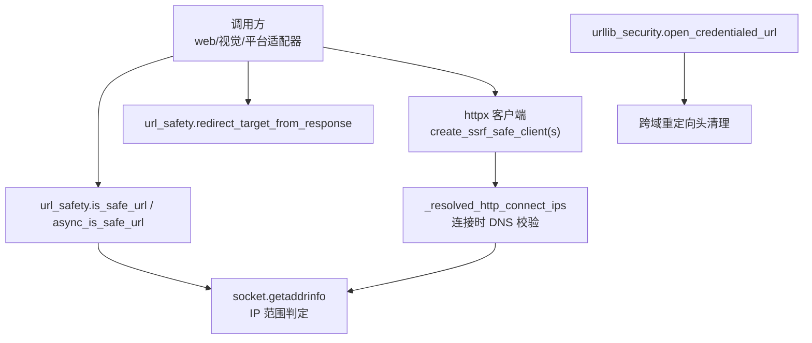
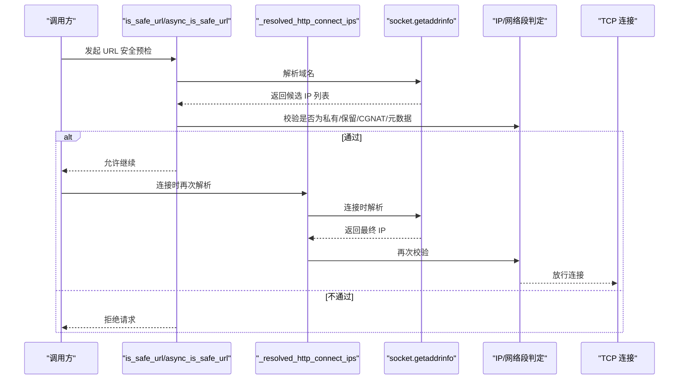
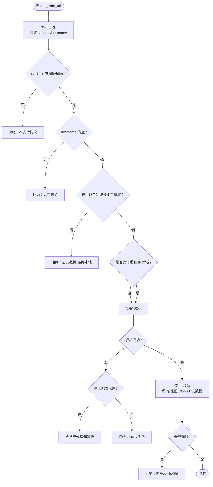
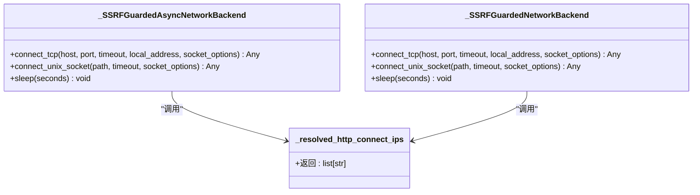
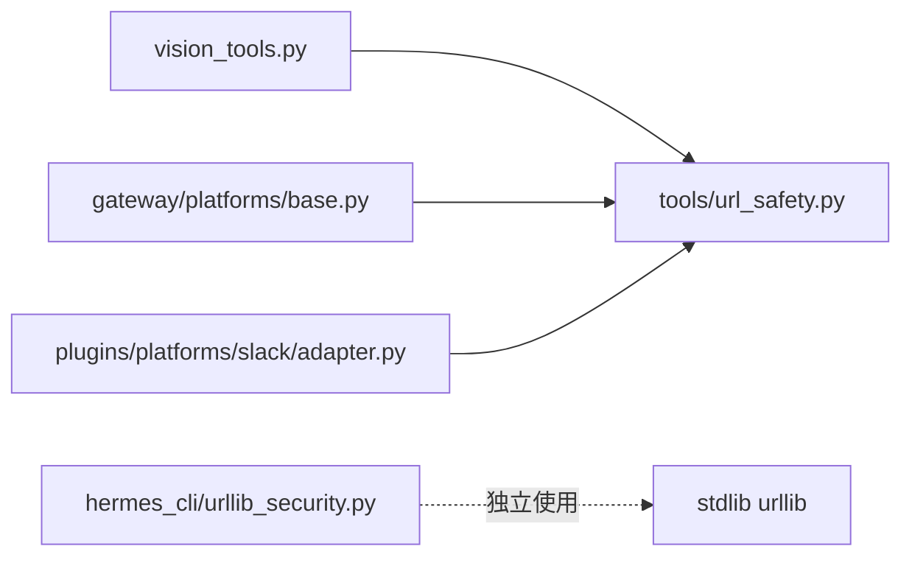

# URL 安全检查

<cite>
**本文引用的文件**
- [tools/url_safety.py](file://tools/url_safety.py)
- [tests/tools/test_url_safety.py](file://tests/tools/test_url_safety.py)
- [hermes_cli/urllib_security.py](file://hermes_cli/urllib_security.py)
- [gateway/platforms/base.py](file://gateway/platforms/base.py)
- [plugins/platforms/slack/adapter.py](file://plugins/platforms/slack/adapter.py)
- [tools/vision_tools.py](file://tools/vision_tools.py)
</cite>

## 目录
1. [简介](#简介)
2. [项目结构](#项目结构)
3. [核心组件](#核心组件)
4. [架构总览](#架构总览)
5. [详细组件分析](#详细组件分析)
6. [依赖关系分析](#依赖关系分析)
7. [性能考量](#性能考量)
8. [故障排查指南](#故障排查指南)
9. [结论](#结论)
10. [附录](#附录)

## 简介
本文件系统性说明 Hermes Agent 的 URL 安全检查机制，覆盖以下主题：
- URL 白名单与域名解析安全
- 协议验证（仅允许 HTTP/HTTPS）
- 内部网络访问控制与 IP 地址校验
- SSRF（服务器端请求伪造）防护、内网探测阻止、敏感信息泄露防护
- 企业环境中的代理配置、DNS 解析限制与网络隔离策略
- 安全审计日志记录与异常处理机制

该机制通过“预检查 + 连接时校验”的双层防线，确保即使存在 DNS 重绑定或重定向攻击，也不会连接到受保护的内网或云元数据地址。

## 项目结构
URL 安全能力由以下模块协同实现：
- 核心策略与工具：tools/url_safety.py
- 标准库 urllib 的安全封装：hermes_cli/urllib_security.py
- 平台侧对重定向目标的安全校验：gateway/platforms/base.py、plugins/platforms/slack/adapter.py
- 视觉下载等场景的异步安全校验：tools/vision_tools.py
- 单元测试覆盖：tests/tools/test_url_safety.py

图表来源
- [tools/url_safety.py:415-528](file://tools/url_safety.py#L415-L528)
- [tools/url_safety.py:539-595](file://tools/url_safety.py#L539-L595)
- [tools/url_safety.py:825-875](file://tools/url_safety.py#L825-L875)
- [hermes_cli/urllib_security.py:31-132](file://hermes_cli/urllib_security.py#L31-L132)

章节来源
- [tools/url_safety.py:1-875](file://tools/url_safety.py#L1-L875)
- [hermes_cli/urllib_security.py:1-140](file://hermes_cli/urllib_security.py#L1-L140)

## 核心组件
- 协议与域名白名单
  - 仅允许 http/https 协议；其他协议一律拒绝。
  - 内置“始终禁止”的主机名集合（如云元数据主机），无论配置如何均被拦截。
- IP 地址与网络段校验
  - 阻断私有、回环、链路本地、组播、未指定、CGNAT 等地址。
  - 针对 IPv4-mapped IPv6 做特殊处理，防止绕过。
- 全局开关与安全基线
  - 支持通过环境变量或配置文件开启“允许私有 IP 解析”，但云元数据地址永远禁止。
- 连接时校验
  - 在 TCP 连接建立前再次解析并校验 IP，关闭 DNS 重绑定窗口。
- 重定向安全
  - 从响应中抽取重定向目标（优先 Location 头），并在后续流程中进行安全校验。
- 标准库 urllib 安全封装
  - 跨域重定向时自动剥离非白名单头部，避免凭据泄露。

章节来源
- [tools/url_safety.py:106-169](file://tools/url_safety.py#L106-L169)
- [tools/url_safety.py:180-210](file://tools/url_safety.py#L180-L210)
- [tools/url_safety.py:220-287](file://tools/url_safety.py#L220-L287)
- [tools/url_safety.py:289-308](file://tools/url_safety.py#L289-L308)
- [tools/url_safety.py:311-407](file://tools/url_safety.py#L311-L407)
- [tools/url_safety.py:415-528](file://tools/url_safety.py#L415-L528)
- [tools/url_safety.py:539-595](file://tools/url_safety.py#L539-L595)
- [tools/url_safety.py:850-875](file://tools/url_safety.py#L850-L875)
- [hermes_cli/urllib_security.py:31-132](file://hermes_cli/urllib_security.py#L31-L132)

## 架构总览
下图展示了从调用方到网络连接的完整安全路径，包括预检查、连接时校验与重定向防护。

图表来源
- [tools/url_safety.py:415-528](file://tools/url_safety.py#L415-L528)
- [tools/url_safety.py:539-595](file://tools/url_safety.py#L539-L595)

## 详细组件分析

### 组件 A：URL 安全预检查（is_safe_url / async_is_safe_url）
- 功能要点
  - 仅允许 http/https 协议。
  - 强制阻断云元数据主机名与 IP（不受全局开关影响）。
  - 根据全局开关决定是否放行私有/内部 IP。
  - 当检测到代理环境变量且 DNS 解析失败时，将 DNS 解析委托给代理，而非直接拒绝。
  - 异步版本在事件循环外执行 DNS 解析，避免阻塞。
- 关键行为
  - 失败即闭（fail-closed）：解析失败、异常、非法 URL 一律拒绝。
  - 日志记录：所有拒绝与关键决策点均有日志输出，便于审计。

图表来源
- [tools/url_safety.py:415-528](file://tools/url_safety.py#L415-L528)

章节来源
- [tools/url_safety.py:415-528](file://tools/url_safety.py#L415-L528)
- [tests/tools/test_url_safety.py:62-172](file://tests/tools/test_url_safety.py#L62-L172)

### 组件 B：连接时校验（_resolved_http_connect_ips）
- 功能要点
  - 在 TCP 连接建立前再次解析并校验 IP，关闭 DNS 重绑定漏洞。
  - 限制最多尝试的 IP 数量，避免恶意多 IP 放大攻击面。
  - 对 Unix Socket 连接直接拒绝。
- 异常类型
  - 抛出专用异常以区分普通连接错误与安全拦截。

图表来源
- [tools/url_safety.py:539-595](file://tools/url_safety.py#L539-L595)
- [tools/url_safety.py:598-695](file://tools/url_safety.py#L598-L695)

章节来源
- [tools/url_safety.py:539-595](file://tools/url_safety.py#L539-L595)
- [tests/tools/test_url_safety.py:174-240](file://tests/tools/test_url_safety.py#L174-L240)

### 组件 C：httpx 客户端安全注入
- 功能要点
  - 提供同步/异步工厂方法创建已注入 SSRF 保护的 httpx 客户端。
  - 通过替换底层网络后端，使每次 TCP 连接都经过校验。
  - 保持代理挂载与环境变量生效，不影响既有代理配置。
- 使用建议
  - 所有需要直接发起 HTTP(S) 请求的代码路径应使用这些工厂方法创建客户端。

章节来源
- [tools/url_safety.py:707-847](file://tools/url_safety.py#L707-L847)
- [tests/tools/test_url_safety.py:174-240](file://tests/tools/test_url_safety.py#L174-L240)

### 组件 D：重定向目标安全（redirect_target_from_response）
- 功能要点
  - 在 httpx 响应钩子中，优先从 Location 头解析重定向目标，其次回退到 next_request。
  - 用于关闭“重定向到内网/元数据”的攻击面。
- 集成位置
  - 平台适配器与视觉工具在下载/抓取资源时调用，确保重定向目标同样受到安全校验。

章节来源
- [tools/url_safety.py:850-875](file://tools/url_safety.py#L850-L875)
- [gateway/platforms/base.py:690-691](file://gateway/platforms/base.py#L690-L691)
- [plugins/platforms/slack/adapter.py:4080-4081](file://plugins/platforms/slack/adapter.py#L4080-L4081)
- [tools/vision_tools.py:505-506](file://tools/vision_tools.py#L505-L506)
- [tools/vision_tools.py:1810-1811](file://tools/vision_tools.py#L1810-L1811)
- [tests/tools/test_url_safety.py:472-499](file://tests/tools/test_url_safety.py#L472-L499)

### 组件 E：标准库 urllib 安全封装（open_credentialed_url）
- 功能要点
  - 在跨域重定向时，仅保留安全的头部（如 accept、user-agent），移除可能携带凭据的自定义头部。
  - 通过替换默认 opener 的重定向处理器，保证重定向过程中的凭据安全。
- 适用场景
  - 使用 stdlib urllib 进行网络请求的场景，避免凭据随重定向泄露到其他域。

章节来源
- [hermes_cli/urllib_security.py:31-132](file://hermes_cli/urllib_security.py#L31-L132)

## 依赖关系分析
- 模块耦合
  - url_safety 为核心，被平台适配器、视觉工具等调用。
  - urllib_security 独立封装 stdlib 安全策略，降低误用风险。
- 外部依赖
  - 基于 httpx/httpcore 的网络后端替换实现连接时校验。
  - 使用 socket.getaddrinfo 进行 DNS 解析。
- 潜在循环依赖
  - 当前设计通过延迟导入（import inside function）避免启动期循环依赖。

图表来源
- [tools/vision_tools.py:505-506](file://tools/vision_tools.py#L505-L506)
- [tools/vision_tools.py:1810-1811](file://tools/vision_tools.py#L1810-L1811)
- [gateway/platforms/base.py:690-691](file://gateway/platforms/base.py#L690-L691)
- [plugins/platforms/slack/adapter.py:4080-4081](file://plugins/platforms/slack/adapter.py#L4080-L4081)
- [hermes_cli/urllib_security.py:1-140](file://hermes_cli/urllib_security.py#L1-L140)

章节来源
- [tools/url_safety.py:1-875](file://tools/url_safety.py#L1-L875)
- [hermes_cli/urllib_security.py:1-140](file://hermes_cli/urllib_security.py#L1-L140)

## 性能考量
- DNS 解析开销
  - 预检查与连接时两次解析，增加少量延迟；异步版本通过线程池避免阻塞事件循环。
- 候选 IP 上限
  - 连接时最多尝试固定数量的 IP，防止恶意多 IP 放大攻击面。
- 缓存策略
  - 全局开关结果进程级缓存，减少配置读取开销。
- 代理环境优化
  - 当配置代理且 DNS 失败时，将解析委托给代理，避免不必要的失败重试。

[本节为通用指导，无需特定文件引用]

## 故障排查指南
- 常见症状与定位
  - 请求被拒绝：检查日志中“Blocked request — unsupported URL scheme”“Blocked request to private/internal address”等提示。
  - DNS 解析失败：确认是否配置了代理；若配置了代理，系统会放行至代理侧解析。
  - 重定向到内网：检查是否在响应钩子中调用了 redirect_target_from_response，并确保后续对重定向目标进行安全校验。
- 配置问题
  - 如需允许私有 IP 解析，设置环境变量或配置文件开关；注意云元数据地址永远禁止。
- 异常类型
  - 连接时安全拦截会抛出专用异常，便于上层捕获并记录审计日志。

章节来源
- [tools/url_safety.py:415-528](file://tools/url_safety.py#L415-L528)
- [tools/url_safety.py:539-595](file://tools/url_safety.py#L539-L595)
- [tests/tools/test_url_safety.py:85-143](file://tests/tools/test_url_safety.py#L85-L143)
- [tests/tools/test_url_safety.py:385-438](file://tests/tools/test_url_safety.py#L385-L438)

## 结论
Hermes Agent 的 URL 安全检查采用“协议白名单 + 域名/IP 黑名单 + 连接时校验 + 重定向防护”的多层防御体系，有效缓解 SSRF、内网探测与凭据泄露风险。通过可配置的全局开关与严格的云元数据保护基线，既满足企业环境的灵活性需求，又确保安全底线不被突破。建议在所有网络请求路径统一使用提供的安全客户端与校验函数，并配合日志审计与监控告警，形成闭环的安全运营。

[本节为总结性内容，无需特定文件引用]

## 附录

### 支持的协议与限制
- 仅允许 http/https；其他协议一律拒绝。
- 对于 IRI（含非 ASCII 字符）的 URL，工具会进行规范化编码，确保兼容浏览器与 HTTP 客户端。

章节来源
- [tools/url_safety.py:58-103](file://tools/url_safety.py#L58-L103)
- [tools/url_safety.py:415-432](file://tools/url_safety.py#L415-L432)

### 域名白名单与信任主机
- 始终禁止的主机名：云元数据相关主机（例如 Google Cloud 元数据）。
- 信任主机例外：特定 HTTPS 主机允许解析到内部/基准测试 IP（例如 QQ 多媒体域名），仅限精确匹配且必须为 HTTPS。

章节来源
- [tools/url_safety.py:163-202](file://tools/url_safety.py#L163-L202)
- [tests/tools/test_url_safety.py:148-158](file://tests/tools/test_url_safety.py#L148-L158)

### IP 地址与网络段校验
- 阻断范围：私有、回环、链路本地、组播、未指定、CGNAT 以及云元数据 IP。
- IPv4-mapped IPv6：特殊处理，防止绕过。

章节来源
- [tools/url_safety.py:180-210](file://tools/url_safety.py#L180-L210)
- [tools/url_safety.py:289-308](file://tools/url_safety.py#L289-L308)
- [tests/tools/test_url_safety.py:242-269](file://tests/tools/test_url_safety.py#L242-L269)

### 全局开关与配置
- 环境变量：HERMES_ALLOW_PRIVATE_URLS
- 配置文件：security.allow_private_urls（推荐）、browser.allow_private_urls（兼容）
- 多 Profile 隔离：每个 Profile 独立解析开关，避免互相影响

章节来源
- [tools/url_safety.py:220-287](file://tools/url_safety.py#L220-L287)
- [tests/tools/test_url_safety.py:272-339](file://tests/tools/test_url_safety.py#L272-L339)

### 代理配置与 DNS 解析限制
- 代理环境变量：HTTP_PROXY、HTTPS_PROXY、ALL_PROXY 及其小写形式
- 行为：当配置代理且 DNS 解析失败时，将解析委托给代理；否则按失败即闭策略拒绝
- 注意：云元数据主机名与 IP 在任何情况下均被阻断

章节来源
- [tools/url_safety.py:43-55](file://tools/url_safety.py#L43-L55)
- [tools/url_safety.py:447-474](file://tools/url_safety.py#L447-L474)
- [tests/tools/test_url_safety.py:93-138](file://tests/tools/test_url_safety.py#L93-L138)

### 敏感查询参数与凭据泄露防护
- 检测敏感查询参数名（如 token、api_key、password 等），用于提醒或下游处理
- urllib 安全封装在跨域重定向时剥离非白名单头部，防止凭据泄露

章节来源
- [tools/url_safety.py:106-161](file://tools/url_safety.py#L106-L161)
- [hermes_cli/urllib_security.py:31-132](file://hermes_cli/urllib_security.py#L31-L132)

### 安全审计日志与异常处理
- 所有拒绝与关键决策点均有日志记录，便于审计与排障
- 连接时安全拦截抛出专用异常，便于上层捕获并记录审计日志

章节来源
- [tools/url_safety.py:311-407](file://tools/url_safety.py#L311-L407)
- [tools/url_safety.py:539-595](file://tools/url_safety.py#L539-L595)
- [tests/tools/test_url_safety.py:85-143](file://tests/tools/test_url_safety.py#L85-L143)