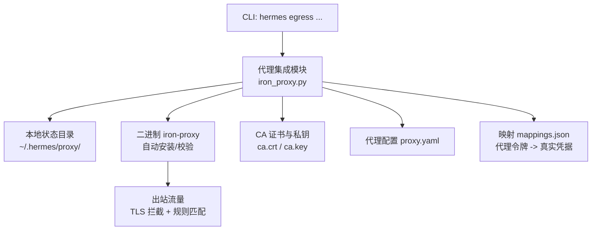
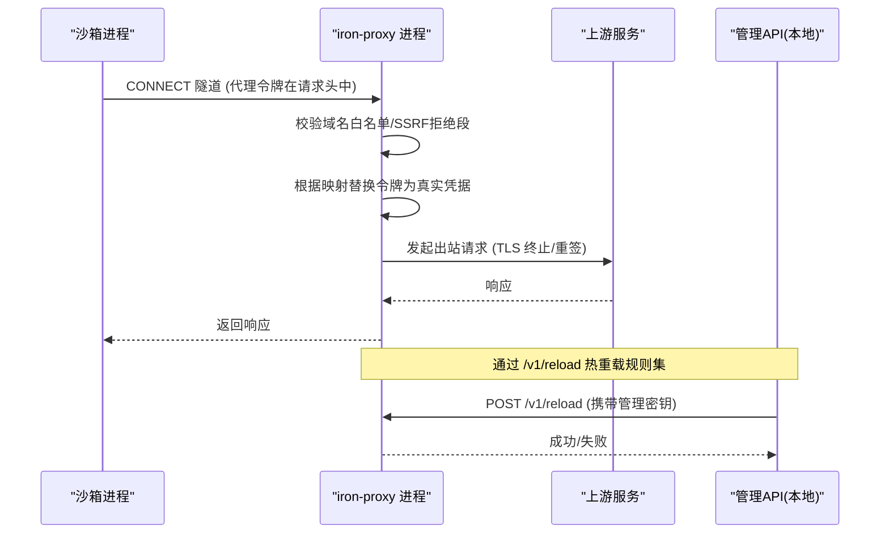
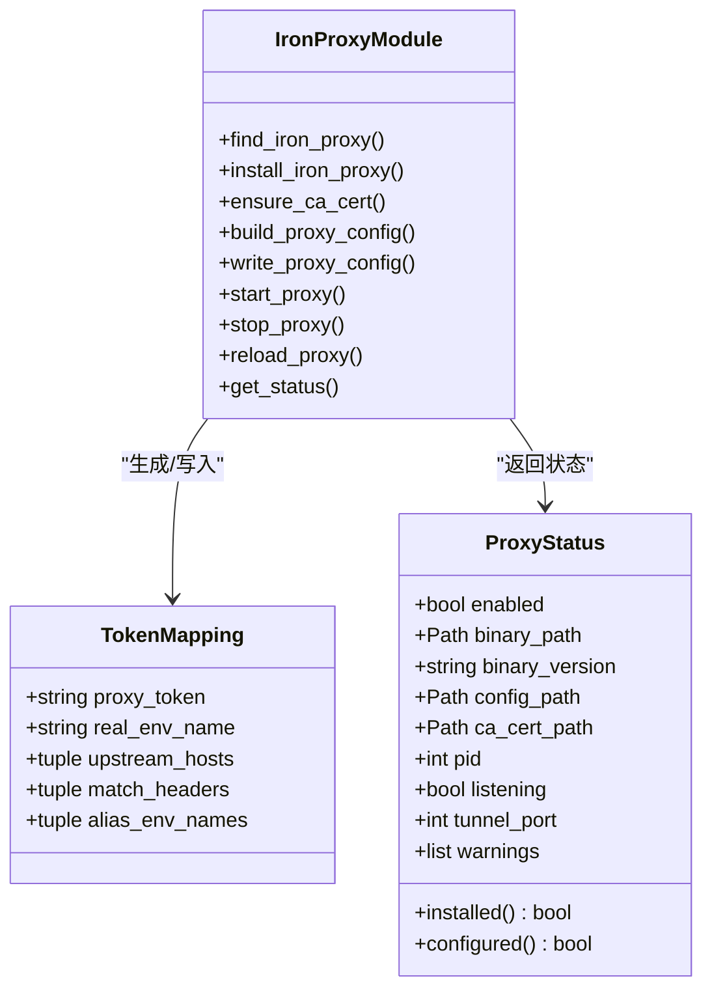
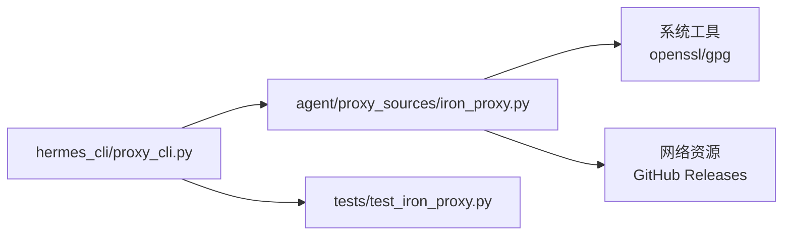

# 代理安全配置

<cite>
**本文引用的文件**
- [agent/proxy_sources/iron_proxy.py](file://agent/proxy_sources/iron_proxy.py)
- [hermes_cli/proxy_cli.py](file://hermes_cli/proxy_cli.py)
- [tests/test_iron_proxy.py](file://tests/test_iron_proxy.py)
</cite>

## 目录
1. [简介](#简介)
2. [项目结构](#项目结构)
3. [核心组件](#核心组件)
4. [架构总览](#架构总览)
5. [详细组件分析](#详细组件分析)
6. [依赖关系分析](#依赖关系分析)
7. [性能考虑](#性能考虑)
8. [故障排查指南](#故障排查指南)
9. [结论](#结论)
10. [附录](#附录)

## 简介
本文件面向企业级部署与运维，系统性说明基于 Iron Proxy 的出站流量代理安全配置。内容涵盖：
- 代理发现机制、认证方式（Bearer Token、非 Authorization 头）、连接生命周期管理
- TLS 加密与证书体系（本地 CA、出站拦截）
- 访问控制（默认允许列表、SSRF 防护、回退策略）
- 凭据安全管理（环境变量与 Bitwarden 集成、最小化进程环境）
- 高可用与可观测性建议（热重载、健康检查、日志审计预留位）
- 故障转移与监控告警实践
- 性能调优与常见问题解决方案

## 项目结构
与代理安全相关的关键代码集中在以下位置：
- 代理集成实现：agent/proxy_sources/iron_proxy.py
- CLI 管理与交互：hermes_cli/proxy_cli.py
- 单元测试覆盖：tests/test_iron_proxy.py

图表来源
- [agent/proxy_sources/iron_proxy.py:1-120](file://agent/proxy_sources/iron_proxy.py#L1-L120)
- [hermes_cli/proxy_cli.py:1-130](file://hermes_cli/proxy_cli.py#L1-L130)

章节来源
- [agent/proxy_sources/iron_proxy.py:1-120](file://agent/proxy_sources/iron_proxy.py#L1-L120)
- [hermes_cli/proxy_cli.py:1-130](file://hermes_cli/proxy_cli.py#L1-L130)

## 核心组件
- 代理二进制管理：自动下载、版本固定、完整性校验（SHA-256 与可选 GPG 签名验证）
- CA 证书生成与管理：用于出站 TLS 拦截与重写请求头
- 令牌映射与凭据注入：将沙箱可见的“代理令牌”替换为上游真实凭据
- 访问控制：默认允许的主机列表、SSRF 拒绝段、额外主机扩展
- 子进程环境隔离：仅放行必要环境变量，剥离代理相关变量防止递归
- 管理 API：本地回环监听，支持无中断热重载规则集
- CLI 工作流：安装、设置、启动、停止、重启、热重载、状态查看、禁用

章节来源
- [agent/proxy_sources/iron_proxy.py:83-125](file://agent/proxy_sources/iron_proxy.py#L83-L125)
- [agent/proxy_sources/iron_proxy.py:254-285](file://agent/proxy_sources/iron_proxy.py#L254-L285)
- [hermes_cli/proxy_cli.py:36-130](file://hermes_cli/proxy_cli.py#L36-L130)

## 架构总览
Iron Proxy 作为出站防火墙，位于沙箱与互联网之间，执行：
- 出站域名白名单校验
- 请求头/查询参数中的凭据替换（Bearer Token 或特定头部）
- TLS 终止与重放（由本地 CA 签发短期叶证书）
- SSRF 防护（拒绝内网/云元数据等地址段）
- 管理接口热重载（仅本地回环，需 Bearer Key）

图表来源
- [agent/proxy_sources/iron_proxy.py:108-124](file://agent/proxy_sources/iron_proxy.py#L108-L124)
- [agent/proxy_sources/iron_proxy.py:131-200](file://agent/proxy_sources/iron_proxy.py#L131-L200)
- [hermes_cli/proxy_cli.py:690-716](file://hermes_cli/proxy_cli.py#L690-L716)

## 详细组件分析

### 代理发现与安装
- 优先使用受管副本（~/.hermes/bin），其次 PATH 查找
- 若缺失且启用自动安装，则从官方发布页下载并校验
- 校验流程：
  - SHA-256 与发布清单比对
  - 可选 GPG 签名验证（gpg 不可用时降级为仅 SHA-256）
- 提取时采用安全过滤，避免路径穿越与符号链接攻击

章节来源
- [agent/proxy_sources/iron_proxy.py:436-546](file://agent/proxy_sources/iron_proxy.py#L436-L546)
- [agent/proxy_sources/iron_proxy.py:559-629](file://agent/proxy_sources/iron_proxy.py#L559-L629)
- [agent/proxy_sources/iron_proxy.py:653-675](file://agent/proxy_sources/iron_proxy.py#L653-L675)

### TLS 与证书体系
- 首次运行生成自签 CA（ca.crt/ca.key），用于出站 TLS 拦截
- 使用 openssl 生成 4096 位 RSA 私钥与有效期较长的根证书
- 文件权限严格限制（目录 0o700，私钥 0o600），原子写入避免 TOCTOU
- 注意：当前版本不向二进制配置注入审计路径字段，但会预创建审计日志文件以便后续升级

章节来源
- [agent/proxy_sources/iron_proxy.py:730-800](file://agent/proxy_sources/iron_proxy.py#L730-L800)
- [hermes_cli/proxy_cli.py:391-435](file://hermes_cli/proxy_cli.py#L391-L435)

### 令牌映射与凭据注入
- 支持两类认证：
  - Authorization Bearer Token（OpenAI、Anthropic、Groq、Together、DeepSeek、Mistral、X.AI、Nous 等）
  - 非 Authorization 头部（如 Anthropic 原生 x-api-key、Azure OpenAI api-key、Google Gemini x-goog-api-key）
- 映射包含：
  - 代理令牌（沙箱可见）
  - 真实凭据环境变量名（iron-proxy 在出站时读取）
  - 上游主机匹配规则
  - 匹配头部集合（可多值）
  - 别名环境变量（兼容不同 SDK 命名）
- 凭据来源：
  - 环境变量（默认）
  - Bitwarden Secrets Manager（可配置项目 ID、访问令牌环境变量）
- 安全要点：
  - 子进程环境最小化，剥离 HTTP(S)/ALL_PROXY/NO_PROXY 等变量，防止递归代理
  - 管理密钥通过环境变量注入，仅本地回环监听

章节来源
- [agent/proxy_sources/iron_proxy.py:146-223](file://agent/proxy_sources/iron_proxy.py#L146-L223)
- [agent/proxy_sources/iron_proxy.py:254-285](file://agent/proxy_sources/iron_proxy.py#L254-L285)
- [hermes_cli/proxy_cli.py:186-259](file://hermes_cli/proxy_cli.py#L186-L259)
- [hermes_cli/proxy_cli.py:557-646](file://hermes_cli/proxy_cli.py#L557-L646)

### 访问控制与安全边界
- 默认允许的主机列表（AI 推理常用域名）
- 可通过配置追加额外允许主机
- 默认 SSRF 拒绝段（回环、链路本地、RFC1918、CGNAT、IPv4 映射 IPv6、基准范围等）
- 绑定策略：仅本地回环暴露管理接口，降低暴露面
- Docker 后端强制：当代理启用但未运行时，阻止启动沙箱，确保出站被管控

章节来源
- [agent/proxy_sources/iron_proxy.py:131-144](file://agent/proxy_sources/iron_proxy.py#L131-L144)
- [agent/proxy_sources/iron_proxy.py:226-251](file://agent/proxy_sources/iron_proxy.py#L226-L251)
- [hermes_cli/proxy_cli.py:386-419](file://hermes_cli/proxy_cli.py#L386-L419)

### 管理 API 与热重载
- 管理监听端口偏移：tunnel_port + 2
- 需要 Bearer Key（HERMES_IRON_PROXY_MGMT_KEY），仅本地回环
- 通过 POST /v1/reload 热重载规则集，无需重启，不丢连接
- 新增上游凭据（如 Bitwarden 旋转）仍需 restart，因为守护进程在启动时读取自身环境

章节来源
- [agent/proxy_sources/iron_proxy.py:108-124](file://agent/proxy_sources/iron_proxy.py#L108-L124)
- [hermes_cli/proxy_cli.py:690-716](file://hermes_cli/proxy_cli.py#L690-L716)

### CLI 工作流与最佳实践
- install：下载并安装固定版本的 iron-proxy 二进制
- setup：交互式向导，完成安装、CA 生成、令牌铸造、配置写入；支持 --from-bitwarden、--rotate-tokens、--restart 等
- start/restart：启动或重启守护进程，支持 Bitwarden 凭据刷新
- reload：热重载规则集
- status：展示代理状态、映射、未覆盖提供者警告
- disable：关闭代理集成（不影响已运行的守护进程）

章节来源
- [hermes_cli/proxy_cli.py:36-130](file://hermes_cli/proxy_cli.py#L36-L130)
- [hermes_cli/proxy_cli.py:137-543](file://hermes_cli/proxy_cli.py#L137-L543)
- [hermes_cli/proxy_cli.py:546-716](file://hermes_cli/proxy_cli.py#L546-L716)

### 类图（数据模型与关系）

图表来源
- [agent/proxy_sources/iron_proxy.py:299-352](file://agent/proxy_sources/iron_proxy.py#L299-L352)
- [agent/proxy_sources/iron_proxy.py:436-546](file://agent/proxy_sources/iron_proxy.py#L436-L546)
- [agent/proxy_sources/iron_proxy.py:730-800](file://agent/proxy_sources/iron_proxy.py#L730-L800)

## 依赖关系分析
- CLI 层依赖代理集成模块进行命令处理与状态输出
- 代理集成模块依赖系统工具（openssl、gpg）与外部资源（GitHub Releases）
- 守护进程通过管理 API 提供热重载能力，CLI 调用该接口更新规则
- 测试用例对纯函数表面、安装路径、子进程生命周期进行隔离验证

图表来源
- [hermes_cli/proxy_cli.py:1-130](file://hermes_cli/proxy_cli.py#L1-L130)
- [agent/proxy_sources/iron_proxy.py:436-546](file://agent/proxy_sources/iron_proxy.py#L436-L546)
- [tests/test_iron_proxy.py:1-120](file://tests/test_iron_proxy.py#L1-L120)

章节来源
- [hermes_cli/proxy_cli.py:1-130](file://hermes_cli/proxy_cli.py#L1-L130)
- [agent/proxy_sources/iron_proxy.py:436-546](file://agent/proxy_sources/iron_proxy.py#L436-L546)
- [tests/test_iron_proxy.py:1-120](file://tests/test_iron_proxy.py#L1-L120)

## 性能考虑
- 版本缓存：对二进制版本探测结果进行缓存，减少重复子进程调用
- 最小化环境变量：仅传递必要的环境变量给子进程，降低启动开销与泄露风险
- 热重载：通过管理 API 更新规则，避免重启带来的连接中断与冷启动成本
- 默认拒绝段：提前拒绝高风险目标地址，减少无效出站尝试
- 审计日志预留：预创建审计日志文件，便于后续升级后按请求记录审计

章节来源
- [agent/proxy_sources/iron_proxy.py:288-291](file://agent/proxy_sources/iron_proxy.py#L288-L291)
- [agent/proxy_sources/iron_proxy.py:254-285](file://agent/proxy_sources/iron_proxy.py#L254-L285)
- [hermes_cli/proxy_cli.py:690-716](file://hermes_cli/proxy_cli.py#L690-L716)
- [hermes_cli/proxy_cli.py:391-435](file://hermes_cli/proxy_cli.py#L391-L435)

## 故障排查指南
- 二进制缺失或版本不匹配：使用 install 重新安装，确认版本固定与校验通过
- CA 生成失败：确保系统存在 openssl，检查权限与磁盘空间
- 无法启动守护进程：检查端口占用、配置文件合法性、Bitwarden 凭据可用性
- 热重载失败：确认管理密钥与环境变量正确，仅本地回环监听
- 未覆盖提供者：出现 AWS/GCP 签名或 OAuth 场景，需在沙箱外处理或使用其他方案
- 状态查看：使用 status 命令查看启用状态、二进制版本、配置与映射

章节来源
- [hermes_cli/proxy_cli.py:137-149](file://hermes_cli/proxy_cli.py#L137-L149)
- [hermes_cli/proxy_cli.py:152-184](file://hermes_cli/proxy_cli.py#L152-L184)
- [hermes_cli/proxy_cli.py:546-663](file://hermes_cli/proxy_cli.py#L546-L663)
- [hermes_cli/proxy_cli.py:719-800](file://hermes_cli/proxy_cli.py#L719-L800)
- [tests/test_iron_proxy.py:129-147](file://tests/test_iron_proxy.py#L129-L147)

## 结论
本方案通过 Iron Proxy 实现了严格的出站代理安全控制：以固定版本二进制与强校验保障供应链安全；以本地 CA 与令牌映射实现 TLS 拦截与凭据替换；以默认允许列表与 SSRF 拒绝段构建访问控制边界；以管理 API 与 CLI 提供可操作的热重载与生命周期管理。结合 Bitwarden 凭据源与最小化子进程环境，满足企业级安全与合规要求。

## 附录

### 企业级部署建议（基于现有能力）
- 高可用：在同一主机上部署单一守护进程；如需多实例，应通过外部负载均衡器分发到多个代理实例，并确保每个实例独立 CA 与配置
- 负载均衡：可在代理前放置反向代理或网关，按域名/路径路由至不同代理实例；注意保持会话与 TLS 终止一致性
- 健康检查：通过管理 API 的 /v1/reload 或自定义探针检查守护进程是否存活与监听端口是否开放
- 故障转移：当主代理不可用时，客户端应重试至备用代理；同时确保所有代理实例共享一致的允许列表与拒绝段策略
- 监控告警：利用预留的审计日志文件与守护进程日志，采集错误率、拒绝数、延迟分布；结合系统指标（CPU/内存/网络）建立告警阈值

### 常见问题与解决
- 无法找到 iron-proxy 二进制：执行 install 或手动下载至 ~/.hermes/bin
- 证书生成失败：安装 openssl 并检查权限
- 热重载不生效：确认管理密钥与环境变量，必要时重启以加载新凭据
- 上游认证失败：检查映射与头部匹配是否正确，确认上游主机与凭据环境变量
- 未覆盖提供者：识别为签名/OAuth 场景，需在沙箱外处理或调整架构

章节来源
- [agent/proxy_sources/iron_proxy.py:436-546](file://agent/proxy_sources/iron_proxy.py#L436-L546)
- [agent/proxy_sources/iron_proxy.py:730-800](file://agent/proxy_sources/iron_proxy.py#L730-L800)
- [hermes_cli/proxy_cli.py:690-716](file://hermes_cli/proxy_cli.py#L690-L716)
- [hermes_cli/proxy_cli.py:186-259](file://hermes_cli/proxy_cli.py#L186-L259)