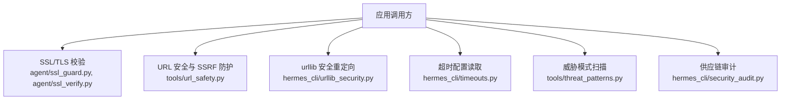
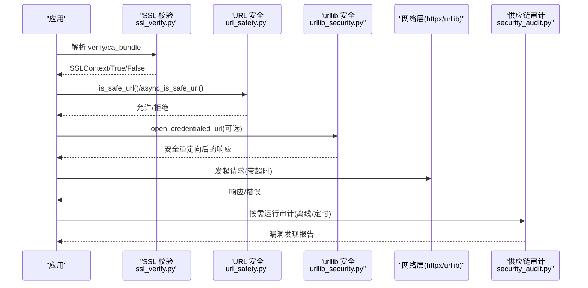
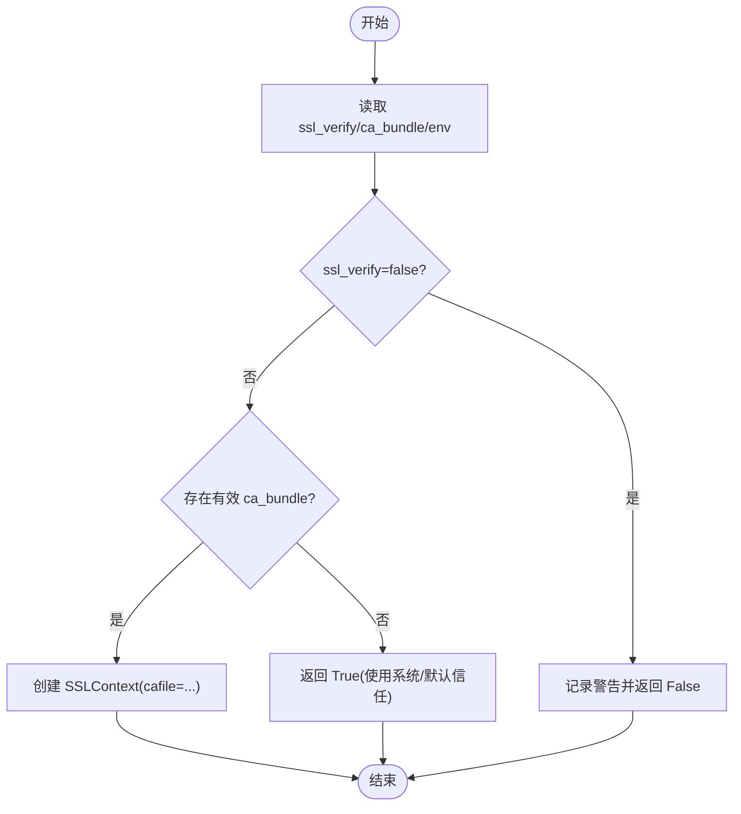
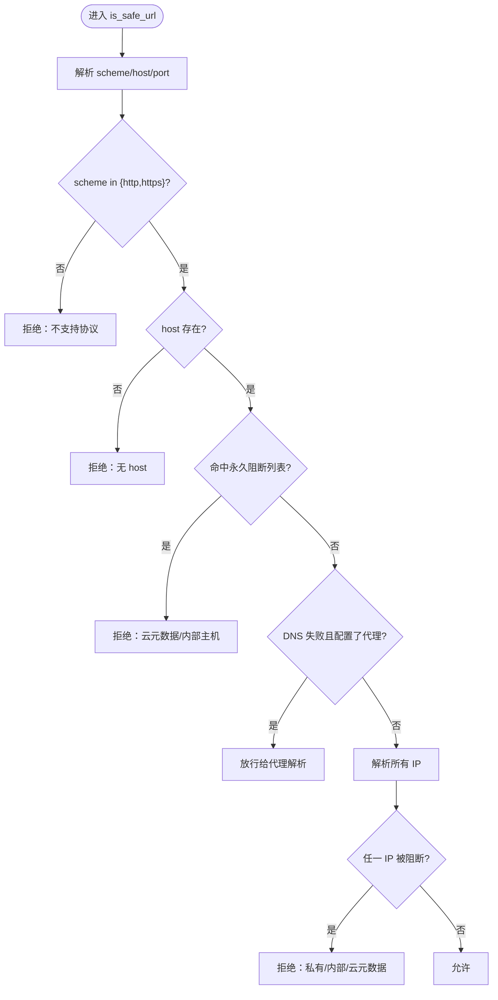
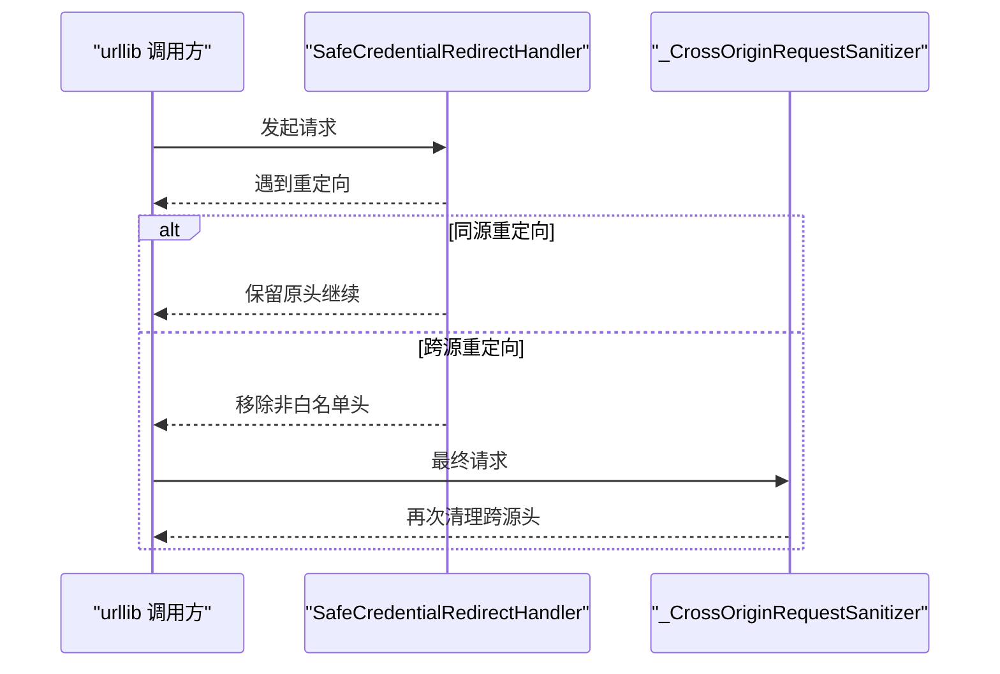
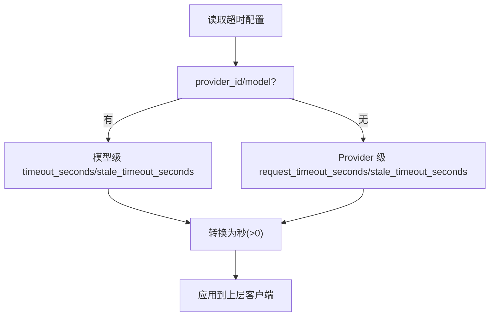
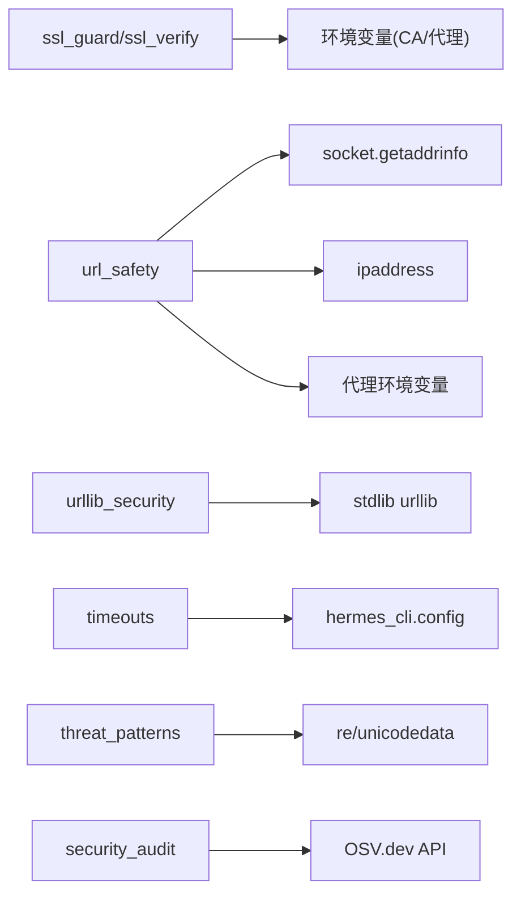

# 网络安全

<cite>
**本文引用的文件**
- [agent/ssl_guard.py](file://agent/ssl_guard.py)
- [agent/ssl_verify.py](file://agent/ssl_verify.py)
- [hermes_cli/urllib_security.py](file://hermes_cli/urllib_security.py)
- [tools/url_safety.py](file://tools/url_safety.py)
- [hermes_cli/security_audit.py](file://hermes_cli/security_audit.py)
- [hermes_cli/timeouts.py](file://hermes_cli/timeouts.py)
- [tools/threat_patterns.py](file://tools/threat_patterns.py)
</cite>

## 目录
1. [简介](#简介)
2. [项目结构](#项目结构)
3. [核心组件](#核心组件)
4. [架构总览](#架构总览)
5. [详细组件分析](#详细组件分析)
6. [依赖关系分析](#依赖关系分析)
7. [性能与可靠性](#性能与可靠性)
8. [故障排除指南](#故障排除指南)
9. [结论](#结论)
10. [附录：生产基线与配置模板](#附录生产基线与配置模板)

## 简介
本文件面向生产环境，系统化说明 Hermes Agent 在网络侧的安全能力与实践，覆盖以下主题：
- SSL/TLS 证书校验、CA 包自检与 HTTPS 强制使用
- 中间人攻击防护（MITM）与证书信任链验证
- URL 安全策略：白名单机制、域名解析安全、代理配置下的 DNS 行为
- 网络超时设置、连接池与重试策略
- 常见网络攻击的防护与监控方法
- 生产网络安全基线与优化建议

## 项目结构
围绕网络安全的关键模块分布如下：
- SSL/TLS 校验与 CA 包自检：agent/ssl_guard.py、agent/ssl_verify.py
- 标准库 urllib 安全重定向与跨源头清理：hermes_cli/urllib_security.py
- URL 安全与 SSRF 防护（含连接时 DNS 校验）：tools/url_safety.py
- 供应链漏洞审计（OSV 查询）：hermes_cli/security_audit.py
- 请求超时与陈旧超时配置读取：hermes_cli/timeouts.py
- 上下文注入与威胁模式检测：tools/threat_patterns.py

**图表来源**
- [agent/ssl_guard.py:68-102](file://agent/ssl_guard.py#L68-L102)
- [agent/ssl_verify.py:22-64](file://agent/ssl_verify.py#L22-L64)
- [tools/url_safety.py:415-529](file://tools/url_safety.py#L415-L529)
- [hermes_cli/urllib_security.py:31-133](file://hermes_cli/urllib_security.py#L31-L133)
- [hermes_cli/timeouts.py:14-83](file://hermes_cli/timeouts.py#L14-L83)
- [tools/threat_patterns.py:207-255](file://tools/threat_patterns.py#L207-L255)
- [hermes_cli/security_audit.py:433-481](file://hermes_cli/security_audit.py#L433-L481)

**章节来源**
- [agent/ssl_guard.py:68-102](file://agent/ssl_guard.py#L68-L102)
- [agent/ssl_verify.py:22-64](file://agent/ssl_verify.py#L22-L64)
- [tools/url_safety.py:415-529](file://tools/url_safety.py#L415-L529)
- [hermes_cli/urllib_security.py:31-133](file://hermes_cli/urllib_security.py#L31-L133)
- [hermes_cli/timeouts.py:14-83](file://hermes_cli/timeouts.py#L14-L83)
- [tools/threat_patterns.py:207-255](file://tools/threat_patterns.py#L207-L255)
- [hermes_cli/security_audit.py:433-481](file://hermes_cli/security_audit.py#L433-L481)

## 核心组件
- SSL/TLS 启动前 CA 包自检：确保 CA bundle 存在、可加载且包含证书；支持企业自定义 CA 环境变量。
- httpx/OpenAI 客户端 TLS verify 解析：按优先级决定禁用校验、使用自定义 CA 或默认系统信任。
- URL 安全与 SSRF 防护：阻止访问私有/内部地址、云元数据端点；在连接时再次校验 DNS 结果，缓解 DNS 重绑定。
- urllib 安全重定向：跨源重定向时剥离敏感头，防止凭据泄露。
- 超时配置：从配置中读取 provider 级请求超时与“非流式”陈旧超时。
- 威胁模式扫描：检测提示注入、C2 通信、信息外泄等模式。
- 供应链审计：扫描 venv、插件与 MCP 命令中的依赖版本，并查询 OSV 获取已知漏洞。

**章节来源**
- [agent/ssl_guard.py:68-102](file://agent/ssl_guard.py#L68-L102)
- [agent/ssl_verify.py:22-64](file://agent/ssl_verify.py#L22-L64)
- [tools/url_safety.py:415-529](file://tools/url_safety.py#L415-L529)
- [hermes_cli/urllib_security.py:31-133](file://hermes_cli/urllib_security.py#L31-L133)
- [hermes_cli/timeouts.py:14-83](file://hermes_cli/timeouts.py#L14-L83)
- [tools/threat_patterns.py:207-255](file://tools/threat_patterns.py#L207-L255)
- [hermes_cli/security_audit.py:433-481](file://hermes_cli/security_audit.py#L433-L481)

## 架构总览
下图展示一次外部 HTTP(S) 请求在 Hermes Agent 中的安全路径：

**图表来源**
- [agent/ssl_verify.py:22-64](file://agent/ssl_verify.py#L22-L64)
- [tools/url_safety.py:415-529](file://tools/url_safety.py#L415-L529)
- [hermes_cli/urllib_security.py:112-133](file://hermes_cli/urllib_security.py#L112-L133)
- [hermes_cli/security_audit.py:433-481](file://hermes_cli/security_audit.py#L433-L481)

## 详细组件分析

### SSL/TLS 与证书验证
- 启动前 CA 包自检：检查 HERMES_CA_BUNDLE、SSL_CERT_FILE、REQUESTS_CA_BUNDLE、CURL_CA_BUNDLE 指向的 CA bundle 是否存在、可加载且包含证书；同时校验内置 certifi 的 cacert.pem。
- httpx/OpenAI 客户端 TLS verify 解析：
  - 优先级：显式禁用 -> 指定 ca_bundle -> 环境变量 -> 默认启用
  - 若禁用校验会输出警告，仅用于本地开发
- 企业内网场景：通过环境变量或 per-provider 配置传入自定义 CA bundle，以信任企业内部根证书

**图表来源**
- [agent/ssl_verify.py:22-64](file://agent/ssl_verify.py#L22-L64)

**章节来源**
- [agent/ssl_guard.py:68-102](file://agent/ssl_guard.py#L68-L102)
- [agent/ssl_verify.py:22-64](file://agent/ssl_verify.py#L22-L64)

### URL 安全与 SSRF 防护
- 基础规则：
  - 仅允许 http/https 协议
  - 始终阻断云元数据主机名与 IP（如 169.254.169.254、metadata.google.internal 等）
  - 阻断私有/环回/链路本地/保留/组播/未指定/CNAT 地址
- 全局开关：可通过环境变量或配置文件允许私有 IP 解析（但云元数据地址永远阻断）
- 代理感知：当 DNS 解析失败且检测到代理已配置时，放行由代理进行解析（前提是主机名未被永久阻断）
- 连接时二次校验：对 httpx 同步/异步传输提供受保护的 NetworkBackend，在 TCP 连接前再次解析并校验 IP，缩小 DNS 重绑定窗口
- 敏感查询参数识别：检测可能携带凭据的查询键，便于上游做脱敏或拒绝

**图表来源**
- [tools/url_safety.py:415-529](file://tools/url_safety.py#L415-L529)

**章节来源**
- [tools/url_safety.py:415-529](file://tools/url_safety.py#L415-L529)
- [tools/url_safety.py:535-595](file://tools/url_safety.py#L535-L595)
- [tools/url_safety.py:598-752](file://tools/url_safety.py#L598-L752)

### urllib 安全重定向与跨源头清理
- 目标：防止在重定向到不同源时泄露凭据类请求头
- 机制：
  - 自定义重定向处理器：仅在同源重定向时保留原始头；跨源时移除非白名单头（如 accept、user-agent）
  - 后置处理器：在所有处理器执行后再次清理跨源请求头，避免后续处理器重新注入
- 适用：基于 stdlib urllib 的请求路径

**图表来源**
- [hermes_cli/urllib_security.py:31-133](file://hermes_cli/urllib_security.py#L31-L133)

**章节来源**
- [hermes_cli/urllib_security.py:31-133](file://hermes_cli/urllib_security.py#L31-L133)

### 超时、连接池与重试
- 超时配置：
  - 支持为每个 provider/model 设置请求超时与非流式“陈旧”超时
  - 超时值需为正数，否则忽略
- 连接池与重试：
  - 代码库未集中实现通用连接池与重试策略；建议在调用方（如 httpx/requests）结合业务需求配置
  - SSRF 防护在连接时再次校验 IP，有助于降低异常连接带来的风险

**图表来源**
- [hermes_cli/timeouts.py:14-83](file://hermes_cli/timeouts.py#L14-L83)

**章节来源**
- [hermes_cli/timeouts.py:14-83](file://hermes_cli/timeouts.py#L14-L83)

### 威胁模式扫描（提示注入/外泄/C2）
- 作用：在上下文组装与工具结果处理阶段，检测提示注入、角色劫持、C2 通信、凭据外泄等模式
- 范围：分为 all/context/strict 三种作用域，平衡误报与漏报
- 输出：匹配到的模式 ID，可用于告警或阻断

**章节来源**
- [tools/threat_patterns.py:207-255](file://tools/threat_patterns.py#L207-L255)

### 供应链安全审计
- 扫描范围：venv、用户插件依赖、MCP 服务器命令中的包版本
- 查询后端：OSV.dev 批量接口，并行拉取详情
- 输出：人类可读与 JSON 格式，支持按严重级别退出码控制

**章节来源**
- [hermes_cli/security_audit.py:433-481](file://hermes_cli/security_audit.py#L433-L481)

## 依赖关系分析
- SSL/TLS 校验依赖：
  - ssl 标准库、certifi（内置 CA bundle）
  - 环境变量：HERMES_CA_BUNDLE、SSL_CERT_FILE、REQUESTS_CA_BUNDLE、CURL_CA_BUNDLE
- URL 安全依赖：
  - socket.getaddrinfo 进行 DNS 解析
  - ipaddress 模块判断私有/特殊地址段
  - 代理环境变量：HTTPS_PROXY、HTTP_PROXY、ALL_PROXY 及其小写形式
- urllib 安全依赖：
  - urllib.request 的重定向处理器链
- 超时配置依赖：
  - hermes_cli.config 读取 providers/models 配置
- 威胁模式扫描依赖：
  - re、unicodedata 进行正则与 Unicode 规范化
- 供应链审计依赖：
  - importlib.metadata、tomllib（3.11+）、concurrent.futures、urllib.request

**图表来源**
- [agent/ssl_guard.py:18-23](file://agent/ssl_guard.py#L18-L23)
- [tools/url_safety.py:43-55](file://tools/url_safety.py#L43-L55)
- [hermes_cli/timeouts.py:21-40](file://hermes_cli/timeouts.py#L21-L40)
- [hermes_cli/security_audit.py:285-329](file://hermes_cli/security_audit.py#L285-L329)

**章节来源**
- [agent/ssl_guard.py:18-23](file://agent/ssl_guard.py#L18-L23)
- [tools/url_safety.py:43-55](file://tools/url_safety.py#L43-L55)
- [hermes_cli/timeouts.py:21-40](file://hermes_cli/timeouts.py#L21-L40)
- [hermes_cli/security_audit.py:285-329](file://hermes_cli/security_audit.py#L285-L329)

## 性能与可靠性
- 启动前 CA 包校验：一次性检查，避免运行时出现难以定位的 FileNotFoundError
- URL 安全：
  - 将 DNS 解析放入线程执行（异步路径），避免阻塞事件循环
  - 连接时再次校验 IP，减少 DNS 重绑定风险
- 超时：
  - 合理设置请求超时与陈旧超时，避免长尾请求拖垮资源
- 供应链审计：
  - 批量查询与并行拉取详情，提高审计效率

[本节为通用指导，不直接分析具体文件]

## 故障排除指南
- SSL 相关
  - 现象：启动时报 CA bundle 缺失或不可加载
  - 排查：检查 HERMES_CA_BUNDLE、SSL_CERT_FILE、REQUESTS_CA_BUNDLE、CURL_CA_BUNDLE 是否指向有效文件；确认 certifi 可导入且 cacert.pem 存在
  - 修复：运行自动修复命令或手动重装依赖；企业环境修正 CA bundle 路径
  - 参考：[agent/ssl_guard.py:68-102](file://agent/ssl_guard.py#L68-L102)
- TLS 校验被禁用
  - 现象：日志中出现“TLS certificate verification DISABLED”
  - 原因：ssl_verify=false 或等效字符串
  - 建议：仅本地开发使用；生产务必启用校验
  - 参考：[agent/ssl_verify.py:39-46](file://agent/ssl_verify.py#L39-L46)
- URL 被阻断
  - 现象：访问私有/内部地址或云元数据地址被拒绝
  - 排查：确认是否为合法目标；若确需访问内部地址，评估安全风险并考虑开启允许私有 IP 的全局开关
  - 注意：云元数据地址永远阻断
  - 参考：[tools/url_safety.py:415-529](file://tools/url_safety.py#L415-L529)
- 重定向导致凭据泄露
  - 现象：跨源重定向后仍携带敏感头
  - 排查：确认使用了安全 opener；检查是否安装了其他处理器覆盖了清理逻辑
  - 参考：[hermes_cli/urllib_security.py:31-133](file://hermes_cli/urllib_security.py#L31-L133)
- 超时问题
  - 现象：请求卡死或过早断开
  - 排查：检查 provider/model 超时配置；确认值为正数
  - 参考：[hermes_cli/timeouts.py:14-83](file://hermes_cli/timeouts.py#L14-L83)
- 供应链漏洞
  - 现象：审计发现高危漏洞
  - 处理：升级至修复版本；必要时隔离受影响组件
  - 参考：[hermes_cli/security_audit.py:433-481](file://hermes_cli/security_audit.py#L433-L481)

**章节来源**
- [agent/ssl_guard.py:68-102](file://agent/ssl_guard.py#L68-L102)
- [agent/ssl_verify.py:39-46](file://agent/ssl_verify.py#L39-L46)
- [tools/url_safety.py:415-529](file://tools/url_safety.py#L415-L529)
- [hermes_cli/urllib_security.py:31-133](file://hermes_cli/urllib_security.py#L31-L133)
- [hermes_cli/timeouts.py:14-83](file://hermes_cli/timeouts.py#L14-L83)
- [hermes_cli/security_audit.py:433-481](file://hermes_cli/security_audit.py#L433-L481)

## 结论
Hermes Agent 在网络侧提供了从启动前到连接时的多层防护：
- 启动前严格校验 CA bundle，避免隐式错误
- 灵活的 TLS verify 解析，兼顾企业内网与默认信任
- 全面的 URL 安全策略与连接时 DNS 校验，有效缓解 SSRF 与 DNS 重绑定
- 安全的重定向处理，防止跨源凭据泄露
- 可配置的超时策略，提升稳定性
- 威胁模式扫描与供应链审计，增强整体安全水位

生产环境应默认启用 HTTPS 与证书校验，限制 URL 访问范围，合理配置超时，并定期运行供应链审计。

[本节为总结性内容，不直接分析具体文件]

## 附录：生产基线与配置模板

### 网络安全基线清单
- 强制 HTTPS 与证书校验
  - 不要在生产环境设置 ssl_verify=false
  - 如需企业 CA，设置 HERMES_CA_BUNDLE 或对应环境变量
  - 参考：[agent/ssl_verify.py:22-64](file://agent/ssl_verify.py#L22-L64)
- 启动前 CA 包自检
  - 确保 certifi 可用，CA bundle 存在且可加载
  - 参考：[agent/ssl_guard.py:68-102](file://agent/ssl_guard.py#L68-L102)
- URL 访问策略
  - 默认禁止私有/内部地址与云元数据地址
  - 谨慎开启允许私有 IP 的全局开关，并最小化授权范围
  - 参考：[tools/url_safety.py:415-529](file://tools/url_safety.py#L415-L529)
- 代理与 DNS
  - 在代理环境下，DNS 失败将被视为可由代理解析而放行（主机名仍需通过永久阻断检查）
  - 参考：[tools/url_safety.py:43-55](file://tools/url_safety.py#L43-L55)
- 超时与重试
  - 为每个 provider/model 设置合理的请求超时与陈旧超时
  - 重试策略由调用方实现，建议结合指数退避与最大重试次数
  - 参考：[hermes_cli/timeouts.py:14-83](file://hermes_cli/timeouts.py#L14-L83)
- 重定向安全
  - 使用安全 opener，避免跨源凭据泄露
  - 参考：[hermes_cli/urllib_security.py:31-133](file://hermes_cli/urllib_security.py#L31-L133)
- 威胁检测与审计
  - 在上下文与工具结果中启用威胁模式扫描
  - 定期运行供应链审计，及时修复高危漏洞
  - 参考：[tools/threat_patterns.py:207-255](file://tools/threat_patterns.py#L207-L255)、[hermes_cli/security_audit.py:433-481](file://hermes_cli/security_audit.py#L433-L481)

### 配置模板要点（示例字段）
- 供应商超时（示例字段名）
  - providers.<id>.request_timeout_seconds
  - providers.<id>.models.<model>.timeout_seconds
  - providers.<id>.stale_timeout_seconds
  - providers.<id>.models.<model>.stale_timeout_seconds
- 代理与环境变量
  - HTTPS_PROXY/HTTP_PROXY/ALL_PROXY（影响 URL 安全策略的代理感知）
  - HERMES_CA_BUNDLE/SSL_CERT_FILE/REQUESTS_CA_BUNDLE/CURL_CA_BUNDLE（CA bundle）
- 私有 IP 访问开关
  - security.allow_private_urls 或浏览器兼容字段（谨慎启用）

[本节为通用模板说明，不直接分析具体文件]