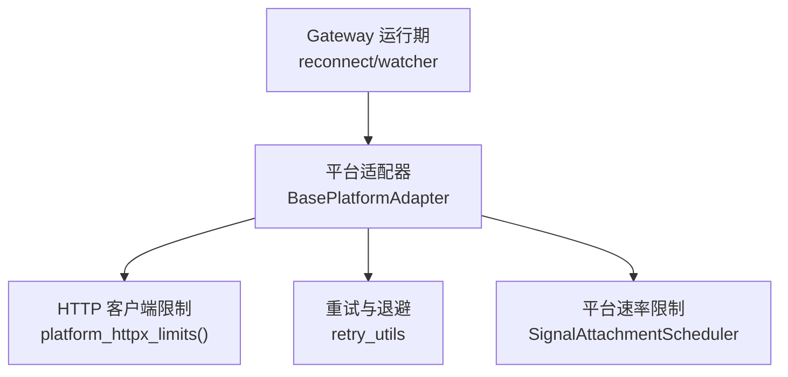
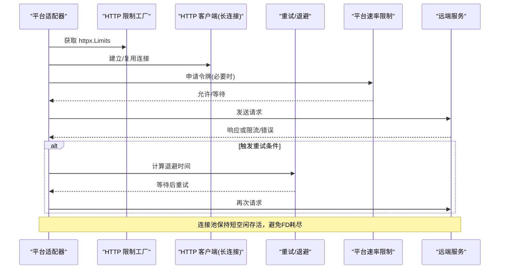
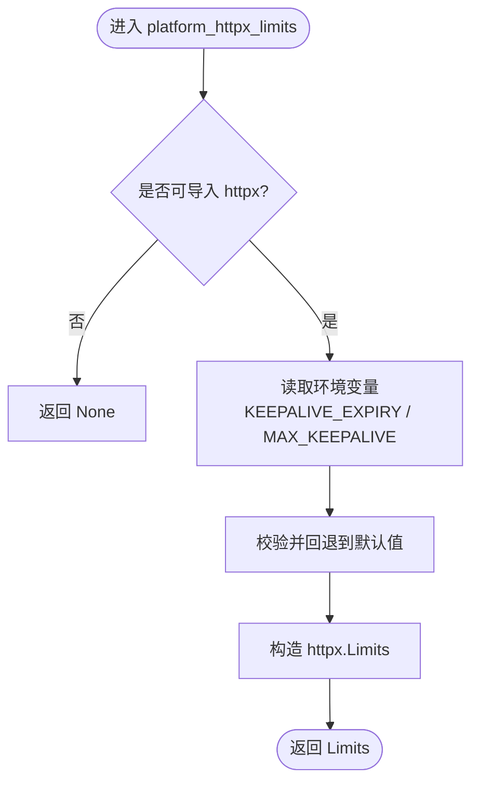
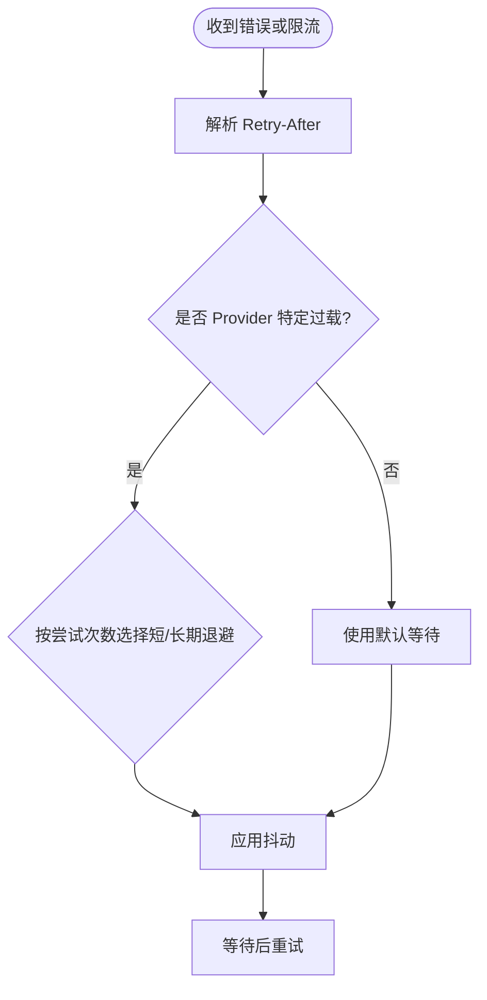
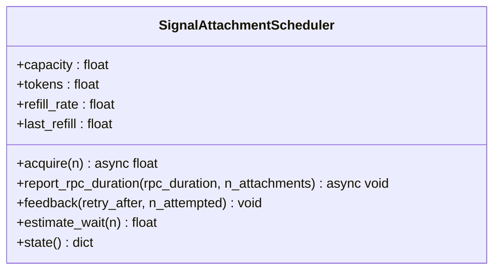
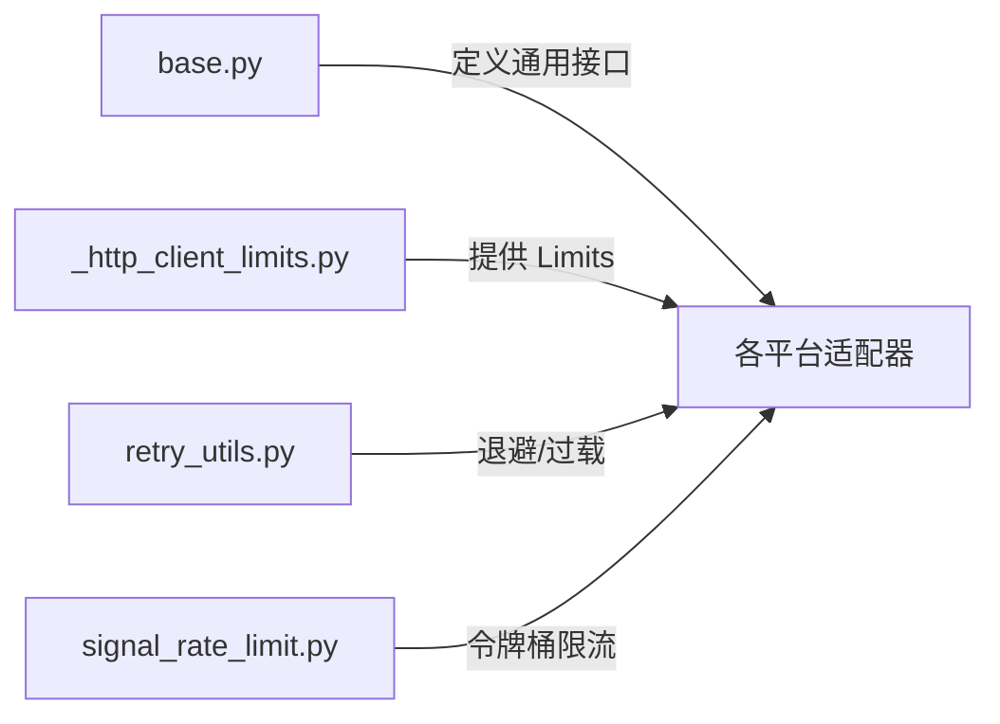

# 网络请求限制

<cite>
**本文引用的文件**
- [gateway/platforms/_http_client_limits.py](file://gateway/platforms/_http_client_limits.py)
- [tests/gateway/test_platform_http_client_limits.py](file://tests/gateway/test_platform_http_client_limits.py)
- [agent/retry_utils.py](file://agent/retry_utils.py)
- [gateway/platforms/signal_rate_limit.py](file://gateway/platforms/signal_rate_limit.py)
- [gateway/platforms/base.py](file://gateway/platforms/base.py)
- [tests/gateway/test_adapter_connect_is_reconnect_contract.py](file://tests/gateway/test_adapter_connect_is_reconnect_contract.py)
</cite>

## 目录
1. [简介](#简介)
2. [项目结构](#项目结构)
3. [核心组件](#核心组件)
4. [架构总览](#架构总览)
5. [详细组件分析](#详细组件分析)
6. [依赖关系分析](#依赖关系分析)
7. [性能考量](#性能考量)
8. [故障排查指南](#故障排查指南)
9. [结论](#结论)
10. [附录](#附录)

## 简介
本文件聚焦于网关平台适配器的网络请求限制与稳定性保障，覆盖以下主题：
- HTTP 客户端连接池管理（长连接、空闲回收、文件描述符压力）
- 超时配置与并发控制（请求/上传超时、令牌桶限流）
- 重试策略与退避（抖动指数退避、Provider 特定过载处理）
- 平台适配器网络限制与最佳实践（Telegram、Discord、Slack、Signal、WhatsApp 等）
- 网络性能优化（连接复用、缓存策略、负载均衡）
- 故障恢复机制（断线重连、错误分类、降级策略）
- 监控指标与告警建议（识别瓶颈与性能问题）

## 项目结构
围绕网络限制的关键代码分布在以下位置：
- HTTP 客户端限制工厂：gateway/platforms/_http_client_limits.py
- 通用重试工具：agent/retry_utils.py
- 平台级速率限制：gateway/platforms/signal_rate_limit.py
- 平台适配器基类与通用逻辑：gateway/platforms/base.py
- 相关测试与契约校验：tests/gateway/test_platform_http_client_limits.py、tests/gateway/test_adapter_connect_is_reconnect_contract.py

图表来源
- [gateway/platforms/_http_client_limits.py:43-84](file://gateway/platforms/_http_client_limits.py#L43-L84)
- [agent/retry_utils.py:90-128](file://agent/retry_utils.py#L90-L128)
- [gateway/platforms/signal_rate_limit.py:170-346](file://gateway/platforms/signal_rate_limit.py#L170-L346)
- [gateway/platforms/base.py:1-200](file://gateway/platforms/base.py#L1-L200)

章节来源
- [gateway/platforms/_http_client_limits.py:1-85](file://gateway/platforms/_http_client_limits.py#L1-L85)
- [agent/retry_utils.py:1-209](file://agent/retry_utils.py#L1-L209)
- [gateway/platforms/signal_rate_limit.py:1-375](file://gateway/platforms/signal_rate_limit.py#L1-L375)
- [gateway/platforms/base.py:1-200](file://gateway/platforms/base.py#L1-L200)

## 核心组件
- HTTP 客户端限制工厂：为长生命周期平台适配器提供紧凑的 httpx.Limits，降低 CLOSE_WAIT 导致的 FD 泄漏风险。
- 重试与退避：提供抖动指数退避、Retry-After 解析、Provider 特定过载退避策略。
- Signal 附件发送速率限制：进程内令牌桶模拟服务端限制，支持反馈校准与等待估算。
- 平台适配器基类：定义跨平台通用行为（如媒体类型、线程元数据、TTS 输出路径等），并作为各平台适配器的统一入口。

章节来源
- [gateway/platforms/_http_client_limits.py:17-27](file://gateway/platforms/_http_client_limits.py#L17-L27)
- [agent/retry_utils.py:1-6](file://agent/retry_utils.py#L1-L6)
- [gateway/platforms/signal_rate_limit.py:1-14](file://gateway/platforms/signal_rate_limit.py#L1-L14)
- [gateway/platforms/base.py:1-6](file://gateway/platforms/base.py#L1-L6)

## 架构总览
下图展示了平台适配器在发起网络请求时的关键路径：连接池限制、重试退避、平台速率限制以及 Gateway 的重连协调。

图表来源
- [gateway/platforms/_http_client_limits.py:43-84](file://gateway/platforms/_http_client_limits.py#L43-L84)
- [agent/retry_utils.py:90-128](file://agent/retry_utils.py#L90-L128)
- [gateway/platforms/signal_rate_limit.py:228-277](file://gateway/platforms/signal_rate_limit.py#L228-L277)

## 详细组件分析

### HTTP 客户端限制工厂（_http_client_limits.py）
- 目标：为长期存活的平台适配器客户端设置更激进的 keepalive 回收策略，避免 CLOSE_WAIT 堆积导致 FD 耗尽。
- 关键参数：
  - max_keepalive_connections：默认 10，足以满足单适配器并发。
  - keepalive_expiry：默认 2.0 秒，快速回收空闲连接。
  - max_connections：保留 httpx 默认值（约 100），留有足够余量。
- 环境变量覆盖：
  - HERMES_GATEWAY_HTTPX_KEEPALIVE_EXPIRY：覆盖空闲超时（秒）。
  - HERMES_GATEWAY_HTTPX_MAX_KEEPALIVE：覆盖最大空闲连接数。
- 容错：当 httpx 不可用时返回 None，调用方可回退到默认限制。

图表来源
- [gateway/platforms/_http_client_limits.py:43-84](file://gateway/platforms/_http_client_limits.py#L43-L84)

章节来源
- [gateway/platforms/_http_client_limits.py:1-85](file://gateway/platforms/_http_client_limits.py#L1-L85)
- [tests/gateway/test_platform_http_client_limits.py:1-72](file://tests/gateway/test_platform_http_client_limits.py#L1-L72)

### 重试与退避（agent/retry_utils.py）
- 抖动指数退避：jittered_backoff 使用指数增长 + 随机抖动，避免“惊群”重试。
- Retry-After 解析：parse_retry_after_seconds 兼容数字、HTTP-date 和 headers 映射。
- Provider 特定过载：adaptive_rate_limit_backoff 针对 Z.AI Coding Plan GLM-5.2 的 429 过载采用短期+长期退避表。
- 重试上限：zai_coding_overload_retry_ceiling 确保长期退避序列能完整执行。

图表来源
- [agent/retry_utils.py:38-88](file://agent/retry_utils.py#L38-L88)
- [agent/retry_utils.py:90-128](file://agent/retry_utils.py#L90-L128)
- [agent/retry_utils.py:162-209](file://agent/retry_utils.py#L162-L209)

章节来源
- [agent/retry_utils.py:1-209](file://agent/retry_utils.py#L1-L209)

### Signal 附件发送速率限制（signal_rate_limit.py）
- 令牌桶模型：容量与服务端一致（默认 50），按 token/秒 补充；通过 feedback 校准 refill_rate。
- 并发公平：acquire 通过 asyncio.Lock 序列化，保证 FIFO。
- 等待估算：estimate_wait 用于提前提示用户可能的延迟。
- 超时策略：根据附件数量动态调整 send RPC 超时，避免大附件被截断。
- 错误检测：识别 signal-cli 的 RateLimitException、[429]、RetryLaterException 等形态。

图表来源
- [gateway/platforms/signal_rate_limit.py:170-346](file://gateway/platforms/signal_rate_limit.py#L170-L346)

章节来源
- [gateway/platforms/signal_rate_limit.py:1-375](file://gateway/platforms/signal_rate_limit.py#L1-L375)

### 平台适配器基类与通用逻辑（base.py）
- 媒体类型与格式：集中管理音频扩展名与平台差异（如 Telegram 的语音/音频格式限制）。
- 线程元数据：构建 thread_id、slack_team_id、telegram_dm_topic_reply_fallback 等路由元数据。
- TTS 输出路径：根据平台生成合适的音频容器（ogg/mp3），配合修复流程保证格式正确。
- 超时与并发保护：对历史媒体查找等 best-effort 操作设置工作线程上限与超时，防止阻塞主循环。

章节来源
- [gateway/platforms/base.py:30-60](file://gateway/platforms/base.py#L30-L60)
- [gateway/platforms/base.py:78-108](file://gateway/platforms/base.py#L78-L108)
- [gateway/platforms/base.py:153-173](file://gateway/platforms/base.py#L153-L173)
- [gateway/platforms/base.py:176-200](file://gateway/platforms/base.py#L176-L200)

### 平台适配器的重连契约（test_adapter_connect_is_reconnect_contract.py）
- 契约要求：所有平台适配器的 connect() 必须接受 is_reconnect 关键字参数，否则 Gateway 重连器在首次重试时会抛出异常并导致通道静默断开。
- 静态检查：通过 AST 扫描 gateway/platforms 与 plugins/platforms 下的适配器文件，确保签名合规。

章节来源
- [tests/gateway/test_adapter_connect_is_reconnect_contract.py:1-145](file://tests/gateway/test_adapter_connect_is_reconnect_contract.py#L1-L145)

## 依赖关系分析
- _http_client_limits.py 被平台适配器工厂使用，以 tight limits 创建 httpx.AsyncClient，减少 CLOSE_WAIT 累积。
- retry_utils.py 被上层重试逻辑调用，提供退避与过载识别。
- signal_rate_limit.py 被 Signal 适配器及消息发送工具调用，控制附件发送速率。
- base.py 提供跨平台通用能力，被各平台适配器继承。

图表来源
- [gateway/platforms/base.py:1-200](file://gateway/platforms/base.py#L1-L200)
- [gateway/platforms/_http_client_limits.py:43-84](file://gateway/platforms/_http_client_limits.py#L43-L84)
- [agent/retry_utils.py:90-128](file://agent/retry_utils.py#L90-L128)
- [gateway/platforms/signal_rate_limit.py:170-346](file://gateway/platforms/signal_rate_limit.py#L170-L346)

章节来源
- [gateway/platforms/_http_client_limits.py:1-85](file://gateway/platforms/_http_client_limits.py#L1-L85)
- [agent/retry_utils.py:1-209](file://agent/retry_utils.py#L1-L209)
- [gateway/platforms/signal_rate_limit.py:1-375](file://gateway/platforms/signal_rate_limit.py#L1-L375)
- [gateway/platforms/base.py:1-200](file://gateway/platforms/base.py#L1-L200)

## 性能考量
- 连接复用：长生命周期适配器复用 httpx.AsyncClient，摊销 TLS/握手开销。
- 空闲回收：keepalive_expiry=2.0s 加速释放 CLOSE_WAIT 套接字，避免 FD 耗尽。
- 并发控制：Signal 附件发送通过令牌桶限制并发，避免触发服务端 429。
- 超时调优：按附件规模放大 send RPC 超时，避免中途截断。
- 退避抖动：指数退避 + 抖动分散重试风暴，降低 Provider 过载窗口内的竞争。

[本节为通用指导，不直接分析具体文件]

## 故障排查指南
- FD 泄漏/CLOSE_WAIT 堆积：确认使用 platform_httpx_limits() 提供的 Limits；检查是否存在裸 await 未释放响应的情况（例如 WhatsApp send_typing 需包裹在 async with 中）。
- 重连失败：确保所有适配器 connect() 接受 is_reconnect 参数；若缺失，Gateway 重连器会抛 TypeError 并导致通道静默断开。
- 429 频繁：检查是否正确使用 adaptive_rate_limit_backoff 与 Signal 令牌桶；观察 feedback 是否成功校准 refill_rate。
- 超时过早：对于大附件发送，确认已按附件数量放大超时；必要时结合日志评估实际耗时。

章节来源
- [tests/gateway/test_platform_http_client_limits.py:45-72](file://tests/gateway/test_platform_http_client_limits.py#L45-L72)
- [tests/gateway/test_adapter_connect_is_reconnect_contract.py:1-145](file://tests/gateway/test_adapter_connect_is_reconnect_contract.py#L1-L145)
- [gateway/platforms/signal_rate_limit.py:308-328](file://gateway/platforms/signal_rate_limit.py#L308-L328)

## 结论
本仓库在网络请求限制方面提供了系统化的解决方案：通过紧凑的连接池限制、健壮的重试退避、平台特定的速率限制与严格的适配器重连契约，有效降低了 FD 泄漏、429 风暴与重连失败的风险。配合合理的超时与并发控制，可在多平台环境下实现稳定、高效的网络通信。

[本节为总结性内容，不直接分析具体文件]

## 附录

### 平台特定限制与最佳实践
- Telegram/Discord/Slack：遵循 base.py 的通用媒体与线程元数据处理；在需要时接入 retry_utils 的退避策略；注意不同平台的速率限制与消息大小限制。
- Signal：使用 SignalAttachmentScheduler 进行附件发送限流；依据反馈校准 refill_rate；合理设置 send RPC 超时。
- WhatsApp：确保 HTTP 响应对象在上下文管理器中使用，避免 CLOSE_WAIT 泄漏。

[本节为概念性说明，不直接分析具体文件]

### 监控指标与告警建议
- 连接池指标：空闲连接数、活跃连接数、keepalive 过期率。
- 重试指标：重试次数分布、退避时长分布、Provider 特定过载占比。
- 速率限制指标：令牌桶等待时间、429 频率、反馈校准变化。
- 超时指标：请求超时比例、附件上传耗时分布。
- 告警阈值：FD 使用率接近系统上限、CLOSE_WAIT 持续增长、429 突增、重连失败率上升。

[本节为通用指导，不直接分析具体文件]