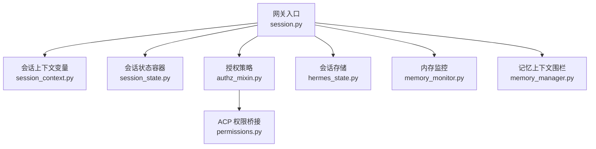
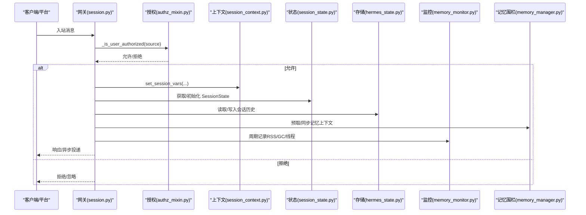
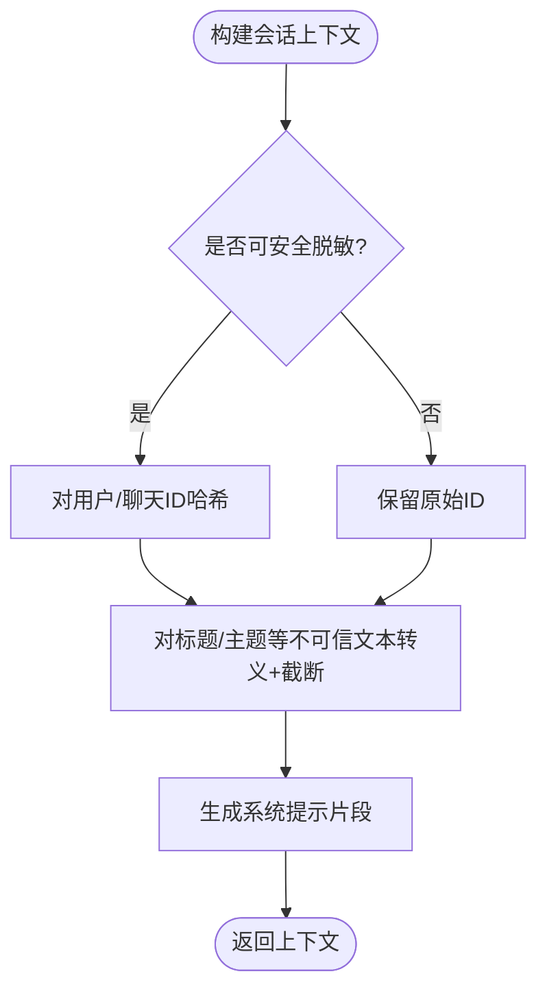
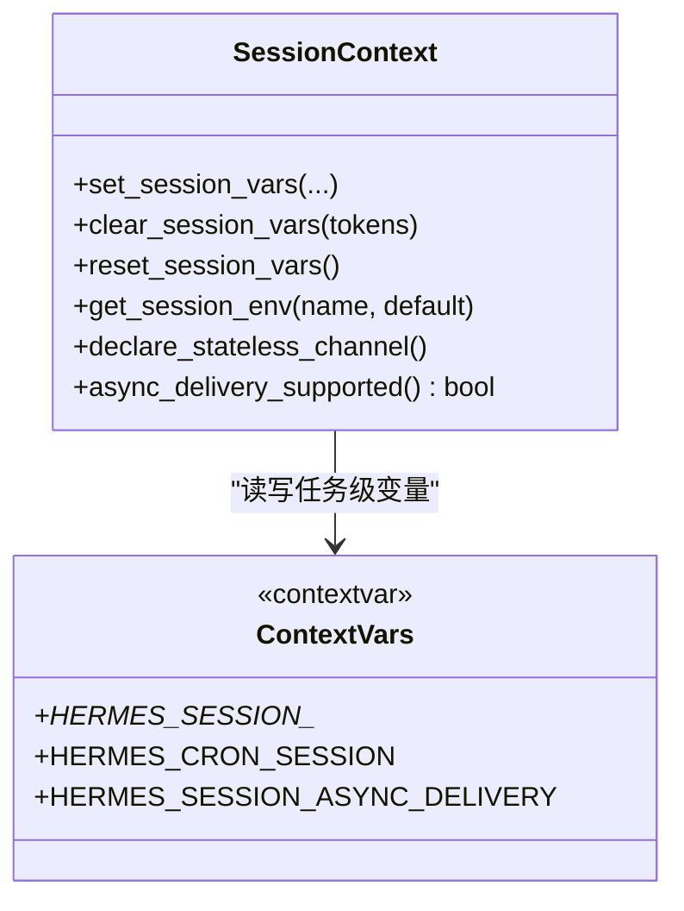
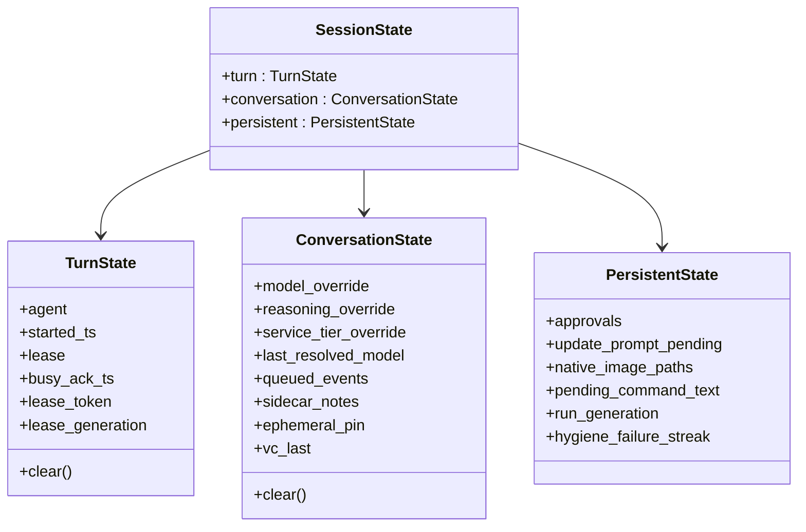
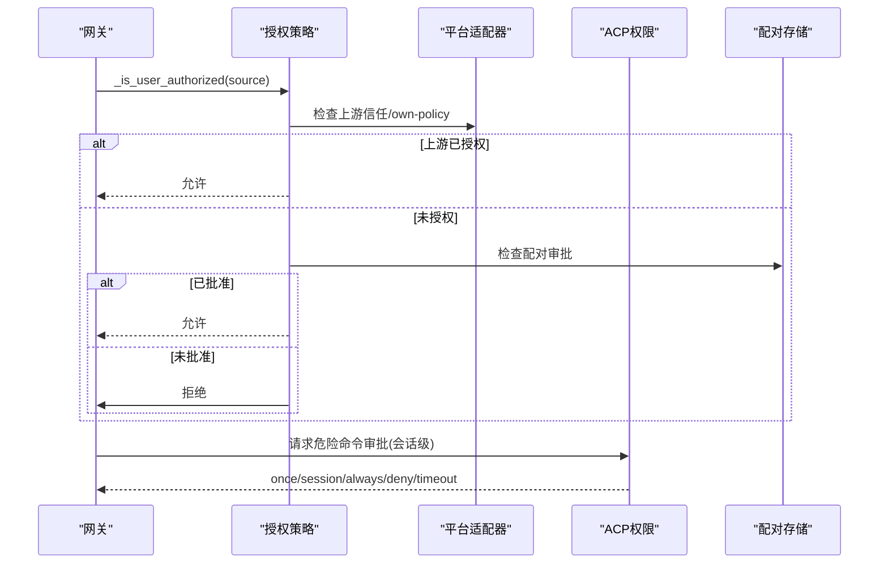
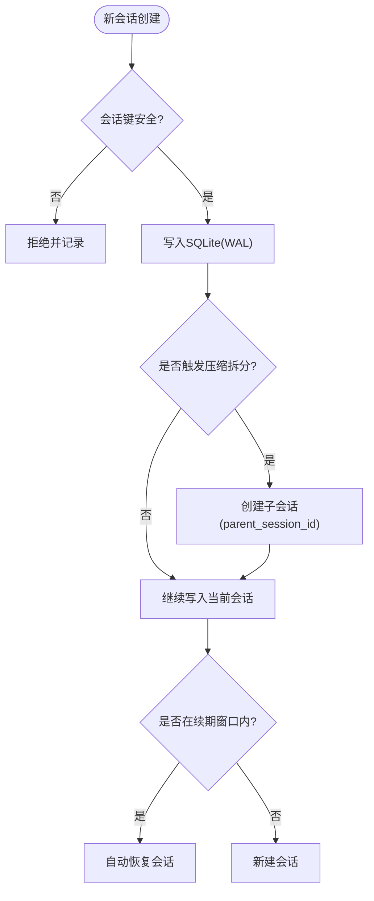
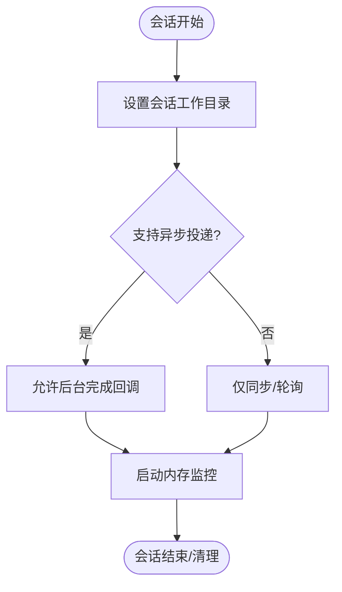
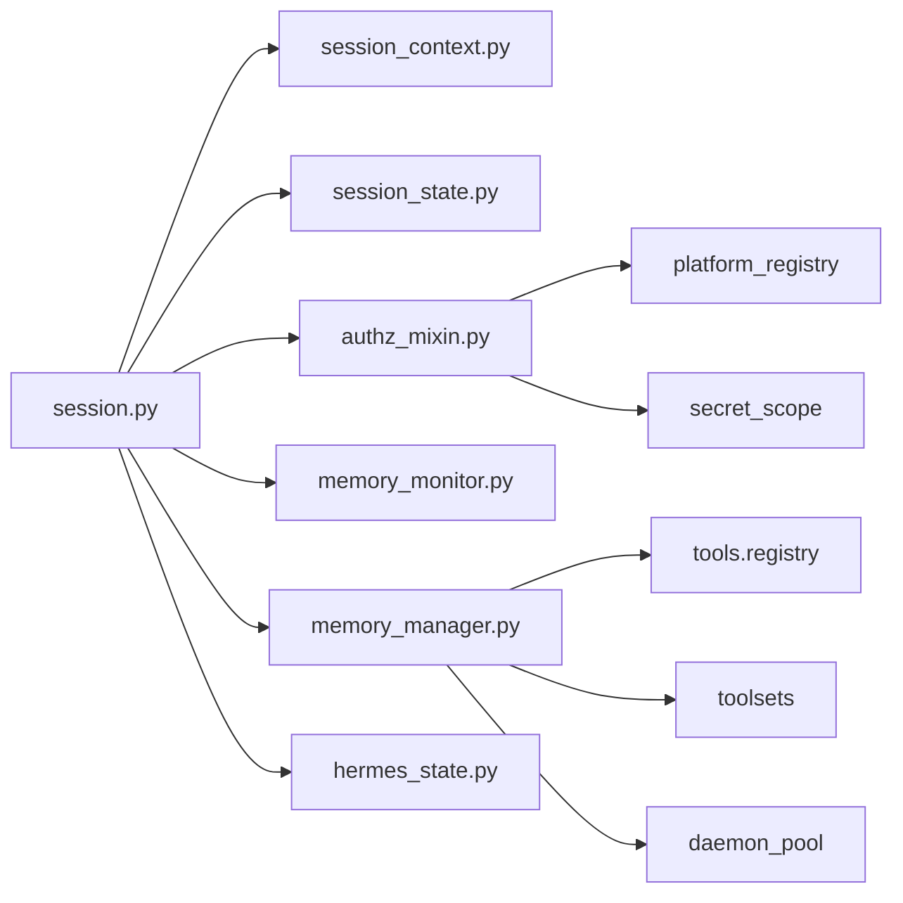

# 会话隔离

<cite>
**本文引用的文件**
- [gateway/session.py](file://gateway/session.py)
- [gateway/session_context.py](file://gateway/session_context.py)
- [gateway/session_state.py](file://gateway/session_state.py)
- [gateway/authz_mixin.py](file://gateway/authz_mixin.py)
- [acp_adapter/permissions.py](file://acp_adapter/permissions.py)
- [agent/memory_manager.py](file://agent/memory_manager.py)
- [gateway/memory_monitor.py](file://gateway/memory_monitor.py)
- [hermes_state.py](file://hermes_state.py)
</cite>

## 目录
1. [简介](#简介)
2. [项目结构](#项目结构)
3. [核心组件](#核心组件)
4. [架构总览](#架构总览)
5. [详细组件分析](#详细组件分析)
6. [依赖关系分析](#依赖关系分析)
7. [性能考虑](#性能考虑)
8. [故障排查指南](#故障排查指南)
9. [结论](#结论)
10. [附录](#附录)

## 简介
本文件系统性说明 Hermes Agent 的“会话隔离”能力，覆盖多租户隔离、上下文隔离与资源限制机制；阐述会话级权限控制、数据隔离与环境隔离；解释用户会话隔离、项目级隔离与临时会话管理；并给出会话生命周期管理、资源清理、内存隔离、配置示例、监控与异常处理建议，以及生产环境的策略与优化要点。

## 项目结构
围绕会话隔离的关键模块分布在 gateway、agent 与 hermes_state 等子系统中：
- gateway/session.py：会话来源、会话上下文构建、PII 脱敏、会话键安全校验、自动续期窗口等。
- gateway/session_context.py：基于 contextvars 的任务级会话上下文变量，替代进程级环境变量，避免并发污染。
- gateway/session_state.py：将网关每会话状态按“轮次/对话/持久”三层收敛，提供统一清理与视图兼容。
- gateway/authz_mixin.py：入站消息授权策略（平台白名单、群组/频道策略、配对审批、上游信任委托）。
- acp_adapter/permissions.py：ACP 权限桥接，将危险命令审批映射为“一次性/会话/永久/拒绝”。
- agent/memory_manager.py：记忆提供者工具注入与上下文围栏，防止跨会话/跨上下文泄露。
- gateway/memory_monitor.py：周期性 RSS/GC/线程数日志，辅助定位内存泄漏。
- hermes_state.py：SQLite 会话存储（WAL、FTS5、压缩拆分、消息量上限保护）。

**图示来源**
- [gateway/session.py:1-120](file://gateway/session.py#L1-L120)
- [gateway/session_context.py:1-120](file://gateway/session_context.py#L1-L120)
- [gateway/session_state.py:1-180](file://gateway/session_state.py#L1-L180)
- [gateway/authz_mixin.py:1-120](file://gateway/authz_mixin.py#L1-L120)
- [acp_adapter/permissions.py:1-120](file://acp_adapter/permissions.py#L1-L120)
- [agent/memory_manager.py:1-120](file://agent/memory_manager.py#L1-L120)
- [gateway/memory_monitor.py:1-120](file://gateway/memory_monitor.py#L1-L120)
- [hermes_state.py:1-120](file://hermes_state.py#L1-L120)

**章节来源**
- [gateway/session.py:1-120](file://gateway/session.py#L1-L120)
- [gateway/session_context.py:1-120](file://gateway/session_context.py#L1-L120)
- [gateway/session_state.py:1-180](file://gateway/session_state.py#L1-L180)
- [gateway/authz_mixin.py:1-120](file://gateway/authz_mixin.py#L1-L120)
- [acp_adapter/permissions.py:1-120](file://acp_adapter/permissions.py#L1-L120)
- [agent/memory_manager.py:1-120](file://agent/memory_manager.py#L1-L120)
- [gateway/memory_monitor.py:1-120](file://gateway/memory_monitor.py#L1-L120)
- [hermes_state.py:1-120](file://hermes_state.py#L1-L120)

## 核心组件
- 会话来源与上下文：SessionSource/SessionContext 描述消息来源、平台、聊天类型、线程、作用域（scope_id/guild_id）与 profile，用于路由、动态系统提示注入与定时任务投递。
- 上下文隔离：通过 session_context.py 的 ContextVar 实现任务级会话变量，避免 asyncio 并发下的进程级环境变量污染。
- 会话状态分层：TurnState/ConversationState/PersistentState 将运行中轮次、对话边界与持久化状态解耦，并提供统一的 clear() 语义。
- 授权与权限：authz_mixin.py 实现平台级白名单、群组/频道策略、配对审批、上游信任委托；permissions.py 将危险命令审批映射到会话级许可。
- 数据隔离：hermes_state.py 使用 SQLite WAL + FTS5，支持会话拆分与消息量上限保护；session.py 对会话键进行路径穿越防护。
- 内存与资源：memory_monitor.py 定期记录 RSS/GC/线程数；memory_manager.py 通过围栏与超时控制外部记忆提供者，避免阻塞或泄露。

**章节来源**
- [gateway/session.py:148-346](file://gateway/session.py#L148-L346)
- [gateway/session_context.py:1-120](file://gateway/session_context.py#L1-L120)
- [gateway/session_state.py:51-179](file://gateway/session_state.py#L51-L179)
- [gateway/authz_mixin.py:386-783](file://gateway/authz_mixin.py#L386-L783)
- [acp_adapter/permissions.py:18-183](file://acp_adapter/permissions.py#L18-L183)
- [hermes_state.py:1-120](file://hermes_state.py#L1-L120)
- [agent/memory_manager.py:364-758](file://agent/memory_manager.py#L364-L758)
- [gateway/memory_monitor.py:1-120](file://gateway/memory_monitor.py#L1-L120)

## 架构总览
下图展示从入站消息到会话隔离、授权、状态管理与存储的完整链路。

**图示来源**
- [gateway/session.py:479-746](file://gateway/session.py#L479-L746)
- [gateway/authz_mixin.py:386-783](file://gateway/authz_mixin.py#L386-L783)
- [gateway/session_context.py:206-313](file://gateway/session_context.py#L206-L313)
- [gateway/session_state.py:172-179](file://gateway/session_state.py#L172-L179)
- [hermes_state.py:1-120](file://hermes_state.py#L1-L120)
- [agent/memory_manager.py:525-695](file://agent/memory_manager.py#L525-L695)
- [gateway/memory_monitor.py:139-193](file://gateway/memory_monitor.py#L139-L193)

## 详细组件分析

### 会话上下文与多租户隔离
- 会话来源与作用域：SessionSource 包含 platform、chat_id、thread_id、scope_id/guild_id、profile 等字段，驱动服务器/工作区隔离与中继门控。
- PII 脱敏与不可信元数据：build_session_context_prompt 在可安全平台对 user/chat ID 做哈希，并对标题/主题等不可信文本进行转义与截断，防止提示注入。
- 会话键安全：_is_path_unsafe/_is_session_key_unsafe 阻止路径穿越与 Windows 盘符前缀，确保会话键不会逃逸到文件系统。

**图示来源**
- [gateway/session.py:479-746](file://gateway/session.py#L479-L746)
- [gateway/session.py:64-146](file://gateway/session.py#L64-L146)

**章节来源**
- [gateway/session.py:148-346](file://gateway/session.py#L148-L346)
- [gateway/session.py:479-746](file://gateway/session.py#L479-L746)
- [gateway/session.py:64-146](file://gateway/session.py#L64-L146)

### 上下文隔离（任务级会话变量）
- 背景：旧版使用 os.environ 保存会话信息，导致并发消息互相覆盖；改用 contextvars.ContextVar 实现任务级隔离。
- 关键API：set_session_vars/clear_session_vars/reset_session_vars/get_session_env；支持 cwd、async_delivery、cron_session 等上下文标记。
- 继承泄漏防护：reset_session_vars 在任务入口处重置为 _UNSET，避免跨任务继承导致的会话身份泄露。

**图示来源**
- [gateway/session_context.py:1-120](file://gateway/session_context.py#L1-L120)
- [gateway/session_context.py:206-313](file://gateway/session_context.py#L206-L313)
- [gateway/session_context.py:315-361](file://gateway/session_context.py#L315-L361)
- [gateway/session_context.py:363-496](file://gateway/session_context.py#L363-L496)

**章节来源**
- [gateway/session_context.py:1-120](file://gateway/session_context.py#L1-L120)
- [gateway/session_context.py:206-313](file://gateway/session_context.py#L206-L313)
- [gateway/session_context.py:315-361](file://gateway/session_context.py#L315-L361)
- [gateway/session_context.py:363-496](file://gateway/session_context.py#L363-L496)

### 会话状态分层与生命周期管理
- 三层状态：TurnState（单轮运行态）、ConversationState（对话边界内状态）、PersistentState（跨边界持久态）。
- 清理语义：每层提供 clear()，保证边界/轮次结束时释放资源，避免残留状态影响后续会话。
- 兼容性视图：Legacy dict views 保持测试与旧代码兼容，但生产应通过 SessionState 访问。

**图示来源**
- [gateway/session_state.py:51-179](file://gateway/session_state.py#L51-L179)
- [gateway/session_state.py:181-477](file://gateway/session_state.py#L181-L477)

**章节来源**
- [gateway/session_state.py:51-179](file://gateway/session_state.py#L51-L179)
- [gateway/session_state.py:181-477](file://gateway/session_state.py#L181-L477)

### 会话级权限控制与项目级隔离
- 授权流程：优先检查上游信任（Relay/adapter 声明），再检查平台白名单、群组/频道白名单、配对审批、全局 allow-all 标志；默认拒绝。
- 项目级隔离：通过 scope_id/guild_id 与 profile 区分不同工作区/团队；multiplex 模式下各 profile 拥有独立 PairingStore 与适配器注册表。
- 危险命令审批：ACP 权限桥接将“一次性/会话/永久/拒绝”映射到 Hermes 审批结果，支持超时与错误兜底。

**图示来源**
- [gateway/authz_mixin.py:386-783](file://gateway/authz_mixin.py#L386-L783)
- [acp_adapter/permissions.py:18-183](file://acp_adapter/permissions.py#L18-L183)

**章节来源**
- [gateway/authz_mixin.py:386-783](file://gateway/authz_mixin.py#L386-L783)
- [acp_adapter/permissions.py:18-183](file://acp_adapter/permissions.py#L18-L183)

### 数据隔离与临时会话管理
- 会话键安全：拒绝路径穿越与 Windows 盘符前缀，避免会话键逃逸到文件系统。
- 会话存储：SQLite WAL 模式支持并发读与单写；FTS5 全文检索；压缩触发会话拆分（parent_session_id 链）；消息量上限保护（resume/export）。
- 临时会话：auto_continue_freshness_window 控制重启后自动续期的新鲜度窗口；会话键命名空间结合 profile/scope 实现临时会话隔离。

**图示来源**
- [gateway/session.py:100-146](file://gateway/session.py#L100-L146)
- [gateway/session.py:31-58](file://gateway/session.py#L31-L58)
- [hermes_state.py:1-120](file://hermes_state.py#L1-L120)

**章节来源**
- [gateway/session.py:100-146](file://gateway/session.py#L100-L146)
- [gateway/session.py:31-58](file://gateway/session.py#L31-L58)
- [hermes_state.py:1-120](file://hermes_state.py#L1-L120)

### 环境隔离与资源限制
- 上下文工作目录：set_session_cwd/clear_session_cwd 绑定会话级逻辑工作目录，避免跨会话文件操作污染。
- 异步投递能力：async_delivery_supported 标识当前会话是否能接收后台完成回调；无能力时降级为同步/轮询。
- 记忆提供者隔离：MemoryManager 仅允许一个外部提供者，工具名冲突与核心工具保留；外部预取带超时，避免阻塞主循环。
- 内存监控：周期性记录 RSS/GC/线程数，便于发现慢泄漏；启动/关闭时输出基线与最终快照。

**图示来源**
- [gateway/session_context.py:206-313](file://gateway/session_context.py#L206-L313)
- [gateway/session_context.py:441-496](file://gateway/session_context.py#L441-L496)
- [agent/memory_manager.py:364-758](file://agent/memory_manager.py#L364-L758)
- [gateway/memory_monitor.py:139-193](file://gateway/memory_monitor.py#L139-L193)

**章节来源**
- [gateway/session_context.py:206-313](file://gateway/session_context.py#L206-L313)
- [gateway/session_context.py:441-496](file://gateway/session_context.py#L441-L496)
- [agent/memory_manager.py:364-758](file://agent/memory_manager.py#L364-L758)
- [gateway/memory_monitor.py:139-193](file://gateway/memory_monitor.py#L139-L193)

## 依赖关系分析
- gateway/session.py 依赖 gateway/config、whatsapp_identity、utils、agent.turn_context 等，负责会话来源与上下文构建。
- gateway/session_context.py 被工具与子系统通过 get_session_env 读取会话变量，避免直接访问 os.environ。
- gateway/session_state.py 被 GatewayRunner 使用以集中管理会话状态，并通过 legacy views 兼容旧代码。
- gateway/authz_mixin.py 依赖 platform_registry、secret_scope 等实现 multiplex 下的隔离授权。
- acp_adapter/permissions.py 依赖 acp.schema 与 agent.async_utils，将 ACP 决策映射为 Hermes 审批结果。
- agent/memory_manager.py 依赖 tools.registry、toolsets、daemon_pool 等，管理记忆提供者与工具注入。
- gateway/memory_monitor.py 使用 resource/psutil 获取 RSS，输出结构化日志。
- hermes_state.py 依赖 hermes_state_common/portability/search/schema，提供持久化与搜索能力。

**图示来源**
- [gateway/session.py:87-99](file://gateway/session.py#L87-L99)
- [gateway/authz_mixin.py:23-28](file://gateway/authz_mixin.py#L23-L28)
- [agent/memory_manager.py:36-38](file://agent/memory_manager.py#L36-L38)
- [gateway/memory_monitor.py:33-39](file://gateway/memory_monitor.py#L33-L39)
- [hermes_state.py:48-78](file://hermes_state.py#L48-L78)

**章节来源**
- [gateway/session.py:87-99](file://gateway/session.py#L87-L99)
- [gateway/authz_mixin.py:23-28](file://gateway/authz_mixin.py#L23-L28)
- [agent/memory_manager.py:36-38](file://agent/memory_manager.py#L36-L38)
- [gateway/memory_monitor.py:33-39](file://gateway/memory_monitor.py#L33-L39)
- [hermes_state.py:48-78](file://hermes_state.py#L48-L78)

## 性能考虑
- 会话上下文：使用 contextvars 避免进程级环境变量竞争，降低锁开销与竞态风险。
- 状态清理：按层 clear() 减少内存占用与状态漂移，避免长驻会话累积无用数据。
- 授权策略：优先上游信任与平台白名单快速路径，减少不必要的配对存储查询。
- 记忆提供者：外部预取超时与单 worker 串行写入，避免慢后端阻塞主循环；工具名冲突与核心工具保留防止请求体过大。
- 存储：WAL 模式提升并发读性能；FTS5 加速全文检索；压缩拆分避免单会话过大。
- 监控：周期性 RSS/GC/线程数日志，便于发现泄漏与瓶颈。

[本节为通用指导，不直接分析具体文件]

## 故障排查指南
- 授权失败：检查平台白名单、群组/频道白名单、配对审批与上游信任标志；确认 multiplex 下 profile 隔离是否正确。
- 上下文污染：确认每个任务入口调用 reset_session_vars，并在 finally 中 clear_session_vars；避免遗留 os.environ 值。
- 会话键非法：若出现路径穿越告警，检查会话键生成逻辑，确保不包含 ..、绝对路径或 Windows 盘符前缀。
- 记忆提供者阻塞：查看 MemoryManager 外部预取超时日志；必要时调整超时或禁用外部提供者。
- 内存增长：关注 memory_monitor 输出的 RSS/GC/线程数趋势；定位长时间运行的会话或泄漏点。
- 会话过大：当 resume/export 超过阈值时，导出会话或调整 sessions.max_resume_messages/max_export_messages。

**章节来源**
- [gateway/authz_mixin.py:386-783](file://gateway/authz_mixin.py#L386-L783)
- [gateway/session_context.py:315-361](file://gateway/session_context.py#L315-L361)
- [gateway/session.py:100-146](file://gateway/session.py#L100-L146)
- [agent/memory_manager.py:547-595](file://agent/memory_manager.py#L547-L595)
- [gateway/memory_monitor.py:139-193](file://gateway/memory_monitor.py#L139-L193)
- [hermes_state.py:91-125](file://hermes_state.py#L91-L125)

## 结论
Hermes Agent 通过 contextvars 任务级上下文、分层会话状态、严格的授权策略与安全化的会话键/存储，实现了健壮的多租户与会话隔离。配合 ACP 权限桥接、记忆上下文围栏与内存监控，可在生产环境中提供高可靠、可观测且安全的会话隔离方案。建议在生产部署中启用 multiplex 与 per-profile 隔离，配置平台白名单与群组策略，开启内存监控与会话压缩，并定期审计授权与存储策略。

[本节为总结性内容，不直接分析具体文件]

## 附录
- 会话配置示例（概念性）：
  - 启用 multiplex：为每个 profile 配置独立的 secret_scope 与适配器注册表。
  - 平台白名单：设置 TELEGRAM_ALLOWED_USERS/DISCORD_ALLOWED_USERS 等环境变量。
  - 群组策略：配置 group_policy 与 groups.<id>.allow_from。
  - 会话压缩：启用压缩并设置 parent_session_id 拆分策略。
  - 内存监控：配置 logging.memory_monitor 间隔与阈值。
- 隔离策略设置（概念性）：
  - 用户会话隔离：通过 scope_id/profile 与 session_context 变量隔离。
  - 项目级隔离：通过 workspace/server/guild 级别的 scope_id 与 per-profile 授权。
  - 临时会话管理：利用 auto_continue_freshness_window 控制续期窗口。
- 监控与异常处理（概念性）：
  - 监控指标：RSS、GC 计数、线程数、会话大小、授权失败率。
  - 异常处理：上游信任失败回退到白名单；外部提供者超时降级；会话过大导出而非强制恢复。

[本节为概念性内容，不直接分析具体文件]