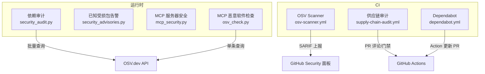
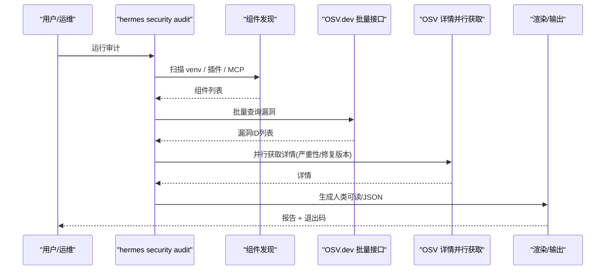
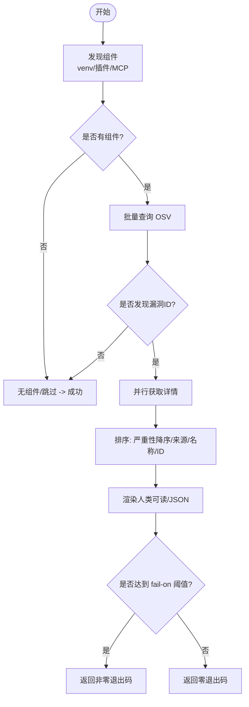
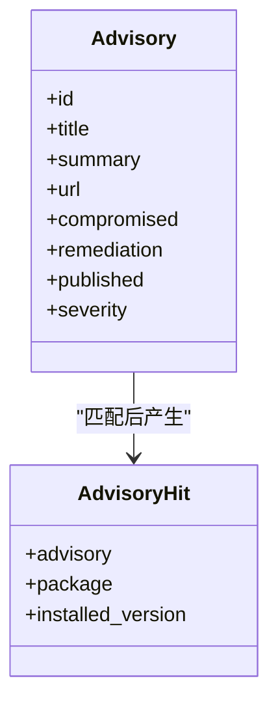
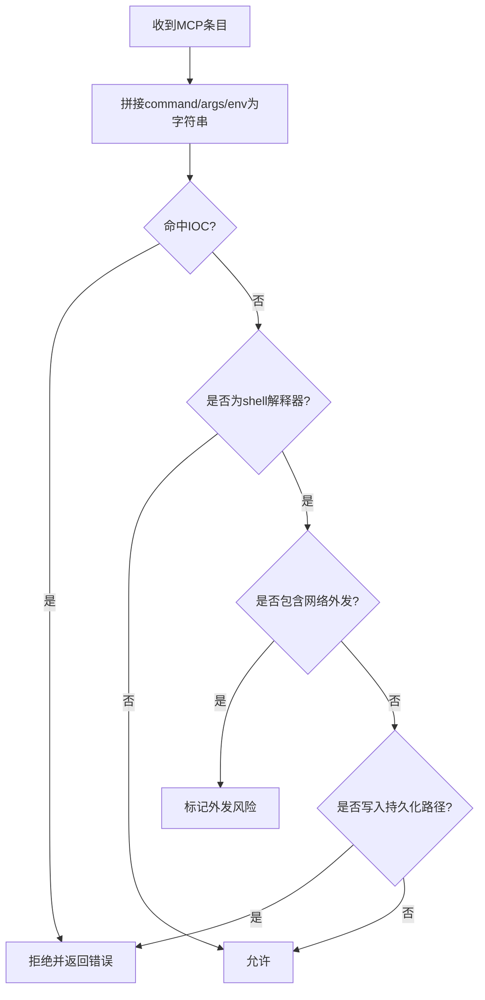
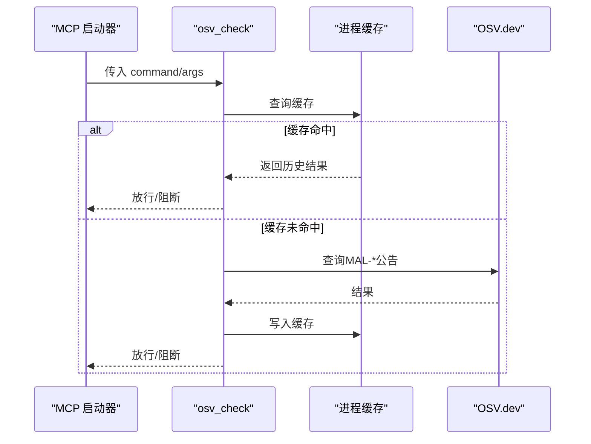
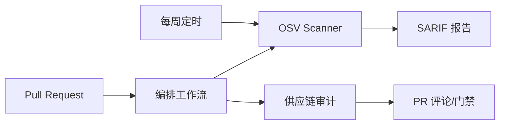
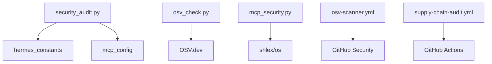

# 安全审计

<cite>
**本文引用的文件**
- [hermes_cli/security_audit.py](file://hermes_cli/security_audit.py)
- [hermes_cli/security_advisories.py](file://hermes_cli/security_advisories.py)
- [tools/osv_check.py](file://tools/osv_check.py)
- [hermes_cli/mcp_security.py](file://hermes_cli/mcp_security.py)
- [.github/workflows/osv-scanner.yml](file://.github/workflows/osv-scanner.yml)
- [.github/workflows/supply-chain-audit.yml](file://.github/workflows/supply-chain-audit.yml)
- [.github/dependabot.yml](file://.github/dependabot.yml)
</cite>

## 目录
1. [简介](#简介)
2. [项目结构](#项目结构)
3. [核心组件](#核心组件)
4. [架构总览](#架构总览)
5. [详细组件分析](#详细组件分析)
6. [依赖关系分析](#依赖关系分析)
7. [性能与可扩展性](#性能与可扩展性)
8. [故障排查指南](#故障排查指南)
9. [结论](#结论)
10. [附录：生产基线与合规清单](#附录生产基线与合规清单)

## 简介
本安全审计文档面向 Hermes Agent 的供应链安全与依赖风险管理，覆盖以下目标：
- 依赖包漏洞扫描与严重性分类（基于 OSV.dev）
- 供应链安全与恶意代码检测（CI 流水线与运行时前置检查）
- 组件风险评估（虚拟环境、插件依赖、MCP 服务器）
- 自动化审计流程、定期扫描配置与修复建议
- CI/CD 集成方式与审计报告格式
- 常见问题识别与修复指南
- 生产环境安全基线与合规性检查清单

## 项目结构
仓库围绕“运行时安全”和“CI 安全”两条主线组织：
- 运行时安全
  - 依赖审计：对当前 Python 虚拟环境、用户插件声明、MCP 服务器命令进行组件发现并查询 OSV.dev
  - 已知受损包告警：启动时快速检测已安装的高危包并给出修复指引
  - MCP 服务器安全：阻止可疑 shell 执行、网络外发、持久化写入等高危模式
  - MCP 扩展恶意软件检查：在 npx/uvx 启动前查询 OSV 的 MAL-* 恶意软件公告
- CI 安全
  - OSV 扫描：每周与 PR 触发，扫描锁定文件中的已知漏洞（SARIF 上报）
  - 供应链审计：PR 差异扫描关键危险模式（.pth、base64+exec、install hook 等），并检查无上限依赖
  - Dependabot：仅对 GitHub Actions 进行常规更新；依赖版本提升走安全更新策略

图表来源
- [hermes_cli/security_audit.py:1-590](file://hermes_cli/security_audit.py#L1-L590)
- [tools/osv_check.py:1-219](file://tools/osv_check.py#L1-L219)
- [.github/workflows/osv-scanner.yml:1-142](file://.github/workflows/osv-scanner.yml#L1-L142)
- [.github/workflows/supply-chain-audit.yml:1-309](file://.github/workflows/supply-chain-audit.yml#L1-L309)
- [.github/dependabot.yml:1-45](file://.github/dependabot.yml#L1-L45)

章节来源
- [hermes_cli/security_audit.py:1-590](file://hermes_cli/security_audit.py#L1-L590)
- [tools/osv_check.py:1-219](file://tools/osv_check.py#L1-L219)
- [.github/workflows/osv-scanner.yml:1-142](file://.github/workflows/osv-scanner.yml#L1-L142)
- [.github/workflows/supply-chain-audit.yml:1-309](file://.github/workflows/supply-chain-audit.yml#L1-L309)
- [.github/dependabot.yml:1-45](file://.github/dependabot.yml#L1-L45)

## 核心组件
- 依赖审计（OSV 批量查询）
  - 扫描范围：Python 虚拟环境、用户插件 requirements/pyproject 精确版本、MCP 服务器命令中解析出的 npx/uvx 包
  - 严重性：从 OSV 记录提取 CVSS/GHSA 等级，统一映射到 UNKNOWN/LOW/MODERATE/MEDIUM/HIGH/CRITICAL
  - 输出：人类可读文本与 JSON，支持 --fail-on 阈值控制退出码
- 已知受损包告警
  - 轻量启动检查：通过 importlib.metadata 探测已安装包版本，匹配已知受损列表
  - 可忽略机制：用户可通过配置确认已处理，避免重复打扰
- MCP 服务器安全
  - 保存与启动双重校验：拒绝 IOC 命中、shell 解释器+网络外发、写入系统持久化路径等
- MCP 恶意软件检查
  - 启动前查询 OSV 的 MAL-* 恶意软件公告，失败放行（fail-open）
  - 进程内缓存结果，避免高频重连导致 DNS 风暴
- CI 安全
  - OSV Scanner：扫描锁定文件，生成 SARIF 报告至安全面板
  - 供应链审计：PR 差异扫描高危模式，限制无上限依赖
  - Dependabot：仅自动更新 GitHub Actions，依赖版本提升由安全更新驱动

章节来源
- [hermes_cli/security_audit.py:1-590](file://hermes_cli/security_audit.py#L1-L590)
- [hermes_cli/security_advisories.py:1-454](file://hermes_cli/security_advisories.py#L1-L454)
- [hermes_cli/mcp_security.py:1-182](file://hermes_cli/mcp_security.py#L1-L182)
- [tools/osv_check.py:1-219](file://tools/osv_check.py#L1-L219)
- [.github/workflows/osv-scanner.yml:1-142](file://.github/workflows/osv-scanner.yml#L1-L142)
- [.github/workflows/supply-chain-audit.yml:1-309](file://.github/workflows/supply-chain-audit.yml#L1-L309)
- [.github/dependabot.yml:1-45](file://.github/dependabot.yml#L1-L45)

## 架构总览
下图展示运行时与 CI 的安全链路：

图表来源
- [hermes_cli/security_audit.py:414-481](file://hermes_cli/security_audit.py#L414-L481)
- [hermes_cli/security_audit.py:285-330](file://hermes_cli/security_audit.py#L285-L330)
- [hermes_cli/security_audit.py:386-408](file://hermes_cli/security_audit.py#L386-L408)

## 详细组件分析

### 依赖审计（OSV 批量查询）
- 组件发现
  - 虚拟环境：遍历当前 Python 环境的已安装包
  - 插件依赖：解析 ~/.hermes/plugins 下的 requirements.txt 与 pyproject.toml，仅提取精确 pin 版本
  - MCP 服务器：从 config.yaml 的 command/args 解析 npx/uvx 形式的包名与版本
- OSV 查询
  - 批量接口：按最大批次大小分片提交查询，返回每个组件的漏洞 ID 列表
  - 详情获取：并发拉取每条漏洞的严重性与修复版本
- 严重性分类
  - 优先使用数据库特定字段或生态特定字段；否则根据 CVSS 分数映射等级
- 输出与门禁
  - 人类可读：按来源分组列出严重性、包名、版本、漏洞 ID、摘要与修复版本
  - JSON：包含扫描总数、发现数、每项明细
  - 退出码：当存在达到或超过 --fail-on 阈值的漏洞时返回非零

图表来源
- [hermes_cli/security_audit.py:84-280](file://hermes_cli/security_audit.py#L84-L280)
- [hermes_cli/security_audit.py:300-408](file://hermes_cli/security_audit.py#L300-L408)
- [hermes_cli/security_audit.py:487-590](file://hermes_cli/security_audit.py#L487-L590)

章节来源
- [hermes_cli/security_audit.py:1-590](file://hermes_cli/security_audit.py#L1-L590)

### 已知受损包告警
- 设计目标
  - 低成本：每次 CLI 启动仅做必要检查
  - 高信号：仅在检测到已知受损包时提示
  - 可确认：支持用户确认并持久化，避免重复打扰
- 实现要点
  - 使用 importlib.metadata 读取已安装包版本
  - 维护已知受损包清单（含受影响版本集合）
  - 提供短横幅与完整修复步骤，支持 doctor 子命令查看与确认
- 启动门控
  - 24 小时缓存最近显示时间，避免频繁弹窗

图表来源
- [hermes_cli/security_advisories.py:66-129](file://hermes_cli/security_advisories.py#L66-L129)
- [hermes_cli/security_advisories.py:137-188](file://hermes_cli/security_advisories.py#L137-L188)

章节来源
- [hermes_cli/security_advisories.py:1-454](file://hermes_cli/security_advisories.py#L1-L454)

### MCP 服务器安全
- 保护面
  - 保存时校验：防止恶意配置写入
  - 启动时校验：防止已植入配置被执行
- 规则
  - IOC 黑名单：硬编码指标（如已知攻击者公钥、IP 段）直接拒绝
  - Shell 解释器+网络外发：禁止 bash/sh/powershell 等配合 curl/wget/nc 等外发工具
  - 系统持久化写入：禁止写入 SSH/PAM/sudoers/cron/rc 等敏感路径
- 输出
  - 返回问题描述，供上层拒绝或警告

图表来源
- [hermes_cli/mcp_security.py:33-88](file://hermes_cli/mcp_security.py#L33-L88)
- [hermes_cli/mcp_security.py:121-182](file://hermes_cli/mcp_security.py#L121-L182)

章节来源
- [hermes_cli/mcp_security.py:1-182](file://hermes_cli/mcp_security.py#L1-L182)

### MCP 恶意软件检查（osv_check）
- 触发时机：在通过 npx/uvx 启动 MCP 服务器之前
- 行为
  - 推断生态（npm/PyPI）与包名/版本
  - 查询 OSV 的 MAL-* 恶意软件公告
  - 失败放行（fail-open），不阻塞正常流程
  - 进程内缓存结果，避免高频重连造成 DNS 风暴
- 输出
  - 若发现恶意软件公告，返回阻断消息；否则放行

图表来源
- [tools/osv_check.py:27-39](file://tools/osv_check.py#L27-L39)
- [tools/osv_check.py:66-111](file://tools/osv_check.py#L66-L111)
- [tools/osv_check.py:194-219](file://tools/osv_check.py#L194-L219)

章节来源
- [tools/osv_check.py:1-219](file://tools/osv_check.py#L1-L219)

### CI/CD 集成与定期扫描
- OSV Scanner
  - 触发：PR/推送、每周定时、手动触发
  - 扫描对象：锁定文件（uv.lock、package-lock.json 等）
  - 输出：SARIF 文件上传至 GitHub Security 面板；不阻断合并（fail-on-vuln=false）
- 供应链审计
  - 触发：PR 调用（由编排工作流根据变更路径决定）
  - 扫描内容：.pth 文件、base64+exec/eval、subprocess 混淆、install hook 修改、无上限依赖
  - 输出：PR 评论状态与门禁（critical findings 需人工复核）
- Dependabot
  - 仅对 GitHub Actions 进行常规更新；依赖版本提升走安全更新策略（CVE 驱动）

图表来源
- [.github/workflows/osv-scanner.yml:1-142](file://.github/workflows/osv-scanner.yml#L1-L142)
- [.github/workflows/supply-chain-audit.yml:1-309](file://.github/workflows/supply-chain-audit.yml#L1-L309)
- [.github/dependabot.yml:1-45](file://.github/dependabot.yml#L1-L45)

章节来源
- [.github/workflows/osv-scanner.yml:1-142](file://.github/workflows/osv-scanner.yml#L1-L142)
- [.github/workflows/supply-chain-audit.yml:1-309](file://.github/workflows/supply-chain-audit.yml#L1-L309)
- [.github/dependabot.yml:1-45](file://.github/dependabot.yml#L1-L45)

## 依赖关系分析
- 运行时模块耦合
  - security_audit.py 依赖 hermes_constants 获取用户目录，依赖 mcp_config 解析 MCP 配置
  - osv_check.py 独立于主程序，仅依赖标准库与 OSV 接口
  - mcp_security.py 被保存与启动路径复用，确保配置与执行一致性
- CI 工作流解耦
  - osv-scanner.yml 与 supply-chain-audit.yml 职责正交：前者关注锁定文件已知漏洞，后者关注 PR 差异中的高风险模式
  - dependabot.yml 仅管理 Actions 版本，避免与依赖 pin 策略冲突

图表来源
- [hermes_cli/security_audit.py:33-39](file://hermes_cli/security_audit.py#L33-L39)
- [tools/osv_check.py:24-25](file://tools/osv_check.py#L24-L25)
- [.github/workflows/osv-scanner.yml:34-38](file://.github/workflows/osv-scanner.yml#L34-L38)
- [.github/workflows/supply-chain-audit.yml:49-51](file://.github/workflows/supply-chain-audit.yml#L49-L51)

章节来源
- [hermes_cli/security_audit.py:1-590](file://hermes_cli/security_audit.py#L1-L590)
- [tools/osv_check.py:1-219](file://tools/osv_check.py#L1-L219)
- [.github/workflows/osv-scanner.yml:1-142](file://.github/workflows/osv-scanner.yml#L1-L142)
- [.github/workflows/supply-chain-audit.yml:1-309](file://.github/workflows/supply-chain-audit.yml#L1-L309)

## 性能与可扩展性
- 批量查询与并发
  - OSV 批量接口按固定批次大小分片，详情获取使用线程池并发，降低端到端延迟
- 缓存策略
  - MCP 恶意软件检查使用进程内缓存，TTL 与容量可配置，避免高频重连导致的 DNS 风暴
- 可扩展点
  - 新增受损包告警只需在清单中添加条目
  - 新增 MCP 规则只需扩展正则与 IOC 列表
  - CI 可新增扫描规则或调整门禁策略

[本节为通用指导，无需具体文件引用]

## 故障排查指南
- OSV 查询失败
  - 现象：审计失败或详情缺失
  - 原因：网络超时、连接错误、解析异常
  - 处理：重试或降级为未知严重性；CI 中 OSV Scanner 不阻断合并
- MCP 启动被阻断
  - 现象：启动时报错“BLOCKED”
  - 原因：命中 MAL-* 恶意软件公告
  - 处理：更换可信镜像/包源，核查上游公告
- 告警重复出现
  - 现象：启动横幅反复提示
  - 原因：未确认或未清理受损包
  - 处理：执行修复步骤并通过 doctor 确认
- CI 门禁失败
  - 现象：PR 评论要求 action_required
  - 原因：检测到 .pth/base64+exec/install hook/无上限依赖
  - 处理：按评论指引修复，必要时添加 ci-reviewed 标签并经人工复核

章节来源
- [hermes_cli/security_audit.py:539-590](file://hermes_cli/security_audit.py#L539-L590)
- [tools/osv_check.py:91-111](file://tools/osv_check.py#L91-L111)
- [.github/workflows/supply-chain-audit.yml:68-159](file://.github/workflows/supply-chain-audit.yml#L68-L159)
- [.github/workflows/supply-chain-audit.yml:180-256](file://.github/workflows/supply-chain-audit.yml#L180-L256)

## 结论
本项目构建了“运行时+CI”的双层安全体系：
- 运行时：对依赖、插件、MCP 进行持续评估与防护，结合 OSV 数据与本地规则，兼顾安全性与可用性
- CI：以高信号规则聚焦供应链攻击特征，配合锁定文件扫描与 Dependabot 策略，形成闭环
建议在生产环境中严格执行基线与合规清单，确保依赖可控、配置可信、扫描常态化。

[本节为总结，无需具体文件引用]

## 附录：生产基线与合规清单
- 依赖管理
  - 所有依赖使用锁定文件（uv.lock/package-lock.json）精确 pin
  - 禁止无上限 PyPI 依赖（需添加 <next_major 上界）
  - 启用 Dependabot 安全更新（CVE 驱动），仅对 GitHub Actions 进行常规更新
- 扫描与门禁
  - 开启 OSV Scanner 每周扫描与 PR 扫描，结果上报安全面板
  - 供应链审计在 PR 中运行，关键发现需人工复核
  - 运行时审计可在部署前执行，--fail-on 设置为 high 或 critical
- 配置与执行
  - MCP 服务器必须通过安全校验（无 IOC、无 shell 外发、无持久化写入）
  - MCP 扩展启动前进行恶意软件检查，阻断 MAL-* 公告
  - 已知受损包需在启动时告警并引导修复
- 审计与报告
  - 审计报告支持 JSON 导出，便于归档与告警集成
  - CI 产物（SARIF、review-status）保留并可追溯
- 合规性
  - 遵循最小权限原则，限制外部命令执行
  - 日志与输出脱敏，避免泄露密钥与敏感信息
  - 定期复测与回归测试，确保规则与策略有效

[本节为通用指导，无需具体文件引用]