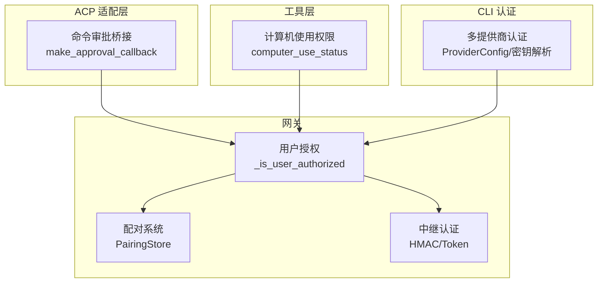
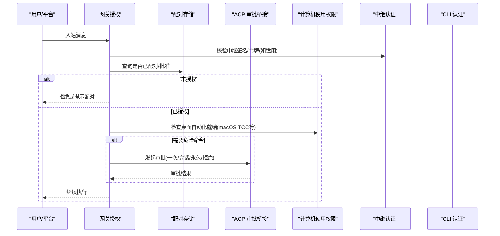
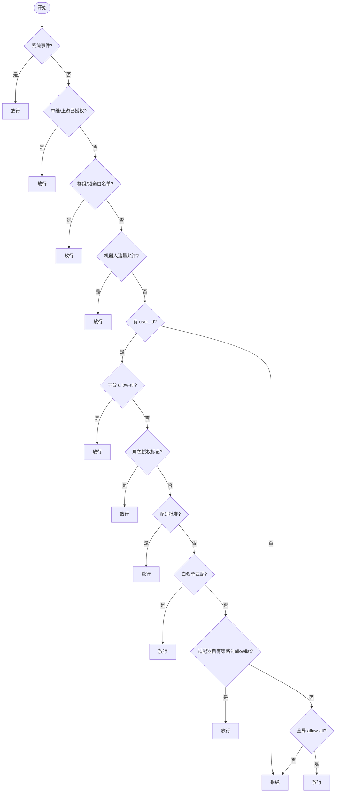
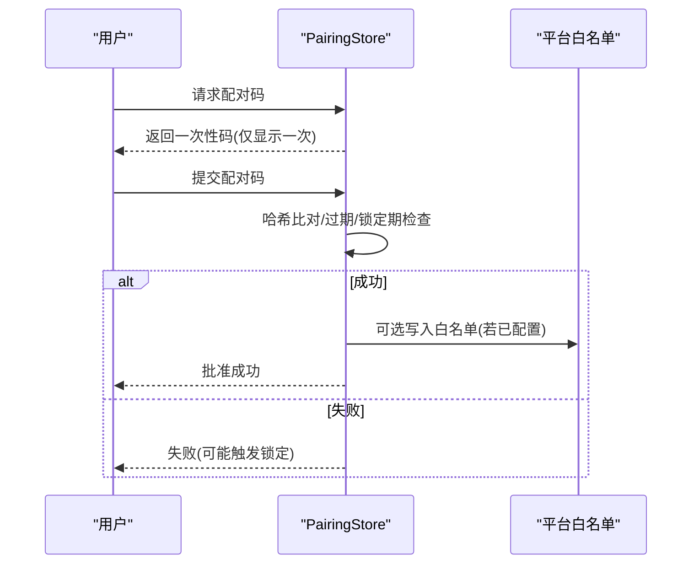
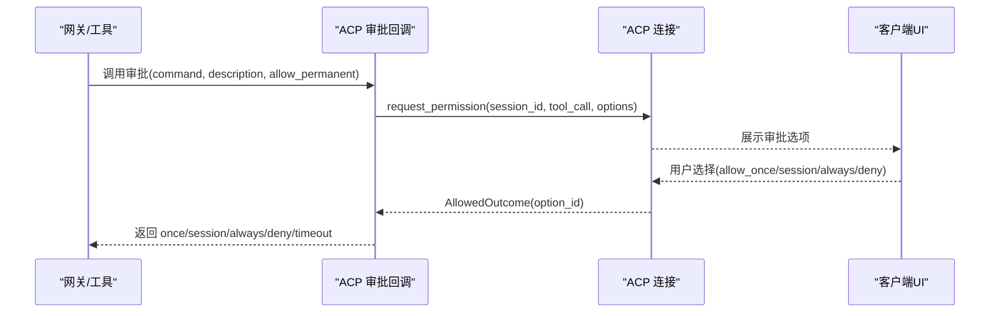
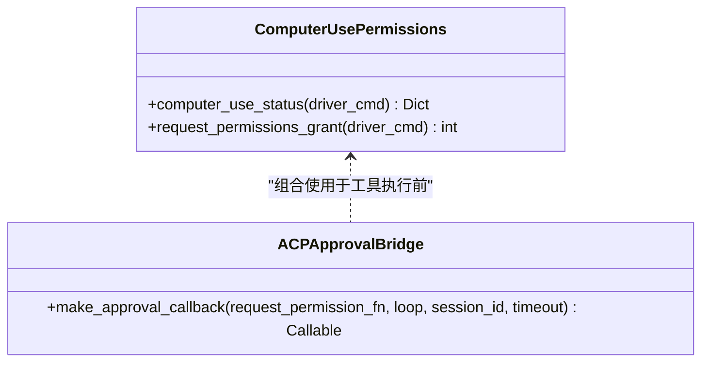
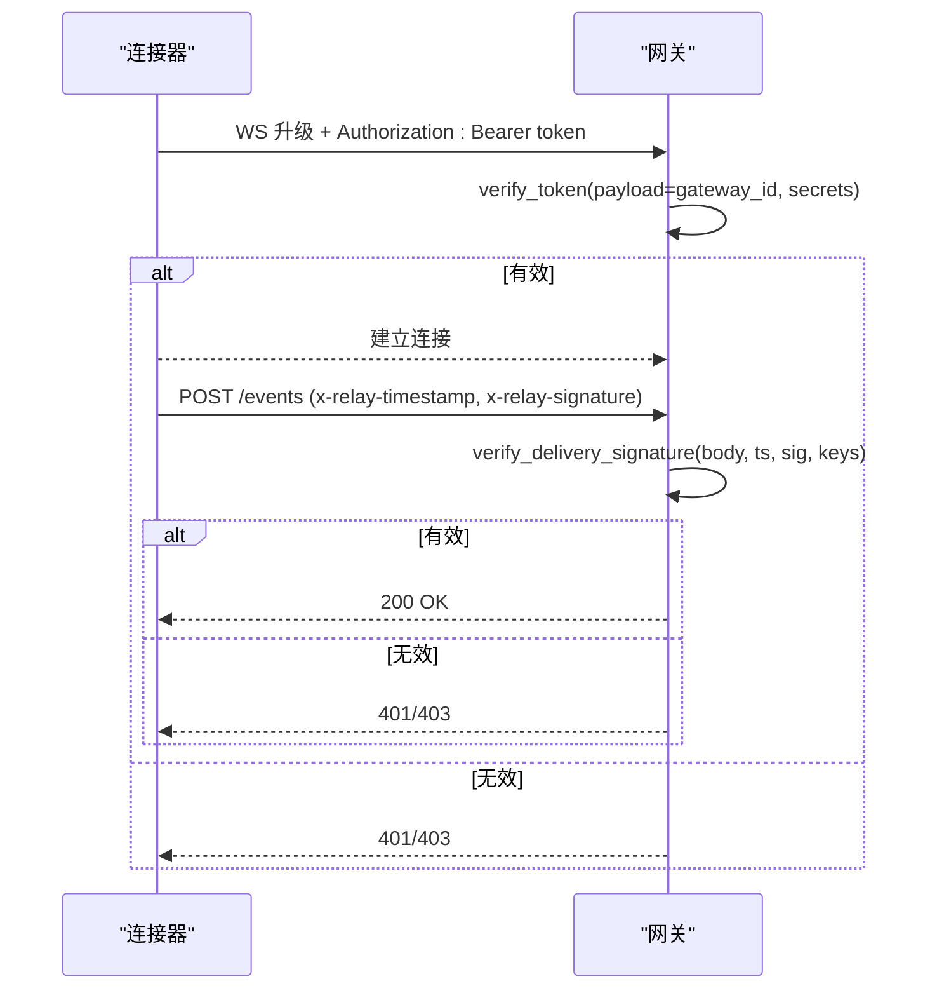
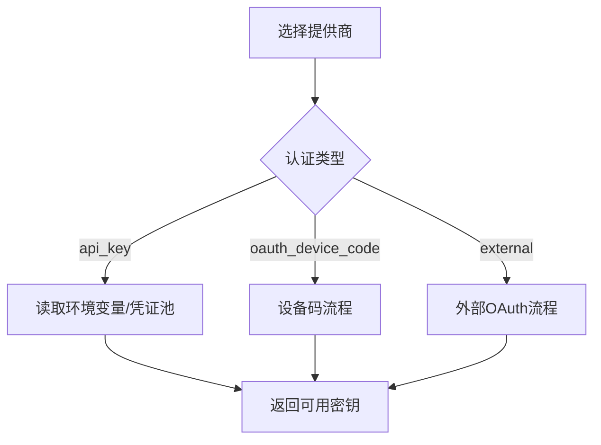
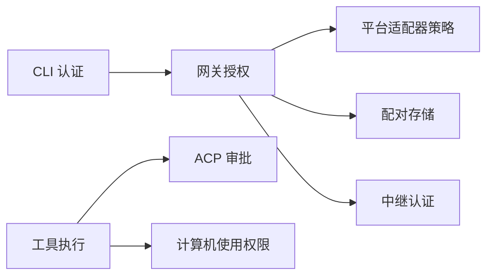

# 授权管理

<cite>
**本文引用的文件**
- [gateway/authz_mixin.py](file://gateway/authz_mixin.py)
- [gateway/pairing.py](file://gateway/pairing.py)
- [acp_adapter/permissions.py](file://acp_adapter/permissions.py)
- [tools/computer_use/permissions.py](file://tools/computer_use/permissions.py)
- [gateway/relay/auth.py](file://gateway/relay/auth.py)
- [hermes_cli/auth.py](file://hermes_cli/auth.py)
</cite>

## 目录
1. [简介](#简介)
2. [项目结构](#项目结构)
3. [核心组件](#核心组件)
4. [架构总览](#架构总览)
5. [详细组件分析](#详细组件分析)
6. [依赖关系分析](#依赖关系分析)
7. [性能与可扩展性](#性能与可扩展性)
8. [故障排查指南](#故障排查指南)
9. [结论](#结论)
10. [附录：生产环境最小权限策略与配置示例](#附录生产环境最小权限策略与配置示例)

## 简介
本文件面向生产环境的授权管理，覆盖基于角色的访问控制（RBAC）思想、命令审批流程、权限检查机制、DM 配对验证、平台特定权限控制、工具调用授权、权限继承与角色定义、策略配置、审计日志与违规检测，以及最小权限原则的落地实践。文档以代码为依据，提供可追溯的文件来源和可视化图示，帮助管理员与安全团队在复杂多平台环境中正确部署与运维。

## 项目结构
授权相关能力分布在网关层、ACP 适配层、工具层与 CLI 认证层：
- 网关授权与 DM 配对：负责入站消息的用户授权、平台白名单、配对码审批、未授权 DM 行为等。
- ACP 命令审批桥接：将危险命令的执行请求通过 ACP 协议向客户端发起“一次性/会话/永久”等审批选项。
- 计算机使用权限：跨平台的桌面自动化能力就绪检查与 macOS TCC 权限授予。
- 中继通道安全：连接器与网关之间的握手与入站签名校验。
- 多提供商认证：CLI 侧的多提供商鉴权与密钥解析。

图表来源
- [gateway/authz_mixin.py:386-783](file://gateway/authz_mixin.py#L386-L783)
- [gateway/pairing.py:405-800](file://gateway/pairing.py#L405-L800)
- [gateway/relay/auth.py:51-169](file://gateway/relay/auth.py#L51-L169)
- [acp_adapter/permissions.py:110-183](file://acp_adapter/permissions.py#L110-L183)
- [tools/computer_use/permissions.py:121-199](file://tools/computer_use/permissions.py#L121-L199)
- [hermes_cli/auth.py:194-507](file://hermes_cli/auth.py#L194-L507)

章节来源
- [gateway/authz_mixin.py:31-88](file://gateway/authz_mixin.py#L31-L88)
- [gateway/pairing.py:46-88](file://gateway/pairing.py#L46-L88)

## 核心组件
- 网关用户授权（GatewayAuthorizationMixin）
  - 统一入口 _is_user_authorized 实现“默认拒绝 + 显式允许”的最小权限模型。
  - 支持平台级 allow-all、环境变量白名单、群组/频道白名单、角色授权标记、配对批准、适配器自有策略信任、全局 allow-all 兜底。
- 配对系统（PairingStore）
  - 生成一次性配对码、哈希存储、过期清理、速率限制、失败锁定、批准/撤销、与平台白名单同步镜像。
- ACP 命令审批桥接
  - 将 Hermes 的危险命令执行请求映射为 ACP 的 PermissionOption（一次/会话/永久/拒绝），并返回 Hermes 语义结果。
- 计算机使用权限
  - 探测驱动健康与 macOS TCC 权限（辅助功能/屏幕录制），提供统一就绪信号。
- 中继认证
  - WebSocket 升级令牌与入站交付签名校验，支持密钥轮换窗口。
- CLI 多提供商认证
  - ProviderConfig 注册表、API Key/OAuth 设备码流、密钥解析与刷新。

章节来源
- [gateway/authz_mixin.py:386-783](file://gateway/authz_mixin.py#L386-L783)
- [gateway/pairing.py:405-800](file://gateway/pairing.py#L405-L800)
- [acp_adapter/permissions.py:18-183](file://acp_adapter/permissions.py#L18-L183)
- [tools/computer_use/permissions.py:121-199](file://tools/computer_use/permissions.py#L121-L199)
- [gateway/relay/auth.py:51-169](file://gateway/relay/auth.py#L51-L169)
- [hermes_cli/auth.py:194-507](file://hermes_cli/auth.py#L194-L507)

## 架构总览
下图展示从入站到执行的授权与审批链路：平台消息进入网关后先进行用户授权；若命中危险操作则触发 ACP 审批；对需要桌面自动化的场景需满足计算机使用权限；中继通道通过 HMAC/Token 保障传输安全；CLI 负责提供商认证与密钥管理。

图表来源
- [gateway/authz_mixin.py:386-783](file://gateway/authz_mixin.py#L386-L783)
- [gateway/pairing.py:609-721](file://gateway/pairing.py#L609-L721)
- [acp_adapter/permissions.py:110-183](file://acp_adapter/permissions.py#L110-L183)
- [tools/computer_use/permissions.py:121-199](file://tools/computer_use/permissions.py#L121-L199)
- [gateway/relay/auth.py:83-169](file://gateway/relay/auth.py#L83-L169)

## 详细组件分析

### 网关用户授权（_is_user_authorized）
- 决策顺序（简化）
  1) 系统事件放行（Home Assistant/Webhook）
  2) 中继上游已授权或适配器声明由上游授权
  3) 群组/频道按 chat_id 白名单放行
  4) 机器人流量按平台开关放行
  5) 无 user_id 直接拒绝
  6) 平台 allow-all 开关放行
  7) 角色授权标记放行
  8) 配对批准放行
  9) 平台/群组/全局白名单匹配放行
  10) 适配器自有策略且为 allowlist 时信任其准入
  11) 全局 allow-all 兜底
- 关键特性
  - 多租户/多 profile 隔离：通过 pairing_stores 与 adapter 查找逻辑保证隔离。
  - 防误配：当无白名单时默认拒绝，避免“开放”策略被误用。
  - 兼容历史：Telegram 群组旧变量兼容处理。

图表来源
- [gateway/authz_mixin.py:386-783](file://gateway/authz_mixin.py#L386-L783)

章节来源
- [gateway/authz_mixin.py:386-783](file://gateway/authz_mixin.py#L386-L783)

### DM 配对验证（PairingStore）
- 安全设计
  - 8 位不混淆字符集、密码学随机、1 小时过期、每平台最多 3 个待处理、10 分钟速率限制、5 次失败锁定 1 小时。
  - 仅持久化哈希+盐，禁止明文泄露。
  - 文件写入采用原子替换与 0600 权限。
- 工作流
  - generate_code：生成并保存哈希条目，记录速率限制。
  - approve_code/approve_request：校验哈希或 request_id，成功后加入 approved 列表并可选镜像到平台白名单。
  - revoke：从 approved 移除并清理白名单镜像与运行时快照。
  - list_pending：仅暴露 request_id，不暴露配对码。

图表来源
- [gateway/pairing.py:609-721](file://gateway/pairing.py#L609-L721)
- [gateway/pairing.py:175-201](file://gateway/pairing.py#L175-L201)
- [gateway/pairing.py:292-327](file://gateway/pairing.py#L292-L327)

章节来源
- [gateway/pairing.py:46-88](file://gateway/pairing.py#L46-L88)
- [gateway/pairing.py:405-800](file://gateway/pairing.py#L405-L800)

### 命令审批流程（ACP 桥接）
- 将 Hermes 的“危险命令”执行请求转换为 ACP 的 PermissionOption：
  - 允许一次 / 允许会话 / 允许永久 / 拒绝 / 总是拒绝（视 SDK 支持）。
- 回调封装：
  - 构建 ToolCallUpdate 用于 UI 展示。
  - 异步调度 request_permission，超时返回 timeout，异常返回 deny。
  - 将 AllowedOutcome.option_id 映射回 Hermes 语义（once/session/always/deny）。

图表来源
- [acp_adapter/permissions.py:41-107](file://acp_adapter/permissions.py#L41-L107)
- [acp_adapter/permissions.py:110-183](file://acp_adapter/permissions.py#L110-L183)

章节来源
- [acp_adapter/permissions.py:18-183](file://acp_adapter/permissions.py#L18-L183)

### 平台特定权限控制与工具调用授权
- 计算机使用权限（macOS/Windows/Linux）
  - 统一状态：ready、can_grant、checks、source、error。
  - macOS：检查 Accessibility 与 Screen Recording 两个 TCC 权限；可通过 grant 拉起系统对话框。
  - 其他平台：以驱动健康为准。
- 工具调用授权
  - 终端工具输出敏感信息脱敏（测试用例覆盖错误与正常路径）。
  - 危险命令执行前走 ACP 审批，结合平台/会话/永久策略。

图表来源
- [tools/computer_use/permissions.py:121-199](file://tools/computer_use/permissions.py#L121-L199)
- [acp_adapter/permissions.py:110-183](file://acp_adapter/permissions.py#L110-L183)

章节来源
- [tools/computer_use/permissions.py:121-199](file://tools/computer_use/permissions.py#L121-L199)
- [acp_adapter/permissions.py:110-183](file://acp_adapter/permissions.py#L110-L183)

### 中继通道安全（连接器↔网关）
- WebSocket 升级令牌：gateway→connector 携带 Authorization Bearer token，payload=gateway_id，带 TTL。
- 入站交付签名：connector→gateway 携带 x-relay-timestamp 与 x-relay-signature，基于 body 字节计算 HMAC-SHA256，支持密钥轮换窗口。
- 常量时间比较与长度校验，防止时序攻击。

图表来源
- [gateway/relay/auth.py:83-169](file://gateway/relay/auth.py#L83-L169)

章节来源
- [gateway/relay/auth.py:51-169](file://gateway/relay/auth.py#L51-L169)

### 多提供商认证（CLI）
- ProviderConfig 注册表集中管理各提供商的认证类型、端点、作用域与环境变量。
- API Key 优先从 ~/.hermes/.env 读取，其次进程环境，再尝试凭证池。
- OAuth 设备码流与外部 OAuth 流程支持多种提供商。

图表来源
- [hermes_cli/auth.py:194-507](file://hermes_cli/auth.py#L194-L507)

章节来源
- [hermes_cli/auth.py:194-507](file://hermes_cli/auth.py#L194-L507)

## 依赖关系分析
- 耦合与内聚
  - 网关授权模块高度内聚，职责单一（入站授权），通过方法抽象与懒加载避免循环依赖。
  - 配对系统与白名单解耦，仅在批准/撤销时同步镜像，降低写放大。
  - ACP 审批桥接与具体平台无关，仅依赖 ACP schema。
- 外部依赖
  - 平台适配器：dm_policy/group_policy/enforces_own_access_policy 等标志影响授权决策。
  - 操作系统：macOS TCC 权限、文件系统权限。
  - 网络：中继通道的 HMAC/Token 校验。
- 潜在风险
  - 适配器策略误配导致“开放”策略被误认为授权（已通过严格判断避免）。
  - 环境变量在多 profile 下泄漏（已通过 secret_scope 与 multiplex 保护）。

图表来源
- [gateway/authz_mixin.py:386-783](file://gateway/authz_mixin.py#L386-L783)
- [gateway/pairing.py:405-800](file://gateway/pairing.py#L405-L800)
- [gateway/relay/auth.py:83-169](file://gateway/relay/auth.py#L83-L169)
- [acp_adapter/permissions.py:110-183](file://acp_adapter/permissions.py#L110-L183)
- [tools/computer_use/permissions.py:121-199](file://tools/computer_use/permissions.py#L121-L199)
- [hermes_cli/auth.py:194-507](file://hermes_cli/auth.py#L194-L507)

章节来源
- [gateway/authz_mixin.py:386-783](file://gateway/authz_mixin.py#L386-L783)
- [gateway/pairing.py:405-800](file://gateway/pairing.py#L405-L800)

## 性能与可扩展性
- 性能要点
  - 授权路径尽量短路：系统事件、中继上游、群组白名单、allow-all、角色标记等快速放行。
  - 配对存储读写加锁，避免并发竞争；TTL 清理减少数据膨胀。
  - ACP 审批异步调度，避免阻塞主循环；超时与异常快速降级为 deny。
- 可扩展性
  - 平台扩展：新增平台只需声明 allowed_users_env/allow_all_env 并在授权映射中补齐。
  - 策略扩展：可在适配器层增加 dm_policy/group_policy 以细粒度控制。
  - 多 profile：通过 pairing_stores 与 adapter 查找实现隔离。

[本节为通用指导，无需引用具体文件]

## 故障排查指南
- 无法通过授权
  - 检查平台 allow-all 开关、环境变量白名单、群组白名单、配对批准、适配器策略是否为 allowlist。
  - 确认中继上游是否已授权（delivered_via_upstream_relay 或 authorization_is_upstream）。
- 配对码问题
  - 确认未处于锁定期、未超过速率限制、未超过最大待处理数。
  - 检查 pending.json 权限与可读性（Docker 常见 uid/mode 问题）。
- ACP 审批超时
  - 检查事件循环调度是否成功、超时设置是否合理、客户端是否响应。
- 计算机使用权限不可用
  - macOS：确认 Accessibility 与 Screen Recording 已授予；必要时运行 grant 流程。
  - 其他平台：确认驱动健康状态。
- 中继签名失败
  - 检查 x-relay-timestamp 是否在容差范围内、x-relay-signature 是否正确、密钥轮换是否生效。

章节来源
- [gateway/authz_mixin.py:386-783](file://gateway/authz_mixin.py#L386-L783)
- [gateway/pairing.py:467-500](file://gateway/pairing.py#L467-L500)
- [acp_adapter/permissions.py:151-171](file://acp_adapter/permissions.py#L151-L171)
- [tools/computer_use/permissions.py:121-199](file://tools/computer_use/permissions.py#L121-L199)
- [gateway/relay/auth.py:142-169](file://gateway/relay/auth.py#L142-L169)

## 结论
该授权体系以“默认拒绝 + 显式允许”为核心，结合平台白名单、配对审批、中继安全、工具审批与计算机使用权限，形成覆盖端到端的访问控制闭环。通过多 profile 隔离、适配器策略信任边界、密钥轮换与常量时间校验，满足生产环境的安全与合规要求。建议在生产中严格遵循最小权限原则，启用必要的审批与审计，持续监控与演练。

[本节为总结，无需引用具体文件]

## 附录：生产环境最小权限策略与配置示例
- 角色与权限分层（概念性）
  - 管理员：可管理配对、查看/调整白名单、配置中继密钥、审批高危操作。
  - 普通用户：经配对或白名单授权后可使用受限工具与命令。
  - 受限权限：仅允许只读或受限范围的工具调用，必须经过审批。
- 策略配置要点
  - 开启平台 allow-all 需谨慎，建议仅用于受控环境。
  - 明确配置各平台的 allowed_users_env 与 group_allowed_chats。
  - 启用中继认证并配置密钥轮换窗口。
  - 对危险命令启用 ACP 审批，默认 deny，按需允许一次/会话/永久。
  - macOS 上确保 TCC 权限已授予，必要时提供一键 grant。
- 审计与违规检测
  - 记录授权决策关键点（来源、策略、结果）。
  - 监测配对码生成/批准/失败次数，识别暴力破解。
  - 监控中继签名失败率与延迟，及时告警。
  - 对工具输出中的敏感信息进行脱敏，避免泄露。

[本节为通用指导，无需引用具体文件]