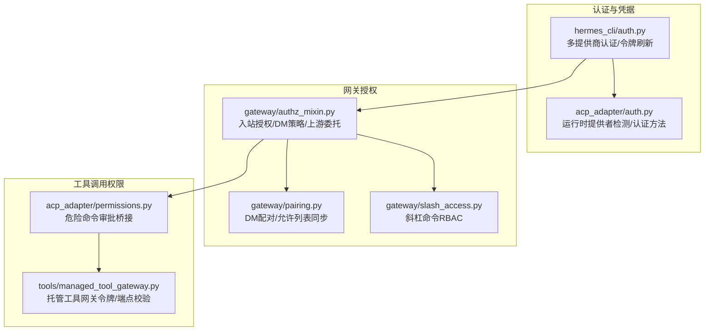
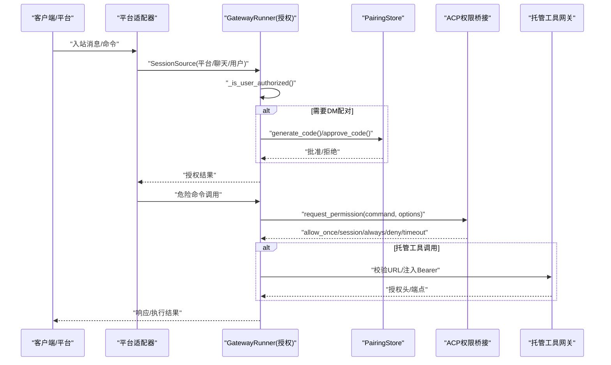
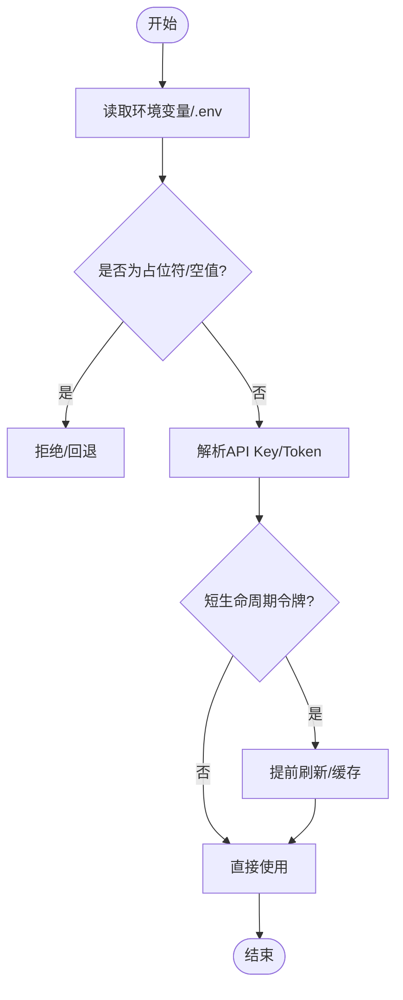
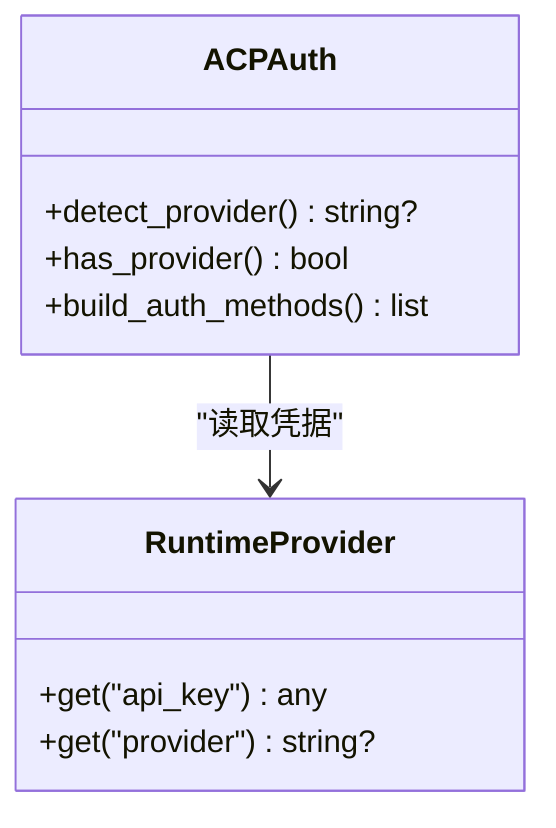
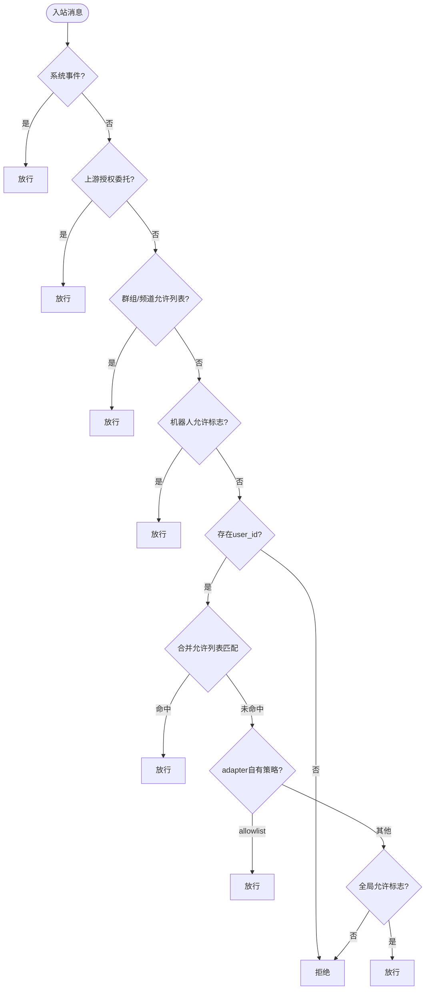
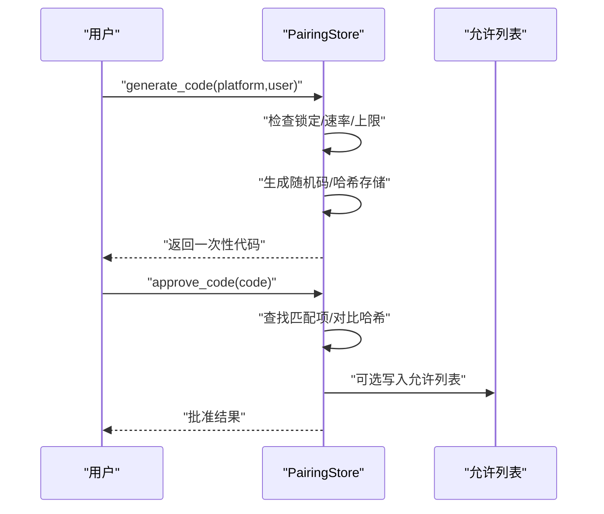
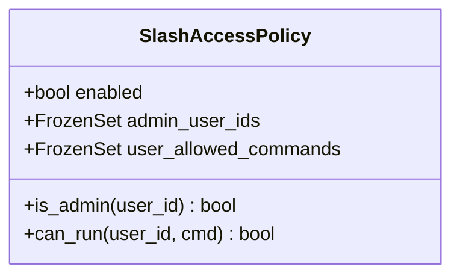
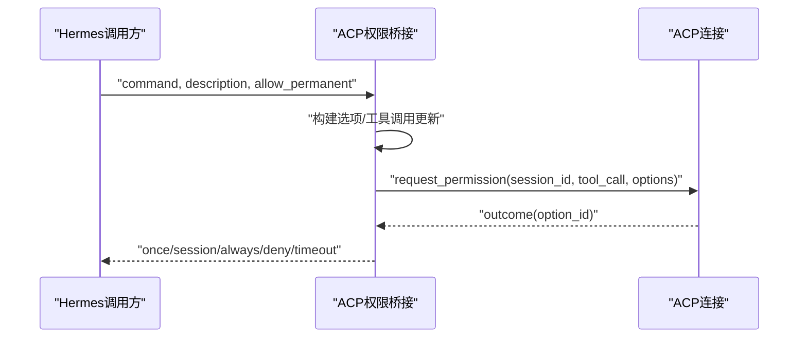
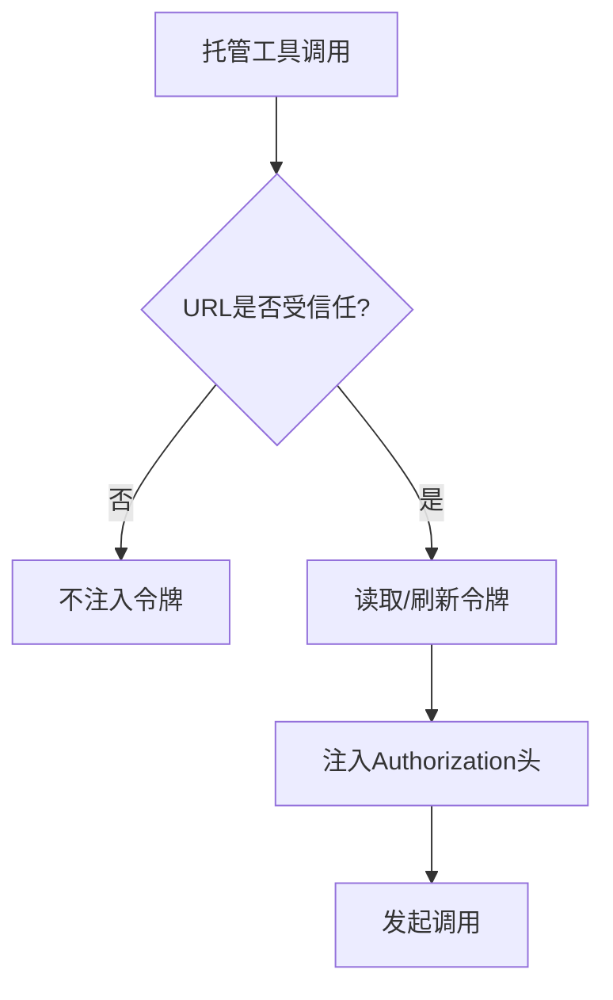
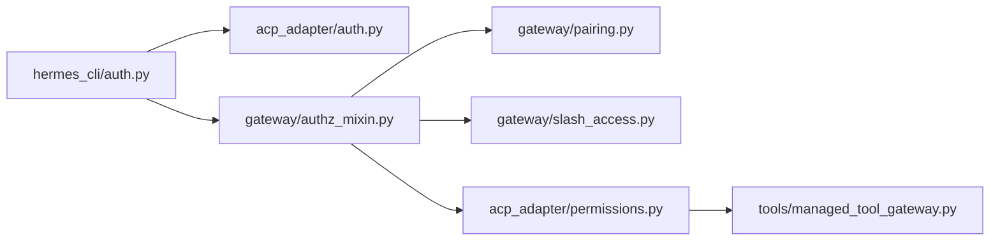

# 访问控制

<cite>
**本文引用的文件**
- [acp_adapter/auth.py](file://acp_adapter/auth.py)
- [acp_adapter/permissions.py](file://acp_adapter/permissions.py)
- [gateway/authz_mixin.py](file://gateway/authz_mixin.py)
- [gateway/pairing.py](file://gateway/pairing.py)
- [gateway/slash_access.py](file://gateway/slash_access.py)
- [hermes_cli/auth.py](file://hermes_cli/auth.py)
- [tools/managed_tool_gateway.py](file://tools/managed_tool_gateway.py)
</cite>

## 目录
1. [简介](#简介)
2. [项目结构](#项目结构)
3. [核心组件](#核心组件)
4. [架构总览](#架构总览)
5. [详细组件分析](#详细组件分析)
6. [依赖关系分析](#依赖关系分析)
7. [性能与可扩展性](#性能与可扩展性)
8. [故障排查指南](#故障排查指南)
9. [结论](#结论)
10. [附录：生产基线与合规要求](#附录生产基线与合规要求)

## 简介
本文件系统性说明 Hermes Agent 的访问控制体系，覆盖用户身份验证、令牌管理、API 密钥保护、多租户隔离、命令审批流程、DM 配对验证、平台特定权限控制、基于角色的访问控制（RBAC）、会话级权限管理与工具调用权限检查。文档同时提供权限配置示例、安全最佳实践、常见权限问题排查方法与审计日志分析建议，并给出生产环境的权限基线配置与合规性要求。

## 项目结构
访问控制由多个子系统协作完成：
- 认证与凭据：CLI 层的多提供商认证、令牌刷新与 API Key 解析；ACP 适配器中的运行时提供者检测与认证方法声明。
- 网关授权：入站消息的用户/聊天授权、平台 DM/群组策略、上游授权委托、未授权 DM 行为。
- DM 配对：一次性配对码生成、哈希存储、速率限制、锁定与批准流程，以及与允许列表的同步。
- 命令访问控制：斜杠命令的细粒度 RBAC（管理员与受限用户命令白名单）。
- 工具调用权限：危险命令的 ACP 权限桥接（请求-审批-执行），以及托管工具网关的令牌注入与端点校验。

**图示来源**
- [hermes_cli/auth.py:211-507](file://hermes_cli/auth.py#L211-L507)
- [acp_adapter/auth.py:11-79](file://acp_adapter/auth.py#L11-L79)
- [gateway/authz_mixin.py:386-783](file://gateway/authz_mixin.py#L386-L783)
- [gateway/pairing.py:405-800](file://gateway/pairing.py#L405-L800)
- [gateway/slash_access.py:56-222](file://gateway/slash_access.py#L56-L222)
- [acp_adapter/permissions.py:110-182](file://acp_adapter/permissions.py#L110-L182)
- [tools/managed_tool_gateway.py:174-325](file://tools/managed_tool_gateway.py#L174-L325)

**章节来源**
- [hermes_cli/auth.py:211-507](file://hermes_cli/auth.py#L211-L507)
- [acp_adapter/auth.py:11-79](file://acp_adapter/auth.py#L11-L79)
- [gateway/authz_mixin.py:386-783](file://gateway/authz_mixin.py#L386-L783)
- [gateway/pairing.py:405-800](file://gateway/pairing.py#L405-L800)
- [gateway/slash_access.py:56-222](file://gateway/slash_access.py#L56-L222)
- [acp_adapter/permissions.py:110-182](file://acp_adapter/permissions.py#L110-L182)
- [tools/managed_tool_gateway.py:174-325](file://tools/managed_tool_gateway.py#L174-L325)

## 核心组件
- 多提供商认证与令牌管理：支持 OAuth 设备码、外部 OAuth、API Key、AWS SDK、Vertex 等；集中注册 ProviderConfig，按优先级解析可用凭据，处理短生命周期令牌刷新与回退。
- 运行时提供者检测与 ACP 认证方法：检测当前运行时的 provider 与 api_key（含可调用式 token 提供者），向 ACP 注册可用的认证方法，确保代理握手成功。
- 网关入站授权：综合平台允许列表、群组/频道允许列表、角色授权标记、上游授权委托、配对批准、全局允许标志等，决定用户是否被授权。
- DM 配对系统：生成一次性配对码（加密随机、哈希存储、TTL、速率限制、失败锁定），批准后将用户写入允许列表或保留在配对存储中，支持别名归一化与撤销。
- 斜杠命令 RBAC：按平台与范围（DM/群组）配置管理员与用户可执行命令集合，默认关闭，启用后非管理员仅能运行白名单命令与内置最小集。
- 危险命令审批桥接：将 Hermes 的危险命令审批映射为 ACP 的权限请求，构建工具调用更新，等待用户/客户端审批结果，超时或缺省视为拒绝。
- 托管工具网关：读取 Nous 订阅者访问令牌，校验目标 URL 是否为受信任网关，注入 Bearer 头，提供媒体上传预签名协议。

**章节来源**
- [hermes_cli/auth.py:211-507](file://hermes_cli/auth.py#L211-L507)
- [acp_adapter/auth.py:11-79](file://acp_adapter/auth.py#L11-L79)
- [gateway/authz_mixin.py:386-783](file://gateway/authz_mixin.py#L386-L783)
- [gateway/pairing.py:405-800](file://gateway/pairing.py#L405-L800)
- [gateway/slash_access.py:56-222](file://gateway/slash_access.py#L56-L222)
- [acp_adapter/permissions.py:110-182](file://acp_adapter/permissions.py#L110-L182)
- [tools/managed_tool_gateway.py:174-325](file://tools/managed_tool_gateway.py#L174-L325)

## 架构总览
下图展示从入站到工具调用的完整访问控制链路：平台适配器接收消息，网关进行用户/聊天授权；若涉及危险命令，则通过 ACP 权限桥接发起审批；对于托管工具调用，需校验网关 URL 并注入令牌。

**图示来源**
- [gateway/authz_mixin.py:386-783](file://gateway/authz_mixin.py#L386-L783)
- [gateway/pairing.py:609-721](file://gateway/pairing.py#L609-L721)
- [acp_adapter/permissions.py:110-182](file://acp_adapter/permissions.py#L110-L182)
- [tools/managed_tool_gateway.py:174-325](file://tools/managed_tool_gateway.py#L174-L325)

## 详细组件分析

### 用户身份验证与令牌管理（CLI 层）
- 多提供商注册：ProviderConfig 集中定义各提供商的认证类型、基础 URL、作用域与环境变量键。
- 凭据解析：优先从 .env 与进程环境读取 API Key；对短生命周期令牌（如 xAI、Nous）设置提前刷新窗口；对特殊提供商（Copilot、Kimi、Z.AI）有专用探测与端点选择逻辑。
- 安全校验：对占位符/空值进行过滤；对本地/远程 base URL 做规范化；对 Z.AI 等多端点场景并行探测并缓存工作端点。

**图示来源**
- [hermes_cli/auth.py:211-507](file://hermes_cli/auth.py#L211-L507)
- [hermes_cli/auth.py:630-671](file://hermes_cli/auth.py#L630-L671)
- [hermes_cli/auth.py:734-799](file://hermes_cli/auth.py#L734-L799)

**章节来源**
- [hermes_cli/auth.py:211-507](file://hermes_cli/auth.py#L211-L507)
- [hermes_cli/auth.py:630-671](file://hermes_cli/auth.py#L630-L671)
- [hermes_cli/auth.py:734-799](file://hermes_cli/auth.py#L734-L799)

### ACP 认证方法与运行时提供者检测
- 检测运行时 provider 与 api_key（字符串或可调用式 token 提供者），避免默认错误 provider 导致握手失败。
- 向 ACP 注册认证方法：当检测到有效 provider 时，注册“运行时凭据”方法；否则提供终端设置方法引导用户配置。

**图示来源**
- [acp_adapter/auth.py:11-79](file://acp_adapter/auth.py#L11-L79)

**章节来源**
- [acp_adapter/auth.py:11-79](file://acp_adapter/auth.py#L11-L79)

### 网关入站授权（用户/聊天授权）
- 授权顺序：
  - 系统事件（Home Assistant/Webhook）直接放行。
  - 上游授权委托（Relay/adapter 标记）直接放行。
  - 群组/频道允许列表（按平台环境变量或 adapter 配置）。
  - 机器人流量允许开关（按平台环境变量）。
  - 无 user_id 直接拒绝。
  - 平台允许列表、群组用户允许列表、全局允许列表合并匹配。
  - 若未配置任何允许列表，且 adapter 自身拥有访问策略，仅在策略为 allowlist 时信任其放行。
  - 最终回退到全局允许标志。
- 多租户隔离：通过 secret_scope 与 multiplex 模式，保证不同 profile 的 allowlist 不互相泄漏。

**图示来源**
- [gateway/authz_mixin.py:386-783](file://gateway/authz_mixin.py#L386-L783)

**章节来源**
- [gateway/authz_mixin.py:386-783](file://gateway/authz_mixin.py#L386-L783)

### DM 配对验证（一次性代码）
- 安全性：使用不可混淆字母表、密码学随机、哈希存储（salt+SHA-256）、TTL 过期、速率限制（每用户每10分钟一次）、失败锁定（5次失败锁定1小时）、文件权限 0600。
- 存储与迁移：支持旧/新目录合并，profile 隔离存储，读写原子替换。
- 与允许列表同步：当平台已配置允许列表时，批准会将用户加入该列表；撤销会移除对应条目并保持别名一致性。

**图示来源**
- [gateway/pairing.py:609-721](file://gateway/pairing.py#L609-L721)
- [gateway/pairing.py:175-201](file://gateway/pairing.py#L175-L201)
- [gateway/pairing.py:292-327](file://gateway/pairing.py#L292-L327)

**章节来源**
- [gateway/pairing.py:405-800](file://gateway/pairing.py#L405-L800)
- [gateway/pairing.py:175-201](file://gateway/pairing.py#L175-L201)
- [gateway/pairing.py:292-327](file://gateway/pairing.py#L292-L327)

### 斜杠命令 RBAC（命令访问控制）
- 策略模型：SlashAccessPolicy 包含 enabled、admin_user_ids、user_allowed_commands。
- 范围区分：DM 与 group/channel 分别配置管理员与用户命令白名单；DM 未指定时可回退到 group 的命令集合。
- 默认最小集：即使未配置白名单，仍允许 help/whoami 等只读命令。

**图示来源**
- [gateway/slash_access.py:56-88](file://gateway/slash_access.py#L56-L88)
- [gateway/slash_access.py:170-222](file://gateway/slash_access.py#L170-L222)

**章节来源**
- [gateway/slash_access.py:56-222](file://gateway/slash_access.py#L56-L222)

### 危险命令审批流程（ACP 权限桥接）
- 选项映射：allow_once/allow_session/allow_always/deny/deny_always 映射到 Hermes 的 once/session/always/deny/timeout。
- 工具调用更新：为每次权限请求生成唯一 tool_call_id，附带命令与描述，状态 pending。
- 超时与异常：超时或缺省结果视为拒绝；调度失败也视为拒绝。

**图示来源**
- [acp_adapter/permissions.py:41-95](file://acp_adapter/permissions.py#L41-L95)
- [acp_adapter/permissions.py:110-182](file://acp_adapter/permissions.py#L110-L182)

**章节来源**
- [acp_adapter/permissions.py:110-182](file://acp_adapter/permissions.py#L110-L182)

### 托管工具网关与令牌注入
- 令牌读取：优先读取显式环境变量覆盖，其次从 auth.json 缓存或刷新获取 Nous 访问令牌。
- 端点校验：仅对受信任的 Nous 工具网关 URL 注入 Authorization: Bearer；对任意 URL 不做信任扩展。
- 媒体上传：预签名 PUT 协议，分阶段超时控制，SSRF 防护用于上传目标。

**图示来源**
- [tools/managed_tool_gateway.py:76-144](file://tools/managed_tool_gateway.py#L76-L144)
- [tools/managed_tool_gateway.py:174-325](file://tools/managed_tool_gateway.py#L174-L325)
- [tools/managed_tool_gateway.py:366-450](file://tools/managed_tool_gateway.py#L366-L450)

**章节来源**
- [tools/managed_tool_gateway.py:76-144](file://tools/managed_tool_gateway.py#L76-L144)
- [tools/managed_tool_gateway.py:174-325](file://tools/managed_tool_gateway.py#L174-L325)
- [tools/managed_tool_gateway.py:366-450](file://tools/managed_tool_gateway.py#L366-L450)

## 依赖关系分析
- 低耦合高内聚：认证、授权、配对、命令访问、工具网关各自职责清晰，通过明确接口交互。
- 关键依赖链：
  - CLI 认证 → 运行时提供者检测 → ACP 认证方法注册。
  - 网关授权 → DM 配对 → 允许列表同步。
  - 网关授权 → ACP 权限桥接 → 托管工具网关令牌注入。
- 潜在循环风险：模块间采用延迟导入与惰性依赖（如 logger 延迟导入），避免 import 时循环。

**图示来源**
- [hermes_cli/auth.py:211-507](file://hermes_cli/auth.py#L211-L507)
- [acp_adapter/auth.py:11-79](file://acp_adapter/auth.py#L11-L79)
- [gateway/authz_mixin.py:386-783](file://gateway/authz_mixin.py#L386-L783)
- [gateway/pairing.py:405-800](file://gateway/pairing.py#L405-L800)
- [gateway/slash_access.py:56-222](file://gateway/slash_access.py#L56-L222)
- [acp_adapter/permissions.py:110-182](file://acp_adapter/permissions.py#L110-L182)
- [tools/managed_tool_gateway.py:174-325](file://tools/managed_tool_gateway.py#L174-L325)

**章节来源**
- [hermes_cli/auth.py:211-507](file://hermes_cli/auth.py#L211-L507)
- [acp_adapter/auth.py:11-79](file://acp_adapter/auth.py#L11-L79)
- [gateway/authz_mixin.py:386-783](file://gateway/authz_mixin.py#L386-L783)
- [gateway/pairing.py:405-800](file://gateway/pairing.py#L405-L800)
- [gateway/slash_access.py:56-222](file://gateway/slash_access.py#L56-L222)
- [acp_adapter/permissions.py:110-182](file://acp_adapter/permissions.py#L110-L182)
- [tools/managed_tool_gateway.py:174-325](file://tools/managed_tool_gateway.py#L174-L325)

## 性能与可扩展性
- 并发与锁：PairingStore 使用线程 RLock 保护读写；Acp 权限请求通过事件循环调度，避免阻塞。
- 网络优化：Z.AI 端点并行探测，快速失败与早返回；短生命周期令牌提前刷新减少抖动。
- 可扩展点：
  - 新增平台：在 platform_registry 中声明 allowed_users_env/allow_all_env，或在 authz_mixin 中补充平台映射。
  - 新增提供商：在 PROVIDER_REGISTRY 中注册 ProviderConfig，必要时添加专用解析逻辑。
  - 新增命令：在 slash_access 中扩展 _ALWAYS_ALLOWED_FOR_USERS 或 per-scope 白名单。

[本节为通用指导，无需具体文件引用]

## 故障排查指南
- 无法登录/认证失败：
  - 检查 CLI 认证状态与令牌有效期；确认 base URL 与 scope 配置正确。
  - 参考路径：[hermes_cli/auth.py:211-507](file://hermes_cli/auth.py#L211-L507)
- 入站消息被拒绝：
  - 检查平台允许列表、群组允许列表、全局允许标志；确认上游授权委托是否正确标记。
  - 参考路径：[gateway/authz_mixin.py:386-783](file://gateway/authz_mixin.py#L386-L783)
- DM 配对无效：
  - 检查配对码是否过期、速率限制、失败锁定；确认哈希匹配与 salt 存储。
  - 参考路径：[gateway/pairing.py:609-721](file://gateway/pairing.py#L609-L721)
- 危险命令审批超时：
  - 检查 ACP 权限请求是否成功调度；确认超时阈值与回调映射。
  - 参考路径：[acp_adapter/permissions.py:110-182](file://acp_adapter/permissions.py#L110-L182)
- 托管工具调用失败：
  - 检查 URL 是否受信任；确认 Nous 访问令牌是否存在且未过期。
  - 参考路径：[tools/managed_tool_gateway.py:174-325](file://tools/managed_tool_gateway.py#L174-L325)

**章节来源**
- [hermes_cli/auth.py:211-507](file://hermes_cli/auth.py#L211-L507)
- [gateway/authz_mixin.py:386-783](file://gateway/authz_mixin.py#L386-L783)
- [gateway/pairing.py:609-721](file://gateway/pairing.py#L609-L721)
- [acp_adapter/permissions.py:110-182](file://acp_adapter/permissions.py#L110-L182)
- [tools/managed_tool_gateway.py:174-325](file://tools/managed_tool_gateway.py#L174-L325)

## 结论
Hermes Agent 的访问控制以“默认拒绝、显式允许”为核心原则，结合多提供商认证、平台策略、DM 配对、命令 RBAC 与工具调用审批，形成多层次的安全边界。生产部署应严格配置允许列表、启用上游授权委托、合理设置超时与速率限制，并通过审计日志持续监控异常行为。

[本节为总结，无需具体文件引用]

## 附录：生产基线与合规要求
- 身份验证与令牌：
  - 启用短生命周期令牌提前刷新；禁止使用占位符/空值；定期轮换 API Key。
  - 参考路径：[hermes_cli/auth.py:211-507](file://hermes_cli/auth.py#L211-L507)
- 平台授权：
  - 为每个网络暴露的平台配置 allowlist 或启用上游授权委托；禁用 open 策略。
  - 参考路径：[gateway/authz_mixin.py:386-783](file://gateway/authz_mixin.py#L386-L783)
- DM 配对：
  - 启用配对码 TTL、速率限制与失败锁定；确保文件权限 0600。
  - 参考路径：[gateway/pairing.py:405-800](file://gateway/pairing.py#L405-L800)
- 命令访问：
  - 启用斜杠命令 RBAC，限制非管理员命令；保留最小只读命令集。
  - 参考路径：[gateway/slash_access.py:56-222](file://gateway/slash_access.py#L56-L222)
- 工具调用：
  - 仅对受信任网关注入令牌；媒体上传使用预签名协议与 SSRF 防护。
  - 参考路径：[tools/managed_tool_gateway.py:174-325](file://tools/managed_tool_gateway.py#L174-L325)
- 审计与监控：
  - 记录授权决策、配对操作、命令审批结果；对异常与超时告警。
  - 参考路径：[acp_adapter/permissions.py:110-182](file://acp_adapter/permissions.py#L110-L182)

**章节来源**
- [hermes_cli/auth.py:211-507](file://hermes_cli/auth.py#L211-L507)
- [gateway/authz_mixin.py:386-783](file://gateway/authz_mixin.py#L386-L783)
- [gateway/pairing.py:405-800](file://gateway/pairing.py#L405-L800)
- [gateway/slash_access.py:56-222](file://gateway/slash_access.py#L56-L222)
- [tools/managed_tool_gateway.py:174-325](file://tools/managed_tool_gateway.py#L174-L325)
- [acp_adapter/permissions.py:110-182](file://acp_adapter/permissions.py#L110-L182)